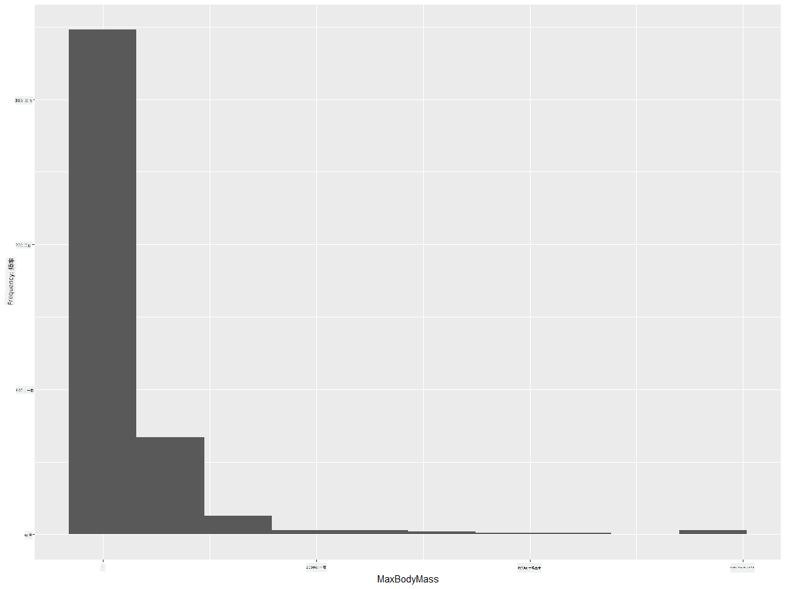
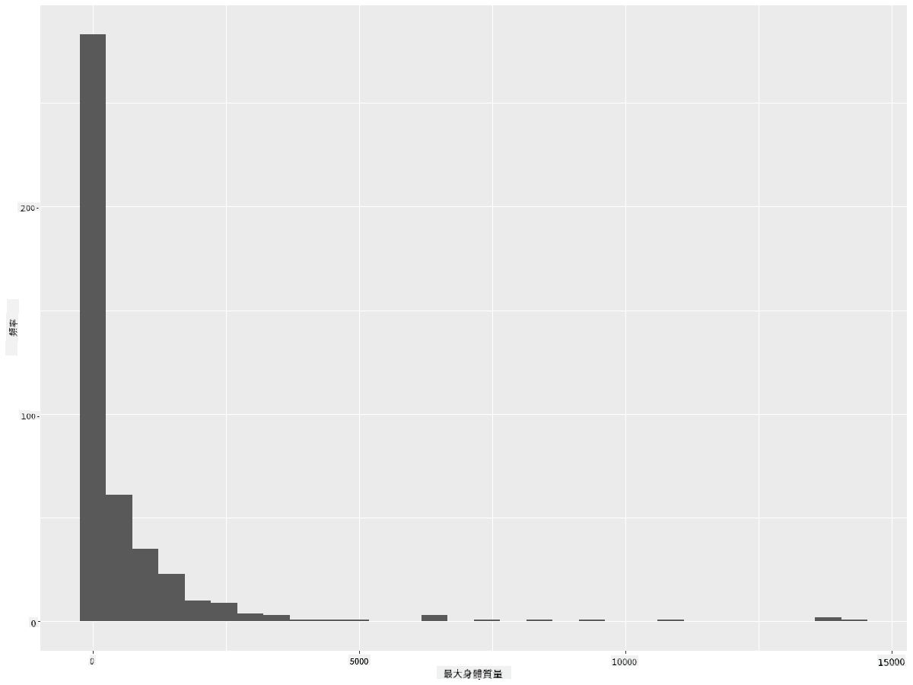
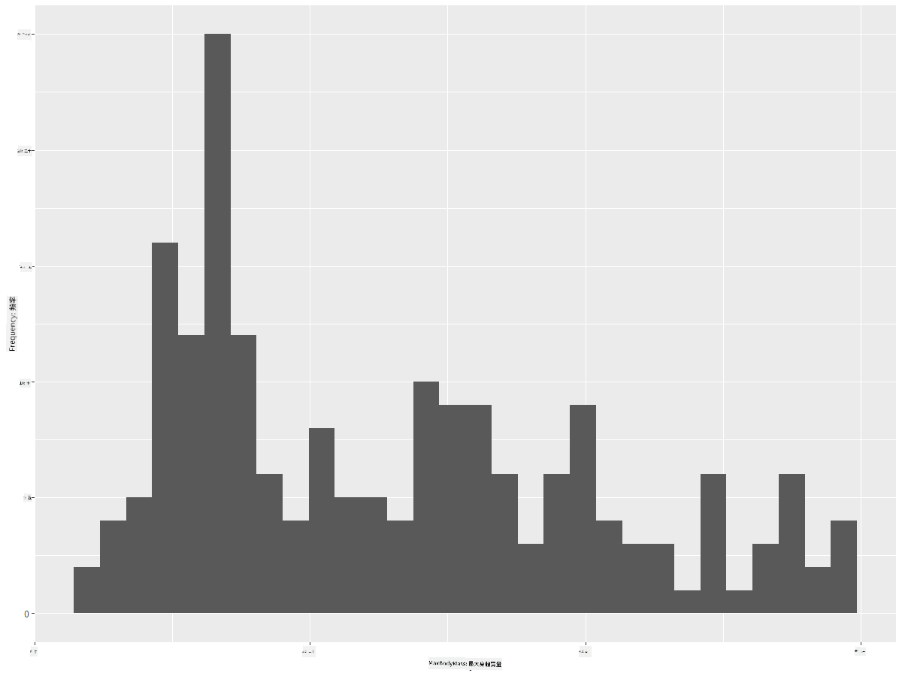
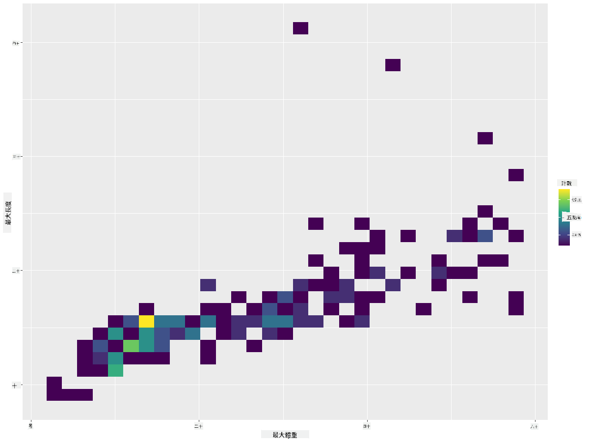
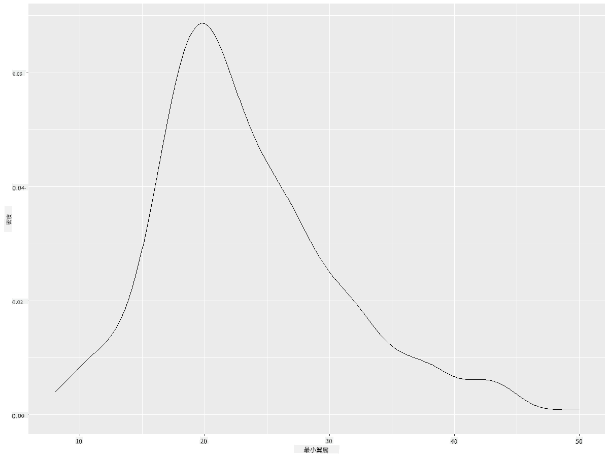
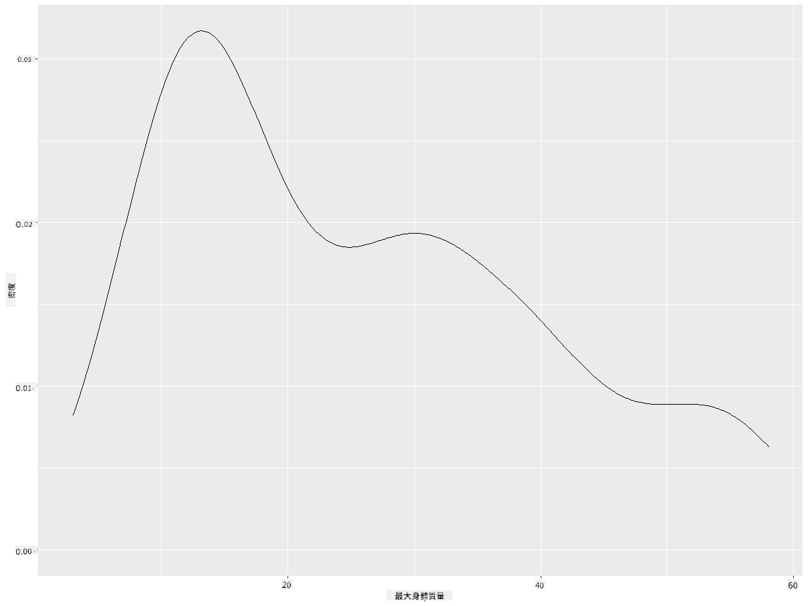
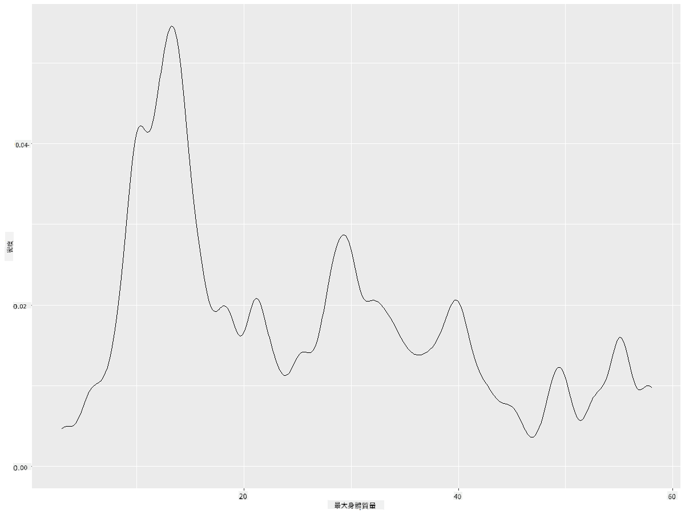
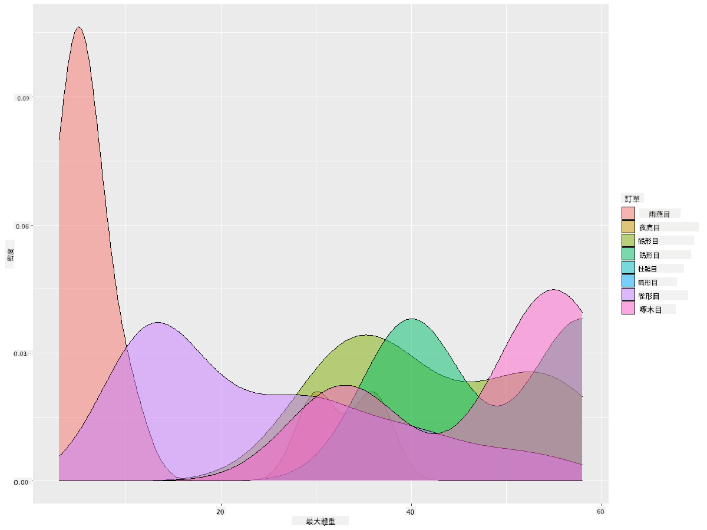

<!--
CO_OP_TRANSLATOR_METADATA:
{
  "original_hash": "ea67c0c40808fd723594de6896c37ccf",
  "translation_date": "2025-08-25T18:13:08+00:00",
  "source_file": "3-Data-Visualization/R/10-visualization-distributions/README.md",
  "language_code": "tw"
}
-->
# 視覺化分佈

| 繪製的手繪筆記 ](https://github.com/microsoft/Data-Science-For-Beginners/blob/main/sketchnotes/10-Visualizing-Distributions.png)|
|:---:|
| 視覺化分佈 - _手繪筆記由 [@nitya](https://twitter.com/nitya) 繪製_ |

在上一課中，你學習了關於明尼蘇達州鳥類數據集的一些有趣事實。通過視覺化異常值，你發現了一些錯誤的數據，並通過最大長度比較了不同鳥類類別的差異。

## [課前測驗](https://purple-hill-04aebfb03.1.azurestaticapps.net/quiz/18)
## 探索鳥類數據集

另一種深入了解數據的方法是查看其分佈，或者數據如何沿著某個軸排列。例如，你可能想了解這個數據集中鳥類的最大翼展或最大體重的一般分佈情況。

讓我們來發現一些關於這個數據集中數據分佈的事實。在你的 R 控制台中，導入 `ggplot2` 和數據庫。像上一個主題中一樣，從數據庫中移除異常值。

```r
library(ggplot2)

birds <- read.csv("../../data/birds.csv",fileEncoding="UTF-8-BOM")

birds_filtered <- subset(birds, MaxWingspan < 500)
head(birds_filtered)
```
|      | 名稱                         | 學名                   | 類別                  | 目            | 科       | 屬          | 保育狀況            | 最小長度 | 最大長度 | 最小體重    | 最大體重    | 最小翼展    | 最大翼展    |
| ---: | :--------------------------- | :--------------------- | :-------------------- | :----------- | :------- | :---------- | :----------------- | --------: | --------: | ----------: | ----------: | ----------: | ----------: |
|    0 | 黑腹樹鴨                     | Dendrocygna autumnalis | 鴨/鵝/水禽            | 雁形目       | 鴨科     | 樹鴨屬      | LC                 |        47 |        56 |         652 |        1020 |          76 |          94 |
|    1 | 棕樹鴨                       | Dendrocygna bicolor    | 鴨/鵝/水禽            | 雁形目       | 鴨科     | 樹鴨屬      | LC                 |        45 |        53 |         712 |        1050 |          85 |          93 |
|    2 | 雪雁                         | Anser caerulescens     | 鴨/鵝/水禽            | 雁形目       | 鴨科     | 雁屬        | LC                 |        64 |        79 |        2050 |        4050 |         135 |         165 |
|    3 | 羅斯雁                       | Anser rossii           | 鴨/鵝/水禽            | 雁形目       | 鴨科     | 雁屬        | LC                 |      57.3 |        64 |        1066 |        1567 |         113 |         116 |
|    4 | 大白額雁                     | Anser albifrons        | 鴨/鵝/水禽            | 雁形目       | 鴨科     | 雁屬        | LC                 |        64 |        81 |        1930 |        3310 |         130 |         165 |

通常，你可以通過使用散點圖快速查看數據的分佈方式，就像我們在上一課中所做的那樣：

```r
ggplot(data=birds_filtered, aes(x=Order, y=MaxLength,group=1)) +
  geom_point() +
  ggtitle("Max Length per order") + coord_flip()
```


這提供了每個鳥類目身體長度的一般分佈概覽，但這並不是顯示真實分佈的最佳方式。這項任務通常通過創建直方圖來完成。
## 使用直方圖

`ggplot2` 提供了非常好的方法來使用直方圖視覺化數據分佈。這種類型的圖表類似於條形圖，通過條形的升降可以看到分佈情況。要構建直方圖，你需要數值數據。構建直方圖時，可以將圖表類型定義為 'hist' 來表示直方圖。此圖表顯示了整個數據集中 MaxBodyMass 的分佈範圍。通過將數據陣列分成較小的區間，它可以顯示數據值的分佈：

```r
ggplot(data = birds_filtered, aes(x = MaxBodyMass)) + 
  geom_histogram(bins=10)+ylab('Frequency')
```


如你所見，這個數據集中大多數的 400 多種鳥類的最大體重都在 2000 以下。通過將 `bins` 參數更改為更高的數字，例如 30，可以獲得更多的數據洞察：

```r
ggplot(data = birds_filtered, aes(x = MaxBodyMass)) + geom_histogram(bins=30)+ylab('Frequency')
```



此圖表以更細緻的方式顯示了分佈。通過確保僅選擇特定範圍內的數據，可以創建一個不那麼偏向左側的圖表：

篩選數據以僅獲取體重低於 60 的鳥類，並顯示 30 個 `bins`：

```r
birds_filtered_1 <- subset(birds_filtered, MaxBodyMass > 1 & MaxBodyMass < 60)
ggplot(data = birds_filtered_1, aes(x = MaxBodyMass)) + 
  geom_histogram(bins=30)+ylab('Frequency')
```



✅ 嘗試其他篩選條件和數據點。要查看數據的完整分佈，移除 `['MaxBodyMass']` 篩選條件以顯示帶標籤的分佈。

直方圖還提供了一些不錯的顏色和標籤增強功能可以嘗試：

創建一個 2D 直方圖來比較兩個分佈之間的關係。我們來比較 `MaxBodyMass` 和 `MaxLength`。`ggplot2` 提供了一種內建方式來通過更亮的顏色顯示匯聚點：

```r
ggplot(data=birds_filtered_1, aes(x=MaxBodyMass, y=MaxLength) ) +
  geom_bin2d() +scale_fill_continuous(type = "viridis")
```
看起來這兩個元素沿著預期的軸有一個預期的相關性，其中有一個特別強的匯聚點：



直方圖對於數值數據默認效果很好。如果你需要根據文本數據查看分佈該怎麼辦？
## 使用文本數據探索數據集的分佈

此數據集還包括有關鳥類類別及其屬、種、科以及保育狀況的良好信息。讓我們深入了解這些保育信息。鳥類根據其保育狀況的分佈是什麼樣的？

> ✅ 在數據集中，使用了一些縮寫來描述保育狀況。這些縮寫來自 [IUCN 紅色名錄分類](https://www.iucnredlist.org/)，該組織記錄了物種的狀況。
> 
> - CR: 極危
> - EN: 瀕危
> - EX: 滅絕
> - LC: 無危
> - NT: 近危
> - VU: 易危

這些是基於文本的值，因此你需要進行轉換來創建直方圖。使用篩選後的鳥類數據框架，顯示其保育狀況與最小翼展。你看到了什麼？

```r
birds_filtered_1$ConservationStatus[birds_filtered_1$ConservationStatus == 'EX'] <- 'x1' 
birds_filtered_1$ConservationStatus[birds_filtered_1$ConservationStatus == 'CR'] <- 'x2'
birds_filtered_1$ConservationStatus[birds_filtered_1$ConservationStatus == 'EN'] <- 'x3'
birds_filtered_1$ConservationStatus[birds_filtered_1$ConservationStatus == 'NT'] <- 'x4'
birds_filtered_1$ConservationStatus[birds_filtered_1$ConservationStatus == 'VU'] <- 'x5'
birds_filtered_1$ConservationStatus[birds_filtered_1$ConservationStatus == 'LC'] <- 'x6'

ggplot(data=birds_filtered_1, aes(x = MinWingspan, fill = ConservationStatus)) +
  geom_histogram(position = "identity", alpha = 0.4, bins = 20) +
  scale_fill_manual(name="Conservation Status",values=c("red","green","blue","pink"),labels=c("Endangered","Near Threathened","Vulnerable","Least Concern"))
```


最小翼展與保育狀況之間似乎沒有明顯的相關性。使用此方法測試數據集的其他元素。你也可以嘗試不同的篩選條件。你發現了任何相關性嗎？

## 密度圖

你可能已經注意到，我們目前看到的直方圖是“階梯式”的，並未以平滑的弧線呈現。要顯示更平滑的密度圖，可以嘗試密度圖。

現在讓我們來使用密度圖！

```r
ggplot(data = birds_filtered_1, aes(x = MinWingspan)) + 
  geom_density()
```


你可以看到，這個圖表反映了之前的最小翼展數據，只是稍微平滑了一些。如果你想重新訪問第二個圖表中那條鋸齒狀的 MaxBodyMass 線，可以通過這種方法非常好地將其平滑化：

```r
ggplot(data = birds_filtered_1, aes(x = MaxBodyMass)) + 
  geom_density()
```


如果你想要一條平滑但不過於平滑的線，可以編輯 `adjust` 參數：

```r
ggplot(data = birds_filtered_1, aes(x = MaxBodyMass)) + 
  geom_density(adjust = 1/5)
```


✅ 閱讀此類圖表可用的參數並進行實驗！

這種類型的圖表提供了非常直觀的視覺化效果。例如，通過幾行代碼，你可以顯示每個鳥類目最大體重的密度：

```r
ggplot(data=birds_filtered_1,aes(x = MaxBodyMass, fill = Order)) +
  geom_density(alpha=0.5)
```


## 🚀 挑戰

直方圖比基本的散點圖、條形圖或折線圖更為複雜。上網搜索一些使用直方圖的好例子。它們是如何使用的，展示了什麼，以及它們通常在哪些領域或研究中被使用？

## [課後測驗](https://purple-hill-04aebfb03.1.azurestaticapps.net/quiz/19)

## 回顧與自學

在本課中，你使用了 `ggplot2` 並開始製作更為複雜的圖表。研究一下 `geom_density_2d()`，這是一種“在一個或多個維度上的連續概率密度曲線”。閱讀 [文檔](https://ggplot2.tidyverse.org/reference/geom_density_2d.html) 以了解其工作原理。

## 作業

[應用你的技能](assignment.md)

**免責聲明**：  
本文件使用 AI 翻譯服務 [Co-op Translator](https://github.com/Azure/co-op-translator) 進行翻譯。我們致力於提供準確的翻譯，但請注意，自動翻譯可能包含錯誤或不準確之處。應以原始語言的文件作為權威來源。對於關鍵資訊，建議尋求專業人工翻譯。我們對因使用此翻譯而產生的任何誤解或錯誤解讀概不負責。