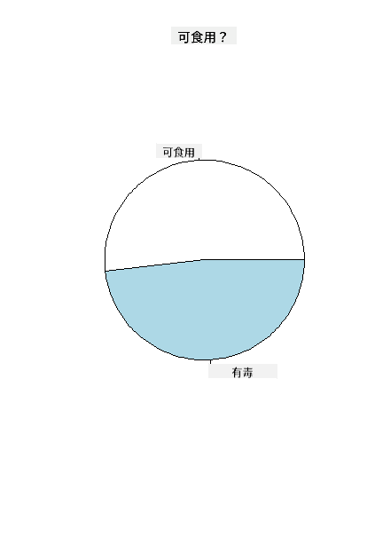
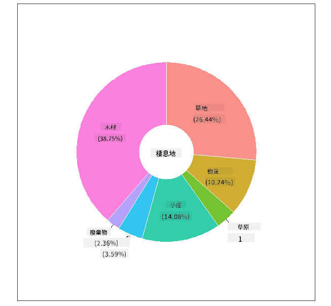
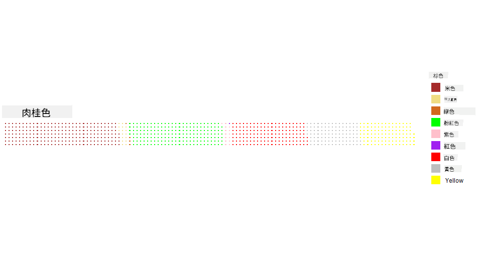

<!--
CO_OP_TRANSLATOR_METADATA:
{
  "original_hash": "47028abaaafa2bcb1079702d20569066",
  "translation_date": "2025-08-25T18:30:54+00:00",
  "source_file": "3-Data-Visualization/R/11-visualization-proportions/README.md",
  "language_code": "tw"
}
-->
# 視覺化比例

| 繪製的速記筆記](../../../sketchnotes/11-Visualizing-Proportions.png)|
|:---:|
|視覺化比例 - _由 [@nitya](https://twitter.com/nitya) 繪製的速記筆記_ |

在本課程中，你將使用一個以自然為主題的數據集來視覺化比例，例如在一個關於蘑菇的數據集中有多少不同類型的真菌。讓我們使用一個來自 Audubon 的數據集來探索這些迷人的真菌，該數據集列出了 Agaricus 和 Lepiota 家族中 23 種有鰓蘑菇的詳細信息。你將嘗試一些有趣的視覺化方式，例如：

- 圓餅圖 🥧
- 甜甜圈圖 🍩
- 華夫圖 🧇

> 💡 微軟研究院的一個非常有趣的項目 [Charticulator](https://charticulator.com) 提供了一個免費的拖放界面，用於數據視覺化。在他們的一個教程中，他們也使用了這個蘑菇數據集！因此，你可以同時探索數據並學習這個工具庫：[Charticulator 教程](https://charticulator.com/tutorials/tutorial4.html)。

## [課前測驗](https://purple-hill-04aebfb03.1.azurestaticapps.net/quiz/20)

## 認識你的蘑菇 🍄

蘑菇非常有趣。讓我們導入一個數據集來研究它們：

```r
mushrooms = read.csv('../../data/mushrooms.csv')
head(mushrooms)
```
一個表格被打印出來，包含一些很棒的分析數據：

| 類別       | 菌蓋形狀 | 菌蓋表面 | 菌蓋顏色 | 是否有瘀傷 | 氣味    | 鰓附著方式 | 鰓間距     | 鰓大小   | 鰓顏色   | 菌柄形狀   | 菌柄根部   | 菌柄表面（環上方）       | 菌柄表面（環下方）       | 菌柄顏色（環上方）       | 菌柄顏色（環下方）       | 菌幕類型 | 菌幕顏色 | 環數量     | 環類型   | 孢子印顏色       | 分布       | 棲息地   |
| --------- | --------- | ----------- | --------- | ------- | ------- | --------------- | ------------ | --------- | ---------- | ----------- | ---------- | ------------------------ | ------------------------ | ---------------------- | ---------------------- | --------- | ---------- | ----------- | --------- | ----------------- | ---------- | ------- |
| 有毒      | 凸形      | 光滑        | 棕色      | 有瘀傷   | 刺鼻    | 自由附著       | 緊密        | 狹窄     | 黑色      | 擴大       | 等長      | 光滑                   | 光滑                   | 白色                  | 白色                  | 部分      | 白色      | 一個       | 垂懸     | 黑色             | 分散       | 城市     |
| 可食用    | 凸形      | 光滑        | 黃色      | 有瘀傷   | 杏仁    | 自由附著       | 緊密        | 寬廣     | 黑色      | 擴大       | 棍狀      | 光滑                   | 光滑                   | 白色                  | 白色                  | 部分      | 白色      | 一個       | 垂懸     | 棕色             | 多數       | 草地     |
| 可食用    | 鐘形      | 光滑        | 白色      | 有瘀傷   | 茴香    | 自由附著       | 緊密        | 寬廣     | 棕色      | 擴大       | 棍狀      | 光滑                   | 光滑                   | 白色                  | 白色                  | 部分      | 白色      | 一個       | 垂懸     | 棕色             | 多數       | 草原     |
| 有毒      | 凸形      | 鱗片狀      | 白色      | 有瘀傷   | 刺鼻    | 自由附著       | 緊密        | 狹窄     | 棕色      | 擴大       | 等長      | 光滑                   | 光滑                   | 白色                  | 白色                  | 部分      | 白色      | 一個       | 垂懸     | 黑色             | 分散       | 城市     |
| 可食用    | 凸形      | 光滑        | 綠色      | 無瘀傷   | 無氣味  | 自由附著       | 擁擠        | 寬廣     | 黑色      | 錐形       | 等長      | 光滑                   | 光滑                   | 白色                  | 白色                  | 部分      | 白色      | 一個       | 消失     | 棕色             | 豐富       | 草地     |
| 可食用    | 凸形      | 鱗片狀      | 黃色      | 有瘀傷   | 杏仁    | 自由附著       | 緊密        | 寬廣     | 棕色      | 擴大       | 棍狀      | 光滑                   | 光滑                   | 白色                  | 白色                  | 部分      | 白色      | 一個       | 垂懸     | 黑色             | 多數       | 草地     |

你會立刻注意到所有數據都是文本格式。你需要將這些數據轉換為可以用於圖表的格式。事實上，大部分數據是以對象形式表示的：

```r
names(mushrooms)
```

輸出為：

```output
[1] "class"                    "cap.shape"               
 [3] "cap.surface"              "cap.color"               
 [5] "bruises"                  "odor"                    
 [7] "gill.attachment"          "gill.spacing"            
 [9] "gill.size"                "gill.color"              
[11] "stalk.shape"              "stalk.root"              
[13] "stalk.surface.above.ring" "stalk.surface.below.ring"
[15] "stalk.color.above.ring"   "stalk.color.below.ring"  
[17] "veil.type"                "veil.color"              
[19] "ring.number"              "ring.type"               
[21] "spore.print.color"        "population"              
[23] "habitat"            
```
將這些數據中的「類別」列轉換為分類：

```r
library(dplyr)
grouped=mushrooms %>%
  group_by(class) %>%
  summarise(count=n())
```

現在，如果你打印出蘑菇數據，你可以看到它已根據有毒/可食用類別分組：

```r
View(grouped)
```

| 類別   | 數量   |
| --------- | --------- |
| 可食用   | 4208     |
| 有毒     | 3916     |

如果你按照此表格中呈現的順序來創建類別標籤，你可以製作一個圓餅圖。

## 圓餅圖！

```r
pie(grouped$count,grouped$class, main="Edible?")
```
瞧，一個圓餅圖展示了根據這兩類蘑菇的比例數據。在這裡，正確的標籤順序非常重要，因此請務必確認標籤數組的構建順序！



## 甜甜圈圖！

一種更具視覺吸引力的圓餅圖是甜甜圈圖，它是在圓餅圖中間挖了一個洞。讓我們用這種方法來查看數據。

看看蘑菇生長的各種棲息地：

```r
library(dplyr)
habitat=mushrooms %>%
  group_by(habitat) %>%
  summarise(count=n())
View(habitat)
```
輸出為：

| 棲息地   | 數量   |
| --------- | --------- |
| 草地      | 2148     |
| 樹葉      | 832      |
| 草原      | 292      |
| 小徑      | 1144     |
| 城市      | 368      |
| 廢棄地    | 192      |
| 樹木      | 3148     |

在這裡，你將數據按棲息地分組。共有 7 種棲息地，因此使用它們作為甜甜圈圖的標籤：

```r
library(ggplot2)
library(webr)
PieDonut(habitat, aes(habitat, count=count))
```



此代碼使用了兩個庫 - ggplot2 和 webr。使用 webr 庫的 PieDonut 函數，我們可以輕鬆創建甜甜圈圖！

僅使用 ggplot2 庫也可以在 R 中製作甜甜圈圖。你可以在[這裡](https://www.r-graph-gallery.com/128-ring-or-donut-plot.html)了解更多並自己嘗試。

現在你知道如何分組數據並以圓餅圖或甜甜圈圖顯示它，你可以探索其他類型的圖表。試試華夫圖，它是一種不同的方式來探索數量。

## 華夫圖！

「華夫」類型的圖表是一種以 2D 方格陣列視覺化數量的方式。嘗試視覺化此數據集中蘑菇菌蓋顏色的不同數量。為此，你需要安裝一個名為 [waffle](https://cran.r-project.org/web/packages/waffle/waffle.pdf) 的輔助庫，並使用它來生成你的視覺化：

```r
install.packages("waffle", repos = "https://cinc.rud.is")
```

選擇數據的一部分進行分組：

```r
library(dplyr)
cap_color=mushrooms %>%
  group_by(cap.color) %>%
  summarise(count=n())
View(cap_color)
```

通過創建標籤並分組數據來製作華夫圖：

```r
library(waffle)
names(cap_color$count) = paste0(cap_color$cap.color)
waffle((cap_color$count/10), rows = 7, title = "Waffle Chart")+scale_fill_manual(values=c("brown", "#F0DC82", "#D2691E", "green", 
                                                                                     "pink", "purple", "red", "grey", 
                                                                                     "yellow","white"))
```

使用華夫圖，你可以清楚地看到此蘑菇數據集中菌蓋顏色的比例。有趣的是，有許多綠色菌蓋的蘑菇！



在本課程中，你學到了三種視覺化比例的方法。首先，你需要將數據分組到分類中，然後決定哪種方式最適合顯示數據 - 圓餅圖、甜甜圈圖或華夫圖。這些方法都很有趣，並能讓用戶快速了解數據集。

## 🚀 挑戰

嘗試在 [Charticulator](https://charticulator.com) 中重現這些有趣的圖表。

## [課後測驗](https://purple-hill-04aebfb03.1.azurestaticapps.net/quiz/21)

## 回顧與自學

有時候，何時使用圓餅圖、甜甜圈圖或華夫圖並不明顯。以下是一些相關文章供你閱讀：

https://www.beautiful.ai/blog/battle-of-the-charts-pie-chart-vs-donut-chart

https://medium.com/@hypsypops/pie-chart-vs-donut-chart-showdown-in-the-ring-5d24fd86a9ce

https://www.mit.edu/~mbarker/formula1/f1help/11-ch-c6.htm

https://medium.datadriveninvestor.com/data-visualization-done-the-right-way-with-tableau-waffle-chart-fdf2a19be402

進行一些研究，找到更多關於這個選擇的資訊。

## 作業

[在 Excel 中嘗試](assignment.md)

**免責聲明**：  
本文件使用 AI 翻譯服務 [Co-op Translator](https://github.com/Azure/co-op-translator) 進行翻譯。我們致力於提供準確的翻譯，但請注意，自動翻譯可能包含錯誤或不準確之處。應以原始語言的文件作為權威來源。對於關鍵資訊，建議尋求專業人工翻譯。我們對於因使用此翻譯而引起的任何誤解或錯誤解釋概不負責。