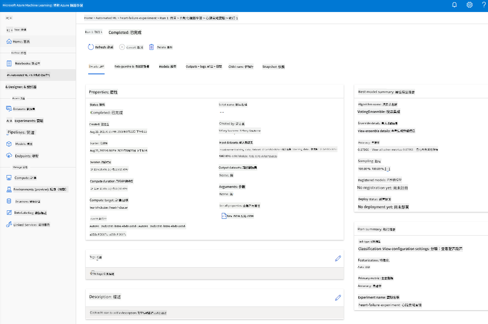

<!--
CO_OP_TRANSLATOR_METADATA:
{
  "original_hash": "14b2a7f1c63202920bd98eeb913f5614",
  "translation_date": "2025-08-25T17:21:19+00:00",
  "source_file": "5-Data-Science-In-Cloud/18-Low-Code/README.md",
  "language_code": "tw"
}
-->
# 雲端中的數據科學：「低代碼/無代碼」方式

| 繪製的速記筆記](../../sketchnotes/18-DataScience-Cloud.png)|
|:---:|
| 雲端中的數據科學：低代碼 - _速記筆記由 [@nitya](https://twitter.com/nitya) 繪製_ |

目錄：

- [雲端中的數據科學：「低代碼/無代碼」方式](../../../../5-Data-Science-In-Cloud/18-Low-Code)
  - [課前測驗](../../../../5-Data-Science-In-Cloud/18-Low-Code)
  - [1. 簡介](../../../../5-Data-Science-In-Cloud/18-Low-Code)
    - [1.1 什麼是 Azure Machine Learning？](../../../../5-Data-Science-In-Cloud/18-Low-Code)
    - [1.2 心臟衰竭預測項目：](../../../../5-Data-Science-In-Cloud/18-Low-Code)
    - [1.3 心臟衰竭數據集：](../../../../5-Data-Science-In-Cloud/18-Low-Code)
  - [2. 在 Azure ML Studio 中進行低代碼/無代碼模型訓練](../../../../5-Data-Science-In-Cloud/18-Low-Code)
    - [2.1 創建 Azure ML 工作區](../../../../5-Data-Science-In-Cloud/18-Low-Code)
    - [2.2 計算資源](../../../../5-Data-Science-In-Cloud/18-Low-Code)
      - [2.2.1 選擇適合的計算資源選項](../../../../5-Data-Science-In-Cloud/18-Low-Code)
      - [2.2.2 創建計算叢集](../../../../5-Data-Science-In-Cloud/18-Low-Code)
    - [2.3 加載數據集](../../../../5-Data-Science-In-Cloud/18-Low-Code)
    - [2.4 使用 AutoML 進行低代碼/無代碼訓練](../../../../5-Data-Science-In-Cloud/18-Low-Code)
  - [3. 低代碼/無代碼模型部署與端點使用](../../../../5-Data-Science-In-Cloud/18-Low-Code)
    - [3.1 模型部署](../../../../5-Data-Science-In-Cloud/18-Low-Code)
    - [3.2 端點使用](../../../../5-Data-Science-In-Cloud/18-Low-Code)
  - [🚀 挑戰](../../../../5-Data-Science-In-Cloud/18-Low-Code)
  - [課後測驗](../../../../5-Data-Science-In-Cloud/18-Low-Code)
  - [回顧與自學](../../../../5-Data-Science-In-Cloud/18-Low-Code)
  - [作業](../../../../5-Data-Science-In-Cloud/18-Low-Code)

## [課前測驗](https://purple-hill-04aebfb03.1.azurestaticapps.net/quiz/34)

## 1. 簡介

### 1.1 什麼是 Azure Machine Learning？

Azure 雲平台包含超過 200 種產品和雲服務，旨在幫助您實現創新解決方案。  
數據科學家需要花費大量精力來探索和預處理數據，並嘗試各種模型訓練算法以生成準確的模型。這些任務耗時且經常導致昂貴的計算硬件資源使用效率低下。

[Azure ML](https://docs.microsoft.com/azure/machine-learning/overview-what-is-azure-machine-learning?WT.mc_id=academic-77958-bethanycheum&ocid=AID3041109) 是一個基於雲的平臺，用於在 Azure 中構建和運行機器學習解決方案。它提供了廣泛的功能，幫助數據科學家準備數據、訓練模型、發布預測服務並監控其使用情況。最重要的是，它通過自動化許多與模型訓練相關的耗時任務來提高效率；並且它允許使用可有效擴展的雲端計算資源來處理大量數據，僅在實際使用時產生成本。

Azure ML 提供了開發人員和數據科學家所需的所有工具來完成機器學習工作流程，包括：

- **Azure Machine Learning Studio**：Azure Machine Learning 的網頁入口，提供低代碼和無代碼選項，用於模型訓練、部署、自動化、跟蹤和資產管理。該 Studio 與 Azure Machine Learning SDK 無縫集成。
- **Jupyter Notebooks**：快速原型設計和測試 ML 模型。
- **Azure Machine Learning Designer**：允許通過拖放模塊來構建實驗，並在低代碼環境中部署管道。
- **自動化機器學習界面 (AutoML)**：自動化機器學習模型開發的迭代任務，實現高效能和高生產力，同時保持模型質量。
- **數據標籤**：一種輔助 ML 工具，用於自動標籤數據。
- **Visual Studio Code 的機器學習擴展**：提供完整的開發環境，用於構建和管理 ML 項目。
- **機器學習 CLI**：提供命令行工具來管理 Azure ML 資源。
- **與開源框架的集成**：如 PyTorch、TensorFlow、Scikit-learn 等，用於訓練、部署和管理端到端的機器學習過程。
- **MLflow**：一個開源庫，用於管理機器學習實驗的生命周期。**MLFlow Tracking** 是 MLflow 的一個組件，用於記錄和跟蹤訓練運行的指標和模型工件，無論實驗的環境如何。

### 1.2 心臟衰竭預測項目：

毫無疑問，製作和構建項目是檢驗技能和知識的最佳方式。在本課程中，我們將探索兩種不同的方法來構建一個用於預測心臟衰竭的數據科學項目，分別是通過低代碼/無代碼方式和通過 Azure ML SDK，如下圖所示：


每種方法都有其優缺點。低代碼/無代碼方式更容易上手，因為它涉及與圖形用戶界面 (GUI) 交互，無需事先了解代碼。這種方法可以快速測試項目的可行性並創建概念驗證 (POC)。然而，隨著項目規模的增長並需要進入生產階段，通過 GUI 創建資源將變得不可行。我們需要以編程方式自動化所有內容，從資源創建到模型部署。在這種情況下，了解如何使用 Azure ML SDK 就變得至關重要。

|                   | 低代碼/無代碼 | Azure ML SDK              |
|-------------------|----------------|---------------------------|
| 代碼專業知識      | 不需要         | 需要                      |
| 開發時間          | 快速且簡單     | 取決於代碼專業知識         |
| 生產就緒          | 否             | 是                        |

### 1.3 心臟衰竭數據集：

心血管疾病 (CVDs) 是全球死亡的首要原因，佔全球死亡人數的 31%。環境和行為風險因素（如吸煙、不健康飲食和肥胖、缺乏運動以及有害的酒精使用）可以用作估算模型的特徵。能夠估算 CVD 發展的可能性對於預防高風險人群的發作具有重要意義。

Kaggle 提供了一個[心臟衰竭數據集](https://www.kaggle.com/andrewmvd/heart-failure-clinical-data)，我們將在本項目中使用該數據集。您現在可以下載該數據集。這是一個包含 13 列（12 個特徵和 1 個目標變量）和 299 行的表格數據集。

|    | 變量名稱                  | 類型            | 描述                                                     | 示例              |
|----|---------------------------|-----------------|----------------------------------------------------------|-------------------|
| 1  | age                       | 數值型          | 患者年齡                                                | 25                |
| 2  | anaemia                   | 布爾型          | 紅細胞或血紅蛋白減少                                    | 0 或 1            |
| 3  | creatinine_phosphokinase  | 數值型          | 血液中 CPK 酶的水平                                     | 542               |
| 4  | diabetes                  | 布爾型          | 患者是否有糖尿病                                        | 0 或 1            |
| 5  | ejection_fraction         | 數值型          | 每次心臟收縮時血液排出的百分比                          | 45                |
| 6  | high_blood_pressure       | 布爾型          | 患者是否有高血壓                                        | 0 或 1            |
| 7  | platelets                 | 數值型          | 血液中的血小板數量                                      | 149000            |
| 8  | serum_creatinine          | 數值型          | 血液中血清肌酐的水平                                    | 0.5               |
| 9  | serum_sodium              | 數值型          | 血液中血清鈉的水平                                      | jun               |
| 10 | sex                       | 布爾型          | 女性或男性                                              | 0 或 1            |
| 11 | smoking                   | 布爾型          | 患者是否吸煙                                            | 0 或 1            |
| 12 | time                      | 數值型          | 隨訪期（天）                                            | 4                 |
|----|---------------------------|-----------------|----------------------------------------------------------|-------------------|
| 21 | DEATH_EVENT [目標]        | 布爾型          | 患者是否在隨訪期間死亡                                  | 0 或 1            |

獲取數據集後，我們就可以在 Azure 中開始項目了。

## 2. 在 Azure ML Studio 中進行低代碼/無代碼模型訓練

### 2.1 創建 Azure ML 工作區

要在 Azure ML 中訓練模型，您首先需要創建一個 Azure ML 工作區。工作區是 Azure Machine Learning 的頂級資源，提供了一個集中式位置來管理您在使用 Azure Machine Learning 時創建的所有工件。工作區會保留所有訓練運行的歷史記錄，包括日誌、指標、輸出以及腳本的快照。您可以使用這些信息來確定哪次訓練運行生成了最佳模型。[了解更多](https://docs.microsoft.com/azure/machine-learning/concept-workspace?WT.mc_id=academic-77958-bethanycheum&ocid=AID3041109)

建議使用與您的操作系統兼容的最新瀏覽器。支持以下瀏覽器：

- Microsoft Edge（新版本的 Microsoft Edge，不是舊版）
- Safari（最新版本，僅限 Mac）
- Chrome（最新版本）
- Firefox（最新版本）

要使用 Azure Machine Learning，請在您的 Azure 訂閱中創建一個工作區。然後，您可以使用此工作區來管理與機器學習工作負載相關的數據、計算資源、代碼、模型和其他工件。

> **_注意：_** 只要 Azure Machine Learning 工作區存在於您的訂閱中，您的 Azure 訂閱將會因數據存儲而產生少量費用，因此建議在不再使用時刪除 Azure Machine Learning 工作區。

1. 使用與您的 Azure 訂閱相關聯的 Microsoft 賬戶登錄 [Azure 入口網站](https://ms.portal.azure.com/)。
2. 選擇 **＋創建資源**
   
   

   搜索 Machine Learning 並選擇 Machine Learning 磚塊

   

   點擊創建按鈕

   

   填寫以下設置：
   - 訂閱：您的 Azure 訂閱
   - 資源組：創建或選擇一個資源組
   - 工作區名稱：輸入一個唯一的工作區名稱
   - 區域：選擇離您最近的地理區域
   - 存儲帳戶：注意將為您的工作區創建的默認新存儲帳戶
   - 密鑰保管庫：注意將為您的工作區創建的默認新密鑰保管庫
   - 應用洞察：注意將為您的工作區創建的默認新應用洞察資源
   - 容器註冊表：無（首次將模型部署到容器時會自動創建）

    

   - 點擊創建 + 查看，然後點擊創建按鈕
3. 等待您的工作區創建完成（這可能需要幾分鐘）。然後在入口網站中進入該工作區。您可以通過 Machine Learning Azure 服務找到它。
4. 在工作區的概覽頁面，啟動 Azure Machine Learning Studio（或打開一個新的瀏覽器標籤並導航到 https://ml.azure.com），並使用您的 Microsoft 賬戶登錄 Azure Machine Learning Studio。如果出現提示，選擇您的 Azure 目錄和訂閱，以及您的 Azure Machine Learning 工作區。
   


5. 在 Azure Machine Learning Studio 中，切換左上角的 ☰ 圖標以查看界面中的各個頁面。您可以使用這些頁面來管理工作區中的資源。


您可以使用 Azure 入口網站管理您的工作區，但對於數據科學家和機器學習運營工程師來說，Azure Machine Learning Studio 提供了一個更專注的用戶界面來管理工作區資源。

### 2.2 計算資源

計算資源是基於雲的資源，您可以在其上運行模型訓練和數據探索過程。您可以創建四種類型的計算資源：

- **計算實例**：數據科學家用於處理數據和模型的開發工作站。這涉及創建虛擬機 (VM) 並啟動筆記本實例。然後，您可以通過調用計算叢集來訓練模型。
- **計算叢集**：可擴展的虛擬機叢集，用於按需處理實驗代碼。訓練模型時需要使用計算叢集。計算叢集還可以使用專門的 GPU 或 CPU 資源。
- **推理叢集**：用於部署使用您訓練模型的預測服務的目標。
- **附加計算資源**：連結到現有的 Azure 計算資源，例如虛擬機器或 Azure Databricks 叢集。

#### 2.2.1 為您的計算資源選擇合適的選項

在建立計算資源時需要考慮一些關鍵因素，這些選擇可能是至關重要的決策。

**您需要 CPU 還是 GPU？**

CPU（中央處理器）是執行計算機程式指令的電子電路。GPU（圖形處理器）是一種專門的電子電路，可以以非常高的速度執行與圖形相關的程式碼。

CPU 和 GPU 架構的主要區別在於，CPU 設計用於快速處理廣泛的任務（以 CPU 時鐘速度衡量），但在同時執行的任務數量上有限。GPU 則專為平行計算設計，因此在深度學習任務中表現更佳。

| CPU                                     | GPU                         |
|-----------------------------------------|-----------------------------|
| 成本較低                                | 成本較高                   |
| 並行性較低                              | 並行性較高                 |
| 訓練深度學習模型速度較慢                | 深度學習的最佳選擇         |

**叢集大小**

較大的叢集成本較高，但會帶來更好的響應速度。因此，如果您有時間但預算有限，應該從小型叢集開始。相反，如果您有預算但時間有限，應該從大型叢集開始。

**虛擬機器大小**

根據您的時間和預算限制，您可以調整 RAM、磁碟、核心數量和時鐘速度的大小。增加這些參數會提高成本，但性能也會更好。

**專用或低優先級實例？**

低優先級實例意味著它是可中斷的：基本上，Microsoft Azure 可以將這些資源分配給其他任務，從而中斷當前的工作。專用實例（或不可中斷實例）則意味著工作不會在未經您允許的情況下被終止。這是另一個時間與金錢的權衡考量，因為可中斷實例比專用實例便宜。

#### 2.2.2 建立計算叢集

在我們之前建立的 [Azure ML 工作區](https://ml.azure.com/) 中，進入計算資源頁面，您將能夠看到我們剛剛討論的不同計算資源（例如計算實例、計算叢集、推理叢集和附加計算資源）。在這個專案中，我們需要一個計算叢集來進行模型訓練。在 Studio 中，點擊「計算」選單，然後選擇「計算叢集」標籤，接著點擊「+ 新建」按鈕來建立計算叢集。


1. 選擇您的選項：專用或低優先級、CPU 或 GPU、虛擬機器大小和核心數量（對於此專案，您可以保留預設設定）。
2. 點擊「下一步」按鈕。


3. 為叢集命名。
4. 選擇您的選項：節點的最小/最大數量、閒置秒數後縮減規模、SSH 訪問。請注意，如果最小節點數為 0，當叢集閒置時您可以節省成本。請注意，最大節點數越高，訓練時間越短。建議的最大節點數為 3。
5. 點擊「建立」按鈕。此步驟可能需要幾分鐘。


太棒了！現在我們已經有了一個計算叢集，接下來我們需要將數據加載到 Azure ML Studio。

### 2.3 加載數據集

1. 在我們之前建立的 [Azure ML 工作區](https://ml.azure.com/) 中，點擊左側選單中的「數據集」，然後點擊「+ 建立數據集」按鈕來建立數據集。選擇「從本地文件」選項並選擇我們之前下載的 Kaggle 數據集。

   

2. 為您的數據集命名、選擇類型並添加描述。點擊「下一步」。從文件中上傳數據。點擊「下一步」。

   

3. 在架構中，將以下特徵的數據類型更改為布林值：anaemia、diabetes、high blood pressure、sex、smoking 和 DEATH_EVENT。點擊「下一步」，然後點擊「建立」。

   

太棒了！現在數據集已經準備就緒，計算叢集也已建立，我們可以開始訓練模型了！

### 2.4 使用 AutoML 進行低代碼/無代碼訓練

傳統的機器學習模型開發需要大量資源，並且需要豐富的領域知識和時間來生成和比較多個模型。自動化機器學習（AutoML）是一種自動化機器學習模型開發中耗時且反覆的任務的過程。它使數據科學家、分析師和開發人員能夠以高效能和高生產力構建機器學習模型，同時保持模型質量。它大大縮短了獲得可投入生產的機器學習模型所需的時間，並且操作簡便高效。[了解更多](https://docs.microsoft.com/azure/machine-learning/concept-automated-ml?WT.mc_id=academic-77958-bethanycheum&ocid=AID3041109)

1. 在我們之前建立的 [Azure ML 工作區](https://ml.azure.com/) 中，點擊左側選單中的「自動化機器學習」，然後選擇您剛剛上傳的數據集。點擊「下一步」。

   

2. 輸入一個新的實驗名稱，選擇目標列（DEATH_EVENT）和我們建立的計算叢集。點擊「下一步」。

   

3. 選擇「分類」，然後點擊「完成」。此步驟可能需要 30 分鐘到 1 小時，具體取決於您的計算叢集大小。

   

4. 一旦運行完成，點擊「自動化機器學習」標籤，選擇您的運行，然後在「最佳模型摘要」卡片中點擊算法。

   

在這裡，您可以看到 AutoML 生成的最佳模型的詳細描述。您還可以在「模型」標籤中探索其他生成的模型。花幾分鐘時間探索「解釋（預覽）」中的模型。一旦您選擇了要使用的模型（在這裡我們選擇 AutoML 選出的最佳模型），我們將學習如何部署它。

## 3. 低代碼/無代碼模型部署與端點使用
### 3.1 模型部署

自動化機器學習介面允許您將最佳模型作為 Web 服務部署，只需幾個步驟。部署是將模型整合以便根據新數據進行預測並識別潛在機會區域的過程。對於此專案，部署到 Web 服務意味著醫療應用程式將能夠使用該模型來即時預測患者的心臟病風險。

在最佳模型描述中，點擊「部署」按鈕。


15. 為其命名，添加描述，選擇計算類型（Azure 容器實例），啟用身份驗證，然後點擊「部署」。此步驟可能需要約 20 分鐘完成。部署過程包括多個步驟，例如註冊模型、生成資源並為 Web 服務配置它們。在「部署狀態」下會顯示狀態消息。定期點擊「刷新」以檢查部署狀態。當狀態顯示為「健康」時，表示部署已完成並正在運行。


16. 部署完成後，點擊「端點」標籤，然後選擇您剛剛部署的端點。在這裡，您可以找到有關該端點的所有詳細資訊。


太棒了！現在我們已經部署了一個模型，接下來我們可以開始使用該端點。

### 3.2 端點使用

點擊「使用」標籤。在這裡，您可以找到 REST 端點和一個 Python 腳本的使用選項。花些時間閱讀該 Python 程式碼。

該腳本可以直接從您的本地機器運行，並將使用您的端點。


花點時間查看以下兩行程式碼：

```python
url = 'http://98e3715f-xxxx-xxxx-xxxx-9ec22d57b796.centralus.azurecontainer.io/score'
api_key = '' # Replace this with the API key for the web service
```  
`url` 變數是使用標籤中找到的 REST 端點，而 `api_key` 變數是使用標籤中找到的主金鑰（僅在啟用了身份驗證的情況下）。這就是腳本如何使用端點的方式。

18. 運行該腳本，您應該會看到以下輸出：  
    ```python
    b'"{\\"result\\": [true]}"'
    ```  
這表示對於給定數據的心臟衰竭預測結果為真。這是合理的，因為如果您仔細查看腳本中自動生成的數據，所有值默認為 0 和 false。您可以使用以下輸入樣本更改數據：

```python
data = {
    "data":
    [
        {
            'age': "0",
            'anaemia': "false",
            'creatinine_phosphokinase': "0",
            'diabetes': "false",
            'ejection_fraction': "0",
            'high_blood_pressure': "false",
            'platelets': "0",
            'serum_creatinine': "0",
            'serum_sodium': "0",
            'sex': "false",
            'smoking': "false",
            'time': "0",
        },
        {
            'age': "60",
            'anaemia': "false",
            'creatinine_phosphokinase': "500",
            'diabetes': "false",
            'ejection_fraction': "38",
            'high_blood_pressure': "false",
            'platelets': "260000",
            'serum_creatinine': "1.40",
            'serum_sodium': "137",
            'sex': "false",
            'smoking': "false",
            'time': "130",
        },
    ],
}
```  
腳本應返回：  
    ```python
    b'"{\\"result\\": [true, false]}"'
    ```  

恭喜！您剛剛使用 Azure ML 訓練並部署了模型，並成功使用了該模型！

> **_注意：_** 完成專案後，請記得刪除所有資源。
## 🚀 挑戰

仔細查看 AutoML 為頂級模型生成的模型解釋和詳細資訊。試著理解為什麼最佳模型比其他模型更好。比較了哪些算法？它們之間有什麼區別？為什麼在這種情況下最佳模型表現更好？

## [課後測驗](https://purple-hill-04aebfb03.1.azurestaticapps.net/quiz/35)

## 回顧與自學

在本課中，您學習了如何在雲端以低代碼/無代碼方式訓練、部署和使用模型來預測心臟衰竭風險。如果您還沒有深入研究，請深入了解 AutoML 為頂級模型生成的模型解釋，並試著理解為什麼最佳模型比其他模型更好。

您可以通過閱讀這篇[文檔](https://docs.microsoft.com/azure/machine-learning/tutorial-first-experiment-automated-ml?WT.mc_id=academic-77958-bethanycheum&ocid=AID3041109)進一步了解低代碼/無代碼 AutoML。

## 作業

[Azure ML 上的低代碼/無代碼數據科學專案](assignment.md)

**免責聲明**：  
本文件使用 AI 翻譯服務 [Co-op Translator](https://github.com/Azure/co-op-translator) 進行翻譯。我們致力於提供準確的翻譯，但請注意，自動翻譯可能包含錯誤或不準確之處。應以原始語言的文件作為權威來源。對於關鍵資訊，建議尋求專業人工翻譯。我們對因使用本翻譯而引起的任何誤解或錯誤解讀概不負責。