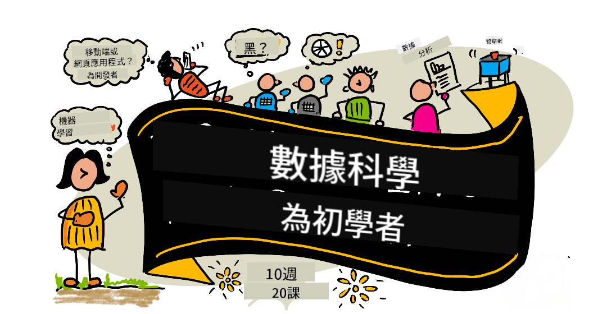

<!--
CO_OP_TRANSLATOR_METADATA:
{
  "original_hash": "3beef650c5bafd70d88e2643a2b360fb",
  "translation_date": "2025-10-03T12:07:06+00:00",
  "source_file": "README.md",
  "language_code": "tw"
}
-->
# 初學者的數據科學課程

Microsoft 的 Azure Cloud Advocates 很高興提供一個為期 10 週、共 20 節課的數據科學課程。每節課都包含課前和課後測驗、完成課程的書面指導、解決方案以及作業。我們的基於項目的教學法讓您在實際操作中學習，這是一種能讓新技能更牢固掌握的有效方法。

**衷心感謝我們的作者：** [Jasmine Greenaway](https://www.twitter.com/paladique)、[Dmitry Soshnikov](http://soshnikov.com)、[Nitya Narasimhan](https://twitter.com/nitya)、[Jalen McGee](https://twitter.com/JalenMcG)、[Jen Looper](https://twitter.com/jenlooper)、[Maud Levy](https://twitter.com/maudstweets)、[Tiffany Souterre](https://twitter.com/TiffanySouterre)、[Christopher Harrison](https://www.twitter.com/geektrainer)。

**🙏 特別感謝 🙏 我們的 [Microsoft 學生大使](https://studentambassadors.microsoft.com/) 作者、審稿人和內容貢獻者，** 特別是 Aaryan Arora、[Aditya Garg](https://github.com/AdityaGarg00)、[Alondra Sanchez](https://www.linkedin.com/in/alondra-sanchez-molina/)、[Ankita Singh](https://www.linkedin.com/in/ankitasingh007)、[Anupam Mishra](https://www.linkedin.com/in/anupam--mishra/)、[Arpita Das](https://www.linkedin.com/in/arpitadas01/)、ChhailBihari Dubey、[Dibri Nsofor](https://www.linkedin.com/in/dibrinsofor)、[Dishita Bhasin](https://www.linkedin.com/in/dishita-bhasin-7065281bb)、[Majd Safi](https://www.linkedin.com/in/majd-s/)、[Max Blum](https://www.linkedin.com/in/max-blum-6036a1186/)、[Miguel Correa](https://www.linkedin.com/in/miguelmque/)、[Mohamma Iftekher (Iftu) Ebne Jalal](https://twitter.com/iftu119)、[Nawrin Tabassum](https://www.linkedin.com/in/nawrin-tabassum)、[Raymond Wangsa Putra](https://www.linkedin.com/in/raymond-wp/)、[Rohit Yadav](https://www.linkedin.com/in/rty2423)、Samridhi Sharma、[Sanya Sinha](https://www.linkedin.com/mwlite/in/sanya-sinha-13aab1200)、[Sheena Narula](https://www.linkedin.com/in/sheena-narua-n/)、[Tauqeer Ahmad](https://www.linkedin.com/in/tauqeerahmad5201/)、Yogendrasingh Pawar、[Vidushi Gupta](https://www.linkedin.com/in/vidushi-gupta07/)、[Jasleen Sondhi](https://www.linkedin.com/in/jasleen-sondhi/)。

||
|:---:|
| 初學者的數據科學 - _由 [@nitya](https://twitter.com/nitya) 繪製的速寫_ |

### 🌐 多語言支持

#### 通過 GitHub Action 支持（自動化且始終保持最新）

[法語](../fr/README.md) | [西班牙語](../es/README.md) | [德語](../de/README.md) | [俄語](../ru/README.md) | [阿拉伯語](../ar/README.md) | [波斯語](../fa/README.md) | [烏爾都語](../ur/README.md) | [中文（簡體）](../zh/README.md) | [中文（繁體，澳門）](../mo/README.md) | [中文（繁體，香港）](../hk/README.md) | [中文（繁體，台灣）](./README.md) | [日語](../ja/README.md) | [韓語](../ko/README.md) | [印地語](../hi/README.md) | [孟加拉語](../bn/README.md) | [馬拉地語](../mr/README.md) | [尼泊爾語](../ne/README.md) | [旁遮普語（古木基文）](../pa/README.md) | [葡萄牙語（葡萄牙）](../pt/README.md) | [葡萄牙語（巴西）](../br/README.md) | [意大利語](../it/README.md) | [波蘭語](../pl/README.md) | [土耳其語](../tr/README.md) | [希臘語](../el/README.md) | [泰語](../th/README.md) | [瑞典語](../sv/README.md) | [丹麥語](../da/README.md) | [挪威語](../no/README.md) | [芬蘭語](../fi/README.md) | [荷蘭語](../nl/README.md) | [希伯來語](../he/README.md) | [越南語](../vi/README.md) | [印尼語](../id/README.md) | [馬來語](../ms/README.md) | [塔加洛語（菲律賓語）](../tl/README.md) | [斯瓦希里語](../sw/README.md) | [匈牙利語](../hu/README.md) | [捷克語](../cs/README.md) | [斯洛伐克語](../sk/README.md) | [羅馬尼亞語](../ro/README.md) | [保加利亞語](../bg/README.md) | [塞爾維亞語（西里爾文）](../sr/README.md) | [克羅地亞語](../hr/README.md) | [斯洛文尼亞語](../sl/README.md) | [烏克蘭語](../uk/README.md) | [緬甸語（緬甸）](../my/README.md)

**如果您希望支持其他翻譯語言，請參考 [此處](https://github.com/Azure/co-op-translator/blob/main/getting_started/supported-languages.md)**

#### 加入我們的社群 

我們正在進行一個 Discord 的 AI 學習系列，了解更多並加入我們的 [AI 學習系列](https://aka.ms/learnwithai/discord)，活動時間為 2025 年 9 月 18 日至 30 日。您將學到使用 GitHub Copilot 進行數據科學的技巧和竅門。

# 您是學生嗎？

以下是一些資源供您開始：

- [學生中心頁面](https://docs.microsoft.com/en-gb/learn/student-hub?WT.mc_id=academic-77958-bethanycheum) 在此頁面，您可以找到初學者資源、學生包以及獲得免費認證憑證的方法。這是一個值得收藏並定期查看的頁面，因為我們至少每月更新一次內容。
- [Microsoft 學習學生大使](https://studentambassadors.microsoft.com?WT.mc_id=academic-77958-bethanycheum) 加入全球學生大使社群，這可能是您進入 Microsoft 的途徑。

# 開始使用

> **完全初學者**：對數據科學完全陌生？從我們的 [初學者範例](examples/README.md) 開始！這些簡單且有詳細註解的範例將幫助您在深入課程之前了解基礎知識。

> **教師**：我們提供了一些 [建議](for-teachers.md) 供您使用此課程。我們期待您在 [討論論壇](https://github.com/microsoft/Data-Science-For-Beginners/discussions) 中提供反饋！

> **[學生](https://aka.ms/student-page)**：如果您想自行使用此課程，請分叉整個倉庫並自行完成練習，從課前測驗開始。然後閱讀課程並完成其餘活動。嘗試通過理解課程內容來創建項目，而不是直接複製解決方案代碼；不過，解決方案代碼可在每個基於項目的課程的 /solutions 文件夾中找到。另一個想法是與朋友組成學習小組，共同學習內容。進一步學習，我們推薦 [Microsoft Learn](https://docs.microsoft.com/en-us/users/jenlooper-2911/collections/qprpajyoy3x0g7?WT.mc_id=academic-77958-bethanycheum)。

## 認識團隊

**Gif 作者** [Mohit Jaisal](https://www.linkedin.com/in/mohitjaisal)

> 🎥 點擊上方圖片觀看關於此項目及其創作者的影片！

## 教學法

在設計此課程時，我們選擇了兩個教學原則：確保課程是基於項目的，並且包含頻繁的測驗。到本系列結束時，學生將學習數據科學的基本原則，包括倫理概念、數據準備、不同的數據處理方式、數據可視化、數據分析、數據科學的實際應用案例等。

此外，課前的低壓測驗可以幫助學生集中注意力於學習主題，而課後的第二次測驗則能進一步鞏固知識。此課程設計靈活有趣，可以完整學習或部分學習。項目從簡單開始，到 10 週課程結束時逐漸變得複雜。

> 查看我們的 [行為準則](CODE_OF_CONDUCT.md)、[貢獻指南](CONTRIBUTING.md)、[翻譯指南](TRANSLATIONS.md)。我們歡迎您的建設性反饋！

## 每節課包含：

- 可選的速寫筆記
- 可選的補充影片
- 課前熱身測驗
- 書面課程
- 對於基於項目的課程，提供逐步指南以完成項目
- 知識檢查
- 挑戰
- 補充閱讀
- 作業
- [課後測驗](https://ff-quizzes.netlify.app/en/)
> **關於測驗的注意事項**：所有測驗都包含在 Quiz-App 資料夾中，共有 40 個測驗，每個測驗包含三個問題。這些測驗已在課程中提供連結，但測驗應用程式可以在本地運行或部署到 Azure；請按照 `quiz-app` 資料夾中的指示操作。測驗正在逐步進行本地化。

## 🎓 初學者友好的範例

**剛接觸資料科學嗎？** 我們特別創建了一個 [範例目錄](examples/README.md)，其中包含簡單且有詳細註解的程式碼，幫助您快速入門：

- 🌟 **Hello World** - 您的第一個資料科學程式
- 📂 **載入資料** - 學習如何讀取和探索資料集
- 📊 **簡單分析** - 計算統計數據並尋找模式
- 📈 **基礎視覺化** - 創建圖表和圖形
- 🔬 **真實世界專案** - 從開始到完成的完整工作流程

每個範例都包含詳細的註解，解釋每一步驟，非常適合完全的初學者！

👉 **[從範例開始](examples/README.md)** 👈

## 課程

||
|:---:|
| 資料科學初學者：學習路線圖 - _Sketchnote by [@nitya](https://twitter.com/nitya)_ |

| 課程編號 | 主題 | 課程分組 | 學習目標 | 課程連結 | 作者 |
| :-----------: | :----------------------------------------: | :--------------------------------------------------: | :-----------------------------------------------------------------------------------------------------------------------------------------------------------------------: | :---------------------------------------------------------------------: | :----: |
| 01 | 定義資料科學 | [簡介](1-Introduction/README.md) | 學習資料科學的基本概念，以及它與人工智慧、機器學習和大數據的關係。 | [課程](1-Introduction/01-defining-data-science/README.md) [影片](https://youtu.be/beZ7Mb_oz9I) | [Dmitry](http://soshnikov.com) |
| 02 | 資料科學倫理 | [簡介](1-Introduction/README.md) | 資料倫理的概念、挑戰與框架。 | [課程](1-Introduction/02-ethics/README.md) | [Nitya](https://twitter.com/nitya) |
| 03 | 定義資料 | [簡介](1-Introduction/README.md) | 資料的分類及其常見來源。 | [課程](1-Introduction/03-defining-data/README.md) | [Jasmine](https://www.twitter.com/paladique) |
| 04 | 統計與機率簡介 | [簡介](1-Introduction/README.md) | 使用機率和統計的數學技術來理解資料。 | [課程](1-Introduction/04-stats-and-probability/README.md) [影片](https://youtu.be/Z5Zy85g4Yjw) | [Dmitry](http://soshnikov.com) |
| 05 | 使用關聯式資料 | [資料操作](2-Working-With-Data/README.md) | 關聯式資料的簡介，以及使用結構化查詢語言（SQL，讀作“see-quell”）探索和分析關聯式資料的基礎知識。 | [課程](2-Working-With-Data/05-relational-databases/README.md) | [Christopher](https://www.twitter.com/geektrainer) | | |
| 06 | 使用 NoSQL 資料 | [資料操作](2-Working-With-Data/README.md) | 非關聯式資料的簡介、其各種類型以及探索和分析文件型資料庫的基礎知識。 | [課程](2-Working-With-Data/06-non-relational/README.md) | [Jasmine](https://twitter.com/paladique)|
| 07 | 使用 Python | [資料操作](2-Working-With-Data/README.md) | 使用 Python 進行資料探索的基礎知識，包括使用 Pandas 等庫。建議具備 Python 程式設計的基礎理解。 | [課程](2-Working-With-Data/07-python/README.md) [影片](https://youtu.be/dZjWOGbsN4Y) | [Dmitry](http://soshnikov.com) |
| 08 | 資料準備 | [資料操作](2-Working-With-Data/README.md) | 關於清理和轉換資料的技術，以應對缺失、不準確或不完整資料的挑戰。 | [課程](2-Working-With-Data/08-data-preparation/README.md) | [Jasmine](https://www.twitter.com/paladique) |
| 09 | 數量視覺化 | [資料視覺化](3-Data-Visualization/README.md) | 學習如何使用 Matplotlib 視覺化鳥類資料 🦆 | [課程](3-Data-Visualization/09-visualization-quantities/README.md) | [Jen](https://twitter.com/jenlooper) |
| 10 | 資料分佈視覺化 | [資料視覺化](3-Data-Visualization/README.md) | 視覺化區間內的觀察和趨勢。 | [課程](3-Data-Visualization/10-visualization-distributions/README.md) | [Jen](https://twitter.com/jenlooper) |
| 11 | 比例視覺化 | [資料視覺化](3-Data-Visualization/README.md) | 視覺化離散和分組百分比。 | [課程](3-Data-Visualization/11-visualization-proportions/README.md) | [Jen](https://twitter.com/jenlooper) |
| 12 | 關係視覺化 | [資料視覺化](3-Data-Visualization/README.md) | 視覺化資料集及其變數之間的連結和相關性。 | [課程](3-Data-Visualization/12-visualization-relationships/README.md) | [Jen](https://twitter.com/jenlooper) |
| 13 | 有意義的視覺化 | [資料視覺化](3-Data-Visualization/README.md) | 提供技術和指導，讓您的視覺化在有效解決問題和洞察方面更具價值。 | [課程](3-Data-Visualization/13-meaningful-visualizations/README.md) | [Jen](https://twitter.com/jenlooper) |
| 14 | 資料科學生命周期簡介 | [生命周期](4-Data-Science-Lifecycle/README.md) | 資料科學生命周期的簡介及其第一步：獲取和提取資料。 | [課程](4-Data-Science-Lifecycle/14-Introduction/README.md) | [Jasmine](https://twitter.com/paladique) |
| 15 | 分析 | [生命周期](4-Data-Science-Lifecycle/README.md) | 資料科學生命周期的這一階段專注於分析資料的技術。 | [課程](4-Data-Science-Lifecycle/15-analyzing/README.md) | [Jasmine](https://twitter.com/paladique) | | |
| 16 | 溝通 | [生命周期](4-Data-Science-Lifecycle/README.md) | 資料科學生命周期的這一階段專注於以易於決策者理解的方式呈現資料洞察。 | [課程](4-Data-Science-Lifecycle/16-communication/README.md) | [Jalen](https://twitter.com/JalenMcG) | | |
| 17 | 雲端中的資料科學 | [雲端資料](5-Data-Science-In-Cloud/README.md) | 這系列課程介紹雲端中的資料科學及其優勢。 | [課程](5-Data-Science-In-Cloud/17-Introduction/README.md) | [Tiffany](https://twitter.com/TiffanySouterre) 和 [Maud](https://twitter.com/maudstweets) |
| 18 | 雲端中的資料科學 | [雲端資料](5-Data-Science-In-Cloud/README.md) | 使用低代碼工具訓練模型。 |[課程](5-Data-Science-In-Cloud/18-Low-Code/README.md) | [Tiffany](https://twitter.com/TiffanySouterre) 和 [Maud](https://twitter.com/maudstweets) |
| 19 | 雲端中的資料科學 | [雲端資料](5-Data-Science-In-Cloud/README.md) | 使用 Azure Machine Learning Studio 部署模型。 | [課程](5-Data-Science-In-Cloud/19-Azure/README.md)| [Tiffany](https://twitter.com/TiffanySouterre) 和 [Maud](https://twitter.com/maudstweets) |
| 20 | 野外的資料科學 | [野外應用](6-Data-Science-In-Wild/README.md) | 真實世界中的資料科學驅動專案。 | [課程](6-Data-Science-In-Wild/20-Real-World-Examples/README.md) | [Nitya](https://twitter.com/nitya) |

## GitHub Codespaces

按照以下步驟在 Codespace 中開啟此範例：
1. 點擊 Code 下拉選單，選擇 Open with Codespaces 選項。
2. 在面板底部選擇 + New codespace。
更多資訊，請參考 [GitHub 文件](https://docs.github.com/en/codespaces/developing-in-codespaces/creating-a-codespace-for-a-repository#creating-a-codespace)。

## VSCode Remote - Containers
按照以下步驟使用本地機器和 VSCode 的 VS Code Remote - Containers 擴展在容器中開啟此 repo：

1. 如果您是第一次使用開發容器，請確保您的系統符合前置需求（例如已安裝 Docker），詳情請參考 [入門文件](https://code.visualstudio.com/docs/devcontainers/containers#_getting-started)。

要使用此 repo，您可以選擇在隔離的 Docker 卷中開啟：

**注意**：在底層，這將使用 Remote-Containers: **Clone Repository in Container Volume...** 命令將原始碼克隆到 Docker 卷中，而不是本地文件系統。[卷](https://docs.docker.com/storage/volumes/) 是持久化容器資料的首選機制。

或者開啟本地克隆或下載的 repo 版本：

- 將此 repo 克隆到您的本地文件系統。
- 按 F1，選擇 **Remote-Containers: Open Folder in Container...** 命令。
- 選擇此資料夾的克隆副本，等待容器啟動，然後嘗試操作。

## 離線存取

您可以使用 [Docsify](https://docsify.js.org/#/) 離線運行此文件。Fork 此 repo，並在您的本地機器上 [安裝 Docsify](https://docsify.js.org/#/quickstart)，然後在此 repo 的根目錄中輸入 `docsify serve`。網站將在本地端的 3000 埠上提供服務：`localhost:3000`。

> 注意，筆記本無法通過 Docsify 渲染，因此當您需要運行筆記本時，請在 VS Code 中使用 Python 核心單獨運行。

## 其他課程

我們的團隊還製作了其他課程！查看以下內容：

- [Edge AI for Beginners](https://aka.ms/edgeai-for-beginners)
- [AI Agents for Beginners](https://aka.ms/ai-agents-beginners)
- [Generative AI for Beginners](https://aka.ms/genai-beginners)
- [Generative AI for Beginners .NET](https://github.com/microsoft/Generative-AI-for-beginners-dotnet)
- [Generative AI with JavaScript](https://github.com/microsoft/generative-ai-with-javascript)
- [Generative AI with Java](https://aka.ms/genaijava)
- [AI for Beginners](https://aka.ms/ai-beginners)
- [Data Science for Beginners](https://aka.ms/datascience-beginners)
- [Bash for Beginners](https://github.com/microsoft/bash-for-beginners)
- [ML for Beginners](https://aka.ms/ml-beginners)
- [Cybersecurity for Beginners](https://github.com/microsoft/Security-101) 
- [Web Dev for Beginners](https://aka.ms/webdev-beginners)
- [IoT for Beginners](https://aka.ms/iot-beginners)
- [Machine Learning for Beginners](https://aka.ms/ml-beginners)
- [XR Development for Beginners](https://aka.ms/xr-dev-for-beginners)
- [Mastering GitHub Copilot for AI Paired Programming](https://aka.ms/GitHubCopilotAI)
- [XR Development for Beginners](https://github.com/microsoft/xr-development-for-beginners)
- [Mastering GitHub Copilot for C#/.NET Developers](https://github.com/microsoft/mastering-github-copilot-for-dotnet-csharp-developers)
- [Choose Your Own Copilot Adventure](https://github.com/microsoft/CopilotAdventures)

## 尋求幫助

如果您遇到困難或對構建 AI 應用程式有任何疑問，請加入：

如果您在構建過程中遇到產品反饋或錯誤，請訪問：

---

**免責聲明**：  
本文件已使用 AI 翻譯服務 [Co-op Translator](https://github.com/Azure/co-op-translator) 進行翻譯。儘管我們致力於提供準確的翻譯，請注意自動翻譯可能包含錯誤或不準確之處。原始文件的母語版本應被視為權威來源。對於關鍵資訊，建議使用專業人工翻譯。我們對因使用此翻譯而產生的任何誤解或錯誤解釋不承擔責任。