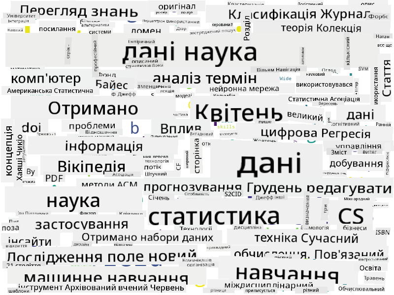

<!--
CO_OP_TRANSLATOR_METADATA:
{
  "original_hash": "a76ab694b1534fa57981311975660bfe",
  "translation_date": "2025-09-06T12:37:32+00:00",
  "source_file": "1-Introduction/01-defining-data-science/README.md",
  "language_code": "uk"
}
-->
## Типи даних

Як ми вже згадували, дані є всюди. Нам лише потрібно правильно їх захопити! Корисно розрізняти **структуровані** та **неструктуровані** дані. Перші зазвичай представлені у добре структурованій формі, часто у вигляді таблиці або кількох таблиць, тоді як другі — це просто набір файлів. Іноді також можна говорити про **напівструктуровані** дані, які мають певну структуру, що може значно варіюватися.

| Структуровані                                                              | Напівструктуровані                                                                                 | Неструктуровані                          |
| -------------------------------------------------------------------------- | --------------------------------------------------------------------------------------------------- | ---------------------------------------- |
| Список людей з їхніми номерами телефонів                                   | Сторінки Вікіпедії з посиланнями                                                                    | Текст Енциклопедії Британіка             |
| Температура у всіх кімнатах будівлі кожної хвилини за останні 20 років     | Колекція наукових статей у форматі JSON з авторами, датою публікації та анотацією                   | Файловий архів з корпоративними документами |
| Дані про вік і стать всіх людей, які заходять у будівлю                   | Інтернет-сторінки                                                                                  | Сировий відеопотік із камери спостереження |

## Де отримати дані

Існує багато можливих джерел даних, і неможливо перерахувати всі! Однак, давайте згадаємо деякі типові місця, де можна отримати дані:

* **Структуровані**
  - **Інтернет речей** (IoT), включаючи дані з різних датчиків, таких як датчики температури або тиску, надає багато корисних даних. Наприклад, якщо офісна будівля обладнана IoT-датчиками, ми можемо автоматично контролювати опалення та освітлення, щоб мінімізувати витрати.
  - **Опитування**, які ми просимо користувачів заповнити після покупки або після відвідування вебсайту.
  - **Аналіз поведінки** може, наприклад, допомогти нам зрозуміти, наскільки глибоко користувач досліджує сайт і яка типова причина його залишення.
* **Неструктуровані**
  - **Тексти** можуть бути багатим джерелом інсайтів, таких як загальний **індекс настрою** або витяг ключових слів і семантичного значення.
  - **Зображення** або **відео**. Відео з камери спостереження може бути використане для оцінки трафіку на дорозі та інформування людей про потенційні затори.
  - **Логи вебсерверів** можуть бути використані для розуміння, які сторінки нашого сайту найчастіше відвідуються і як довго.
* Напівструктуровані
  - **Графи соціальних мереж** можуть бути чудовими джерелами даних про особистості користувачів і потенційну ефективність поширення інформації.
  - Коли у нас є купа фотографій з вечірки, ми можемо спробувати витягти дані про **групову динаміку**, створивши граф людей, які фотографуються разом.

Знаючи різні можливі джерела даних, ви можете подумати про різні сценарії, де техніки науки про дані можуть бути застосовані для кращого розуміння ситуації та покращення бізнес-процесів.

## Що можна робити з даними

У науці про дані ми зосереджуємося на наступних етапах роботи з даними:

## Оцифрування та цифрова трансформація

За останнє десятиліття багато бізнесів почали розуміти важливість даних при прийнятті бізнес-рішень. Щоб застосувати принципи науки про дані до управління бізнесом, спочатку потрібно зібрати деякі дані, тобто перевести бізнес-процеси у цифрову форму. Це називається **оцифруванням**. Застосування технік науки про дані до цих даних для прийняття рішень може призвести до значного підвищення продуктивності (або навіть до зміни напрямку бізнесу), що називається **цифровою трансформацією**.

Розглянемо приклад. Припустимо, у нас є курс з науки про дані (як цей), який ми проводимо онлайн для студентів, і ми хочемо використати науку про дані для його покращення. Як ми можемо це зробити?

Ми можемо почати з питання "Що можна оцифрувати?" Найпростіший спосіб — виміряти час, який кожен студент витрачає на завершення кожного модуля, і оцінити отримані знання, провівши тест з вибором варіантів відповіді наприкінці кожного модуля. Усереднюючи час завершення серед усіх студентів, ми можемо визначити, які модулі викликають найбільші труднощі у студентів, і працювати над їх спрощенням.
Можна стверджувати, що цей підхід не є ідеальним, оскільки модулі можуть мати різну довжину. Ймовірно, більш справедливим було б поділити час на довжину модуля (у кількості символів) і порівнювати саме ці значення.
Коли ми починаємо аналізувати результати тестів з множинним вибором, ми можемо спробувати визначити, які концепції викликають труднощі у студентів, і використати цю інформацію для покращення контенту. Для цього необхідно створити тести таким чином, щоб кожне питання відповідало певній концепції або частині знань.

Якщо ми хочемо зробити аналіз ще складнішим, ми можемо зіставити час, витрачений на кожен модуль, з віковою категорією студентів. Можливо, ми виявимо, що для деяких вікових категорій проходження модуля займає надто багато часу або що студенти припиняють навчання, не завершивши модуль. Це може допомогти нам надати вікові рекомендації для модуля та мінімізувати незадоволення людей через неправильні очікування.

## 🚀 Виклик

У цьому виклику ми спробуємо знайти концепції, пов’язані з галуззю Data Science, аналізуючи тексти. Ми візьмемо статтю з Вікіпедії про Data Science, завантажимо та обробимо текст, а потім створимо хмару слів, схожу на цю:

Перейдіть до [`notebook.ipynb`](../../../../1-Introduction/01-defining-data-science/notebook.ipynb ':ignore'), щоб ознайомитися з кодом. Ви також можете запустити код і побачити, як він виконує всі перетворення даних у реальному часі.

> Якщо ви не знаєте, як запускати код у Jupyter Notebook, ознайомтеся з [цією статтею](https://soshnikov.com/education/how-to-execute-notebooks-from-github/).

## [Тест після лекції](https://ff-quizzes.netlify.app/en/ds/quiz/1)

## Завдання

* **Завдання 1**: Змініть код вище, щоб знайти пов’язані концепції для галузей **Big Data** та **Machine Learning**
* **Завдання 2**: [Подумайте про сценарії Data Science](assignment.md)

## Авторство

Цей урок створено з ♥️ [Дмитром Сошниковим](http://soshnikov.com)

---

**Відмова від відповідальності**:  
Цей документ було перекладено за допомогою сервісу автоматичного перекладу [Co-op Translator](https://github.com/Azure/co-op-translator). Хоча ми прагнемо до точності, зверніть увагу, що автоматичні переклади можуть містити помилки або неточності. Оригінальний документ мовою оригіналу слід вважати авторитетним джерелом. Для критично важливої інформації рекомендується професійний людський переклад. Ми не несемо відповідальності за будь-які непорозуміння або неправильні тлумачення, що виникли внаслідок використання цього перекладу.