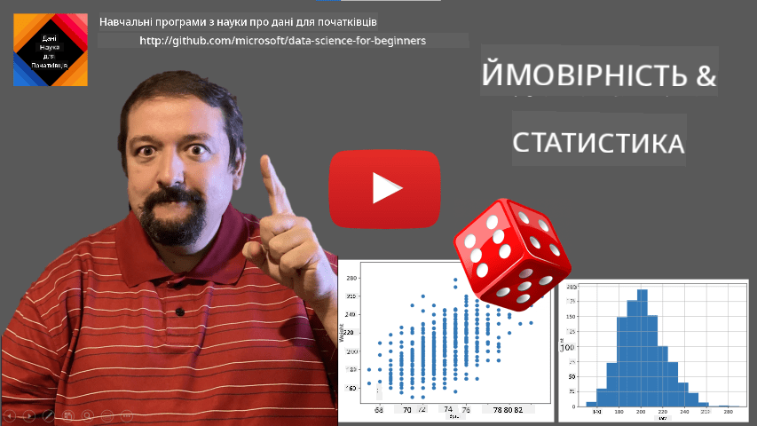
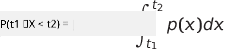
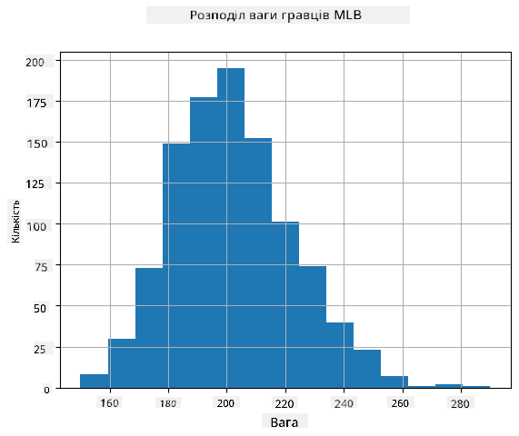
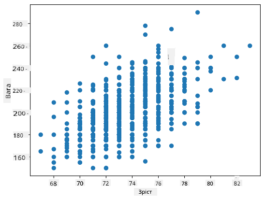

<!--
CO_OP_TRANSLATOR_METADATA:
{
  "original_hash": "ce95884566a74db72572cd51f0cb25ad",
  "translation_date": "2025-09-06T14:22:43+00:00",
  "source_file": "1-Introduction/04-stats-and-probability/README.md",
  "language_code": "uk"
}
-->
# Короткий вступ до статистики та теорії ймовірностей

| ](../../sketchnotes/04-Statistics-Probability.png)|
|:---:|
| Статистика та ймовірності - _Скетчноут від [@nitya](https://twitter.com/nitya)_ |

Статистика та теорія ймовірностей — це дві тісно пов’язані галузі математики, які мають велике значення для науки про дані. Можна працювати з даними без глибоких знань математики, але все ж краще знати хоча б основні концепції. Тут ми представимо короткий вступ, який допоможе вам розпочати.

[](https://youtu.be/Z5Zy85g4Yjw)

## [Тест перед лекцією](https://ff-quizzes.netlify.app/en/ds/quiz/6)

## Ймовірність та випадкові змінні

**Ймовірність** — це число між 0 і 1, яке виражає, наскільки ймовірною є **подія**. Вона визначається як кількість позитивних результатів (які ведуть до події), поділена на загальну кількість результатів, за умови, що всі результати однаково ймовірні. Наприклад, коли ми кидаємо кубик, ймовірність отримати парне число дорівнює 3/6 = 0.5.

Коли ми говоримо про події, ми використовуємо **випадкові змінні**. Наприклад, випадкова змінна, яка представляє число, отримане при киданні кубика, може приймати значення від 1 до 6. Множина чисел від 1 до 6 називається **простором вибірки**. Ми можемо говорити про ймовірність того, що випадкова змінна прийме певне значення, наприклад P(X=3)=1/6.

Випадкова змінна в попередньому прикладі називається **дискретною**, оскільки вона має рахований простір вибірки, тобто є окремі значення, які можна перелічити. Є випадки, коли простір вибірки — це діапазон дійсних чисел або вся множина дійсних чисел. Такі змінні називаються **неперервними**. Хорошим прикладом є час прибуття автобуса.

## Розподіл ймовірностей

У випадку дискретних випадкових змінних легко описати ймовірність кожної події за допомогою функції P(X). Для кожного значення *s* з простору вибірки *S* вона дасть число від 0 до 1, таке, що сума всіх значень P(X=s) для всіх подій дорівнюватиме 1.

Найвідоміший дискретний розподіл — це **рівномірний розподіл**, у якому є простір вибірки з N елементів, з однаковою ймовірністю 1/N для кожного з них.

Описати розподіл ймовірностей неперервної змінної, значення якої беруться з деякого інтервалу [a,b] або всієї множини дійсних чисел ℝ, складніше. Розглянемо випадок часу прибуття автобуса. Насправді, для кожного точного часу прибуття *t* ймовірність того, що автобус прибуде саме в цей час, дорівнює 0!

> Тепер ви знаєте, що події з ймовірністю 0 трапляються, і дуже часто! Принаймні кожного разу, коли прибуває автобус!

Ми можемо говорити лише про ймовірність того, що змінна потрапить у заданий інтервал значень, наприклад P(t<sub>1</sub>≤X<t<sub>2</sub>). У цьому випадку розподіл ймовірностей описується **функцією щільності ймовірностей** p(x), такою, що



Неперервний аналог рівномірного розподілу називається **неперервним рівномірним**, який визначається на скінченному інтервалі. Ймовірність того, що значення X потрапить у інтервал довжини l, пропорційна l і зростає до 1.

Ще один важливий розподіл — це **нормальний розподіл**, про який ми поговоримо детальніше нижче.

## Середнє, дисперсія та стандартне відхилення

Припустимо, ми беремо послідовність із n вибірок випадкової змінної X: x<sub>1</sub>, x<sub>2</sub>, ..., x<sub>n</sub>. Ми можемо визначити **середнє** (або **арифметичне середнє**) значення послідовності традиційним способом як (x<sub>1</sub>+x<sub>2</sub>+x<sub>n</sub>)/n. Зі збільшенням розміру вибірки (тобто при переході до межі n→∞) ми отримаємо середнє (також називається **математичним очікуванням**) розподілу. Ми позначимо математичне очікування як **E**(x).

> Можна показати, що для будь-якого дискретного розподілу зі значеннями {x<sub>1</sub>, x<sub>2</sub>, ..., x<sub>N</sub>} і відповідними ймовірностями p<sub>1</sub>, p<sub>2</sub>, ..., p<sub>N</sub>, математичне очікування дорівнюватиме E(X)=x<sub>1</sub>p<sub>1</sub>+x<sub>2</sub>p<sub>2</sub>+...+x<sub>N</sub>p<sub>N</sub>.

Щоб визначити, наскільки значення розкидані, ми можемо обчислити дисперсію σ<sup>2</sup> = ∑(x<sub>i</sub> - μ)<sup>2</sup>/n, де μ — це середнє значення послідовності. Значення σ називається **стандартним відхиленням**, а σ<sup>2</sup> — **дисперсією**.

## Мода, медіана та квартилі

Іноді середнє значення неадекватно представляє "типове" значення для даних. Наприклад, коли є кілька екстремальних значень, які повністю виходять за межі, вони можуть вплинути на середнє. Іншим хорошим показником є **медіана**, значення, таке, що половина точок даних нижче нього, а інша половина — вище.

Щоб допомогти нам зрозуміти розподіл даних, корисно говорити про **квартилі**:

* Перший квартиль, або Q1, — це значення, таке, що 25% даних нижче нього
* Третій квартиль, або Q3, — це значення, таке, що 75% даних нижче нього

Графічно ми можемо представити співвідношення між медіаною та квартилями на діаграмі, яка називається **боксплот**:


Тут ми також обчислюємо **міжквартильний розмах** IQR=Q3-Q1 і так звані **викиди** — значення, які лежать за межами [Q1-1.5*IQR,Q3+1.5*IQR].

Для скінченного розподілу, який містить невелику кількість можливих значень, хорошим "типовим" значенням є те, яке зустрічається найчастіше, і називається **модою**. Це часто застосовується до категорійних даних, таких як кольори. Розглянемо ситуацію, коли є дві групи людей — одні, які сильно віддають перевагу червоному, і інші, які віддають перевагу синьому. Якщо ми кодуємо кольори числами, середнє значення для улюбленого кольору буде десь у спектрі помаранчево-зеленого, що не вказує на реальні вподобання жодної групи. Однак мода буде або одним із кольорів, або обома кольорами, якщо кількість людей, які голосують за них, однакова (у цьому випадку ми називаємо вибірку **мультимодальною**).

## Дані з реального світу

Коли ми аналізуємо дані з реального життя, вони часто не є випадковими змінними в тому сенсі, що ми не проводимо експерименти з невідомим результатом. Наприклад, розглянемо команду бейсболістів і їхні фізичні дані, такі як зріст, вага та вік. Ці числа не зовсім випадкові, але ми все одно можемо застосувати ті самі математичні концепції. Наприклад, послідовність ваг людей можна вважати послідовністю значень, взятих із деякої випадкової змінної. Нижче наведено послідовність ваг реальних бейсболістів із [Головної ліги бейсболу](http://mlb.mlb.com/index.jsp), взяту з [цього набору даних](http://wiki.stat.ucla.edu/socr/index.php/SOCR_Data_MLB_HeightsWeights) (для вашої зручності показано лише перші 20 значень):

```
[180.0, 215.0, 210.0, 210.0, 188.0, 176.0, 209.0, 200.0, 231.0, 180.0, 188.0, 180.0, 185.0, 160.0, 180.0, 185.0, 197.0, 189.0, 185.0, 219.0]
```

> **Примітка**: Щоб побачити приклад роботи з цим набором даних, перегляньте [супровідний ноутбук](notebook.ipynb). У цьому уроці також є кілька завдань, які ви можете виконати, додавши трохи коду до цього ноутбука. Якщо ви не впевнені, як працювати з даними, не хвилюйтеся — ми повернемося до роботи з даними за допомогою Python пізніше. Якщо ви не знаєте, як виконувати код у Jupyter Notebook, перегляньте [цю статтю](https://soshnikov.com/education/how-to-execute-notebooks-from-github/).

Ось боксплот, що показує середнє, медіану та квартилі для наших даних:


Оскільки наші дані містять інформацію про різні **ролі** гравців, ми також можемо створити боксплот за ролями — це дозволить нам зрозуміти, як значення параметрів відрізняються залежно від ролей. Цього разу ми розглянемо зріст:


Ця діаграма показує, що, в середньому, зріст перших бейсменів вищий, ніж зріст других бейсменів. Пізніше в цьому уроці ми дізнаємося, як можна більш формально перевірити цю гіпотезу і як продемонструвати, що наші дані статистично значущі для цього.

> Працюючи з даними з реального світу, ми припускаємо, що всі точки даних — це вибірки, взяті з деякого розподілу ймовірностей. Це припущення дозволяє нам застосовувати техніки машинного навчання та створювати робочі моделі прогнозування.

Щоб побачити, який розподіл мають наші дані, ми можемо побудувати графік, який називається **гістограмою**. Вісь X міститиме кількість різних інтервалів ваги (так званих **бінів**), а вертикальна вісь показуватиме кількість разів, коли вибірка нашої випадкової змінної потрапила в заданий інтервал.



З цієї гістограми видно, що всі значення зосереджені навколо певної середньої ваги, і чим далі ми відходимо від цієї ваги, тим менше зустрічається ваг із таким значенням. Тобто дуже малоймовірно, що вага бейсболіста буде дуже відрізнятися від середньої ваги. Дисперсія ваг показує ступінь, до якого ваги можуть відрізнятися від середнього.

> Якщо ми візьмемо ваги інших людей, не з бейсбольної ліги, розподіл, ймовірно, буде іншим. Однак форма розподілу залишиться такою ж, але середнє і дисперсія зміняться. Тому, якщо ми навчимо нашу модель на бейсболістах, вона, ймовірно, дасть неправильні результати, коли буде застосована до студентів університету, оскільки базовий розподіл буде іншим.

## Нормальний розподіл

Розподіл ваг, який ми бачили вище, є дуже типовим, і багато вимірювань із реального світу слідують тому ж типу розподілу, але з різними середнім і дисперсією. Цей розподіл називається **нормальним розподілом**, і він відіграє дуже важливу роль у статистиці.

Використання нормального розподілу — це правильний спосіб генерувати випадкові ваги потенційних бейсболістів. Як тільки ми знаємо середню вагу `mean` і стандартне відхилення `std`, ми можемо згенерувати 1000 вибірок ваг наступним чином:
```python
samples = np.random.normal(mean,std,1000)
```

Якщо ми побудуємо гістограму згенерованих вибірок, ми побачимо картину, дуже схожу на ту, що показана вище. А якщо ми збільшимо кількість вибірок і кількість бінів, ми можемо створити картину нормального розподілу, яка буде ближчою до ідеальної:


*Нормальний розподіл із середнім=0 і стандартним відхиленням=1*

## Довірчі інтервали

Коли ми говоримо про ваги бейсболістів, ми припускаємо, що існує певна **випадкова змінна W**, яка відповідає ідеальному розподілу ймовірностей ваг усіх бейсболістів (так званої **популяції**). Наша послідовність ваг відповідає підмножині всіх бейсболістів, яку ми називаємо **вибіркою**. Цікаве питання: чи можемо ми знати параметри розподілу W, тобто середнє і дисперсію популяції?

Найпростіша відповідь — обчислити середнє і дисперсію нашої вибірки. Однак може статися, що наша випадкова вибірка не точно представляє повну популяцію. Тому має сенс говорити про **довірчий інтервал**.

> **Довірчий інтервал** — це оцінка справжнього середнього популяції на основі нашої вибірки, яка є точною з певною ймовірністю (або **рівнем довіри**).

Припустимо, у нас є вибірка X

1</sub>, ..., X<sub>n</sub> з нашого розподілу. Кожного разу, коли ми беремо вибірку з нашого розподілу, ми отримуємо різне середнє значення μ. Таким чином, μ можна вважати випадковою змінною. **Довірчий інтервал** з довірою p — це пара значень (L<sub>p</sub>,R<sub>p</sub>), таких, що **P**(L<sub>p</sub>≤μ≤R<sub>p</sub>) = p, тобто ймовірність того, що виміряне середнє значення потрапить у цей інтервал, дорівнює p.

Детальний розгляд того, як обчислюються ці довірчі інтервали, виходить за межі нашого короткого вступу. Додаткову інформацію можна знайти [у Вікіпедії](https://en.wikipedia.org/wiki/Confidence_interval). Коротко кажучи, ми визначаємо розподіл обчисленого середнього вибірки відносно справжнього середнього значення популяції, який називається **розподілом Стьюдента**.

> **Цікавий факт**: Розподіл Стьюдента названо на честь математика Вільяма Сілі Госета, який опублікував свою роботу під псевдонімом "Student". Він працював у пивоварні Guinness, і, згідно з однією з версій, його роботодавець не хотів, щоб загальна публіка знала, що вони використовують статистичні тести для визначення якості сировини.

Якщо ми хочемо оцінити середнє значення μ нашої популяції з довірою p, нам потрібно взяти *(1-p)/2-й процентиль* розподілу Стьюдента A, який можна взяти з таблиць або обчислити за допомогою вбудованих функцій статистичного програмного забезпечення (наприклад, Python, R тощо). Тоді інтервал для μ буде заданий як X±A*D/√n, де X — отримане середнє вибірки, D — стандартне відхилення.

> **Примітка**: Ми також пропускаємо обговорення важливого поняття [ступенів свободи](https://en.wikipedia.org/wiki/Degrees_of_freedom_(statistics)), яке має значення у зв’язку з розподілом Стьюдента. Ви можете звернутися до більш повних книг зі статистики, щоб глибше зрозуміти це поняття.

Приклад обчислення довірчого інтервалу для ваги та зросту наведено в [супровідних блокнотах](notebook.ipynb).

| p | Середня вага |
|-----|-----------|
| 0.85 | 201.73±0.94 |
| 0.90 | 201.73±1.08 |
| 0.95 | 201.73±1.28 |

Зверніть увагу, що чим вища ймовірність довіри, тим ширший довірчий інтервал.

## Перевірка гіпотез

У нашому наборі даних про бейсболістів є різні ролі гравців, які можна узагальнити нижче (дивіться [супровідний блокнот](notebook.ipynb), щоб побачити, як можна обчислити цю таблицю):

| Роль | Зріст | Вага | Кількість |
|------|--------|--------|-------|
| Ловці | 72.723684 | 204.328947 | 76 |
| Призначені біттери | 74.222222 | 220.888889 | 18 |
| Перші базові | 74.000000 | 213.109091 | 55 |
| Аутфілдери | 73.010309 | 199.113402 | 194 |
| Релів-пітчери | 74.374603 | 203.517460 | 315 |
| Другі базові | 71.362069 | 184.344828 | 58 |
| Шортстопи | 71.903846 | 182.923077 | 52 |
| Стартові пітчери | 74.719457 | 205.163636 | 221 |
| Треті базові | 73.044444 | 200.955556 | 45 |

Ми можемо помітити, що середній зріст перших базових вищий, ніж у других базових. Таким чином, ми можемо зробити висновок, що **перші базові вищі за других базових**.

> Цей висновок називається **гіпотезою**, оскільки ми не знаємо, чи це дійсно правда.

Однак не завжди очевидно, чи можемо ми зробити цей висновок. З попереднього обговорення ми знаємо, що кожне середнє має пов’язаний довірчий інтервал, і ця різниця може бути просто статистичною помилкою. Нам потрібен більш формальний спосіб перевірки нашої гіпотези.

Давайте обчислимо довірчі інтервали окремо для зросту перших і других базових:

| Довіра | Перші базові | Другі базові |
|------------|---------------|----------------|
| 0.85 | 73.62..74.38 | 71.04..71.69 |
| 0.90 | 73.56..74.44 | 70.99..71.73 |
| 0.95 | 73.47..74.53 | 70.92..71.81 |

Ми бачимо, що за жодного рівня довіри інтервали не перетинаються. Це підтверджує нашу гіпотезу, що перші базові вищі за других базових.

Більш формально, проблема, яку ми вирішуємо, полягає в тому, щоб визначити, чи **два розподіли ймовірностей однакові**, або принаймні мають однакові параметри. Залежно від розподілу, нам потрібно використовувати різні тести для цього. Якщо ми знаємо, що наші розподіли нормальні, ми можемо застосувати **[t-тест Стьюдента](https://en.wikipedia.org/wiki/Student%27s_t-test)**.

У t-тесті Стьюдента ми обчислюємо так зване **t-значення**, яке вказує на різницю між середніми, враховуючи дисперсію. Доведено, що t-значення слідує **розподілу Стьюдента**, що дозволяє нам отримати порогове значення для заданого рівня довіри **p** (це можна обчислити або знайти в числових таблицях). Потім ми порівнюємо t-значення з цим порогом, щоб підтвердити або відхилити гіпотезу.

У Python ми можемо використовувати пакет **SciPy**, який включає функцію `ttest_ind` (крім багатьох інших корисних статистичних функцій!). Вона обчислює t-значення для нас, а також виконує зворотний пошук значення довіри p, щоб ми могли просто подивитися на довіру для висновків.

Наприклад, наше порівняння між зростом перших і других базових дає нам такі результати:
```python
from scipy.stats import ttest_ind

tval, pval = ttest_ind(df.loc[df['Role']=='First_Baseman',['Height']], df.loc[df['Role']=='Designated_Hitter',['Height']],equal_var=False)
print(f"T-value = {tval[0]:.2f}\nP-value: {pval[0]}")
```
```
T-value = 7.65
P-value: 9.137321189738925e-12
```
У нашому випадку значення p дуже низьке, що означає, що є сильні докази того, що перші базові вищі.

Існують також інші типи гіпотез, які ми можемо перевірити, наприклад:
* Довести, що задана вибірка відповідає певному розподілу. У нашому випадку ми припустили, що зріст розподілений нормально, але це потребує формальної статистичної перевірки.
* Довести, що середнє значення вибірки відповідає певному заданому значенню.
* Порівняти середні значення кількох вибірок (наприклад, яка різниця в рівнях щастя серед різних вікових груп).

## Закон великих чисел і центральна гранична теорема

Однією з причин, чому нормальний розподіл є таким важливим, є так звана **центральна гранична теорема**. Припустимо, у нас є велика вибірка незалежних N значень X<sub>1</sub>, ..., X<sub>N</sub>, взятих з будь-якого розподілу із середнім μ і дисперсією σ<sup>2</sup>. Тоді, для достатньо великого N (іншими словами, коли N→∞), середнє Σ<sub>i</sub>X<sub>i</sub> буде нормально розподіленим із середнім μ і дисперсією σ<sup>2</sup>/N.

> Інший спосіб інтерпретувати центральну граничну теорему — сказати, що незалежно від розподілу, коли ви обчислюєте середнє суми будь-яких значень випадкових змінних, ви отримуєте нормальний розподіл.

З центральної граничної теореми також випливає, що, коли N→∞, ймовірність того, що середнє вибірки дорівнює μ, стає 1. Це відоме як **закон великих чисел**.

## Коваріація та кореляція

Одним із завдань Data Science є пошук зв’язків між даними. Ми говоримо, що дві послідовності **корелюють**, коли вони демонструють схожу поведінку одночасно, тобто вони або одночасно зростають/спадають, або одна послідовність зростає, коли інша спадає, і навпаки. Іншими словами, між двома послідовностями, здається, є якийсь зв’язок.

> Кореляція не обов’язково вказує на причинно-наслідковий зв’язок між двома послідовностями; іноді обидві змінні можуть залежати від зовнішньої причини, або це може бути просто випадковістю, що дві послідовності корелюють. Однак сильна математична кореляція є хорошим показником того, що дві змінні якось пов’язані.

Математично основним поняттям, яке показує зв’язок між двома випадковими змінними, є **коваріація**, яка обчислюється так: Cov(X,Y) = **E**\[(X-**E**(X))(Y-**E**(Y))\]. Ми обчислюємо відхилення обох змінних від їхніх середніх значень, а потім добуток цих відхилень. Якщо обидві змінні відхиляються разом, добуток завжди буде позитивним значенням, яке додасться до позитивної коваріації. Якщо обидві змінні відхиляються не синхронно (тобто одна падає нижче середнього, коли інша піднімається вище середнього), ми завжди отримаємо негативні числа, які додадуться до негативної коваріації. Якщо відхилення не залежать, вони додадуться приблизно до нуля.

Абсолютне значення коваріації не говорить нам багато про те, наскільки велика кореляція, оскільки воно залежить від величини фактичних значень. Щоб нормалізувати його, ми можемо розділити коваріацію на стандартне відхилення обох змінних, щоб отримати **кореляцію**. Хороша річ у тому, що кореляція завжди знаходиться в діапазоні [-1,1], де 1 вказує на сильну позитивну кореляцію між значеннями, -1 — сильну негативну кореляцію, а 0 — відсутність кореляції (змінні незалежні).

**Приклад**: Ми можемо обчислити кореляцію між вагою та зростом бейсболістів із згаданого вище набору даних:
```python
print(np.corrcoef(weights,heights))
```
У результаті ми отримуємо **матрицю кореляції**, схожу на цю:
```
array([[1.        , 0.52959196],
       [0.52959196, 1.        ]])
```

> Матриця кореляції C може бути обчислена для будь-якої кількості вхідних послідовностей S<sub>1</sub>, ..., S<sub>n</sub>. Значення C<sub>ij</sub> — це кореляція між S<sub>i</sub> і S<sub>j</sub>, а діагональні елементи завжди дорівнюють 1 (що також є самокореляцією S<sub>i</sub>).

У нашому випадку значення 0.53 вказує на те, що існує певна кореляція між вагою та зростом людини. Ми також можемо побудувати діаграму розсіювання одного значення проти іншого, щоб побачити зв’язок візуально:



> Більше прикладів кореляції та коваріації можна знайти в [супровідному блокноті](notebook.ipynb).

## Висновок

У цьому розділі ми дізналися:

* основні статистичні властивості даних, такі як середнє, дисперсія, мода та квартилі
* різні розподіли випадкових змінних, включаючи нормальний розподіл
* як знайти кореляцію між різними властивостями
* як використовувати математичний і статистичний апарат для доведення гіпотез
* як обчислювати довірчі інтервали для випадкової змінної на основі вибірки даних

Хоча це, безумовно, не вичерпний список тем, які існують у теорії ймовірностей і статистики, цього має бути достатньо, щоб дати вам хороший старт у цьому курсі.

## 🚀 Виклик

Використовуйте приклади коду в блокноті, щоб перевірити інші гіпотези:
1. Перші базові старші за других базових
2. Перші базові вищі за третіх базових
3. Шортстопи вищі за других базових

## [Післялекційний тест](https://ff-quizzes.netlify.app/en/ds/quiz/7)

## Огляд і самостійне навчання

Ймовірність і статистика — це настільки широка тема, що вона заслуговує на окремий курс. Якщо ви хочете глибше зануритися в теорію, вам можуть бути цікаві наступні книги:

1. [Карлос Фернандес-Гранда](https://cims.nyu.edu/~cfgranda/) з Нью-Йоркського університету має чудові лекційні нотатки [Ймовірність і статистика для Data Science](https://cims.nyu.edu/~cfgranda/pages/stuff/probability_stats_for_DS.pdf) (доступні онлайн)
1. [Пітер і Ендрю Брюс. Практична статистика для Data Scientists.](https://www.oreilly.com/library/view/practical-statistics-for/9781491952955/) [[приклади коду в R](https://github.com/andrewgbruce/statistics-for-data-scientists)].
1. [Джеймс Д. Міллер. Статистика для Data Science](https://www.packtpub.com/product/statistics-for-data-science/9781788290678) [[приклади коду в R](https://github.com/PacktPublishing/Statistics-for-Data-Science)].

## Завдання

[Маленьке дослідження діабету](assignment.md)

## Авторство

Цей урок створено з ♥️ [Дмитром Сошниковим](http://soshnikov.com)

---

**Відмова від відповідальності**:  
Цей документ був перекладений за допомогою сервісу автоматичного перекладу [Co-op Translator](https://github.com/Azure/co-op-translator). Хоча ми прагнемо до точності, будь ласка, майте на увазі, що автоматичні переклади можуть містити помилки або неточності. Оригінальний документ на його рідній мові слід вважати авторитетним джерелом. Для критичної інформації рекомендується професійний людський переклад. Ми не несемо відповідальності за будь-які непорозуміння або неправильні тлумачення, що виникають внаслідок використання цього перекладу.