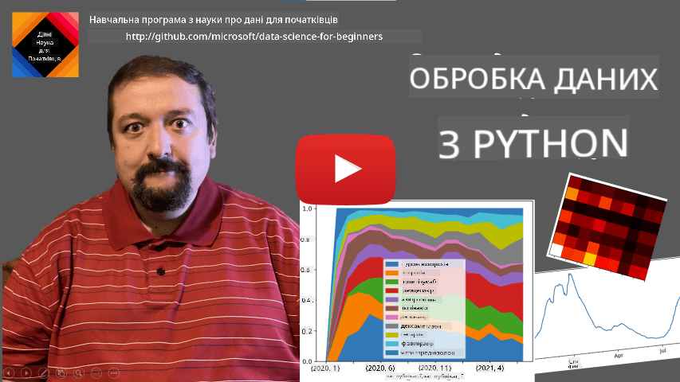
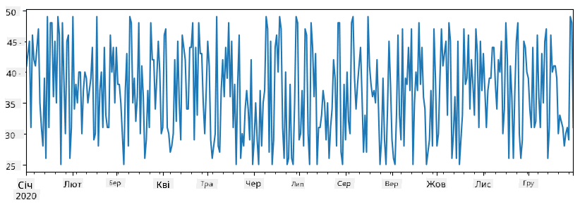
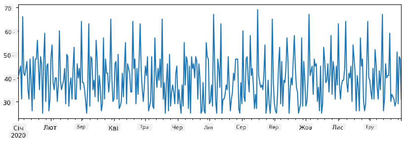
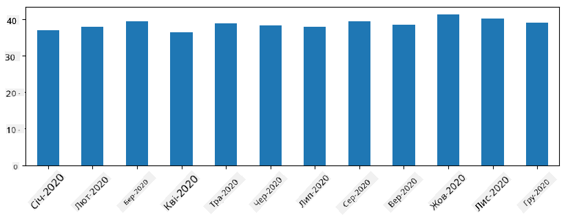
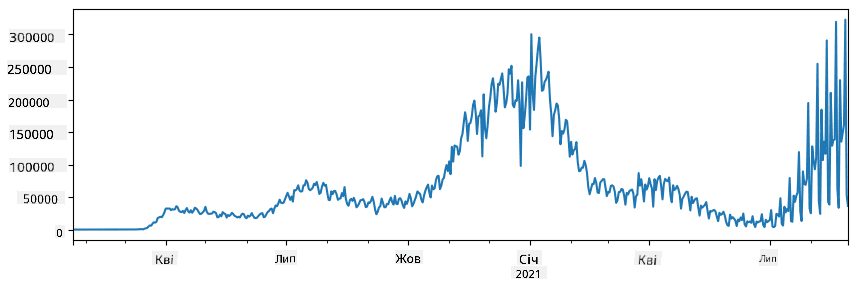
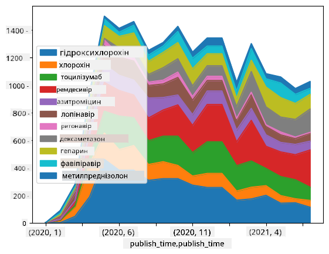

<!--
CO_OP_TRANSLATOR_METADATA:
{
  "original_hash": "7bfec050f4717dcc2dfd028aca9d21f3",
  "translation_date": "2025-09-06T16:06:13+00:00",
  "source_file": "2-Working-With-Data/07-python/README.md",
  "language_code": "uk"
}
-->
# Робота з даними: Python та бібліотека Pandas

|  ](../../sketchnotes/07-WorkWithPython.png) |
| :-------------------------------------------------------------------------------------------------------: |
|                 Робота з Python - _Скетчноут від [@nitya](https://twitter.com/nitya)_                     |

[](https://youtu.be/dZjWOGbsN4Y)

Хоча бази даних пропонують дуже ефективні способи зберігання даних і запитів до них за допомогою мов запитів, найгнучкішим способом обробки даних є написання власної програми для їх маніпулювання. У багатьох випадках виконання запиту до бази даних буде більш ефективним. Однак у деяких випадках, коли потрібна більш складна обробка даних, це не можна легко зробити за допомогою SQL. 
Обробка даних може бути запрограмована на будь-якій мові програмування, але є певні мови, які є більш високорівневими для роботи з даними. Зазвичай, фахівці з даних віддають перевагу одній із наступних мов:

* **[Python](https://www.python.org/)** — універсальна мова програмування, яка часто вважається одним із найкращих варіантів для початківців через її простоту. Python має багато додаткових бібліотек, які можуть допомогти вирішити багато практичних задач, таких як витяг даних із ZIP-архіву або перетворення зображення в градації сірого. Окрім науки про дані, Python також часто використовується для веб-розробки. 
* **[R](https://www.r-project.org/)** — традиційний інструментарій, розроблений з урахуванням статистичної обробки даних. Він також містить великий репозиторій бібліотек (CRAN), що робить його хорошим вибором для обробки даних. Однак R не є універсальною мовою програмування і рідко використовується за межами сфери науки про дані.
* **[Julia](https://julialang.org/)** — ще одна мова, розроблена спеціально для науки про дані. Вона призначена для забезпечення кращої продуктивності, ніж Python, що робить її чудовим інструментом для наукових експериментів.

У цьому уроці ми зосередимося на використанні Python для простої обробки даних. Ми припускаємо базове знайомство з мовою. Якщо ви хочете глибше ознайомитися з Python, можете звернутися до одного з наступних ресурсів:

* [Вивчайте Python весело за допомогою Turtle Graphics та фракталів](https://github.com/shwars/pycourse) — швидкий вступний курс програмування на Python на GitHub
* [Зробіть перші кроки з Python](https://docs.microsoft.com/en-us/learn/paths/python-first-steps/?WT.mc_id=academic-77958-bethanycheum) Навчальний шлях на [Microsoft Learn](http://learn.microsoft.com/?WT.mc_id=academic-77958-bethanycheum)

Дані можуть бути представлені у багатьох формах. У цьому уроці ми розглянемо три форми даних — **табличні дані**, **текст** та **зображення**.

Ми зосередимося на кількох прикладах обробки даних, замість того, щоб давати вам повний огляд усіх пов’язаних бібліотек. Це дозволить вам зрозуміти основну ідею того, що можливо, і залишить вас із розумінням того, де знайти рішення ваших проблем, коли вони виникнуть.

> **Найкорисніша порада**. Коли вам потрібно виконати певну операцію з даними, яку ви не знаєте, як зробити, спробуйте пошукати її в інтернеті. [Stackoverflow](https://stackoverflow.com/) зазвичай містить багато корисних прикладів коду на Python для багатьох типових задач. 

## [Тест перед лекцією](https://ff-quizzes.netlify.app/en/ds/quiz/12)

## Табличні дані та DataFrame

Ви вже зустрічалися з табличними даними, коли ми говорили про реляційні бази даних. Коли у вас є багато даних, і вони містяться в багатьох різних пов’язаних таблицях, безумовно, має сенс використовувати SQL для роботи з ними. Однак є багато випадків, коли у нас є таблиця даних, і нам потрібно отримати певне **розуміння** або **інсайти** про ці дані, такі як розподіл, кореляція між значеннями тощо. У науці про дані є багато випадків, коли нам потрібно виконати певні трансформації вихідних даних, а потім візуалізувати їх. Обидва ці кроки можна легко виконати за допомогою Python.

Є дві найкорисніші бібліотеки в Python, які можуть допомогти вам працювати з табличними даними:
* **[Pandas](https://pandas.pydata.org/)** дозволяє маніпулювати так званими **DataFrame**, які аналогічні реляційним таблицям. Ви можете мати названі стовпці та виконувати різні операції над рядками, стовпцями та DataFrame загалом. 
* **[Numpy](https://numpy.org/)** — це бібліотека для роботи з **тензорами**, тобто багатовимірними **масивами**. Масив має значення одного типу, і він простіший, ніж DataFrame, але пропонує більше математичних операцій і створює менше накладних витрат.

Є також кілька інших бібліотек, про які вам варто знати:
* **[Matplotlib](https://matplotlib.org/)** — бібліотека, яка використовується для візуалізації даних і побудови графіків
* **[SciPy](https://www.scipy.org/)** — бібліотека з деякими додатковими науковими функціями. Ми вже зустрічалися з цією бібліотекою, коли говорили про ймовірність і статистику

Ось шматок коду, який ви зазвичай використовуєте для імпорту цих бібліотек на початку вашої програми на Python:
```python
import numpy as np
import pandas as pd
import matplotlib.pyplot as plt
from scipy import ... # you need to specify exact sub-packages that you need
``` 

Pandas зосереджена навколо кількох базових концепцій.

### Series 

**Series** — це послідовність значень, схожа на список або масив numpy. Основна відмінність полягає в тому, що Series також має **індекс**, і коли ми працюємо з Series (наприклад, додаємо їх), індекс враховується. Індекс може бути таким простим, як номер рядка (це індекс, який використовується за замовчуванням при створенні Series зі списку або масиву), або він може мати складну структуру, наприклад, інтервал дат.

> **Примітка**: У супровідному ноутбуці [`notebook.ipynb`](notebook.ipynb) є деякий вступний код Pandas. Ми лише окреслюємо деякі приклади тут, і ви, безумовно, можете переглянути повний ноутбук.

Розглянемо приклад: ми хочемо проаналізувати продажі нашого магазину морозива. Давайте створимо Series чисел продажів (кількість проданих одиниць щодня) за певний період часу:

```python
start_date = "Jan 1, 2020"
end_date = "Mar 31, 2020"
idx = pd.date_range(start_date,end_date)
print(f"Length of index is {len(idx)}")
items_sold = pd.Series(np.random.randint(25,50,size=len(idx)),index=idx)
items_sold.plot()
```


Тепер припустимо, що щотижня ми організовуємо вечірку для друзів і беремо додатково 10 упаковок морозива для вечірки. Ми можемо створити ще один Series, індексований за тижнями, щоб продемонструвати це:
```python
additional_items = pd.Series(10,index=pd.date_range(start_date,end_date,freq="W"))
```
Коли ми додаємо два Series разом, ми отримуємо загальну кількість:
```python
total_items = items_sold.add(additional_items,fill_value=0)
total_items.plot()
```


> **Примітка**: Ми не використовуємо простий синтаксис `total_items+additional_items`. Якби ми це зробили, ми отримали б багато значень `NaN` (*Not a Number*) у результаті. Це тому, що для деяких точок індексу в Series `additional_items` відсутні значення, і додавання `NaN` до чого-небудь призводить до `NaN`. Тому нам потрібно вказати параметр `fill_value` під час додавання.

З часовими рядами ми також можемо **перевибірковувати** Series з різними інтервалами часу. Наприклад, припустимо, ми хочемо обчислити середній обсяг продажів щомісяця. Ми можемо використати наступний код:
```python
monthly = total_items.resample("1M").mean()
ax = monthly.plot(kind='bar')
```


### DataFrame

DataFrame — це, по суті, колекція Series з однаковим індексом. Ми можемо об’єднати кілька Series разом у DataFrame:
```python
a = pd.Series(range(1,10))
b = pd.Series(["I","like","to","play","games","and","will","not","change"],index=range(0,9))
df = pd.DataFrame([a,b])
```
Це створить горизонтальну таблицю, як ця:
|     | 0   | 1    | 2   | 3   | 4      | 5   | 6      | 7    | 8    |
| --- | --- | ---- | --- | --- | ------ | --- | ------ | ---- | ---- |
| 0   | 1   | 2    | 3   | 4   | 5      | 6   | 7      | 8    | 9    |
| 1   | I   | like | to  | use | Python | and | Pandas | very | much |

Ми також можемо використовувати Series як стовпці та вказувати назви стовпців за допомогою словника:
```python
df = pd.DataFrame({ 'A' : a, 'B' : b })
```
Це дасть нам таблицю, як ця:

|     | A   | B      |
| --- | --- | ------ |
| 0   | 1   | I      |
| 1   | 2   | like   |
| 2   | 3   | to     |
| 3   | 4   | use    |
| 4   | 5   | Python |
| 5   | 6   | and    |
| 6   | 7   | Pandas |
| 7   | 8   | very   |
| 8   | 9   | much   |

**Примітка**: Ми також можемо отримати цей макет таблиці, транспонуючи попередню таблицю, наприклад, написавши 
```python
df = pd.DataFrame([a,b]).T..rename(columns={ 0 : 'A', 1 : 'B' })
```
Тут `.T` означає операцію транспонування DataFrame, тобто зміну рядків і стовпців, а операція `rename` дозволяє перейменувати стовпці, щоб відповідати попередньому прикладу.

Ось кілька найважливіших операцій, які ми можемо виконувати над DataFrame:

**Вибір стовпців**. Ми можемо вибрати окремі стовпці, написавши `df['A']` — ця операція повертає Series. Ми також можемо вибрати підмножину стовпців у інший DataFrame, написавши `df[['B','A']]` — це повертає інший DataFrame.

**Фільтрування** лише певних рядків за критеріями. Наприклад, щоб залишити лише рядки зі стовпцем `A`, більшим за 5, ми можемо написати `df[df['A']>5]`.

> **Примітка**: Як працює фільтрування. Вираз `df['A']<5` повертає булевий Series, який вказує, чи є вираз `True` чи `False` для кожного елемента вихідного Series `df['A']`. Коли булевий Series використовується як індекс, він повертає підмножину рядків у DataFrame. Таким чином, неможливо використовувати довільний булевий вираз Python, наприклад, написання `df[df['A']>5 and df['A']<7]` буде неправильним. Натомість слід використовувати спеціальну операцію `&` для булевих Series, написавши `df[(df['A']>5) & (df['A']<7)]` (*дужки тут важливі*).

**Створення нових обчислюваних стовпців**. Ми можемо легко створювати нові обчислювані стовпці для нашого DataFrame, використовуючи інтуїтивний вираз, як цей:
```python
df['DivA'] = df['A']-df['A'].mean() 
``` 
Цей приклад обчислює відхилення A від його середнього значення. Насправді тут ми обчислюємо Series, а потім призначаємо цей Series лівій стороні, створюючи інший стовпець. Таким чином, ми не можемо використовувати жодні операції, які не сумісні з Series, наприклад, наведений нижче код є неправильним:
```python
# Wrong code -> df['ADescr'] = "Low" if df['A'] < 5 else "Hi"
df['LenB'] = len(df['B']) # <- Wrong result
``` 
Останній приклад, хоча синтаксично правильний, дає нам неправильний результат, оскільки він призначає довжину Series `B` всім значенням у стовпці, а не довжину окремих елементів, як ми мали намір.

Якщо нам потрібно обчислити складні вирази, як цей, ми можемо використовувати функцію `apply`. Останній приклад можна записати так:
```python
df['LenB'] = df['B'].apply(lambda x : len(x))
# or 
df['LenB'] = df['B'].apply(len)
```

Після виконання наведених вище операцій ми отримаємо наступний DataFrame:

|     | A   | B      | DivA | LenB |
| --- | --- | ------ | ---- | ---- |
| 0   | 1   | I      | -4.0 | 1    |
| 1   | 2   | like   | -3.0 | 4    |
| 2   | 3   | to     | -2.0 | 2    |
| 3   | 4   | use    | -1.0 | 3    |
| 4   | 5   | Python | 0.0  | 6    |
| 5   | 6   | and    | 1.0  | 3    |
| 6   | 7   | Pandas | 2.0  | 6    |
| 7   | 8   | very   | 3.0  | 4    |
| 8   | 9   | much   | 4.0  | 4    |

**Вибір рядків за номерами** можна виконати за допомогою конструкції `iloc`. Наприклад, щоб вибрати перші 5 рядків із DataFrame:
```python
df.iloc[:5]
```

**Групування** часто використовується для отримання результату, схожого на *зведені таблиці* в Excel. Припустимо, ми хочемо обчислити середнє значення стовпця `A` для кожного заданого числа `LenB`. Тоді ми можемо згрупувати наш DataFrame за `LenB` і викликати `mean`:
```python
df.groupby(by='LenB')[['A','DivA']].mean()
```
Якщо нам потрібно обчислити середнє значення та кількість елементів у групі, тоді ми можемо використовувати більш складну функцію `aggregate`:
```python
df.groupby(by='LenB') \
 .aggregate({ 'DivA' : len, 'A' : lambda x: x.mean() }) \
 .rename(columns={ 'DivA' : 'Count', 'A' : 'Mean'})
```
Це дає нам наступну таблицю:

| LenB | Count | Mean     |
| ---- | ----- | -------- |
| 1    | 1     | 1.000000 |
| 2    | 1     | 3.000000 |
| 3    | 2     | 5.000000 |
| 4    | 3     | 6.333333 |
| 6    | 2     | 6.000000 |

### Отримання даних
Ми бачили, як легко створювати Series та DataFrames з об'єктів Python. Однак, дані зазвичай надходять у вигляді текстового файлу або таблиці Excel. На щастя, Pandas пропонує нам простий спосіб завантаження даних з диска. Наприклад, читання файлу CSV таке ж просте, як це:
```python
df = pd.read_csv('file.csv')
```
Ми побачимо більше прикладів завантаження даних, включаючи отримання їх із зовнішніх веб-сайтів, у розділі "Challenge".

### Виведення та Візуалізація

Дослідник даних часто має досліджувати дані, тому важливо мати можливість їх візуалізувати. Коли DataFrame великий, часто ми хочемо просто переконатися, що все робимо правильно, виводячи перші кілька рядків. Це можна зробити, викликавши `df.head()`. Якщо ви запускаєте це з Jupyter Notebook, він виведе DataFrame у гарній табличній формі.

Ми також бачили використання функції `plot` для візуалізації деяких колонок. Хоча `plot` дуже корисний для багатьох завдань і підтримує багато різних типів графіків через параметр `kind=`, ви завжди можете використовувати бібліотеку `matplotlib` для побудови чогось більш складного. Ми детально розглянемо візуалізацію даних у окремих уроках курсу.

Цей огляд охоплює найважливіші концепції Pandas, однак бібліотека дуже багата, і немає меж тому, що ви можете з нею зробити! Тепер застосуємо ці знання для вирішення конкретної проблеми.

## 🚀 Challenge 1: Аналіз поширення COVID

Перша проблема, на якій ми зосередимося, — це моделювання епідемічного поширення COVID-19. Для цього ми використаємо дані про кількість інфікованих осіб у різних країнах, надані [Центром системної науки та інженерії](https://systems.jhu.edu/) (CSSE) при [Університеті Джонса Гопкінса](https://jhu.edu/). Набір даних доступний у [цьому репозиторії GitHub](https://github.com/CSSEGISandData/COVID-19).

Оскільки ми хочемо продемонструвати, як працювати з даними, ми запрошуємо вас відкрити [`notebook-covidspread.ipynb`](notebook-covidspread.ipynb) і прочитати його від початку до кінця. Ви також можете виконувати комірки та виконувати завдання, які ми залишили для вас наприкінці.



> Якщо ви не знаєте, як запускати код у Jupyter Notebook, перегляньте [цю статтю](https://soshnikov.com/education/how-to-execute-notebooks-from-github/).

## Робота з неструктурованими даними

Хоча дані дуже часто надходять у табличній формі, у деяких випадках нам потрібно працювати з менш структурованими даними, наприклад, текстом або зображеннями. У цьому випадку, щоб застосувати техніки обробки даних, які ми бачили вище, нам потрібно якось **витягти** структуровані дані. Ось кілька прикладів:

* Витяг ключових слів із тексту та аналіз частоти їх появи
* Використання нейронних мереж для отримання інформації про об'єкти на зображенні
* Отримання інформації про емоції людей на відеокамері

## 🚀 Challenge 2: Аналіз наукових статей про COVID

У цьому завданні ми продовжимо тему пандемії COVID і зосередимося на обробці наукових статей на цю тему. Існує [CORD-19 Dataset](https://www.kaggle.com/allen-institute-for-ai/CORD-19-research-challenge) з понад 7000 (на момент написання) статей про COVID, доступних із метаданими та анотаціями (а для приблизно половини з них також доступний повний текст).

Повний приклад аналізу цього набору даних за допомогою когнітивного сервісу [Text Analytics for Health](https://docs.microsoft.com/azure/cognitive-services/text-analytics/how-tos/text-analytics-for-health/?WT.mc_id=academic-77958-bethanycheum) описаний [у цьому блозі](https://soshnikov.com/science/analyzing-medical-papers-with-azure-and-text-analytics-for-health/). Ми обговоримо спрощену версію цього аналізу.

> **NOTE**: Ми не надаємо копію набору даних у цьому репозиторії. Вам може знадобитися спочатку завантажити файл [`metadata.csv`](https://www.kaggle.com/allen-institute-for-ai/CORD-19-research-challenge?select=metadata.csv) з [цього набору даних на Kaggle](https://www.kaggle.com/allen-institute-for-ai/CORD-19-research-challenge). Може знадобитися реєстрація на Kaggle. Ви також можете завантажити набір даних без реєстрації [звідси](https://ai2-semanticscholar-cord-19.s3-us-west-2.amazonaws.com/historical_releases.html), але він включатиме всі повні тексти на додаток до файлу метаданих.

Відкрийте [`notebook-papers.ipynb`](notebook-papers.ipynb) і прочитайте його від початку до кінця. Ви також можете виконувати комірки та виконувати завдання, які ми залишили для вас наприкінці.



## Обробка даних зображень

Останнім часом були розроблені дуже потужні AI-моделі, які дозволяють нам розуміти зображення. Існує багато завдань, які можна вирішити за допомогою попередньо навчених нейронних мереж або хмарних сервісів. Деякі приклади включають:

* **Класифікація зображень**, яка може допомогти вам категоризувати зображення в одну з попередньо визначених категорій. Ви можете легко навчити власні класифікатори зображень, використовуючи сервіси, такі як [Custom Vision](https://azure.microsoft.com/services/cognitive-services/custom-vision-service/?WT.mc_id=academic-77958-bethanycheum)
* **Виявлення об'єктів** для визначення різних об'єктів на зображенні. Сервіси, такі як [computer vision](https://azure.microsoft.com/services/cognitive-services/computer-vision/?WT.mc_id=academic-77958-bethanycheum), можуть виявляти низку поширених об'єктів, а ви можете навчити модель [Custom Vision](https://azure.microsoft.com/services/cognitive-services/custom-vision-service/?WT.mc_id=academic-77958-bethanycheum) для виявлення конкретних об'єктів, які вас цікавлять.
* **Виявлення обличчя**, включаючи визначення віку, статі та емоцій. Це можна зробити за допомогою [Face API](https://azure.microsoft.com/services/cognitive-services/face/?WT.mc_id=academic-77958-bethanycheum).

Усі ці хмарні сервіси можна викликати за допомогою [Python SDKs](https://docs.microsoft.com/samples/azure-samples/cognitive-services-python-sdk-samples/cognitive-services-python-sdk-samples/?WT.mc_id=academic-77958-bethanycheum), і таким чином їх можна легко інтегрувати у ваш робочий процес дослідження даних.

Ось кілька прикладів дослідження даних із джерел зображень:
* У блозі [Як вивчати Data Science без програмування](https://soshnikov.com/azure/how-to-learn-data-science-without-coding/) ми досліджуємо фотографії з Instagram, намагаючись зрозуміти, що змушує людей ставити більше лайків на фото. Спочатку ми витягуємо якомога більше інформації з фотографій за допомогою [computer vision](https://azure.microsoft.com/services/cognitive-services/computer-vision/?WT.mc_id=academic-77958-bethanycheum), а потім використовуємо [Azure Machine Learning AutoML](https://docs.microsoft.com/azure/machine-learning/concept-automated-ml/?WT.mc_id=academic-77958-bethanycheum) для створення інтерпретованої моделі.
* У [Facial Studies Workshop](https://github.com/CloudAdvocacy/FaceStudies) ми використовуємо [Face API](https://azure.microsoft.com/services/cognitive-services/face/?WT.mc_id=academic-77958-bethanycheum) для витягу емоцій людей на фотографіях з подій, щоб спробувати зрозуміти, що робить людей щасливими.

## Висновок

Незалежно від того, чи у вас вже є структуровані або неструктуровані дані, використовуючи Python, ви можете виконувати всі етапи, пов'язані з обробкою та розумінням даних. Це, мабуть, найгнучкіший спосіб обробки даних, і саме тому більшість дослідників даних використовують Python як свій основний інструмент. Вивчення Python на глибокому рівні — це, ймовірно, гарна ідея, якщо ви серйозно ставитеся до своєї подорожі в Data Science!

## [Тест після лекції](https://ff-quizzes.netlify.app/en/ds/quiz/13)

## Огляд та Самостійне навчання

**Книги**
* [Wes McKinney. Python for Data Analysis: Data Wrangling with Pandas, NumPy, and IPython](https://www.amazon.com/gp/product/1491957662)

**Онлайн ресурси**
* Офіційний [10 хвилин до Pandas](https://pandas.pydata.org/pandas-docs/stable/user_guide/10min.html) туторіал
* [Документація про візуалізацію в Pandas](https://pandas.pydata.org/pandas-docs/stable/user_guide/visualization.html)

**Вивчення Python**
* [Вивчайте Python весело з Turtle Graphics та фракталами](https://github.com/shwars/pycourse)
* [Зробіть свої перші кроки з Python](https://docs.microsoft.com/learn/paths/python-first-steps/?WT.mc_id=academic-77958-bethanycheum) Навчальний шлях на [Microsoft Learn](http://learn.microsoft.com/?WT.mc_id=academic-77958-bethanycheum)

## Завдання

[Виконайте більш детальне дослідження даних для завдань вище](assignment.md)

## Авторство

Цей урок створено з ♥️ [Дмитром Сошниковим](http://soshnikov.com)

---

**Відмова від відповідальності**:  
Цей документ було перекладено за допомогою сервісу автоматичного перекладу [Co-op Translator](https://github.com/Azure/co-op-translator). Хоча ми прагнемо до точності, зверніть увагу, що автоматичні переклади можуть містити помилки або неточності. Оригінальний документ мовою оригіналу слід вважати авторитетним джерелом. Для критично важливої інформації рекомендується професійний людський переклад. Ми не несемо відповідальності за будь-які непорозуміння або неправильні тлумачення, що виникли внаслідок використання цього перекладу.