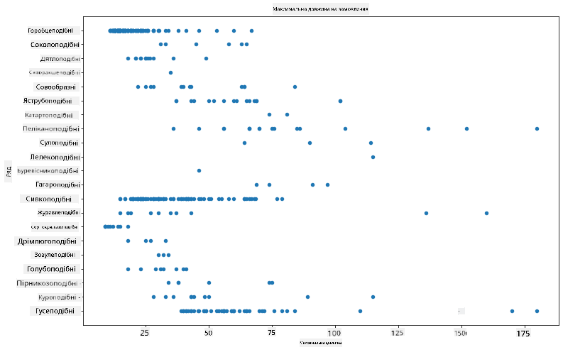
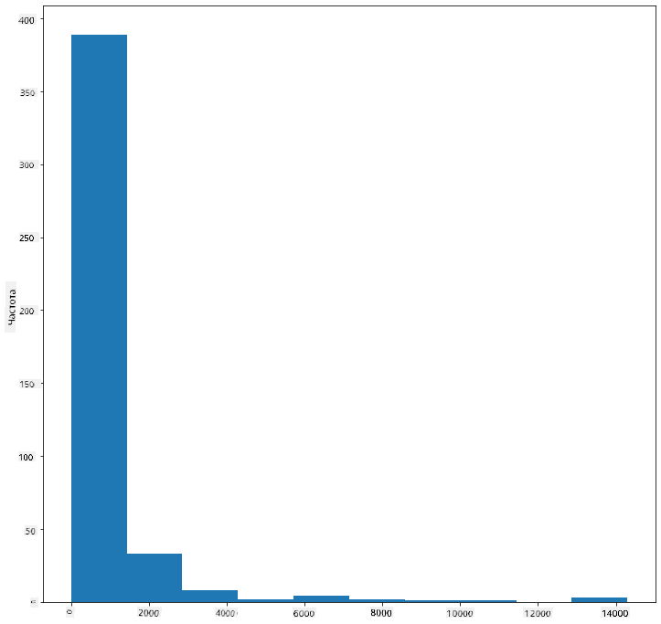
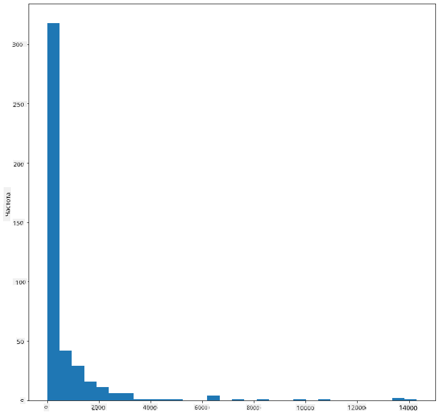
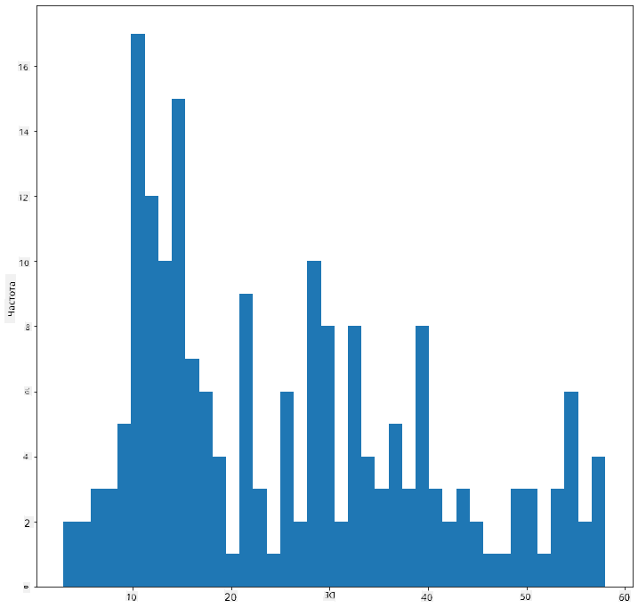
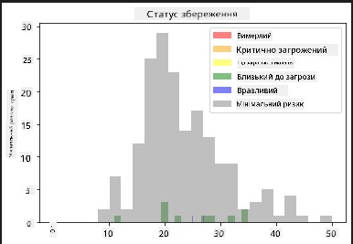
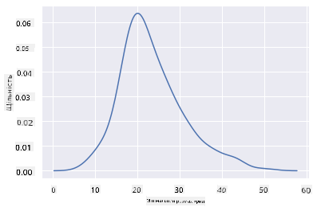
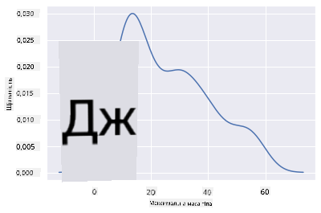
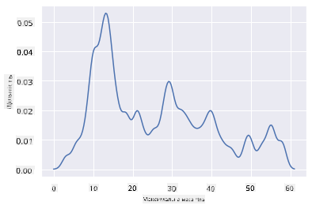
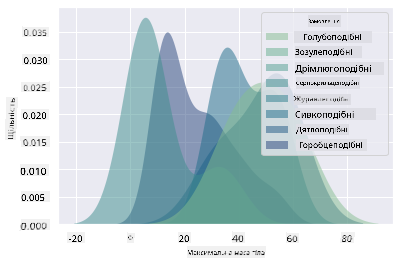
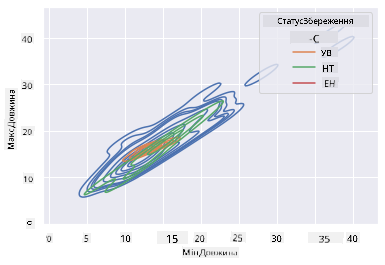

<!--
CO_OP_TRANSLATOR_METADATA:
{
  "original_hash": "87faccac113d772551486a67a607153e",
  "translation_date": "2025-08-30T19:15:41+00:00",
  "source_file": "3-Data-Visualization/10-visualization-distributions/README.md",
  "language_code": "uk"
}
-->
# Візуалізація розподілів

|](../../sketchnotes/10-Visualizing-Distributions.png)|
|:---:|
| Візуалізація розподілів - _Скетчнот від [@nitya](https://twitter.com/nitya)_ |

У попередньому уроці ви дізналися кілька цікавих фактів про набір даних про птахів Міннесоти. Ви знайшли помилкові дані, візуалізуючи аномалії, і розглянули відмінності між категоріями птахів за їх максимальною довжиною.

## [Тест перед лекцією](https://purple-hill-04aebfb03.1.azurestaticapps.net/quiz/18)
## Дослідження набору даних про птахів

Ще один спосіб дослідити дані — це подивитися на їх розподіл, тобто як дані організовані вздовж осі. Наприклад, можливо, вам цікаво дізнатися загальний розподіл максимального розмаху крил або максимальної маси тіла птахів Міннесоти в цьому наборі даних.

Давайте відкриємо кілька фактів про розподіли даних у цьому наборі. У файлі _notebook.ipynb_, який знаходиться в кореневій папці цього уроку, імпортуйте Pandas, Matplotlib і ваші дані:

```python
import pandas as pd
import matplotlib.pyplot as plt
birds = pd.read_csv('../../data/birds.csv')
birds.head()
```

|      | Назва                        | Наукова назва          | Категорія             | Ряд          | Родина   | Рід         | Статус збереження  | Мін. довжина | Макс. довжина | Мін. маса тіла | Макс. маса тіла | Мін. розмах крил | Макс. розмах крил |
| ---: | :--------------------------- | :--------------------- | :-------------------- | :----------- | :------- | :---------- | :----------------- | --------:    | --------:     | ----------:    | ----------:     | ----------:      | ----------:      |
|    0 | Чорно-білий свистячий качур  | Dendrocygna autumnalis | Качки/Гуси/Водоплавні | Anseriformes | Anatidae | Dendrocygna | LC                 |        47     |        56     |         652    |        1020     |          76      |          94      |
|    1 | Рудий свистячий качур        | Dendrocygna bicolor    | Качки/Гуси/Водоплавні | Anseriformes | Anatidae | Dendrocygna | LC                 |        45     |        53     |         712    |        1050     |          85      |          93      |
|    2 | Біла гуска                   | Anser caerulescens     | Качки/Гуси/Водоплавні | Anseriformes | Anatidae | Anser       | LC                 |        64     |        79     |        2050    |        4050     |         135      |         165      |
|    3 | Гуска Росса                  | Anser rossii           | Качки/Гуси/Водоплавні | Anseriformes | Anatidae | Anser       | LC                 |      57.3    |        64     |        1066    |        1567     |         113      |         116      |
|    4 | Велика білолоба гуска        | Anser albifrons        | Качки/Гуси/Водоплавні | Anseriformes | Anatidae | Anser       | LC                 |        64     |        81     |        1930    |        3310     |         130      |         165      |

Загалом, ви можете швидко переглянути, як дані розподілені, використовуючи точковий графік, як ми робили в попередньому уроці:

```python
birds.plot(kind='scatter',x='MaxLength',y='Order',figsize=(12,8))

plt.title('Max Length per Order')
plt.ylabel('Order')
plt.xlabel('Max Length')

plt.show()
```


Це дає загальний огляд розподілу довжини тіла за рядом птахів, але це не найкращий спосіб відображення справжніх розподілів. Для цього зазвичай створюють гістограму.
## Робота з гістограмами

Matplotlib пропонує дуже хороші способи візуалізації розподілу даних за допомогою гістограм. Цей тип графіка схожий на стовпчастий графік, де розподіл можна побачити через підйом і спад стовпців. Щоб побудувати гістограму, вам потрібні числові дані. Для побудови гістограми можна визначити тип графіка як 'hist' для гістограми. Цей графік показує розподіл MaxBodyMass для всього діапазону числових даних набору. Розділяючи масив даних на менші групи, він може відобразити розподіл значень даних:

```python
birds['MaxBodyMass'].plot(kind = 'hist', bins = 10, figsize = (12,12))
plt.show()
```


Як видно, більшість із 400+ птахів у цьому наборі даних мають Max Body Mass менше 2000. Отримайте більше інформації про дані, змінивши параметр `bins` на більше значення, наприклад, 30:

```python
birds['MaxBodyMass'].plot(kind = 'hist', bins = 30, figsize = (12,12))
plt.show()
```


Цей графік показує розподіл трохи більш детально. Менш зміщений графік можна створити, якщо вибрати дані лише в заданому діапазоні:

Відфільтруйте дані, щоб отримати лише тих птахів, чия маса тіла менше 60, і покажіть 40 `bins`:

```python
filteredBirds = birds[(birds['MaxBodyMass'] > 1) & (birds['MaxBodyMass'] < 60)]      
filteredBirds['MaxBodyMass'].plot(kind = 'hist',bins = 40,figsize = (12,12))
plt.show()     
```


✅ Спробуйте інші фільтри та точки даних. Щоб побачити повний розподіл даних, видаліть фільтр `['MaxBodyMass']`, щоб показати розподіли з мітками.

Гістограма також пропонує цікаві покращення кольору та міток:

Створіть 2D-гістограму, щоб порівняти взаємозв’язок між двома розподілами. Давайте порівняємо `MaxBodyMass` і `MaxLength`. Matplotlib пропонує вбудований спосіб показати збіг за допомогою яскравіших кольорів:

```python
x = filteredBirds['MaxBodyMass']
y = filteredBirds['MaxLength']

fig, ax = plt.subplots(tight_layout=True)
hist = ax.hist2d(x, y)
```
Здається, є очікувана кореляція між цими двома елементами вздовж очікуваної осі, з одним особливо сильним точковим збігом:


Гістограми добре працюють за замовчуванням для числових даних. А що, якщо вам потрібно побачити розподіли за текстовими даними? 
## Дослідження набору даних для розподілів за текстовими даними 

Цей набір даних також містить хорошу інформацію про категорію птахів, їх рід, вид і родину, а також про їх статус збереження. Давайте дослідимо цю інформацію про статус збереження. Який розподіл птахів за їх статусом збереження?

> ✅ У наборі даних використовуються кілька абревіатур для опису статусу збереження. Ці абревіатури походять із [Категорій Червоного списку МСОП](https://www.iucnredlist.org/), організації, яка каталогізує статус видів.
> 
> - CR: Критично зникаючий
> - EN: Зникаючий
> - EX: Вимерлий
> - LC: Найменша загроза
> - NT: Близький до загрози
> - VU: Уразливий

Це текстові значення, тому вам потрібно буде виконати трансформацію, щоб створити гістограму. Використовуючи dataframe filteredBirds, відобразіть його статус збереження разом із мінімальним розмахом крил. Що ви бачите? 

```python
x1 = filteredBirds.loc[filteredBirds.ConservationStatus=='EX', 'MinWingspan']
x2 = filteredBirds.loc[filteredBirds.ConservationStatus=='CR', 'MinWingspan']
x3 = filteredBirds.loc[filteredBirds.ConservationStatus=='EN', 'MinWingspan']
x4 = filteredBirds.loc[filteredBirds.ConservationStatus=='NT', 'MinWingspan']
x5 = filteredBirds.loc[filteredBirds.ConservationStatus=='VU', 'MinWingspan']
x6 = filteredBirds.loc[filteredBirds.ConservationStatus=='LC', 'MinWingspan']

kwargs = dict(alpha=0.5, bins=20)

plt.hist(x1, **kwargs, color='red', label='Extinct')
plt.hist(x2, **kwargs, color='orange', label='Critically Endangered')
plt.hist(x3, **kwargs, color='yellow', label='Endangered')
plt.hist(x4, **kwargs, color='green', label='Near Threatened')
plt.hist(x5, **kwargs, color='blue', label='Vulnerable')
plt.hist(x6, **kwargs, color='gray', label='Least Concern')

plt.gca().set(title='Conservation Status', ylabel='Min Wingspan')
plt.legend();
```



Не здається, що є хороша кореляція між мінімальним розмахом крил і статусом збереження. Перевірте інші елементи набору даних, використовуючи цей метод. Ви можете спробувати різні фільтри. Чи знаходите ви якусь кореляцію?

## Графіки щільності

Ви могли помітити, що гістограми, які ми розглядали до цього, мають "ступінчастий" вигляд і не плавно вигинаються. Щоб показати більш плавний графік щільності, можна спробувати графік щільності.

Щоб працювати з графіками щільності, ознайомтеся з новою бібліотекою для побудови графіків, [Seaborn](https://seaborn.pydata.org/generated/seaborn.kdeplot.html). 

Завантаживши Seaborn, спробуйте базовий графік щільності:

```python
import seaborn as sns
import matplotlib.pyplot as plt
sns.kdeplot(filteredBirds['MinWingspan'])
plt.show()
```


Ви можете побачити, як графік повторює попередній для даних про мінімальний розмах крил; він просто трохи плавніший. Згідно з документацією Seaborn, "У порівнянні з гістограмою, KDE може створити графік, який є менш захаращеним і більш зрозумілим, особливо при побудові кількох розподілів. Але він може спричинити спотворення, якщо основний розподіл обмежений або не плавний. Як і гістограма, якість представлення також залежить від вибору хороших параметрів згладжування." [джерело](https://seaborn.pydata.org/generated/seaborn.kdeplot.html) Іншими словами, аномалії, як завжди, можуть негативно вплинути на ваші графіки.

Якщо ви хотіли б повернутися до тієї зубчастої лінії MaxBodyMass на другому графіку, який ви створили, ви могли б дуже добре її згладити, відтворивши її за допомогою цього методу:

```python
sns.kdeplot(filteredBirds['MaxBodyMass'])
plt.show()
```


Якщо ви хочете гладку, але не надто гладку лінію, змініть параметр `bw_adjust`: 

```python
sns.kdeplot(filteredBirds['MaxBodyMass'], bw_adjust=.2)
plt.show()
```


✅ Прочитайте про доступні параметри для цього типу графіка та експериментуйте!

Цей тип графіка пропонує чудові пояснювальні візуалізації. Наприклад, за кілька рядків коду ви можете показати щільність максимальної маси тіла за рядом птахів:

```python
sns.kdeplot(
   data=filteredBirds, x="MaxBodyMass", hue="Order",
   fill=True, common_norm=False, palette="crest",
   alpha=.5, linewidth=0,
)
```



Ви також можете відобразити щільність кількох змінних на одному графіку. Перевірте MaxLength і MinLength птаха порівняно з їх статусом збереження:

```python
sns.kdeplot(data=filteredBirds, x="MinLength", y="MaxLength", hue="ConservationStatus")
```



Можливо, варто дослідити, чи є кластер "Уразливих" птахів за їх довжиною значущим чи ні.

## 🚀 Виклик

Гістограми є більш складним типом графіка, ніж базові точкові графіки, стовпчасті графіки або лінійні графіки. Знайдіть в інтернеті хороші приклади використання гістограм. Як вони використовуються, що вони демонструють і в яких галузях або сферах досліджень вони зазвичай застосовуються?

## [Тест після лекції](https://purple-hill-04aebfb03.1.azurestaticapps.net/quiz/19)

## Огляд і самостійне навчання

У цьому уроці ви використовували Matplotlib і почали працювати з Seaborn, щоб створювати більш складні графіки. Проведіть дослідження про `kdeplot` у Seaborn, "неперервну криву щільності ймовірності в одному або кількох вимірах". Прочитайте [документацію](https://seaborn.pydata.org/generated/seaborn.kdeplot.html), щоб зрозуміти, як це працює.

## Завдання

[Застосуйте свої навички](assignment.md)

---

**Відмова від відповідальності**:  
Цей документ було перекладено за допомогою сервісу автоматичного перекладу [Co-op Translator](https://github.com/Azure/co-op-translator). Хоча ми прагнемо до точності, звертаємо вашу увагу, що автоматичні переклади можуть містити помилки або неточності. Оригінальний документ мовою оригіналу слід вважати авторитетним джерелом. Для критично важливої інформації рекомендується звертатися до професійного людського перекладу. Ми не несемо відповідальності за будь-які непорозуміння або неправильні тлумачення, що виникли внаслідок використання цього перекладу.