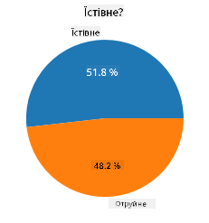
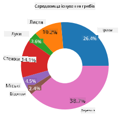
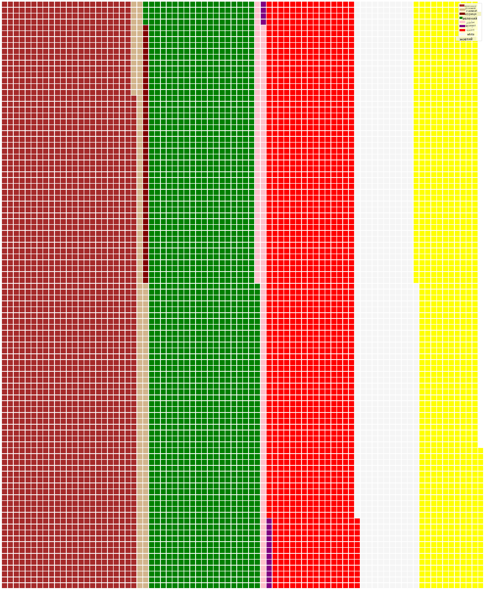

<!--
CO_OP_TRANSLATOR_METADATA:
{
  "original_hash": "af6a12015c6e250e500b570a9fa42593",
  "translation_date": "2025-08-30T18:58:48+00:00",
  "source_file": "3-Data-Visualization/11-visualization-proportions/README.md",
  "language_code": "uk"
}
-->
# Візуалізація пропорцій

|](../../sketchnotes/11-Visualizing-Proportions.png)|
|:---:|
|Візуалізація пропорцій - _Скетчноут від [@nitya](https://twitter.com/nitya)_ |

У цьому уроці ви використаєте інший набір даних, пов'язаний із природою, щоб візуалізувати пропорції, наприклад, скільки різних видів грибів представлено в наборі даних про гриби. Давайте дослідимо ці захоплюючі гриби, використовуючи набір даних від Audubon, який містить інформацію про 23 види пластинчастих грибів із родин Agaricus та Lepiota. Ви експериментуватимете з такими смачними візуалізаціями, як:

- Кругові діаграми 🥧
- Кільцеві діаграми 🍩
- Вафельні діаграми 🧇

> 💡 Дуже цікавий проєкт під назвою [Charticulator](https://charticulator.com) від Microsoft Research пропонує безкоштовний інтерфейс перетягування для створення візуалізацій даних. У одному з їхніх уроків також використовується цей набір даних про гриби! Тож ви можете досліджувати дані та вивчати бібліотеку одночасно: [Урок Charticulator](https://charticulator.com/tutorials/tutorial4.html).

## [Тест перед лекцією](https://purple-hill-04aebfb03.1.azurestaticapps.net/quiz/20)

## Дізнайтеся більше про свої гриби 🍄

Гриби дуже цікаві. Давайте імпортуємо набір даних, щоб їх вивчити:

```python
import pandas as pd
import matplotlib.pyplot as plt
mushrooms = pd.read_csv('../../data/mushrooms.csv')
mushrooms.head()
```
Виводиться таблиця з чудовими даними для аналізу:


| class     | cap-shape | cap-surface | cap-color | bruises | odor    | gill-attachment | gill-spacing | gill-size | gill-color | stalk-shape | stalk-root | stalk-surface-above-ring | stalk-surface-below-ring | stalk-color-above-ring | stalk-color-below-ring | veil-type | veil-color | ring-number | ring-type | spore-print-color | population | habitat |
| --------- | --------- | ----------- | --------- | ------- | ------- | --------------- | ------------ | --------- | ---------- | ----------- | ---------- | ------------------------ | ------------------------ | ---------------------- | ---------------------- | --------- | ---------- | ----------- | --------- | ----------------- | ---------- | ------- |
| Poisonous | Convex    | Smooth      | Brown     | Bruises | Pungent | Free            | Close        | Narrow    | Black      | Enlarging   | Equal      | Smooth                   | Smooth                   | White                  | White                  | Partial   | White      | One         | Pendant   | Black             | Scattered  | Urban   |
| Edible    | Convex    | Smooth      | Yellow    | Bruises | Almond  | Free            | Close        | Broad     | Black      | Enlarging   | Club       | Smooth                   | Smooth                   | White                  | White                  | Partial   | White      | One         | Pendant   | Brown             | Numerous   | Grasses |
| Edible    | Bell      | Smooth      | White     | Bruises | Anise   | Free            | Close        | Broad     | Brown      | Enlarging   | Club       | Smooth                   | Smooth                   | White                  | White                  | Partial   | White      | One         | Pendant   | Brown             | Numerous   | Meadows |
| Poisonous | Convex    | Scaly       | White     | Bruises | Pungent | Free            | Close        | Narrow    | Brown      | Enlarging   | Equal      | Smooth                   | Smooth                   | White                  | White                  | Partial   | White      | One         | Pendant   | Black             | Scattered  | Urban   |

Одразу помітно, що всі дані є текстовими. Вам потрібно буде конвертувати ці дані, щоб використовувати їх у діаграмі. Більшість даних, насправді, представлені як об'єкти:

```python
print(mushrooms.select_dtypes(["object"]).columns)
```

Результат:

```output
Index(['class', 'cap-shape', 'cap-surface', 'cap-color', 'bruises', 'odor',
       'gill-attachment', 'gill-spacing', 'gill-size', 'gill-color',
       'stalk-shape', 'stalk-root', 'stalk-surface-above-ring',
       'stalk-surface-below-ring', 'stalk-color-above-ring',
       'stalk-color-below-ring', 'veil-type', 'veil-color', 'ring-number',
       'ring-type', 'spore-print-color', 'population', 'habitat'],
      dtype='object')
```
Візьміть ці дані та перетворіть стовпець 'class' у категорію:

```python
cols = mushrooms.select_dtypes(["object"]).columns
mushrooms[cols] = mushrooms[cols].astype('category')
```

```python
edibleclass=mushrooms.groupby(['class']).count()
edibleclass
```

Тепер, якщо ви виведете дані про гриби, ви побачите, що вони згруповані за категоріями відповідно до класу їстівності/отруйності:


|           | cap-shape | cap-surface | cap-color | bruises | odor | gill-attachment | gill-spacing | gill-size | gill-color | stalk-shape | ... | stalk-surface-below-ring | stalk-color-above-ring | stalk-color-below-ring | veil-type | veil-color | ring-number | ring-type | spore-print-color | population | habitat |
| --------- | --------- | ----------- | --------- | ------- | ---- | --------------- | ------------ | --------- | ---------- | ----------- | --- | ------------------------ | ---------------------- | ---------------------- | --------- | ---------- | ----------- | --------- | ----------------- | ---------- | ------- |
| class     |           |             |           |         |      |                 |              |           |            |             |     |                          |                        |                        |           |            |             |           |                   |            |         |
| Edible    | 4208      | 4208        | 4208      | 4208    | 4208 | 4208            | 4208         | 4208      | 4208       | 4208        | ... | 4208                     | 4208                   | 4208                   | 4208      | 4208       | 4208        | 4208      | 4208              | 4208       | 4208    |
| Poisonous | 3916      | 3916        | 3916      | 3916    | 3916 | 3916            | 3916         | 3916      | 3916       | 3916        | ... | 3916                     | 3916                   | 3916                   | 3916      | 3916       | 3916        | 3916      | 3916              | 3916       | 3916    |

Якщо ви дотримуватиметеся порядку, представленого в цій таблиці, щоб створити мітки категорій класу, ви зможете побудувати кругову діаграму:

## Кругова діаграма!

```python
labels=['Edible','Poisonous']
plt.pie(edibleclass['population'],labels=labels,autopct='%.1f %%')
plt.title('Edible?')
plt.show()
```
Ось і все, кругова діаграма, яка показує пропорції даних відповідно до цих двох класів грибів. Дуже важливо правильно визначити порядок міток, особливо тут, тому обов'язково перевірте порядок, у якому створюється масив міток!



## Кільцева діаграма!

Трохи цікавішою візуально є кільцева діаграма, яка є круговою діаграмою з отвором посередині. Давайте подивимося на наші дані за допомогою цього методу.

Розгляньте різні середовища, де ростуть гриби:

```python
habitat=mushrooms.groupby(['habitat']).count()
habitat
```
Тут ви групуєте свої дані за середовищем. Їх є 7, тому використовуйте їх як мітки для кільцевої діаграми:

```python
labels=['Grasses','Leaves','Meadows','Paths','Urban','Waste','Wood']

plt.pie(habitat['class'], labels=labels,
        autopct='%1.1f%%', pctdistance=0.85)
  
center_circle = plt.Circle((0, 0), 0.40, fc='white')
fig = plt.gcf()

fig.gca().add_artist(center_circle)
  
plt.title('Mushroom Habitats')
  
plt.show()
```



Цей код створює діаграму та центральне коло, а потім додає це центральне коло до діаграми. Змініть ширину центрального кола, змінивши `0.40` на інше значення.

Кільцеві діаграми можна налаштовувати різними способами, щоб змінити мітки. Зокрема, мітки можна виділити для кращої читабельності. Дізнайтеся більше в [документації](https://matplotlib.org/stable/gallery/pie_and_polar_charts/pie_and_donut_labels.html?highlight=donut).

Тепер, коли ви знаєте, як групувати свої дані та відображати їх у вигляді кругової або кільцевої діаграми, ви можете дослідити інші типи діаграм. Спробуйте вафельну діаграму, яка є просто іншим способом візуалізації кількості.
## Вафельна діаграма!

Діаграма типу "вафля" — це інший спосіб візуалізації кількостей у вигляді двовимірного масиву квадратів. Спробуйте візуалізувати різні кількості кольорів шапок грибів у цьому наборі даних. Для цього вам потрібно встановити допоміжну бібліотеку під назвою [PyWaffle](https://pypi.org/project/pywaffle/) і використовувати Matplotlib:

```python
pip install pywaffle
```

Виберіть сегмент своїх даних для групування:

```python
capcolor=mushrooms.groupby(['cap-color']).count()
capcolor
```

Створіть вафельну діаграму, створивши мітки, а потім згрупувавши свої дані:

```python
import pandas as pd
import matplotlib.pyplot as plt
from pywaffle import Waffle
  
data ={'color': ['brown', 'buff', 'cinnamon', 'green', 'pink', 'purple', 'red', 'white', 'yellow'],
    'amount': capcolor['class']
     }
  
df = pd.DataFrame(data)
  
fig = plt.figure(
    FigureClass = Waffle,
    rows = 100,
    values = df.amount,
    labels = list(df.color),
    figsize = (30,30),
    colors=["brown", "tan", "maroon", "green", "pink", "purple", "red", "whitesmoke", "yellow"],
)
```

За допомогою вафельної діаграми ви можете чітко побачити пропорції кольорів шапок у цьому наборі даних про гриби. Цікаво, що є багато грибів із зеленими шапками!



✅ Pywaffle підтримує іконки в діаграмах, які використовують будь-які іконки, доступні в [Font Awesome](https://fontawesome.com/). Проведіть експерименти, щоб створити ще цікавішу вафельну діаграму, використовуючи іконки замість квадратів.

У цьому уроці ви дізналися три способи візуалізації пропорцій. Спочатку вам потрібно згрупувати свої дані в категорії, а потім вирішити, який спосіб відображення даних — кругова, кільцева чи вафельна діаграма — найкраще підходить. Усі вони смачні та надають користувачеві миттєвий знімок набору даних.

## 🚀 Виклик

Спробуйте відтворити ці смачні діаграми в [Charticulator](https://charticulator.com).
## [Тест після лекції](https://purple-hill-04aebfb03.1.azurestaticapps.net/quiz/21)

## Огляд і самостійне навчання

Іноді не очевидно, коли використовувати кругову, кільцеву чи вафельну діаграму. Ось кілька статей для ознайомлення з цією темою:

https://www.beautiful.ai/blog/battle-of-the-charts-pie-chart-vs-donut-chart

https://medium.com/@hypsypops/pie-chart-vs-donut-chart-showdown-in-the-ring-5d24fd86a9ce

https://www.mit.edu/~mbarker/formula1/f1help/11-ch-c6.htm

https://medium.datadriveninvestor.com/data-visualization-done-the-right-way-with-tableau-waffle-chart-fdf2a19be402

Проведіть дослідження, щоб знайти більше інформації про це складне рішення.
## Завдання

[Спробуйте в Excel](assignment.md)

---

**Відмова від відповідальності**:  
Цей документ був перекладений за допомогою сервісу автоматичного перекладу [Co-op Translator](https://github.com/Azure/co-op-translator). Хоча ми прагнемо до точності, будь ласка, майте на увазі, що автоматичні переклади можуть містити помилки або неточності. Оригінальний документ на його рідній мові слід вважати авторитетним джерелом. Для критичної інформації рекомендується професійний людський переклад. Ми не несемо відповідальності за будь-які непорозуміння або неправильні тлумачення, що виникають внаслідок використання цього перекладу.