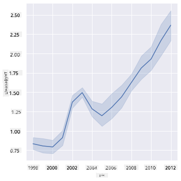
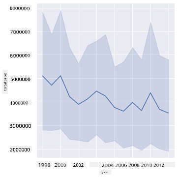
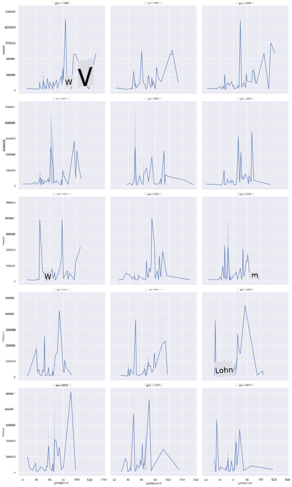
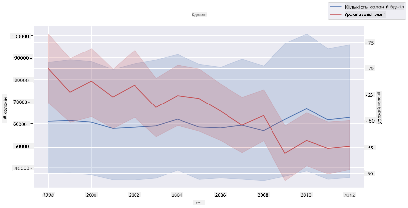

<!--
CO_OP_TRANSLATOR_METADATA:
{
  "original_hash": "cad419b574d5c35eaa417e9abfdcb0c8",
  "translation_date": "2025-08-30T19:12:02+00:00",
  "source_file": "3-Data-Visualization/12-visualization-relationships/README.md",
  "language_code": "uk"
}
-->
# Візуалізація взаємозв'язків: Усе про мед 🍯

|](../../sketchnotes/12-Visualizing-Relationships.png)|
|:---:|
|Візуалізація взаємозв'язків - _Скетчноут від [@nitya](https://twitter.com/nitya)_|

Продовжуючи нашу дослідницьку тему, пов’язану з природою, давайте розглянемо цікаві способи візуалізації взаємозв’язків між різними типами меду, використовуючи набір даних, отриманий із [Міністерства сільського господарства США](https://www.nass.usda.gov/About_NASS/index.php).

Цей набір даних, що містить близько 600 записів, відображає виробництво меду в багатьох штатах США. Наприклад, ви можете переглянути кількість колоній, урожайність на колонію, загальне виробництво, запаси, ціну за фунт і вартість виробленого меду в певному штаті за період з 1998 по 2012 рік, де кожен рядок відповідає одному року для кожного штату.

Цікаво буде візуалізувати взаємозв’язок між виробництвом меду в певному штаті за рік і, наприклад, ціною меду в цьому штаті. Або ж можна візуалізувати взаємозв’язок між урожайністю меду на колонію в різних штатах. Цей часовий проміжок охоплює руйнівний феномен «Синдром колапсу колоній» (CCD), вперше зафіксований у 2006 році (http://npic.orst.edu/envir/ccd.html), тому це дуже важливий набір даних для вивчення. 🐝

## [Передлекційний тест](https://purple-hill-04aebfb03.1.azurestaticapps.net/quiz/22)

У цьому уроці ви можете використовувати бібліотеку Seaborn, з якою ви вже працювали раніше, для візуалізації взаємозв’язків між змінними. Особливо цікавим є використання функції `relplot` у Seaborn, яка дозволяє створювати діаграми розсіювання та лінійні графіки для швидкої візуалізації '[статистичних взаємозв’язків](https://seaborn.pydata.org/tutorial/relational.html?highlight=relationships)', що допомагає аналітикам даних краще зрозуміти, як змінні пов’язані між собою.

## Діаграми розсіювання

Використовуйте діаграму розсіювання, щоб показати, як змінювалася ціна меду рік за роком у кожному штаті. Seaborn, використовуючи `relplot`, зручно групує дані за штатами та відображає точки даних як для категоріальних, так і для числових даних.

Почнемо з імпорту даних і бібліотеки Seaborn:

```python
import pandas as pd
import matplotlib.pyplot as plt
import seaborn as sns
honey = pd.read_csv('../../data/honey.csv')
honey.head()
```
Ви помітите, що дані про мед містять кілька цікавих стовпців, зокрема рік і ціну за фунт. Давайте дослідимо ці дані, згруповані за штатами США:

| state | numcol | yieldpercol | totalprod | stocks   | priceperlb | prodvalue | year |
| ----- | ------ | ----------- | --------- | -------- | ---------- | --------- | ---- |
| AL    | 16000  | 71          | 1136000   | 159000   | 0.72       | 818000    | 1998 |
| AZ    | 55000  | 60          | 3300000   | 1485000  | 0.64       | 2112000   | 1998 |
| AR    | 53000  | 65          | 3445000   | 1688000  | 0.59       | 2033000   | 1998 |
| CA    | 450000 | 83          | 37350000  | 12326000 | 0.62       | 23157000  | 1998 |
| CO    | 27000  | 72          | 1944000   | 1594000  | 0.7        | 1361000   | 1998 |

Створіть базову діаграму розсіювання, щоб показати взаємозв’язок між ціною за фунт меду та його штатом походження. Зробіть вісь `y` достатньо високою, щоб відобразити всі штати:

```python
sns.relplot(x="priceperlb", y="state", data=honey, height=15, aspect=.5);
```


Тепер покажіть ті самі дані з кольоровою схемою, що нагадує мед, щоб продемонструвати, як ціна змінюється з роками. Ви можете зробити це, додавши параметр 'hue', щоб показати зміни рік за роком:

> ✅ Дізнайтеся більше про [кольорові палітри, які можна використовувати в Seaborn](https://seaborn.pydata.org/tutorial/color_palettes.html) - спробуйте красиву райдужну палітру!

```python
sns.relplot(x="priceperlb", y="state", hue="year", palette="YlOrBr", data=honey, height=15, aspect=.5);
```


З цією зміною кольорової схеми ви можете побачити очевидну тенденцію до зростання ціни за фунт меду з роками. Дійсно, якщо ви перевірите вибірку даних (наприклад, штат Аризона), ви побачите закономірність підвищення цін рік за роком, за винятком кількох випадків:

| state | numcol | yieldpercol | totalprod | stocks  | priceperlb | prodvalue | year |
| ----- | ------ | ----------- | --------- | ------- | ---------- | --------- | ---- |
| AZ    | 55000  | 60          | 3300000   | 1485000 | 0.64       | 2112000   | 1998 |
| AZ    | 52000  | 62          | 3224000   | 1548000 | 0.62       | 1999000   | 1999 |
| AZ    | 40000  | 59          | 2360000   | 1322000 | 0.73       | 1723000   | 2000 |
| AZ    | 43000  | 59          | 2537000   | 1142000 | 0.72       | 1827000   | 2001 |
| AZ    | 38000  | 63          | 2394000   | 1197000 | 1.08       | 2586000   | 2002 |
| AZ    | 35000  | 72          | 2520000   | 983000  | 1.34       | 3377000   | 2003 |
| AZ    | 32000  | 55          | 1760000   | 774000  | 1.11       | 1954000   | 2004 |
| AZ    | 36000  | 50          | 1800000   | 720000  | 1.04       | 1872000   | 2005 |
| AZ    | 30000  | 65          | 1950000   | 839000  | 0.91       | 1775000   | 2006 |
| AZ    | 30000  | 64          | 1920000   | 902000  | 1.26       | 2419000   | 2007 |
| AZ    | 25000  | 64          | 1600000   | 336000  | 1.26       | 2016000   | 2008 |
| AZ    | 20000  | 52          | 1040000   | 562000  | 1.45       | 1508000   | 2009 |
| AZ    | 24000  | 77          | 1848000   | 665000  | 1.52       | 2809000   | 2010 |
| AZ    | 23000  | 53          | 1219000   | 427000  | 1.55       | 1889000   | 2011 |
| AZ    | 22000  | 46          | 1012000   | 253000  | 1.79       | 1811000   | 2012 |

Інший спосіб візуалізувати цю тенденцію — використовувати розмір, а не колір. Для користувачів із порушеннями сприйняття кольорів це може бути кращим варіантом. Змініть візуалізацію, щоб показати зростання ціни через збільшення розміру точок:

```python
sns.relplot(x="priceperlb", y="state", size="year", data=honey, height=15, aspect=.5);
```
Ви можете побачити, як розмір точок поступово збільшується.


Чи це простий випадок попиту та пропозиції? Через такі фактори, як зміна клімату та колапс колоній, чи стає меду менше з кожним роком, і тому ціна зростає?

Щоб знайти кореляцію між деякими змінними цього набору даних, давайте розглянемо лінійні графіки.

## Лінійні графіки

Питання: Чи є чітке зростання ціни меду за фунт рік за роком? Найпростіше це побачити, створивши один лінійний графік:

```python
sns.relplot(x="year", y="priceperlb", kind="line", data=honey);
```
Відповідь: Так, з деякими винятками близько 2003 року:



✅ Оскільки Seaborn агрегує дані в одну лінію, він відображає "кілька вимірювань для кожного значення x, обчислюючи середнє значення та 95% довірчий інтервал навколо нього". [Джерело](https://seaborn.pydata.org/tutorial/relational.html). Цю поведінку можна вимкнути, додавши `ci=None`.

Питання: А чи можемо ми побачити сплеск у постачанні меду в 2003 році? Що, якщо подивитися на загальне виробництво рік за роком?

```python
sns.relplot(x="year", y="totalprod", kind="line", data=honey);
```



Відповідь: Не зовсім. Якщо подивитися на загальне виробництво, то воно, здається, навіть зросло в цьому році, хоча загалом кількість виробленого меду зменшується протягом цих років.

Питання: У такому разі, що могло спричинити сплеск ціни меду близько 2003 року?

Щоб це з’ясувати, можна використати сітку фасетів.

## Сітки фасетів

Сітки фасетів дозволяють взяти одну змінну вашого набору даних (у нашому випадку це може бути 'рік', щоб уникнути надто великої кількості фасетів). Seaborn може створити графік для кожного з цих фасетів за обраними координатами x та y для зручнішого порівняння. Чи виділяється 2003 рік у такому порівнянні?

Створіть сітку фасетів, продовжуючи використовувати `relplot`, як це рекомендується в [документації Seaborn](https://seaborn.pydata.org/generated/seaborn.FacetGrid.html?highlight=facetgrid#seaborn.FacetGrid).

```python
sns.relplot(
    data=honey, 
    x="yieldpercol", y="numcol",
    col="year", 
    col_wrap=3,
    kind="line"
```
У цій візуалізації ви можете порівняти урожайність на колонію та кількість колоній рік за роком, розташувавши графіки в три колонки:



Для цього набору даних нічого особливого не виділяється щодо кількості колоній та їх урожайності рік за роком і штат за штатом. Чи є інший спосіб знайти кореляцію між цими двома змінними?

## Подвійні лінійні графіки

Спробуйте багатолінійний графік, наклавши два лінійні графіки один на одного, використовуючи функцію Seaborn `despine` для видалення верхньої та правої рамок, а також `ax.twinx` [з Matplotlib](https://matplotlib.org/stable/api/_as_gen/matplotlib.axes.Axes.twinx.html). Twinx дозволяє графіку ділити вісь x і відображати дві осі y. Отже, відобразіть урожайність на колонію та кількість колоній, накладені один на одного:

```python
fig, ax = plt.subplots(figsize=(12,6))
lineplot = sns.lineplot(x=honey['year'], y=honey['numcol'], data=honey, 
                        label = 'Number of bee colonies', legend=False)
sns.despine()
plt.ylabel('# colonies')
plt.title('Honey Production Year over Year');

ax2 = ax.twinx()
lineplot2 = sns.lineplot(x=honey['year'], y=honey['yieldpercol'], ax=ax2, color="r", 
                         label ='Yield per colony', legend=False) 
sns.despine(right=False)
plt.ylabel('colony yield')
ax.figure.legend();
```


Хоча нічого особливого не виділяється близько 2003 року, це дозволяє завершити урок на більш оптимістичній ноті: хоча загалом кількість колоній зменшується, їх кількість стабілізується, навіть якщо їх урожайність на колонію знижується.

Вперед, бджоли! 🐝❤️

## 🚀 Виклик

У цьому уроці ви дізналися більше про використання діаграм розсіювання та сіток фасетів. Спробуйте створити сітку фасетів, використовуючи інший набір даних, можливо, той, який ви використовували раніше. Зверніть увагу, скільки часу потрібно для їх створення, і будьте обережні з кількістю графіків, які потрібно намалювати за допомогою цих технік.

## [Післялекційний тест](https://purple-hill-04aebfb03.1.azurestaticapps.net/quiz/23)

## Огляд і самостійне навчання

Лінійні графіки можуть бути простими або досить складними. Почитайте [документацію Seaborn](https://seaborn.pydata.org/generated/seaborn.lineplot.html) про різні способи їх створення. Спробуйте вдосконалити лінійні графіки, які ви створили в цьому уроці, використовуючи інші методи, зазначені в документації.

## Завдання

[Занурення в бджолиний вулик](assignment.md)

---

**Відмова від відповідальності**:  
Цей документ був перекладений за допомогою сервісу автоматичного перекладу [Co-op Translator](https://github.com/Azure/co-op-translator). Хоча ми прагнемо до точності, будь ласка, майте на увазі, що автоматичні переклади можуть містити помилки або неточності. Оригінальний документ на його рідній мові слід вважати авторитетним джерелом. Для критичної інформації рекомендується професійний людський переклад. Ми не несемо відповідальності за будь-які непорозуміння або неправильні тлумачення, що виникають внаслідок використання цього перекладу.