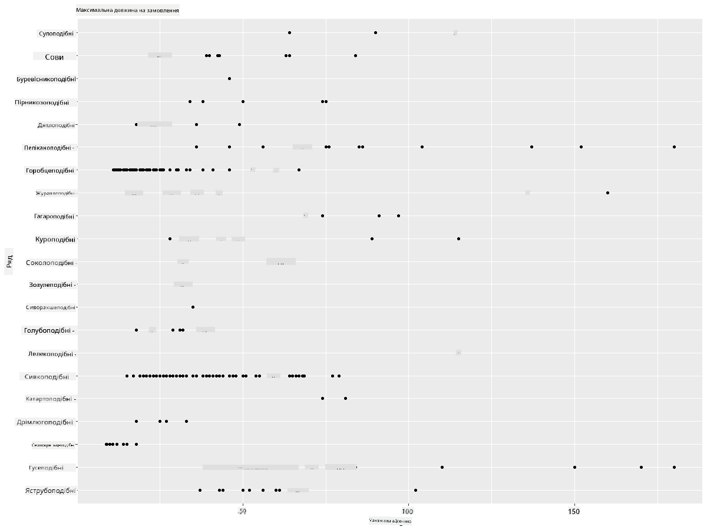
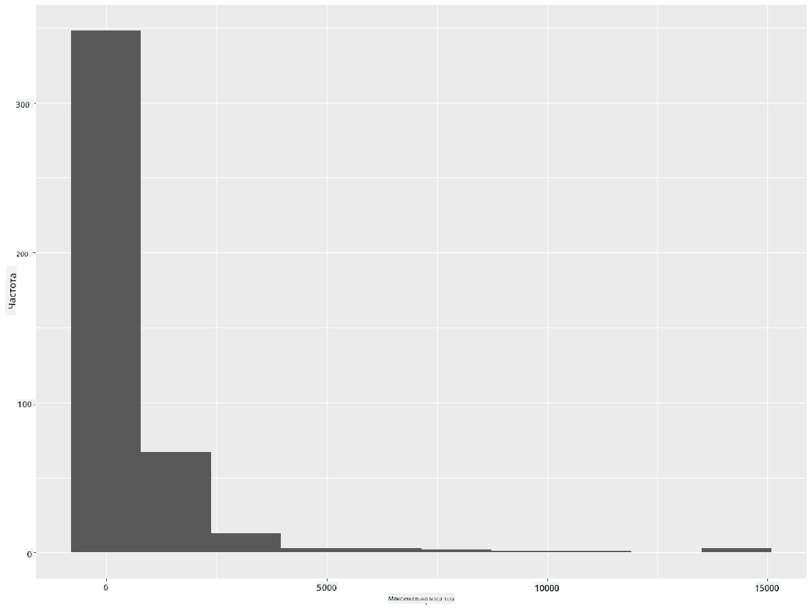
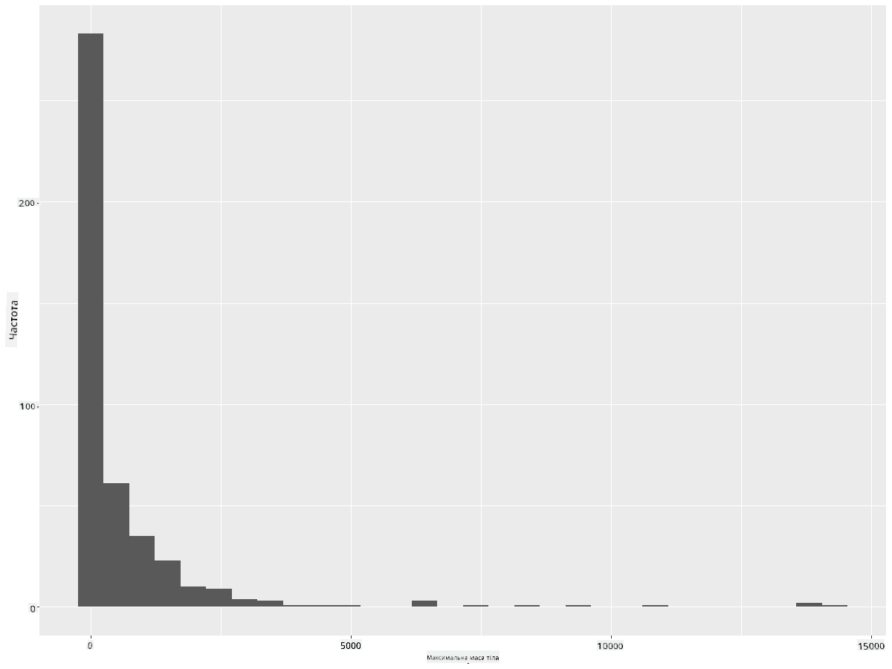
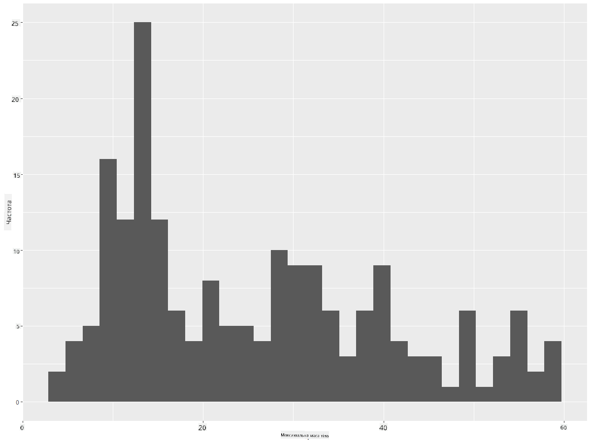
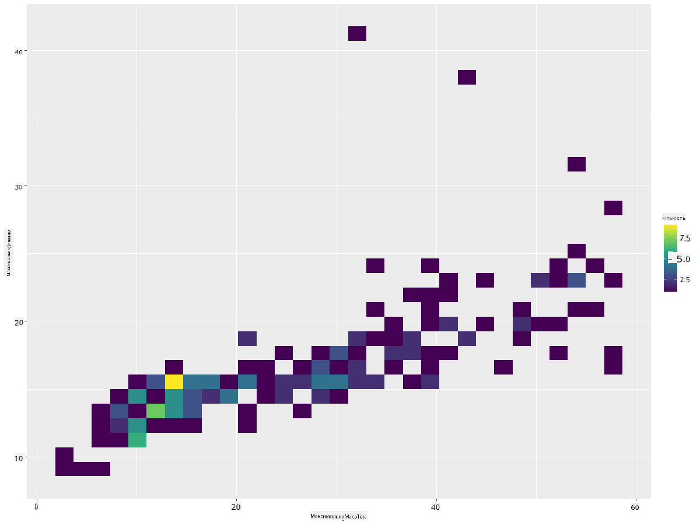
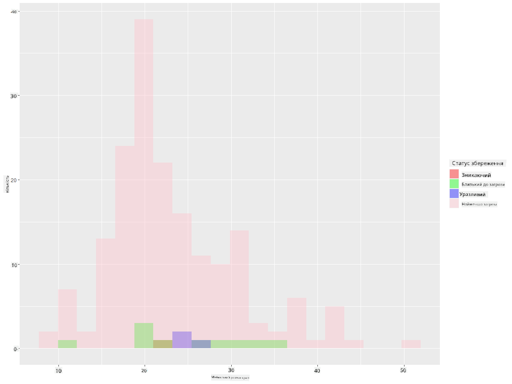
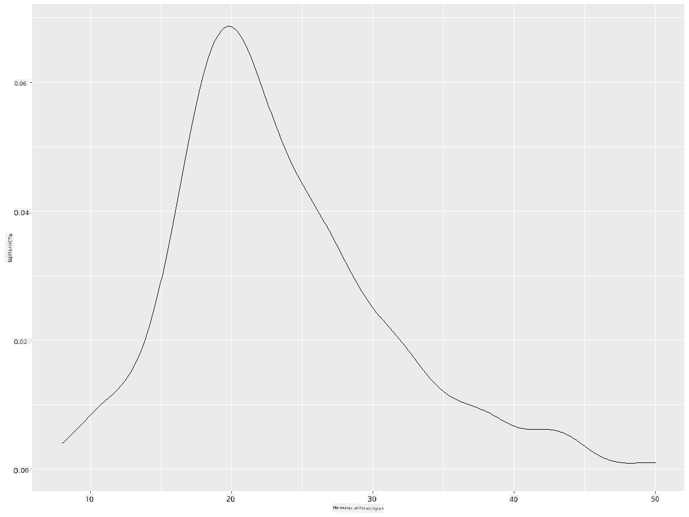
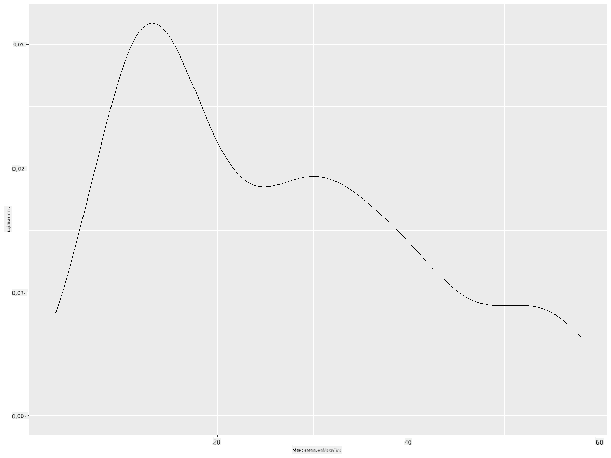
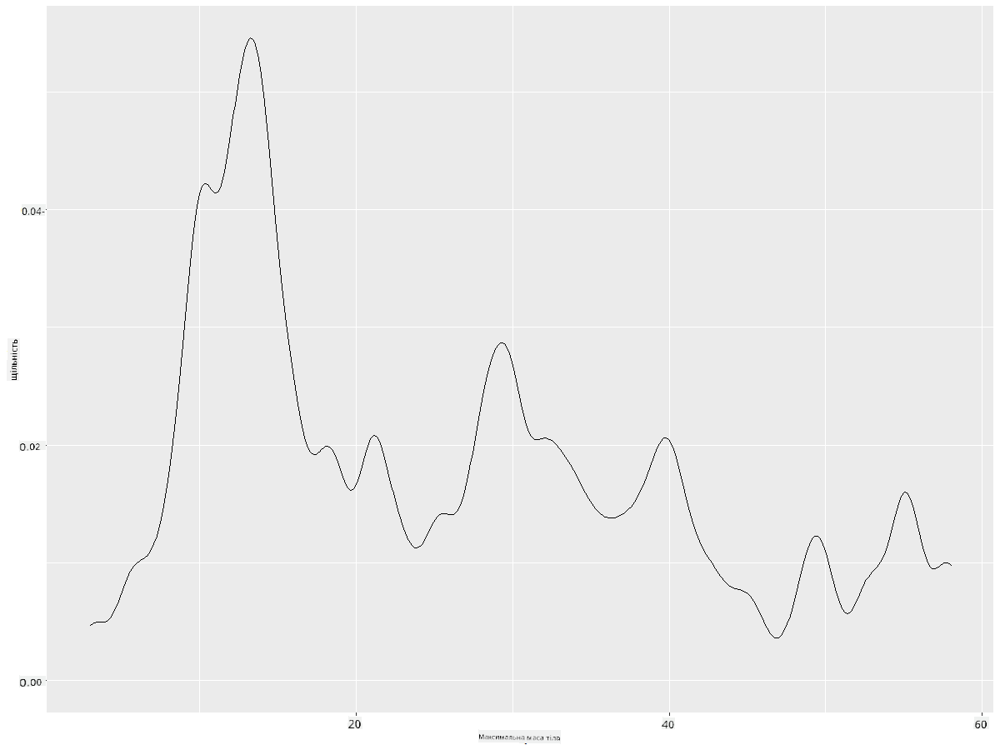
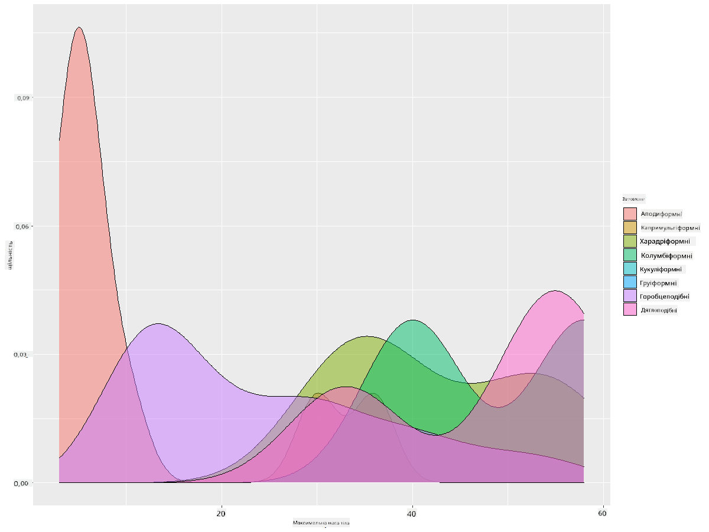

<!--
CO_OP_TRANSLATOR_METADATA:
{
  "original_hash": "ea67c0c40808fd723594de6896c37ccf",
  "translation_date": "2025-08-30T18:51:45+00:00",
  "source_file": "3-Data-Visualization/R/10-visualization-distributions/README.md",
  "language_code": "uk"
}
-->
# Візуалізація розподілів

| ](https://github.com/microsoft/Data-Science-For-Beginners/blob/main/sketchnotes/10-Visualizing-Distributions.png)|
|:---:|
| Візуалізація розподілів - _Скетчноут від [@nitya](https://twitter.com/nitya)_ |

У попередньому уроці ви дізналися кілька цікавих фактів про набір даних про птахів Міннесоти. Ви знайшли помилкові дані, візуалізуючи аномалії, і розглянули відмінності між категоріями птахів за їх максимальною довжиною.

## [Тест перед лекцією](https://purple-hill-04aebfb03.1.azurestaticapps.net/quiz/18)
## Дослідження набору даних про птахів

Ще один спосіб дослідження даних — це аналіз їх розподілу, тобто того, як дані організовані вздовж осі. Наприклад, можливо, ви хочете дізнатися загальний розподіл максимального розмаху крил або максимальної маси тіла для птахів Міннесоти в цьому наборі даних.

Давайте відкриємо кілька фактів про розподіли даних у цьому наборі. У вашій консолі R імпортуйте `ggplot2` і базу даних. Видаліть аномалії з бази даних так само, як у попередній темі.

```r
library(ggplot2)

birds <- read.csv("../../data/birds.csv",fileEncoding="UTF-8-BOM")

birds_filtered <- subset(birds, MaxWingspan < 500)
head(birds_filtered)
```
|      | Назва                        | Наукова назва          | Категорія             | Ряд          | Родина   | Рід         | Статус збереження   | МінДовжина | МаксДовжина | МінМасаТіла | МаксМасаТіла | МінРозмахКрил | МаксРозмахКрил |
| ---: | :--------------------------- | :--------------------- | :-------------------- | :----------- | :------- | :---------- | :----------------- | --------: | --------: | ----------: | ----------: | ----------: | ----------: |
|    0 | Чорночеревий свистячий качур | Dendrocygna autumnalis | Качки/Гуси/Водоплавні | Anseriformes | Anatidae | Dendrocygna | LC                 |        47 |        56 |         652 |        1020 |          76 |          94 |
|    1 | Рудий свистячий качур        | Dendrocygna bicolor    | Качки/Гуси/Водоплавні | Anseriformes | Anatidae | Dendrocygna | LC                 |        45 |        53 |         712 |        1050 |          85 |          93 |
|    2 | Біла гуска                   | Anser caerulescens     | Качки/Гуси/Водоплавні | Anseriformes | Anatidae | Anser       | LC                 |        64 |        79 |        2050 |        4050 |         135 |         165 |
|    3 | Гуска Росса                  | Anser rossii           | Качки/Гуси/Водоплавні | Anseriformes | Anatidae | Anser       | LC                 |      57.3 |        64 |        1066 |        1567 |         113 |         116 |
|    4 | Велика білолоба гуска        | Anser albifrons        | Качки/Гуси/Водоплавні | Anseriformes | Anatidae | Anser       | LC                 |        64 |        81 |        1930 |        3310 |         130 |         165 |

Загалом, ви можете швидко переглянути, як дані розподілені, використовуючи точковий графік, як ми робили в попередньому уроці:

```r
ggplot(data=birds_filtered, aes(x=Order, y=MaxLength,group=1)) +
  geom_point() +
  ggtitle("Max Length per order") + coord_flip()
```


Це дає загальний огляд розподілу довжини тіла за рядом птахів, але це не найкращий спосіб відображення справжніх розподілів. Для цього зазвичай створюють гістограму.
## Робота з гістограмами

`ggplot2` пропонує чудові способи візуалізації розподілу даних за допомогою гістограм. Цей тип графіка схожий на стовпчасту діаграму, де розподіл можна побачити через підйом і спад стовпців. Для створення гістограми потрібні числові дані. Щоб створити гістограму, можна побудувати графік, визначивши тип як 'hist' для гістограми. Цей графік показує розподіл MaxBodyMass для всього діапазону числових даних набору. Розділяючи масив даних на менші групи, він може відобразити розподіл значень даних:

```r
ggplot(data = birds_filtered, aes(x = MaxBodyMass)) + 
  geom_histogram(bins=10)+ylab('Frequency')
```


Як видно, більшість із 400+ птахів у цьому наборі даних мають масу тіла менше 2000. Отримайте більше інформації про дані, змінивши параметр `bins` на більше значення, наприклад, 30:

```r
ggplot(data = birds_filtered, aes(x = MaxBodyMass)) + geom_histogram(bins=30)+ylab('Frequency')
```



Цей графік показує розподіл у трохи більш деталізованому вигляді. Менш зміщений графік можна створити, вибравши дані лише в заданому діапазоні:

Відфільтруйте дані, щоб отримати лише тих птахів, чия маса тіла менше 60, і покажіть 30 `bins`:

```r
birds_filtered_1 <- subset(birds_filtered, MaxBodyMass > 1 & MaxBodyMass < 60)
ggplot(data = birds_filtered_1, aes(x = MaxBodyMass)) + 
  geom_histogram(bins=30)+ylab('Frequency')
```



✅ Спробуйте інші фільтри та точки даних. Щоб побачити повний розподіл даних, видаліть фільтр `['MaxBodyMass']`, щоб показати розподіли з мітками.

Гістограма пропонує також цікаві покращення кольору та міток:

Створіть 2D гістограму, щоб порівняти взаємозв’язок між двома розподілами. Давайте порівняємо `MaxBodyMass` і `MaxLength`. `ggplot2` пропонує вбудований спосіб показати збіг за допомогою яскравіших кольорів:

```r
ggplot(data=birds_filtered_1, aes(x=MaxBodyMass, y=MaxLength) ) +
  geom_bin2d() +scale_fill_continuous(type = "viridis")
```
Здається, є очікуваний кореляційний зв’язок між цими двома елементами вздовж передбачуваної осі, з одним особливо сильним точковим збігом:



Гістограми добре працюють за замовчуванням для числових даних. А що, якщо потрібно побачити розподіли за текстовими даними? 
## Дослідження набору даних для розподілів за текстовими даними 

Цей набір даних також містить корисну інформацію про категорію птахів, їх рід, вид і родину, а також статус збереження. Давайте дослідимо інформацію про статус збереження. Який розподіл птахів за їх статусом збереження?

> ✅ У наборі даних використовуються кілька абревіатур для опису статусу збереження. Ці абревіатури походять із [Категорій Червоного списку МСОП](https://www.iucnredlist.org/), організації, яка каталогізує статус видів.
> 
> - CR: Критично зникаючий
> - EN: Зникаючий
> - EX: Вимерлий
> - LC: Найменша загроза
> - NT: Близький до загрози
> - VU: Уразливий

Це текстові значення, тому вам потрібно буде виконати трансформацію для створення гістограми. Використовуючи dataframe filteredBirds, відобразіть його статус збереження разом із мінімальним розмахом крил. Що ви бачите? 

```r
birds_filtered_1$ConservationStatus[birds_filtered_1$ConservationStatus == 'EX'] <- 'x1' 
birds_filtered_1$ConservationStatus[birds_filtered_1$ConservationStatus == 'CR'] <- 'x2'
birds_filtered_1$ConservationStatus[birds_filtered_1$ConservationStatus == 'EN'] <- 'x3'
birds_filtered_1$ConservationStatus[birds_filtered_1$ConservationStatus == 'NT'] <- 'x4'
birds_filtered_1$ConservationStatus[birds_filtered_1$ConservationStatus == 'VU'] <- 'x5'
birds_filtered_1$ConservationStatus[birds_filtered_1$ConservationStatus == 'LC'] <- 'x6'

ggplot(data=birds_filtered_1, aes(x = MinWingspan, fill = ConservationStatus)) +
  geom_histogram(position = "identity", alpha = 0.4, bins = 20) +
  scale_fill_manual(name="Conservation Status",values=c("red","green","blue","pink"),labels=c("Endangered","Near Threathened","Vulnerable","Least Concern"))
```



Здається, немає чіткої кореляції між мінімальним розмахом крил і статусом збереження. Перевірте інші елементи набору даних, використовуючи цей метод. Ви можете спробувати різні фільтри. Чи знаходите ви якусь кореляцію?

## Графіки щільності

Ви могли помітити, що гістограми, які ми розглядали до цього, мають "ступінчастий" вигляд і не плавно переходять у дугу. Щоб показати більш плавний графік щільності, можна спробувати графік щільності.

Давайте попрацюємо з графіками щільності!

```r
ggplot(data = birds_filtered_1, aes(x = MinWingspan)) + 
  geom_density()
```


Ви можете побачити, як графік повторює попередній для даних про мінімальний розмах крил; він просто трохи плавніший. Якщо ви хотіли б повернутися до того нерівного графіка MaxBodyMass у другому побудованому вами графіку, ви могли б дуже добре згладити його, відтворивши цей метод:

```r
ggplot(data = birds_filtered_1, aes(x = MaxBodyMass)) + 
  geom_density()
```


Якщо ви хочете отримати плавну, але не надто плавну лінію, змініть параметр `adjust`: 

```r
ggplot(data = birds_filtered_1, aes(x = MaxBodyMass)) + 
  geom_density(adjust = 1/5)
```


✅ Ознайомтеся з параметрами, доступними для цього типу графіка, і експериментуйте!

Цей тип графіка пропонує чудові пояснювальні візуалізації. Наприклад, за кілька рядків коду ви можете показати щільність максимальної маси тіла за рядом птахів:

```r
ggplot(data=birds_filtered_1,aes(x = MaxBodyMass, fill = Order)) +
  geom_density(alpha=0.5)
```


## 🚀 Виклик

Гістограми є більш складним типом графіка, ніж базові точкові графіки, стовпчасті діаграми або лінійні графіки. Знайдіть в інтернеті хороші приклади використання гістограм. Як вони використовуються, що вони демонструють і в яких галузях або сферах дослідження їх зазвичай застосовують?

## [Тест після лекції](https://purple-hill-04aebfb03.1.azurestaticapps.net/quiz/19)

## Огляд і самостійне навчання

У цьому уроці ви використовували `ggplot2` і почали працювати над створенням більш складних графіків. Проведіть дослідження про `geom_density_2d()` — "безперервна крива щільності ймовірності в одному або кількох вимірах". Ознайомтеся з [документацією](https://ggplot2.tidyverse.org/reference/geom_density_2d.html), щоб зрозуміти, як це працює.

## Завдання

[Застосуйте свої навички](assignment.md)

---

**Відмова від відповідальності**:  
Цей документ був перекладений за допомогою сервісу автоматичного перекладу [Co-op Translator](https://github.com/Azure/co-op-translator). Хоча ми прагнемо до точності, будь ласка, майте на увазі, що автоматичні переклади можуть містити помилки або неточності. Оригінальний документ на його рідній мові слід вважати авторитетним джерелом. Для критичної інформації рекомендується професійний людський переклад. Ми не несемо відповідальності за будь-які непорозуміння або неправильні тлумачення, що виникають внаслідок використання цього перекладу.