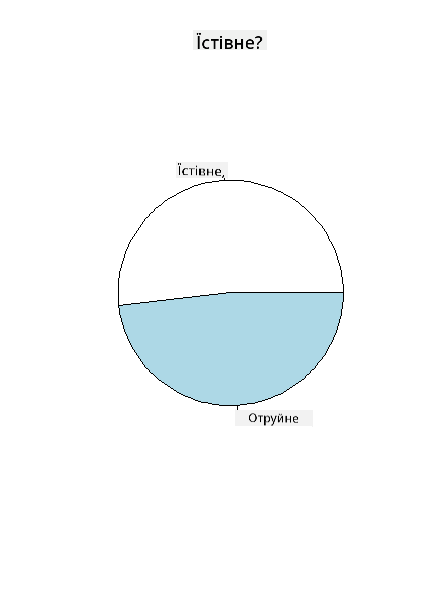
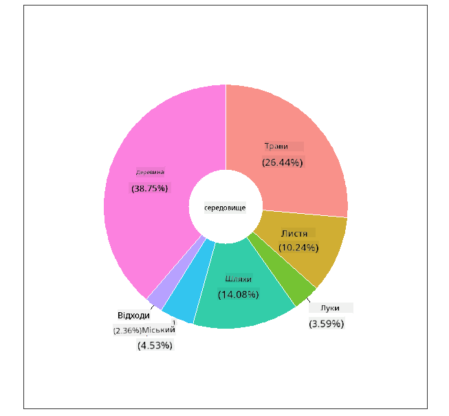
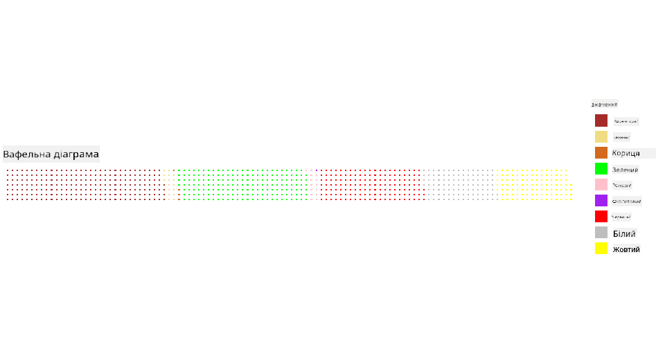

<!--
CO_OP_TRANSLATOR_METADATA:
{
  "original_hash": "47028abaaafa2bcb1079702d20569066",
  "translation_date": "2025-08-30T18:41:24+00:00",
  "source_file": "3-Data-Visualization/R/11-visualization-proportions/README.md",
  "language_code": "uk"
}
-->
# Візуалізація пропорцій

|](../../../sketchnotes/11-Visualizing-Proportions.png)|
|:---:|
|Візуалізація пропорцій - _Скетчнот від [@nitya](https://twitter.com/nitya)_ |

У цьому уроці ви використаєте інший набір даних, пов'язаний із природою, щоб візуалізувати пропорції, наприклад, скільки різних видів грибів представлено в заданому наборі даних про гриби. Давайте дослідимо ці захоплюючі гриби, використовуючи набір даних від Audubon, який містить інформацію про 23 види пластинчастих грибів із родин Agaricus і Lepiota. Ви експериментуватимете з такими смачними візуалізаціями, як:

- Кругові діаграми 🥧
- Кільцеві діаграми 🍩
- Вафельні діаграми 🧇

> 💡 Дуже цікавий проєкт під назвою [Charticulator](https://charticulator.com) від Microsoft Research пропонує безкоштовний інтерфейс перетягування для створення візуалізацій даних. У одному з їхніх навчальних посібників також використовується цей набір даних про гриби! Тож ви можете досліджувати дані та вивчати бібліотеку одночасно: [Навчальний посібник Charticulator](https://charticulator.com/tutorials/tutorial4.html).

## [Тест перед лекцією](https://purple-hill-04aebfb03.1.azurestaticapps.net/quiz/20)

## Дізнайтеся більше про свої гриби 🍄

Гриби дуже цікаві. Давайте імпортуємо набір даних, щоб їх вивчити:

```r
mushrooms = read.csv('../../data/mushrooms.csv')
head(mushrooms)
```
Виводиться таблиця з чудовими даними для аналізу:


| class     | cap-shape | cap-surface | cap-color | bruises | odor    | gill-attachment | gill-spacing | gill-size | gill-color | stalk-shape | stalk-root | stalk-surface-above-ring | stalk-surface-below-ring | stalk-color-above-ring | stalk-color-below-ring | veil-type | veil-color | ring-number | ring-type | spore-print-color | population | habitat |
| --------- | --------- | ----------- | --------- | ------- | ------- | --------------- | ------------ | --------- | ---------- | ----------- | ---------- | ------------------------ | ------------------------ | ---------------------- | ---------------------- | --------- | ---------- | ----------- | --------- | ----------------- | ---------- | ------- |
| Poisonous | Convex    | Smooth      | Brown     | Bruises | Pungent | Free            | Close        | Narrow    | Black      | Enlarging   | Equal      | Smooth                   | Smooth                   | White                  | White                  | Partial   | White      | One         | Pendant   | Black             | Scattered  | Urban   |
| Edible    | Convex    | Smooth      | Yellow    | Bruises | Almond  | Free            | Close        | Broad     | Black      | Enlarging   | Club       | Smooth                   | Smooth                   | White                  | White                  | Partial   | White      | One         | Pendant   | Brown             | Numerous   | Grasses |
| Edible    | Bell      | Smooth      | White     | Bruises | Anise   | Free            | Close        | Broad     | Brown      | Enlarging   | Club       | Smooth                   | Smooth                   | White                  | White                  | Partial   | White      | One         | Pendant   | Brown             | Numerous   | Meadows |
| Poisonous | Convex    | Scaly       | White     | Bruises | Pungent | Free            | Close        | Narrow    | Brown      | Enlarging   | Equal      | Smooth                   | Smooth                   | White                  | White                  | Partial   | White      | One         | Pendant   | Black             | Scattered  | Urban 
| Edible | Convex       |Smooth       | Green     | No Bruises| None   |Free            | Crowded       | Broad     | Black      | Tapering   | Equal      |  Smooth | Smooth                    | White                 | White                  | Partial    | White     | One         | Evanescent | Brown             | Abundant | Grasses
|Edible  |  Convex      | Scaly   | Yellow         | Bruises  | Almond  | Free | Close  |   Broad   |   Brown  | Enlarging   |   Club                      | Smooth                  | Smooth    | White                 |  White                | Partial      | White    |  One  |  Pendant | Black   | Numerous | Grasses
      
Одразу помітно, що всі дані є текстовими. Вам потрібно буде конвертувати ці дані, щоб використовувати їх у діаграмі. Більшість даних, насправді, представлені як об'єкти:

```r
names(mushrooms)
```

Результат:

```output
[1] "class"                    "cap.shape"               
 [3] "cap.surface"              "cap.color"               
 [5] "bruises"                  "odor"                    
 [7] "gill.attachment"          "gill.spacing"            
 [9] "gill.size"                "gill.color"              
[11] "stalk.shape"              "stalk.root"              
[13] "stalk.surface.above.ring" "stalk.surface.below.ring"
[15] "stalk.color.above.ring"   "stalk.color.below.ring"  
[17] "veil.type"                "veil.color"              
[19] "ring.number"              "ring.type"               
[21] "spore.print.color"        "population"              
[23] "habitat"            
```
Візьміть ці дані та перетворіть стовпець 'class' у категорію:

```r
library(dplyr)
grouped=mushrooms %>%
  group_by(class) %>%
  summarise(count=n())
```


Тепер, якщо ви виведете дані про гриби, ви побачите, що вони згруповані за категоріями відповідно до класу їстівності/отруйності:
```r
View(grouped)
```


| class | count |
| --------- | --------- |
| Edible | 4208 |
| Poisonous| 3916 |


Якщо ви дотримаєтеся порядку, представленого в цій таблиці, щоб створити мітки категорій класу, ви зможете побудувати кругову діаграму.

## Кругова діаграма!

```r
pie(grouped$count,grouped$class, main="Edible?")
```
Вуаля, кругова діаграма, яка показує пропорції цих даних відповідно до двох класів грибів. Дуже важливо правильно впорядкувати мітки, особливо тут, тому обов'язково перевірте порядок, у якому створюється масив міток!



## Кільцева діаграма!

Дещо цікавішою візуально є кільцева діаграма, яка є круговою діаграмою з отвором посередині. Давайте подивимося на наші дані за допомогою цього методу.

Розгляньте різні середовища, де ростуть гриби:

```r
library(dplyr)
habitat=mushrooms %>%
  group_by(habitat) %>%
  summarise(count=n())
View(habitat)
```
Результат:
| habitat| count |
| --------- | --------- |
| Grasses    | 2148 |
| Leaves| 832 |
| Meadows    | 292 |
| Paths| 1144 |
| Urban    | 368 |
| Waste| 192 |
| Wood| 3148 |


Тут ви групуєте свої дані за середовищем. Є 7 категорій, тому використовуйте їх як мітки для своєї кільцевої діаграми:

```r
library(ggplot2)
library(webr)
PieDonut(habitat, aes(habitat, count=count))
```



Цей код використовує дві бібліотеки - ggplot2 і webr. Використовуючи функцію PieDonut з бібліотеки webr, ми можемо легко створити кільцеву діаграму!

Кільцеві діаграми в R можна створювати, використовуючи лише бібліотеку ggplot2. Ви можете дізнатися більше про це [тут](https://www.r-graph-gallery.com/128-ring-or-donut-plot.html) і спробувати самостійно.

Тепер, коли ви знаєте, як групувати дані та відображати їх у вигляді кругової або кільцевої діаграми, ви можете дослідити інші типи діаграм. Спробуйте вафельну діаграму, яка є просто іншим способом візуалізації кількості.
## Вафельна діаграма!

Діаграма типу "вафля" - це інший спосіб візуалізації кількостей у вигляді двовимірного масиву квадратів. Спробуйте візуалізувати різні кількості кольорів капелюшків грибів у цьому наборі даних. Для цього вам потрібно встановити допоміжну бібліотеку під назвою [waffle](https://cran.r-project.org/web/packages/waffle/waffle.pdf) і використовувати її для створення своєї візуалізації:

```r
install.packages("waffle", repos = "https://cinc.rud.is")
```

Виберіть сегмент своїх даних для групування:

```r
library(dplyr)
cap_color=mushrooms %>%
  group_by(cap.color) %>%
  summarise(count=n())
View(cap_color)
```

Створіть вафельну діаграму, створивши мітки, а потім згрупувавши свої дані:

```r
library(waffle)
names(cap_color$count) = paste0(cap_color$cap.color)
waffle((cap_color$count/10), rows = 7, title = "Waffle Chart")+scale_fill_manual(values=c("brown", "#F0DC82", "#D2691E", "green", 
                                                                                     "pink", "purple", "red", "grey", 
                                                                                     "yellow","white"))
```

Використовуючи вафельну діаграму, ви можете чітко побачити пропорції кольорів капелюшків у цьому наборі даних про гриби. Цікаво, що є багато грибів із зеленими капелюшками!



У цьому уроці ви дізналися три способи візуалізації пропорцій. Спочатку потрібно згрупувати свої дані в категорії, а потім вирішити, який спосіб відображення даних - кругова, кільцева чи вафельна діаграма - найкраще підходить. Усі вони "смачні" та надають користувачеві миттєвий знімок набору даних.

## 🚀 Виклик

Спробуйте відтворити ці "смачні" діаграми в [Charticulator](https://charticulator.com).
## [Тест після лекції](https://purple-hill-04aebfb03.1.azurestaticapps.net/quiz/21)

## Огляд і самостійне навчання

Іноді не очевидно, коли використовувати кругову, кільцеву чи вафельну діаграму. Ось кілька статей для ознайомлення з цією темою:

https://www.beautiful.ai/blog/battle-of-the-charts-pie-chart-vs-donut-chart

https://medium.com/@hypsypops/pie-chart-vs-donut-chart-showdown-in-the-ring-5d24fd86a9ce

https://www.mit.edu/~mbarker/formula1/f1help/11-ch-c6.htm

https://medium.datadriveninvestor.com/data-visualization-done-the-right-way-with-tableau-waffle-chart-fdf2a19be402

Проведіть дослідження, щоб знайти більше інформації про це складне рішення.
## Завдання

[Спробуйте це в Excel](assignment.md)

---

**Відмова від відповідальності**:  
Цей документ було перекладено за допомогою сервісу автоматичного перекладу [Co-op Translator](https://github.com/Azure/co-op-translator). Хоча ми прагнемо до точності, звертаємо вашу увагу, що автоматичні переклади можуть містити помилки або неточності. Оригінальний документ мовою оригіналу слід вважати авторитетним джерелом. Для критично важливої інформації рекомендується звертатися до професійного людського перекладу. Ми не несемо відповідальності за будь-які непорозуміння або неправильні тлумачення, що виникли внаслідок використання цього перекладу.