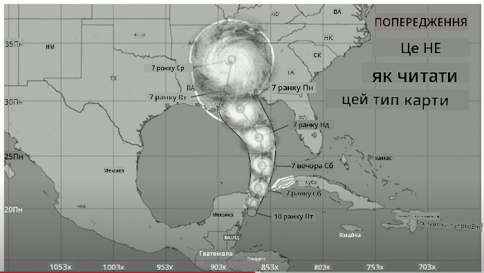
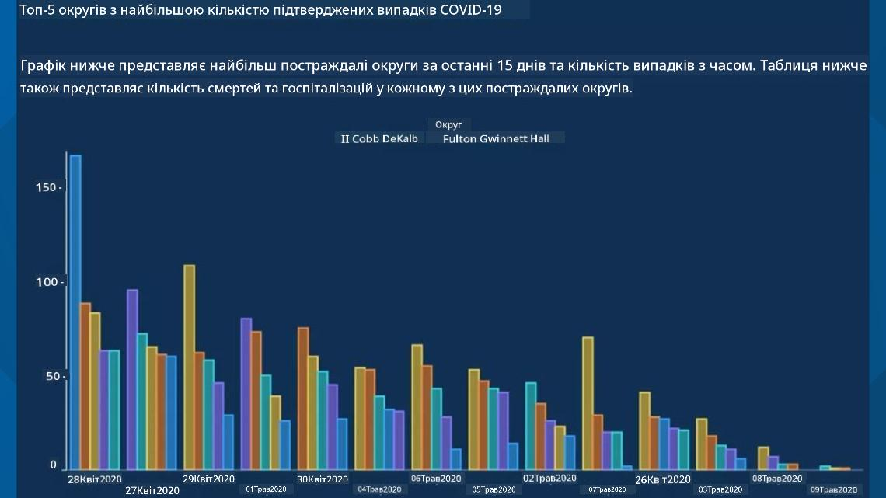
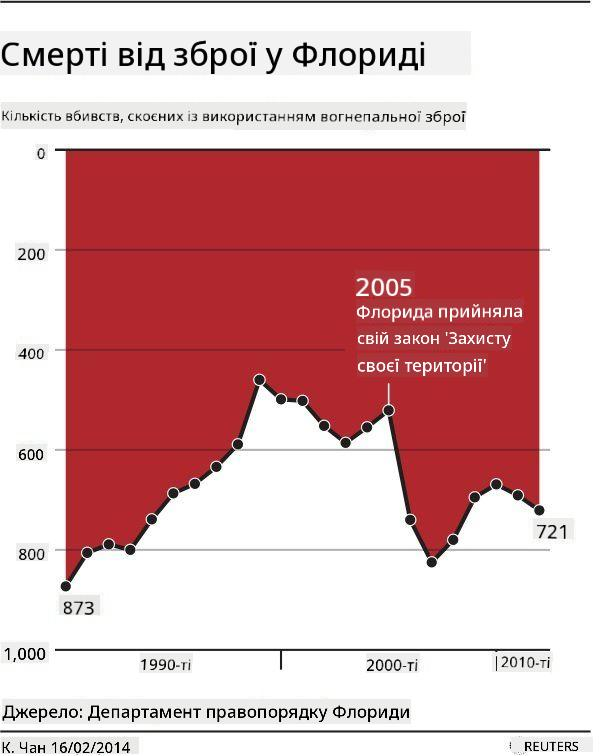
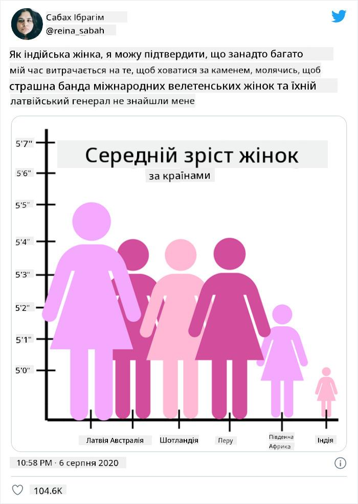
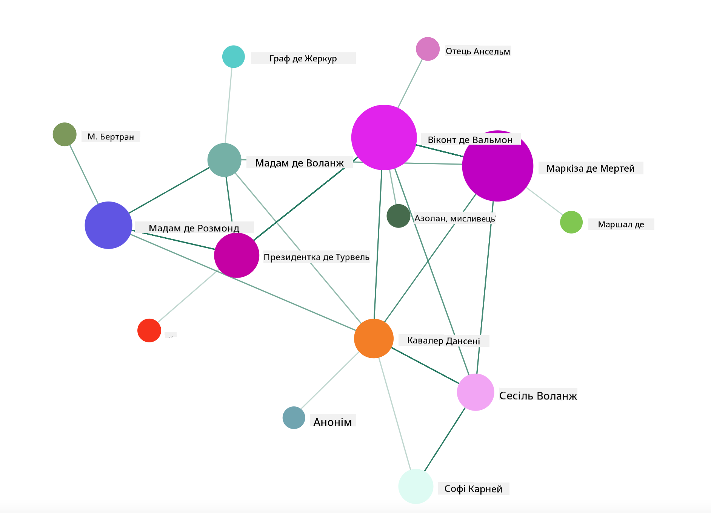

<!--
CO_OP_TRANSLATOR_METADATA:
{
  "original_hash": "b4039f1c76548d144a0aee0bf28304ec",
  "translation_date": "2025-08-30T18:56:06+00:00",
  "source_file": "3-Data-Visualization/R/13-meaningful-vizualizations/README.md",
  "language_code": "uk"
}
-->
# Створення змістовних візуалізацій

|](../../../sketchnotes/13-MeaningfulViz.png)|
|:---:|
| Змістовні візуалізації - _Скетчноут від [@nitya](https://twitter.com/nitya)_ |

> "Якщо достатньо довго катувати дані, вони зізнаються у всьому" -- [Рональд Коуз](https://en.wikiquote.org/wiki/Ronald_Coase)

Однією з основних навичок дата-сайєнтиста є здатність створювати змістовні візуалізації даних, які допомагають відповісти на поставлені запитання. Перед тим як візуалізувати дані, необхідно переконатися, що вони очищені та підготовлені, як ви робили в попередніх уроках. Після цього можна починати обирати найкращий спосіб представлення даних.

У цьому уроці ви дізнаєтеся:

1. Як обрати правильний тип діаграми
2. Як уникати оманливих візуалізацій
3. Як працювати з кольором
4. Як стилізувати діаграми для кращої читабельності
5. Як створювати анімовані або 3D-візуалізації
6. Як створювати креативні візуалізації

## [Тест перед лекцією](https://purple-hill-04aebfb03.1.azurestaticapps.net/quiz/24)

## Оберіть правильний тип діаграми

У попередніх уроках ви експериментували зі створенням різноманітних візуалізацій даних за допомогою Matplotlib і Seaborn. Загалом, ви можете обрати [правильний тип діаграми](https://chartio.com/learn/charts/how-to-select-a-data-vizualization/) для вашого запитання, використовуючи цю таблицю:

| Вам потрібно:              | Використовуйте:                 |
| -------------------------- | ------------------------------- |
| Показати тренди даних у часі | Лінійна діаграма                |
| Порівняти категорії        | Стовпчикова, Кругова            |
| Порівняти загальні значення | Кругова, Складена стовпчикова   |
| Показати взаємозв'язки     | Точкова, Лінійна, Фасетна, Подвійна лінія |
| Показати розподіли         | Точкова, Гістограма, Коробкова   |
| Показати пропорції         | Кругова, Донат, Вафельна        |

> ✅ Залежно від структури ваших даних, можливо, доведеться конвертувати їх із текстового формату в числовий, щоб підтримати обраний тип діаграми.

## Уникайте обману

Навіть якщо дата-сайєнтист ретельно обирає правильну діаграму для правильних даних, існує багато способів представити дані так, щоб довести певну точку зору, часто за рахунок спотворення самих даних. Є безліч прикладів оманливих діаграм та інфографік!

[](https://www.youtube.com/watch?v=oX74Nge8Wkw "Як діаграми обманюють")

> 🎥 Натисніть на зображення вище, щоб переглянути конференційну доповідь про оманливі діаграми

Ця діаграма перевертає вісь X, щоб показати протилежне до правди, базуючись на датах:


[Ця діаграма](https://media.firstcoastnews.com/assets/WTLV/images/170ae16f-4643-438f-b689-50d66ca6a8d8/170ae16f-4643-438f-b689-50d66ca6a8d8_1140x641.jpg) ще більш оманлива, оскільки погляд спрямовується вправо, щоб зробити висновок, що з часом випадки COVID зменшилися в різних округах. Насправді, якщо уважно подивитися на дати, ви побачите, що їх було переставлено, щоб створити цей оманливий спад.



Цей сумнозвісний приклад використовує колір І перевернуту вісь Y, щоб обманути: замість висновку, що кількість смертей від зброї зросла після прийняття законодавства, сприятливого для зброї, погляд обманюється, думаючи, що сталося протилежне:



Ця дивна діаграма показує, як пропорції можуть бути маніпульовані до комічного ефекту:



Порівняння непорівнюваного — ще один хитрий трюк. Існує [чудовий вебсайт](https://tylervigen.com/spurious-correlations), присвячений "хибним кореляціям", який демонструє "факти", що пов'язують, наприклад, рівень розлучень у штаті Мен із споживанням маргарину. Група на Reddit також збирає [приклади поганого використання даних](https://www.reddit.com/r/dataisugly/top/?t=all).

Важливо розуміти, як легко погляд може бути обманутий оманливими діаграмами. Навіть якщо наміри дата-сайєнтиста добрі, вибір невдалого типу діаграми, наприклад, кругової діаграми з надто багатьма категоріями, може ввести в оману.

## Колір

Як ви бачили на діаграмі про "насильство зі зброєю у Флориді", колір може додати додатковий шар значення до діаграм, особливо тих, які не створені за допомогою бібліотек, таких як ggplot2 і RColorBrewer, що мають перевірені колірні палітри. Якщо ви створюєте діаграму вручну, варто трохи вивчити [теорію кольору](https://colormatters.com/color-and-design/basic-color-theory).

> ✅ Пам'ятайте, що доступність є важливим аспектом візуалізації. Деякі ваші користувачі можуть мати дальтонізм — чи добре ваша діаграма відображається для користувачів із порушеннями зору?

Будьте обережні при виборі кольорів для вашої діаграми, оскільки колір може передавати значення, яке ви не мали на увазі. Наприклад, "рожеві дами" на діаграмі про "зріст" вище передають явно "жіночий" підтекст, що додає до абсурдності самої діаграми.

Хоча [значення кольорів](https://colormatters.com/color-symbolism/the-meanings-of-colors) можуть відрізнятися в різних частинах світу і змінюватися залежно від відтінку, загалом значення кольорів включають:

| Колір  | Значення            |
| ------ | ------------------- |
| червоний | сила               |
| синій   | довіра, лояльність  |
| жовтий  | щастя, обережність  |
| зелений | екологія, удача, заздрість |
| фіолетовий | щастя            |
| помаранчевий | яскравість      |

Якщо вам доручено створити діаграму з індивідуальними кольорами, переконайтеся, що ваша діаграма є доступною, а обраний колір відповідає значенню, яке ви хочете передати.

## Стилізація діаграм для читабельності

Діаграми не мають сенсу, якщо вони нечитабельні! Виділіть час, щоб налаштувати ширину та висоту вашої діаграми так, щоб вона добре масштабувалася з вашими даними. Якщо потрібно відобразити багато змінних (наприклад, усі 50 штатів), розмістіть їх вертикально на осі Y, якщо це можливо, щоб уникнути горизонтального прокручування.

Підписуйте осі, додавайте легенду за потреби та пропонуйте підказки для кращого розуміння даних.

Якщо ваші дані текстові та довгі на осі X, ви можете нахилити текст для кращої читабельності. [plot3D](https://cran.r-project.org/web/packages/plot3D/index.html) пропонує 3D-графіки, якщо ваші дані це підтримують. Використовуючи його, можна створювати складні візуалізації.


## Анімація та 3D-відображення діаграм

Деякі з найкращих візуалізацій даних сьогодні є анімованими. Ширлі Ву створила дивовижні приклади за допомогою D3, такі як '[квітки фільмів](http://bl.ocks.org/sxywu/raw/d612c6c653fb8b4d7ff3d422be164a5d/)', де кожна квітка є візуалізацією фільму. Інший приклад для Guardian — 'Bussed Out', інтерактивний досвід, що поєднує візуалізації з Greensock і D3, а також формат статті з прокруткою, щоб показати, як Нью-Йорк вирішує проблему бездомних, відправляючи їх за межі міста.


> "Bussed Out: Як Америка переміщує своїх бездомних" від [Guardian](https://www.theguardian.com/us-news/ng-interactive/2017/dec/20/bussed-out-america-moves-homeless-people-country-study). Візуалізації Наді Бремер і Ширлі Ву

Хоча цей урок недостатній для детального вивчення цих потужних бібліотек візуалізації, спробуйте свої сили в D3 у додатку Vue.js, використовуючи бібліотеку для відображення візуалізації книги "Небезпечні зв'язки" як анімованої соціальної мережі.

> "Les Liaisons Dangereuses" — це епістолярний роман, тобто роман, представлений у вигляді серії листів. Написаний у 1782 році Шодерло де Лакло, він розповідає історію жорстоких, морально збанкрутілих соціальних маневрів двох головних героїв французької аристократії кінця XVIII століття — Віконта де Вальмона та Маркізи де Мертей. Обидва зазнають краху в кінці, але не без завдання значної соціальної шкоди. Роман розгортається як серія листів, написаних різним людям у їхніх колах, з метою помсти або просто для створення проблем. Створіть візуалізацію цих листів, щоб виявити основних "гравців" у сюжеті візуально.

Ви завершите веб-додаток, який відображатиме анімований вигляд цієї соціальної мережі. Він використовує бібліотеку, створену для [візуалізації мережі](https://github.com/emiliorizzo/vue-d3-network) за допомогою Vue.js і D3. Коли додаток працює, ви можете переміщати вузли на екрані, щоб змінювати розташування даних.



## Проєкт: Створіть діаграму для відображення мережі за допомогою D3.js

> У цій папці уроку є папка `solution`, де ви можете знайти завершений проєкт для довідки.

1. Дотримуйтесь інструкцій у файлі README.md у кореневій папці стартового проєкту. Переконайтеся, що у вас встановлені NPM і Node.js перед встановленням залежностей проєкту.

2. Відкрийте папку `starter/src`. Ви знайдете папку `assets`, де є файл .json з усіма листами з роману, пронумерованими, з позначенням "to" і "from".

3. Завершіть код у `components/Nodes.vue`, щоб увімкнути візуалізацію. Знайдіть метод `createLinks()` і додайте наступний вкладений цикл.

Пройдіться по об'єкту .json, щоб зібрати дані "to" і "from" для листів і створити об'єкт `links`, щоб бібліотека візуалізації могла його використати:

```javascript
//loop through letters
      let f = 0;
      let t = 0;
      for (var i = 0; i < letters.length; i++) {
          for (var j = 0; j < characters.length; j++) {
              
            if (characters[j] == letters[i].from) {
              f = j;
            }
            if (characters[j] == letters[i].to) {
              t = j;
            }
        }
        this.links.push({ sid: f, tid: t });
      }
  ```

Запустіть ваш додаток із терміналу (npm run serve) і насолоджуйтеся візуалізацією!

## 🚀 Виклик

Прогуляйтеся інтернетом, щоб знайти оманливі візуалізації. Як автор обманює користувача, і чи є це навмисним? Спробуйте виправити ці візуалізації, щоб показати, як вони мають виглядати.

## [Тест після лекції](https://purple-hill-04aebfb03.1.azurestaticapps.net/quiz/25)

## Огляд і самостійне навчання

Ось кілька статей для читання про оманливі візуалізації даних:

https://gizmodo.com/how-to-lie-with-data-visualization-1563576606

http://ixd.prattsi.org/2017/12/visual-lies-usability-in-deceptive-data-visualizations/

Ознайомтеся з цими цікавими візуалізаціями історичних активів і артефактів:

https://handbook.pubpub.org/

Перегляньте цю статтю про те, як анімація може покращити ваші візуалізації:

https://medium.com/@EvanSinar/use-animation-to-supercharge-data-visualization-cd905a882ad4

## Завдання

[Створіть власну індивідуальну візуалізацію](assignment.md)

---

**Відмова від відповідальності**:  
Цей документ був перекладений за допомогою сервісу автоматичного перекладу [Co-op Translator](https://github.com/Azure/co-op-translator). Хоча ми прагнемо до точності, будь ласка, майте на увазі, що автоматичні переклади можуть містити помилки або неточності. Оригінальний документ на його рідній мові слід вважати авторитетним джерелом. Для критичної інформації рекомендується професійний людський переклад. Ми не несемо відповідальності за будь-які непорозуміння або неправильні тлумачення, що виникають внаслідок використання цього перекладу.