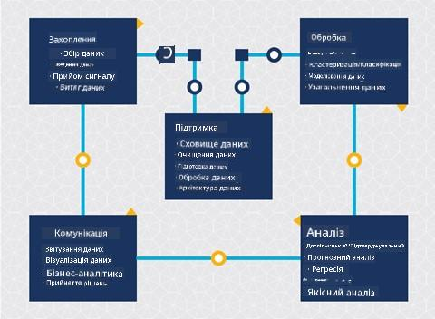
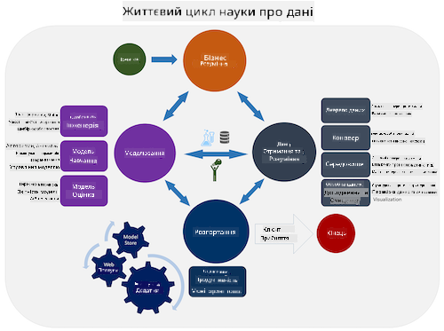
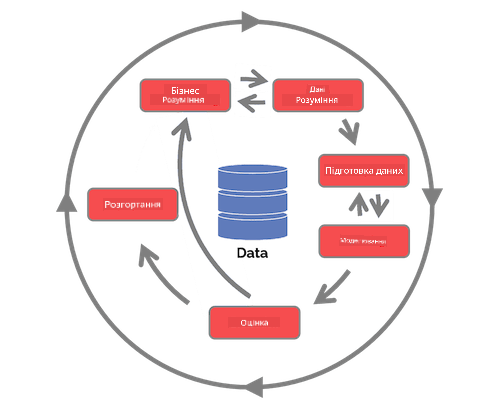

<!--
CO_OP_TRANSLATOR_METADATA:
{
  "original_hash": "c368f8f2506fe56bca0f7be05c4eb71d",
  "translation_date": "2025-08-30T18:29:38+00:00",
  "source_file": "4-Data-Science-Lifecycle/14-Introduction/README.md",
  "language_code": "uk"
}
-->
# Вступ до життєвого циклу науки про дані

|](../../sketchnotes/14-DataScience-Lifecycle.png)|
|:---:|
| Вступ до життєвого циклу науки про дані - _Скетчноут від [@nitya](https://twitter.com/nitya)_ |

## [Тест перед лекцією](https://red-water-0103e7a0f.azurestaticapps.net/quiz/26)

На цьому етапі ви, ймовірно, вже зрозуміли, що наука про дані — це процес. Цей процес можна розділити на 5 етапів:

- Збір
- Обробка
- Аналіз
- Комунікація
- Підтримка

Цей урок зосереджений на трьох частинах життєвого циклу: зборі, обробці та підтримці.

  
> Фото від [Berkeley School of Information](https://ischoolonline.berkeley.edu/data-science/what-is-data-science/)

## Збір

Перший етап життєвого циклу є дуже важливим, оскільки наступні етапи залежать від нього. Це фактично два етапи, об’єднані в один: отримання даних і визначення мети та проблем, які потрібно вирішити.  
Визначення цілей проєкту потребує глибшого розуміння проблеми або питання. Спочатку потрібно ідентифікувати та залучити тих, хто потребує вирішення своєї проблеми. Це можуть бути зацікавлені сторони бізнесу або спонсори проєкту, які допоможуть визначити, хто або що отримає користь від цього проєкту, а також що і чому їм це потрібно. Добре визначена мета має бути вимірюваною та кількісною, щоб визначити прийнятний результат.

Питання, які може поставити спеціаліст з даних:
- Чи раніше вже підходили до цієї проблеми? Що було виявлено?
- Чи всі учасники розуміють мету та ціль?
- Чи є неоднозначність і як її зменшити?
- Які обмеження існують?
- Як може виглядати кінцевий результат?
- Скільки ресурсів (часу, людей, обчислювальних потужностей) доступно?

Далі потрібно ідентифікувати, зібрати, а потім дослідити дані, необхідні для досягнення визначених цілей. На цьому етапі збору спеціалісти з даних також повинні оцінити кількість і якість даних. Це потребує певного дослідження даних, щоб підтвердити, що отримані дані допоможуть досягти бажаного результату.

Питання, які може поставити спеціаліст з даних щодо даних:
- Які дані вже доступні для мене?
- Хто є власником цих даних?
- Які існують проблеми конфіденційності?
- Чи достатньо даних для вирішення цієї проблеми?
- Чи є дані прийнятної якості для цієї проблеми?
- Якщо я виявлю додаткову інформацію через ці дані, чи варто нам розглянути зміну або переосмислення цілей?

## Обробка

Етап обробки в життєвому циклі зосереджений на виявленні закономірностей у даних, а також моделюванні. Деякі методи, які використовуються на етапі обробки, потребують статистичних підходів для виявлення закономірностей. Зазвичай це було б трудомістким завданням для людини при роботі з великим набором даних, тому використовуються комп’ютери для прискорення процесу. На цьому етапі наука про дані та машинне навчання перетинаються. Як ви дізналися в першому уроці, машинне навчання — це процес створення моделей для розуміння даних. Моделі є представленням взаємозв’язків між змінними в даних, які допомагають прогнозувати результати.

Поширені методи, які використовуються на цьому етапі, розглядаються в навчальній програмі ML для початківців. Перейдіть за посиланнями, щоб дізнатися більше про них:

- [Класифікація](https://github.com/microsoft/ML-For-Beginners/tree/main/4-Classification): Організація даних у категорії для більш ефективного використання.
- [Кластеризація](https://github.com/microsoft/ML-For-Beginners/tree/main/5-Clustering): Групування даних у схожі групи.
- [Регресія](https://github.com/microsoft/ML-For-Beginners/tree/main/2-Regression): Визначення взаємозв’язків між змінними для прогнозування або передбачення значень.

## Підтримка

На схемі життєвого циклу ви могли помітити, що підтримка знаходиться між збором і обробкою. Підтримка — це постійний процес управління, зберігання та захисту даних протягом усього процесу проєкту, і її слід враховувати протягом усього проєкту.

### Зберігання даних

Рішення про те, як і де зберігати дані, може вплинути на вартість їх зберігання, а також на продуктивність доступу до даних. Такі рішення, ймовірно, не приймаються виключно спеціалістом з даних, але він може приймати рішення про те, як працювати з даними, залежно від способу їх зберігання.

Ось деякі аспекти сучасних систем зберігання даних, які можуть вплинути на ці рішення:

**Локальне зберігання vs віддалене зберігання vs публічна чи приватна хмара**

Локальне зберігання передбачає управління даними на власному обладнанні, наприклад, на сервері з жорсткими дисками, які зберігають дані, тоді як віддалене зберігання покладається на обладнання, яке вам не належить, наприклад, дата-центр. Публічна хмара є популярним вибором для зберігання даних, що не потребує знань про те, як або де саме зберігаються дані, де "публічна" означає єдину інфраструктуру, яка використовується всіма користувачами хмари. Деякі організації мають суворі політики безпеки, які вимагають повного доступу до обладнання, де зберігаються дані, і покладаються на приватну хмару, яка надає власні хмарні послуги. Ви дізнаєтеся більше про дані в хмарі в [наступних уроках](https://github.com/microsoft/Data-Science-For-Beginners/tree/main/5-Data-Science-In-Cloud).

**Холодні vs гарячі дані**

Під час навчання моделей вам може знадобитися більше навчальних даних. Якщо ви задоволені своєю моделлю, нові дані будуть надходити для виконання її функцій. У будь-якому випадку вартість зберігання та доступу до даних зростатиме зі збільшенням їх обсягу. Розділення рідко використовуваних даних, відомих як холодні дані, від часто доступних гарячих даних може бути дешевшим варіантом зберігання даних через апаратні або програмні послуги. Якщо холодні дані потрібно отримати, це може зайняти трохи більше часу порівняно з гарячими даними.

### Управління даними

Під час роботи з даними ви можете виявити, що деякі дані потребують очищення за допомогою методів, розглянутих у уроці, присвяченому [підготовці даних](https://github.com/microsoft/Data-Science-For-Beginners/tree/main/2-Working-With-Data/08-data-preparation), щоб створити точні моделі. Коли надходять нові дані, їм знадобляться ті самі дії для підтримки якості. Деякі проєкти передбачають використання автоматизованого інструменту для очищення, агрегування та стиснення даних перед їх переміщенням до кінцевого місця зберігання. Azure Data Factory є прикладом одного з таких інструментів.

### Захист даних

Однією з головних цілей захисту даних є забезпечення того, щоб ті, хто працює з ними, контролювали, що збирається і в якому контексті це використовується. Захист даних передбачає обмеження доступу лише для тих, хто його потребує, дотримання місцевих законів і нормативних актів, а також підтримання етичних стандартів, як розглянуто в [уроці про етику](https://github.com/microsoft/Data-Science-For-Beginners/tree/main/1-Introduction/02-ethics).

Ось деякі дії, які команда може виконати з урахуванням безпеки:
- Переконатися, що всі дані зашифровані
- Надати клієнтам інформацію про те, як використовуються їхні дані
- Видалити доступ до даних у тих, хто залишив проєкт
- Дозволити змінювати дані лише певним членам проєкту

## 🚀 Виклик

Існує багато версій життєвого циклу науки про дані, де кожен етап може мати різні назви та кількість стадій, але міститиме ті самі процеси, згадані в цьому уроці.

Дослідіть [життєвий цикл процесу команди науки про дані](https://docs.microsoft.com/en-us/azure/architecture/data-science-process/lifecycle) та [стандартний процес для добування даних у різних галузях](https://www.datascience-pm.com/crisp-dm-2/). Назвіть 3 схожості та відмінності між ними.

|Процес команди науки про дані (TDSP)|Стандартний процес для добування даних у різних галузях (CRISP-DM)|
|--|--|
| |  |
| Зображення від [Microsoft](https://docs.microsoft.comazure/architecture/data-science-process/lifecycle) | Зображення від [Data Science Process Alliance](https://www.datascience-pm.com/crisp-dm-2/) |

## [Тест після лекції](https://red-water-0103e7a0f.azurestaticapps.net/quiz/27)

## Огляд і самостійне навчання

Застосування життєвого циклу науки про дані передбачає виконання різних ролей і завдань, де деякі можуть зосереджуватися на конкретних частинах кожного етапу. Процес команди науки про дані надає кілька ресурсів, які пояснюють типи ролей і завдань, які може виконувати хтось у проєкті.

* [Ролі та завдання процесу команди науки про дані](https://docs.microsoft.com/en-us/azure/architecture/data-science-process/roles-tasks)
* [Виконання завдань науки про дані: дослідження, моделювання та розгортання](https://docs.microsoft.com/en-us/azure/architecture/data-science-process/execute-data-science-tasks)

## Завдання

[Оцінка набору даних](assignment.md)

---

**Відмова від відповідальності**:  
Цей документ було перекладено за допомогою сервісу автоматичного перекладу [Co-op Translator](https://github.com/Azure/co-op-translator). Хоча ми прагнемо до точності, звертаємо вашу увагу, що автоматичні переклади можуть містити помилки або неточності. Оригінальний документ мовою оригіналу слід вважати авторитетним джерелом. Для критично важливої інформації рекомендується професійний переклад людиною. Ми не несемо відповідальності за будь-які непорозуміння або неправильні тлумачення, що виникли внаслідок використання цього перекладу.