<!--
CO_OP_TRANSLATOR_METADATA:
{
  "original_hash": "14b2a7f1c63202920bd98eeb913f5614",
  "translation_date": "2025-08-30T17:41:40+00:00",
  "source_file": "5-Data-Science-In-Cloud/18-Low-Code/README.md",
  "language_code": "uk"
}
-->
# Наука про дані в хмарі: Підхід "Low code/No code"

|](../../sketchnotes/18-DataScience-Cloud.png)|
|:---:|
| Наука про дані в хмарі: Low Code - _Скетчнот від [@nitya](https://twitter.com/nitya)_ |

Зміст:

- [Наука про дані в хмарі: Підхід "Low code/No code"](../../../../5-Data-Science-In-Cloud/18-Low-Code)
  - [Передлекційна вікторина](../../../../5-Data-Science-In-Cloud/18-Low-Code)
  - [1. Вступ](../../../../5-Data-Science-In-Cloud/18-Low-Code)
    - [1.1 Що таке Azure Machine Learning?](../../../../5-Data-Science-In-Cloud/18-Low-Code)
    - [1.2 Проєкт прогнозування серцевої недостатності:](../../../../5-Data-Science-In-Cloud/18-Low-Code)
    - [1.3 Набір даних для серцевої недостатності:](../../../../5-Data-Science-In-Cloud/18-Low-Code)
  - [2. Навчання моделі в Azure ML Studio за допомогою Low code/No code](../../../../5-Data-Science-In-Cloud/18-Low-Code)
    - [2.1 Створення робочого простору Azure ML](../../../../5-Data-Science-In-Cloud/18-Low-Code)
    - [2.2 Обчислювальні ресурси](../../../../5-Data-Science-In-Cloud/18-Low-Code)
      - [2.2.1 Вибір правильних параметрів для обчислювальних ресурсів](../../../../5-Data-Science-In-Cloud/18-Low-Code)
      - [2.2.2 Створення обчислювального кластера](../../../../5-Data-Science-In-Cloud/18-Low-Code)
    - [2.3 Завантаження набору даних](../../../../5-Data-Science-In-Cloud/18-Low-Code)
    - [2.4 Навчання за допомогою AutoML у режимі Low code/No code](../../../../5-Data-Science-In-Cloud/18-Low-Code)
  - [3. Розгортання моделі та використання кінцевих точок у режимі Low code/No code](../../../../5-Data-Science-In-Cloud/18-Low-Code)
    - [3.1 Розгортання моделі](../../../../5-Data-Science-In-Cloud/18-Low-Code)
    - [3.2 Використання кінцевих точок](../../../../5-Data-Science-In-Cloud/18-Low-Code)
  - [🚀 Виклик](../../../../5-Data-Science-In-Cloud/18-Low-Code)
  - [Післялекційна вікторина](../../../../5-Data-Science-In-Cloud/18-Low-Code)
  - [Огляд і самостійне навчання](../../../../5-Data-Science-In-Cloud/18-Low-Code)
  - [Завдання](../../../../5-Data-Science-In-Cloud/18-Low-Code)

## [Передлекційна вікторина](https://purple-hill-04aebfb03.1.azurestaticapps.net/quiz/34)
## 1. Вступ
### 1.1 Що таке Azure Machine Learning?

Хмарна платформа Azure включає понад 200 продуктів і хмарних сервісів, створених для того, щоб допомогти вам втілювати нові рішення в життя. 

Дослідники даних витрачають багато зусиль на дослідження та попередню обробку даних, а також на тестування різних алгоритмів навчання моделей для отримання точних результатів. Ці завдання є трудомісткими та часто неефективно використовують дорогі обчислювальні ресурси.

[Azure ML](https://docs.microsoft.com/azure/machine-learning/overview-what-is-azure-machine-learning?WT.mc_id=academic-77958-bethanycheum&ocid=AID3041109) — це хмарна платформа для створення та управління рішеннями машинного навчання в Azure. Вона включає широкий спектр функцій, які допомагають дослідникам даних готувати дані, навчати моделі, публікувати прогностичні сервіси та відстежувати їх використання. Найважливіше, що вона підвищує ефективність, автоматизуючи багато трудомістких завдань, пов'язаних із навчанням моделей, і дозволяє використовувати масштабовані хмарні обчислювальні ресурси, які обробляють великі обсяги даних, оплачуючи лише фактичне використання.

Azure ML надає всі необхідні інструменти для розробників і дослідників даних для їхніх робочих процесів машинного навчання, зокрема:

- **Azure Machine Learning Studio**: веб-портал у Azure Machine Learning для варіантів із низьким рівнем кодування або без коду для навчання моделей, розгортання, автоматизації, відстеження та управління активами. Studio інтегрується з Azure Machine Learning SDK для безперебійної роботи.
- **Jupyter Notebooks**: швидке прототипування та тестування моделей ML.
- **Azure Machine Learning Designer**: дозволяє створювати експерименти за допомогою перетягування модулів і розгортати конвеєри в середовищі з низьким рівнем кодування.
- **Автоматизоване машинне навчання (AutoML)**: автоматизує ітеративні завдання розробки моделей машинного навчання, дозволяючи створювати моделі ML з високою масштабованістю, ефективністю та продуктивністю, зберігаючи якість моделі.
- **Маркування даних**: інструмент із підтримкою ML для автоматичного маркування даних.
- **Розширення машинного навчання для Visual Studio Code**: забезпечує повнофункціональне середовище розробки для створення та управління проєктами ML.
- **CLI для машинного навчання**: надає команди для управління ресурсами Azure ML через командний рядок.
- **Інтеграція з відкритими фреймворками**, такими як PyTorch, TensorFlow, Scikit-learn тощо, для навчання, розгортання та управління процесом машинного навчання.
- **MLflow**: це бібліотека з відкритим кодом для управління життєвим циклом експериментів машинного навчання. **MLFlow Tracking** — це компонент MLflow, який реєструє та відстежує метрики навчання та артефакти моделі незалежно від середовища експерименту.

### 1.2 Проєкт прогнозування серцевої недостатності:

Без сумніву, створення та розробка проєктів — це найкращий спосіб перевірити свої навички та знання. У цьому уроці ми розглянемо два різні способи створення проєкту науки про дані для прогнозування нападів серцевої недостатності в Azure ML Studio: за допомогою Low code/No code та через Azure ML SDK, як показано на схемі нижче:

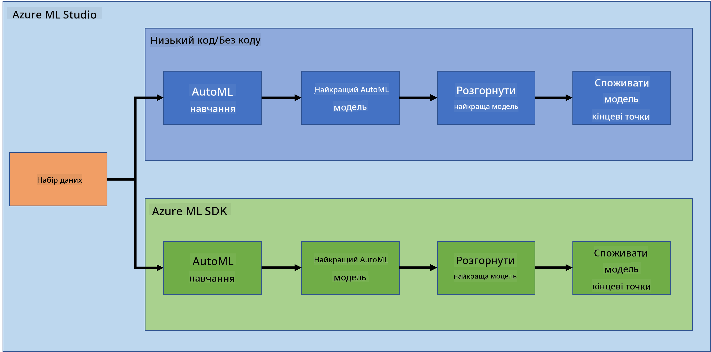

Кожен із цих способів має свої переваги та недоліки. Підхід Low code/No code є простішим для початку, оскільки передбачає роботу з графічним інтерфейсом (GUI) без необхідності попередніх знань у програмуванні. Цей метод дозволяє швидко перевірити життєздатність проєкту та створити POC (Proof Of Concept). Однак, коли проєкт розширюється і потребує готовності до виробництва, створення ресурсів через GUI стає неефективним. У таких випадках необхідно програмно автоматизувати всі процеси — від створення ресурсів до розгортання моделі. Саме тут знання Azure ML SDK стає критично важливим.

|                   | Low code/No code | Azure ML SDK              |
|-------------------|------------------|---------------------------|
| Знання коду       | Не потрібні      | Потрібні                  |
| Час розробки      | Швидко і легко   | Залежить від знань коду   |
| Готовність до продакшну | Ні               | Так                       |

### 1.3 Набір даних для серцевої недостатності:

Серцево-судинні захворювання (ССЗ) є причиною смерті №1 у світі, становлячи 31% усіх смертей. Екологічні та поведінкові фактори ризику, такі як вживання тютюну, нездорова дієта, ожиріння, фізична бездіяльність і шкідливе вживання алкоголю, можуть бути використані як ознаки для моделей оцінки. Можливість оцінити ймовірність розвитку ССЗ може бути дуже корисною для запобігання нападам у людей із високим ризиком.

На платформі Kaggle доступний [набір даних для серцевої недостатності](https://www.kaggle.com/andrewmvd/heart-failure-clinical-data), який ми будемо використовувати для цього проєкту. Ви можете завантажити цей набір даних зараз. Це табличний набір даних із 13 стовпцями (12 ознак і 1 цільова змінна) та 299 рядками.

|    | Назва змінної             | Тип            | Опис                                                    | Приклад           |
|----|---------------------------|----------------|---------------------------------------------------------|-------------------|
| 1  | age                       | числовий       | вік пацієнта                                            | 25                |
| 2  | anaemia                   | булевий        | зменшення кількості еритроцитів або гемоглобіну         | 0 або 1           |
| 3  | creatinine_phosphokinase  | числовий       | рівень ферменту CPK у крові                             | 542               |
| 4  | diabetes                  | булевий        | чи є у пацієнта діабет                                  | 0 або 1           |
| 5  | ejection_fraction         | числовий       | відсоток крові, що залишає серце при кожному скороченні | 45                |
| 6  | high_blood_pressure       | булевий        | чи є у пацієнта гіпертонія                              | 0 або 1           |
| 7  | platelets                 | числовий       | кількість тромбоцитів у крові                           | 149000            |
| 8  | serum_creatinine          | числовий       | рівень сироваткового креатиніну в крові                 | 0.5               |
| 9  | serum_sodium              | числовий       | рівень сироваткового натрію в крові                     | jun               |
| 10 | sex                       | булевий        | стать (жінка або чоловік)                               | 0 або 1           |
| 11 | smoking                   | булевий        | чи курить пацієнт                                       | 0 або 1           |
| 12 | time                      | числовий       | період спостереження (дні)                              | 4                 |
|----|---------------------------|----------------|---------------------------------------------------------|-------------------|
| 21 | DEATH_EVENT [Ціль]        | булевий        | чи помер пацієнт протягом періоду спостереження         | 0 або 1           |

Після завантаження набору даних ми можемо розпочати проєкт в Azure.

## 2. Навчання моделі в Azure ML Studio за допомогою Low code/No code
### 2.1 Створення робочого простору Azure ML
Щоб навчити модель в Azure ML, спочатку потрібно створити робочий простір Azure ML. Робочий простір є основним ресурсом для Azure Machine Learning, який забезпечує централізоване місце для роботи з усіма артефактами, створеними під час використання Azure Machine Learning. Він зберігає історію всіх навчальних запусків, включаючи журнали, метрики, результати та знімки ваших скриптів. Ця інформація використовується для визначення, який навчальний запуск створює найкращу модель. [Дізнатися більше](https://docs.microsoft.com/azure/machine-learning/concept-workspace?WT.mc_id=academic-77958-bethanycheum&ocid=AID3041109)

Рекомендується використовувати найновішу версію браузера, сумісну з вашою операційною системою. Підтримуються такі браузери:

- Microsoft Edge (новий Microsoft Edge, остання версія. Не Microsoft Edge legacy)
- Safari (остання версія, лише для Mac)
- Chrome (остання версія)
- Firefox (остання версія)

Щоб використовувати Azure Machine Learning, створіть робочий простір у вашій підписці Azure. Потім ви можете використовувати цей робочий простір для управління даними, обчислювальними ресурсами, кодом, моделями та іншими артефактами, пов'язаними з вашими робочими процесами машинного навчання.

> **_ПРИМІТКА:_** Ваша підписка Azure буде стягувати невелику плату за зберігання даних, доки робочий простір Azure Machine Learning існує у вашій підписці, тому ми рекомендуємо видалити робочий простір, коли ви більше не використовуєте його.

1. Увійдіть у [портал Azure](https://ms.portal.azure.com/) за допомогою облікових даних Microsoft, пов'язаних із вашою підпискою Azure.
2. Виберіть **＋Створити ресурс**
   
   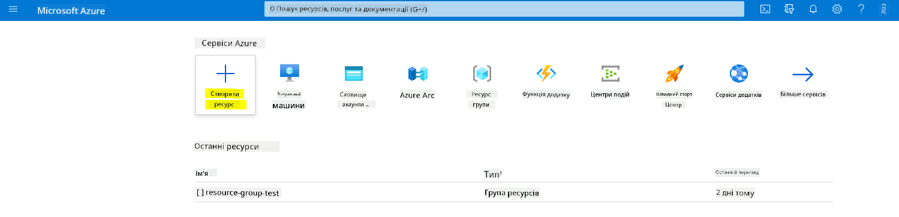

   Знайдіть Machine Learning і виберіть плитку Machine Learning.

   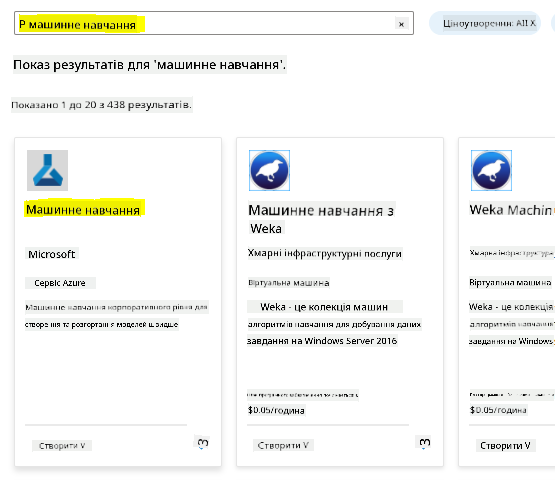

   Натисніть кнопку створення.

   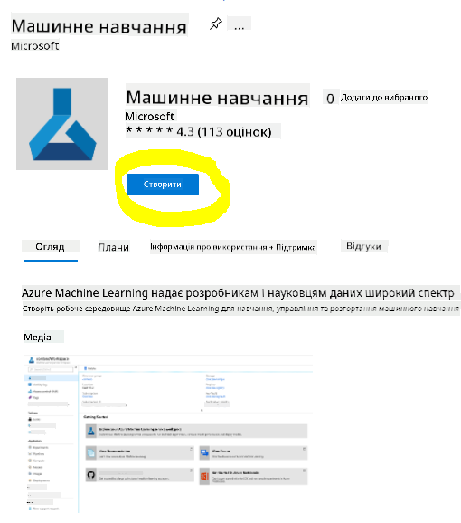

   Заповніть налаштування наступним чином:
   - Підписка: Ваша підписка Azure
   - Група ресурсів: Створіть або виберіть групу ресурсів
   - Назва робочого простору: Введіть унікальну назву для вашого робочого простору
   - Регіон: Виберіть географічний регіон, найближчий до вас
   - Обліковий запис зберігання: Зверніть увагу на новий обліковий запис зберігання, який буде створено для вашого робочого простору
   - Key vault: Зверніть увагу на новий key vault, який буде створено для вашого робочого простору
   - Application insights: Зверніть увагу на новий ресурс Application Insights, який буде створено для вашого робочого простору
   - Реєстр контейнерів: Немає (він буде створений автоматично під час першого розгортання моделі в контейнері)

    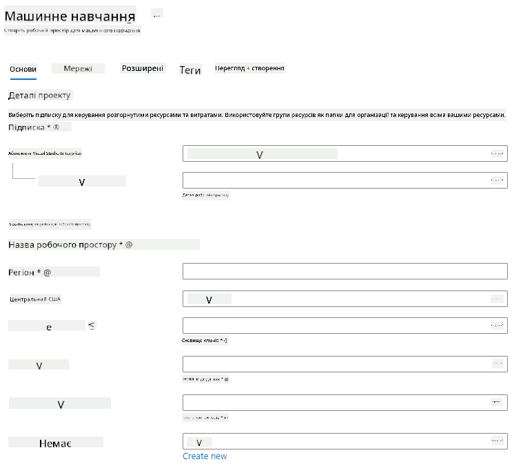

   - Натисніть "Створити + переглянути", а потім кнопку "Створити".
3. Дочекайтеся створення вашого робочого простору (це може зайняти кілька хвилин). Потім перейдіть до нього в порталі. Ви можете знайти його через сервіс Machine Learning у Azure.
4. На сторінці огляду вашого робочого простору запустіть Azure Machine Learning Studio (або відкрийте нову вкладку браузера та перейдіть на https://ml.azure.com), і увійдіть у Azure Machine Learning Studio за допомогою вашого облікового запису Microsoft. Якщо буде запропоновано, виберіть ваш каталог і підписку Azure, а також ваш робочий простір Azure Machine Learning.
   
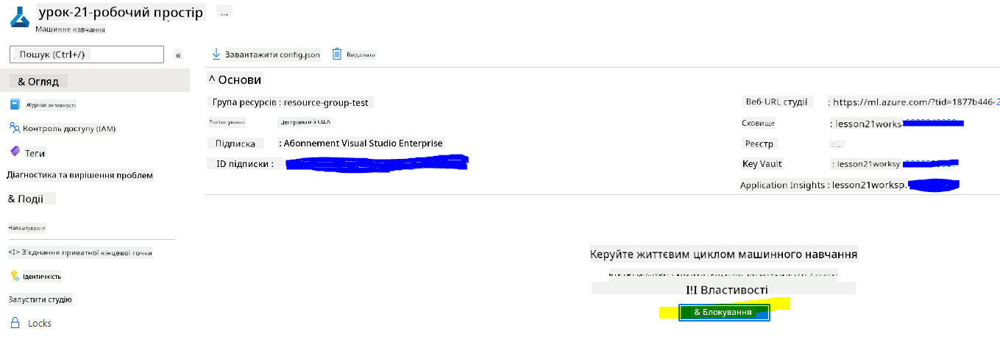

5. У Azure Machine Learning Studio натисніть значок ☰ у верхньому лівому куті, щоб переглянути різні сторінки інтерфейсу. Ви можете використовувати ці сторінки для управління ресурсами у вашому робочому просторі.

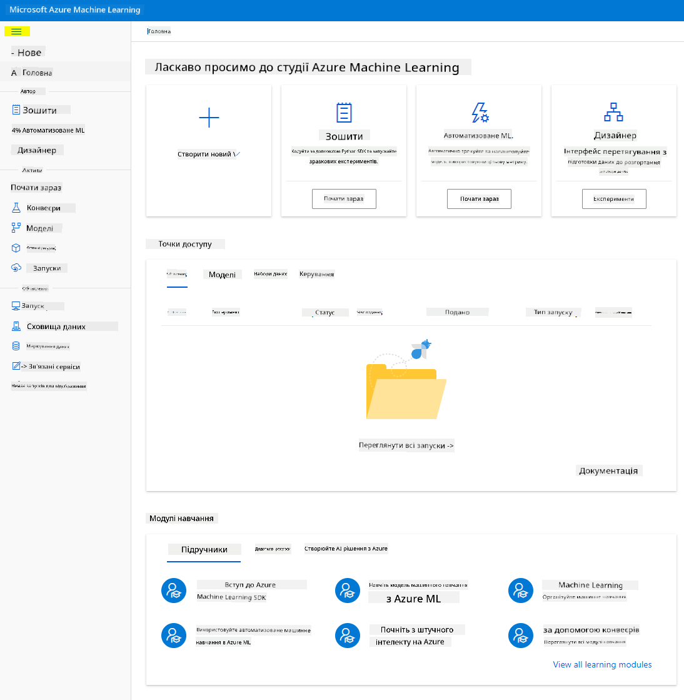

Ви можете керувати своїм робочим простором за допомогою порталу Azure, але для дослідників даних і інженерів ML Azure Machine Learning Studio надає більш зручний інтерфейс для управління ресурсами робочого простору.

### 2.2 Обчислювальні ресурси

Обчислювальні ресурси — це хмарні ресурси, на яких ви можете запускати процеси навчання моделей і дослідження даних. Існує чотири типи обчислювальних ресурсів, які ви можете створити:

- **Обчислювальні інстанси**: Робочі станції для розробки, які дослідники даних можуть використовувати для роботи з даними та моделями. Це передбачає створення віртуальної машини (VM) і запуск інстансу блокнота. Ви можете навчати модель, викликаючи обчислювальний кластер із блокнота.
- **Обчислювальні
- **Приєднаний обчислювальний ресурс**: Посилання на існуючі обчислювальні ресурси Azure, такі як віртуальні машини або кластери Azure Databricks.

#### 2.2.1 Вибір правильних параметрів для ваших обчислювальних ресурсів

Деякі ключові фактори слід враховувати при створенні обчислювального ресурсу, і ці вибори можуть бути критично важливими.

**Чи потрібен вам CPU чи GPU?**

CPU (Центральний процесор) — це електронна схема, яка виконує інструкції, що складають комп'ютерну програму. GPU (Графічний процесор) — це спеціалізована електронна схема, яка може виконувати графічний код з дуже високою швидкістю.

Основна різниця між архітектурою CPU і GPU полягає в тому, що CPU призначений для швидкого виконання широкого спектру завдань (вимірюється швидкістю тактової частоти CPU), але має обмеження щодо одночасного виконання завдань. GPU призначені для паралельних обчислень і тому набагато краще підходять для завдань глибокого навчання.

| CPU                                     | GPU                         |
|-----------------------------------------|-----------------------------|
| Менш дорогий                            | Дорожчий                   |
| Нижчий рівень паралельності             | Вищий рівень паралельності |
| Повільніше тренування моделей глибокого навчання | Оптимальний для глибокого навчання |

**Розмір кластеру**

Більші кластери дорожчі, але забезпечують кращу чутливість. Тому, якщо у вас є час, але недостатньо грошей, слід почати з малого кластеру. Навпаки, якщо у вас є гроші, але мало часу, слід почати з великого кластеру.

**Розмір віртуальної машини**

Залежно від ваших часових і бюджетних обмежень, ви можете змінювати розмір оперативної пам’яті, диска, кількість ядер і швидкість тактової частоти. Збільшення всіх цих параметрів буде дорожчим, але забезпечить кращу продуктивність.

**Виділені чи низькопріоритетні екземпляри?**

Низькопріоритетний екземпляр означає, що він може бути перерваний: фактично, Microsoft Azure може забрати ці ресурси та призначити їх іншому завданню, тим самим перериваючи роботу. Виділений екземпляр, або непереривний, означає, що робота ніколи не буде завершена без вашого дозволу. Це ще один аспект вибору між часом і грошима, оскільки переривані екземпляри дешевші за виділені.

#### 2.2.2 Створення обчислювального кластеру

У [робочій області Azure ML](https://ml.azure.com/), яку ми створили раніше, перейдіть до розділу "Compute", і ви зможете побачити різні обчислювальні ресурси, які ми щойно обговорили (тобто обчислювальні екземпляри, обчислювальні кластери, кластери для інференсу та приєднані обчислювальні ресурси). Для цього проєкту нам знадобиться обчислювальний кластер для тренування моделі. У Studio натисніть меню "Compute", потім вкладку "Compute cluster" і натисніть кнопку "+ New", щоб створити обчислювальний кластер.

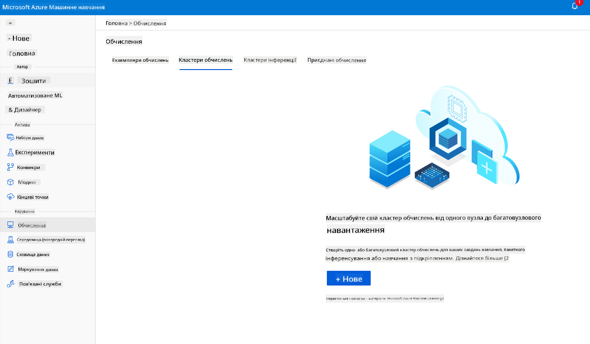

1. Виберіть параметри: Виділений чи низькопріоритетний, CPU чи GPU, розмір віртуальної машини та кількість ядер (ви можете залишити налаштування за замовчуванням для цього проєкту).
2. Натисніть кнопку "Next".


3. Дайте кластеру ім’я.
4. Виберіть параметри: Мінімальна/максимальна кількість вузлів, час простою перед масштабуванням вниз, доступ SSH. Зверніть увагу, що якщо мінімальна кількість вузлів дорівнює 0, ви заощадите гроші, коли кластер простоює. Зверніть увагу, що чим більша кількість максимальних вузлів, тим коротшим буде тренування. Рекомендована максимальна кількість вузлів — 3.
5. Натисніть кнопку "Create". Цей крок може зайняти кілька хвилин.

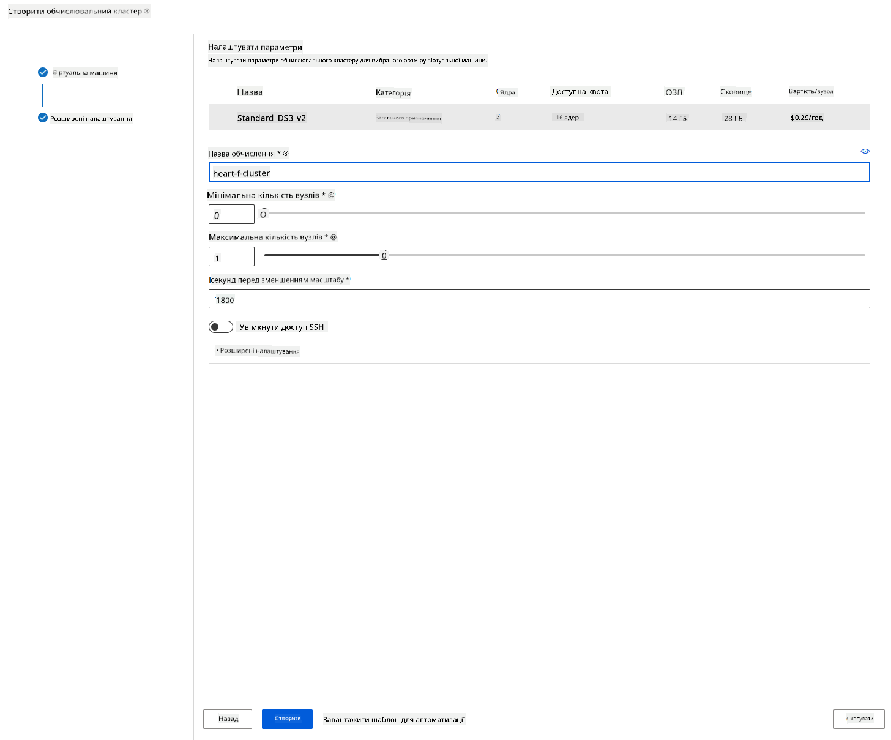

Чудово! Тепер, коли ми створили обчислювальний кластер, нам потрібно завантажити дані в Azure ML Studio.

### 2.3 Завантаження набору даних

1. У [робочій області Azure ML](https://ml.azure.com/), яку ми створили раніше, натисніть "Datasets" у лівому меню та натисніть кнопку "+ Create dataset", щоб створити набір даних. Виберіть опцію "From local files" і виберіть набір даних Kaggle, який ми завантажили раніше.

   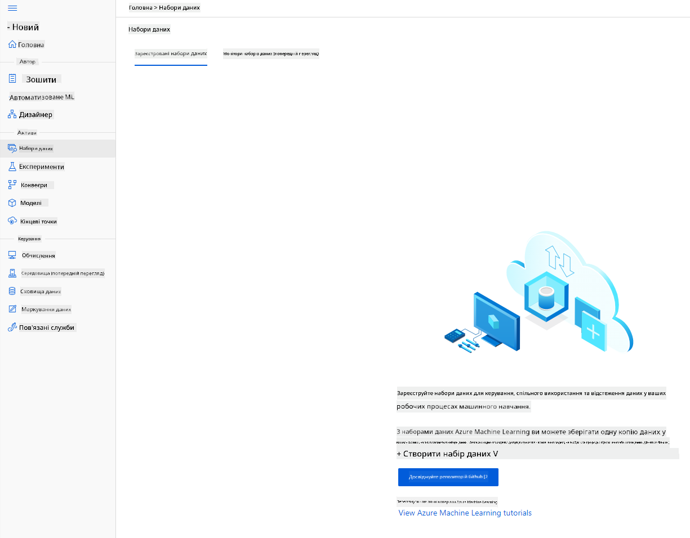

2. Дайте вашому набору даних ім’я, тип і опис. Натисніть "Next". Завантажте дані з файлів. Натисніть "Next".

   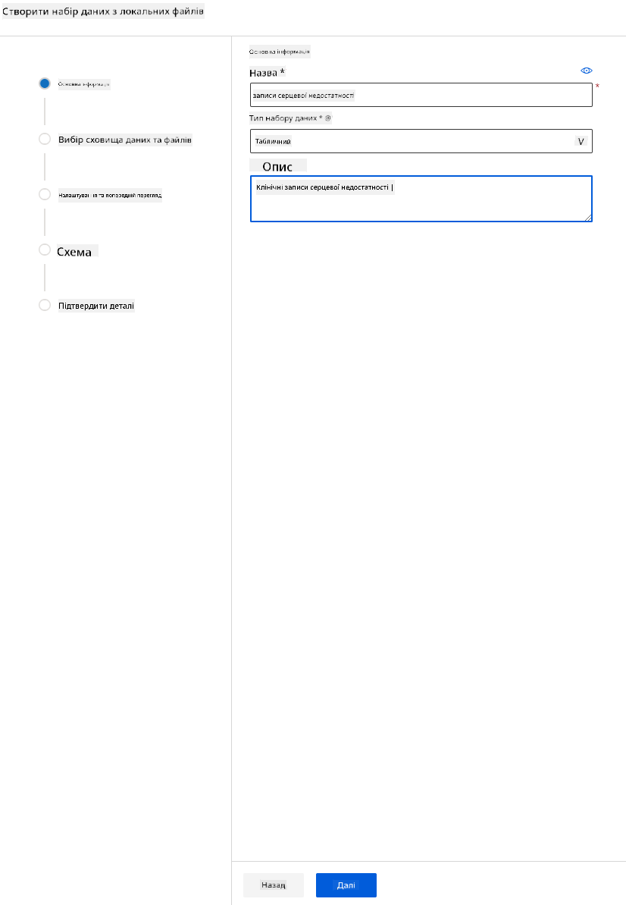

3. У схемі змініть тип даних на Boolean для наступних характеристик: анемія, діабет, високий кров'яний тиск, стать, куріння та DEATH_EVENT. Натисніть "Next" і "Create".

   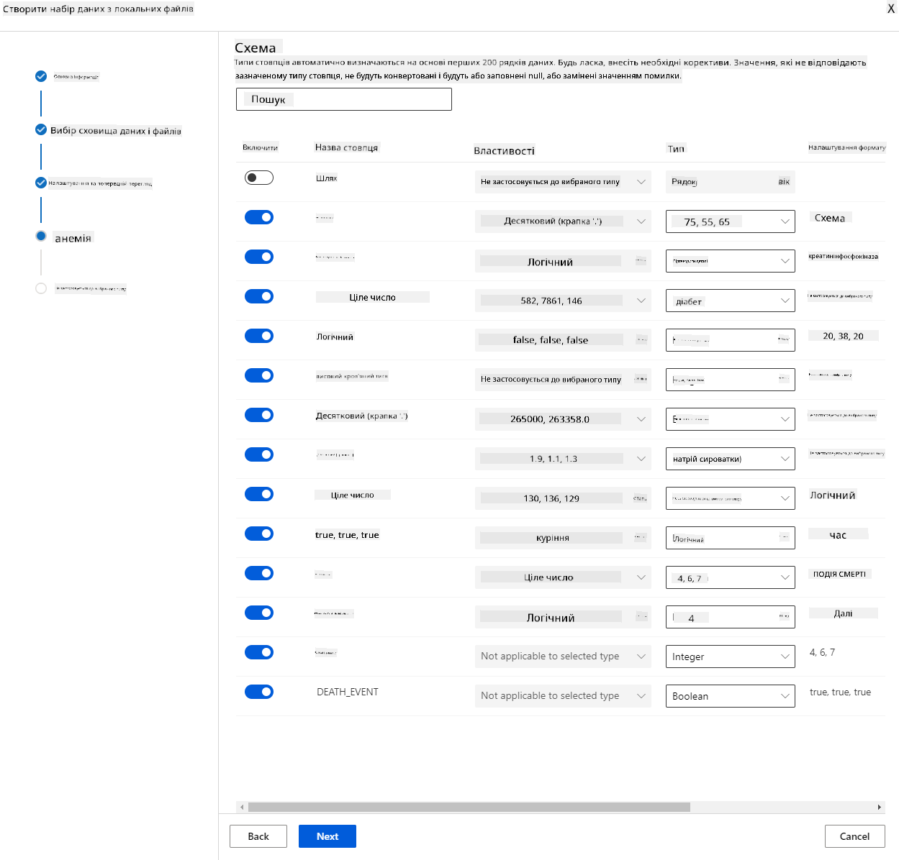

Чудово! Тепер, коли набір даних готовий і обчислювальний кластер створено, ми можемо розпочати тренування моделі!

### 2.4 Тренування з низьким рівнем коду/без коду за допомогою AutoML

Традиційна розробка моделей машинного навчання потребує значних ресурсів, значних знань у галузі та часу для створення та порівняння десятків моделей. Автоматизоване машинне навчання (AutoML) — це процес автоматизації трудомістких, ітеративних завдань розробки моделей машинного навчання. Воно дозволяє науковцям з даних, аналітикам і розробникам створювати моделі ML з високою масштабованістю, ефективністю та продуктивністю, зберігаючи якість моделі. Це скорочує час, необхідний для отримання готових до виробництва моделей ML, з великою легкістю та ефективністю. [Дізнайтеся більше](https://docs.microsoft.com/azure/machine-learning/concept-automated-ml?WT.mc_id=academic-77958-bethanycheum&ocid=AID3041109)

1. У [робочій області Azure ML](https://ml.azure.com/), яку ми створили раніше, натисніть "Automated ML" у лівому меню та виберіть щойно завантажений набір даних. Натисніть "Next".

   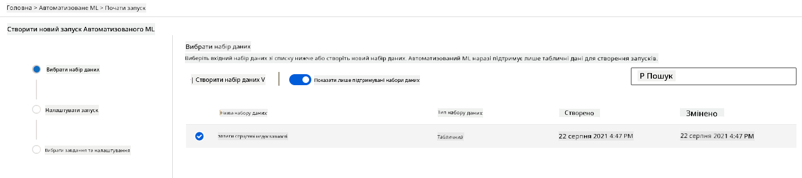

2. Введіть нове ім’я експерименту, цільовий стовпець (DEATH_EVENT) і обчислювальний кластер, який ми створили. Натисніть "Next".

   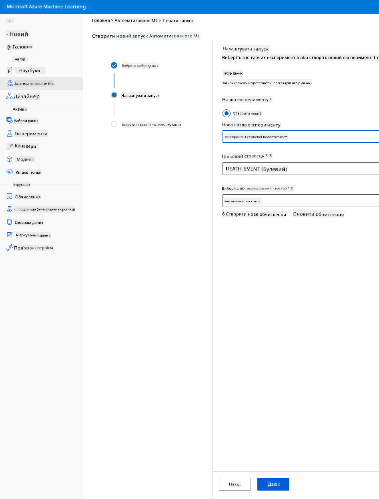

3. Виберіть "Classification" і натисніть "Finish". Цей крок може зайняти від 30 хвилин до 1 години, залежно від розміру вашого обчислювального кластеру.

   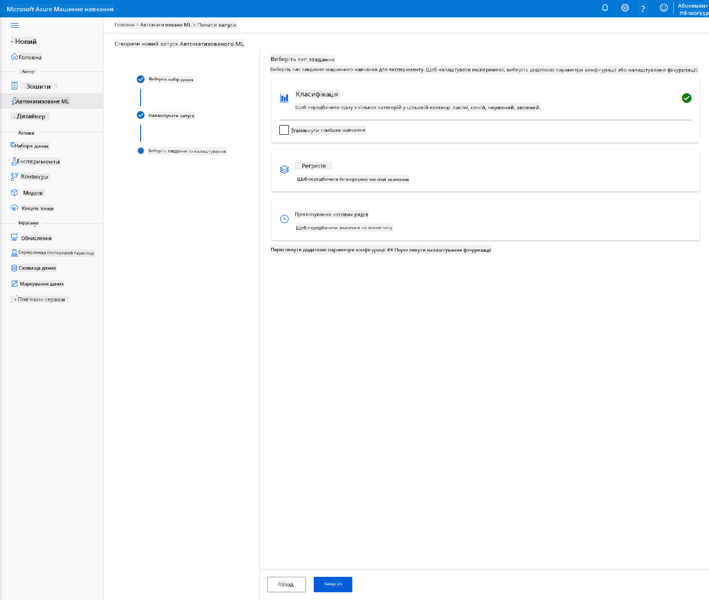

4. Після завершення запуску натисніть вкладку "Automated ML", виберіть ваш запуск і натисніть на алгоритм у картці "Best model summary".

   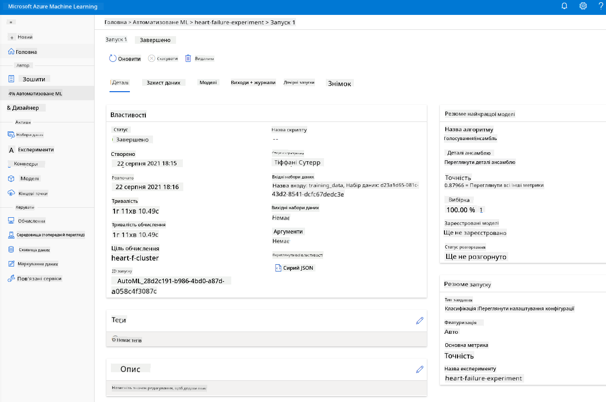

Тут ви можете побачити детальний опис найкращої моделі, яку створив AutoML. Ви також можете дослідити інші моделі у вкладці "Models". Приділіть кілька хвилин для дослідження моделей у кнопці "Explanations (preview)". Після того, як ви вибрали модель, яку хочете використовувати (тут ми виберемо найкращу модель, обрану AutoML), ми побачимо, як її можна розгорнути.

## 3. Розгортання моделі з низьким рівнем коду/без коду та споживання кінцевої точки
### 3.1 Розгортання моделі

Інтерфейс автоматизованого машинного навчання дозволяє розгорнути найкращу модель як вебслужбу за кілька кроків. Розгортання — це інтеграція моделі, щоб вона могла робити прогнози на основі нових даних і визначати потенційні області можливостей. Для цього проєкту розгортання вебслужби означає, що медичні програми зможуть використовувати модель для створення живих прогнозів ризику серцевого нападу у своїх пацієнтів.

У описі найкращої моделі натисніть кнопку "Deploy".

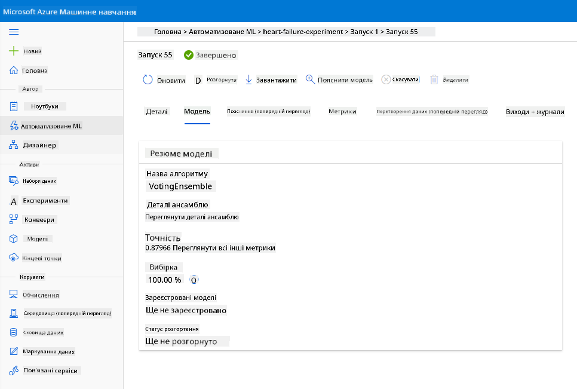

15. Дайте ім’я, опис, тип обчислень (Azure Container Instance), увімкніть автентифікацію та натисніть "Deploy". Цей крок може зайняти близько 20 хвилин. Процес розгортання включає кілька етапів, зокрема реєстрацію моделі, створення ресурсів і їх налаштування для вебслужби. Під статусом розгортання з’являється повідомлення про стан. Виберіть "Refresh" періодично, щоб перевірити статус розгортання. Модель розгорнута та працює, коли статус "Healthy".

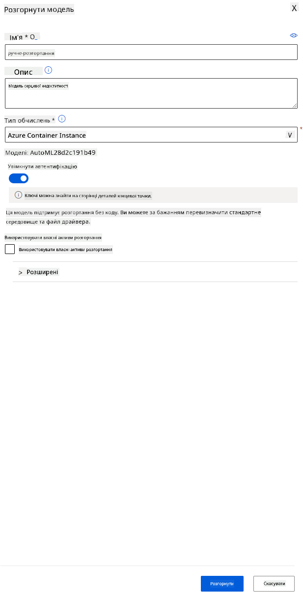

16. Після розгортання натисніть вкладку "Endpoint" і виберіть кінцеву точку, яку ви щойно розгорнули. Тут ви знайдете всі деталі, які потрібно знати про кінцеву точку.

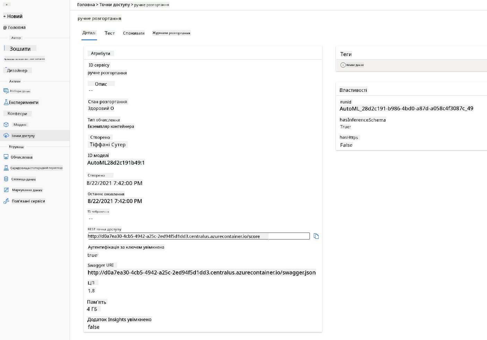

Чудово! Тепер, коли ми розгорнули модель, ми можемо почати споживання кінцевої точки.

### 3.2 Споживання кінцевої точки

Натисніть вкладку "Consume". Тут ви знайдете REST-кінцеву точку та скрипт Python у опції споживання. Приділіть час для ознайомлення з кодом Python.

Цей скрипт можна запустити безпосередньо з вашого локального комп’ютера, і він буде споживати вашу кінцеву точку.

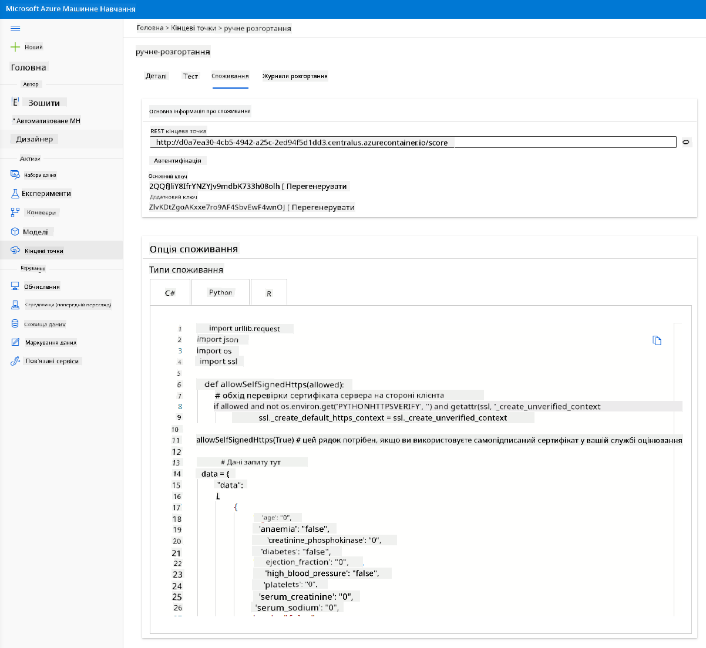

Приділіть час для перевірки цих двох рядків коду:

```python
url = 'http://98e3715f-xxxx-xxxx-xxxx-9ec22d57b796.centralus.azurecontainer.io/score'
api_key = '' # Replace this with the API key for the web service
```
Змінна `url` — це REST-кінцева точка, знайдена у вкладці "Consume", а змінна `api_key` — це первинний ключ, також знайдений у вкладці "Consume" (лише якщо ви увімкнули автентифікацію). Ось як скрипт може споживати кінцеву точку.

18. Запустивши скрипт, ви повинні побачити наступний результат:
    ```python
    b'"{\\"result\\": [true]}"'
    ```
Це означає, що прогноз серцевої недостатності для наданих даних є істинним. Це логічно, оскільки, якщо уважніше подивитися на дані, автоматично згенеровані у скрипті, все за замовчуванням дорівнює 0 і false. Ви можете змінити дані на наступний зразок:

```python
data = {
    "data":
    [
        {
            'age': "0",
            'anaemia': "false",
            'creatinine_phosphokinase': "0",
            'diabetes': "false",
            'ejection_fraction': "0",
            'high_blood_pressure': "false",
            'platelets': "0",
            'serum_creatinine': "0",
            'serum_sodium': "0",
            'sex': "false",
            'smoking': "false",
            'time': "0",
        },
        {
            'age': "60",
            'anaemia': "false",
            'creatinine_phosphokinase': "500",
            'diabetes': "false",
            'ejection_fraction': "38",
            'high_blood_pressure': "false",
            'platelets': "260000",
            'serum_creatinine': "1.40",
            'serum_sodium': "137",
            'sex': "false",
            'smoking': "false",
            'time': "130",
        },
    ],
}
```
Скрипт повинен повернути:
    ```python
    b'"{\\"result\\": [true, false]}"'
    ```

Вітаємо! Ви щойно спожили розгорнуту модель і натренували її в Azure ML!

> **_Примітка:_** Після завершення проєкту не забудьте видалити всі ресурси.
## 🚀 Виклик

Уважно перегляньте пояснення моделі та деталі, які AutoML створив для найкращих моделей. Спробуйте зрозуміти, чому найкраща модель краща за інші. Які алгоритми були порівняні? Які між ними відмінності? Чому найкраща модель працює краще в цьому випадку?

## [Післялекційний тест](https://purple-hill-04aebfb03.1.azurestaticapps.net/quiz/35)

## Огляд і самостійне навчання

У цьому уроці ви дізналися, як тренувати, розгортати та споживати модель для прогнозування ризику серцевої недостатності з низьким рівнем коду/без коду в хмарі. Якщо ви ще цього не зробили, заглибтеся у пояснення моделі, які AutoML створив для найкращих моделей, і спробуйте зрозуміти, чому найкраща модель краща за інші.

Ви можете дізнатися більше про AutoML з низьким рівнем коду/без коду, прочитавши цю [документацію](https://docs.microsoft.com/azure/machine-learning/tutorial-first-experiment-automated-ml?WT.mc_id=academic-77958-bethanycheum&ocid=AID3041109).

## Завдання

[Проєкт Data Science з низьким рівнем коду/без коду на Azure ML](assignment.md)

---

**Відмова від відповідальності**:  
Цей документ було перекладено за допомогою сервісу автоматичного перекладу [Co-op Translator](https://github.com/Azure/co-op-translator). Хоча ми прагнемо до точності, звертаємо вашу увагу, що автоматичні переклади можуть містити помилки або неточності. Оригінальний документ мовою оригіналу слід вважати авторитетним джерелом. Для критично важливої інформації рекомендується звертатися до професійного людського перекладу. Ми не несемо відповідальності за будь-які непорозуміння або неправильні тлумачення, що виникли внаслідок використання цього перекладу.