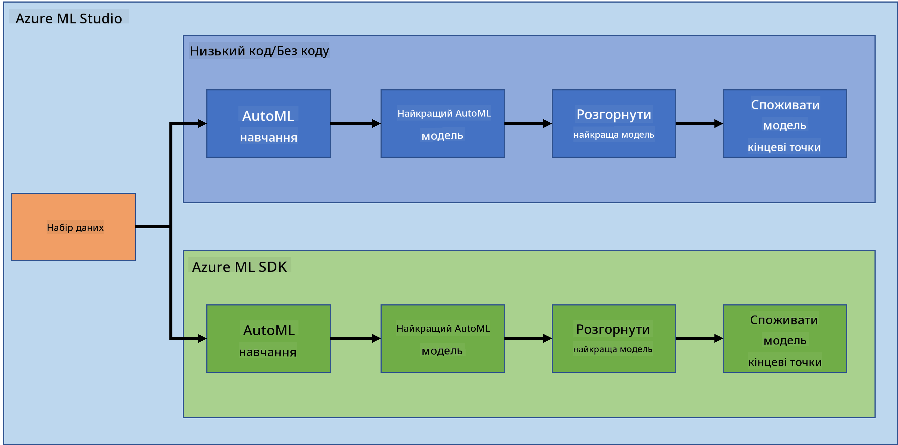

<!--
CO_OP_TRANSLATOR_METADATA:
{
  "original_hash": "8dfe141a0f46f7d253e07f74913c7f44",
  "translation_date": "2025-08-30T17:37:34+00:00",
  "source_file": "5-Data-Science-In-Cloud/README.md",
  "language_code": "uk"
}
-->
# Наука про дані в хмарі

> Фото [Jelleke Vanooteghem](https://unsplash.com/@ilumire) з [Unsplash](https://unsplash.com/s/photos/cloud?orientation=landscape)

Коли справа доходить до роботи з великими даними у сфері науки про дані, хмара може стати справжнім проривом. У наступних трьох уроках ми розглянемо, що таке хмара і чому вона може бути дуже корисною. Ми також дослідимо набір даних про серцеву недостатність і створимо модель, яка допоможе оцінити ймовірність виникнення серцевої недостатності у людини. Ми використаємо потужність хмари для навчання, розгортання та використання моделі двома різними способами. Один спосіб — використовуючи лише інтерфейс користувача в стилі Low code/No code, інший — за допомогою набору інструментів для розробників Azure Machine Learning (Azure ML SDK).

### Теми

1. [Чому використовувати хмару для науки про дані?](17-Introduction/README.md)
2. [Наука про дані в хмарі: спосіб "Low code/No code"](18-Low-Code/README.md)
3. [Наука про дані в хмарі: спосіб "Azure ML SDK"](19-Azure/README.md)

### Автори
Ці уроки були написані з ☁️ та 💕 [Maud Levy](https://twitter.com/maudstweets) і [Tiffany Souterre](https://twitter.com/TiffanySouterre)

Дані для проєкту прогнозування серцевої недостатності взяті з [
Larxel](https://www.kaggle.com/andrewmvd) на [Kaggle](https://www.kaggle.com/andrewmvd/heart-failure-clinical-data). Ліцензовані за [Attribution 4.0 International (CC BY 4.0)](https://creativecommons.org/licenses/by/4.0/)

---

**Відмова від відповідальності**:  
Цей документ було перекладено за допомогою сервісу автоматичного перекладу [Co-op Translator](https://github.com/Azure/co-op-translator). Хоча ми прагнемо до точності, будь ласка, майте на увазі, що автоматичні переклади можуть містити помилки або неточності. Оригінальний документ на його рідній мові слід вважати авторитетним джерелом. Для критичної інформації рекомендується професійний людський переклад. Ми не несемо відповідальності за будь-які непорозуміння або неправильні тлумачення, що виникають у результаті використання цього перекладу.