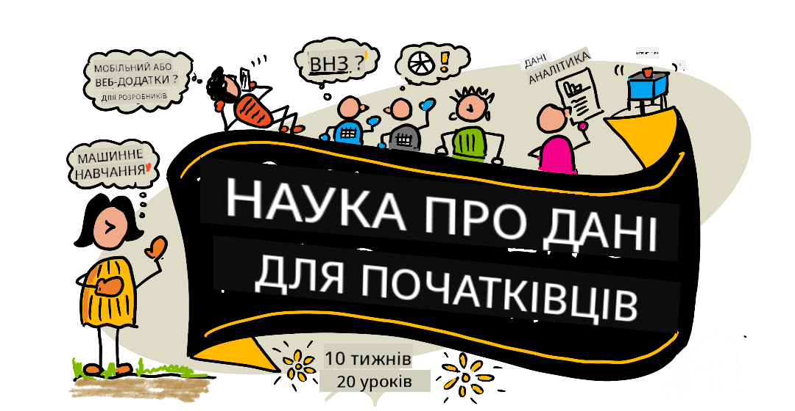

<!--
CO_OP_TRANSLATOR_METADATA:
{
  "original_hash": "dd9a1deb4da680b2cf11ba2e9f5a0a6e",
  "translation_date": "2025-09-29T22:15:45+00:00",
  "source_file": "README.md",
  "language_code": "uk"
}
-->
# Основи науки про дані - Навчальна програма

Команда Azure Cloud Advocates у Microsoft рада запропонувати 10-тижневу навчальну програму з 20 уроків, присвячену науці про дані. Кожен урок включає тести перед і після заняття, письмові інструкції для виконання уроку, рішення та завдання. Наш підхід, заснований на проектах, дозволяє навчатися через створення, що є перевіреним способом закріплення нових навичок.

**Щиро дякуємо нашим авторам:** [Jasmine Greenaway](https://www.twitter.com/paladique), [Dmitry Soshnikov](http://soshnikov.com), [Nitya Narasimhan](https://twitter.com/nitya), [Jalen McGee](https://twitter.com/JalenMcG), [Jen Looper](https://twitter.com/jenlooper), [Maud Levy](https://twitter.com/maudstweets), [Tiffany Souterre](https://twitter.com/TiffanySouterre), [Christopher Harrison](https://www.twitter.com/geektrainer).

**🙏 Особлива подяка 🙏 нашим [Microsoft Student Ambassador](https://studentambassadors.microsoft.com/) авторам, рецензентам і учасникам контенту,** зокрема Aaryan Arora, [Aditya Garg](https://github.com/AdityaGarg00), [Alondra Sanchez](https://www.linkedin.com/in/alondra-sanchez-molina/), [Ankita Singh](https://www.linkedin.com/in/ankitasingh007), [Anupam Mishra](https://www.linkedin.com/in/anupam--mishra/), [Arpita Das](https://www.linkedin.com/in/arpitadas01/), ChhailBihari Dubey, [Dibri Nsofor](https://www.linkedin.com/in/dibrinsofor), [Dishita Bhasin](https://www.linkedin.com/in/dishita-bhasin-7065281bb), [Majd Safi](https://www.linkedin.com/in/majd-s/), [Max Blum](https://www.linkedin.com/in/max-blum-6036a1186/), [Miguel Correa](https://www.linkedin.com/in/miguelmque/), [Mohamma Iftekher (Iftu) Ebne Jalal](https://twitter.com/iftu119), [Nawrin Tabassum](https://www.linkedin.com/in/nawrin-tabassum), [Raymond Wangsa Putra](https://www.linkedin.com/in/raymond-wp/), [Rohit Yadav](https://www.linkedin.com/in/rty2423), Samridhi Sharma, [Sanya Sinha](https://www.linkedin.com/mwlite/in/sanya-sinha-13aab1200),
[Sheena Narula](https://www.linkedin.com/in/sheena-narua-n/), [Tauqeer Ahmad](https://www.linkedin.com/in/tauqeerahmad5201/), Yogendrasingh Pawar , [Vidushi Gupta](https://www.linkedin.com/in/vidushi-gupta07/), [Jasleen Sondhi](https://www.linkedin.com/in/jasleen-sondhi/)

||
|:---:|
| Наука про дані для початківців - _Скетчнот від [@nitya](https://twitter.com/nitya)_ |

### 🌐 Підтримка багатомовності

#### Підтримується через GitHub Action (автоматично та завжди актуально)

[Французька](../fr/README.md) | [Іспанська](../es/README.md) | [Німецька](../de/README.md) | [Російська](../ru/README.md) | [Арабська](../ar/README.md) | [Перська (фарсі)](../fa/README.md) | [Урду](../ur/README.md) | [Китайська (спрощена)](../zh/README.md) | [Китайська (традиційна, Макао)](../mo/README.md) | [Китайська (традиційна, Гонконг)](../hk/README.md) | [Китайська (традиційна, Тайвань)](../tw/README.md) | [Японська](../ja/README.md) | [Корейська](../ko/README.md) | [Гінді](../hi/README.md) | [Бенгальська](../bn/README.md) | [Маратхі](../mr/README.md) | [Непальська](../ne/README.md) | [Панджабі (гурмухі)](../pa/README.md) | [Португальська (Португалія)](../pt/README.md) | [Португальська (Бразилія)](../br/README.md) | [Італійська](../it/README.md) | [Польська](../pl/README.md) | [Турецька](../tr/README.md) | [Грецька](../el/README.md) | [Тайська](../th/README.md) | [Шведська](../sv/README.md) | [Данська](../da/README.md) | [Норвезька](../no/README.md) | [Фінська](../fi/README.md) | [Нідерландська](../nl/README.md) | [Іврит](../he/README.md) | [В'єтнамська](../vi/README.md) | [Індонезійська](../id/README.md) | [Малайська](../ms/README.md) | [Тагальська (філіппінська)](../tl/README.md) | [Суахілі](../sw/README.md) | [Угорська](../hu/README.md) | [Чеська](../cs/README.md) | [Словацька](../sk/README.md) | [Румунська](../ro/README.md) | [Болгарська](../bg/README.md) | [Сербська (кирилиця)](../sr/README.md) | [Хорватська](../hr/README.md) | [Словенська](../sl/README.md) | [Українська](./README.md) | [Бірманська (М'янма)](../my/README.md)

**Якщо ви хочете додати додаткові переклади, список підтримуваних мов наведено [тут](https://github.com/Azure/co-op-translator/blob/main/getting_started/supported-languages.md)**

#### Приєднуйтесь до нашої спільноти 

У нас триває серія навчання з AI у Discord, дізнайтеся більше та приєднуйтесь до нас на [Learn with AI Series](https://aka.ms/learnwithai/discord) з 18 по 30 вересня 2025 року. Ви отримаєте поради та хитрощі використання GitHub Copilot для науки про дані.

# Ви студент?

Розпочніть з наступних ресурсів:

- [Сторінка Student Hub](https://docs.microsoft.com/en-gb/learn/student-hub?WT.mc_id=academic-77958-bethanycheum) На цій сторінці ви знайдете ресурси для початківців, студентські пакети та навіть способи отримати безкоштовний сертифікат. Це сторінка, яку варто додати в закладки та перевіряти час від часу, оскільки ми змінюємо контент щонайменше щомісяця.
- [Microsoft Learn Student Ambassadors](https://studentambassadors.microsoft.com?WT.mc_id=academic-77958-bethanycheum) Приєднуйтесь до глобальної спільноти студентів-амбасадорів, це може бути вашим шляхом до Microsoft.

# Початок роботи

> **Вчителі**: ми [додали кілька пропозицій](for-teachers.md) щодо використання цієї навчальної програми. Нам буде цікаво отримати ваші відгуки [у нашому форумі обговорень](https://github.com/microsoft/Data-Science-For-Beginners/discussions)!

> **[Студенти](https://aka.ms/student-page)**: щоб використовувати цю навчальну програму самостійно, зробіть форк усього репозиторію та виконайте вправи самостійно, починаючи з тесту перед лекцією. Потім прочитайте лекцію та виконайте решту завдань. Спробуйте створювати проекти, розуміючи уроки, а не копіюючи код рішення; однак цей код доступний у папках /solutions у кожному проектно-орієнтованому уроці. Ще одна ідея — створити навчальну групу з друзями та проходити контент разом. Для подальшого навчання ми рекомендуємо [Microsoft Learn](https://docs.microsoft.com/en-us/users/jenlooper-2911/collections/qprpajyoy3x0g7?WT.mc_id=academic-77958-bethanycheum).

## Знайомтесь із командою

**Gif створено** [Mohit Jaisal](https://www.linkedin.com/in/mohitjaisal)

> 🎥 Натисніть на зображення вище, щоб переглянути відео про проект і людей, які його створили!

## Педагогіка

Ми обрали два педагогічні принципи при створенні цієї навчальної програми: забезпечення її проектно-орієнтованості та включення частих тестів. До кінця цієї серії студенти вивчать основні принципи науки про дані, включаючи етичні концепції, підготовку даних, різні способи роботи з даними, візуалізацію даних, аналіз даних, реальні приклади використання науки про дані та багато іншого.

Крім того, тест з низьким рівнем стресу перед заняттям налаштовує студента на вивчення теми, а другий тест після заняття забезпечує подальше закріплення матеріалу. Ця навчальна програма була розроблена як гнучка та цікава і може бути пройдена повністю або частково. Проекти починаються з простих і стають дедалі складнішими до кінця 10-тижневого циклу.

> Знайдіть наш [Кодекс поведінки](CODE_OF_CONDUCT.md), [Правила внесення змін](CONTRIBUTING.md), [Правила перекладу](TRANSLATIONS.md). Ми вітаємо ваші конструктивні відгуки!

## Кожен урок включає:

- Опціональний скетчнот
- Опціональне додаткове відео
- Тест для розігріву перед уроком
- Письмовий урок
- Для проектно-орієнтованих уроків — покрокові інструкції щодо створення проекту
- Перевірка знань
- Виклик
- Додаткове читання
- Завдання
- [Тест після уроку](https://ff-quizzes.netlify.app/en/)

> **Примітка щодо тестів**: Усі тести знаходяться в папці Quiz-App, всього 40 тестів по три питання кожен. Вони пов’язані з уроками, але додаток для тестів можна запустити локально або розгорнути в Azure; дотримуйтесь інструкцій у папці `quiz-app`. Вони поступово локалізуються.

## Уроки
||
|:---:|
| Наука про дані для початківців: Дорожня карта - _Скетчнот від [@nitya](https://twitter.com/nitya)_ |

| Номер уроку | Тема | Групування уроків | Цілі навчання | Пов'язаний урок | Автор |
| :-----------: | :----------------------------------------: | :--------------------------------------------------: | :-----------------------------------------------------------------------------------------------------------------------------------------------------------------------: | :---------------------------------------------------------------------: | :----: |
| 01 | Визначення науки про дані | [Вступ](1-Introduction/README.md) | Вивчіть основні концепції науки про дані та її зв’язок зі штучним інтелектом, машинним навчанням і великими даними. | [урок](1-Introduction/01-defining-data-science/README.md) [відео](https://youtu.be/beZ7Mb_oz9I) | [Dmitry](http://soshnikov.com) |
| 02 | Етика науки про дані | [Вступ](1-Introduction/README.md) | Концепції етики даних, виклики та рамки. | [урок](1-Introduction/02-ethics/README.md) | [Nitya](https://twitter.com/nitya) |
| 03 | Визначення даних | [Вступ](1-Introduction/README.md) | Як класифікуються дані та їхні загальні джерела. | [урок](1-Introduction/03-defining-data/README.md) | [Jasmine](https://www.twitter.com/paladique) |
| 04 | Вступ до статистики та ймовірності | [Вступ](1-Introduction/README.md) | Математичні методи ймовірності та статистики для розуміння даних. | [урок](1-Introduction/04-stats-and-probability/README.md) [відео](https://youtu.be/Z5Zy85g4Yjw) | [Dmitry](http://soshnikov.com) |
| 05 | Робота з реляційними даними | [Робота з даними](2-Working-With-Data/README.md) | Вступ до реляційних даних і основи дослідження та аналізу реляційних даних за допомогою мови структурованих запитів, також відомої як SQL (вимовляється «сі-квел»). | [урок](2-Working-With-Data/05-relational-databases/README.md) | [Christopher](https://www.twitter.com/geektrainer) | | |
| 06 | Робота з NoSQL даними | [Робота з даними](2-Working-With-Data/README.md) | Вступ до нереляційних даних, їх різних типів і основи дослідження та аналізу документних баз даних. | [урок](2-Working-With-Data/06-non-relational/README.md) | [Jasmine](https://twitter.com/paladique)|
| 07 | Робота з Python | [Робота з даними](2-Working-With-Data/README.md) | Основи використання Python для дослідження даних із бібліотеками, такими як Pandas. Рекомендується базове розуміння програмування на Python. | [урок](2-Working-With-Data/07-python/README.md) [відео](https://youtu.be/dZjWOGbsN4Y) | [Dmitry](http://soshnikov.com) |
| 08 | Підготовка даних | [Робота з даними](2-Working-With-Data/README.md) | Теми про методи очищення та трансформації даних для вирішення проблем із відсутніми, неточними або неповними даними. | [урок](2-Working-With-Data/08-data-preparation/README.md) | [Jasmine](https://www.twitter.com/paladique) |
| 09 | Візуалізація кількостей | [Візуалізація даних](3-Data-Visualization/README.md) | Вивчіть, як використовувати Matplotlib для візуалізації даних про птахів 🦆 | [урок](3-Data-Visualization/09-visualization-quantities/README.md) | [Jen](https://twitter.com/jenlooper) |
| 10 | Візуалізація розподілу даних | [Візуалізація даних](3-Data-Visualization/README.md) | Візуалізація спостережень і тенденцій у межах інтервалу. | [урок](3-Data-Visualization/10-visualization-distributions/README.md) | [Jen](https://twitter.com/jenlooper) |
| 11 | Візуалізація пропорцій | [Візуалізація даних](3-Data-Visualization/README.md) | Візуалізація дискретних і згрупованих відсотків. | [урок](3-Data-Visualization/11-visualization-proportions/README.md) | [Jen](https://twitter.com/jenlooper) |
| 12 | Візуалізація взаємозв’язків | [Візуалізація даних](3-Data-Visualization/README.md) | Візуалізація зв’язків і кореляцій між наборами даних і їхніми змінними. | [урок](3-Data-Visualization/12-visualization-relationships/README.md) | [Jen](https://twitter.com/jenlooper) |
| 13 | Значущі візуалізації | [Візуалізація даних](3-Data-Visualization/README.md) | Методи та рекомендації щодо створення цінних візуалізацій для ефективного вирішення проблем і отримання інсайтів. | [урок](3-Data-Visualization/13-meaningful-visualizations/README.md) | [Jen](https://twitter.com/jenlooper) |
| 14 | Вступ до життєвого циклу науки про дані | [Життєвий цикл](4-Data-Science-Lifecycle/README.md) | Вступ до життєвого циклу науки про дані та його першого етапу — отримання та вилучення даних. | [урок](4-Data-Science-Lifecycle/14-Introduction/README.md) | [Jasmine](https://twitter.com/paladique) |
| 15 | Аналіз | [Життєвий цикл](4-Data-Science-Lifecycle/README.md) | Ця фаза життєвого циклу науки про дані зосереджена на методах аналізу даних. | [урок](4-Data-Science-Lifecycle/15-analyzing/README.md) | [Jasmine](https://twitter.com/paladique) | | |
| 16 | Комунікація | [Життєвий цикл](4-Data-Science-Lifecycle/README.md) | Ця фаза життєвого циклу науки про дані зосереджена на представленні інсайтів із даних у спосіб, який полегшує розуміння для осіб, які приймають рішення. | [урок](4-Data-Science-Lifecycle/16-communication/README.md) | [Jalen](https://twitter.com/JalenMcG) | | |
| 17 | Наука про дані в хмарі | [Хмарні дані](5-Data-Science-In-Cloud/README.md) | Ця серія уроків знайомить із наукою про дані в хмарі та її перевагами. | [урок](5-Data-Science-In-Cloud/17-Introduction/README.md) | [Tiffany](https://twitter.com/TiffanySouterre) та [Maud](https://twitter.com/maudstweets) |
| 18 | Наука про дані в хмарі | [Хмарні дані](5-Data-Science-In-Cloud/README.md) | Навчання моделей за допомогою інструментів Low Code. |[урок](5-Data-Science-In-Cloud/18-Low-Code/README.md) | [Tiffany](https://twitter.com/TiffanySouterre) та [Maud](https://twitter.com/maudstweets) |
| 19 | Наука про дані в хмарі | [Хмарні дані](5-Data-Science-In-Cloud/README.md) | Розгортання моделей за допомогою Azure Machine Learning Studio. | [урок](5-Data-Science-In-Cloud/19-Azure/README.md)| [Tiffany](https://twitter.com/TiffanySouterre) та [Maud](https://twitter.com/maudstweets) |
| 20 | Наука про дані в реальному світі | [У реальному світі](6-Data-Science-In-Wild/README.md) | Проекти, керовані наукою про дані, у реальному світі. | [урок](6-Data-Science-In-Wild/20-Real-World-Examples/README.md) | [Nitya](https://twitter.com/nitya) |

## GitHub Codespaces

Виконайте ці кроки, щоб відкрити цей приклад у Codespace:
1. Натисніть на випадаюче меню Code і виберіть опцію Open with Codespaces.
2. Виберіть + New codespace внизу панелі.
Для отримання додаткової інформації перегляньте [документацію GitHub](https://docs.github.com/en/codespaces/developing-in-codespaces/creating-a-codespace-for-a-repository#creating-a-codespace).

## VSCode Remote - Containers
Виконайте ці кроки, щоб відкрити цей репозиторій у контейнері за допомогою вашого локального комп’ютера та VSCode, використовуючи розширення VS Code Remote - Containers:

1. Якщо ви вперше використовуєте контейнер для розробки, переконайтеся, що ваша система відповідає вимогам (наприклад, встановлено Docker) у [документації для початку роботи](https://code.visualstudio.com/docs/devcontainers/containers#_getting-started).

Щоб використовувати цей репозиторій, ви можете або відкрити його в ізольованому томі Docker:

**Примітка**: У фоновому режимі це використовуватиме команду Remote-Containers: **Clone Repository in Container Volume...** для клонування вихідного коду в том Docker замість локальної файлової системи. [Томи](https://docs.docker.com/storage/volumes/) є рекомендованим механізмом для збереження даних контейнера.

Або відкрийте локально клоновану чи завантажену версію репозиторію:

- Клонуйте цей репозиторій у вашу локальну файлову систему.
- Натисніть F1 і виберіть команду **Remote-Containers: Open Folder in Container...**.
- Виберіть клоновану копію цієї папки, зачекайте, поки контейнер запуститься, і спробуйте.

## Офлайн-доступ

Ви можете запустити цю документацію офлайн, використовуючи [Docsify](https://docsify.js.org/#/). Форкніть цей репозиторій, [встановіть Docsify](https://docsify.js.org/#/quickstart) на вашому локальному комп’ютері, потім у кореневій папці цього репозиторію введіть `docsify serve`. Вебсайт буде доступний на порту 3000 вашого localhost: `localhost:3000`.

> Примітка: блокноти не будуть відображатися через Docsify, тому коли вам потрібно запустити блокнот, зробіть це окремо у VS Code, запустивши Python kernel.

## Інші навчальні програми

Наша команда створює інші навчальні програми! Перегляньте:

- [Edge AI для початківців](https://aka.ms/edgeai-for-beginners)
- [AI Agents для початківців](https://aka.ms/ai-agents-beginners)
- [Генеративний AI для початківців](https://aka.ms/genai-beginners)
- [Генеративний AI для початківців .NET](https://github.com/microsoft/Generative-AI-for-beginners-dotnet)
- [Генеративний AI з JavaScript](https://github.com/microsoft/generative-ai-with-javascript)
- [Генеративний AI з Java](https://aka.ms/genaijava)
- [AI для початківців](https://aka.ms/ai-beginners)
- [Наука про дані для початківців](https://aka.ms/datascience-beginners)
- [Bash для початківців](https://github.com/microsoft/bash-for-beginners)
- [ML для початківців](https://aka.ms/ml-beginners)
- [Кібербезпека для початківців](https://github.com/microsoft/Security-101) 
- [Веб-розробка для початківців](https://aka.ms/webdev-beginners)
- [IoT для початківців](https://aka.ms/iot-beginners)
- [Машинне навчання для початківців](https://aka.ms/ml-beginners)
- [Розробка XR для початківців](https://aka.ms/xr-dev-for-beginners)
- [Опанування GitHub Copilot для парного програмування з AI](https://aka.ms/GitHubCopilotAI)
- [Розробка XR для початківців](https://github.com/microsoft/xr-development-for-beginners)
- [Опанування GitHub Copilot для розробників C#/.NET](https://github.com/microsoft/mastering-github-copilot-for-dotnet-csharp-developers)
- [Виберіть свою пригоду з Copilot](https://github.com/microsoft/CopilotAdventures)

---

**Відмова від відповідальності**:  
Цей документ був перекладений за допомогою сервісу автоматичного перекладу [Co-op Translator](https://github.com/Azure/co-op-translator). Хоча ми прагнемо до точності, будь ласка, майте на увазі, що автоматичні переклади можуть містити помилки або неточності. Оригінальний документ на його рідній мові слід вважати авторитетним джерелом. Для критичної інформації рекомендується професійний людський переклад. Ми не несемо відповідальності за будь-які непорозуміння або неправильні тлумачення, що виникають внаслідок використання цього перекладу.