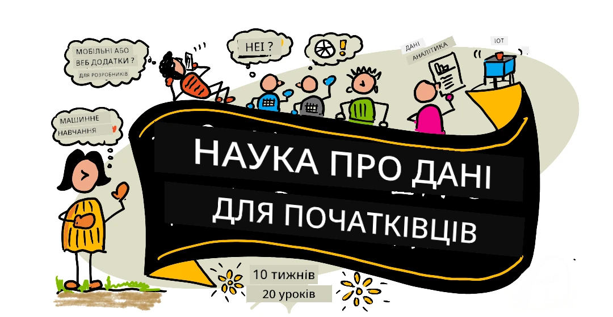
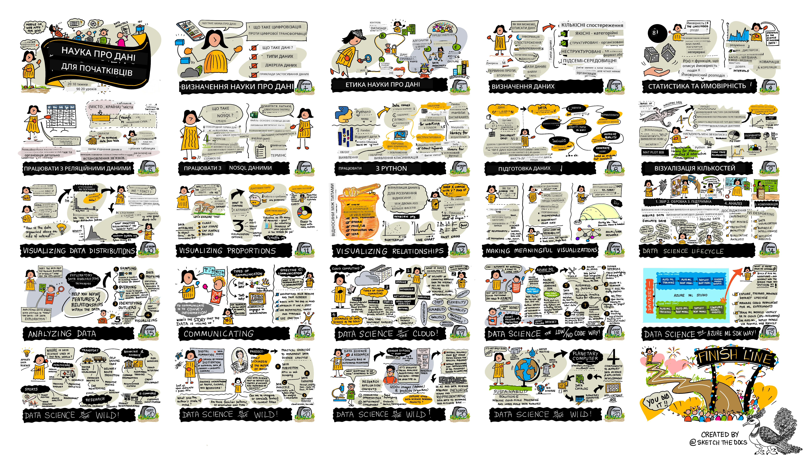

# Data Science для початківців - навчальна програма

[](https://github.com/codespaces/new?hide_repo_select=true&ref=main&repo=344191198)

[](https://github.com/microsoft/Data-Science-For-Beginners/blob/master/LICENSE)
[](https://GitHub.com/microsoft/Data-Science-For-Beginners/graphs/contributors/)
[](https://GitHub.com/microsoft/Data-Science-For-Beginners/issues/)
[](https://GitHub.com/microsoft/Data-Science-For-Beginners/pulls/)
[](http://makeapullrequest.com)

[](https://GitHub.com/microsoft/Data-Science-For-Beginners/watchers/)
[](https://GitHub.com/microsoft/Data-Science-For-Beginners/network/)
[](https://GitHub.com/microsoft/Data-Science-For-Beginners/stargazers/)


[](https://discord.gg/nTYy5BXMWG)

[](https://aka.ms/foundry/forum)

Azure Cloud Advocates у Microsoft із задоволенням пропонують 10-тижневу навчальну програму з 20 уроків, присвячених Data Science. Кожен урок містить тести до та після заняття, письмові інструкції для виконання уроку, розв’язок та домашнє завдання. Наша проєктно-орієнтована педагогіка дозволяє вчитися, створюючи, що є перевіреним способом ефективного засвоєння нових навичок.

**Щира подяка нашим авторам:** [Jasmine Greenaway](https://www.twitter.com/paladique), [Dmitry Soshnikov](http://soshnikov.com), [Nitya Narasimhan](https://twitter.com/nitya), [Jalen McGee](https://twitter.com/JalenMcG), [Jen Looper](https://twitter.com/jenlooper), [Maud Levy](https://twitter.com/maudstweets), [Tiffany Souterre](https://twitter.com/TiffanySouterre), [Christopher Harrison](https://www.twitter.com/geektrainer).

**🙏 Особлива подяка 🙏 нашим авторам, рецензентам і контриб’юторам [Microsoft Student Ambassador](https://studentambassadors.microsoft.com/),** зокрема Ааріану Арорі, [Aditya Garg](https://github.com/AdityaGarg00), [Alondra Sanchez](https://www.linkedin.com/in/alondra-sanchez-molina/), [Ankita Singh](https://www.linkedin.com/in/ankitasingh007), [Anupam Mishra](https://www.linkedin.com/in/anupam--mishra/), [Arpita Das](https://www.linkedin.com/in/arpitadas01/), ChhailBihari Dubey, [Dibri Nsofor](https://www.linkedin.com/in/dibrinsofor), [Dishita Bhasin](https://www.linkedin.com/in/dishita-bhasin-7065281bb), [Majd Safi](https://www.linkedin.com/in/majd-s/), [Max Blum](https://www.linkedin.com/in/max-blum-6036a1186/), [Miguel Correa](https://www.linkedin.com/in/miguelmque/), [Mohamma Iftekher (Iftu) Ebne Jalal](https://twitter.com/iftu119), [Nawrin Tabassum](https://www.linkedin.com/in/nawrin-tabassum), [Raymond Wangsa Putra](https://www.linkedin.com/in/raymond-wp/), [Rohit Yadav](https://www.linkedin.com/in/rty2423), Samridhi Sharma, [Sanya Sinha](https://www.linkedin.com/mwlite/in/sanya-sinha-13aab1200),
[Sheena Narula](https://www.linkedin.com/in/sheena-narua-n/), [Tauqeer Ahmad](https://www.linkedin.com/in/tauqeerahmad5201/), Yogendrasingh Pawar , [Vidushi Gupta](https://www.linkedin.com/in/vidushi-gupta07/), [Jasleen Sondhi](https://www.linkedin.com/in/jasleen-sondhi/)

||
|:---:|
| Data Science для початківців - _конспект від [@nitya](https://twitter.com/nitya)_ |

### 🌐 Підтримка багатьох мов

#### Підтримується за допомогою GitHub Action (автоматично і завжди актуально)

<!-- CO-OP TRANSLATOR LANGUAGES TABLE START -->
[Арабська](../ar/README.md) | [Бенгальська](../bn/README.md) | [Болгарська](../bg/README.md) | [Бірманська (М’янма)](../my/README.md) | [Китайська (спрощена)](../zh-CN/README.md) | [Китайська (традиційна, Гонконг)](../zh-HK/README.md) | [Китайська (традиційна, Макао)](../zh-MO/README.md) | [Китайська (традиційна, Тайвань)](../zh-TW/README.md) | [Хорватська](../hr/README.md) | [Чеська](../cs/README.md) | [Данська](../da/README.md) | [Нідерландська](../nl/README.md) | [Естонська](../et/README.md) | [Фінська](../fi/README.md) | [Французька](../fr/README.md) | [Німецька](../de/README.md) | [Грецька](../el/README.md) | [Гебрайська](../he/README.md) | [Гінді](../hi/README.md) | [Угорська](../hu/README.md) | [Індонезійська](../id/README.md) | [Італійська](../it/README.md) | [Японська](../ja/README.md) | [Каннада](../kn/README.md) | [Кхмер](../km/README.md) | [Корейська](../ko/README.md) | [Литовська](../lt/README.md) | [Малайська](../ms/README.md) | [Малаялам](../ml/README.md) | [Маратхі](../mr/README.md) | [Непальська](../ne/README.md) | [Нігерійський Піджин](../pcm/README.md) | [Норвезька](../no/README.md) | [Персська (фарсі)](../fa/README.md) | [Польська](../pl/README.md) | [Португальська (Бразилія)](../pt-BR/README.md) | [Португальська (Португалія)](../pt-PT/README.md) | [Пенджабі (Гурмухі)](../pa/README.md) | [Румунська](../ro/README.md) | [Російська](../ru/README.md) | [Сербська (кирилиця)](../sr/README.md) | [Словацька](../sk/README.md) | [Словенська](../sl/README.md) | [Іспанська](../es/README.md) | [Суахілі](../sw/README.md) | [Шведська](../sv/README.md) | [Тагальська (філіппінська)](../tl/README.md) | [Тамільська](../ta/README.md) | [Телугу](../te/README.md) | [Тайська](../th/README.md) | [Турецька](../tr/README.md) | [Українська](./README.md) | [Урду](../ur/README.md) | [В’єтнамська](../vi/README.md)

> **Віддаєте перевагу клонувати локально?**
>
> У цьому репозиторії є понад 50 мовних перекладів, що суттєво збільшує розмір завантаження. Щоб клонувати без перекладів, використовуйте sparse checkout:
>
> **Bash / macOS / Linux:**
> ```bash
> git clone --filter=blob:none --sparse https://github.com/microsoft/Data-Science-For-Beginners.git
> cd Data-Science-For-Beginners
> git sparse-checkout set --no-cone '/*' '!translations' '!translated_images'
> ```
>
> **CMD (Windows):**
> ```cmd
> git clone --filter=blob:none --sparse https://github.com/microsoft/Data-Science-For-Beginners.git
> cd Data-Science-For-Beginners
> git sparse-checkout set --no-cone "/*" "!translations" "!translated_images"
> ```
>
> Це дасть вам усе необхідне для проходження курсу з набагато швидшим завантаженням.
<!-- CO-OP TRANSLATOR LANGUAGES TABLE END -->

**Якщо ви хочете, щоб додаткові мови перекладу підтримувалися, вони перелічені [тут](https://github.com/Azure/co-op-translator/blob/main/getting_started/supported-languages.md)**

#### Приєднуйтесь до нашої спільноти 
[](https://discord.gg/nTYy5BXMWG)

У нас триває серія на Discord «Вчитися з AI», дізнайтеся більше та приєднуйтеся до нас на [Learn with AI Series](https://aka.ms/learnwithai/discord) з 18 по 30 вересня 2025 року. Ви отримаєте поради та трюки з використання GitHub Copilot для Data Science.


# Ви студент?

Розпочніть з таких ресурсів:

- [Сторінка студентського хабу](https://docs.microsoft.com/en-gb/learn/student-hub?WT.mc_id=academic-77958-bethanycheum) На цій сторінці ви знайдете ресурси для початківців, набори для студентів і навіть способи отримати безкоштовний ваучер на сертифікацію. Цю сторінку варто додати в закладки та час від часу перевіряти, оскільки ми оновлюємо контент щонайменше щомісяця.
- [Microsoft Learn Student Ambassadors](https://studentambassadors.microsoft.com?WT.mc_id=academic-77958-bethanycheum) Приєднуйтесь до глобальної спільноти студентських послів, це може бути вашим шляхом до Microsoft.

# Початок роботи

## 📚 Документація

- **[Посібник з установки](INSTALLATION.md)** - покрокові інструкції налаштування для початківців
- **[Посібник з використання](USAGE.md)** - приклади та типові робочі процеси
- **[Усунення неполадок](TROUBLESHOOTING.md)** - рішення типових проблем
- **[Посібник з внеску](CONTRIBUTING.md)** - як внести свій внесок у цей проєкт
- **[Для викладачів](for-teachers.md)** - методичні поради та навчальні ресурси

## 👨‍🎓 Для студентів
> **Повні початківці**: Ви новачок у data science? Почніть з наших [простіших прикладів для початківців](examples/README.md)! Ці прості, добре прокоментовані приклади допоможуть вам зрозуміти основи перед повним проходженням навчальної програми.
> **[Студенти](https://aka.ms/student-page)**: щоб використовувати цю програму самостійно, зробіть форк всього репозиторію і виконайте вправи самостійно, починаючи з тесту перед лекцією. Потім прочитайте лекцію і завершіть інші завдання. Намагайтеся створювати проєкти, розуміючи уроки, а не просто копіюючи розв’язки; проте код розв’язків є у папках /solutions кожного проєктно-орієнтовного уроку. Інша ідея – утворити навчальну групу з друзями і разом проходити матеріал. Для додаткового вивчення радимо [Microsoft Learn](https://docs.microsoft.com/en-us/users/jenlooper-2911/collections/qprpajyoy3x0g7?WT.mc_id=academic-77958-bethanycheum).

**Швидкий старт:**
1. Перегляньте [Посібник з установки](INSTALLATION.md) для налаштування середовища
2. Ознайомтесь з [Посібником з використання](USAGE.md), щоб навчитися працювати з програмою
3. Починайте з уроку 1 та рухайтеся послідовно
4. Приєднуйтесь до нашої [спільноти Discord](https://aka.ms/ds4beginners/discord) для підтримки

## 👩‍🏫 Для викладачів
> **Викладачі**: ми [додали деякі пропозиції](for-teachers.md) щодо використання цієї навчальної програми. Ми будемо раді вашому відгуку [на нашому форумі обговорень](https://github.com/microsoft/Data-Science-For-Beginners/discussions)!

## Знайомтесь з командою

[](https://youtu.be/8mzavjQSMM4 "Промо відео")

**Гіфка від** [Mohit Jaisal](https://www.linkedin.com/in/mohitjaisal)

> 🎥 Натисніть на зображення вище, щоб переглянути відео про проект та людей, які його створили!

## Педагогіка

Ми обрали два педагогічні принципи під час створення цієї навчальної програми: забезпечити проектну основу та часті опитування. До кінця цього курсу студенти засвоять базові принципи науки про дані, включно з етичними концепціями, підготовкою даних, різними способами роботи з даними, візуалізацією даних, аналізом даних, реальними випадками використання науки про дані тощо.

Крім того, опитування з низькими ставками перед заняттям налаштовує студента на вивчення теми, а друге опитування після заняття забезпечує подальше закріплення матеріалу. Ця навчальна програма розроблена так, щоб бути гнучкою та цікавою і може бути пройдена повністю або частково. Проекти починаються з простого і поступово ускладнюються до кінця 10-тижневого циклу.

> Знайдіть наші [Кодекс поведінки](CODE_OF_CONDUCT.md), [Внесок](CONTRIBUTING.md), [Переклади](TRANSLATIONS.md) рекомендації. Ми радо приймаємо ваші конструктивні відгуки!

## Кожен урок включає:

- Опціональну нотатку у вигляді ескізу
- Опціональне допоміжне відео
- Розігрівальне опитування перед уроком
- Письмовий урок
- Для уроків на основі проектів поетапні інструкції зі створення проекту
- Перевірки знань
- Виклик
- Допоміжне читання
- Завдання
- [Опитування після уроку](https://ff-quizzes.netlify.app/en/)

> **Примітка про опитування**: Усі опитування містяться у папці Quiz-App, загалом 40 опитувань з трьома питаннями кожне. Вони підключені з уроків, але додаток для опитувань можна запускати локально або розгортати в Azure; дотримуйтесь інструкцій у папці `quiz-app`. Вони поступово локалізуються.

## 🎓 Приклади для початківців

**Новачок у науці про дані?** Ми створили спеціальний [приклади каталог](examples/README.md) з простим, добре прокоментованим кодом, який допоможе вам почати:

- 🌟 **Hello World** - ваша перша програма з науки про дані
- 📂 **Завантаження даних** - навчіться читати та досліджувати набори даних
- 📊 **Простий аналіз** - обчислити статистику та знайти закономірності
- 📈 **Базова візуалізація** - створюйте діаграми та графіки
- 🔬 **Реальний проект** - повний робочий процес від початку до кінця

Кожен приклад містить докладні коментарі, які пояснюють кожен крок, що робить їх ідеальними для абсолютних новачків!

👉 **[Почніть з прикладів](examples/README.md)** 👈

## Уроки


||
|:---:|
| Наука про дані для початківців: Дорожня карта - _Ескіз від [@nitya](https://twitter.com/nitya)_ |


| Номер уроку | Тема | Група уроків | Цілі навчання | Пов’язаний урок | Автор |
| :-----------: | :----------------------------------------: | :--------------------------------------------------: | :-----------------------------------------------------------------------------------------------------------------------------------------------------------------------: | :---------------------------------------------------------------------: | :----: |
| 01 | Визначення науки про дані | [Вступ](1-Introduction/README.md) | Вивчіть основні поняття науки про дані та як вона пов’язана з штучним інтелектом, машинним навчанням і великими даними. | [урок](1-Introduction/01-defining-data-science/README.md) [відео](https://youtu.be/beZ7Mb_oz9I) | [Дмитро](http://soshnikov.com) |
| 02 | Етика у науці про дані | [Вступ](1-Introduction/README.md) | Концепції, виклики та рамки етики даних. | [урок](1-Introduction/02-ethics/README.md) | [Нітія](https://twitter.com/nitya) |
| 03 | Визначення даних | [Вступ](1-Introduction/README.md) | Як класифікуються дані та їхні загальні джерела. | [урок](1-Introduction/03-defining-data/README.md) | [Жасмін](https://www.twitter.com/paladique) |
| 04 | Вступ до статистики та ймовірності | [Вступ](1-Introduction/README.md) | Математичні прийоми ймовірності і статистики для розуміння даних. | [урок](1-Introduction/04-stats-and-probability/README.md) [відео](https://youtu.be/Z5Zy85g4Yjw) | [Дмитро](http://soshnikov.com) |
| 05 | Робота з реляційними даними | [Робота з даними](2-Working-With-Data/README.md) | Вступ до реляційних даних та основи дослідження і аналізу реляційних даних за допомогою мови структурованих запитів SQL (читається як "сі-квел"). | [урок](2-Working-With-Data/05-relational-databases/README.md) | [Крістофер](https://www.twitter.com/geektrainer) | | |
| 06 | Робота з NoSQL даними | [Робота з даними](2-Working-With-Data/README.md) | Вступ до нереляційних даних, їхніх різних типів і основ дослідження та аналізу документальних баз даних. | [урок](2-Working-With-Data/06-non-relational/README.md) | [Жасмін](https://twitter.com/paladique)|
| 07 | Робота з Python | [Робота з даними](2-Working-With-Data/README.md) | Основи використання Python для дослідження даних із бібліотеками, такими як Pandas. Рекомендовано базове розуміння програмування на Python. | [урок](2-Working-With-Data/07-python/README.md) [відео](https://youtu.be/dZjWOGbsN4Y) | [Дмитро](http://soshnikov.com) |
| 08 | Підготовка даних | [Робота з даними](2-Working-With-Data/README.md) | Теми про техніки очищення та трансформації даних для подолання проблем відсутніх, неточних або неповних даних. | [урок](2-Working-With-Data/08-data-preparation/README.md) | [Жасмін](https://www.twitter.com/paladique) |
| 09 | Візуалізація кількостей | [Візуалізація даних](3-Data-Visualization/README.md) | Навчіться використовувати Matplotlib для візуалізації даних про птахів 🦆 | [урок](3-Data-Visualization/09-visualization-quantities/README.md) | [Джен](https://twitter.com/jenlooper) |
| 10 | Візуалізація розподілів даних | [Візуалізація даних](3-Data-Visualization/README.md) | Візуалізація спостережень і тенденцій у межах інтервалу. | [урок](3-Data-Visualization/10-visualization-distributions/README.md) | [Джен](https://twitter.com/jenlooper) |
| 11 | Візуалізація пропорцій | [Візуалізація даних](3-Data-Visualization/README.md) | Візуалізація дискретних і згрупованих відсотків. | [урок](3-Data-Visualization/11-visualization-proportions/README.md) | [Джен](https://twitter.com/jenlooper) |
| 12 | Візуалізація зв’язків | [Візуалізація даних](3-Data-Visualization/README.md) | Візуалізація зв’язків і кореляцій між наборами даних і їх змінними. | [урок](3-Data-Visualization/12-visualization-relationships/README.md) | [Джен](https://twitter.com/jenlooper) |
| 13 | Значущі візуалізації | [Візуалізація даних](3-Data-Visualization/README.md) | Техніки та рекомендації, щоб ваші візуалізації були цінними для ефективного розв’язання проблем і отримання інсайтів. | [урок](3-Data-Visualization/13-meaningful-visualizations/README.md) | [Джен](https://twitter.com/jenlooper) |
| 14 | Вступ до життєвого циклу науки про дані | [Життєвий цикл](4-Data-Science-Lifecycle/README.md) | Вступ до життєвого циклу науки про дані та його першого кроку — отримання та вилучення даних. | [урок](4-Data-Science-Lifecycle/14-Introduction/README.md) | [Жасмін](https://twitter.com/paladique) |
| 15 | Аналіз | [Життєвий цикл](4-Data-Science-Lifecycle/README.md) | Цей етап життєвого циклу науки про дані зосереджений на техніках аналізу даних. | [урок](4-Data-Science-Lifecycle/15-analyzing/README.md) | [Жасмін](https://twitter.com/paladique) | | |
| 16 | Комунікація | [Життєвий цикл](4-Data-Science-Lifecycle/README.md) | Цей етап життєвого циклу науки про дані зосереджений на представленні інсайтів з даних таким чином, щоб рішення приймальники легше їх розуміли. | [урок](4-Data-Science-Lifecycle/16-communication/README.md) | [Джейлен](https://twitter.com/JalenMcG) | | |
| 17 | Наука про дані в хмарі | [Хмарні дані](5-Data-Science-In-Cloud/README.md) | Ця серія уроків вводить науку про дані в хмарі та її переваги. | [урок](5-Data-Science-In-Cloud/17-Introduction/README.md) | [Тіффані](https://twitter.com/TiffanySouterre) та [Мауд](https://twitter.com/maudstweets) |
| 18 | Наука про дані в хмарі | [Хмарні дані](5-Data-Science-In-Cloud/README.md) | Навчання моделей за допомогою Low Code інструментів. |[урок](5-Data-Science-In-Cloud/18-Low-Code/README.md) | [Тіффані](https://twitter.com/TiffanySouterre) та [Мауд](https://twitter.com/maudstweets) |
| 19 | Наука про дані в хмарі | [Хмарні дані](5-Data-Science-In-Cloud/README.md) | Розгортання моделей з Azure Machine Learning Studio. | [урок](5-Data-Science-In-Cloud/19-Azure/README.md)| [Тіффані](https://twitter.com/TiffanySouterre) та [Мауд](https://twitter.com/maudstweets) |
| 20 | Наука про дані в реальному житті | [У природі](6-Data-Science-In-Wild/README.md) | Проекти керовані наукою про дані у реальному світі. | [урок](6-Data-Science-In-Wild/20-Real-World-Examples/README.md) | [Нітія](https://twitter.com/nitya) |

## GitHub Codespaces

Виконайте ці кроки, щоб відкрити цей зразок у Codespace:
1. Натисніть меню Код і виберіть опцію Відкрити з Codespaces.
2. Виберіть + Новий codespace внизу панелі.
Для отримання додаткової інформації перегляньте [документацію GitHub](https://docs.github.com/en/codespaces/developing-in-codespaces/creating-a-codespace-for-a-repository#creating-a-codespace).

## VSCode Remote - Containers
Виконайте ці кроки, щоб відкрити цей репозиторій у контейнері з використанням вашого локального комп’ютера та VSCode за допомогою розширення VS Code Remote - Containers:

1. Якщо ви використовуєте контейнер розробки вперше, переконайтеся, що ваша система відповідає вимогам (наприклад, встановлений Docker) у [документації для початку роботи](https://code.visualstudio.com/docs/devcontainers/containers#_getting-started).

Щоб використовувати цей репозиторій, ви можете або відкрити його в ізольованому Docker об’ємі:

**Примітка**: За лаштунками використовується команда Remote-Containers: **Clone Repository in Container Volume...**, щоб клонувати вихідний код у Docker об’ємі замість локальної файлової системи. [Об’єми](https://docs.docker.com/storage/volumes/) є рекомендованим механізмом для збереження даних контейнера.

Або відкрийте локально клоновану чи завантажену версію репозиторію:

- Клонувати цей репозиторій на локальну файлову систему.
- Натисніть F1 і виберіть команду **Remote-Containers: Open Folder in Container...**.
- Виберіть клоновану копію цієї теки, зачекайте, поки контейнер запуститься, і починайте працювати.

## Офлайн доступ

Ви можете запускати цю документацію офлайн, використовуючи [Docsify](https://docsify.js.org/#/). Форкніть цей репозиторій, [встановіть Docsify](https://docsify.js.org/#/quickstart) на локальний комп’ютер, потім у кореневій теці цього репозиторію виконайте команду `docsify serve`. Вебсайт буде доступний на порту 3000 на вашому локальному хості: `localhost:3000`.

> Зауважте, що ноутбуки не будуть відображатися через Docsify, тому коли потрібно запустити ноутбук, робіть це окремо у VS Code з Python ядром.

## Інші навчальні програми

Наша команда створює інші навчальні програми! Перегляньте:

<!-- CO-OP TRANSLATOR OTHER COURSES START -->
### LangChain
[](https://aka.ms/langchain4j-for-beginners)
[](https://aka.ms/langchainjs-for-beginners?WT.mc_id=m365-94501-dwahlin)
[](https://github.com/microsoft/langchain-for-beginners?WT.mc_id=m365-94501-dwahlin)
---

### Azure / Edge / MCP / Агенти
[](https://github.com/microsoft/AZD-for-beginners?WT.mc_id=academic-105485-koreyst)
[](https://github.com/microsoft/edgeai-for-beginners?WT.mc_id=academic-105485-koreyst)
[](https://github.com/microsoft/mcp-for-beginners?WT.mc_id=academic-105485-koreyst)
[](https://github.com/microsoft/ai-agents-for-beginners?WT.mc_id=academic-105485-koreyst)

---
 
### Серія Генеративного ШІ
[](https://github.com/microsoft/generative-ai-for-beginners?WT.mc_id=academic-105485-koreyst)
[-9333EA?style=for-the-badge&labelColor=E5E7EB&color=9333EA)](https://github.com/microsoft/Generative-AI-for-beginners-dotnet?WT.mc_id=academic-105485-koreyst)
[-C084FC?style=for-the-badge&labelColor=E5E7EB&color=C084FC)](https://github.com/microsoft/generative-ai-for-beginners-java?WT.mc_id=academic-105485-koreyst)
[-E879F9?style=for-the-badge&labelColor=E5E7EB&color=E879F9)](https://github.com/microsoft/generative-ai-with-javascript?WT.mc_id=academic-105485-koreyst)

---
 
### Основне навчання
[](https://aka.ms/ml-beginners?WT.mc_id=academic-105485-koreyst)
[](https://aka.ms/datascience-beginners?WT.mc_id=academic-105485-koreyst)
[](https://aka.ms/ai-beginners?WT.mc_id=academic-105485-koreyst)
[](https://github.com/microsoft/Security-101?WT.mc_id=academic-96948-sayoung)
[](https://aka.ms/webdev-beginners?WT.mc_id=academic-105485-koreyst)
[](https://aka.ms/iot-beginners?WT.mc_id=academic-105485-koreyst)
[](https://github.com/microsoft/xr-development-for-beginners?WT.mc_id=academic-105485-koreyst)

---
 
### Серія Copilot
[](https://aka.ms/GitHubCopilotAI?WT.mc_id=academic-105485-koreyst)
[](https://github.com/microsoft/mastering-github-copilot-for-dotnet-csharp-developers?WT.mc_id=academic-105485-koreyst)
[](https://github.com/microsoft/CopilotAdventures?WT.mc_id=academic-105485-koreyst)
<!-- CO-OP TRANSLATOR OTHER COURSES END -->

## Отримання допомоги

**Виникають проблеми?** Перегляньте наш [Посібник з усунення несправностей](TROUBLESHOOTING.md), щоб знайти рішення поширених проблем.

Якщо ви застрягли або маєте запитання щодо створення AI-додатків, приєднуйтесь до інших учнів та досвідчених розробників у обговореннях про MCP. Це підтримуюча спільнота, де запитання вітаються, а знання охоче діляться.

[](https://discord.gg/nTYy5BXMWG)

Якщо у вас є відгуки про продукт або помилки під час розробки, відвідайте:

[](https://aka.ms/foundry/forum)

---

<!-- CO-OP TRANSLATOR DISCLAIMER START -->
**Відмова від відповідальності**:  
Цей документ було перекладено за допомогою сервісу автоматичного перекладу AI [Co-op Translator](https://github.com/Azure/co-op-translator). Хоча ми докладаємо зусиль для забезпечення точності, будь ласка, майте на увазі, що автоматичні переклади можуть містити помилки або неточності. Оригінальний документ рідною мовою слід вважати авторитетним джерелом. Для критичної інформації рекомендується професійний людський переклад. Ми не несемо відповідальність за будь-які непорозуміння або неправильні тлумачення, що виникли внаслідок використання цього перекладу.
<!-- CO-OP TRANSLATOR DISCLAIMER END -->