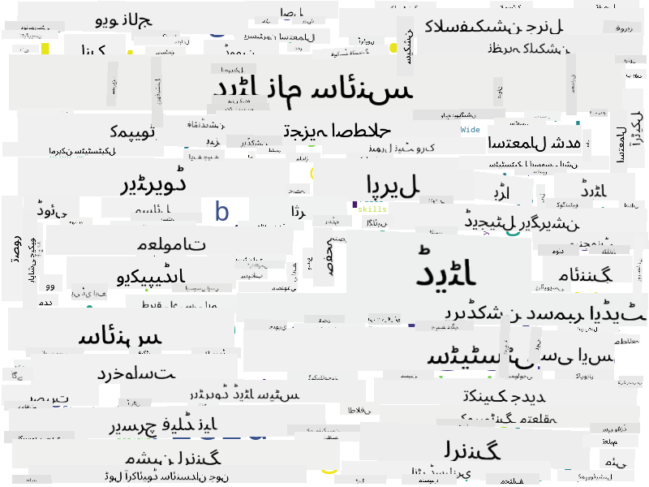

<!--
CO_OP_TRANSLATOR_METADATA:
{
  "original_hash": "8141e7195841682914be03ef930fe43d",
  "translation_date": "2025-09-03T20:01:58+00:00",
  "source_file": "1-Introduction/01-defining-data-science/README.md",
  "language_code": "ur"
}
-->
## ڈیٹا کی اقسام

جیسا کہ ہم پہلے ذکر کر چکے ہیں، ڈیٹا ہر جگہ موجود ہے۔ ہمیں صرف اسے صحیح طریقے سے حاصل کرنے کی ضرورت ہے! یہ مفید ہے کہ ہم **منظم** اور **غیر منظم** ڈیٹا کے درمیان فرق کریں۔ منظم ڈیٹا عام طور پر کسی اچھی طرح سے ترتیب دی گئی شکل میں پیش کیا جاتا ہے، اکثر ایک ٹیبل یا کئی ٹیبلز کی صورت میں، جبکہ غیر منظم ڈیٹا صرف فائلوں کا مجموعہ ہوتا ہے۔ کبھی کبھار ہم **نیم منظم** ڈیٹا کے بارے میں بھی بات کر سکتے ہیں، جس میں کچھ حد تک ساخت ہوتی ہے جو بہت مختلف ہو سکتی ہے۔

| منظم ڈیٹا                                                                   | نیم منظم ڈیٹا                                                                                  | غیر منظم ڈیٹا                            |
| ---------------------------------------------------------------------------- | ---------------------------------------------------------------------------------------------- | --------------------------------------- |
| لوگوں کی فہرست ان کے فون نمبرز کے ساتھ                                       | ویکیپیڈیا صفحات لنکس کے ساتھ                                                                    | انسائیکلوپیڈیا برٹانیکا کا متن          |
| ایک عمارت کے تمام کمروں میں ہر منٹ کے درجہ حرارت کے 20 سالوں کے ڈیٹا          | سائنسی مقالوں کا مجموعہ JSON فارمیٹ میں، مصنفین، اشاعت کی تاریخ، اور خلاصہ کے ساتھ              | نگرانی کیمرے سے خام ویڈیو فیڈ            |
| عمارت میں داخل ہونے والے تمام لوگوں کی عمر اور جنس کا ڈیٹا                   | انٹرنیٹ صفحات                                                                                  | کارپوریٹ دستاویزات کے ساتھ فائل شیئر     |

## ڈیٹا کہاں سے حاصل کریں

ڈیٹا کے بہت سے ممکنہ ذرائع ہیں، اور ان سب کو فہرست میں شامل کرنا ناممکن ہوگا! تاہم، آئیے کچھ عام جگہوں کا ذکر کرتے ہیں جہاں سے آپ ڈیٹا حاصل کر سکتے ہیں:

* **منظم ڈیٹا**
  - **انٹرنیٹ آف تھنگز** (IoT)، بشمول مختلف سینسرز جیسے درجہ حرارت یا دباؤ سینسرز، بہت سا مفید ڈیٹا فراہم کرتے ہیں۔ مثال کے طور پر، اگر ایک دفتر کی عمارت IoT سینسرز سے لیس ہو، تو ہم خودکار طور پر حرارت اور روشنی کو کنٹرول کر سکتے ہیں تاکہ اخراجات کو کم کیا جا سکے۔
  - **سروے** جو ہم صارفین سے خریداری کے بعد یا ویب سائٹ کے دورے کے بعد مکمل کرنے کو کہتے ہیں۔
  - **رویے کا تجزیہ**، جو ہمیں یہ سمجھنے میں مدد دے سکتا ہے کہ صارف ویب سائٹ پر کتنی گہرائی تک جاتا ہے اور عام طور پر ویب سائٹ چھوڑنے کی وجہ کیا ہوتی ہے۔
* **غیر منظم ڈیٹا**
  - **متن**، جو بصیرت کا ایک بھرپور ذریعہ ہو سکتا ہے، جیسے مجموعی **جذباتی سکور** یا کلیدی الفاظ اور معنوی معنی نکالنا۔
  - **تصاویر** یا **ویڈیوز**۔ نگرانی کیمرے سے ویڈیو سڑک پر ٹریفک کا اندازہ لگانے کے لیے استعمال کی جا سکتی ہے اور لوگوں کو ممکنہ ٹریفک جام کے بارے میں مطلع کر سکتی ہے۔
  - ویب سرور **لاگز**، جو ہمیں یہ سمجھنے میں مدد دے سکتے ہیں کہ ہماری ویب سائٹ کے کون سے صفحات سب سے زیادہ دیکھے جاتے ہیں اور کتنی دیر تک۔
* **نیم منظم ڈیٹا**
  - **سوشل نیٹ ورک** گراف، جو صارفین کی شخصیات اور معلومات پھیلانے میں ممکنہ تاثیر کے بارے میں ڈیٹا کا ایک بہترین ذریعہ ہو سکتے ہیں۔
  - جب ہمارے پاس پارٹی کی تصاویر کا ایک مجموعہ ہو، تو ہم **گروپ ڈائنامکس** ڈیٹا نکالنے کی کوشش کر سکتے ہیں، لوگوں کے گراف بنا کر جو ایک دوسرے کے ساتھ تصاویر لے رہے ہیں۔

مختلف ممکنہ ڈیٹا ذرائع کو جان کر، آپ مختلف منظرناموں کے بارے میں سوچ سکتے ہیں جہاں ڈیٹا سائنس کی تکنیکوں کو بہتر طور پر صورتحال کو سمجھنے اور کاروباری عمل کو بہتر بنانے کے لیے لاگو کیا جا سکتا ہے۔

## ڈیٹا کے ساتھ کیا کیا جا سکتا ہے

ڈیٹا سائنس میں، ہم ڈیٹا کے سفر کے درج ذیل مراحل پر توجہ دیتے ہیں:

## ڈیجیٹلائزیشن اور ڈیجیٹل ٹرانسفارمیشن

پچھلی دہائی میں، بہت سے کاروباروں نے یہ سمجھنا شروع کیا کہ کاروباری فیصلے کرتے وقت ڈیٹا کی اہمیت کتنی زیادہ ہے۔ ڈیٹا سائنس کے اصولوں کو کاروبار چلانے پر لاگو کرنے کے لیے، سب سے پہلے کچھ ڈیٹا جمع کرنا ضروری ہے، یعنی کاروباری عمل کو ڈیجیٹل شکل میں تبدیل کرنا۔ اسے **ڈیجیٹلائزیشن** کہا جاتا ہے۔ اس ڈیٹا پر ڈیٹا سائنس کی تکنیکوں کو لاگو کرنا اور فیصلوں کی رہنمائی کرنا پیداواریت میں نمایاں اضافہ (یا یہاں تک کہ کاروباری تبدیلی) کا باعث بن سکتا ہے، جسے **ڈیجیٹل ٹرانسفارمیشن** کہا جاتا ہے۔

آئیے ایک مثال پر غور کریں۔ فرض کریں کہ ہمارے پاس ایک ڈیٹا سائنس کورس ہے (جیسے یہ کورس) جو ہم طلباء کو آن لائن فراہم کرتے ہیں، اور ہم اسے بہتر بنانے کے لیے ڈیٹا سائنس کا استعمال کرنا چاہتے ہیں۔ ہم اسے کیسے کر سکتے ہیں؟

ہم یہ سوال پوچھ کر شروع کر سکتے ہیں کہ "کیا ڈیجیٹلائز کیا جا سکتا ہے؟" سب سے آسان طریقہ یہ ہوگا کہ ہر طالب علم کو ہر ماڈیول مکمل کرنے میں لگنے والے وقت کو ماپیں، اور ہر ماڈیول کے آخر میں ایک کثیر انتخابی ٹیسٹ دے کر حاصل کردہ علم کو ماپیں۔ تمام طلباء کے درمیان مکمل کرنے کے وقت کا اوسط لے کر، ہم یہ معلوم کر سکتے ہیں کہ کون سے ماڈیولز طلباء کے لیے سب سے زیادہ مشکلات پیدا کرتے ہیں، اور ان کو آسان بنانے پر کام کر سکتے ہیں۔
آپ یہ دلیل دے سکتے ہیں کہ یہ طریقہ مثالی نہیں ہے، کیونکہ ماڈیولز مختلف لمبائی کے ہو سکتے ہیں۔ شاید زیادہ مناسب یہ ہوگا کہ وقت کو ماڈیول کی لمبائی (حروف کی تعداد میں) کے حساب سے تقسیم کیا جائے، اور ان اقدار کا موازنہ کیا جائے۔
جب ہم کثیر انتخابی ٹیسٹ کے نتائج کا تجزیہ شروع کرتے ہیں، تو ہم یہ جاننے کی کوشش کر سکتے ہیں کہ کون سے تصورات طلباء کے لیے سمجھنا مشکل ہیں، اور اس معلومات کو مواد کو بہتر بنانے کے لیے استعمال کر سکتے ہیں۔ ایسا کرنے کے لیے، ہمیں ٹیسٹ اس طرح ڈیزائن کرنے کی ضرورت ہے کہ ہر سوال کسی خاص تصور یا علم کے حصے سے منسلک ہو۔

اگر ہم مزید پیچیدگی میں جانا چاہیں، تو ہم ہر ماڈیول کے لیے لگنے والے وقت کو طلباء کی عمر کے زمرے کے ساتھ موازنہ کر سکتے ہیں۔ ہمیں معلوم ہو سکتا ہے کہ کچھ عمر کے زمرے کے لیے ماڈیول مکمل کرنے میں غیر مناسب طور پر زیادہ وقت لگتا ہے، یا طلباء اسے مکمل کرنے سے پہلے ہی چھوڑ دیتے ہیں۔ یہ ہمیں ماڈیول کے لیے عمر کی سفارشات فراہم کرنے میں مدد دے سکتا ہے، اور غلط توقعات کی وجہ سے لوگوں کی ناخوشی کو کم کر سکتا ہے۔

## 🚀 چیلنج

اس چیلنج میں، ہم ڈیٹا سائنس کے میدان سے متعلق تصورات تلاش کرنے کی کوشش کریں گے، متن کو دیکھ کر۔ ہم ڈیٹا سائنس پر ایک ویکیپیڈیا مضمون لیں گے، متن کو ڈاؤنلوڈ اور پراسیس کریں گے، اور پھر ایک ورڈ کلاؤڈ بنائیں گے، جیسا کہ یہ:

[`notebook.ipynb`](../../../../../../../../../1-Introduction/01-defining-data-science/notebook.ipynb ':ignore') پر جائیں تاکہ کوڈ کو پڑھ سکیں۔ آپ کوڈ کو چلا بھی سکتے ہیں، اور دیکھ سکتے ہیں کہ یہ حقیقی وقت میں تمام ڈیٹا تبدیلیاں کیسے انجام دیتا ہے۔

> اگر آپ کو معلوم نہیں کہ جیوپیٹر نوٹ بک میں کوڈ کیسے چلایا جائے، تو [اس مضمون](https://soshnikov.com/education/how-to-execute-notebooks-from-github/) کو دیکھیں۔

## [لیکچر کے بعد کا کوئز](https://ff-quizzes.netlify.app/en/ds/)

## اسائنمنٹس

* **ٹاسک 1**: اوپر دیے گئے کوڈ میں ترمیم کریں تاکہ **بگ ڈیٹا** اور **مشین لرننگ** کے میدانوں کے لیے متعلقہ تصورات معلوم کیے جا سکیں۔
* **ٹاسک 2**: [ڈیٹا سائنس کے منظرناموں پر غور کریں](assignment.md)

## کریڈٹس

یہ سبق ♥️ کے ساتھ [دمتری سوشنیکوف](http://soshnikov.com) نے لکھا ہے۔

---

**ڈسکلیمر**:  
یہ دستاویز AI ترجمہ سروس [Co-op Translator](https://github.com/Azure/co-op-translator) کا استعمال کرتے ہوئے ترجمہ کی گئی ہے۔ ہم درستگی کے لیے کوشش کرتے ہیں، لیکن براہ کرم آگاہ رہیں کہ خودکار ترجمے میں غلطیاں یا غیر درستیاں ہو سکتی ہیں۔ اصل دستاویز کو اس کی اصل زبان میں مستند ذریعہ سمجھا جانا چاہیے۔ اہم معلومات کے لیے، پیشہ ور انسانی ترجمہ کی سفارش کی جاتی ہے۔ ہم اس ترجمے کے استعمال سے پیدا ہونے والی کسی بھی غلط فہمی یا غلط تشریح کے ذمہ دار نہیں ہیں۔