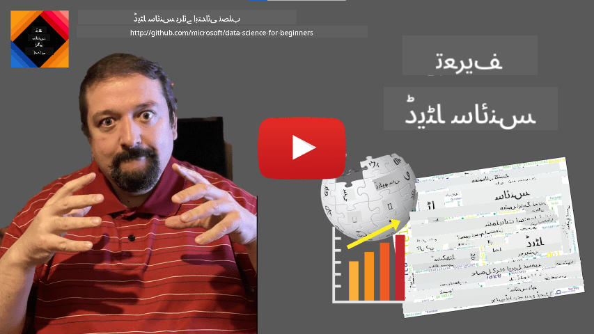

<!--
CO_OP_TRANSLATOR_METADATA:
{
  "original_hash": "43212cc1ac137b7bb1dcfb37ca06b0f4",
  "translation_date": "2025-10-25T18:37:45+00:00",
  "source_file": "1-Introduction/01-defining-data-science/README.md",
  "language_code": "ur"
}
-->
# ڈیٹا سائنس کی تعریف

|  کی طرف سے اسکیچ نوٹ ](../../sketchnotes/01-Definitions.png) |
| :----------------------------------------------------------------------------------------------------: |
|              ڈیٹا سائنس کی تعریف - _[@nitya](https://twitter.com/nitya) کی طرف سے اسکیچ نوٹ_               |

---

## [لیکچر سے پہلے کا کوئز](https://ff-quizzes.netlify.app/en/ds/quiz/0)

## ڈیٹا کیا ہے؟
ہماری روزمرہ زندگی میں، ہم ہر وقت ڈیٹا سے گھرے رہتے ہیں۔ جو متن آپ ابھی پڑھ رہے ہیں وہ بھی ڈیٹا ہے۔ آپ کے اسمارٹ فون میں آپ کے دوستوں کے فون نمبرز کی فہرست بھی ڈیٹا ہے، اور آپ کی گھڑی پر دکھایا گیا موجودہ وقت بھی ڈیٹا ہے۔ انسان ہونے کے ناطے، ہم قدرتی طور پر ڈیٹا کے ساتھ کام کرتے ہیں، جیسے کہ اپنے پاس موجود پیسے گننا یا اپنے دوستوں کو خط لکھنا۔

تاہم، کمپیوٹرز کی تخلیق کے ساتھ، ڈیٹا بہت زیادہ اہمیت اختیار کر گیا۔ کمپیوٹرز کا بنیادی کام حساب کتاب کرنا ہے، لیکن انہیں کام کرنے کے لیے ڈیٹا کی ضرورت ہوتی ہے۔ لہذا، ہمیں یہ سمجھنے کی ضرورت ہے کہ کمپیوٹرز ڈیٹا کو کیسے ذخیرہ کرتے ہیں اور اس پر کیسے عمل کرتے ہیں۔

انٹرنیٹ کے ظہور کے ساتھ، ڈیٹا کو سنبھالنے والے آلات کے طور پر کمپیوٹرز کا کردار بڑھ گیا۔ اگر آپ غور کریں، تو ہم اب کمپیوٹرز کو زیادہ تر ڈیٹا پروسیسنگ اور مواصلات کے لیے استعمال کرتے ہیں، بجائے اس کے کہ اصل حساب کتاب کے لیے۔ جب ہم اپنے دوست کو ای میل لکھتے ہیں یا انٹرنیٹ پر کچھ معلومات تلاش کرتے ہیں - تو ہم بنیادی طور پر ڈیٹا تخلیق، ذخیرہ، منتقل اور اس میں تبدیلی کر رہے ہوتے ہیں۔
> کیا آپ کو یاد ہے کہ آپ نے آخری بار کمپیوٹرز کو واقعی کچھ حساب کتاب کرنے کے لیے استعمال کیا تھا؟

## ڈیٹا سائنس کیا ہے؟

[ویکیپیڈیا](https://en.wikipedia.org/wiki/Data_science) کے مطابق، **ڈیٹا سائنس** کو *ایک سائنسی میدان کے طور پر بیان کیا گیا ہے جو سائنسی طریقوں کا استعمال کرتے ہوئے ساختی اور غیر ساختی ڈیٹا سے علم اور بصیرت نکالتا ہے، اور ڈیٹا سے حاصل کردہ علم اور قابل عمل بصیرت کو مختلف اطلاقی شعبوں میں استعمال کرتا ہے*۔

یہ تعریف ڈیٹا سائنس کے درج ذیل اہم پہلوؤں کو اجاگر کرتی ہے:

* ڈیٹا سائنس کا بنیادی مقصد ڈیٹا سے **علم نکالنا** ہے، دوسرے الفاظ میں - ڈیٹا کو **سمجھنا**، کچھ پوشیدہ تعلقات تلاش کرنا اور ایک **ماڈل** بنانا۔
* ڈیٹا سائنس **سائنسی طریقے** استعمال کرتی ہے، جیسے کہ احتمال اور شماریات۔ درحقیقت، جب پہلی بار *ڈیٹا سائنس* کی اصطلاح متعارف کرائی گئی، تو کچھ لوگوں نے دلیل دی کہ ڈیٹا سائنس صرف شماریات کے لیے ایک نیا فینسی نام ہے۔ آج کل یہ واضح ہو چکا ہے کہ یہ میدان بہت وسیع ہے۔
* حاصل کردہ علم کو کچھ **قابل عمل بصیرت** پیدا کرنے کے لیے استعمال کیا جانا چاہیے، یعنی عملی بصیرت جو آپ حقیقی کاروباری حالات میں لاگو کر سکتے ہیں۔
* ہمیں **ساختی** اور **غیر ساختی** دونوں ڈیٹا پر کام کرنے کے قابل ہونا چاہیے۔ ہم کورس کے دوران ڈیٹا کی مختلف اقسام پر مزید بات کریں گے۔
* **اطلاقی شعبہ** ایک اہم تصور ہے، اور ڈیٹا سائنسدانوں کو اکثر مسئلے کے شعبے میں کم از کم کچھ حد تک مہارت کی ضرورت ہوتی ہے، جیسے کہ مالیات، طب، مارکیٹنگ وغیرہ۔

> ڈیٹا سائنس کا ایک اور اہم پہلو یہ ہے کہ یہ مطالعہ کرتی ہے کہ ڈیٹا کو کمپیوٹرز کے ذریعے کیسے جمع، ذخیرہ اور اس پر عمل کیا جا سکتا ہے۔ جبکہ شماریات ہمیں ریاضیاتی بنیادیں فراہم کرتی ہیں، ڈیٹا سائنس ریاضیاتی تصورات کو ڈیٹا سے بصیرت حاصل کرنے کے لیے عملی طور پر لاگو کرتی ہے۔

ڈیٹا سائنس کو دیکھنے کے ایک طریقے (جو [جم گرے](https://en.wikipedia.org/wiki/Jim_Gray_(computer_scientist)) سے منسوب ہے) یہ ہے کہ اسے سائنس کا ایک الگ نمونہ سمجھا جائے:
* **تجربی**، جس میں ہم زیادہ تر مشاہدات اور تجربات کے نتائج پر انحصار کرتے ہیں
* **نظریاتی**، جہاں نئے تصورات موجودہ سائنسی علم سے ابھرتے ہیں
* **کمپیوٹیشنل**، جہاں ہم کچھ کمپیوٹیشنل تجربات کی بنیاد پر نئے اصول دریافت کرتے ہیں
* **ڈیٹا پر مبنی**، جو ڈیٹا میں تعلقات اور نمونوں کو دریافت کرنے پر مبنی ہے  

## دیگر متعلقہ شعبے

چونکہ ڈیٹا ہر جگہ موجود ہے، ڈیٹا سائنس خود بھی ایک وسیع میدان ہے، جو بہت سے دیگر شعبوں کو چھوتا ہے۔

<dl>
<dt>ڈیٹا بیسز</dt>
<dd>
ایک اہم غور <b>ڈیٹا کو ذخیرہ کرنے کا طریقہ</b> ہے، یعنی اسے اس طرح سے ترتیب دینا جو تیز تر پروسیسنگ کی اجازت دے۔ مختلف قسم کے ڈیٹا بیس ہیں جو ساختی اور غیر ساختی ڈیٹا کو ذخیرہ کرتے ہیں، جن پر <a href="../../2-Working-With-Data/README.md">ہم اپنے کورس میں غور کریں گے</a>۔
</dd>
<dt>بگ ڈیٹا</dt>
<dd>
اکثر ہمیں بہت بڑی مقدار میں ڈیٹا کو ذخیرہ اور پروسیس کرنے کی ضرورت ہوتی ہے جس کی ساخت نسبتاً سادہ ہوتی ہے۔ ایسے ڈیٹا کو کمپیوٹر کلسٹر پر تقسیم شدہ طریقے سے ذخیرہ کرنے اور مؤثر طریقے سے پروسیس کرنے کے لیے خاص طریقے اور آلات موجود ہیں۔
</dd>
<dt>مشین لرننگ</dt>
<dd>
ڈیٹا کو سمجھنے کا ایک طریقہ یہ ہے کہ ایک <b>ماڈل بنائیں</b> جو مطلوبہ نتیجہ کی پیش گوئی کر سکے۔ ڈیٹا سے ماڈلز تیار کرنے کو <b>مشین لرننگ</b> کہا جاتا ہے۔ آپ ہمارے <a href="https://aka.ms/ml-beginners">مشین لرننگ فار بیگنرز</a> نصاب کو دیکھ سکتے ہیں تاکہ اس کے بارے میں مزید جان سکیں۔
</dd>
<dt>مصنوعی ذہانت</dt>
<dd>
مشین لرننگ کا ایک شعبہ جسے مصنوعی ذہانت (AI) کہا جاتا ہے، بھی ڈیٹا پر انحصار کرتا ہے، اور اس میں انسانی سوچ کے عمل کی نقل کرنے والے اعلیٰ پیچیدگی کے ماڈلز بنانا شامل ہے۔ AI کے طریقے اکثر ہمیں غیر ساختی ڈیٹا (جیسے قدرتی زبان) کو ساختی بصیرت میں تبدیل کرنے کی اجازت دیتے ہیں۔
</dd>
<dt>تصویری پیشکش</dt>
<dd>
بہت زیادہ ڈیٹا انسان کے لیے ناقابل فہم ہوتا ہے، لیکن جب ہم اس ڈیٹا کا استعمال کرتے ہوئے مفید تصویری پیشکشیں بناتے ہیں، تو ہم ڈیٹا کو زیادہ بہتر سمجھ سکتے ہیں اور کچھ نتائج اخذ کر سکتے ہیں۔ لہذا، معلومات کو پیش کرنے کے بہت سے طریقے جاننا ضروری ہے - کچھ ایسا جو ہم اپنے کورس کے <a href="../../3-Data-Visualization/README.md">سیکشن 3</a> میں شامل کریں گے۔ متعلقہ شعبوں میں <b>انفوگرافکس</b> اور عمومی طور پر <b>انسان-کمپیوٹر تعامل</b> شامل ہیں۔
</dd>
</dl>

## ڈیٹا کی اقسام

جیسا کہ ہم پہلے ہی ذکر کر چکے ہیں، ڈیٹا ہر جگہ موجود ہے۔ ہمیں صرف اسے صحیح طریقے سے حاصل کرنے کی ضرورت ہے! **ساختی** اور **غیر ساختی** ڈیٹا کے درمیان فرق کرنا مفید ہے۔ پہلا عام طور پر کسی اچھی طرح سے ساختی شکل میں پیش کیا جاتا ہے، اکثر ایک جدول یا کئی جدولوں کے طور پر، جبکہ دوسرا صرف فائلوں کا ایک مجموعہ ہوتا ہے۔ کبھی کبھار ہم **نیم ساختی** ڈیٹا کے بارے میں بھی بات کر سکتے ہیں، جس میں کسی قسم کی ساخت ہوتی ہے جو بہت مختلف ہو سکتی ہے۔

| ساختی                                                                   | نیم ساختی                                                                                | غیر ساختی                            |
| ---------------------------------------------------------------------------- | ---------------------------------------------------------------------------------------------- | --------------------------------------- |
| لوگوں کی فہرست ان کے فون نمبرز کے ساتھ                                      | ویکیپیڈیا کے صفحات لنکس کے ساتھ                                                                     | انسائیکلوپیڈیا بریٹانیکا کا متن        |
| ایک عمارت کے تمام کمروں میں ہر منٹ کے درجہ حرارت کے 20 سال کے ڈیٹا | سائنسی مقالوں کا مجموعہ JSON فارمیٹ میں مصنفین، اشاعت کی تاریخ، اور خلاصہ کے ساتھ | کارپوریٹ دستاویزات کے ساتھ فائل شیئر     |
| عمارت میں داخل ہونے والے تمام لوگوں کی عمر اور جنس کا ڈیٹا                  | انٹرنیٹ کے صفحات                                                                                 | نگرانی کیمرے سے خام ویڈیو فیڈ |

## ڈیٹا کہاں سے حاصل کریں

ڈیٹا کے بہت سے ممکنہ ذرائع ہیں، اور ان سب کو فہرست میں شامل کرنا ناممکن ہوگا! تاہم، آئیے کچھ عام جگہوں کا ذکر کرتے ہیں جہاں سے آپ ڈیٹا حاصل کر سکتے ہیں:

* **ساختی**
  - **انٹرنیٹ آف تھنگز** (IoT)، بشمول مختلف سینسرز سے ڈیٹا، جیسے کہ درجہ حرارت یا دباؤ کے سینسرز، بہت مفید ڈیٹا فراہم کرتے ہیں۔ مثال کے طور پر، اگر ایک دفتر کی عمارت IoT سینسرز سے لیس ہو، تو ہم خودکار طور پر حرارت اور روشنی کو کنٹرول کر سکتے ہیں تاکہ اخراجات کو کم کیا جا سکے۔
  - **سروے** جو ہم صارفین سے خریداری کے بعد یا ویب سائٹ کے دورے کے بعد مکمل کرنے کے لیے کہتے ہیں۔
  - **رویے کا تجزیہ**، مثال کے طور پر، ہمیں یہ سمجھنے میں مدد دے سکتا ہے کہ ایک صارف ویب سائٹ پر کتنی گہرائی میں جاتا ہے، اور ویب سائٹ چھوڑنے کی عام وجہ کیا ہے۔
* **غیر ساختی**
  - **متن** بصیرت کا ایک بھرپور ذریعہ ہو سکتا ہے، جیسے کہ مجموعی **جذباتی اسکور**، یا کلیدی الفاظ اور معنوی معنی نکالنا۔
  - **تصاویر** یا **ویڈیو**۔ نگرانی کیمرے سے ویڈیو سڑک پر ٹریفک کا اندازہ لگانے کے لیے استعمال کی جا سکتی ہے، اور لوگوں کو ممکنہ ٹریفک جام کے بارے میں آگاہ کر سکتی ہے۔
  - ویب سرور **لاگز** کا استعمال یہ سمجھنے کے لیے کیا جا سکتا ہے کہ ہماری ویب سائٹ کے کون سے صفحات سب سے زیادہ دیکھے جاتے ہیں، اور کتنی دیر تک۔
* نیم ساختی
  - **سوشل نیٹ ورک** گراف صارفین کی شخصیات اور معلومات پھیلانے میں ممکنہ مؤثریت کے بارے میں ڈیٹا کے بہترین ذرائع ہو سکتے ہیں۔
  - جب ہمارے پاس پارٹی کی تصاویر کا ایک مجموعہ ہو، تو ہم لوگوں کے ایک دوسرے کے ساتھ تصاویر لینے کے گراف بنا کر **گروپ ڈائنامکس** ڈیٹا نکالنے کی کوشش کر سکتے ہیں۔

مختلف ممکنہ ڈیٹا ذرائع کو جان کر، آپ مختلف منظرناموں کے بارے میں سوچ سکتے ہیں جہاں ڈیٹا سائنس کی تکنیکوں کو بہتر طور پر سمجھنے اور کاروباری عمل کو بہتر بنانے کے لیے لاگو کیا جا سکتا ہے۔

## ڈیٹا کے ساتھ کیا کیا جا سکتا ہے

ڈیٹا سائنس میں، ہم ڈیٹا کے سفر کے درج ذیل مراحل پر توجہ مرکوز کرتے ہیں:

<dl>
<dt>1) ڈیٹا حاصل کرنا</dt>
<dd>
پہلا مرحلہ ڈیٹا جمع کرنا ہے۔ اگرچہ بہت سے معاملات میں یہ ایک سیدھا عمل ہو سکتا ہے، جیسے کہ ویب ایپلیکیشن سے ڈیٹا کا ڈیٹا بیس میں آنا، کبھی کبھار ہمیں خاص تکنیکوں کا استعمال کرنا پڑتا ہے۔ مثال کے طور پر، IoT سینسرز سے ڈیٹا بہت زیادہ ہو سکتا ہے، اور یہ ایک اچھا عمل ہے کہ تمام ڈیٹا کو مزید پروسیسنگ سے پہلے IoT Hub جیسے بفرنگ اینڈ پوائنٹس کا استعمال کرتے ہوئے جمع کیا جائے۔
</dd>
<dt>2) ڈیٹا ذخیرہ کرنا</dt>
<dd>
ڈیٹا کو ذخیرہ کرنا چیلنجنگ ہو سکتا ہے، خاص طور پر اگر ہم بگ ڈیٹا کے بارے میں بات کر رہے ہوں۔ جب یہ فیصلہ کیا جائے کہ ڈیٹا کو کیسے ذخیرہ کیا جائے، تو یہ سمجھنا ضروری ہے کہ آپ مستقبل میں ڈیٹا کو کس طرح استفسار کرنا چاہتے ہیں۔ ڈیٹا کو ذخیرہ کرنے کے کئی طریقے ہیں:
<ul>
<li>ایک ریلیشنل ڈیٹا بیس ٹیبلز کا مجموعہ ذخیرہ کرتا ہے، اور ان سے استفسار کرنے کے لیے ایک خاص زبان SQL استعمال کرتا ہے۔ عام طور پر، ٹیبلز کو مختلف گروپس میں منظم کیا جاتا ہے جنہیں اسکیمز کہا جاتا ہے۔ بہت سے معاملات میں ہمیں ڈیٹا کو اصل شکل سے اسکیم میں فٹ کرنے کے لیے تبدیل کرنا پڑتا ہے۔</li>
<li><a href="https://en.wikipedia.org/wiki/NoSQL">ایک NoSQL</a> ڈیٹا بیس، جیسے <a href="https://azure.microsoft.com/services/cosmos-db/?WT.mc_id=academic-77958-bethanycheum">CosmosDB</a>, ڈیٹا پر اسکیمز نافذ نہیں کرتا، اور زیادہ پیچیدہ ڈیٹا ذخیرہ کرنے کی اجازت دیتا ہے، مثال کے طور پر، ہائیرارکل JSON دستاویزات یا گراف۔ تاہم، NoSQL ڈیٹا بیسز میں SQL کی بھرپور استفسار کی صلاحیتیں نہیں ہوتیں، اور حوالہ جاتی سالمیت کو نافذ نہیں کر سکتے، یعنی ٹیبلز میں ڈیٹا کی ساخت اور ٹیبلز کے درمیان تعلقات کو منظم کرنے کے قواعد۔</li>
<li><a href="https://en.wikipedia.org/wiki/Data_lake">ڈیٹا لیک</a> اسٹوریج خام، غیر ساختی شکل میں ڈیٹا کے بڑے مجموعوں کے لیے استعمال کیا جاتا ہے۔ ڈیٹا لیکس اکثر بگ ڈیٹا کے ساتھ استعمال ہوتے ہیں، جہاں تمام ڈیٹا ایک مشین میں فٹ نہیں ہو سکتا، اور اسے سرورز کے کلسٹر کے ذریعے ذخیرہ اور پروسیس کرنا پڑتا ہے۔ <a href="https://en.wikipedia.org/wiki/Apache_Parquet">پارکیٹ</a> وہ ڈیٹا فارمیٹ ہے جو اکثر بگ ڈیٹا کے ساتھ استعمال ہوتا ہے۔</li> 
</ul>
</dd>
<dt>3) ڈیٹا پروسیسنگ</dt>
<dd>
یہ ڈیٹا کے سفر کا سب سے دلچسپ حصہ ہے، جس میں ڈیٹا کو اس کی اصل شکل سے ایسی شکل میں تبدیل کرنا شامل ہے جو تصویری پیشکش/ماڈل کی تربیت کے لیے استعمال کی جا سکے۔ جب غیر ساختی ڈیٹا جیسے کہ متن یا تصاویر کے ساتھ کام کرتے ہیں، تو ہمیں ڈیٹا سے <b>خصوصیات</b> نکالنے کے لیے کچھ AI تکنیکوں کا استعمال کرنا پڑ سکتا ہے، اس طرح اسے ساختی شکل میں تبدیل کیا جا سکتا ہے۔
</dd>
<dt>4) تصویری پیشکش / انسانی بصیرت</dt>
<dd>
اکثر، ڈیٹا کو سمجھنے کے لیے، ہمیں اسے تصویری شکل میں پیش کرنے کی ضرورت ہوتی ہے۔ ہمارے ٹول باکس میں مختلف تصویری پیشکش کی تکنیکوں کے ساتھ، ہم صحیح منظر تلاش کر سکتے ہیں تاکہ بصیرت حاصل کی جا سکے۔ اکثر، ایک ڈیٹا سائنسدان کو "ڈیٹا کے ساتھ کھیلنا" پڑتا ہے، اسے کئی بار تصویری شکل میں پیش کرنا پڑتا ہے اور کچھ تعلقات تلاش کرنے پڑتے ہیں۔ نیز، ہم شماریاتی تکنیکوں کا استعمال کر کے کسی مفروضے کی جانچ یا ڈیٹا کے مختلف حصوں کے درمیان تعلق کو ثابت کر سکتے ہیں۔   
</dd>
<dt>5) پیش گوئی کرنے والے ماڈل کی تربیت</dt>
<dd>
چونکہ ڈیٹا سائنس کا حتمی مقصد ڈیٹا کی بنیاد پر فیصلے کرنے کے قابل ہونا ہے، ہم <a href="http://github.com/microsoft/ml-for-beginners">مشین لرننگ</a> کی تکنیکوں کا استعمال کر کے ایک پیش گوئی کرنے والے ماڈل کو بنانا چاہتے ہیں۔ ہم پھر اس ماڈل کو اسی طرح کے ڈھانچے والے نئے ڈیٹا سیٹس کے ساتھ پیش گوئی کرنے کے لیے استعمال کر سکتے ہیں۔
</dd>
</dl>

یقیناً، اصل ڈیٹا کے مطابق، کچھ مراحل غائب ہو سکتے ہیں (مثلاً، جب ہمارے پاس پہلے سے ہی ڈیٹا ڈیٹا بیس میں موجود ہو، یا جب ہمیں ماڈل کی تربیت کی ضرورت نہ ہو)، یا کچھ مراحل کو کئی بار دہرایا جا سکتا ہے (جیسے کہ ڈیٹا پروسیسنگ)۔

## ڈیجیٹلائزیشن اور ڈیجیٹل تبدیلی

پچھلی دہائی میں، بہت سے کاروباروں نے کاروباری فیصلے کرتے وقت ڈیٹا کی اہمیت کو سمجھنا شروع کیا۔ کاروبار چلانے کے لیے ڈیٹا سائنس کے اصولوں کو لاگو کرنے کے لیے، سب سے پہلے کچھ ڈیٹا جمع کرنا ضروری ہے، یعنی کاروباری عمل کو ڈیجیٹل شکل میں تبدیل کرنا۔ اسے **ڈیجیٹلائزیشن** کہا جاتا ہے۔ اس ڈیٹا پر ڈیٹا سائنس کی تکنیکوں کو لاگو کرنا اور فیصلوں کی رہنمائی کرنا پیداواری صلاحیت میں نمایاں اضافہ (یا یہاں تک کہ کاروباری تبدیلی) کا باعث بن سکتا ہے، جسے **ڈیجیٹل تبدیلی** کہا جاتا ہے۔

آئیے ایک مثال پر غور کریں۔ فرض کریں کہ ہمارے پاس ایک ڈیٹا سائنس کورس ہے (جیسے یہ کورس) جو ہم آن لائن طلباء کو فراہم کرتے ہیں، اور ہم اسے بہتر بنانے کے لیے ڈیٹا سائنس کا استعمال کرنا چاہتے ہیں۔ ہم یہ کیسے کر سکتے ہیں؟

ہم یہ سوال پوچھ کر شروع کر سکتے ہیں کہ "کیا ڈیجیٹلائز کیا جا سکتا ہے؟" سب سے آسان طریقہ یہ ہوگا کہ ہر طالب علم کو ہر ماڈیول مکمل کرنے میں لگنے والے وقت کی پیمائش کریں، اور ہر ماڈیول کے آخر میں ایک ملٹیپل چو
> آپ یہ دلیل دے سکتے ہیں کہ یہ طریقہ مثالی نہیں ہے، کیونکہ ماڈیولز کی لمبائی مختلف ہو سکتی ہے۔ شاید زیادہ مناسب ہو کہ وقت کو ماڈیول کی لمبائی (حروف کی تعداد) کے حساب سے تقسیم کیا جائے، اور ان اقدار کا موازنہ کیا جائے۔

جب ہم کثیر انتخابی ٹیسٹ کے نتائج کا تجزیہ شروع کرتے ہیں، تو ہم یہ جاننے کی کوشش کر سکتے ہیں کہ کون سے تصورات طلباء کے لیے سمجھنا مشکل ہیں، اور اس معلومات کو مواد کو بہتر بنانے کے لیے استعمال کر سکتے ہیں۔ ایسا کرنے کے لیے، ہمیں ٹیسٹ اس طرح ڈیزائن کرنے کی ضرورت ہے کہ ہر سوال کسی خاص تصور یا علم کے حصے سے منسلک ہو۔

اگر ہم مزید پیچیدہ ہونا چاہتے ہیں، تو ہم ہر ماڈیول کے لیے لیا گیا وقت طلباء کی عمر کے زمرے کے خلاف پلاٹ کر سکتے ہیں۔ ہمیں معلوم ہو سکتا ہے کہ کچھ عمر کے زمرے کے لیے ماڈیول مکمل کرنے میں غیر مناسب طور پر زیادہ وقت لگتا ہے، یا طلباء اسے مکمل کرنے سے پہلے ہی چھوڑ دیتے ہیں۔ یہ ہمیں ماڈیول کے لیے عمر کی سفارشات فراہم کرنے میں مدد دے سکتا ہے، اور غلط توقعات کی وجہ سے لوگوں کی ناخوشی کو کم کر سکتا ہے۔

## 🚀 چیلنج

اس چیلنج میں، ہم ڈیٹا سائنس کے میدان سے متعلق تصورات کو متن کے ذریعے تلاش کرنے کی کوشش کریں گے۔ ہم ڈیٹا سائنس پر ایک ویکیپیڈیا مضمون لیں گے، متن کو ڈاؤنلوڈ اور پروسیس کریں گے، اور پھر ایک ورڈ کلاؤڈ بنائیں گے جیسا کہ یہ:

کوڈ کو پڑھنے کے لیے [`notebook.ipynb`](../../../../1-Introduction/01-defining-data-science/notebook.ipynb ':ignore') پر جائیں۔ آپ کوڈ کو چلا بھی سکتے ہیں، اور دیکھ سکتے ہیں کہ یہ حقیقی وقت میں تمام ڈیٹا تبدیلیاں کیسے انجام دیتا ہے۔

> اگر آپ کو معلوم نہیں کہ جیوپیٹر نوٹ بک میں کوڈ کیسے چلایا جائے، تو [اس مضمون](https://soshnikov.com/education/how-to-execute-notebooks-from-github/) پر ایک نظر ڈالیں۔

## [لیکچر کے بعد کا کوئز](https://ff-quizzes.netlify.app/en/ds/quiz/1)

## اسائنمنٹس

* **ٹاسک 1**: اوپر دیے گئے کوڈ میں ترمیم کریں تاکہ **بگ ڈیٹا** اور **مشین لرننگ** کے شعبوں کے لیے متعلقہ تصورات معلوم کیے جا سکیں۔
* **ٹاسک 2**: [ڈیٹا سائنس کے منظرناموں پر غور کریں](assignment.md)

## کریڈٹس

یہ سبق [دمیتری سوشنیکوف](http://soshnikov.com) نے ♥️ کے ساتھ تیار کیا ہے۔

---

**ڈسکلیمر**:  
یہ دستاویز AI ترجمہ سروس [Co-op Translator](https://github.com/Azure/co-op-translator) کا استعمال کرتے ہوئے ترجمہ کی گئی ہے۔ ہم درستگی کے لیے کوشش کرتے ہیں، لیکن براہ کرم آگاہ رہیں کہ خودکار ترجمے میں غلطیاں یا غیر درستیاں ہو سکتی ہیں۔ اصل دستاویز کو اس کی اصل زبان میں مستند ذریعہ سمجھا جانا چاہیے۔ اہم معلومات کے لیے، پیشہ ور انسانی ترجمہ کی سفارش کی جاتی ہے۔ ہم اس ترجمے کے استعمال سے پیدا ہونے والی کسی بھی غلط فہمی یا غلط تشریح کے ذمہ دار نہیں ہیں۔