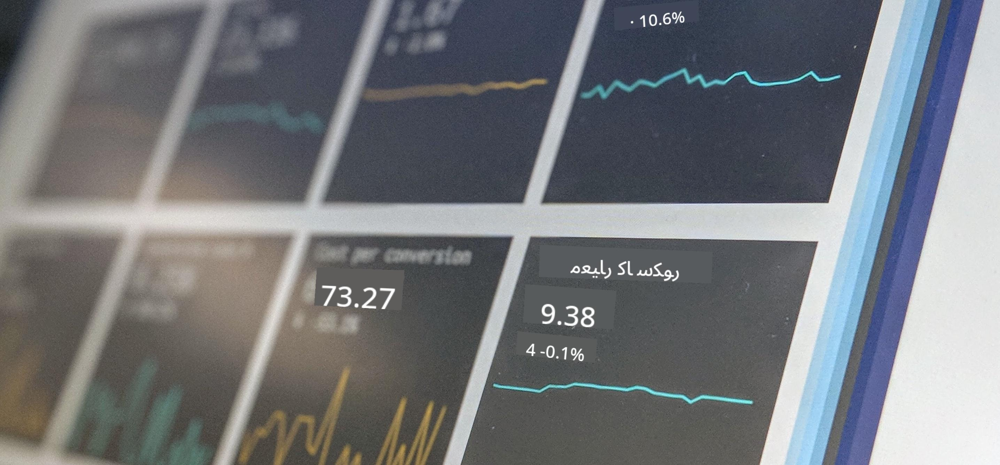

<!--
CO_OP_TRANSLATOR_METADATA:
{
  "original_hash": "696a8474a01054281704cbfb09148949",
  "translation_date": "2025-08-27T08:43:45+00:00",
  "source_file": "1-Introduction/README.md",
  "language_code": "ur"
}
-->
# ڈیٹا سائنس کا تعارف

> تصویر از <a href="https://unsplash.com/@dawson2406?utm_source=unsplash&utm_medium=referral&utm_content=creditCopyText">اسٹیفن ڈاسن</a>، <a href="https://unsplash.com/s/photos/data?utm_source=unsplash&utm_medium=referral&utm_content=creditCopyText">Unsplash</a> پر
  
ان اسباق میں، آپ جانیں گے کہ ڈیٹا سائنس کو کیسے بیان کیا جاتا ہے اور ان اخلاقی پہلوؤں کے بارے میں سیکھیں گے جنہیں ایک ڈیٹا سائنسدان کو مدنظر رکھنا چاہیے۔ آپ یہ بھی سیکھیں گے کہ ڈیٹا کو کیسے بیان کیا جاتا ہے اور شماریات اور احتمال کے بارے میں کچھ جانیں گے، جو کہ ڈیٹا سائنس کے بنیادی تعلیمی شعبے ہیں۔

### موضوعات

1. [ڈیٹا سائنس کی تعریف](01-defining-data-science/README.md)
2. [ڈیٹا سائنس کی اخلاقیات](02-ethics/README.md)
3. [ڈیٹا کی تعریف](03-defining-data/README.md)
4. [شماریات اور احتمال کا تعارف](04-stats-and-probability/README.md)

### کریڈٹس

یہ اسباق ❤️ کے ساتھ [نیتیا نرسمہن](https://twitter.com/nitya) اور [دیمتری سوشنیکوف](https://twitter.com/shwars) نے لکھے ہیں۔

---

**ڈسکلیمر**:  
یہ دستاویز AI ترجمہ سروس [Co-op Translator](https://github.com/Azure/co-op-translator) کا استعمال کرتے ہوئے ترجمہ کی گئی ہے۔ ہم درستگی کے لیے کوشش کرتے ہیں، لیکن براہ کرم آگاہ رہیں کہ خودکار ترجمے میں غلطیاں یا عدم درستگی ہو سکتی ہیں۔ اصل دستاویز، جو اس کی مقامی زبان میں ہے، کو مستند ذریعہ سمجھا جانا چاہیے۔ اہم معلومات کے لیے، پیشہ ور انسانی ترجمہ کی سفارش کی جاتی ہے۔ اس ترجمے کے استعمال سے پیدا ہونے والی کسی بھی غلط فہمی یا غلط تشریح کے لیے ہم ذمہ دار نہیں ہیں۔