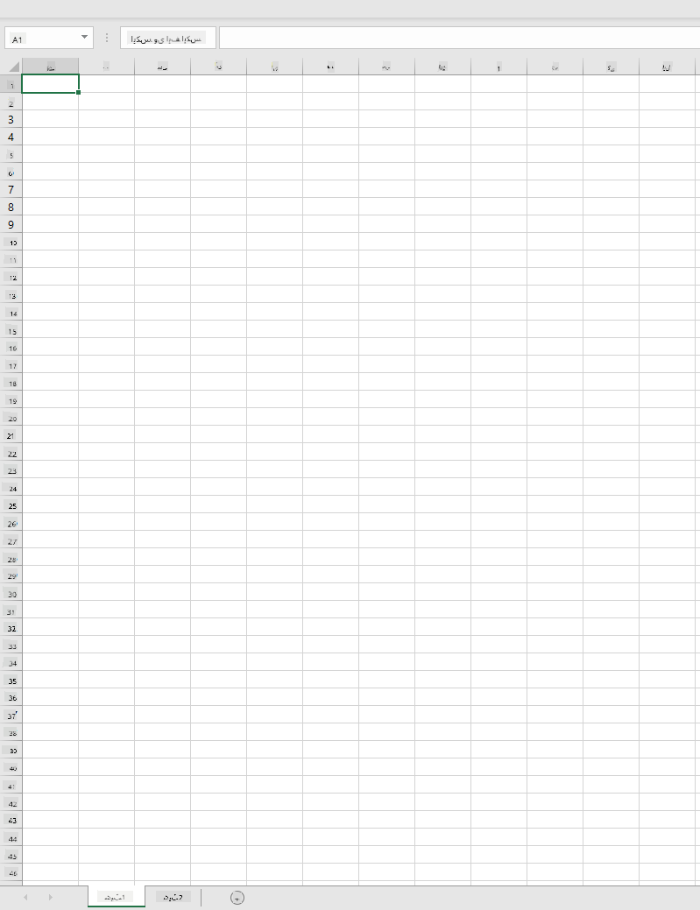
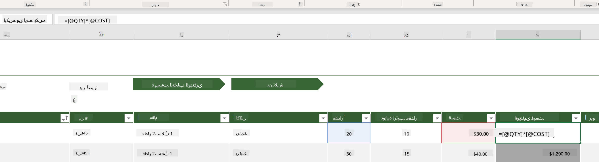
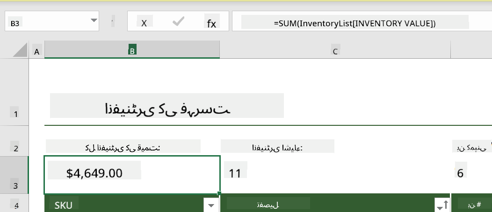
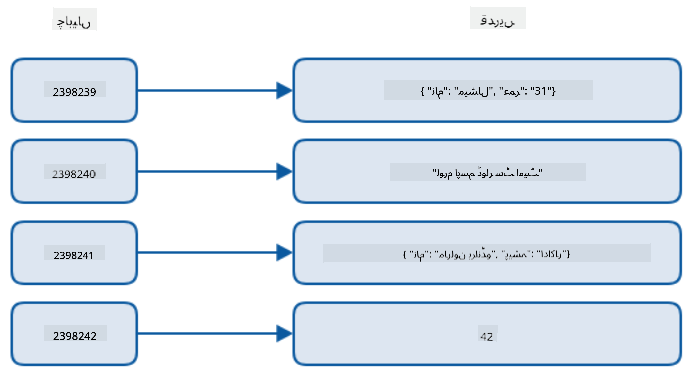
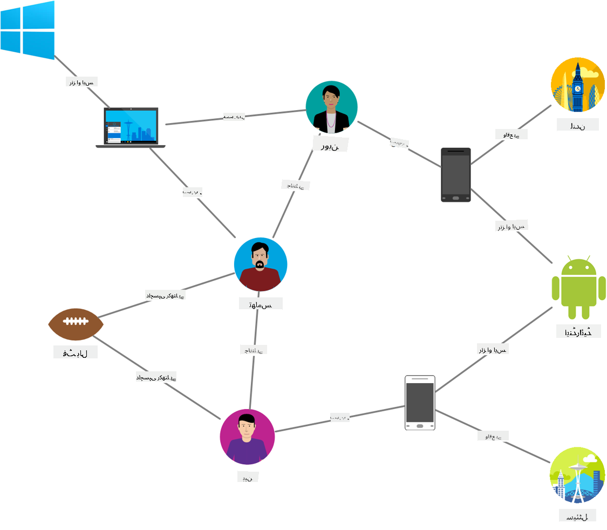
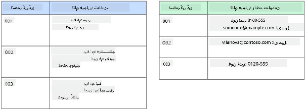
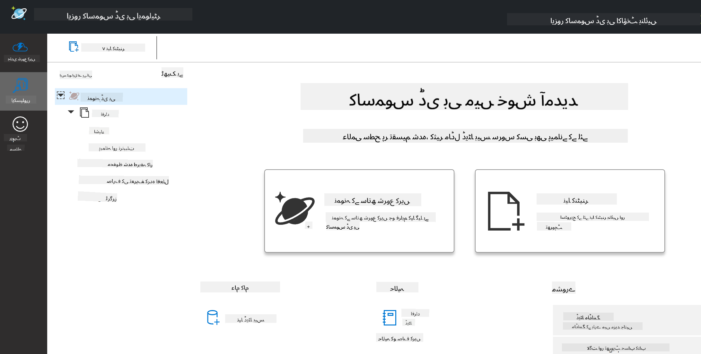
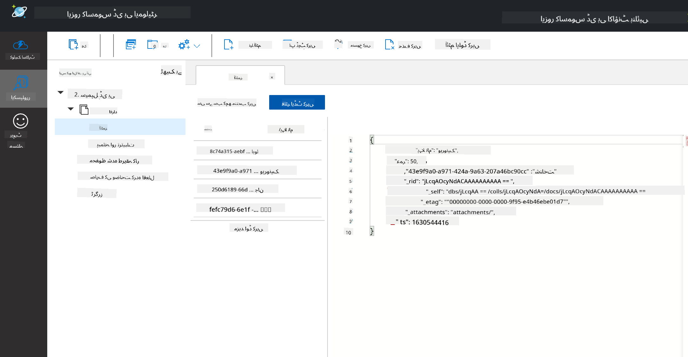
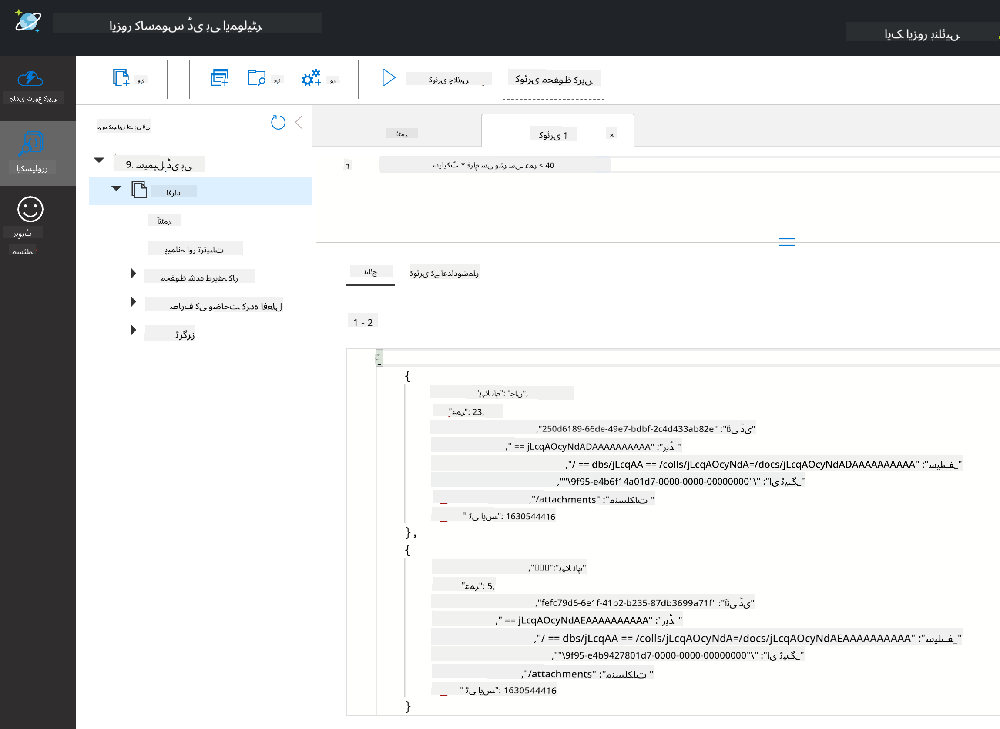

<!--
CO_OP_TRANSLATOR_METADATA:
{
  "original_hash": "32ddfef8121650f2ca2f3416fd283c37",
  "translation_date": "2025-08-27T08:39:00+00:00",
  "source_file": "2-Working-With-Data/06-non-relational/README.md",
  "language_code": "ur"
}
-->
# ڈیٹا کے ساتھ کام کرنا: غیر تعلقاتی ڈیٹا

| کی اسکیچ نوٹ ](../../sketchnotes/06-NoSQL.png)|
|:---:|
|NoSQL ڈیٹا کے ساتھ کام کرنا - _[@nitya](https://twitter.com/nitya) کی اسکیچ نوٹ_ |

## [لیکچر سے پہلے کا کوئز](https://purple-hill-04aebfb03.1.azurestaticapps.net/quiz/10)

ڈیٹا صرف تعلقاتی ڈیٹا بیس تک محدود نہیں ہے۔ یہ سبق غیر تعلقاتی ڈیٹا پر مرکوز ہے اور اسپریڈشیٹس اور NoSQL کی بنیادی باتوں کا احاطہ کرے گا۔

## اسپریڈشیٹس

اسپریڈشیٹس ڈیٹا کو محفوظ کرنے اور اس کا جائزہ لینے کا ایک مقبول طریقہ ہیں کیونکہ اسے ترتیب دینے اور شروع کرنے میں کم محنت درکار ہوتی ہے۔ اس سبق میں آپ اسپریڈشیٹ کے بنیادی اجزاء، فارمولے اور فنکشنز کے بارے میں سیکھیں گے۔ مثالیں مائیکروسافٹ ایکسل کے ساتھ بیان کی جائیں گی، لیکن زیادہ تر حصے اور موضوعات دیگر اسپریڈشیٹ سافٹ ویئر کے ساتھ مشابہ ہوں گے۔



اسپریڈشیٹ ایک فائل ہوتی ہے جو کمپیوٹر، ڈیوائس، یا کلاؤڈ بیسڈ فائل سسٹم میں دستیاب ہوتی ہے۔ سافٹ ویئر خود براؤزر بیسڈ ہو سکتا ہے یا ایک ایپلیکیشن جو کمپیوٹر پر انسٹال کی جاتی ہے یا ایپ کے طور پر ڈاؤن لوڈ کی جاتی ہے۔ ایکسل میں ان فائلوں کو **ورک بکس** کہا جاتا ہے، اور اس سبق کے باقی حصے میں یہی اصطلاح استعمال کی جائے گی۔

ایک ورک بک میں ایک یا زیادہ **ورک شیٹس** ہوتی ہیں، جنہیں ٹیبز کے ذریعے لیبل کیا جاتا ہے۔ ہر ورک شیٹ میں مستطیلیں ہوتی ہیں جنہیں **سیلز** کہا جاتا ہے، جو اصل ڈیٹا پر مشتمل ہوتی ہیں۔ ایک سیل قطار اور کالم کے سنگم پر ہوتا ہے، جہاں کالمز کو حروف تہجی کے حروف سے اور قطاروں کو عددی طور پر لیبل کیا جاتا ہے۔ کچھ اسپریڈشیٹس میں پہلے چند قطاروں میں ہیڈرز ہوتے ہیں جو سیل میں موجود ڈیٹا کو بیان کرتے ہیں۔

ایکسل ورک بک کے ان بنیادی عناصر کے ساتھ، ہم [مائیکروسافٹ ٹیمپلیٹس](https://templates.office.com/) سے ایک انوینٹری پر مبنی مثال استعمال کریں گے تاکہ اسپریڈشیٹ کے کچھ اضافی حصوں کا جائزہ لیا جا سکے۔

### انوینٹری کا انتظام

"InventoryExample" نامی اسپریڈشیٹ فائل انوینٹری میں موجود اشیاء کی ایک فارمیٹڈ اسپریڈشیٹ ہے جس میں تین ورک شیٹس ہیں، جن کے ٹیبز "Inventory List"، "Inventory Pick List" اور "Bin Lookup" کے طور پر لیبل کیے گئے ہیں۔ انوینٹری لسٹ ورک شیٹ کی چوتھی قطار ہیڈر ہے، جو ہیڈر کالم میں ہر سیل کی قدر کو بیان کرتی ہے۔



ایسے مواقع ہوتے ہیں جب ایک سیل اپنی قدر پیدا کرنے کے لیے دیگر سیلز کی قدروں پر منحصر ہوتا ہے۔ انوینٹری لسٹ اسپریڈشیٹ اپنی انوینٹری میں موجود ہر آئٹم کی لاگت کا حساب رکھتی ہے، لیکن اگر ہمیں انوینٹری میں موجود ہر چیز کی کل قیمت جاننے کی ضرورت ہو تو کیا ہوگا؟ [**فارمولے**](https://support.microsoft.com/en-us/office/overview-of-formulas-34519a4e-1e8d-4f4b-84d4-d642c4f63263) سیل ڈیٹا پر کارروائی کرتے ہیں اور اس مثال میں انوینٹری کی لاگت کا حساب لگانے کے لیے استعمال کیے جاتے ہیں۔ اس اسپریڈشیٹ نے انوینٹری ویلیو کالم میں ایک فارمولہ استعمال کیا ہے تاکہ مقدار (QTY ہیڈر کے تحت) اور لاگت (COST ہیڈر کے تحت) کو ضرب دے کر ہر آئٹم کی قیمت کا حساب لگایا جا سکے۔ کسی سیل پر ڈبل کلک کرنے یا اسے نمایاں کرنے سے فارمولہ ظاہر ہوگا۔ آپ دیکھیں گے کہ فارمولے ایک مساوات کے نشان (=) سے شروع ہوتے ہیں، اس کے بعد حساب یا آپریشن ہوتا ہے۔



ہم انوینٹری ویلیو کی تمام قدروں کو شامل کرنے کے لیے ایک اور فارمولہ استعمال کر سکتے ہیں تاکہ اس کی کل قیمت حاصل کی جا سکے۔ یہ ہر سیل کو شامل کرکے حساب کیا جا سکتا ہے، لیکن یہ ایک تھکا دینے والا کام ہو سکتا ہے۔ ایکسل میں [**فنکشنز**](https://support.microsoft.com/en-us/office/sum-function-043e1c7d-7726-4e80-8f32-07b23e057f89) یا پہلے سے طے شدہ فارمولے موجود ہیں جو سیل قدروں پر حساب لگانے کے لیے استعمال کیے جاتے ہیں۔ فنکشنز کو دلائل (arguments) کی ضرورت ہوتی ہے، جو حساب لگانے کے لیے درکار قدریں ہوتی ہیں۔ جب فنکشنز کو ایک سے زیادہ دلائل کی ضرورت ہوتی ہے، تو انہیں ایک خاص ترتیب میں درج کرنا ضروری ہوتا ہے ورنہ فنکشن صحیح قدر کا حساب نہیں لگا سکتا۔ اس مثال میں SUM فنکشن استعمال کیا گیا ہے، اور انوینٹری ویلیو کی قدروں کو دلیل کے طور پر استعمال کیا گیا ہے تاکہ کل قیمت کو B3 (تیسری قطار، کالم B) میں درج کیا جا سکے۔

## NoSQL

NoSQL ایک چھتری اصطلاح ہے جو غیر تعلقاتی ڈیٹا کو ذخیرہ کرنے کے مختلف طریقوں کے لیے استعمال ہوتی ہے اور اسے "non-SQL"، "non-relational" یا "not only SQL" کے طور پر سمجھا جا سکتا ہے۔ اس قسم کے ڈیٹا بیس سسٹمز کو چار اقسام میں تقسیم کیا جا سکتا ہے۔


> ماخذ: [Michał Białecki Blog](https://www.michalbialecki.com/2018/03/18/azure-cosmos-db-key-value-database-cloud/)

[کلیدی-قدر](https://docs.microsoft.com/en-us/azure/architecture/data-guide/big-data/non-relational-data#keyvalue-data-stores) ڈیٹا بیسز منفرد کلیدوں کو قدروں کے ساتھ جوڑتے ہیں، جو ایک منفرد شناخت کنندہ ہوتا ہے۔ یہ جوڑے [ہیش ٹیبل](https://www.hackerearth.com/practice/data-structures/hash-tables/basics-of-hash-tables/tutorial/) کے ذریعے محفوظ کیے جاتے ہیں، جس میں ایک مناسب ہیشنگ فنکشن استعمال ہوتا ہے۔


> ماخذ: [Microsoft](https://docs.microsoft.com/en-us/azure/cosmos-db/graph/graph-introduction#graph-database-by-example)

[گراف](https://docs.microsoft.com/en-us/azure/architecture/data-guide/big-data/non-relational-data#graph-data-stores) ڈیٹا بیسز ڈیٹا میں تعلقات کو بیان کرتے ہیں اور نوڈز اور ایجز کے مجموعے کے طور پر پیش کیے جاتے ہیں۔ نوڈ ایک ہستی کی نمائندگی کرتا ہے، جیسے کہ ایک طالب علم یا بینک اسٹیٹمنٹ۔ ایجز دو ہستیوں کے درمیان تعلق کو ظاہر کرتے ہیں۔ ہر نوڈ اور ایج میں اضافی معلومات فراہم کرنے کے لیے خصوصیات ہوتی ہیں۔



[کالمی](https://docs.microsoft.com/en-us/azure/architecture/data-guide/big-data/non-relational-data#columnar-data-stores) ڈیٹا اسٹورز ڈیٹا کو کالمز اور قطاروں میں منظم کرتے ہیں، جیسے تعلقاتی ڈیٹا ڈھانچہ، لیکن ہر کالم کو کالم خاندانوں میں تقسیم کیا جاتا ہے، جہاں ایک کالم کے تحت تمام ڈیٹا متعلقہ ہوتا ہے اور ایک یونٹ میں بازیافت اور تبدیل کیا جا سکتا ہے۔

### Azure Cosmos DB کے ساتھ دستاویزی ڈیٹا اسٹورز

[دستاویزی](https://docs.microsoft.com/en-us/azure/architecture/data-guide/big-data/non-relational-data#document-data-stores) ڈیٹا اسٹورز کلیدی-قدر ڈیٹا اسٹور کے تصور پر مبنی ہوتے ہیں اور فیلڈز اور اشیاء کی ایک سیریز پر مشتمل ہوتے ہیں۔ اس سیکشن میں Cosmos DB ایمولیٹر کے ساتھ دستاویزی ڈیٹا بیسز کا جائزہ لیا جائے گا۔

Cosmos DB ڈیٹا بیس "Not Only SQL" کی تعریف پر پورا اترتا ہے، جہاں Cosmos DB کا دستاویزی ڈیٹا بیس SQL پر انحصار کرتا ہے تاکہ ڈیٹا کو کوئری کیا جا سکے۔ [پچھلے سبق](../05-relational-databases/README.md) میں SQL کی بنیادی باتوں کا احاطہ کیا گیا ہے، اور ہم یہاں دستاویزی ڈیٹا بیس پر کچھ وہی کوئریز لاگو کر سکیں گے۔ ہم Cosmos DB ایمولیٹر استعمال کریں گے، جو ہمیں کمپیوٹر پر مقامی طور پر ایک دستاویزی ڈیٹا بیس بنانے اور دریافت کرنے کی اجازت دیتا ہے۔ ایمولیٹر کے بارے میں مزید پڑھیں [یہاں](https://docs.microsoft.com/en-us/azure/cosmos-db/local-emulator?tabs=ssl-netstd21)۔

ایک دستاویز فیلڈز اور اشیاء کی قدروں کا مجموعہ ہوتی ہے، جہاں فیلڈز اس بات کی وضاحت کرتے ہیں کہ اشیاء کی قدریں کیا ظاہر کرتی ہیں۔ نیچے ایک دستاویز کی مثال دی گئی ہے۔

```json
{
    "firstname": "Eva",
    "age": 44,
    "id": "8c74a315-aebf-4a16-bb38-2430a9896ce5",
    "_rid": "bHwDAPQz8s0BAAAAAAAAAA==",
    "_self": "dbs/bHwDAA==/colls/bHwDAPQz8s0=/docs/bHwDAPQz8s0BAAAAAAAAAA==/",
    "_etag": "\"00000000-0000-0000-9f95-010a691e01d7\"",
    "_attachments": "attachments/",
    "_ts": 1630544034
}
```

اس دستاویز میں دلچسپی کے فیلڈز یہ ہیں: `firstname`, `id`, اور `age`۔ باقی فیلڈز، جن میں انڈر اسکورز ہیں، Cosmos DB نے خودکار طور پر تیار کیے ہیں۔

#### Cosmos DB ایمولیٹر کے ساتھ ڈیٹا کا جائزہ لینا

آپ ایمولیٹر کو [ونڈوز کے لیے یہاں](https://aka.ms/cosmosdb-emulator) ڈاؤن لوڈ اور انسٹال کر سکتے ہیں۔ macOS اور Linux پر ایمولیٹر چلانے کے اختیارات کے لیے اس [دستاویز](https://docs.microsoft.com/en-us/azure/cosmos-db/local-emulator?tabs=ssl-netstd21#run-on-linux-macos) کا حوالہ دیں۔

ایمولیٹر ایک براؤزر ونڈو لانچ کرتا ہے، جہاں ایکسپلورر ویو آپ کو دستاویزات کا جائزہ لینے کی اجازت دیتا ہے۔



اگر آپ ساتھ ساتھ چل رہے ہیں، تو "Start with Sample" پر کلک کریں تاکہ ایک نمونہ ڈیٹا بیس جسے SampleDB کہا جاتا ہے، تیار کیا جا سکے۔ اگر آپ SampleDB کو بڑھائیں تو آپ کو ایک کنٹینر `Persons` کے نام سے ملے گا۔ ایک کنٹینر اشیاء کے مجموعے کو رکھتا ہے، جو کنٹینر کے اندر موجود دستاویزات ہیں۔ آپ `Items` کے تحت چار انفرادی دستاویزات کا جائزہ لے سکتے ہیں۔



#### Cosmos DB ایمولیٹر کے ساتھ دستاویزی ڈیٹا پر کوئری کرنا

ہم نمونہ ڈیٹا پر کوئری بھی چلا سکتے ہیں۔ نیا SQL کوئری بٹن (بائیں سے دوسرا بٹن) پر کلک کریں۔

`SELECT * FROM c` کنٹینر میں موجود تمام دستاویزات کو واپس کرتا ہے۔ آئیے ایک where clause شامل کریں اور ان تمام افراد کو تلاش کریں جن کی عمر 40 سے کم ہے۔

`SELECT * FROM c where c.age < 40`



کوئری دو دستاویزات واپس کرتی ہے، نوٹ کریں کہ ہر دستاویز کے لیے عمر کی قدر 40 سے کم ہے۔

#### JSON اور دستاویزات

اگر آپ جاوا اسکرپٹ آبجیکٹ نوٹیشن (JSON) سے واقف ہیں تو آپ دیکھیں گے کہ دستاویزات JSON سے مشابہت رکھتی ہیں۔ اس ڈائریکٹری میں `PersonsData.json` نامی ایک فائل موجود ہے جسے آپ ایمولیٹر میں `Persons` کنٹینر میں اپ لوڈ کر سکتے ہیں، `Upload Item` بٹن کے ذریعے۔

زیادہ تر مواقع پر، APIs جو JSON ڈیٹا واپس کرتے ہیں، انہیں براہ راست دستاویزی ڈیٹا بیسز میں منتقل اور محفوظ کیا جا سکتا ہے۔ نیچے ایک اور دستاویز ہے، یہ مائیکروسافٹ کے ٹویٹر اکاؤنٹ سے ٹویٹس کی نمائندگی کرتی ہے، جو ٹویٹر API کا استعمال کرتے ہوئے حاصل کی گئی اور پھر Cosmos DB میں شامل کی گئی۔

```json
{
    "created_at": "2021-08-31T19:03:01.000Z",
    "id": "1432780985872142341",
    "text": "Blank slate. Like this tweet if you’ve ever painted in Microsoft Paint before. https://t.co/cFeEs8eOPK",
    "_rid": "dhAmAIUsA4oHAAAAAAAAAA==",
    "_self": "dbs/dhAmAA==/colls/dhAmAIUsA4o=/docs/dhAmAIUsA4oHAAAAAAAAAA==/",
    "_etag": "\"00000000-0000-0000-9f84-a0958ad901d7\"",
    "_attachments": "attachments/",
    "_ts": 1630537000
```

اس دستاویز میں دلچسپی کے فیلڈز یہ ہیں: `created_at`, `id`, اور `text`۔

## 🚀 چیلنج

ایک `TwitterData.json` فائل موجود ہے جسے آپ SampleDB ڈیٹا بیس میں اپ لوڈ کر سکتے ہیں۔ تجویز کی جاتی ہے کہ آپ اسے ایک علیحدہ کنٹینر میں شامل کریں۔ یہ درج ذیل طریقے سے کیا جا سکتا ہے:

1. اوپر دائیں جانب نیا کنٹینر بٹن پر کلک کریں
1. موجودہ ڈیٹا بیس (SampleDB) کو منتخب کریں اور کنٹینر کے لیے ایک id بنائیں
1. پارٹیشن کلید کو `/id` پر سیٹ کریں
1. OK پر کلک کریں (آپ اس ویو میں باقی معلومات کو نظر انداز کر سکتے ہیں کیونکہ یہ ایک چھوٹا ڈیٹا سیٹ ہے جو آپ کے کمپیوٹر پر مقامی طور پر چل رہا ہے)
1. اپنے نئے کنٹینر کو کھولیں اور `Upload Item` بٹن کے ذریعے ٹویٹر ڈیٹا فائل اپ لوڈ کریں

کچھ SELECT کوئریز چلانے کی کوشش کریں تاکہ وہ دستاویزات تلاش کی جا سکیں جن کے text فیلڈ میں "Microsoft" موجود ہو۔ اشارہ: [LIKE کلیدی لفظ](https://docs.microsoft.com/en-us/azure/cosmos-db/sql/sql-query-keywords#using-like-with-the--wildcard-character) استعمال کرنے کی کوشش کریں۔

## [لیکچر کے بعد کا کوئز](https://purple-hill-04aebfb03.1.azurestaticapps.net/quiz/11)

## جائزہ اور خود مطالعہ

- اس اسپریڈشیٹ میں کچھ اضافی فارمیٹنگ اور خصوصیات شامل ہیں جن کا اس سبق میں احاطہ نہیں کیا گیا۔ اگر آپ مزید سیکھنے میں دلچسپی رکھتے ہیں تو مائیکروسافٹ کے پاس ایک [وسیع لائبریری](https://support.microsoft.com/excel) ہے جس میں ایکسل پر دستاویزات اور ویڈیوز شامل ہیں۔

- اس آرکیٹیکچرل دستاویز میں غیر تعلقاتی ڈیٹا کی مختلف اقسام کی خصوصیات کی تفصیلات دی گئی ہیں: [غیر تعلقاتی ڈیٹا اور NoSQL](https://docs.microsoft.com/en-us/azure/architecture/data-guide/big-data/non-relational-data)

- Cosmos DB ایک کلاؤڈ بیسڈ غیر تعلقاتی ڈیٹا بیس ہے جو اس سبق میں ذکر کردہ مختلف NoSQL اقسام کو بھی محفوظ کر سکتا ہے۔ ان اقسام کے بارے میں مزید جاننے کے لیے اس [Cosmos DB Microsoft Learn Module](https://docs.microsoft.com/en-us/learn/paths/work-with-nosql-data-in-azure-cosmos-db/) کو دیکھیں۔

## اسائنمنٹ

[Soda Profits](assignment.md)

---

**ڈسکلیمر**:  
یہ دستاویز AI ترجمہ سروس [Co-op Translator](https://github.com/Azure/co-op-translator) کا استعمال کرتے ہوئے ترجمہ کی گئی ہے۔ ہم درستگی کے لیے پوری کوشش کرتے ہیں، لیکن براہ کرم آگاہ رہیں کہ خودکار ترجمے میں غلطیاں یا خامیاں ہو سکتی ہیں۔ اصل دستاویز کو اس کی اصل زبان میں مستند ذریعہ سمجھا جانا چاہیے۔ اہم معلومات کے لیے، پیشہ ور انسانی ترجمہ کی سفارش کی جاتی ہے۔ اس ترجمے کے استعمال سے پیدا ہونے والی کسی بھی غلط فہمی یا غلط تشریح کے لیے ہم ذمہ دار نہیں ہیں۔