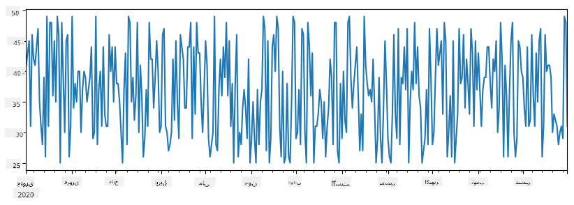
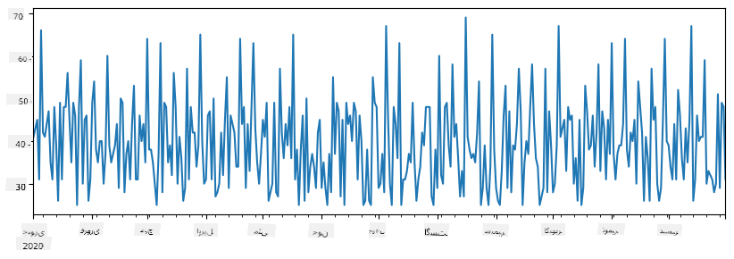
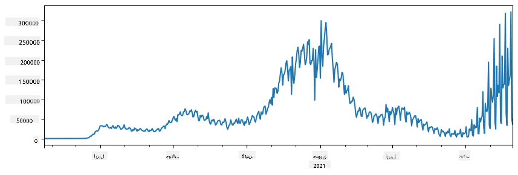
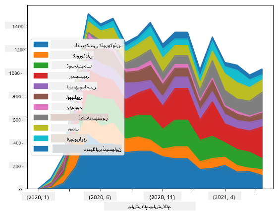

<!--
CO_OP_TRANSLATOR_METADATA:
{
  "original_hash": "7bfec050f4717dcc2dfd028aca9d21f3",
  "translation_date": "2025-09-06T15:25:28+00:00",
  "source_file": "2-Working-With-Data/07-python/README.md",
  "language_code": "ur"
}
-->
# ڈیٹا کے ساتھ کام کرنا: پائتھون اور پانڈاز لائبریری

|  کی طرف سے اسکیچ نوٹ ](../../sketchnotes/07-WorkWithPython.png) |
| :-------------------------------------------------------------------------------------------------------: |
|                 پائتھون کے ساتھ کام کرنا - _[@nitya](https://twitter.com/nitya) کی طرف سے اسکیچ نوٹ_                 |

[](https://youtu.be/dZjWOGbsN4Y)

اگرچہ ڈیٹا بیسز ڈیٹا کو محفوظ کرنے اور انہیں کوئری لینگویجز کے ذریعے تلاش کرنے کے لیے بہت مؤثر طریقے فراہم کرتے ہیں، ڈیٹا پروسیسنگ کا سب سے لچکدار طریقہ اپنا پروگرام لکھ کر ڈیٹا کو تبدیل کرنا ہے۔ اکثر اوقات، ڈیٹا بیس کوئری کرنا زیادہ مؤثر ہوگا۔ لیکن کچھ معاملات میں جب زیادہ پیچیدہ ڈیٹا پروسیسنگ کی ضرورت ہو، تو یہ کام آسانی سے SQL کے ذریعے نہیں کیا جا سکتا۔  
ڈیٹا پروسیسنگ کسی بھی پروگرامنگ زبان میں کی جا سکتی ہے، لیکن کچھ زبانیں ڈیٹا کے ساتھ کام کرنے کے لحاظ سے زیادہ اعلیٰ سطح کی ہوتی ہیں۔ ڈیٹا سائنسدان عام طور پر درج ذیل زبانوں میں سے کسی ایک کو ترجیح دیتے ہیں:

* **[پائتھون](https://www.python.org/)**، ایک عمومی مقصد کی پروگرامنگ زبان، جو اپنی سادگی کی وجہ سے اکثر ابتدائی افراد کے لیے بہترین آپشن سمجھی جاتی ہے۔ پائتھون میں بہت سی اضافی لائبریریاں موجود ہیں جو آپ کو عملی مسائل حل کرنے میں مدد دے سکتی ہیں، جیسے کہ ZIP آرکائیو سے ڈیٹا نکالنا یا تصویر کو گرے اسکیل میں تبدیل کرنا۔ ڈیٹا سائنس کے علاوہ، پائتھون ویب ڈیولپمنٹ کے لیے بھی اکثر استعمال ہوتی ہے۔  
* **[آر](https://www.r-project.org/)** ایک روایتی ٹول باکس ہے جو شماریاتی ڈیٹا پروسیسنگ کے لیے بنایا گیا ہے۔ اس میں لائبریریوں کا بڑا ذخیرہ (CRAN) موجود ہے، جو اسے ڈیٹا پروسیسنگ کے لیے ایک اچھا انتخاب بناتا ہے۔ تاہم، آر ایک عمومی مقصد کی پروگرامنگ زبان نہیں ہے اور ڈیٹا سائنس کے دائرے سے باہر شاذ و نادر ہی استعمال ہوتی ہے۔  
* **[جولیا](https://julialang.org/)** ایک اور زبان ہے جو خاص طور پر ڈیٹا سائنس کے لیے تیار کی گئی ہے۔ یہ پائتھون کے مقابلے میں بہتر کارکردگی فراہم کرنے کے لیے بنائی گئی ہے، جو اسے سائنسی تجربات کے لیے ایک بہترین ٹول بناتی ہے۔

اس سبق میں، ہم پائتھون کا استعمال کرتے ہوئے سادہ ڈیٹا پروسیسنگ پر توجہ مرکوز کریں گے۔ ہم زبان کی بنیادی واقفیت فرض کریں گے۔ اگر آپ پائتھون کا گہرا جائزہ لینا چاہتے ہیں، تو آپ درج ذیل وسائل میں سے کسی ایک کا حوالہ دے سکتے ہیں:

* [پائتھون کو تفریحی طریقے سے سیکھیں: ٹرٹل گرافکس اور فرکٹلز کے ساتھ](https://github.com/shwars/pycourse) - پائتھون پروگرامنگ کا گٹ ہب پر مبنی تعارفی کورس  
* [پائتھون کے ساتھ اپنے پہلے قدم اٹھائیں](https://docs.microsoft.com/en-us/learn/paths/python-first-steps/?WT.mc_id=academic-77958-bethanycheum) [Microsoft Learn](http://learn.microsoft.com/?WT.mc_id=academic-77958-bethanycheum) پر لرننگ پاتھ  

ڈیٹا مختلف شکلوں میں آ سکتا ہے۔ اس سبق میں، ہم ڈیٹا کی تین شکلوں پر غور کریں گے - **ٹیبلر ڈیٹا**، **متن** اور **تصاویر**۔

ہم آپ کو متعلقہ لائبریریوں کا مکمل جائزہ دینے کے بجائے ڈیٹا پروسیسنگ کی چند مثالوں پر توجہ مرکوز کریں گے۔ اس سے آپ کو یہ سمجھنے میں مدد ملے گی کہ کیا ممکن ہے، اور جب آپ کو ضرورت ہو تو اپنے مسائل کے حل تلاش کرنے کے لیے کہاں جانا ہے۔

> **سب سے مفید مشورہ**۔ جب آپ کو ڈیٹا پر کوئی خاص آپریشن کرنے کی ضرورت ہو اور آپ کو معلوم نہ ہو کہ اسے کیسے کرنا ہے، تو انٹرنیٹ پر تلاش کرنے کی کوشش کریں۔ [Stackoverflow](https://stackoverflow.com/) عام طور پر پائتھون میں بہت سے عام کاموں کے لیے مفید کوڈ نمونے فراہم کرتا ہے۔  

## [لیکچر سے پہلے کا کوئز](https://ff-quizzes.netlify.app/en/ds/quiz/12)

## ٹیبلر ڈیٹا اور ڈیٹا فریمز

آپ پہلے ہی ٹیبلر ڈیٹا سے واقف ہو چکے ہیں جب ہم نے ریلیشنل ڈیٹا بیسز کے بارے میں بات کی تھی۔ جب آپ کے پاس بہت زیادہ ڈیٹا ہو، اور وہ مختلف جڑی ہوئی ٹیبلز میں موجود ہو، تو اس کے ساتھ کام کرنے کے لیے SQL کا استعمال کرنا یقینی طور پر سمجھ میں آتا ہے۔ تاہم، بہت سے معاملات میں جب ہمارے پاس ڈیٹا کی ایک ٹیبل ہو، اور ہمیں اس ڈیٹا کے بارے میں کچھ **سمجھ** یا **بصیرت** حاصل کرنی ہو، جیسے کہ تقسیم، اقدار کے درمیان تعلق، وغیرہ۔ ڈیٹا سائنس میں، بہت سے معاملات میں ہمیں اصل ڈیٹا کی کچھ تبدیلیاں کرنے کی ضرورت ہوتی ہے، جس کے بعد بصری نمائندگی کی جاتی ہے۔ یہ دونوں مراحل پائتھون کا استعمال کرتے ہوئے آسانی سے کیے جا سکتے ہیں۔

پائتھون میں دو سب سے زیادہ مفید لائبریریاں ہیں جو آپ کو ٹیبلر ڈیٹا کے ساتھ کام کرنے میں مدد دے سکتی ہیں:
* **[پانڈاز](https://pandas.pydata.org/)** آپ کو **ڈیٹا فریمز** کے ساتھ کام کرنے کی اجازت دیتا ہے، جو ریلیشنل ٹیبلز کے مترادف ہیں۔ آپ کے پاس نامزد کالم ہو سکتے ہیں، اور قطاروں، کالموں اور ڈیٹا فریمز پر مختلف آپریشنز انجام دے سکتے ہیں۔  
* **[نمپائی](https://numpy.org/)** ایک لائبریری ہے جو **ٹینسرز**، یعنی کثیر جہتی **ارے** کے ساتھ کام کرنے کے لیے ہے۔ ارے میں ایک ہی بنیادی قسم کی اقدار ہوتی ہیں، اور یہ ڈیٹا فریم سے زیادہ سادہ ہوتا ہے، لیکن یہ زیادہ ریاضیاتی آپریشنز فراہم کرتا ہے اور کم اوور ہیڈ پیدا کرتا ہے۔  

کچھ دیگر لائبریریاں بھی ہیں جن کے بارے میں آپ کو معلوم ہونا چاہیے:
* **[میٹپلاٹلب](https://matplotlib.org/)** ڈیٹا کی بصری نمائندگی اور گراف بنانے کے لیے استعمال ہونے والی لائبریری ہے  
* **[سائپائی](https://www.scipy.org/)** کچھ اضافی سائنسی فنکشنز کے ساتھ ایک لائبریری ہے۔ ہم پہلے ہی اس لائبریری سے اس وقت مل چکے ہیں جب ہم احتمال اور شماریات کے بارے میں بات کر رہے تھے  

یہاں ایک کوڈ کا ٹکڑا ہے جو آپ عام طور پر اپنے پائتھون پروگرام کے آغاز میں ان لائبریریوں کو درآمد کرنے کے لیے استعمال کریں گے:
```python
import numpy as np
import pandas as pd
import matplotlib.pyplot as plt
from scipy import ... # you need to specify exact sub-packages that you need
``` 

پانڈاز چند بنیادی تصورات کے گرد مرکوز ہے۔

### سیریز 

**سیریز** اقدار کی ترتیب ہے، جو فہرست یا نمپائی ارے کی طرح ہے۔ بنیادی فرق یہ ہے کہ سیریز میں ایک **انڈیکس** بھی ہوتا ہے، اور جب ہم سیریز پر آپریشن کرتے ہیں (جیسے، انہیں جمع کرتے ہیں)، تو انڈیکس کو مدنظر رکھا جاتا ہے۔ انڈیکس اتنا سادہ ہو سکتا ہے جتنا کہ عددی قطار نمبر (یہ وہ انڈیکس ہے جو فہرست یا ارے سے سیریز بناتے وقت ڈیفالٹ کے طور پر استعمال ہوتا ہے)، یا اس کی پیچیدہ ساخت ہو سکتی ہے، جیسے کہ تاریخ کا وقفہ۔

> **نوٹ**: اس کے ساتھ موجود نوٹ بک [`notebook.ipynb`](notebook.ipynb) میں کچھ تعارفی پانڈاز کوڈ موجود ہے۔ ہم یہاں صرف چند مثالیں پیش کرتے ہیں، اور آپ کو مکمل نوٹ بک دیکھنے کی دعوت دیتے ہیں۔

ایک مثال پر غور کریں: ہم اپنی آئس کریم کی دکان کی فروخت کا تجزیہ کرنا چاہتے ہیں۔ آئیے کچھ وقت کے لیے فروخت کے نمبروں (ہر دن فروخت ہونے والی اشیاء کی تعداد) کی سیریز بنائیں:

```python
start_date = "Jan 1, 2020"
end_date = "Mar 31, 2020"
idx = pd.date_range(start_date,end_date)
print(f"Length of index is {len(idx)}")
items_sold = pd.Series(np.random.randint(25,50,size=len(idx)),index=idx)
items_sold.plot()
```


اب فرض کریں کہ ہر ہفتے ہم دوستوں کے لیے ایک پارٹی کا اہتمام کرتے ہیں، اور پارٹی کے لیے آئس کریم کے اضافی 10 پیک لیتے ہیں۔ ہم ایک اور سیریز بنا سکتے ہیں، جو ہفتے کے انڈیکس کے ذریعے ظاہر ہو:
```python
additional_items = pd.Series(10,index=pd.date_range(start_date,end_date,freq="W"))
```
جب ہم دو سیریز کو ایک ساتھ جمع کرتے ہیں، تو ہمیں کل تعداد ملتی ہے:
```python
total_items = items_sold.add(additional_items,fill_value=0)
total_items.plot()
```


> **نوٹ** کہ ہم سادہ سینٹیکس `total_items+additional_items` استعمال نہیں کر رہے ہیں۔ اگر ہم ایسا کرتے، تو ہمیں نتیجہ میں بہت سے `NaN` (*Not a Number*) اقدار ملتی۔ اس کی وجہ یہ ہے کہ `additional_items` سیریز میں انڈیکس پوائنٹس کے لیے کچھ اقدار غائب ہیں، اور کسی بھی چیز میں `NaN` شامل کرنے سے نتیجہ `NaN` ہوتا ہے۔ اس لیے ہمیں جمع کرتے وقت `fill_value` پیرامیٹر کی وضاحت کرنے کی ضرورت ہوتی ہے۔

ٹائم سیریز کے ساتھ، ہم مختلف وقت کے وقفوں کے ساتھ سیریز کو **دوبارہ نمونہ** بنا سکتے ہیں۔ مثال کے طور پر، فرض کریں کہ ہم ماہانہ اوسط فروخت کا حجم شمار کرنا چاہتے ہیں۔ ہم درج ذیل کوڈ استعمال کر سکتے ہیں:
```python
monthly = total_items.resample("1M").mean()
ax = monthly.plot(kind='bar')
```


### ڈیٹا فریم

ڈیٹا فریم بنیادی طور پر ایک ہی انڈیکس کے ساتھ سیریز کا مجموعہ ہے۔ ہم کئی سیریز کو ایک ساتھ ڈیٹا فریم میں جمع کر سکتے ہیں:
```python
a = pd.Series(range(1,10))
b = pd.Series(["I","like","to","play","games","and","will","not","change"],index=range(0,9))
df = pd.DataFrame([a,b])
```
یہ ہمیں ایک افقی ٹیبل دے گا جیسے:
|     | 0   | 1    | 2   | 3   | 4      | 5   | 6      | 7    | 8    |
| --- | --- | ---- | --- | --- | ------ | --- | ------ | ---- | ---- |
| 0   | 1   | 2    | 3   | 4   | 5      | 6   | 7      | 8    | 9    |
| 1   | I   | like | to  | use | Python | and | Pandas | very | much |

ہم سیریز کو کالم کے طور پر بھی استعمال کر سکتے ہیں، اور لغت کا استعمال کرتے ہوئے کالم کے نام بتا سکتے ہیں:
```python
df = pd.DataFrame({ 'A' : a, 'B' : b })
```
یہ ہمیں ایک ٹیبل دے گا جیسے:

|     | A   | B      |
| --- | --- | ------ |
| 0   | 1   | I      |
| 1   | 2   | like   |
| 2   | 3   | to     |
| 3   | 4   | use    |
| 4   | 5   | Python |
| 5   | 6   | and    |
| 6   | 7   | Pandas |
| 7   | 8   | very   |
| 8   | 9   | much   |

**نوٹ** کہ ہم اس ٹیبل کی ترتیب کو پچھلے ٹیبل کو ٹرانسپوز کر کے بھی حاصل کر سکتے ہیں، جیسے کہ لکھ کر 
```python
df = pd.DataFrame([a,b]).T..rename(columns={ 0 : 'A', 1 : 'B' })
```
یہاں `.T` ڈیٹا فریم کو ٹرانسپوز کرنے کا آپریشن ہے، یعنی قطاروں اور کالموں کو تبدیل کرنا، اور `rename` آپریشن ہمیں کالموں کو پچھلی مثال سے ملانے کے لیے نام تبدیل کرنے کی اجازت دیتا ہے۔

یہاں چند اہم ترین آپریشنز ہیں جو ہم ڈیٹا فریمز پر انجام دے سکتے ہیں:

**کالم کا انتخاب**۔ ہم انفرادی کالمز کو `df['A']` لکھ کر منتخب کر سکتے ہیں - یہ آپریشن ایک سیریز واپس کرتا ہے۔ ہم کالمز کے ایک ذیلی سیٹ کو دوسرے ڈیٹا فریم میں منتخب کر سکتے ہیں `df[['B','A']]` لکھ کر - یہ ایک اور ڈیٹا فریم واپس کرتا ہے۔

**فلٹرنگ** صرف مخصوص قطاروں کو معیار کے مطابق۔ مثال کے طور پر، صرف ان قطاروں کو چھوڑنے کے لیے جن میں کالم `A` 5 سے زیادہ ہو، ہم لکھ سکتے ہیں `df[df['A']>5]`۔

> **نوٹ**: فلٹرنگ کا کام کرنے کا طریقہ درج ذیل ہے۔ اظہار `df['A']<5` ایک بولین سیریز واپس کرتا ہے، جو ظاہر کرتا ہے کہ آیا اظہار اصل سیریز `df['A']` کے ہر عنصر کے لیے `True` یا `False` ہے۔ جب بولین سیریز کو انڈیکس کے طور پر استعمال کیا جاتا ہے، تو یہ ڈیٹا فریم میں قطاروں کا ذیلی سیٹ واپس کرتا ہے۔ اس لیے کسی بھی صوابدیدی پائتھون بولین اظہار کا استعمال ممکن نہیں ہے، مثال کے طور پر، لکھنا `df[df['A']>5 and df['A']<7]` غلط ہوگا۔ اس کے بجائے، آپ کو بولین سیریز پر خاص `&` آپریشن استعمال کرنا چاہیے، لکھ کر `df[(df['A']>5) & (df['A']<7)]` (*یہاں بریکٹس اہم ہیں*)۔

**نئے قابل حساب کالمز بنانا**۔ ہم اپنے ڈیٹا فریم کے لیے نئے قابل حساب کالمز کو آسانی سے بنا سکتے ہیں جیسے کہ درج ذیل اظہار کا استعمال کرتے ہوئے:
```python
df['DivA'] = df['A']-df['A'].mean() 
``` 
یہ مثال `A` کی اس کے اوسط قدر سے انحراف کا حساب لگاتی ہے۔ یہاں جو اصل میں ہوتا ہے وہ یہ ہے کہ ہم ایک سیریز کا حساب لگا رہے ہیں، اور پھر اس سیریز کو بائیں طرف تفویض کر رہے ہیں، ایک اور کالم بنا رہے ہیں۔ اس لیے، ہم کسی بھی آپریشنز کا استعمال نہیں کر سکتے جو سیریز کے ساتھ مطابقت نہیں رکھتے، مثال کے طور پر، نیچے دیا گیا کوڈ غلط ہے:
```python
# Wrong code -> df['ADescr'] = "Low" if df['A'] < 5 else "Hi"
df['LenB'] = len(df['B']) # <- Wrong result
``` 
آخری مثال، اگرچہ نحوی طور پر درست ہے، ہمیں غلط نتیجہ دیتی ہے، کیونکہ یہ سیریز `B` کی لمبائی کو کالم کے تمام اقدار پر تفویض کرتی ہے، اور انفرادی عناصر کی لمبائی کو نہیں جیسا کہ ہم نے ارادہ کیا تھا۔

اگر ہمیں اس طرح کے پیچیدہ اظہار کا حساب لگانے کی ضرورت ہو، تو ہم `apply` فنکشن استعمال کر سکتے ہیں۔ آخری مثال کو درج ذیل کے طور پر لکھا جا سکتا ہے:
```python
df['LenB'] = df['B'].apply(lambda x : len(x))
# or 
df['LenB'] = df['B'].apply(len)
```

اوپر دیے گئے آپریشنز کے بعد، ہم درج ذیل ڈیٹا فریم کے ساتھ ختم ہوں گے:

|     | A   | B      | DivA | LenB |
| --- | --- | ------ | ---- | ---- |
| 0   | 1   | I      | -4.0 | 1    |
| 1   | 2   | like   | -3.0 | 4    |
| 2   | 3   | to     | -2.0 | 2    |
| 3   | 4   | use    | -1.0 | 3    |
| 4   | 5   | Python | 0.0  | 6    |
| 5   | 6   | and    | 1.0  | 3    |
| 6   | 7   | Pandas | 2.0  | 6    |
| 7   | 8   | very   | 3.0  | 4    |
| 8   | 9   | much   | 4.0  | 4    |

**نمبرز کی بنیاد پر قطاروں کا انتخاب** `iloc` کنسٹرکٹ کا استعمال کرتے ہوئے کیا جا سکتا ہے۔ مثال کے طور پر، ڈیٹا فریم سے پہلی 5 قطاروں کو منتخب کرنے کے لیے:
```python
df.iloc[:5]
```

**گروپنگ** اکثر *پیوٹ ٹیبلز* جیسا نتیجہ حاصل کرنے کے لیے استعمال ہوتی ہے جیسا کہ ایکسل میں۔ فرض کریں کہ ہم `LenB` کی دی گئی تعداد کے لیے کالم `A` کی اوسط قدر کا حساب لگانا چاہتے ہیں۔ پھر ہم اپنے ڈیٹا فریم کو `LenB` کے ذریعے گروپ کر سکتے ہیں، اور `mean` کال کر سکتے ہیں:
```python
df.groupby(by='LenB')[['A','DivA']].mean()
```
اگر ہمیں گروپ میں اوسط اور عناصر کی تعداد کا حساب لگانے کی ضرورت ہو، تو ہم زیادہ پیچیدہ `aggregate` فنکشن استعمال کر سکتے ہیں:
```python
df.groupby(by='LenB') \
 .aggregate({ 'DivA' : len, 'A' : lambda x: x.mean() }) \
 .rename(columns={ 'DivA' : 'Count', 'A' : 'Mean'})
```
یہ ہمیں درج ذیل ٹیبل دیتا ہے:

| LenB | Count | Mean     |
| ---- | ----- | -------- |
| 1    | 1     | 1.000000 |
| 2    | 1     | 3.000000 |
| 3    | 2     | 5.000000 |
| 4    | 3     | 6.333333 |
| 6    | 2     | 6.000000 |

### ڈیٹا حاصل کرنا
ہم نے دیکھا کہ Python اشیاء سے Series اور DataFrames بنانا کتنا آسان ہے۔ تاہم، ڈیٹا عام طور پر ٹیکسٹ فائل یا Excel ٹیبل کی شکل میں آتا ہے۔ خوش قسمتی سے، Pandas ہمیں ڈسک سے ڈیٹا لوڈ کرنے کا ایک آسان طریقہ فراہم کرتا ہے۔ مثال کے طور پر، CSV فائل پڑھنا اتنا ہی آسان ہے:
```python
df = pd.read_csv('file.csv')
```
ہم ڈیٹا لوڈ کرنے کی مزید مثالیں دیکھیں گے، بشمول اسے بیرونی ویب سائٹس سے حاصل کرنا، "Challenge" سیکشن میں۔

### ڈیٹا کی پرنٹنگ اور گراف بنانا

ایک Data Scientist کو اکثر ڈیٹا کا تجزیہ کرنا پڑتا ہے، اس لیے اسے بصری طور پر دیکھنا ضروری ہے۔ جب DataFrame بڑا ہو، تو اکثر ہم صرف یہ یقینی بنانا چاہتے ہیں کہ ہم سب کچھ صحیح طریقے سے کر رہے ہیں، اور اس کے لیے ابتدائی چند قطاریں پرنٹ کرتے ہیں۔ یہ `df.head()` کال کرکے کیا جا سکتا ہے۔ اگر آپ اسے Jupyter Notebook سے چلا رہے ہیں، تو یہ DataFrame کو ایک خوبصورت ٹیبل کی شکل میں پرنٹ کرے گا۔

ہم نے `plot` فنکشن کا استعمال بھی دیکھا ہے تاکہ کچھ کالمز کو بصری طور پر دکھایا جا سکے۔ اگرچہ `plot` بہت سے کاموں کے لیے مفید ہے اور `kind=` پیرامیٹر کے ذریعے مختلف قسم کے گرافز کو سپورٹ کرتا ہے، آپ ہمیشہ `matplotlib` لائبریری کا استعمال کرکے مزید پیچیدہ گراف بنا سکتے ہیں۔ ہم ڈیٹا کی بصری نمائندگی کو الگ کورس کے اسباق میں تفصیل سے کور کریں گے۔

یہ جائزہ Pandas کے سب سے اہم تصورات کو کور کرتا ہے، تاہم، یہ لائبریری بہت وسیع ہے، اور آپ اس کے ساتھ جو کچھ کر سکتے ہیں اس کی کوئی حد نہیں ہے! آئیے اب اس علم کو مخصوص مسائل کے حل کے لیے استعمال کریں۔

## 🚀 چیلنج 1: COVID کے پھیلاؤ کا تجزیہ

پہلا مسئلہ جس پر ہم توجہ مرکوز کریں گے وہ COVID-19 کے وبائی پھیلاؤ کی ماڈلنگ ہے۔ ایسا کرنے کے لیے، ہم مختلف ممالک میں متاثرہ افراد کی تعداد کے ڈیٹا کا استعمال کریں گے، جو [Center for Systems Science and Engineering](https://systems.jhu.edu/) (CSSE) نے [Johns Hopkins University](https://jhu.edu/) کے ذریعے فراہم کیا ہے۔ ڈیٹا سیٹ [اس GitHub Repository](https://github.com/CSSEGISandData/COVID-19) میں دستیاب ہے۔

چونکہ ہم یہ دکھانا چاہتے ہیں کہ ڈیٹا کے ساتھ کیسے کام کیا جائے، ہم آپ کو دعوت دیتے ہیں کہ [`notebook-covidspread.ipynb`](notebook-covidspread.ipynb) کھولیں اور اسے شروع سے آخر تک پڑھیں۔ آپ سیلز کو چلا سکتے ہیں اور آخر میں دیے گئے کچھ چیلنجز کو حل کر سکتے ہیں۔



> اگر آپ کو Jupyter Notebook میں کوڈ چلانے کا طریقہ معلوم نہیں ہے، تو [اس مضمون](https://soshnikov.com/education/how-to-execute-notebooks-from-github/) کو دیکھیں۔

## غیر ساختہ ڈیٹا کے ساتھ کام کرنا

اگرچہ ڈیٹا اکثر ٹیبل کی شکل میں آتا ہے، کچھ معاملات میں ہمیں کم ساختہ ڈیٹا جیسے کہ ٹیکسٹ یا تصاویر کے ساتھ کام کرنا پڑتا ہے۔ اس صورت میں، اوپر دیکھے گئے ڈیٹا پروسیسنگ تکنیکوں کو لاگو کرنے کے لیے، ہمیں کسی طرح **ساختہ** ڈیٹا نکالنا ہوگا۔ یہاں کچھ مثالیں ہیں:

* ٹیکسٹ سے کلیدی الفاظ نکالنا اور یہ دیکھنا کہ وہ کتنی بار ظاہر ہوتے ہیں
* نیورل نیٹ ورکس کا استعمال کرکے تصویر میں موجود اشیاء کے بارے میں معلومات نکالنا
* ویڈیو کیمرہ فیڈ پر لوگوں کے جذبات کے بارے میں معلومات حاصل کرنا

## 🚀 چیلنج 2: COVID پر تحقیقی مقالوں کا تجزیہ

اس چیلنج میں، ہم COVID وبائی مرض کے موضوع کو جاری رکھیں گے اور اس موضوع پر سائنسی مقالوں کی پروسیسنگ پر توجہ مرکوز کریں گے۔ [CORD-19 Dataset](https://www.kaggle.com/allen-institute-for-ai/CORD-19-research-challenge) میں 7000 سے زیادہ (لکھنے کے وقت) COVID پر مقالے دستیاب ہیں، جن میں میٹا ڈیٹا اور خلاصے شامل ہیں (اور ان میں سے تقریباً نصف کے لیے مکمل متن بھی فراہم کیا گیا ہے)۔

اس ڈیٹا سیٹ کا تجزیہ کرنے کی ایک مکمل مثال [Text Analytics for Health](https://docs.microsoft.com/azure/cognitive-services/text-analytics/how-tos/text-analytics-for-health/?WT.mc_id=academic-77958-bethanycheum) کوگنیٹو سروس کا استعمال کرتے ہوئے [اس بلاگ پوسٹ](https://soshnikov.com/science/analyzing-medical-papers-with-azure-and-text-analytics-for-health/) میں بیان کی گئی ہے۔ ہم اس تجزیے کا ایک آسان ورژن پر بات کریں گے۔

> **NOTE**: ہم اس ریپوزٹری کے حصے کے طور پر ڈیٹا سیٹ کی کاپی فراہم نہیں کرتے۔ آپ کو پہلے [`metadata.csv`](https://www.kaggle.com/allen-institute-for-ai/CORD-19-research-challenge?select=metadata.csv) فائل [Kaggle پر اس ڈیٹا سیٹ](https://www.kaggle.com/allen-institute-for-ai/CORD-19-research-challenge) سے ڈاؤن لوڈ کرنے کی ضرورت ہو سکتی ہے۔ Kaggle پر رجسٹریشن کی ضرورت ہو سکتی ہے۔ آپ رجسٹریشن کے بغیر [یہاں سے](https://ai2-semanticscholar-cord-19.s3-us-west-2.amazonaws.com/historical_releases.html) ڈیٹا سیٹ ڈاؤن لوڈ کر سکتے ہیں، لیکن اس میں میٹا ڈیٹا فائل کے علاوہ تمام مکمل متن شامل ہوں گے۔

[`notebook-papers.ipynb`](notebook-papers.ipynb) کھولیں اور اسے شروع سے آخر تک پڑھیں۔ آپ سیلز کو چلا سکتے ہیں اور آخر میں دیے گئے کچھ چیلنجز کو حل کر سکتے ہیں۔



## تصویری ڈیٹا کی پروسیسنگ

حال ہی میں، بہت طاقتور AI ماڈلز تیار کیے گئے ہیں جو تصاویر کو سمجھنے کی صلاحیت رکھتے ہیں۔ بہت سے کام ایسے ہیں جو پہلے سے تربیت یافتہ نیورل نیٹ ورکس یا کلاؤڈ سروسز کا استعمال کرکے حل کیے جا سکتے ہیں۔ کچھ مثالیں شامل ہیں:

* **تصویری درجہ بندی**، جو آپ کو تصویر کو پہلے سے طے شدہ کلاسز میں سے کسی ایک میں تقسیم کرنے میں مدد دے سکتی ہے۔ آپ آسانی سے [Custom Vision](https://azure.microsoft.com/services/cognitive-services/custom-vision-service/?WT.mc_id=academic-77958-bethanycheum) جیسی سروسز کا استعمال کرکے اپنی تصویری درجہ بندی کرنے والے ماڈلز بنا سکتے ہیں۔
* **اشیاء کی شناخت** تاکہ تصویر میں مختلف اشیاء کی شناخت کی جا سکے۔ [computer vision](https://azure.microsoft.com/services/cognitive-services/computer-vision/?WT.mc_id=academic-77958-bethanycheum) جیسی سروسز عام اشیاء کی شناخت کر سکتی ہیں، اور آپ [Custom Vision](https://azure.microsoft.com/services/cognitive-services/custom-vision-service/?WT.mc_id=academic-77958-bethanycheum) ماڈل کو مخصوص اشیاء کی شناخت کے لیے تربیت دے سکتے ہیں۔
* **چہرے کی شناخت**، جس میں عمر، جنس اور جذبات کی شناخت شامل ہے۔ یہ [Face API](https://azure.microsoft.com/services/cognitive-services/face/?WT.mc_id=academic-77958-bethanycheum) کے ذریعے کیا جا سکتا ہے۔

یہ تمام کلاؤڈ سروسز [Python SDKs](https://docs.microsoft.com/samples/azure-samples/cognitive-services-python-sdk-samples/cognitive-services-python-sdk-samples/?WT.mc_id=academic-77958-bethanycheum) کا استعمال کرکے کال کی جا سکتی ہیں، اور اس طرح آپ کے ڈیٹا کے تجزیے کے ورک فلو میں آسانی سے شامل کی جا سکتی ہیں۔

یہاں تصویری ڈیٹا کے ذرائع سے ڈیٹا کو دریافت کرنے کی کچھ مثالیں ہیں:
* بلاگ پوسٹ [How to Learn Data Science without Coding](https://soshnikov.com/azure/how-to-learn-data-science-without-coding/) میں ہم Instagram تصاویر کا تجزیہ کرتے ہیں، یہ سمجھنے کی کوشش کرتے ہیں کہ کون سی چیز لوگوں کو تصویر پر زیادہ لائکس دینے پر مجبور کرتی ہے۔ ہم پہلے [computer vision](https://azure.microsoft.com/services/cognitive-services/computer-vision/?WT.mc_id=academic-77958-bethanycheum) کا استعمال کرکے تصاویر سے زیادہ سے زیادہ معلومات نکالتے ہیں، اور پھر [Azure Machine Learning AutoML](https://docs.microsoft.com/azure/machine-learning/concept-automated-ml/?WT.mc_id=academic-77958-bethanycheum) کا استعمال کرکے ایک قابل وضاحت ماڈل بناتے ہیں۔
* [Facial Studies Workshop](https://github.com/CloudAdvocacy/FaceStudies) میں ہم [Face API](https://azure.microsoft.com/services/cognitive-services/face/?WT.mc_id=academic-77958-bethanycheum) کا استعمال کرتے ہیں تاکہ ایونٹس کی تصاویر میں لوگوں کے جذبات نکال سکیں، یہ سمجھنے کی کوشش کرتے ہوئے کہ کون سی چیز لوگوں کو خوش کرتی ہے۔

## نتیجہ

چاہے آپ کے پاس پہلے سے ساختہ یا غیر ساختہ ڈیٹا ہو، Python کا استعمال کرکے آپ ڈیٹا پروسیسنگ اور سمجھنے سے متعلق تمام مراحل انجام دے سکتے ہیں۔ یہ ڈیٹا پروسیسنگ کا سب سے لچکدار طریقہ ہے، اور یہی وجہ ہے کہ زیادہ تر ڈیٹا سائنسدان Python کو اپنا بنیادی ٹول کے طور پر استعمال کرتے ہیں۔ اگر آپ اپنے ڈیٹا سائنس کے سفر میں سنجیدہ ہیں تو Python کو گہرائی سے سیکھنا شاید ایک اچھا خیال ہے!

## [لیکچر کے بعد کا کوئز](https://ff-quizzes.netlify.app/en/ds/quiz/13)

## جائزہ اور خود مطالعہ

**کتب**
* [Wes McKinney. Python for Data Analysis: Data Wrangling with Pandas, NumPy, and IPython](https://www.amazon.com/gp/product/1491957662)

**آن لائن وسائل**
* آفیشل [10 minutes to Pandas](https://pandas.pydata.org/pandas-docs/stable/user_guide/10min.html) ٹیوٹوریل
* [Pandas Visualization پر دستاویزات](https://pandas.pydata.org/pandas-docs/stable/user_guide/visualization.html)

**Python سیکھنا**
* [Learn Python in a Fun Way with Turtle Graphics and Fractals](https://github.com/shwars/pycourse)
* [Python کے ساتھ اپنے پہلے قدم اٹھائیں](https://docs.microsoft.com/learn/paths/python-first-steps/?WT.mc_id=academic-77958-bethanycheum) Microsoft Learn پر لرننگ پاتھ

## اسائنمنٹ

[اوپر دیے گئے چیلنجز کے لیے مزید تفصیلی ڈیٹا اسٹڈی کریں](assignment.md)

## کریڈٹس

یہ سبق [Dmitry Soshnikov](http://soshnikov.com) نے ♥️ کے ساتھ لکھا ہے۔

---

**ڈسکلیمر**:  
یہ دستاویز AI ترجمہ سروس [Co-op Translator](https://github.com/Azure/co-op-translator) کا استعمال کرتے ہوئے ترجمہ کی گئی ہے۔ ہم درستگی کے لیے کوشش کرتے ہیں، لیکن براہ کرم آگاہ رہیں کہ خودکار ترجمے میں غلطیاں یا غیر درستیاں ہو سکتی ہیں۔ اصل دستاویز کو اس کی اصل زبان میں مستند ذریعہ سمجھا جانا چاہیے۔ اہم معلومات کے لیے، پیشہ ور انسانی ترجمہ کی سفارش کی جاتی ہے۔ ہم اس ترجمے کے استعمال سے پیدا ہونے والی کسی بھی غلط فہمی یا غلط تشریح کے ذمہ دار نہیں ہیں۔