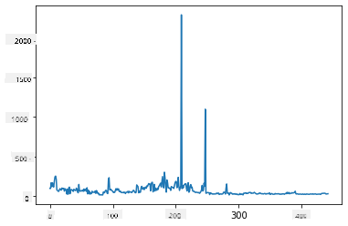
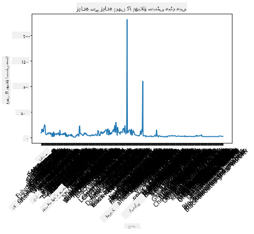
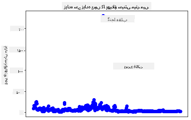
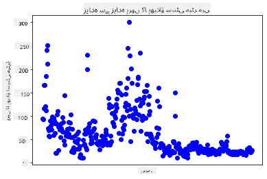
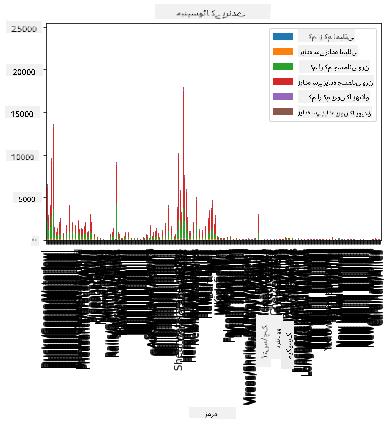
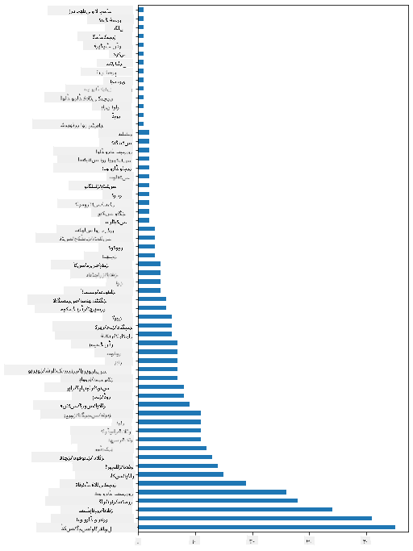
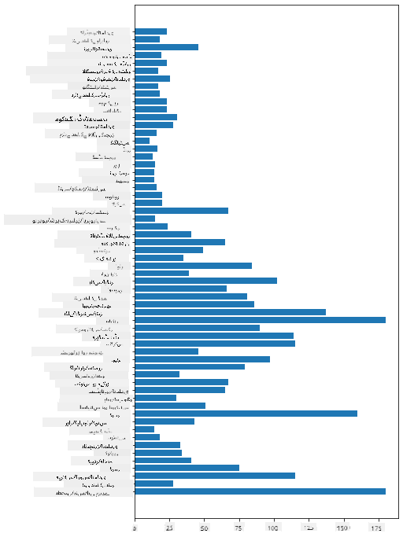
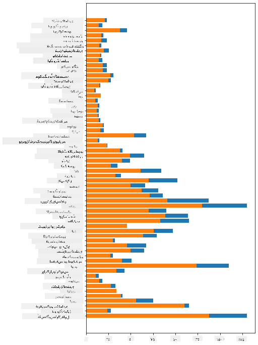

<!--
CO_OP_TRANSLATOR_METADATA:
{
  "original_hash": "43c402d9d90ae6da55d004519ada5033",
  "translation_date": "2025-08-27T10:43:16+00:00",
  "source_file": "3-Data-Visualization/09-visualization-quantities/README.md",
  "language_code": "ur"
}
-->
# مقداروں کی بصری نمائندگی

| کی اسکیچ نوٹ ](../../sketchnotes/09-Visualizing-Quantities.png)|
|:---:|
| مقداروں کی بصری نمائندگی - _[@nitya](https://twitter.com/nitya) کی اسکیچ نوٹ_ |

اس سبق میں آپ سیکھیں گے کہ کس طرح پائتھون کی مختلف لائبریریوں میں سے ایک کا استعمال کرتے ہوئے مقدار کے تصور کے گرد دلچسپ بصری نمائندگی بنائی جا سکتی ہے۔ منیسوٹا کے پرندوں کے بارے میں صاف شدہ ڈیٹا سیٹ کا استعمال کرتے ہوئے، آپ مقامی جنگلی حیات کے بارے میں کئی دلچسپ حقائق جان سکتے ہیں۔  
## [لیکچر سے پہلے کا کوئز](https://purple-hill-04aebfb03.1.azurestaticapps.net/quiz/16)

## Matplotlib کے ساتھ پروں کے پھیلاؤ کا مشاہدہ کریں

[Matplotlib](https://matplotlib.org/stable/index.html) ایک شاندار لائبریری ہے جو مختلف قسم کے سادہ اور پیچیدہ گراف اور چارٹس بنانے کے لیے استعمال ہوتی ہے۔ عمومی طور پر، ان لائبریریوں کے ذریعے ڈیٹا کو گراف میں پیش کرنے کا عمل ان حصوں کی نشاندہی سے شروع ہوتا ہے جنہیں آپ اپنے ڈیٹا فریم میں ہدف بنانا چاہتے ہیں، اس ڈیٹا پر ضروری تبدیلیاں کرنا، اس کے x اور y محور کی قدریں تفویض کرنا، گراف کی قسم کا انتخاب کرنا، اور پھر گراف کو دکھانا۔ Matplotlib مختلف قسم کی بصری نمائندگی پیش کرتا ہے، لیکن اس سبق میں ہم ان پر توجہ مرکوز کریں گے جو مقدار کو ظاہر کرنے کے لیے سب سے زیادہ موزوں ہیں: لائن چارٹس، اسکیٹر پلاٹس، اور بار پلاٹس۔

> ✅ اپنے ڈیٹا کی ساخت اور کہانی کے مطابق بہترین چارٹ کا انتخاب کریں۔  
> - وقت کے ساتھ رجحانات کا تجزیہ کرنے کے لیے: لائن  
> - قدروں کا موازنہ کرنے کے لیے: بار، کالم، پائی، اسکیٹر پلاٹ  
> - یہ دکھانے کے لیے کہ حصے کل سے کیسے تعلق رکھتے ہیں: پائی  
> - ڈیٹا کی تقسیم کو ظاہر کرنے کے لیے: اسکیٹر پلاٹ، بار  
> - رجحانات دکھانے کے لیے: لائن، کالم  
> - قدروں کے درمیان تعلقات ظاہر کرنے کے لیے: لائن، اسکیٹر پلاٹ، ببل  

اگر آپ کے پاس ایک ڈیٹا سیٹ ہے اور آپ کو یہ جاننے کی ضرورت ہے کہ کسی خاص آئٹم کی کتنی مقدار شامل ہے، تو آپ کا پہلا کام اس کی قدروں کا معائنہ کرنا ہوگا۔

✅ Matplotlib کے لیے بہت اچھے 'چیٹ شیٹس' [یہاں](https://matplotlib.org/cheatsheets/cheatsheets.pdf) دستیاب ہیں۔

## پرندوں کے پروں کے پھیلاؤ کے بارے میں لائن گراف بنائیں

سبق کے فولڈر کے روٹ میں موجود `notebook.ipynb` فائل کھولیں اور ایک سیل شامل کریں۔

> نوٹ: ڈیٹا اس ریپو کے روٹ میں `/data` فولڈر میں محفوظ ہے۔

```python
import pandas as pd
import matplotlib.pyplot as plt
birds = pd.read_csv('../../data/birds.csv')
birds.head()
```  
یہ ڈیٹا متن اور اعداد کا مرکب ہے:

|      | نام                          | سائنسی نام             | زمرہ                 | آرڈر         | خاندان   | جینس       | تحفظ کی حالت       | کم از کم لمبائی | زیادہ سے زیادہ لمبائی | کم از کم جسمانی وزن | زیادہ سے زیادہ جسمانی وزن | کم از کم پروں کا پھیلاؤ | زیادہ سے زیادہ پروں کا پھیلاؤ |
| ---: | :--------------------------- | :--------------------- | :------------------- | :----------- | :------- | :--------- | :----------------- | -------------: | -------------: | ----------------: | ----------------: | ----------------: | ----------------: |
|    0 | بلیک بیلیڈ وسلنگ ڈک         | Dendrocygna autumnalis | بطخ/ہنس/آبی پرندے    | Anseriformes | Anatidae | Dendrocygna | LC                 |        47       |        56       |         652       |        1020       |          76       |          94       |
|    1 | فلویس وسلنگ ڈک              | Dendrocygna bicolor    | بطخ/ہنس/آبی پرندے    | Anseriformes | Anatidae | Dendrocygna | LC                 |        45       |        53       |         712       |        1050       |          85       |          93       |
|    2 | سنو گوز                     | Anser caerulescens     | بطخ/ہنس/آبی پرندے    | Anseriformes | Anatidae | Anser       | LC                 |        64       |        79       |        2050       |        4050       |         135       |         165       |
|    3 | روس کا گوز                  | Anser rossii           | بطخ/ہنس/آبی پرندے    | Anseriformes | Anatidae | Anser       | LC                 |      57.3       |        64       |        1066       |        1567       |         113       |         116       |
|    4 | گریٹر وائٹ فرنٹڈ گوز       | Anser albifrons        | بطخ/ہنس/آبی پرندے    | Anseriformes | Anatidae | Anser       | LC                 |        64       |        81       |        1930       |        3310       |         130       |         165       |

آئیے ان دلچسپ پرندوں کے زیادہ سے زیادہ پروں کے پھیلاؤ کی ایک بنیادی لائن گراف بنا کر کچھ عددی ڈیٹا پیش کرتے ہیں۔

```python
wingspan = birds['MaxWingspan'] 
wingspan.plot()
```  


آپ نے فوراً کیا نوٹ کیا؟ ایسا لگتا ہے کہ کم از کم ایک آؤٹ لائر موجود ہے - یہ کافی بڑا پروں کا پھیلاؤ ہے! 2300 سینٹی میٹر پروں کا پھیلاؤ 23 میٹر کے برابر ہے - کیا منیسوٹا میں پیٹروڈیکٹائلز گھوم رہے ہیں؟ آئیے اس کی تحقیق کریں۔

اگرچہ آپ ایکسل میں جلدی سے آؤٹ لائرز کو ترتیب دے سکتے ہیں، لیکن گراف کے اندر سے کام جاری رکھتے ہوئے بصری نمائندگی کے عمل کو جاری رکھیں۔

x محور پر لیبلز شامل کریں تاکہ یہ دکھایا جا سکے کہ سوال میں کون سے پرندے ہیں:

```
plt.title('Max Wingspan in Centimeters')
plt.ylabel('Wingspan (CM)')
plt.xlabel('Birds')
plt.xticks(rotation=45)
x = birds['Name'] 
y = birds['MaxWingspan']

plt.plot(x, y)

plt.show()
```  


یہاں تک کہ لیبلز کو 45 ڈگری پر گھمانے کے باوجود، انہیں پڑھنا مشکل ہے۔ آئیے ایک مختلف حکمت عملی آزمائیں: صرف ان آؤٹ لائرز کو لیبل کریں اور چارٹ کے اندر لیبلز سیٹ کریں۔ آپ لیبلنگ کے لیے مزید جگہ بنانے کے لیے اسکیٹر چارٹ استعمال کر سکتے ہیں:

```python
plt.title('Max Wingspan in Centimeters')
plt.ylabel('Wingspan (CM)')
plt.tick_params(axis='both',which='both',labelbottom=False,bottom=False)

for i in range(len(birds)):
    x = birds['Name'][i]
    y = birds['MaxWingspan'][i]
    plt.plot(x, y, 'bo')
    if birds['MaxWingspan'][i] > 500:
        plt.text(x, y * (1 - 0.05), birds['Name'][i], fontsize=12)
    
plt.show()
```  
یہاں کیا ہو رہا ہے؟ آپ نے `tick_params` کا استعمال کرتے ہوئے نیچے کے لیبلز کو چھپایا اور پھر اپنے پرندوں کے ڈیٹا سیٹ پر ایک لوپ بنایا۔ چھوٹے نیلے نقطوں کے ساتھ چارٹ کو `bo` کا استعمال کرتے ہوئے بنایا، آپ نے کسی بھی پرندے کو چیک کیا جس کا زیادہ سے زیادہ پروں کا پھیلاؤ 500 سے زیادہ ہو اور اگر ایسا ہو تو اس کے نقطے کے ساتھ اس کا لیبل دکھایا۔ آپ نے y محور پر لیبلز کو تھوڑا سا آفسیٹ کیا (`y * (1 - 0.05)`) اور پرندے کے نام کو لیبل کے طور پر استعمال کیا۔

آپ نے کیا دریافت کیا؟

  
## اپنے ڈیٹا کو فلٹر کریں

بالڈ ایگل اور پریری فالکن، اگرچہ شاید بہت بڑے پرندے ہیں، لیکن ان کے زیادہ سے زیادہ پروں کے پھیلاؤ میں ایک اضافی `0` شامل ہونے کی وجہ سے غلط لیبل لگے ہوئے معلوم ہوتے ہیں۔ یہ ممکن نہیں ہے کہ آپ 25 میٹر پروں کے پھیلاؤ والے بالڈ ایگل سے ملیں، لیکن اگر ایسا ہو تو براہ کرم ہمیں بتائیں! آئیے ان دو آؤٹ لائرز کے بغیر ایک نیا ڈیٹا فریم بنائیں:

```python
plt.title('Max Wingspan in Centimeters')
plt.ylabel('Wingspan (CM)')
plt.xlabel('Birds')
plt.tick_params(axis='both',which='both',labelbottom=False,bottom=False)
for i in range(len(birds)):
    x = birds['Name'][i]
    y = birds['MaxWingspan'][i]
    if birds['Name'][i] not in ['Bald eagle', 'Prairie falcon']:
        plt.plot(x, y, 'bo')
plt.show()
```  

آؤٹ لائرز کو فلٹر کرنے سے، آپ کا ڈیٹا اب زیادہ مربوط اور سمجھنے میں آسان ہو گیا ہے۔

  

اب جب کہ ہمارے پاس پروں کے پھیلاؤ کے لحاظ سے کم از کم ایک صاف ستھرا ڈیٹا سیٹ ہے، آئیے ان پرندوں کے بارے میں مزید دریافت کریں۔

اگرچہ لائن اور اسکیٹر پلاٹس ڈیٹا کی قدروں اور ان کی تقسیم کے بارے میں معلومات ظاہر کر سکتے ہیں، ہم اس ڈیٹا سیٹ میں موجود قدروں کے بارے میں سوچنا چاہتے ہیں۔ آپ مقدار کے بارے میں درج ذیل سوالات کے جوابات دینے کے لیے بصری نمائندگی بنا سکتے ہیں:

> پرندوں کے کتنے زمرے ہیں، اور ان کی تعداد کیا ہے؟  
> کتنے پرندے معدوم، خطرے میں، نایاب، یا عام ہیں؟  
> لینیس کے اصطلاحات میں مختلف جینس اور آرڈرز کی تعداد کتنی ہے؟  
## بار چارٹس کا جائزہ لیں

جب آپ کو ڈیٹا کے گروپنگز دکھانے کی ضرورت ہو تو بار چارٹس عملی ہوتے ہیں۔ آئیے اس ڈیٹا سیٹ میں موجود پرندوں کے زمرے کا جائزہ لیں تاکہ یہ دیکھ سکیں کہ تعداد کے لحاظ سے کون سا سب سے عام ہے۔

نوٹ بک فائل میں ایک بنیادی بار چارٹ بنائیں۔

✅ نوٹ کریں، آپ یا تو پچھلے حصے میں شناخت کیے گئے دو آؤٹ لائر پرندوں کو فلٹر کر سکتے ہیں، ان کے پروں کے پھیلاؤ میں ٹائپو کو درست کر سکتے ہیں، یا انہیں ان مشقوں کے لیے چھوڑ سکتے ہیں جو پروں کے پھیلاؤ کی قدروں پر انحصار نہیں کرتے۔

اگر آپ بار چارٹ بنانا چاہتے ہیں، تو آپ اس ڈیٹا کو منتخب کر سکتے ہیں جس پر آپ توجہ مرکوز کرنا چاہتے ہیں۔ بار چارٹس خام ڈیٹا سے بنائے جا سکتے ہیں:

```python
birds.plot(x='Category',
        kind='bar',
        stacked=True,
        title='Birds of Minnesota')

```  
  

یہ بار چارٹ، تاہم، ناقابل پڑھائی ہے کیونکہ اس میں بہت زیادہ غیر گروپ شدہ ڈیٹا ہے۔ آپ کو صرف اس ڈیٹا کا انتخاب کرنے کی ضرورت ہے جسے آپ گراف میں پیش کرنا چاہتے ہیں، تو آئیے پرندے کے زمرے کی بنیاد پر لمبائی دیکھیں۔

اپنے ڈیٹا کو صرف پرندے کے زمرے تک محدود کریں۔

✅ نوٹ کریں کہ آپ ڈیٹا کو منظم کرنے کے لیے Pandas کا استعمال کرتے ہیں، اور پھر چارٹنگ کے لیے Matplotlib کا استعمال کرتے ہیں۔

چونکہ زمرے بہت زیادہ ہیں، آپ اس چارٹ کو عمودی طور پر دکھا سکتے ہیں اور تمام ڈیٹا کو ایڈجسٹ کرنے کے لیے اس کی اونچائی کو ایڈجسٹ کر سکتے ہیں:

```python
category_count = birds.value_counts(birds['Category'].values, sort=True)
plt.rcParams['figure.figsize'] = [6, 12]
category_count.plot.barh()
```  
  

یہ بار چارٹ ہر زمرے میں پرندوں کی تعداد کا ایک اچھا نظارہ پیش کرتا ہے۔ ایک نظر میں، آپ دیکھ سکتے ہیں کہ اس علاقے میں سب سے زیادہ تعداد بطخ/ہنس/آبی پرندے کے زمرے میں ہے۔ منیسوٹا '10,000 جھیلوں کی سرزمین' ہے، لہذا یہ حیرت کی بات نہیں ہے!

✅ اس ڈیٹا سیٹ پر کچھ اور گنتیاں آزمائیں۔ کیا کچھ آپ کو حیران کرتا ہے؟

## ڈیٹا کا موازنہ

آپ نئے محور بنا کر گروپ شدہ ڈیٹا کے مختلف موازنات آزما سکتے ہیں۔ پرندے کے زمرے کی بنیاد پر پرندے کی زیادہ سے زیادہ لمبائی کا موازنہ آزمائیں:

```python
maxlength = birds['MaxLength']
plt.barh(y=birds['Category'], width=maxlength)
plt.rcParams['figure.figsize'] = [6, 12]
plt.show()
```  
  

یہاں کچھ حیران کن نہیں ہے: ہمینگ برڈز کی زیادہ سے زیادہ لمبائی پیلکنز یا ہنسوں کے مقابلے میں سب سے کم ہے۔ یہ اچھا ہے جب ڈیٹا منطقی طور پر سمجھ میں آتا ہے!

آپ بار چارٹس کی مزید دلچسپ بصری نمائندگی بنا سکتے ہیں ڈیٹا کو اوورلیپ کر کے۔ آئیے کسی دیے گئے پرندے کے زمرے پر کم از کم اور زیادہ سے زیادہ لمبائی کو اوورلیپ کریں:

```python
minLength = birds['MinLength']
maxLength = birds['MaxLength']
category = birds['Category']

plt.barh(category, maxLength)
plt.barh(category, minLength)

plt.show()
```  
اس گراف میں، آپ پرندے کے زمرے کے لحاظ سے کم از کم اور زیادہ سے زیادہ لمبائی کی حد دیکھ سکتے ہیں۔ آپ محفوظ طریقے سے کہہ سکتے ہیں کہ، اس ڈیٹا کے مطابق، جتنا بڑا پرندہ، اتنی ہی اس کی لمبائی کی حد زیادہ ہوتی ہے۔ دلچسپ!

  

## 🚀 چیلنج

یہ پرندوں کا ڈیٹا سیٹ کسی خاص ماحولیاتی نظام کے اندر مختلف قسم کے پرندوں کے بارے میں معلومات کا خزانہ پیش کرتا ہے۔ انٹرنیٹ پر تلاش کریں اور دیکھیں کہ کیا آپ پرندوں پر مبنی دیگر ڈیٹا سیٹس تلاش کر سکتے ہیں۔ ان پرندوں کے گرد گراف اور چارٹس بنانے کی مشق کریں تاکہ وہ حقائق دریافت کریں جن کا آپ کو اندازہ نہ تھا۔  
## [لیکچر کے بعد کا کوئز](https://purple-hill-04aebfb03.1.azurestaticapps.net/quiz/17)

## جائزہ اور خود مطالعہ

اس پہلے سبق نے آپ کو یہ معلومات دی ہے کہ مقداروں کو بصری طور پر پیش کرنے کے لیے Matplotlib کا استعمال کیسے کیا جائے۔ بصری نمائندگی کے لیے ڈیٹا سیٹس کے ساتھ کام کرنے کے دیگر طریقوں کے بارے میں تحقیق کریں۔ [Plotly](https://github.com/plotly/plotly.py) ایک ایسا ذریعہ ہے جسے ہم ان اسباق میں شامل نہیں کریں گے، لہذا دیکھیں کہ یہ کیا پیش کر سکتا ہے۔  
## اسائنمنٹ

[لائنز، اسکیٹرز، اور بارز](assignment.md)  

---

**ڈسکلیمر**:  
یہ دستاویز AI ترجمہ سروس [Co-op Translator](https://github.com/Azure/co-op-translator) کا استعمال کرتے ہوئے ترجمہ کی گئی ہے۔ ہم درستگی کے لیے کوشش کرتے ہیں، لیکن براہ کرم آگاہ رہیں کہ خودکار ترجمے میں غلطیاں یا عدم درستگی ہو سکتی ہیں۔ اصل دستاویز کو اس کی اصل زبان میں مستند ذریعہ سمجھا جانا چاہیے۔ اہم معلومات کے لیے، پیشہ ور انسانی ترجمہ کی سفارش کی جاتی ہے۔ اس ترجمے کے استعمال سے پیدا ہونے والی کسی بھی غلط فہمی یا غلط تشریح کے لیے ہم ذمہ دار نہیں ہیں۔