<!--
CO_OP_TRANSLATOR_METADATA:
{
  "original_hash": "02ce904bc1e2bfabb7dc05c25aae375c",
  "translation_date": "2025-09-04T16:05:18+00:00",
  "source_file": "3-Data-Visualization/10-visualization-distributions/README.md",
  "language_code": "ur"
}
-->
# تقسیمات کو بصری بنانا

| کی طرف سے اسکیچ نوٹ ](../../sketchnotes/10-Visualizing-Distributions.png)|
|:---:|
| تقسیمات کو بصری بنانا - _[@nitya](https://twitter.com/nitya) کی طرف سے اسکیچ نوٹ_ |

پچھلے سبق میں، آپ نے منیسوٹا کے پرندوں کے بارے میں ایک ڈیٹا سیٹ کے کچھ دلچسپ حقائق سیکھے۔ آپ نے آؤٹ لائرز کو بصری بنا کر کچھ غلط ڈیٹا پایا اور پرندوں کی اقسام کے درمیان زیادہ سے زیادہ لمبائی کے لحاظ سے فرق دیکھا۔

## [سبق سے پہلے کا کوئز](https://purple-hill-04aebfb03.1.azurestaticapps.net/quiz/18)
## پرندوں کے ڈیٹا سیٹ کو دریافت کریں

ڈیٹا کو سمجھنے کا ایک اور طریقہ یہ ہے کہ اس کی تقسیم کو دیکھیں، یعنی ڈیٹا کسی محور کے ساتھ کیسے ترتیب دیا گیا ہے۔ مثال کے طور پر، شاید آپ منیسوٹا کے پرندوں کے زیادہ سے زیادہ پروں کے پھیلاؤ یا زیادہ سے زیادہ جسمانی وزن کی عمومی تقسیم کے بارے میں جاننا چاہتے ہوں۔

آئیے اس ڈیٹا سیٹ میں ڈیٹا کی تقسیم کے بارے میں کچھ حقائق دریافت کرتے ہیں۔ اس سبق کے فولڈر کی جڑ میں موجود _notebook.ipynb_ فائل میں، Pandas، Matplotlib، اور اپنے ڈیٹا کو درآمد کریں:

```python
import pandas as pd
import matplotlib.pyplot as plt
birds = pd.read_csv('../../data/birds.csv')
birds.head()
```

|      | نام                          | سائنسی نام             | زمرہ                  | ترتیب       | خاندان   | جنس        | تحفظ کی حالت       | کم از کم لمبائی | زیادہ سے زیادہ لمبائی | کم از کم جسمانی وزن | زیادہ سے زیادہ جسمانی وزن | کم از کم پروں کا پھیلاؤ | زیادہ سے زیادہ پروں کا پھیلاؤ |
| ---: | :--------------------------- | :--------------------- | :-------------------- | :----------- | :------- | :---------- | :----------------- | --------: | --------: | ----------: | ----------: | ----------: | ----------: |
|    0 | بلیک بیلیڈ وسلنگ ڈک          | Dendrocygna autumnalis | بطخ/ہنس/آبی پرندے     | Anseriformes | Anatidae | Dendrocygna | LC                 |        47 |        56 |         652 |        1020 |          76 |          94 |
|    1 | فلویس وسلنگ ڈک               | Dendrocygna bicolor    | بطخ/ہنس/آبی پرندے     | Anseriformes | Anatidae | Dendrocygna | LC                 |        45 |        53 |         712 |        1050 |          85 |          93 |
|    2 | سنو گوز                      | Anser caerulescens     | بطخ/ہنس/آبی پرندے     | Anseriformes | Anatidae | Anser       | LC                 |        64 |        79 |        2050 |        4050 |         135 |         165 |
|    3 | روس کا گوز                   | Anser rossii           | بطخ/ہنس/آبی پرندے     | Anseriformes | Anatidae | Anser       | LC                 |      57.3 |        64 |        1066 |        1567 |         113 |         116 |
|    4 | گریٹر وائٹ فرنٹڈ گوز         | Anser albifrons        | بطخ/ہنس/آبی پرندے     | Anseriformes | Anatidae | Anser       | LC                 |        64 |        81 |        1930 |        3310 |         130 |         165 |

عام طور پر، آپ ڈیٹا کی تقسیم کو جلدی سے دیکھ سکتے ہیں جیسا کہ ہم نے پچھلے سبق میں ایک اسکیٹر پلاٹ کے ذریعے کیا تھا:

```python
birds.plot(kind='scatter',x='MaxLength',y='Order',figsize=(12,8))

plt.title('Max Length per Order')
plt.ylabel('Order')
plt.xlabel('Max Length')

plt.show()
```
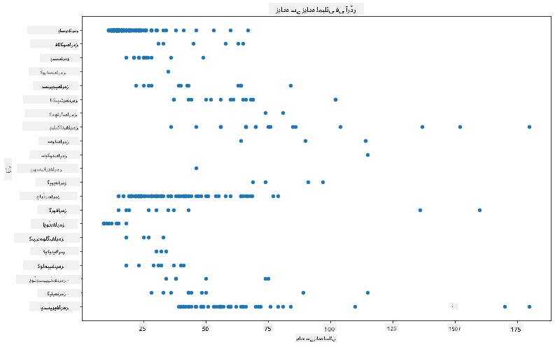

یہ پرندوں کی ترتیب کے لحاظ سے جسمانی لمبائی کی عمومی تقسیم کا جائزہ دیتا ہے، لیکن یہ حقیقی تقسیم کو ظاہر کرنے کا بہترین طریقہ نہیں ہے۔ یہ کام عام طور پر ہسٹگرام بنا کر کیا جاتا ہے۔

## ہسٹگرام کے ساتھ کام کرنا

Matplotlib ہسٹگرامز کے ذریعے ڈیٹا کی تقسیم کو بصری بنانے کے بہترین طریقے پیش کرتا ہے۔ یہ چارٹ بار چارٹ کی طرح ہوتا ہے جہاں تقسیم کو بارز کے اتار چڑھاؤ کے ذریعے دیکھا جا سکتا ہے۔ ہسٹگرام بنانے کے لیے، آپ کو عددی ڈیٹا کی ضرورت ہوتی ہے۔ ہسٹگرام بنانے کے لیے، آپ ایک چارٹ بنا سکتے ہیں جس میں قسم کو 'hist' کے طور پر بیان کیا گیا ہو۔ یہ چارٹ پورے ڈیٹا سیٹ کے عددی ڈیٹا کی حد کے لیے MaxBodyMass کی تقسیم کو ظاہر کرتا ہے۔ ڈیٹا کی صف کو چھوٹے حصوں میں تقسیم کرکے، یہ ڈیٹا کی قدروں کی تقسیم کو ظاہر کر سکتا ہے:

```python
birds['MaxBodyMass'].plot(kind = 'hist', bins = 10, figsize = (12,12))
plt.show()
```
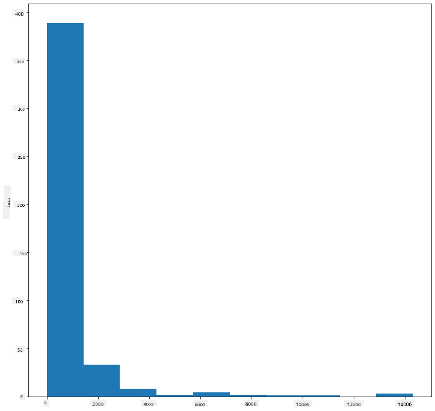

جیسا کہ آپ دیکھ سکتے ہیں، اس ڈیٹا سیٹ میں موجود 400+ پرندوں میں سے زیادہ تر کا زیادہ سے زیادہ جسمانی وزن 2000 سے کم ہے۔ `bins` پیرامیٹر کو زیادہ تعداد، جیسے 30، میں تبدیل کرکے ڈیٹا کے بارے میں مزید بصیرت حاصل کریں:

```python
birds['MaxBodyMass'].plot(kind = 'hist', bins = 30, figsize = (12,12))
plt.show()
```
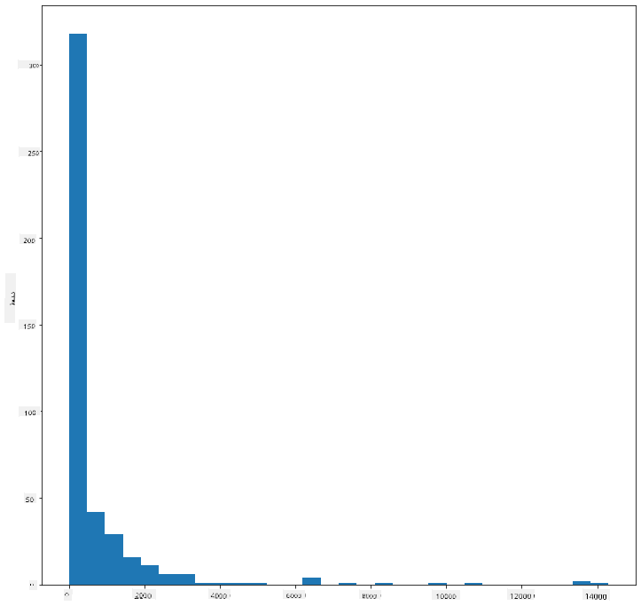

یہ چارٹ تقسیم کو تھوڑا زیادہ تفصیل سے دکھاتا ہے۔ ایک چارٹ جو بائیں طرف کم جھکا ہوا ہو، اس وقت بنایا جا سکتا ہے جب آپ صرف ایک دیے گئے حد کے اندر ڈیٹا منتخب کریں:

اپنے ڈیٹا کو فلٹر کریں تاکہ صرف وہ پرندے شامل ہوں جن کا جسمانی وزن 60 سے کم ہو، اور 40 `bins` دکھائیں:

```python
filteredBirds = birds[(birds['MaxBodyMass'] > 1) & (birds['MaxBodyMass'] < 60)]      
filteredBirds['MaxBodyMass'].plot(kind = 'hist',bins = 40,figsize = (12,12))
plt.show()     
```
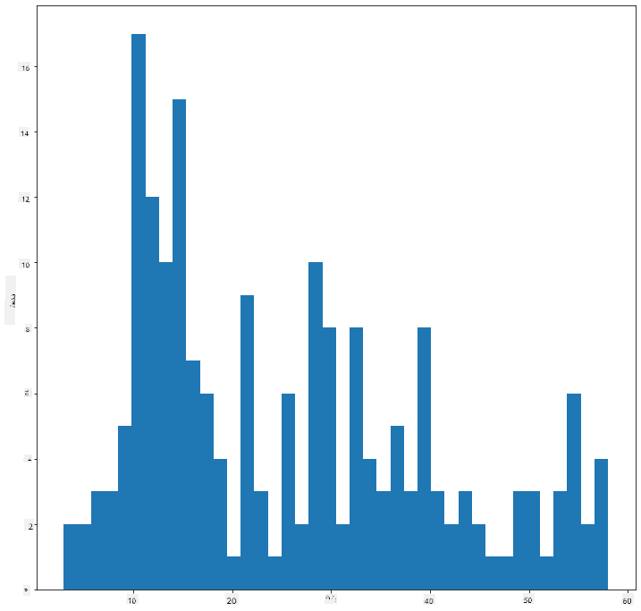

✅ کچھ دوسرے فلٹرز اور ڈیٹا پوائنٹس آزمائیں۔ ڈیٹا کی مکمل تقسیم دیکھنے کے لیے، `['MaxBodyMass']` فلٹر کو ہٹا دیں تاکہ لیبل شدہ تقسیمات دکھائی دیں۔

ہسٹگرام کچھ خوبصورت رنگ اور لیبلنگ کی بہتری بھی پیش کرتا ہے:

دو تقسیمات کے درمیان تعلق کا موازنہ کرنے کے لیے 2D ہسٹگرام بنائیں۔ آئیے `MaxBodyMass` اور `MaxLength` کا موازنہ کریں۔ Matplotlib ایک بلٹ ان طریقہ پیش کرتا ہے جو روشن رنگوں کے ذریعے ہم آہنگی کو ظاہر کرتا ہے:

```python
x = filteredBirds['MaxBodyMass']
y = filteredBirds['MaxLength']

fig, ax = plt.subplots(tight_layout=True)
hist = ax.hist2d(x, y)
```
ایسا لگتا ہے کہ ان دو عناصر کے درمیان ایک متوقع محور کے ساتھ ایک متوقع تعلق ہے، جس میں ہم آہنگی کا ایک خاص طور پر مضبوط نقطہ ہے:

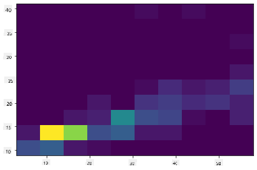

ہسٹگرامز عددی ڈیٹا کے لیے ڈیفالٹ کے طور پر اچھے کام کرتے ہیں۔ اگر آپ کو متن کے ڈیٹا کے مطابق تقسیمات دیکھنے کی ضرورت ہو تو کیا ہوگا؟

## ڈیٹا سیٹ کو متن کے ڈیٹا کے ذریعے تقسیمات کے لیے دریافت کریں

اس ڈیٹا سیٹ میں پرندوں کے زمرے، ان کے جنس، انواع، خاندان، اور تحفظ کی حالت کے بارے میں اچھی معلومات بھی شامل ہیں۔ آئیے اس تحفظ کی معلومات کو دریافت کریں۔ پرندوں کی تقسیم ان کی تحفظ کی حالت کے مطابق کیا ہے؟

> ✅ اس ڈیٹا سیٹ میں تحفظ کی حالت کو بیان کرنے کے لیے کئی مخففات استعمال کیے گئے ہیں۔ یہ مخففات [IUCN ریڈ لسٹ کیٹیگریز](https://www.iucnredlist.org/) سے آتے ہیں، جو ایک تنظیم ہے جو انواع کی حالت کو کیٹلاگ کرتی ہے۔
> 
> - CR: انتہائی خطرے میں
> - EN: خطرے میں
> - EX: معدوم
> - LC: کم سے کم تشویش
> - NT: قریب خطرے میں
> - VU: کمزور

یہ متن پر مبنی قدریں ہیں، لہذا آپ کو ہسٹگرام بنانے کے لیے ایک تبدیلی کرنے کی ضرورت ہوگی۔ فلٹر شدہBirds ڈیٹا فریم کا استعمال کرتے ہوئے، اس کی تحفظ کی حالت کو اس کے کم از کم پروں کے پھیلاؤ کے ساتھ دکھائیں۔ آپ کیا دیکھتے ہیں؟

```python
x1 = filteredBirds.loc[filteredBirds.ConservationStatus=='EX', 'MinWingspan']
x2 = filteredBirds.loc[filteredBirds.ConservationStatus=='CR', 'MinWingspan']
x3 = filteredBirds.loc[filteredBirds.ConservationStatus=='EN', 'MinWingspan']
x4 = filteredBirds.loc[filteredBirds.ConservationStatus=='NT', 'MinWingspan']
x5 = filteredBirds.loc[filteredBirds.ConservationStatus=='VU', 'MinWingspan']
x6 = filteredBirds.loc[filteredBirds.ConservationStatus=='LC', 'MinWingspan']

kwargs = dict(alpha=0.5, bins=20)

plt.hist(x1, **kwargs, color='red', label='Extinct')
plt.hist(x2, **kwargs, color='orange', label='Critically Endangered')
plt.hist(x3, **kwargs, color='yellow', label='Endangered')
plt.hist(x4, **kwargs, color='green', label='Near Threatened')
plt.hist(x5, **kwargs, color='blue', label='Vulnerable')
plt.hist(x6, **kwargs, color='gray', label='Least Concern')

plt.gca().set(title='Conservation Status', ylabel='Min Wingspan')
plt.legend();
```

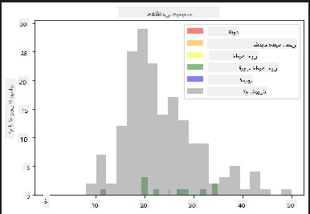

کم از کم پروں کے پھیلاؤ اور تحفظ کی حالت کے درمیان کوئی اچھا تعلق نظر نہیں آتا۔ اس طریقے کا استعمال کرتے ہوئے ڈیٹا سیٹ کے دیگر عناصر کو آزمائیں۔ آپ مختلف فلٹرز بھی آزما سکتے ہیں۔ کیا آپ کو کوئی تعلق نظر آتا ہے؟

## کثافت کے پلاٹس

آپ نے شاید محسوس کیا ہو کہ اب تک ہم نے جو ہسٹگرامز دیکھے ہیں وہ 'قدموں والے' ہیں اور ہموار آرک میں نہیں بہتے۔ ایک ہموار کثافت چارٹ دکھانے کے لیے، آپ کثافت پلاٹ آزما سکتے ہیں۔

کثافت پلاٹس کے ساتھ کام کرنے کے لیے، ایک نئی پلاٹنگ لائبریری، [Seaborn](https://seaborn.pydata.org/generated/seaborn.kdeplot.html) سے واقف ہوں۔

Seaborn کو لوڈ کریں، ایک بنیادی کثافت پلاٹ آزمائیں:

```python
import seaborn as sns
import matplotlib.pyplot as plt
sns.kdeplot(filteredBirds['MinWingspan'])
plt.show()
```
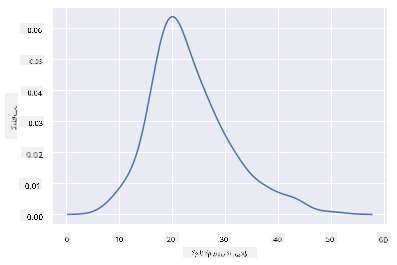

آپ دیکھ سکتے ہیں کہ پلاٹ کم از کم پروں کے پھیلاؤ کے ڈیٹا کے لیے پچھلے پلاٹ کی عکاسی کرتا ہے؛ یہ صرف تھوڑا زیادہ ہموار ہے۔ Seaborn کی دستاویزات کے مطابق، "ہسٹگرام کے مقابلے میں، KDE ایک پلاٹ تیار کر سکتا ہے جو کم بھرا ہوا اور زیادہ قابل تشریح ہو، خاص طور پر جب متعدد تقسیمات کو کھینچتے ہیں۔ لیکن اس میں بگاڑ پیدا کرنے کی صلاحیت ہوتی ہے اگر بنیادی تقسیم محدود یا ہموار نہ ہو۔ ہسٹگرام کی طرح، نمائندگی کے معیار کا انحصار اچھے ہموار پیرامیٹرز کے انتخاب پر بھی ہوتا ہے۔" [ماخذ](https://seaborn.pydata.org/generated/seaborn.kdeplot.html) دوسرے الفاظ میں، آؤٹ لائرز ہمیشہ آپ کے چارٹس کو خراب کر دیں گے۔

اگر آپ دوسرے چارٹ میں بنائی گئی قدموں والی MaxBodyMass لائن کو دوبارہ دیکھنا چاہتے ہیں، تو آپ اسے اس طریقے کو استعمال کرکے بہت اچھی طرح سے ہموار کر سکتے ہیں:

```python
sns.kdeplot(filteredBirds['MaxBodyMass'])
plt.show()
```
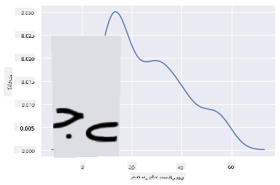

اگر آپ ایک ہموار لیکن زیادہ ہموار لائن چاہتے ہیں، تو `bw_adjust` پیرامیٹر کو ایڈٹ کریں:

```python
sns.kdeplot(filteredBirds['MaxBodyMass'], bw_adjust=.2)
plt.show()
```
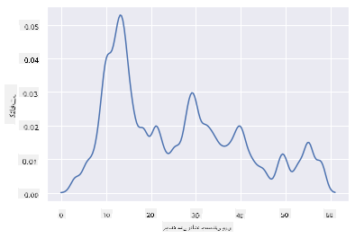

✅ اس قسم کے پلاٹ کے لیے دستیاب پیرامیٹرز کے بارے میں پڑھیں اور تجربہ کریں!

یہ قسم کے چارٹس خوبصورت وضاحتی بصریات پیش کرتے ہیں۔ مثال کے طور پر، چند لائنوں کے کوڈ کے ساتھ، آپ پرندوں کی ترتیب کے لحاظ سے زیادہ سے زیادہ جسمانی وزن کی کثافت دکھا سکتے ہیں:

```python
sns.kdeplot(
   data=filteredBirds, x="MaxBodyMass", hue="Order",
   fill=True, common_norm=False, palette="crest",
   alpha=.5, linewidth=0,
)
```

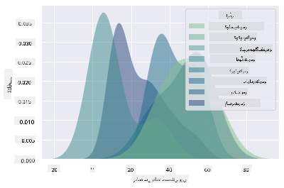

آپ ایک چارٹ میں کئی متغیرات کی کثافت کو بھی نقشہ بنا سکتے ہیں۔ پرندے کی زیادہ سے زیادہ لمبائی اور کم از کم لمبائی کا تحفظ کی حالت کے ساتھ موازنہ کریں:

```python
sns.kdeplot(data=filteredBirds, x="MinLength", y="MaxLength", hue="ConservationStatus")
```

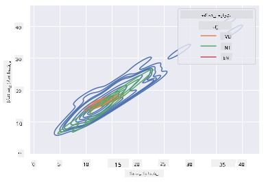

شاید یہ تحقیق کرنے کے قابل ہو کہ آیا پرندوں کی لمبائی کے مطابق 'کمزور' پرندوں کا کلسٹر معنی خیز ہے یا نہیں۔

## 🚀 چیلنج

ہسٹگرامز بنیادی اسکیٹر پلاٹس، بار چارٹس، یا لائن چارٹس کے مقابلے میں زیادہ نفیس قسم کے چارٹس ہیں۔ انٹرنیٹ پر تلاش کریں کہ ہسٹگرامز کے اچھے استعمال کی مثالیں کہاں ہیں۔ وہ کیسے استعمال کیے جاتے ہیں، کیا ظاہر کرتے ہیں، اور کن شعبوں یا تحقیق کے علاقوں میں ان کا رجحان ہوتا ہے؟

## [سبق کے بعد کا کوئز](https://ff-quizzes.netlify.app/en/ds/)

## جائزہ اور خود مطالعہ

اس سبق میں، آپ نے Matplotlib استعمال کیا اور Seaborn کے ساتھ کام کرنا شروع کیا تاکہ زیادہ نفیس چارٹس دکھائے جا سکیں۔ Seaborn میں `kdeplot` پر تحقیق کریں، جو "ایک یا زیادہ جہتوں میں مسلسل احتمال کثافت کا منحنی خط" ہے۔ [دستاویزات](https://seaborn.pydata.org/generated/seaborn.kdeplot.html) کو پڑھیں تاکہ یہ سمجھ سکیں کہ یہ کیسے کام کرتا ہے۔

## اسائنمنٹ

[اپنی مہارتیں آزمائیں](assignment.md)

---

**ڈسکلیمر**:  
یہ دستاویز AI ترجمہ سروس [Co-op Translator](https://github.com/Azure/co-op-translator) کا استعمال کرتے ہوئے ترجمہ کی گئی ہے۔ ہم درستگی کے لیے کوشش کرتے ہیں، لیکن براہ کرم آگاہ رہیں کہ خودکار ترجمے میں غلطیاں یا غیر درستیاں ہو سکتی ہیں۔ اصل دستاویز کو اس کی اصل زبان میں مستند ذریعہ سمجھا جانا چاہیے۔ اہم معلومات کے لیے، پیشہ ور انسانی ترجمہ کی سفارش کی جاتی ہے۔ ہم اس ترجمے کے استعمال سے پیدا ہونے والی کسی بھی غلط فہمی یا غلط تشریح کے ذمہ دار نہیں ہیں۔