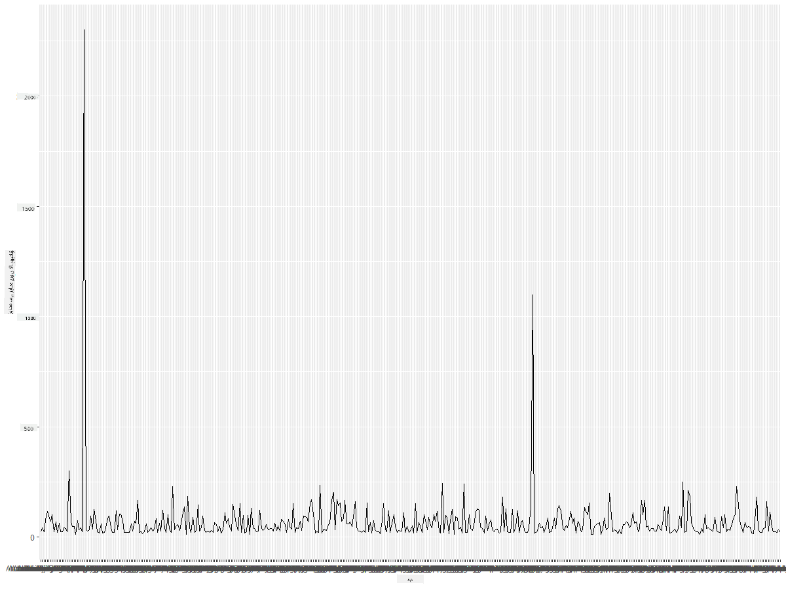
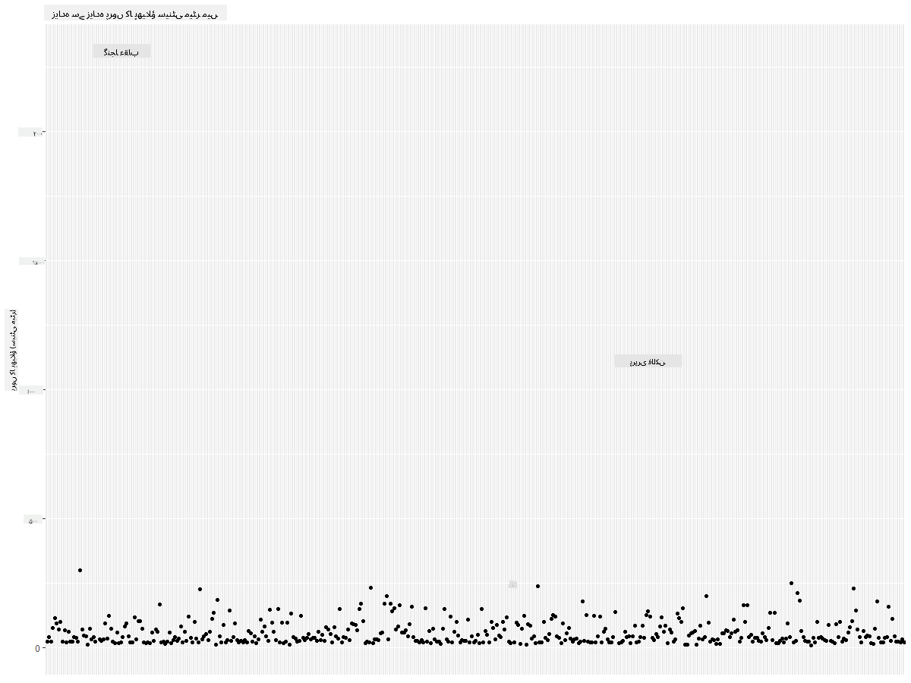
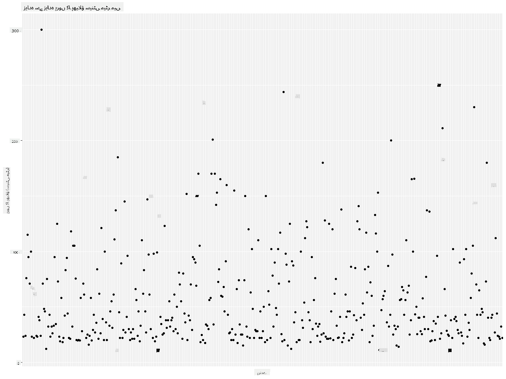
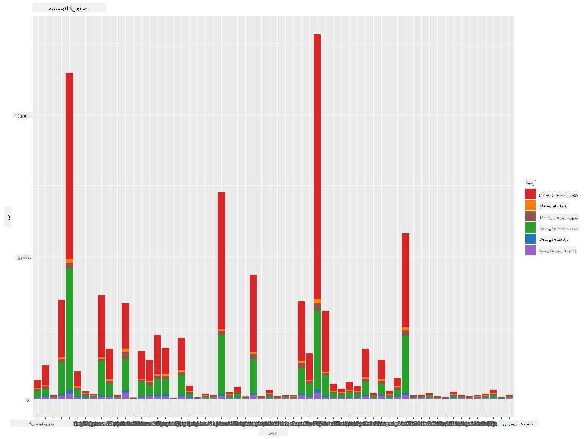
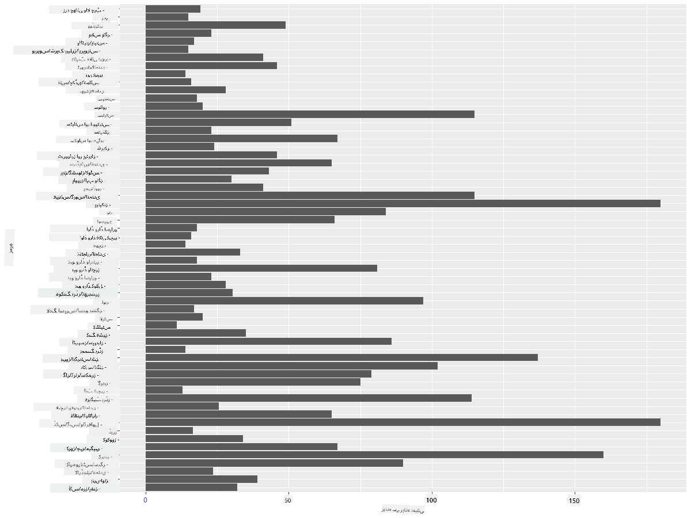
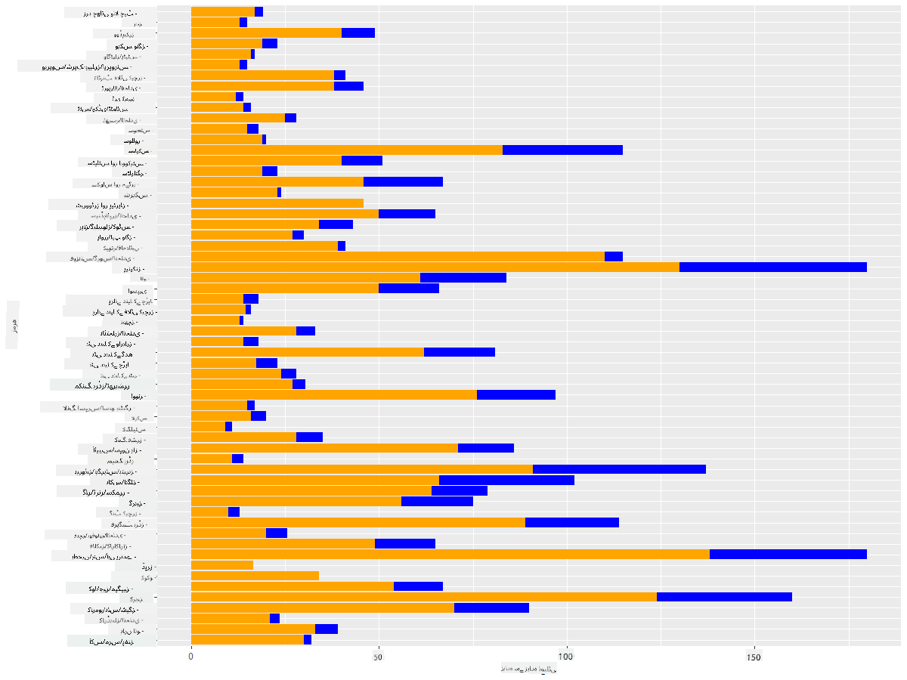

<!--
CO_OP_TRANSLATOR_METADATA:
{
  "original_hash": "22acf28f518a4769ea14fa42f4734b9f",
  "translation_date": "2025-08-27T10:30:44+00:00",
  "source_file": "3-Data-Visualization/R/09-visualization-quantities/README.md",
  "language_code": "ur"
}
-->
# مقداروں کی بصری نمائندگی
| کی طرف سے اسکیچ نوٹ ](https://github.com/microsoft/Data-Science-For-Beginners/blob/main/sketchnotes/09-Visualizing-Quantities.png)|
|:---:|
| مقداروں کی بصری نمائندگی - _[@nitya](https://twitter.com/nitya) کی طرف سے اسکیچ نوٹ_ |

اس سبق میں آپ سیکھیں گے کہ کس طرح مختلف R پیکجز اور لائبریریوں کا استعمال کرتے ہوئے مقدار کے تصور کے ارد گرد دلچسپ بصری نمائندگی تخلیق کی جا سکتی ہے۔ منیسوٹا کے پرندوں کے بارے میں صاف شدہ ڈیٹا سیٹ کا استعمال کرتے ہوئے، آپ مقامی جنگلی حیات کے بارے میں بہت سی دلچسپ معلومات حاصل کر سکتے ہیں۔  
## [لیکچر سے پہلے کا کوئز](https://purple-hill-04aebfb03.1.azurestaticapps.net/quiz/16)

## ggplot2 کے ساتھ پروں کے پھیلاؤ کا مشاہدہ کریں
ایک بہترین لائبریری جو مختلف قسم کے سادہ اور پیچیدہ چارٹس اور گراف بنانے کے لیے استعمال ہوتی ہے وہ ہے [ggplot2](https://cran.r-project.org/web/packages/ggplot2/index.html)۔ عام طور پر، ان لائبریریوں کا استعمال کرتے ہوئے ڈیٹا کو پلاٹ کرنے کا عمل شامل ہوتا ہے: ڈیٹا فریم کے ان حصوں کی شناخت کرنا جنہیں آپ نشانہ بنانا چاہتے ہیں، ڈیٹا پر ضروری تبدیلیاں کرنا، اس کے x اور y محور کی اقدار تفویض کرنا، چارٹ کی قسم کا انتخاب کرنا، اور پھر چارٹ دکھانا۔

`ggplot2` ایک ایسا نظام ہے جو گرافکس کو وضاحتی انداز میں تخلیق کرتا ہے، جو گرافکس کے گرامر پر مبنی ہے۔ [گرافکس کا گرامر](https://en.wikipedia.org/wiki/Ggplot2) ڈیٹا ویژولائزیشن کے لیے ایک عمومی اسکیم ہے جو گراف کو معنوی اجزاء جیسے اسکیلز اور لیئرز میں تقسیم کرتی ہے۔ دوسرے الفاظ میں، کم کوڈ کے ساتھ یک متغیری یا کثیر متغیری ڈیٹا کے لیے گراف اور چارٹس بنانے میں آسانی `ggplot2` کو R میں بصری نمائندگی کے لیے سب سے زیادہ مقبول پیکج بناتی ہے۔ صارف `ggplot2` کو بتاتا ہے کہ متغیرات کو جمالیات کے ساتھ کیسے نقشہ بنانا ہے، گرافیکل پرائمٹیوز کو استعمال کرنا ہے، اور باقی کام `ggplot2` خود کرتا ہے۔

> ✅ چارٹ = ڈیٹا + جمالیات + جیومیٹری
> - ڈیٹا سے مراد ڈیٹا سیٹ ہے
> - جمالیات ان متغیرات کو ظاہر کرتی ہیں جن کا مطالعہ کیا جانا ہے (x اور y متغیرات)
> - جیومیٹری چارٹ کی قسم کو ظاہر کرتی ہے (لائن چارٹ، بار چارٹ، وغیرہ)

اپنے ڈیٹا اور چارٹ کے ذریعے کہانی سنانے کے لیے بہترین جیومیٹری (چارٹ کی قسم) کا انتخاب کریں۔

> - رجحانات کا تجزیہ کرنے کے لیے: لائن، کالم
> - اقدار کا موازنہ کرنے کے لیے: بار، کالم، پائی، اسکیٹر چارٹ
> - حصوں کے پورے سے تعلق کو ظاہر کرنے کے لیے: پائی
> - ڈیٹا کی تقسیم کو ظاہر کرنے کے لیے: اسکیٹر چارٹ، بار
> - اقدار کے درمیان تعلقات کو ظاہر کرنے کے لیے: لائن، اسکیٹر چارٹ، ببل

✅ آپ ggplot2 کے لیے یہ وضاحتی [چیٹ شیٹ](https://nyu-cdsc.github.io/learningr/assets/data-visualization-2.1.pdf) بھی دیکھ سکتے ہیں۔

## پرندوں کے پروں کے پھیلاؤ کے بارے میں لائن چارٹ بنائیں

R کنسول کھولیں اور ڈیٹا سیٹ درآمد کریں۔  
> نوٹ: ڈیٹا سیٹ اس ریپو کی جڑ میں `/data` فولڈر میں محفوظ ہے۔

آئیے ڈیٹا سیٹ درآمد کریں اور ڈیٹا کے ابتدائی پانچ قطاروں کا مشاہدہ کریں۔

```r
birds <- read.csv("../../data/birds.csv",fileEncoding="UTF-8-BOM")
head(birds)
```  
ڈیٹا کے ابتدائی حصے میں متن اور اعداد کا امتزاج ہے:

|      | نام                          | سائنسی نام             | زمرہ                  | آرڈر        | خاندان   | جینس       | تحفظ کی حالت       | کم از کم لمبائی | زیادہ سے زیادہ لمبائی | کم از کم جسمانی وزن | زیادہ سے زیادہ جسمانی وزن | کم از کم پروں کا پھیلاؤ | زیادہ سے زیادہ پروں کا پھیلاؤ |
| ---: | :--------------------------- | :--------------------- | :-------------------- | :----------- | :------- | :---------- | :----------------- | --------: | --------: | ----------: | ----------: | ----------: | ----------: |
|    0 | بلیک بیلیڈ وسلنگ ڈک         | Dendrocygna autumnalis | بطخ/گیز/واٹر فاول     | Anseriformes | Anatidae | Dendrocygna | LC                 |        47 |        56 |         652 |        1020 |          76 |          94 |
|    1 | فلویس وسلنگ ڈک              | Dendrocygna bicolor    | بطخ/گیز/واٹر فاول     | Anseriformes | Anatidae | Dendrocygna | LC                 |        45 |        53 |         712 |        1050 |          85 |          93 |
|    2 | سنو گیز                     | Anser caerulescens     | بطخ/گیز/واٹر فاول     | Anseriformes | Anatidae | Anser       | LC                 |        64 |        79 |        2050 |        4050 |         135 |         165 |
|    3 | روس کا گیز                  | Anser rossii           | بطخ/گیز/واٹر فاول     | Anseriformes | Anatidae | Anser       | LC                 |      57.3 |        64 |        1066 |        1567 |         113 |         116 |
|    4 | گریٹر وائٹ فرنٹڈ گیز        | Anser albifrons        | بطخ/گیز/واٹر فاول     | Anseriformes | Anatidae | Anser       | LC                 |        64 |        81 |        1930 |        3310 |         130 |         165 |

آئیے کچھ عددی ڈیٹا کو ایک بنیادی لائن چارٹ کے ذریعے پلاٹ کریں۔ فرض کریں کہ آپ ان دلچسپ پرندوں کے زیادہ سے زیادہ پروں کے پھیلاؤ کا نظارہ چاہتے ہیں۔

```r
install.packages("ggplot2")
library("ggplot2")
ggplot(data=birds, aes(x=Name, y=MaxWingspan,group=1)) +
  geom_line() 
```  
یہاں، آپ `ggplot2` پیکج انسٹال کرتے ہیں اور پھر اسے `library("ggplot2")` کمانڈ کے ذریعے ورک اسپیس میں درآمد کرتے ہیں۔ ggplot میں کوئی بھی چارٹ پلاٹ کرنے کے لیے، `ggplot()` فنکشن استعمال کیا جاتا ہے اور آپ ڈیٹا سیٹ، x اور y متغیرات کو صفات کے طور پر تفویض کرتے ہیں۔ اس صورت میں، ہم `geom_line()` فنکشن استعمال کرتے ہیں کیونکہ ہمارا مقصد ایک لائن چارٹ بنانا ہے۔



آپ فوراً کیا نوٹ کرتے ہیں؟ کم از کم ایک آؤٹ لائر موجود ہے - یہ پروں کا پھیلاؤ کافی حیران کن ہے! 2000+ سینٹی میٹر پروں کا پھیلاؤ 20 میٹر سے زیادہ کے برابر ہے - کیا منیسوٹا میں پیٹروڈیکٹائلز گھوم رہے ہیں؟ آئیے تحقیق کریں۔

جبکہ آپ ایکسل میں جلدی سے آؤٹ لائرز کو ترتیب دے سکتے ہیں، جو شاید ٹائپوز ہیں، پلاٹ کے اندر سے کام کرتے ہوئے بصری نمائندگی کے عمل کو جاری رکھیں۔

x محور پر لیبلز شامل کریں تاکہ یہ ظاہر ہو کہ کس قسم کے پرندے زیر بحث ہیں:

```r
ggplot(data=birds, aes(x=Name, y=MaxWingspan,group=1)) +
  geom_line() +
  theme(axis.text.x = element_text(angle = 45, hjust=1))+
  xlab("Birds") +
  ylab("Wingspan (CM)") +
  ggtitle("Max Wingspan in Centimeters")
```  
ہم `theme` میں زاویہ تفویض کرتے ہیں اور `xlab()` اور `ylab()` میں x اور y محور کے لیبلز تفویض کرتے ہیں۔ `ggtitle()` چارٹ/گراف کو ایک نام دیتا ہے۔


لیبلز کو 45 ڈگری پر گھمانے کے باوجود، پڑھنے کے لیے بہت زیادہ ہیں۔ آئیے ایک مختلف حکمت عملی آزمائیں: صرف آؤٹ لائرز کو لیبل کریں اور لیبلز کو چارٹ کے اندر سیٹ کریں۔ آپ لیبلنگ کے لیے اسکیٹر چارٹ استعمال کر سکتے ہیں:

```r
ggplot(data=birds, aes(x=Name, y=MaxWingspan,group=1)) +
  geom_point() +
  geom_text(aes(label=ifelse(MaxWingspan>500,as.character(Name),'')),hjust=0,vjust=0) + 
  theme(axis.title.x=element_blank(), axis.text.x=element_blank(), axis.ticks.x=element_blank())
  ylab("Wingspan (CM)") +
  ggtitle("Max Wingspan in Centimeters") + 
```  
یہاں کیا ہو رہا ہے؟ آپ نے `geom_point()` فنکشن استعمال کیا تاکہ اسکیٹر پوائنٹس پلاٹ کیے جا سکیں۔ اس کے ساتھ، آپ نے ان پرندوں کے لیے لیبلز شامل کیے جن کے `MaxWingspan > 500` تھے اور x محور پر لیبلز کو چھپا دیا تاکہ چارٹ کو صاف رکھا جا سکے۔

آپ کیا دریافت کرتے ہیں؟



## اپنے ڈیٹا کو فلٹر کریں

بالڈ ایگل اور پریری فالکن، جو شاید بہت بڑے پرندے ہیں، غلط لیبل لگے ہوئے معلوم ہوتے ہیں، ان کے زیادہ سے زیادہ پروں کے پھیلاؤ میں ایک اضافی 0 شامل ہے۔ یہ ممکن نہیں کہ آپ 25 میٹر پروں کے پھیلاؤ والے بالڈ ایگل سے ملیں، لیکن اگر ایسا ہو تو ہمیں ضرور بتائیں! آئیے ان دو آؤٹ لائرز کے بغیر ایک نیا ڈیٹا فریم بنائیں:

```r
birds_filtered <- subset(birds, MaxWingspan < 500)

ggplot(data=birds_filtered, aes(x=Name, y=MaxWingspan,group=1)) +
  geom_point() +
  ylab("Wingspan (CM)") +
  xlab("Birds") +
  ggtitle("Max Wingspan in Centimeters") + 
  geom_text(aes(label=ifelse(MaxWingspan>500,as.character(Name),'')),hjust=0,vjust=0) +
  theme(axis.text.x=element_blank(), axis.ticks.x=element_blank())
```  
ہم نے ایک نیا ڈیٹا فریم `birds_filtered` بنایا اور پھر ایک اسکیٹر چارٹ پلاٹ کیا۔ آؤٹ لائرز کو فلٹر کرنے سے، آپ کا ڈیٹا اب زیادہ مربوط اور قابل فہم ہو گیا ہے۔



اب جب کہ ہمارے پاس پروں کے پھیلاؤ کے لحاظ سے کم از کم ایک صاف شدہ ڈیٹا سیٹ موجود ہے، آئیے ان پرندوں کے بارے میں مزید دریافت کریں۔

جبکہ لائن اور اسکیٹر چارٹس ڈیٹا کی اقدار اور ان کی تقسیم کے بارے میں معلومات ظاہر کر سکتے ہیں، ہم اس ڈیٹا سیٹ میں موجود اقدار کے بارے میں سوچنا چاہتے ہیں۔ آپ بصری نمائندگی تخلیق کر سکتے ہیں تاکہ مقدار کے بارے میں درج ذیل سوالات کے جوابات دیے جا سکیں:

> پرندوں کے کتنے زمرے ہیں، اور ان کی تعداد کیا ہے؟  
> کتنے پرندے معدوم، خطرے میں، نایاب، یا عام ہیں؟  
> لینیس کے اصطلاحات میں مختلف جینس اور آرڈرز کی تعداد کیا ہے؟  
## بار چارٹس کا جائزہ لیں

جب آپ کو ڈیٹا کے گروپنگز دکھانے کی ضرورت ہو تو بار چارٹس عملی ہوتے ہیں۔ آئیے اس ڈیٹا سیٹ میں موجود پرندوں کے زمرے کا جائزہ لیں تاکہ یہ دیکھ سکیں کہ تعداد کے لحاظ سے کون سا سب سے عام ہے۔  
آئیے فلٹر شدہ ڈیٹا پر ایک بار چارٹ بنائیں۔

```r
install.packages("dplyr")
install.packages("tidyverse")

library(lubridate)
library(scales)
library(dplyr)
library(ggplot2)
library(tidyverse)

birds_filtered %>% group_by(Category) %>%
  summarise(n=n(),
  MinLength = mean(MinLength),
  MaxLength = mean(MaxLength),
  MinBodyMass = mean(MinBodyMass),
  MaxBodyMass = mean(MaxBodyMass),
  MinWingspan=mean(MinWingspan),
  MaxWingspan=mean(MaxWingspan)) %>% 
  gather("key", "value", - c(Category, n)) %>%
  ggplot(aes(x = Category, y = value, group = key, fill = key)) +
  geom_bar(stat = "identity") +
  scale_fill_manual(values = c("#D62728", "#FF7F0E", "#8C564B","#2CA02C", "#1F77B4", "#9467BD")) +                   
  xlab("Category")+ggtitle("Birds of Minnesota")

```  
مندرجہ ذیل کوڈ میں، ہم [dplyr](https://www.rdocumentation.org/packages/dplyr/versions/0.7.8) اور [lubridate](https://www.rdocumentation.org/packages/lubridate/versions/1.8.0) پیکجز انسٹال کرتے ہیں تاکہ ڈیٹا کو جوڑنے اور گروپ کرنے میں مدد ملے تاکہ ایک اسٹیکڈ بار چارٹ پلاٹ کیا جا سکے۔ پہلے، آپ ڈیٹا کو پرندے کے `Category` کے لحاظ سے گروپ کرتے ہیں اور پھر `MinLength`, `MaxLength`, `MinBodyMass`, `MaxBodyMass`, `MinWingspan`, `MaxWingspan` کالمز کو خلاصہ کرتے ہیں۔ پھر، `ggplot2` پیکج کا استعمال کرتے ہوئے بار چارٹ پلاٹ کریں اور مختلف زمرے کے لیے رنگ اور لیبلز تفویض کریں۔



یہ بار چارٹ، تاہم، ناقابل پڑھائی ہے کیونکہ بہت زیادہ غیر گروپ شدہ ڈیٹا موجود ہے۔ آپ کو صرف وہ ڈیٹا منتخب کرنے کی ضرورت ہے جسے آپ پلاٹ کرنا چاہتے ہیں، تو آئیے پرندے کے زمرے کی بنیاد پر لمبائی کا جائزہ لیں۔

اپنے ڈیٹا کو صرف پرندے کے زمرے شامل کرنے کے لیے فلٹر کریں۔

چونکہ بہت سے زمرے ہیں، آپ اس چارٹ کو عمودی طور پر دکھا سکتے ہیں اور تمام ڈیٹا کو ایڈجسٹ کرنے کے لیے اس کی اونچائی کو ایڈجسٹ کر سکتے ہیں:

```r
birds_count<-dplyr::count(birds_filtered, Category, sort = TRUE)
birds_count$Category <- factor(birds_count$Category, levels = birds_count$Category)
ggplot(birds_count,aes(Category,n))+geom_bar(stat="identity")+coord_flip()
```  
آپ پہلے `Category` کالم میں منفرد اقدار کی گنتی کرتے ہیں اور پھر انہیں ایک نئے ڈیٹا فریم `birds_count` میں ترتیب دیتے ہیں۔ یہ ترتیب شدہ ڈیٹا پھر اسی سطح پر فیکٹر کیا جاتا ہے تاکہ اسے ترتیب شدہ طریقے سے پلاٹ کیا جا سکے۔ `ggplot2` کا استعمال کرتے ہوئے آپ پھر ڈیٹا کو بار چارٹ میں پلاٹ کرتے ہیں۔ `coord_flip()` افقی بارز پلاٹ کرتا ہے۔


یہ بار چارٹ پرندوں کے ہر زمرے میں تعداد کا ایک اچھا نظارہ دکھاتا ہے۔ ایک نظر میں، آپ دیکھتے ہیں کہ اس علاقے میں سب سے زیادہ تعداد میں پرندے بطخ/گیز/واٹر فاول کے زمرے میں ہیں۔ منیسوٹا '10,000 جھیلوں کی زمین' ہے، لہذا یہ حیرت انگیز نہیں ہے!

✅ اس ڈیٹا سیٹ پر کچھ اور گنتیاں آزمائیں۔ کیا آپ کو کچھ حیران کرتا ہے؟

## ڈیٹا کا موازنہ

آپ گروپ شدہ ڈیٹا کے مختلف موازنات نئے محور بنا کر آزما سکتے ہیں۔ پرندے کے زمرے کی بنیاد پر پرندے کی زیادہ سے زیادہ لمبائی کا موازنہ آزمائیں:

```r
birds_grouped <- birds_filtered %>%
  group_by(Category) %>%
  summarise(
  MaxLength = max(MaxLength, na.rm = T),
  MinLength = max(MinLength, na.rm = T)
           ) %>%
  arrange(Category)
  
ggplot(birds_grouped,aes(Category,MaxLength))+geom_bar(stat="identity")+coord_flip()
```  
ہم `birds_filtered` ڈیٹا کو `Category` کے لحاظ سے گروپ کرتے ہیں اور پھر ایک بار چارٹ پلاٹ کرتے ہیں۔



یہاں کچھ حیران کن نہیں ہے: ہمینگ برڈز کی زیادہ سے زیادہ لمبائی پیلیکنز یا گیز کے مقابلے میں سب سے کم ہے۔ یہ اچھا ہے جب ڈیٹا منطقی طور پر سمجھ میں آتا ہے!

آپ بار چارٹس کی مزید دلچسپ بصری نمائندگی تخلیق کر سکتے ہیں ڈیٹا کو سپر امپوز کر کے۔ آئیے ایک دیے گئے پرندے کے زمرے پر کم از کم اور زیادہ سے زیادہ لمبائی کو سپر امپوز کریں:

```r
ggplot(data=birds_grouped, aes(x=Category)) +
  geom_bar(aes(y=MaxLength), stat="identity", position ="identity",  fill='blue') +
  geom_bar(aes(y=MinLength), stat="identity", position="identity", fill='orange')+
  coord_flip()
```  


## 🚀 چیلنج

یہ پرندوں کا ڈیٹا سیٹ ایک خاص ماحولیاتی نظام کے اندر مختلف قسم کے پرندوں کے بارے میں معلومات کا خزانہ پیش کرتا ہے۔ انٹرنیٹ پر تلاش کریں اور دیکھیں کہ کیا آپ پرندوں سے متعلق دیگر ڈیٹا سیٹس تلاش کر سکتے ہیں۔ ان پرندوں کے ارد گرد چارٹس اور گراف بنانا مشق کریں تاکہ وہ حقائق دریافت کریں جنہیں آپ پہلے نہیں جانتے تھے۔  
## [لیکچر کے بعد کا کوئز](https://purple-hill-04aebfb03.1.azurestaticapps.net/quiz/17)

## جائزہ اور خود مطالعہ

اس پہلے سبق نے آپ کو `ggplot2` کا استعمال کرتے ہوئے مقداروں کو بصری طور پر ظاہر کرنے کے بارے میں کچھ معلومات دی ہیں۔ ڈیٹا سیٹس کے ساتھ کام کرنے کے دیگر طریقوں کے بارے میں تحقیق کریں۔ تحقیق کریں اور ایسے ڈیٹا سیٹس تلاش کریں جنہیں آپ دیگر پیکجز جیسے [Lattice](https://stat.ethz.ch/R-manual/R-devel/library/lattice/html/Lattice.html) اور [Plotly](https://github.com/plotly/plotly.R#readme) کا استعمال کرتے ہوئے بصری طور پر ظاہر کر سکتے ہیں۔

## اسائنمنٹ  
[لائنز، اسکیٹرز، اور بارز](assignment.md)  

---

**ڈسکلیمر**:  
یہ دستاویز AI ترجمہ سروس [Co-op Translator](https://github.com/Azure/co-op-translator) کا استعمال کرتے ہوئے ترجمہ کی گئی ہے۔ ہم درستگی کے لیے پوری کوشش کرتے ہیں، لیکن براہ کرم آگاہ رہیں کہ خودکار ترجمے میں غلطیاں یا خامیاں ہو سکتی ہیں۔ اصل دستاویز، جو اس کی اصل زبان میں ہے، کو مستند ذریعہ سمجھا جانا چاہیے۔ اہم معلومات کے لیے، پیشہ ور انسانی ترجمہ کی سفارش کی جاتی ہے۔ اس ترجمے کے استعمال سے پیدا ہونے والی کسی بھی غلط فہمی یا غلط تشریح کے لیے ہم ذمہ دار نہیں ہیں۔