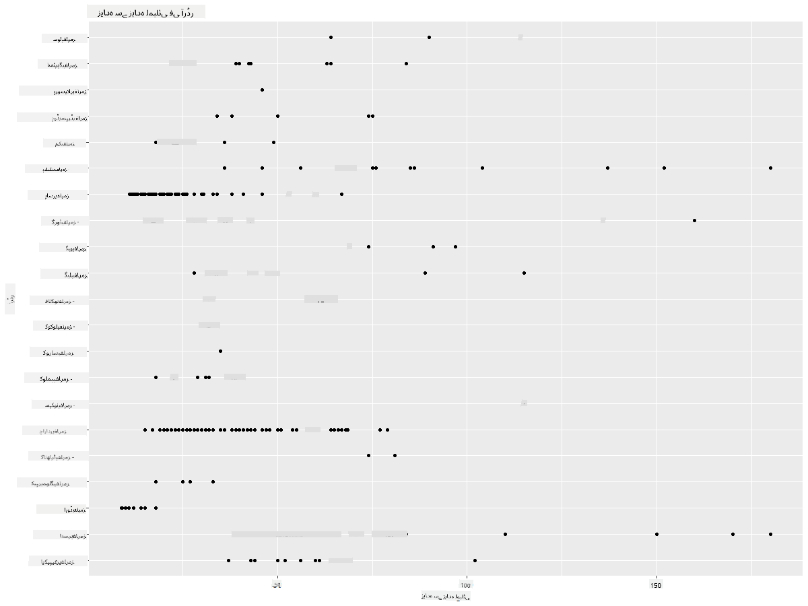
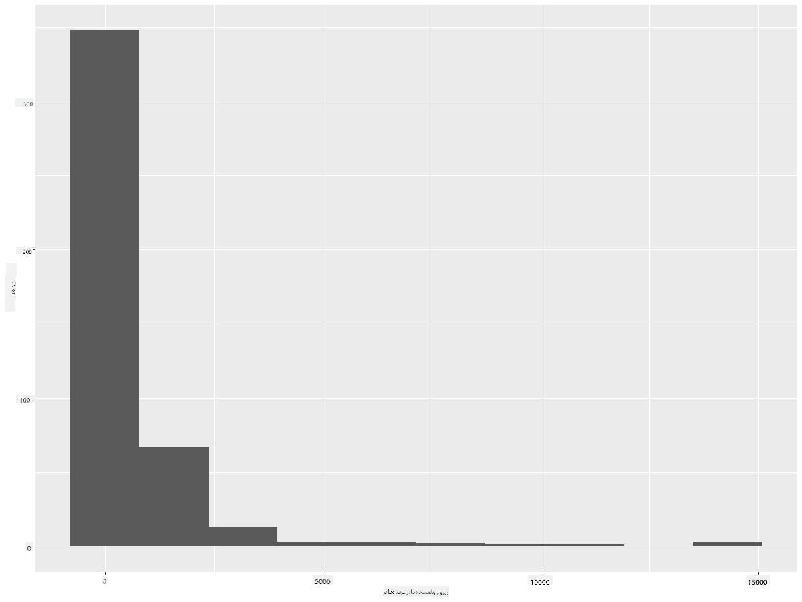
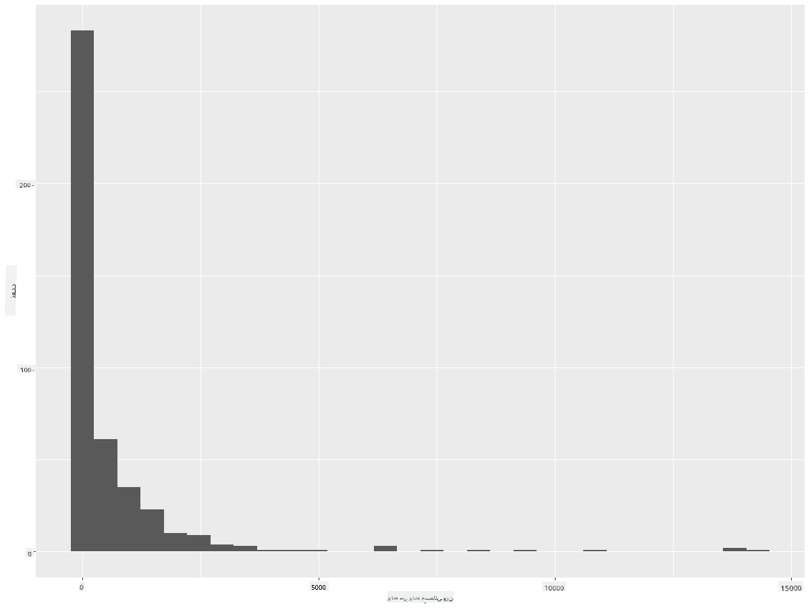
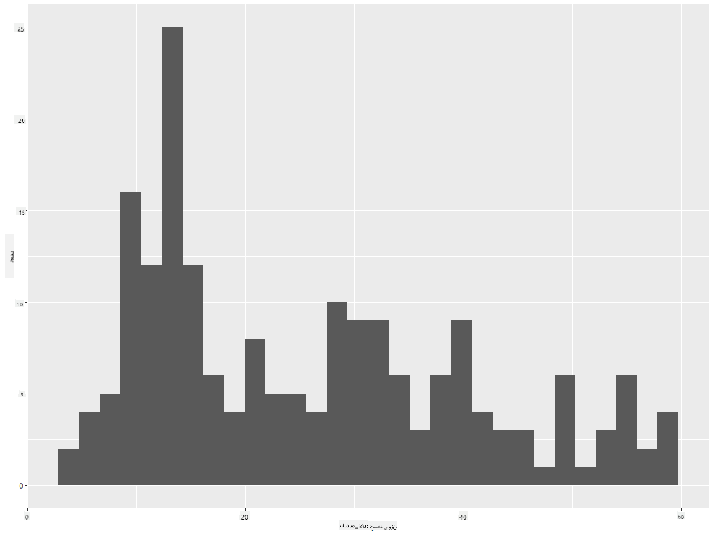
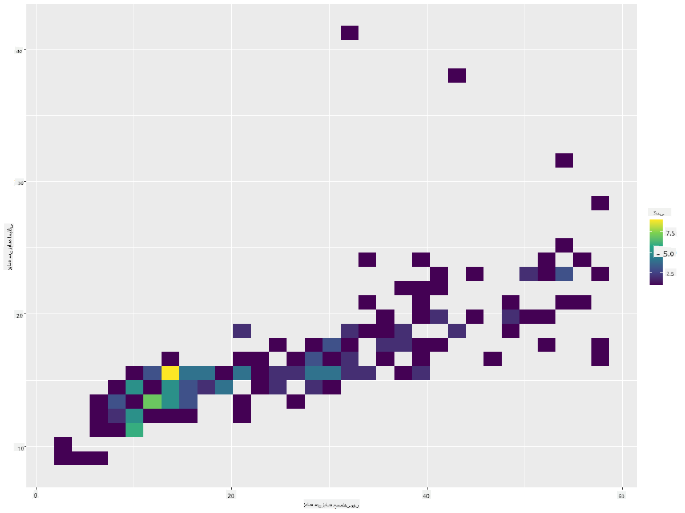
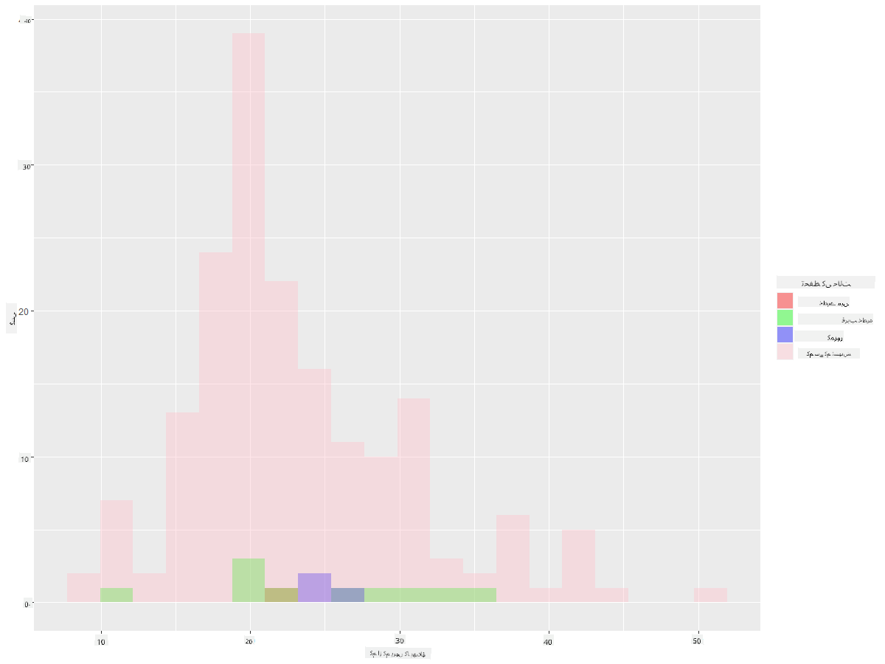
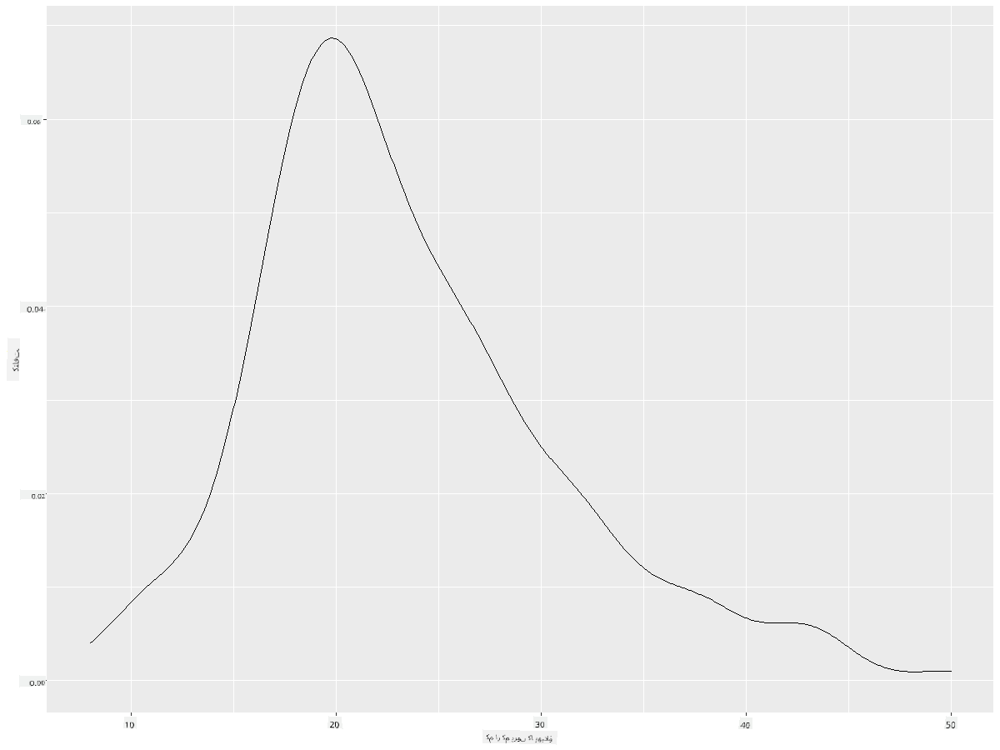
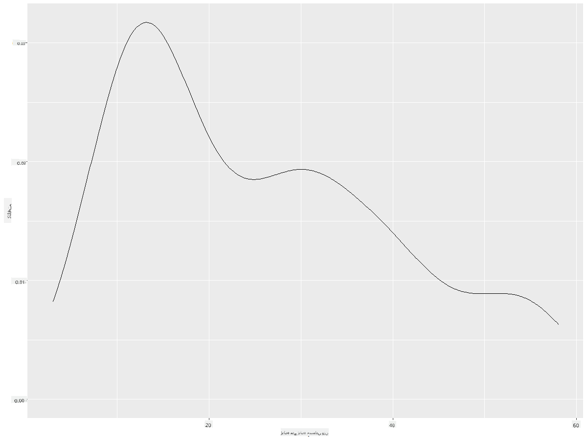
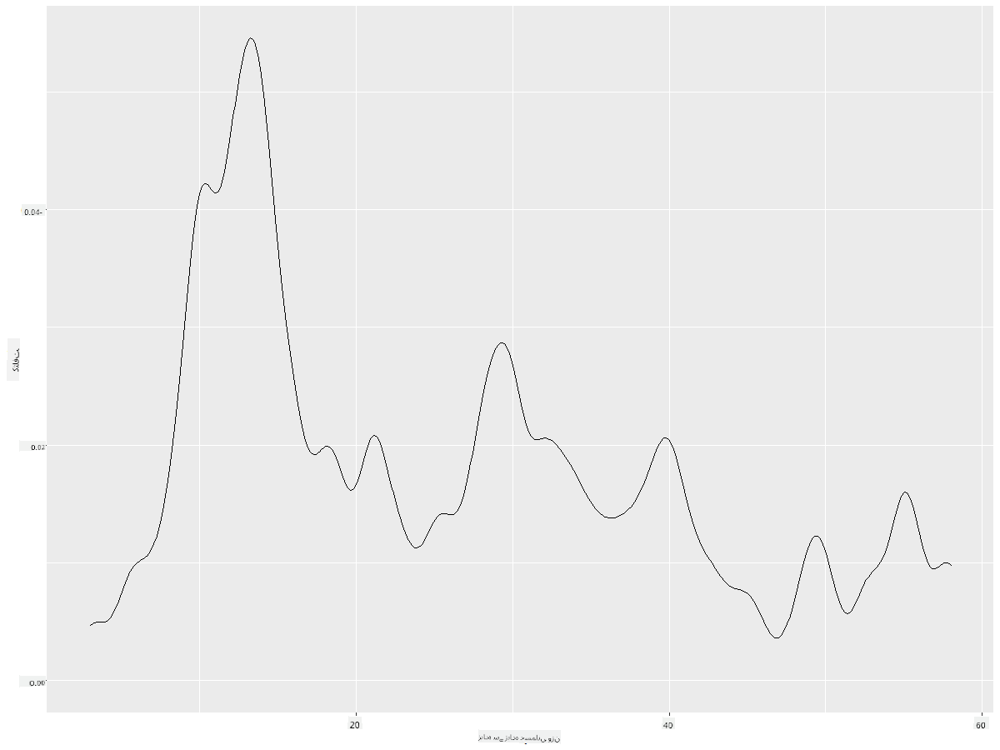
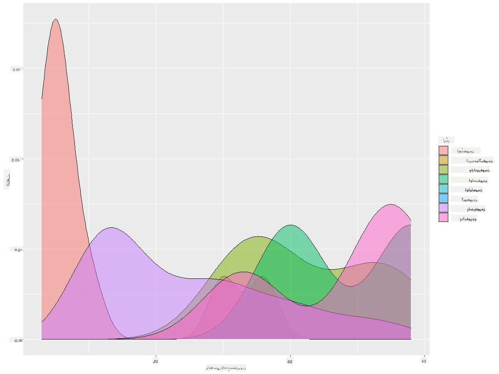

<!--
CO_OP_TRANSLATOR_METADATA:
{
  "original_hash": "ea67c0c40808fd723594de6896c37ccf",
  "translation_date": "2025-08-27T10:22:39+00:00",
  "source_file": "3-Data-Visualization/R/10-visualization-distributions/README.md",
  "language_code": "ur"
}
-->
# تقسیمات کو بصری بنانا

| کی طرف سے اسکیچ نوٹ ](https://github.com/microsoft/Data-Science-For-Beginners/blob/main/sketchnotes/10-Visualizing-Distributions.png)|
|:---:|
| تقسیمات کو بصری بنانا - _[@nitya](https://twitter.com/nitya) کی طرف سے اسکیچ نوٹ_ |

پچھلے سبق میں، آپ نے منیسوٹا کے پرندوں کے بارے میں ایک ڈیٹا سیٹ کے کچھ دلچسپ حقائق سیکھے۔ آپ نے آؤٹ لائرز کو بصری بنا کر کچھ غلط ڈیٹا پایا اور پرندوں کی اقسام کے درمیان زیادہ سے زیادہ لمبائی کے فرق کو دیکھا۔

## [سبق سے پہلے کا کوئز](https://purple-hill-04aebfb03.1.azurestaticapps.net/quiz/18)
## پرندوں کے ڈیٹا سیٹ کو دریافت کریں

ڈیٹا کو سمجھنے کا ایک اور طریقہ یہ ہے کہ اس کی تقسیم کو دیکھیں، یعنی ڈیٹا کو ایک محور پر کیسے ترتیب دیا گیا ہے۔ مثال کے طور پر، شاید آپ منیسوٹا کے پرندوں کے زیادہ سے زیادہ پروں کے پھیلاؤ یا زیادہ سے زیادہ جسمانی وزن کی عمومی تقسیم کے بارے میں جاننا چاہتے ہیں۔

آئیے اس ڈیٹا سیٹ میں ڈیٹا کی تقسیم کے بارے میں کچھ حقائق دریافت کرتے ہیں۔ اپنے R کنسول میں، `ggplot2` اور ڈیٹا بیس کو درآمد کریں۔ پچھلے موضوع کی طرح ڈیٹا بیس سے آؤٹ لائرز کو ہٹا دیں۔

```r
library(ggplot2)

birds <- read.csv("../../data/birds.csv",fileEncoding="UTF-8-BOM")

birds_filtered <- subset(birds, MaxWingspan < 500)
head(birds_filtered)
```
|      | نام                          | سائنسی نام             | زمرہ                  | آرڈر        | خاندان   | جینس       | تحفظ کی حالت       | کم از کم لمبائی | زیادہ سے زیادہ لمبائی | کم از کم جسمانی وزن | زیادہ سے زیادہ جسمانی وزن | کم از کم پروں کا پھیلاؤ | زیادہ سے زیادہ پروں کا پھیلاؤ |
| ---: | :--------------------------- | :--------------------- | :-------------------- | :----------- | :------- | :---------- | :----------------- | --------: | --------: | ----------: | ----------: | ----------: | ----------: |
|    0 | بلیک بیلیڈ وسلنگ ڈک          | Dendrocygna autumnalis | بطخیں/گیز/واٹرفاول    | Anseriformes | Anatidae | Dendrocygna | LC                 |        47 |        56 |         652 |        1020 |          76 |          94 |
|    1 | فلویس وسلنگ ڈک               | Dendrocygna bicolor    | بطخیں/گیز/واٹرفاول    | Anseriformes | Anatidae | Dendrocygna | LC                 |        45 |        53 |         712 |        1050 |          85 |          93 |
|    2 | سنو گوز                      | Anser caerulescens     | بطخیں/گیز/واٹرفاول    | Anseriformes | Anatidae | Anser       | LC                 |        64 |        79 |        2050 |        4050 |         135 |         165 |
|    3 | روس کا گوز                   | Anser rossii           | بطخیں/گیز/واٹرفاول    | Anseriformes | Anatidae | Anser       | LC                 |      57.3 |        64 |        1066 |        1567 |         113 |         116 |
|    4 | گریٹر وائٹ فرنٹڈ گوز         | Anser albifrons        | بطخیں/گیز/واٹرفاول    | Anseriformes | Anatidae | Anser       | LC                 |        64 |        81 |        1930 |        3310 |         130 |         165 |

عام طور پر، آپ ڈیٹا کی تقسیم کو جلدی سے دیکھ سکتے ہیں جیسا کہ ہم نے پچھلے سبق میں ایک اسکیٹر پلاٹ کے ذریعے کیا تھا:

```r
ggplot(data=birds_filtered, aes(x=Order, y=MaxLength,group=1)) +
  geom_point() +
  ggtitle("Max Length per order") + coord_flip()
```


یہ پرندوں کے آرڈر کے لحاظ سے جسمانی لمبائی کی عمومی تقسیم کا جائزہ دیتا ہے، لیکن یہ حقیقی تقسیم کو ظاہر کرنے کا بہترین طریقہ نہیں ہے۔ یہ کام عام طور پر ہسٹوگرام بنا کر کیا جاتا ہے۔
## ہسٹوگرام کے ساتھ کام کرنا

`ggplot2` ہسٹوگرامز کا استعمال کرتے ہوئے ڈیٹا کی تقسیم کو بصری بنانے کے لیے بہت اچھے طریقے پیش کرتا ہے۔ اس قسم کا چارٹ بار چارٹ کی طرح ہوتا ہے جہاں تقسیم کو بارز کے اتار چڑھاؤ کے ذریعے دیکھا جا سکتا ہے۔ ہسٹوگرام بنانے کے لیے، آپ کو عددی ڈیٹا کی ضرورت ہوتی ہے۔ ہسٹوگرام بنانے کے لیے، آپ ایک چارٹ بنا سکتے ہیں جس میں قسم کو 'hist' کے طور پر ہسٹوگرام کے لیے بیان کیا گیا ہو۔ یہ چارٹ پورے ڈیٹا سیٹ کے عددی ڈیٹا کی حد کے لیے MaxBodyMass کی تقسیم کو ظاہر کرتا ہے۔ ڈیٹا کی صف کو چھوٹے حصوں میں تقسیم کرکے، یہ ڈیٹا کی قدروں کی تقسیم کو ظاہر کر سکتا ہے:

```r
ggplot(data = birds_filtered, aes(x = MaxBodyMass)) + 
  geom_histogram(bins=10)+ylab('Frequency')
```


جیسا کہ آپ دیکھ سکتے ہیں، اس ڈیٹا سیٹ میں موجود 400+ پرندوں میں سے زیادہ تر کا زیادہ سے زیادہ جسمانی وزن 2000 سے کم ہے۔ ڈیٹا کے بارے میں مزید بصیرت حاصل کرنے کے لیے `bins` پیرامیٹر کو زیادہ تعداد، جیسے 30 میں تبدیل کریں:

```r
ggplot(data = birds_filtered, aes(x = MaxBodyMass)) + geom_histogram(bins=30)+ylab('Frequency')
```



یہ چارٹ تقسیم کو تھوڑا زیادہ تفصیلی انداز میں دکھاتا ہے۔ ایک چارٹ جو بائیں طرف کم جھکا ہوا ہو، اس وقت بنایا جا سکتا ہے جب آپ صرف ایک دیے گئے حد کے اندر ڈیٹا کو منتخب کریں:

اپنے ڈیٹا کو فلٹر کریں تاکہ صرف وہ پرندے حاصل ہوں جن کا جسمانی وزن 60 سے کم ہو، اور 30 `bins` دکھائیں:

```r
birds_filtered_1 <- subset(birds_filtered, MaxBodyMass > 1 & MaxBodyMass < 60)
ggplot(data = birds_filtered_1, aes(x = MaxBodyMass)) + 
  geom_histogram(bins=30)+ylab('Frequency')
```



✅ کچھ دوسرے فلٹرز اور ڈیٹا پوائنٹس آزمائیں۔ ڈیٹا کی مکمل تقسیم دیکھنے کے لیے، `['MaxBodyMass']` فلٹر کو ہٹا دیں تاکہ لیبل شدہ تقسیمات دکھائی دیں۔

ہسٹوگرام کچھ اچھے رنگ اور لیبلنگ کی بہتری بھی پیش کرتا ہے:

دو تقسیمات کے درمیان تعلق کا موازنہ کرنے کے لیے ایک 2D ہسٹوگرام بنائیں۔ آئیے `MaxBodyMass` اور `MaxLength` کا موازنہ کریں۔ `ggplot2` ایک بلٹ ان طریقہ پیش کرتا ہے جو روشن رنگوں کا استعمال کرتے ہوئے ہم آہنگی کو ظاہر کرتا ہے:

```r
ggplot(data=birds_filtered_1, aes(x=MaxBodyMass, y=MaxLength) ) +
  geom_bin2d() +scale_fill_continuous(type = "viridis")
```
ایسا لگتا ہے کہ ان دو عناصر کے درمیان ایک متوقع محور کے ساتھ ایک متوقع تعلق ہے، جس میں ہم آہنگی کا ایک خاص طور پر مضبوط نقطہ ہے:



ہسٹوگرامز عددی ڈیٹا کے لیے ڈیفالٹ کے طور پر اچھی طرح کام کرتے ہیں۔ اگر آپ کو متن کے ڈیٹا کے مطابق تقسیمات دیکھنے کی ضرورت ہو تو کیا ہوگا؟
## متن کے ڈیٹا کا استعمال کرتے ہوئے ڈیٹا سیٹ کے لیے تقسیمات کو دریافت کریں 

یہ ڈیٹا سیٹ پرندوں کے زمرے، جینس، انواع، خاندان، اور تحفظ کی حالت کے بارے میں اچھی معلومات بھی شامل کرتا ہے۔ آئیے اس تحفظ کی معلومات کو دریافت کریں۔ پرندوں کی تقسیم ان کی تحفظ کی حالت کے مطابق کیا ہے؟

> ✅ ڈیٹا سیٹ میں، تحفظ کی حالت کو بیان کرنے کے لیے کئی مخففات استعمال کیے گئے ہیں۔ یہ مخففات [IUCN ریڈ لسٹ کیٹیگریز](https://www.iucnredlist.org/) سے آتے ہیں، ایک تنظیم جو انواع کی حالت کو کیٹلاگ کرتی ہے۔
> 
> - CR: انتہائی خطرے میں
> - EN: خطرے میں
> - EX: معدوم
> - LC: کم تشویش
> - NT: قریب خطرے میں
> - VU: کمزور

یہ متن پر مبنی قدریں ہیں، لہذا آپ کو ہسٹوگرام بنانے کے لیے ایک تبدیلی کرنے کی ضرورت ہوگی۔ فلٹر شدہ پرندوں کے ڈیٹا فریم کا استعمال کرتے ہوئے، اس کی تحفظ کی حالت کو اس کے کم از کم پروں کے پھیلاؤ کے ساتھ دکھائیں۔ آپ کیا دیکھتے ہیں؟

```r
birds_filtered_1$ConservationStatus[birds_filtered_1$ConservationStatus == 'EX'] <- 'x1' 
birds_filtered_1$ConservationStatus[birds_filtered_1$ConservationStatus == 'CR'] <- 'x2'
birds_filtered_1$ConservationStatus[birds_filtered_1$ConservationStatus == 'EN'] <- 'x3'
birds_filtered_1$ConservationStatus[birds_filtered_1$ConservationStatus == 'NT'] <- 'x4'
birds_filtered_1$ConservationStatus[birds_filtered_1$ConservationStatus == 'VU'] <- 'x5'
birds_filtered_1$ConservationStatus[birds_filtered_1$ConservationStatus == 'LC'] <- 'x6'

ggplot(data=birds_filtered_1, aes(x = MinWingspan, fill = ConservationStatus)) +
  geom_histogram(position = "identity", alpha = 0.4, bins = 20) +
  scale_fill_manual(name="Conservation Status",values=c("red","green","blue","pink"),labels=c("Endangered","Near Threathened","Vulnerable","Least Concern"))
```



کم از کم پروں کے پھیلاؤ اور تحفظ کی حالت کے درمیان کوئی اچھا تعلق نظر نہیں آتا۔ اس طریقے کا استعمال کرتے ہوئے ڈیٹا سیٹ کے دوسرے عناصر کو آزمائیں۔ آپ مختلف فلٹرز بھی آزما سکتے ہیں۔ کیا آپ کو کوئی تعلق نظر آتا ہے؟

## کثافت کے پلاٹس

آپ نے محسوس کیا ہوگا کہ اب تک ہم نے جو ہسٹوگرامز دیکھے ہیں وہ 'قدموں والے' ہیں اور ہموار آرک میں نہیں بہتے۔ ایک ہموار کثافت چارٹ دکھانے کے لیے، آپ کثافت پلاٹ آزما سکتے ہیں۔

آئیے اب کثافت پلاٹس کے ساتھ کام کریں!

```r
ggplot(data = birds_filtered_1, aes(x = MinWingspan)) + 
  geom_density()
```


آپ دیکھ سکتے ہیں کہ یہ پلاٹ کم از کم پروں کے پھیلاؤ کے ڈیٹا کے لیے پچھلے پلاٹ کی عکاسی کرتا ہے؛ یہ صرف تھوڑا سا ہموار ہے۔ اگر آپ اس قدموں والے MaxBodyMass لائن کو دوبارہ دیکھنا چاہتے ہیں جو آپ نے دوسرے چارٹ میں بنایا تھا، تو آپ اسے اس طریقے کا استعمال کرتے ہوئے بہت اچھی طرح سے ہموار کر سکتے ہیں:

```r
ggplot(data = birds_filtered_1, aes(x = MaxBodyMass)) + 
  geom_density()
```


اگر آپ ایک ہموار، لیکن زیادہ ہموار نہ ہونے والی لائن چاہتے ہیں، تو `adjust` پیرامیٹر میں ترمیم کریں:

```r
ggplot(data = birds_filtered_1, aes(x = MaxBodyMass)) + 
  geom_density(adjust = 1/5)
```


✅ اس قسم کے پلاٹ کے لیے دستیاب پیرامیٹرز کے بارے میں پڑھیں اور تجربہ کریں!

یہ قسم کے چارٹ خوبصورت وضاحتی بصریات پیش کرتے ہیں۔ مثال کے طور پر، چند لائنوں کے کوڈ کے ساتھ، آپ پرندوں کے آرڈر کے لحاظ سے زیادہ سے زیادہ جسمانی وزن کی کثافت دکھا سکتے ہیں:

```r
ggplot(data=birds_filtered_1,aes(x = MaxBodyMass, fill = Order)) +
  geom_density(alpha=0.5)
```


## 🚀 چیلنج

ہسٹوگرامز بنیادی اسکیٹر پلاٹس، بار چارٹس، یا لائن چارٹس کے مقابلے میں زیادہ نفیس قسم کے چارٹ ہیں۔ انٹرنیٹ پر تلاش کریں اور ہسٹوگرامز کے استعمال کی اچھی مثالیں تلاش کریں۔ وہ کیسے استعمال کیے جاتے ہیں، کیا ظاہر کرتے ہیں، اور کن شعبوں یا تحقیق کے علاقوں میں ان کا رجحان ہوتا ہے؟

## [سبق کے بعد کا کوئز](https://purple-hill-04aebfb03.1.azurestaticapps.net/quiz/19)

## جائزہ اور خود مطالعہ

اس سبق میں، آپ نے `ggplot2` کا استعمال کیا اور زیادہ نفیس چارٹس دکھانے کے لیے کام شروع کیا۔ `geom_density_2d()` کے بارے میں تحقیق کریں، جو "ایک یا زیادہ جہتوں میں مسلسل احتمال کثافت کا منحنی خط" ہے۔ [دستاویزات](https://ggplot2.tidyverse.org/reference/geom_density_2d.html) کو پڑھیں تاکہ یہ سمجھ سکیں کہ یہ کیسے کام کرتا ہے۔

## اسائنمنٹ

[اپنی مہارتیں آزمائیں](assignment.md)

---

**ڈسکلیمر**:  
یہ دستاویز AI ترجمہ سروس [Co-op Translator](https://github.com/Azure/co-op-translator) کا استعمال کرتے ہوئے ترجمہ کی گئی ہے۔ ہم درستگی کے لیے پوری کوشش کرتے ہیں، لیکن براہ کرم آگاہ رہیں کہ خودکار ترجمے میں غلطیاں یا خامیاں ہو سکتی ہیں۔ اصل دستاویز کو اس کی اصل زبان میں مستند ذریعہ سمجھا جانا چاہیے۔ اہم معلومات کے لیے، پیشہ ور انسانی ترجمہ کی سفارش کی جاتی ہے۔ اس ترجمے کے استعمال سے پیدا ہونے والی کسی بھی غلط فہمی یا غلط تشریح کے لیے ہم ذمہ دار نہیں ہیں۔