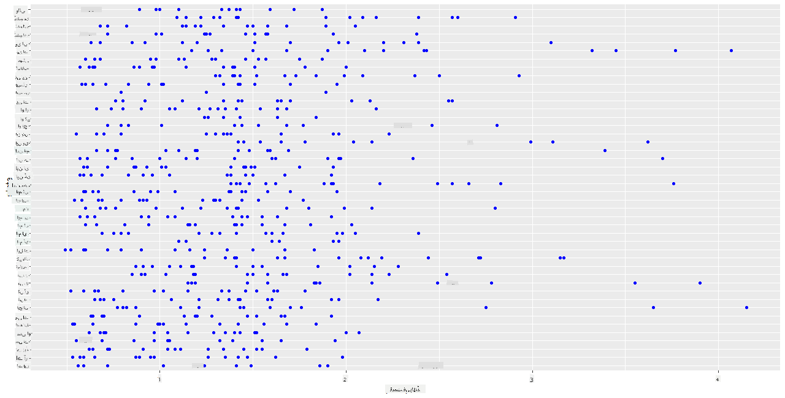
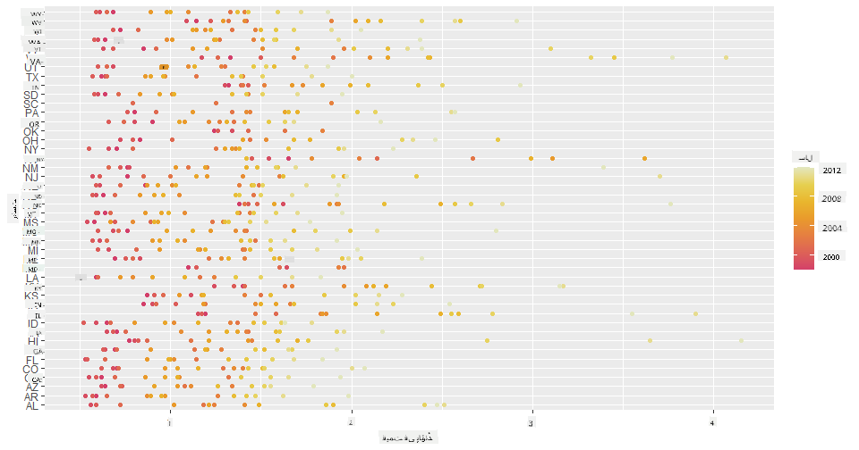
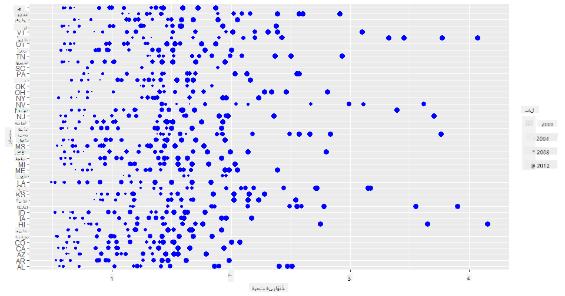
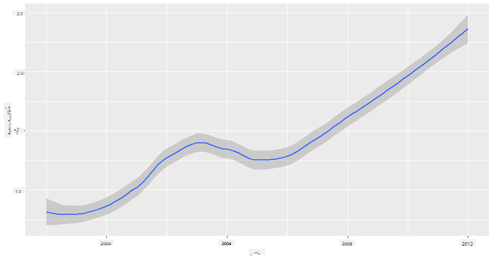
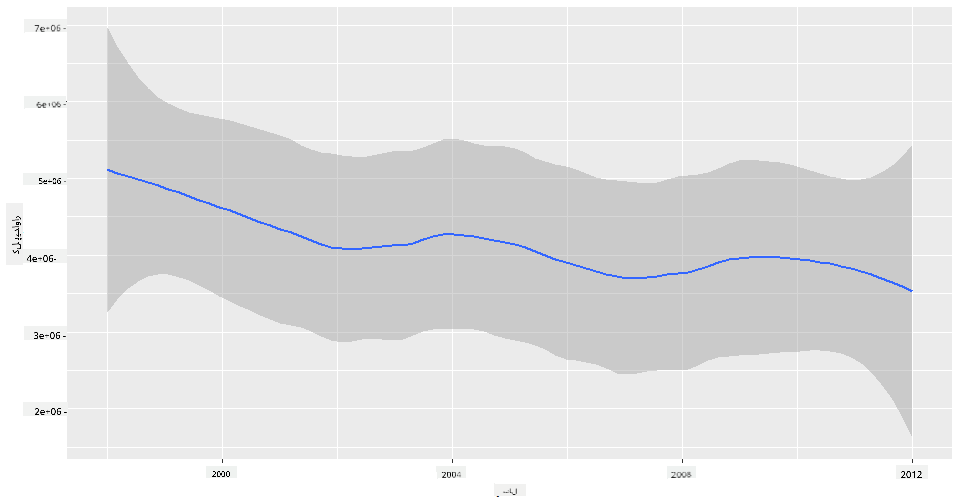
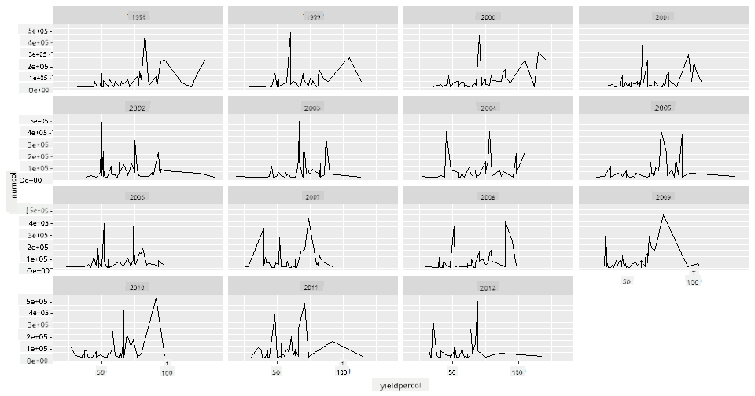
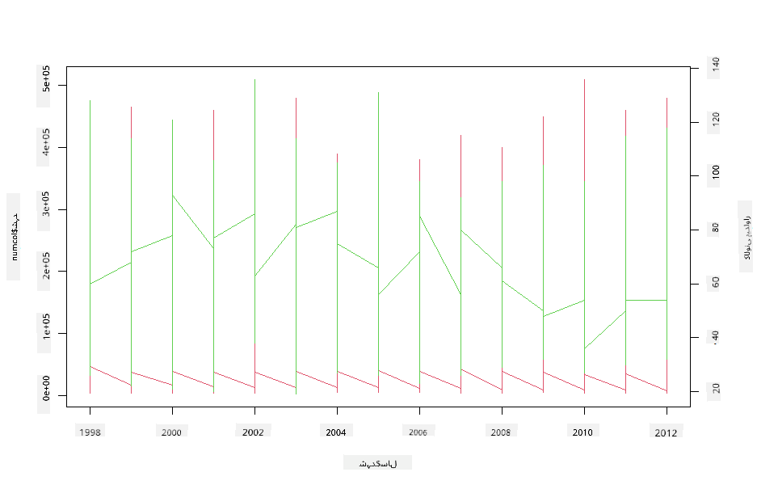

<!--
CO_OP_TRANSLATOR_METADATA:
{
  "original_hash": "a33c5d4b4156a2b41788d8720b6f724c",
  "translation_date": "2025-08-27T10:26:09+00:00",
  "source_file": "3-Data-Visualization/R/12-visualization-relationships/README.md",
  "language_code": "ur"
}
-->
# شہد کے تعلقات کی بصری نمائندگی: شہد کے بارے میں سب کچھ 🍯

| ](../../../sketchnotes/12-Visualizing-Relationships.png)|
|:---:|
|تعلقات کی بصری نمائندگی - _Sketchnote by [@nitya](https://twitter.com/nitya)_ |

ہماری تحقیق کے قدرتی پہلو کو جاری رکھتے ہوئے، آئیے مختلف اقسام کے شہد کے درمیان تعلقات کو ظاہر کرنے کے لیے دلچسپ بصری نمائندگیوں کو دریافت کریں، جو کہ [امریکہ کے محکمہ زراعت](https://www.nass.usda.gov/About_NASS/index.php) سے حاصل کردہ ڈیٹا سیٹ پر مبنی ہیں۔

یہ ڈیٹا سیٹ تقریباً 600 اشیاء پر مشتمل ہے جو امریکہ کی مختلف ریاستوں میں شہد کی پیداوار کو ظاہر کرتا ہے۔ مثال کے طور پر، آپ 1998 سے 2012 کے درمیان کسی دی گئی ریاست میں کالونیوں کی تعداد، فی کالونی پیداوار، کل پیداوار، ذخائر، فی پاؤنڈ قیمت، اور پیداوار کی قیمت کو دیکھ سکتے ہیں، ہر سال کے لیے ایک قطار کے ساتھ۔

یہ دلچسپ ہوگا کہ کسی دی گئی ریاست کی سالانہ پیداوار اور اس ریاست میں شہد کی قیمت کے درمیان تعلق کو بصری طور پر دکھایا جائے۔ متبادل طور پر، آپ ریاستوں کی فی کالونی شہد کی پیداوار کے درمیان تعلق کو ظاہر کر سکتے ہیں۔ یہ سال 2006 میں پہلی بار دیکھے گئے 'کالونی کولیپس ڈس آرڈر' (CCD) (http://npic.orst.edu/envir/ccd.html) کے تباہ کن اثرات کا احاطہ کرتا ہے، لہذا یہ مطالعہ کے لیے ایک اہم ڈیٹا سیٹ ہے۔ 🐝

## [لیکچر سے پہلے کا کوئز](https://purple-hill-04aebfb03.1.azurestaticapps.net/quiz/22)

اس سبق میں، آپ ggplot2 استعمال کر سکتے ہیں، جسے آپ پہلے بھی استعمال کر چکے ہیں، جو متغیرات کے درمیان تعلقات کو بصری طور پر ظاہر کرنے کے لیے ایک بہترین لائبریری ہے۔ خاص طور پر دلچسپ ggplot2 کے `geom_point` اور `qplot` فنکشن کا استعمال ہے، جو جلدی سے اسکیٹر پلاٹس اور لائن پلاٹس بنا کر '[اعدادی تعلقات](https://ggplot2.tidyverse.org/)' کو ظاہر کرتے ہیں، جو ڈیٹا سائنسدان کو متغیرات کے درمیان تعلق کو بہتر طور پر سمجھنے میں مدد دیتے ہیں۔

## اسکیٹر پلاٹس

ایک اسکیٹر پلاٹ کا استعمال کریں تاکہ یہ دکھایا جا سکے کہ شہد کی قیمت سال بہ سال، ہر ریاست کے لیے، کیسے بدلی ہے۔ ggplot2، `ggplot` اور `geom_point` کا استعمال کرتے ہوئے، ریاستی ڈیٹا کو آسانی سے گروپ کرتا ہے اور زمرہ وار اور عددی ڈیٹا کے لیے ڈیٹا پوائنٹس دکھاتا ہے۔

آئیے ڈیٹا اور Seaborn کو درآمد کرنے سے شروع کرتے ہیں:

```r
honey=read.csv('../../data/honey.csv')
head(honey)
```
آپ دیکھیں گے کہ شہد کے ڈیٹا میں کئی دلچسپ کالمز ہیں، جن میں سال اور فی پاؤنڈ قیمت شامل ہیں۔ آئیے اس ڈیٹا کو دریافت کریں، جو امریکی ریاستوں کے لحاظ سے گروپ کیا گیا ہے:

| ریاست | کالونیوں کی تعداد | فی کالونی پیداوار | کل پیداوار | ذخائر   | فی پاؤنڈ قیمت | پیداوار کی قیمت | سال |
| ----- | ------------------ | ------------------ | ----------- | -------- | ------------- | ---------------- | ---- |
| AL    | 16000             | 71                | 1136000     | 159000   | 0.72          | 818000           | 1998 |
| AZ    | 55000             | 60                | 3300000     | 1485000  | 0.64          | 2112000          | 1998 |
| AR    | 53000             | 65                | 3445000     | 1688000  | 0.59          | 2033000          | 1998 |
| CA    | 450000            | 83                | 37350000    | 12326000 | 0.62          | 23157000         | 1998 |
| CO    | 27000             | 72                | 1944000     | 1594000  | 0.7           | 1361000          | 1998 |
| FL    | 230000            | 98                | 22540000    | 4508000  | 0.64          | 14426000         | 1998 |

ایک بنیادی اسکیٹر پلاٹ بنائیں تاکہ شہد کی فی پاؤنڈ قیمت اور اس کی امریکی ریاست کے درمیان تعلق کو دکھایا جا سکے۔ `y` محور کو اتنا لمبا بنائیں کہ تمام ریاستیں دکھائی دیں:

```r
library(ggplot2)
ggplot(honey, aes(x = priceperlb, y = state)) +
  geom_point(colour = "blue")
```


اب، وہی ڈیٹا شہد کے رنگ سکیم کے ساتھ دکھائیں تاکہ یہ ظاہر ہو کہ قیمت سال بہ سال کیسے بدلی ہے۔ آپ یہ 'scale_color_gradientn' پیرامیٹر شامل کر کے کر سکتے ہیں تاکہ تبدیلی کو ظاہر کیا جا سکے:

> ✅ [scale_color_gradientn](https://www.rdocumentation.org/packages/ggplot2/versions/0.9.1/topics/scale_colour_gradientn) کے بارے میں مزید جانیں - ایک خوبصورت قوس قزح رنگ سکیم آزمائیں!

```r
ggplot(honey, aes(x = priceperlb, y = state, color=year)) +
  geom_point()+scale_color_gradientn(colours = colorspace::heat_hcl(7))
```


اس رنگ سکیم کی تبدیلی کے ساتھ، آپ واضح طور پر دیکھ سکتے ہیں کہ سال بہ سال شہد کی فی پاؤنڈ قیمت میں ایک مضبوط ترقی ہوئی ہے۔ درحقیقت، اگر آپ ڈیٹا کے ایک نمونے کو جانچنے کے لیے دیکھیں (مثال کے طور پر، ایریزونا کی ریاست)، تو آپ دیکھ سکتے ہیں کہ قیمت میں سال بہ سال اضافے کا ایک نمونہ موجود ہے، چند استثناء کے ساتھ:

| ریاست | کالونیوں کی تعداد | فی کالونی پیداوار | کل پیداوار | ذخائر  | فی پاؤنڈ قیمت | پیداوار کی قیمت | سال |
| ----- | ------------------ | ------------------ | ----------- | ------- | ------------- | ---------------- | ---- |
| AZ    | 55000             | 60                | 3300000     | 1485000 | 0.64          | 2112000          | 1998 |
| AZ    | 52000             | 62                | 3224000     | 1548000 | 0.62          | 1999000          | 1999 |
| AZ    | 40000             | 59                | 2360000     | 1322000 | 0.73          | 1723000          | 2000 |
| AZ    | 43000             | 59                | 2537000     | 1142000 | 0.72          | 1827000          | 2001 |
| AZ    | 38000             | 63                | 2394000     | 1197000 | 1.08          | 2586000          | 2002 |
| AZ    | 35000             | 72                | 2520000     | 983000  | 1.34          | 3377000          | 2003 |
| AZ    | 32000             | 55                | 1760000     | 774000  | 1.11          | 1954000          | 2004 |
| AZ    | 36000             | 50                | 1800000     | 720000  | 1.04          | 1872000          | 2005 |
| AZ    | 30000             | 65                | 1950000     | 839000  | 0.91          | 1775000          | 2006 |
| AZ    | 30000             | 64                | 1920000     | 902000  | 1.26          | 2419000          | 2007 |
| AZ    | 25000             | 64                | 1600000     | 336000  | 1.26          | 2016000          | 2008 |
| AZ    | 20000             | 52                | 1040000     | 562000  | 1.45          | 1508000          | 2009 |
| AZ    | 24000             | 77                | 1848000     | 665000  | 1.52          | 2809000          | 2010 |
| AZ    | 23000             | 53                | 1219000     | 427000  | 1.55          | 1889000          | 2011 |
| AZ    | 22000             | 46                | 1012000     | 253000  | 1.79          | 1811000          | 2012 |

ایک اور طریقہ یہ ہے کہ رنگ کے بجائے سائز کا استعمال کریں۔ رنگ نابینا صارفین کے لیے، یہ ایک بہتر آپشن ہو سکتا ہے۔ اپنی بصری نمائندگی کو اس طرح ایڈٹ کریں کہ قیمت میں اضافے کو نقطے کے دائرے کے سائز میں اضافے کے ذریعے دکھایا جائے:

```r
ggplot(honey, aes(x = priceperlb, y = state)) +
  geom_point(aes(size = year),colour = "blue") +
  scale_size_continuous(range = c(0.25, 3))
```
آپ دیکھ سکتے ہیں کہ نقطوں کا سائز بتدریج بڑھ رہا ہے۔



کیا یہ صرف طلب اور رسد کا معاملہ ہے؟ موسمیاتی تبدیلی اور کالونی کولیپس جیسے عوامل کی وجہ سے، کیا سال بہ سال خریداری کے لیے کم شہد دستیاب ہے، اور اس وجہ سے قیمت بڑھ رہی ہے؟

اس ڈیٹا سیٹ میں کچھ متغیرات کے درمیان تعلق کو دریافت کرنے کے لیے، آئیے کچھ لائن چارٹس کا جائزہ لیں۔

## لائن چارٹس

سوال: کیا شہد کی فی پاؤنڈ قیمت میں سال بہ سال واضح اضافہ ہوا ہے؟ آپ یہ سب سے آسانی سے ایک سنگل لائن چارٹ بنا کر دریافت کر سکتے ہیں:

```r
qplot(honey$year,honey$priceperlb, geom='smooth', span =0.5, xlab = "year",ylab = "priceperlb")
```
جواب: ہاں، کچھ استثناء کے ساتھ، خاص طور پر 2003 کے آس پاس:



سوال: ٹھیک ہے، کیا 2003 میں ہم شہد کی فراہمی میں بھی کوئی اضافہ دیکھ سکتے ہیں؟ اگر آپ کل پیداوار کو سال بہ سال دیکھیں تو کیا ہوگا؟

```python
qplot(honey$year,honey$totalprod, geom='smooth', span =0.5, xlab = "year",ylab = "totalprod")
```



جواب: واقعی نہیں۔ اگر آپ کل پیداوار کو دیکھیں، تو ایسا لگتا ہے کہ اس خاص سال میں یہ درحقیقت بڑھ گئی ہے، حالانکہ عمومی طور پر ان سالوں کے دوران شہد کی پیداوار میں کمی ہو رہی ہے۔

سوال: اس صورت میں، 2003 کے آس پاس شہد کی قیمت میں اضافے کی وجہ کیا ہو سکتی ہے؟

یہ دریافت کرنے کے لیے، آپ ایک فیسٹ گرڈ کا جائزہ لے سکتے ہیں۔

## فیسٹ گرڈز

فیسٹ گرڈز آپ کے ڈیٹا سیٹ کے ایک پہلو کو لیتے ہیں (ہمارے معاملے میں، آپ 'سال' کو منتخب کر سکتے ہیں تاکہ بہت زیادہ فیسٹس پیدا نہ ہوں)۔ Seaborn پھر آپ کے منتخب کردہ x اور y کوآرڈینیٹس کے لیے ہر فیسٹ کا ایک پلاٹ بنا سکتا ہے تاکہ آسان بصری موازنہ کیا جا سکے۔ کیا 2003 اس قسم کے موازنہ میں نمایاں نظر آتا ہے؟

`facet_wrap` کا استعمال کرتے ہوئے ایک فیسٹ گرڈ بنائیں جیسا کہ [ggplot2 کی دستاویزات](https://ggplot2.tidyverse.org/reference/facet_wrap.html) میں تجویز کیا گیا ہے۔

```r
ggplot(honey, aes(x=yieldpercol, y = numcol,group = 1)) + 
  geom_line() + facet_wrap(vars(year))
```
اس بصری نمائندگی میں، آپ فی کالونی پیداوار اور کالونیوں کی تعداد کو سال بہ سال، ریاست بہ ریاست، 3 کالمز کے ساتھ موازنہ کر سکتے ہیں:



اس ڈیٹا سیٹ کے لیے، کالونیوں کی تعداد اور ان کی پیداوار کے لحاظ سے سال بہ سال اور ریاست بہ ریاست کچھ خاص نمایاں نہیں ہوتا۔ کیا ان دو متغیرات کے درمیان تعلق تلاش کرنے کے لیے دیکھنے کا کوئی مختلف طریقہ ہے؟

## دوہری لائن پلاٹس

دو لائن پلاٹس کو ایک دوسرے کے اوپر سپر امپوز کرکے ایک ملٹی لائن پلاٹ آزمائیں، R کے `par` اور `plot` فنکشن کا استعمال کرتے ہوئے۔ ہم x محور پر سال کو پلاٹ کریں گے اور دو y محور دکھائیں گے۔ تو، فی کالونی پیداوار اور کالونیوں کی تعداد کو سپر امپوز کریں:

```r
par(mar = c(5, 4, 4, 4) + 0.3)              
plot(honey$year, honey$numcol, pch = 16, col = 2,type="l")              
par(new = TRUE)                             
plot(honey$year, honey$yieldpercol, pch = 17, col = 3,              
     axes = FALSE, xlab = "", ylab = "",type="l")
axis(side = 4, at = pretty(range(y2)))      
mtext("colony yield", side = 4, line = 3)   
```


جبکہ 2003 کے آس پاس کچھ خاص نظر نہیں آتا، یہ ہمیں سبق کو ایک خوشگوار نوٹ پر ختم کرنے کی اجازت دیتا ہے: اگرچہ مجموعی طور پر کالونیوں کی تعداد میں کمی ہو رہی ہے، کالونیوں کی تعداد مستحکم ہو رہی ہے، چاہے ان کی فی کالونی پیداوار کم ہو رہی ہو۔

جاؤ، شہد کی مکھیوں، جاؤ!

🐝❤️
## 🚀 چیلنج

اس سبق میں، آپ نے اسکیٹر پلاٹس اور لائن گرڈز کے دیگر استعمالات کے بارے میں مزید سیکھا، بشمول فیسٹ گرڈز۔ اپنے آپ کو چیلنج کریں کہ کسی مختلف ڈیٹا سیٹ کا استعمال کرتے ہوئے ایک فیسٹ گرڈ بنائیں، شاید وہی جو آپ نے ان اسباق سے پہلے استعمال کیا ہو۔ نوٹ کریں کہ انہیں بنانے میں کتنا وقت لگتا ہے اور ان تکنیکوں کا استعمال کرتے ہوئے کتنے گرڈز بنانے کی ضرورت ہے۔

## [لیکچر کے بعد کا کوئز](https://purple-hill-04aebfb03.1.azurestaticapps.net/quiz/23)

## جائزہ اور خود مطالعہ

لائن پلاٹس سادہ یا کافی پیچیدہ ہو سکتے ہیں۔ [ggplot2 کی دستاویزات](https://ggplot2.tidyverse.org/reference/geom_path.html#:~:text=geom_line()%20connects%20them%20in,which%20cases%20are%20connected%20together) میں تھوڑا سا مطالعہ کریں کہ آپ انہیں مختلف طریقوں سے کیسے بنا سکتے ہیں۔ ان لائن چارٹس کو بہتر بنانے کی کوشش کریں جو آپ نے اس سبق میں بنائے ہیں، دستاویزات میں درج دیگر طریقوں کے ساتھ۔

## اسائنمنٹ

[شہد کے چھتے میں غوطہ لگائیں](assignment.md)

---

**ڈسکلیمر**:  
یہ دستاویز AI ترجمہ سروس [Co-op Translator](https://github.com/Azure/co-op-translator) کا استعمال کرتے ہوئے ترجمہ کی گئی ہے۔ ہم درستگی کے لیے پوری کوشش کرتے ہیں، لیکن براہ کرم آگاہ رہیں کہ خودکار ترجمے میں غلطیاں یا عدم درستگی ہو سکتی ہیں۔ اصل دستاویز، جو اس کی مقامی زبان میں ہے، کو مستند ذریعہ سمجھا جانا چاہیے۔ اہم معلومات کے لیے، پیشہ ور انسانی ترجمہ کی سفارش کی جاتی ہے۔ اس ترجمے کے استعمال سے پیدا ہونے والی کسی بھی غلط فہمی یا غلط تشریح کے لیے ہم ذمہ دار نہیں ہیں۔