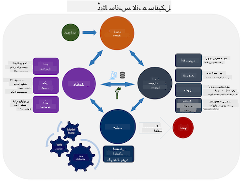
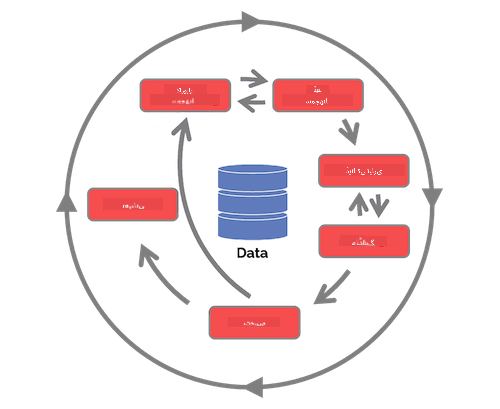

<!--
CO_OP_TRANSLATOR_METADATA:
{
  "original_hash": "c368f8f2506fe56bca0f7be05c4eb71d",
  "translation_date": "2025-08-27T09:50:50+00:00",
  "source_file": "4-Data-Science-Lifecycle/14-Introduction/README.md",
  "language_code": "ur"
}
-->
# ڈیٹا سائنس کے لائف سائیکل کا تعارف

| کی اسکیچ نوٹ ](../../sketchnotes/14-DataScience-Lifecycle.png)|
|:---:|
| ڈیٹا سائنس کے لائف سائیکل کا تعارف - _[@nitya](https://twitter.com/nitya) کی اسکیچ نوٹ_ |

## [لیکچر سے پہلے کا کوئز](https://red-water-0103e7a0f.azurestaticapps.net/quiz/26)

اس وقت تک آپ کو شاید یہ احساس ہو گیا ہوگا کہ ڈیٹا سائنس ایک عمل ہے۔ اس عمل کو پانچ مراحل میں تقسیم کیا جا سکتا ہے:

- ڈیٹا حاصل کرنا
- پروسیسنگ
- تجزیہ
- مواصلات
- دیکھ بھال

یہ سبق لائف سائیکل کے تین حصوں پر توجہ مرکوز کرتا ہے: ڈیٹا حاصل کرنا، پروسیسنگ، اور دیکھ بھال۔

> تصویر بشکریہ [برکلے اسکول آف انفارمیشن](https://ischoolonline.berkeley.edu/data-science/what-is-data-science/)

## ڈیٹا حاصل کرنا

لائف سائیکل کا پہلا مرحلہ بہت اہم ہے کیونکہ اگلے مراحل اس پر منحصر ہیں۔ یہ عملی طور پر دو مراحل کو ایک میں جوڑتا ہے: ڈیٹا حاصل کرنا اور ان مقاصد اور مسائل کی وضاحت کرنا جنہیں حل کرنے کی ضرورت ہے۔  
پروجیکٹ کے مقاصد کی وضاحت کے لیے مسئلے یا سوال کے گہرے سیاق و سباق کی ضرورت ہوگی۔ سب سے پہلے، ہمیں ان لوگوں کی شناخت اور حصول کرنا ہوگا جنہیں ان کے مسائل کا حل چاہیے۔ یہ کاروبار کے اسٹیک ہولڈرز یا پروجیکٹ کے اسپانسرز ہو سکتے ہیں، جو یہ شناخت کرنے میں مدد کر سکتے ہیں کہ اس پروجیکٹ سے کون یا کیا فائدہ اٹھائے گا اور کیوں۔ ایک اچھی طرح سے بیان کردہ مقصد کو قابل پیمائش اور مقداری ہونا چاہیے تاکہ ایک قابل قبول نتیجہ کی وضاحت کی جا سکے۔

ڈیٹا سائنسدان درج ذیل سوالات پوچھ سکتے ہیں:
- کیا اس مسئلے پر پہلے کام کیا گیا ہے؟ کیا دریافت ہوا؟
- کیا مقصد اور ہدف سب کے لیے واضح ہیں؟
- کیا کوئی ابہام ہے اور اسے کیسے کم کیا جا سکتا ہے؟
- کیا حدود ہیں؟
- ممکنہ طور پر حتمی نتیجہ کیسا ہوگا؟
- کتنے وسائل (وقت، افراد، کمپیوٹیشنل) دستیاب ہیں؟

اگلا مرحلہ ان ڈیٹا کی شناخت، جمع کرنا، اور پھر ان کا جائزہ لینا ہے جو ان مقاصد کو حاصل کرنے کے لیے ضروری ہیں۔ اس مرحلے پر، ڈیٹا سائنسدانوں کو ڈیٹا کی مقدار اور معیار کا بھی جائزہ لینا ہوگا۔ اس کے لیے کچھ ڈیٹا کی تلاش کی ضرورت ہوگی تاکہ یہ تصدیق کی جا سکے کہ جو کچھ حاصل کیا گیا ہے وہ مطلوبہ نتیجہ تک پہنچنے میں مدد دے گا۔

ڈیٹا سائنسدان درج ذیل سوالات پوچھ سکتے ہیں:
- میرے پاس پہلے سے کون سا ڈیٹا دستیاب ہے؟
- اس ڈیٹا کا مالک کون ہے؟
- پرائیویسی کے کیا خدشات ہیں؟
- کیا میرے پاس اس مسئلے کو حل کرنے کے لیے کافی ڈیٹا ہے؟
- کیا یہ ڈیٹا اس مسئلے کے لیے قابل قبول معیار کا ہے؟
- اگر اس ڈیٹا کے ذریعے اضافی معلومات دریافت ہوں تو کیا ہمیں مقاصد کو تبدیل یا دوبارہ بیان کرنے پر غور کرنا چاہیے؟

## پروسیسنگ

لائف سائیکل کا پروسیسنگ مرحلہ ڈیٹا میں پیٹرنز دریافت کرنے اور ماڈلنگ پر مرکوز ہے۔ پروسیسنگ کے مرحلے میں استعمال ہونے والی کچھ تکنیکوں کے لیے شماریاتی طریقے درکار ہوتے ہیں تاکہ پیٹرنز کو دریافت کیا جا سکے۔ عام طور پر، یہ ایک انسان کے لیے بڑے ڈیٹا سیٹ کے ساتھ کرنا ایک تھکا دینے والا کام ہوگا، اور اس عمل کو تیز کرنے کے لیے کمپیوٹرز پر انحصار کیا جائے گا۔ یہ وہ مرحلہ بھی ہے جہاں ڈیٹا سائنس اور مشین لرننگ آپس میں ملتے ہیں۔ جیسا کہ آپ نے پہلے سبق میں سیکھا، مشین لرننگ ڈیٹا کو سمجھنے کے لیے ماڈلز بنانے کا عمل ہے۔ ماڈلز ڈیٹا میں متغیرات کے درمیان تعلقات کی نمائندگی کرتے ہیں جو نتائج کی پیش گوئی کرنے میں مدد کرتے ہیں۔

اس مرحلے میں استعمال ہونے والی عام تکنیکیں ML for Beginners کے نصاب میں شامل ہیں۔ مزید جاننے کے لیے لنکس پر عمل کریں:

- [کلاسیفکیشن](https://github.com/microsoft/ML-For-Beginners/tree/main/4-Classification): ڈیٹا کو زمرہ جات میں منظم کرنا تاکہ اسے زیادہ مؤثر طریقے سے استعمال کیا جا سکے۔
- [کلسٹرنگ](https://github.com/microsoft/ML-For-Beginners/tree/main/5-Clustering): ڈیٹا کو ایک جیسے گروپوں میں تقسیم کرنا۔
- [ریگریشن](https://github.com/microsoft/ML-For-Beginners/tree/main/2-Regression): متغیرات کے درمیان تعلقات کا تعین کرنا تاکہ اقدار کی پیش گوئی یا پیش بینی کی جا سکے۔

## دیکھ بھال

لائف سائیکل کے خاکے میں، آپ نے دیکھا ہوگا کہ دیکھ بھال ڈیٹا حاصل کرنے اور پروسیسنگ کے درمیان موجود ہے۔ دیکھ بھال ایک جاری عمل ہے جس میں پروجیکٹ کے دوران ڈیٹا کا انتظام، ذخیرہ، اور تحفظ شامل ہے، اور اسے پورے پروجیکٹ کے دوران مدنظر رکھا جانا چاہیے۔

### ڈیٹا کا ذخیرہ

ڈیٹا کو کیسے اور کہاں ذخیرہ کیا جائے، اس پر غور کرنے سے اس کے ذخیرہ کرنے کی لاگت اور ڈیٹا تک رسائی کی رفتار پر اثر پڑ سکتا ہے۔ ایسے فیصلے عام طور پر صرف ڈیٹا سائنسدان نہیں کرتے، لیکن وہ ڈیٹا کے ساتھ کام کرنے کے طریقے پر اثر ڈال سکتے ہیں، اس بات پر منحصر ہے کہ ڈیٹا کیسے ذخیرہ کیا گیا ہے۔

جدید ڈیٹا اسٹوریج سسٹمز کے کچھ پہلو جو ان انتخابوں کو متاثر کر سکتے ہیں:

**آن پریمیس بمقابلہ آف پریمیس بمقابلہ پبلک یا پرائیویٹ کلاؤڈ**

آن پریمیس کا مطلب ہے کہ آپ اپنے آلات پر ڈیٹا کی میزبانی اور انتظام کرتے ہیں، جیسے کہ سرور کے ذریعے جس میں ہارڈ ڈرائیوز پر ڈیٹا ذخیرہ ہوتا ہے، جبکہ آف پریمیس ایسے آلات پر انحصار کرتا ہے جو آپ کے اپنے نہیں ہوتے، جیسے ڈیٹا سینٹر۔ پبلک کلاؤڈ ڈیٹا ذخیرہ کرنے کے لیے ایک مقبول انتخاب ہے جس کے لیے یہ جاننے کی ضرورت نہیں ہوتی کہ ڈیٹا کہاں اور کیسے ذخیرہ کیا گیا ہے۔ پبلک کلاؤڈ ایک مشترکہ بنیادی ڈھانچے پر مبنی ہوتا ہے، جبکہ کچھ تنظیمیں سخت حفاظتی پالیسیوں کی وجہ سے پرائیویٹ کلاؤڈ کا انتخاب کرتی ہیں۔

**کولڈ بمقابلہ ہاٹ ڈیٹا**

جب آپ اپنے ماڈلز کو تربیت دے رہے ہوں، تو آپ کو زیادہ تربیتی ڈیٹا کی ضرورت ہو سکتی ہے۔ اگر آپ اپنے ماڈل سے مطمئن ہیں، تو مزید ڈیٹا ماڈل کے مقصد کو پورا کرنے کے لیے آ سکتا ہے۔ کسی بھی صورت میں، جیسے جیسے ڈیٹا بڑھتا ہے، اس کے ذخیرہ کرنے اور اس تک رسائی کی لاگت میں اضافہ ہوگا۔ شاذ و نادر استعمال ہونے والے ڈیٹا (کولڈ ڈیٹا) کو اکثر استعمال ہونے والے ڈیٹا (ہاٹ ڈیٹا) سے الگ کرنا ایک سستا ذخیرہ کرنے کا آپشن ہو سکتا ہے۔

### ڈیٹا کا انتظام

جب آپ ڈیٹا کے ساتھ کام کرتے ہیں، تو آپ کو معلوم ہو سکتا ہے کہ کچھ ڈیٹا کو صاف کرنے کی ضرورت ہے۔ یہ وہ تکنیکیں ہیں جو [ڈیٹا کی تیاری](https://github.com/microsoft/Data-Science-For-Beginners/tree/main/2-Working-With-Data/08-data-preparation) کے سبق میں شامل ہیں تاکہ درست ماڈلز بنائے جا سکیں۔ جب نیا ڈیٹا آتا ہے، تو اسے بھی انہی ایپلی کیشنز کی ضرورت ہوگی تاکہ معیار میں مستقل مزاجی برقرار رہے۔ کچھ پروجیکٹس میں ڈیٹا کو صاف کرنے، جمع کرنے، اور کمپریس کرنے کے لیے خودکار ٹولز کا استعمال شامل ہوگا۔ Azure Data Factory ان ٹولز کی ایک مثال ہے۔

### ڈیٹا کا تحفظ

ڈیٹا کو محفوظ رکھنے کا ایک اہم مقصد یہ یقینی بنانا ہے کہ جو لوگ اس پر کام کر رہے ہیں وہ اس بات پر قابو رکھتے ہیں کہ کیا جمع کیا جا رہا ہے اور اسے کس سیاق و سباق میں استعمال کیا جا رہا ہے۔ ڈیٹا کو محفوظ رکھنے میں شامل ہے کہ صرف ان لوگوں کو رسائی دی جائے جنہیں اس کی ضرورت ہے، مقامی قوانین اور ضوابط کی پابندی کی جائے، اور اخلاقی معیارات کو برقرار رکھا جائے، جیسا کہ [اخلاقیات کے سبق](https://github.com/microsoft/Data-Science-For-Beginners/tree/main/1-Introduction/02-ethics) میں شامل ہے۔

یہاں کچھ اقدامات ہیں جو ایک ٹیم سیکیورٹی کو مدنظر رکھتے ہوئے کر سکتی ہے:
- اس بات کی تصدیق کریں کہ تمام ڈیٹا انکرپٹڈ ہے۔
- صارفین کو یہ معلومات فراہم کریں کہ ان کے ڈیٹا کو کیسے استعمال کیا جا رہا ہے۔
- پروجیکٹ چھوڑنے والے افراد سے ڈیٹا تک رسائی ہٹا دیں۔
- صرف مخصوص پروجیکٹ ممبران کو ڈیٹا میں تبدیلی کرنے کی اجازت دیں۔

## 🚀 چیلنج

ڈیٹا سائنس کے لائف سائیکل کے کئی ورژن موجود ہیں، جہاں ہر مرحلے کے مختلف نام اور تعداد ہو سکتی ہے، لیکن ان میں وہی عمل شامل ہوں گے جو اس سبق میں بیان کیے گئے ہیں۔

[ٹیم ڈیٹا سائنس پروسیس لائف سائیکل](https://docs.microsoft.com/en-us/azure/architecture/data-science-process/lifecycle) اور [کراس انڈسٹری اسٹینڈرڈ پروسیس فار ڈیٹا مائننگ](https://www.datascience-pm.com/crisp-dm-2/) کو دریافت کریں۔ ان دونوں میں 3 مماثلتیں اور فرق بتائیں۔

|ٹیم ڈیٹا سائنس پروسیس (TDSP)|کراس انڈسٹری اسٹینڈرڈ پروسیس فار ڈیٹا مائننگ (CRISP-DM)|
|--|--|
| |  |
| تصویر بشکریہ [Microsoft](https://docs.microsoft.comazure/architecture/data-science-process/lifecycle) | تصویر بشکریہ [Data Science Process Alliance](https://www.datascience-pm.com/crisp-dm-2/) |

## [لیکچر کے بعد کا کوئز](https://red-water-0103e7a0f.azurestaticapps.net/quiz/27)

## جائزہ اور خود مطالعہ

ڈیٹا سائنس کے لائف سائیکل کو اپنانے میں متعدد کردار اور کام شامل ہوتے ہیں، جہاں کچھ ہر مرحلے کے مخصوص حصوں پر توجہ مرکوز کرتے ہیں۔ ٹیم ڈیٹا سائنس پروسیس کچھ وسائل فراہم کرتا ہے جو وضاحت کرتے ہیں کہ کسی پروجیکٹ میں کسی کے کردار اور کام کیا ہو سکتے ہیں۔

* [ٹیم ڈیٹا سائنس پروسیس کے کردار اور کام](https://docs.microsoft.com/en-us/azure/architecture/data-science-process/roles-tasks)
* [ڈیٹا سائنس کے کام انجام دینا: تلاش، ماڈلنگ، اور تعیناتی](https://docs.microsoft.com/en-us/azure/architecture/data-science-process/execute-data-science-tasks)

## اسائنمنٹ

[ڈیٹا سیٹ کا جائزہ لینا](assignment.md)

---

**ڈس کلیمر**:  
یہ دستاویز AI ترجمہ سروس [Co-op Translator](https://github.com/Azure/co-op-translator) کا استعمال کرتے ہوئے ترجمہ کی گئی ہے۔ ہم درستگی کے لیے کوشش کرتے ہیں، لیکن براہ کرم آگاہ رہیں کہ خودکار ترجمے میں غلطیاں یا عدم درستگی ہو سکتی ہیں۔ اصل دستاویز کو اس کی اصل زبان میں مستند ذریعہ سمجھا جانا چاہیے۔ اہم معلومات کے لیے، پیشہ ور انسانی ترجمہ کی سفارش کی جاتی ہے۔ اس ترجمے کے استعمال سے پیدا ہونے والی کسی بھی غلط فہمی یا غلط تشریح کے لیے ہم ذمہ دار نہیں ہیں۔