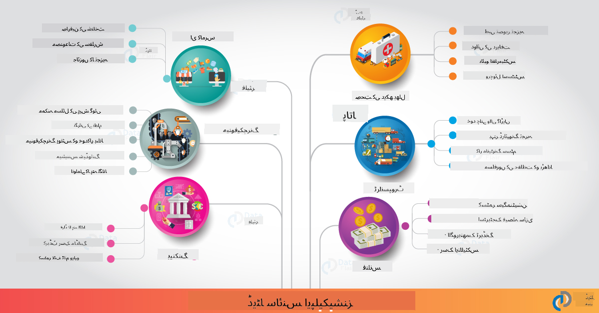

<!--
CO_OP_TRANSLATOR_METADATA:
{
  "original_hash": "67076ed50f54e7d26ba1ba378d6078f1",
  "translation_date": "2025-08-27T09:20:40+00:00",
  "source_file": "6-Data-Science-In-Wild/20-Real-World-Examples/README.md",
  "language_code": "ur"
}
-->
# ڈیٹا سائنس حقیقی دنیا میں

|  ](../../sketchnotes/20-DataScience-RealWorld.png) |
| :--------------------------------------------------------------------------------------------------------------: |
|               حقیقی دنیا میں ڈیٹا سائنس - _Sketchnote by [@nitya](https://twitter.com/nitya)_               |

ہم اس تعلیمی سفر کے اختتام کے قریب پہنچ چکے ہیں!

ہم نے ڈیٹا سائنس اور اخلاقیات کی تعریفوں سے آغاز کیا، ڈیٹا تجزیہ اور بصریات کے مختلف آلات اور تکنیکوں کو دریافت کیا، ڈیٹا سائنس کے لائف سائیکل کا جائزہ لیا، اور کلاؤڈ کمپیوٹنگ سروسز کے ذریعے ڈیٹا سائنس ورک فلو کو بڑھانے اور خودکار کرنے کے طریقے دیکھے۔ تو آپ شاید سوچ رہے ہوں گے: _"میں ان تمام سیکھنے کو حقیقی دنیا کے سیاق و سباق میں کیسے نقشہ بنا سکتا ہوں؟"_

اس سبق میں، ہم صنعت میں ڈیٹا سائنس کے حقیقی دنیا کے اطلاقات کا جائزہ لیں گے اور تحقیق، ڈیجیٹل ہیومینٹیز، اور پائیداری کے سیاق و سباق میں مخصوص مثالوں پر غور کریں گے۔ ہم طلباء کے پروجیکٹ کے مواقع پر نظر ڈالیں گے اور آپ کے تعلیمی سفر کو جاری رکھنے میں مدد کے لیے مفید وسائل کے ساتھ اختتام کریں گے!

## لیکچر سے پہلے کا کوئز

[لیکچر سے پہلے کا کوئز](https://purple-hill-04aebfb03.1.azurestaticapps.net/quiz/38)

## ڈیٹا سائنس + صنعت

AI کی جمہوریت کی بدولت، ڈویلپرز کے لیے AI سے چلنے والے فیصلے اور ڈیٹا سے چلنے والی بصیرت کو صارف کے تجربات اور ترقیاتی ورک فلو میں ڈیزائن اور شامل کرنا آسان ہو گیا ہے۔ یہاں کچھ مثالیں ہیں کہ ڈیٹا سائنس کو صنعت میں حقیقی دنیا کے اطلاقات میں کیسے "لاگو" کیا جاتا ہے:

 * [Google Flu Trends](https://www.wired.com/2015/10/can-learn-epic-failure-google-flu-trends/) نے ڈیٹا سائنس کا استعمال کرتے ہوئے تلاش کے الفاظ کو فلو کے رجحانات سے جوڑا۔ اگرچہ اس طریقہ کار میں خامیاں تھیں، لیکن اس نے ڈیٹا سے چلنے والی صحت کی پیش گوئیوں کے امکانات (اور چیلنجز) کے بارے میں آگاہی پیدا کی۔

 * [UPS Routing Predictions](https://www.technologyreview.com/2018/11/21/139000/how-ups-uses-ai-to-outsmart-bad-weather/) - وضاحت کرتا ہے کہ UPS ڈیٹا سائنس اور مشین لرننگ کا استعمال کرتے ہوئے موسم کی صورتحال، ٹریفک کے نمونے، ڈیلیوری کی آخری تاریخ اور مزید کو مدنظر رکھتے ہوئے ڈیلیوری کے لیے بہترین راستوں کی پیش گوئی کیسے کرتا ہے۔

 * [NYC Taxicab Route Visualization](http://chriswhong.github.io/nyctaxi/) - [Freedom Of Information Laws](https://chriswhong.com/open-data/foil_nyc_taxi/) کے ذریعے جمع کردہ ڈیٹا نے NYC ٹیکسیوں کی زندگی کے ایک دن کو بصری بنایا، جس سے ہمیں یہ سمجھنے میں مدد ملی کہ وہ مصروف شہر میں کیسے نیویگیٹ کرتے ہیں، وہ کتنی رقم کماتے ہیں، اور ہر 24 گھنٹے کی مدت میں سفر کا دورانیہ۔

 * [Uber Data Science Workbench](https://eng.uber.com/dsw/) - روزانہ لاکھوں اوبر ٹرپس سے جمع کردہ ڈیٹا (پک اپ اور ڈراپ آف مقامات، سفر کا دورانیہ، ترجیحی راستے وغیرہ) کا استعمال کرتے ہوئے ڈیٹا اینالیٹکس ٹول بنایا گیا جو قیمتوں، حفاظت، دھوکہ دہی کی شناخت اور نیویگیشن کے فیصلوں میں مدد کرتا ہے۔

 * [Sports Analytics](https://towardsdatascience.com/scope-of-analytics-in-sports-world-37ed09c39860) - _پیش گوئی کے تجزیے_ (ٹیم اور کھلاڑی کا تجزیہ - جیسے [Moneyball](https://datasciencedegree.wisconsin.edu/blog/moneyball-proves-importance-big-data-big-ideas/) - اور مداحوں کا انتظام) اور _ڈیٹا بصریات_ (ٹیم اور مداحوں کے ڈیش بورڈز، کھیل وغیرہ) پر توجہ مرکوز کرتا ہے، جیسے ٹیلنٹ اسکاؤٹنگ، کھیلوں کی شرط لگانا اور انوینٹری/مقام کا انتظام۔

 * [Data Science in Banking](https://data-flair.training/blogs/data-science-in-banking/) - مالی صنعت میں ڈیٹا سائنس کی قدر کو اجاگر کرتا ہے، جس میں خطرے کی ماڈلنگ اور دھوکہ دہی کی شناخت سے لے کر کسٹمر کی تقسیم، حقیقی وقت کی پیش گوئی اور سفارش کرنے والے نظام شامل ہیں۔ پیش گوئی کے تجزیے اہم اقدامات جیسے [کریڈٹ اسکورز](https://dzone.com/articles/using-big-data-and-predictive-analytics-for-credit) کو بھی چلاتے ہیں۔

 * [Data Science in Healthcare](https://data-flair.training/blogs/data-science-in-healthcare/) - طبی امیجنگ (جیسے MRI، ایکس رے، CT-Scan)، جینومکس (DNA سیکوینسنگ)، دوا کی ترقی (خطرے کی تشخیص، کامیابی کی پیش گوئی)، پیش گوئی کے تجزیے (مریض کی دیکھ بھال اور سپلائی لاجسٹکس)، بیماری کی ٹریکنگ اور روک تھام وغیرہ جیسے اطلاقات کو اجاگر کرتا ہے۔

 تصویر کا کریڈٹ: [Data Flair: 6 Amazing Data Science Applications ](https://data-flair.training/blogs/data-science-applications/)

یہ شکل دیگر ڈومینز اور ڈیٹا سائنس تکنیکوں کے اطلاقات کی مثالیں دکھاتی ہے۔ کیا آپ دیگر اطلاقات کو دریافت کرنا چاہتے ہیں؟ نیچے [Review & Self Study](../../../../6-Data-Science-In-Wild/20-Real-World-Examples) سیکشن دیکھیں۔

## ڈیٹا سائنس + تحقیق

|  ](../../sketchnotes/20-DataScience-Research.png) |
| :---------------------------------------------------------------------------------------------------------------: |
|              ڈیٹا سائنس اور تحقیق - _Sketchnote by [@nitya](https://twitter.com/nitya)_              |

جبکہ حقیقی دنیا کے اطلاقات اکثر صنعت کے استعمال کے معاملات پر توجہ مرکوز کرتے ہیں، _تحقیق_ کے اطلاقات اور پروجیکٹس دو نقطہ نظر سے مفید ہو سکتے ہیں:

* _جدت کے مواقع_ - جدید تصورات کے تیز پروٹوٹائپنگ اور اگلی نسل کے اطلاقات کے لیے صارف کے تجربات کی جانچ کرنا۔
* _تعیناتی کے چیلنجز_ - حقیقی دنیا کے سیاق و سباق میں ڈیٹا سائنس ٹیکنالوجیز کے ممکنہ نقصانات یا غیر ارادی نتائج کی تحقیقات کرنا۔

طلباء کے لیے، یہ تحقیقی پروجیکٹس سیکھنے اور تعاون کے مواقع فراہم کر سکتے ہیں جو آپ کی موضوع کی سمجھ کو بہتر بنا سکتے ہیں، اور متعلقہ لوگوں یا ٹیموں کے ساتھ آپ کی آگاہی اور مشغولیت کو وسیع کر سکتے ہیں جو دلچسپی کے شعبوں میں کام کر رہے ہیں۔ تو تحقیقی پروجیکٹس کیسے نظر آتے ہیں اور وہ کیسے اثر ڈال سکتے ہیں؟

آئیے ایک مثال دیکھتے ہیں - [MIT Gender Shades Study](http://gendershades.org/overview.html) جوائے بولااموینی (MIT میڈیا لیبز) کی طرف سے ایک [نمایاں تحقیقی مقالہ](http://proceedings.mlr.press/v81/buolamwini18a/buolamwini18a.pdf) کے ساتھ، جسے ٹمنیت گیبرو (اس وقت مائیکروسافٹ ریسرچ میں) کے ساتھ شریک تحریر کیا گیا تھا، جس نے توجہ مرکوز کی:

 * **کیا:** تحقیقی پروجیکٹ کا مقصد _خودکار چہرے کے تجزیے کے الگورتھمز اور ڈیٹا سیٹس میں موجود تعصب کا جائزہ لینا_ تھا، جنس اور جلد کی قسم کی بنیاد پر۔
 * **کیوں:** چہرے کا تجزیہ قانون نافذ کرنے، ہوائی اڈے کی حفاظت، بھرتی کے نظام اور مزید جیسے شعبوں میں استعمال ہوتا ہے - ایسے سیاق و سباق جہاں غلط درجہ بندی (جیسے تعصب کی وجہ سے) متاثرہ افراد یا گروہوں کو ممکنہ اقتصادی اور سماجی نقصانات پہنچا سکتی ہے۔ استعمال میں انصاف کے لیے تعصبات کو سمجھنا (اور ختم یا کم کرنا) کلیدی ہے۔
 * **کیسے:** محققین نے تسلیم کیا کہ موجودہ بینچ مارکس نے زیادہ تر ہلکی جلد والے مضامین استعمال کیے، اور ایک نیا ڈیٹا سیٹ (1000+ تصاویر) تیار کیا جو جنس اور جلد کی قسم کے لحاظ سے _زیادہ متوازن_ تھا۔ ڈیٹا سیٹ کو تین جنس کی درجہ بندی کی مصنوعات (مائیکروسافٹ، IBM اور Face++) کی درستگی کا جائزہ لینے کے لیے استعمال کیا گیا۔

نتائج نے ظاہر کیا کہ اگرچہ مجموعی طور پر درجہ بندی کی درستگی اچھی تھی، مختلف ذیلی گروپوں کے درمیان غلطی کی شرح میں نمایاں فرق تھا - **غلط جنس کی شناخت** خواتین یا گہری جلد والے افراد کے لیے زیادہ تھی، جو تعصب کی نشاندہی کرتی ہے۔

**اہم نتائج:** ڈیٹا سائنس کو زیادہ _نمائندہ ڈیٹا سیٹس_ (متوازن ذیلی گروپ) اور زیادہ _شامل ٹیموں_ (متنوع پس منظر) کی ضرورت ہے تاکہ AI حل میں ایسے تعصبات کو جلد پہچاننے اور ختم یا کم کرنے میں مدد ملے۔ اس طرح کی تحقیقی کوششیں بہت سی تنظیموں کے لیے _ذمہ دار AI_ کے اصولوں اور طریقوں کی وضاحت میں بھی اہم ہیں تاکہ ان کے AI مصنوعات اور عمل میں انصاف کو بہتر بنایا جا سکے۔

**مائیکروسافٹ میں متعلقہ تحقیقی کوششوں کے بارے میں جاننا چاہتے ہیں؟**

* [Microsoft Research Projects](https://www.microsoft.com/research/research-area/artificial-intelligence/?facet%5Btax%5D%5Bmsr-research-area%5D%5B%5D=13556&facet%5Btax%5D%5Bmsr-content-type%5D%5B%5D=msr-project) پر مصنوعی ذہانت کے بارے میں مزید جانیں۔
* [Microsoft Research Data Science Summer School](https://www.microsoft.com/en-us/research/academic-program/data-science-summer-school/) سے طلباء کے پروجیکٹس کو دریافت کریں۔
* [Fairlearn](https://fairlearn.org/) پروجیکٹ اور [Responsible AI](https://www.microsoft.com/en-us/ai/responsible-ai?activetab=pivot1%3aprimaryr6) اقدامات کو دیکھیں۔

## ڈیٹا سائنس + ہیومینٹیز

|  ](../../sketchnotes/20-DataScience-Humanities.png) |
| :---------------------------------------------------------------------------------------------------------------: |
|              ڈیٹا سائنس اور ڈیجیٹل ہیومینٹیز - _Sketchnote by [@nitya](https://twitter.com/nitya)_              |

ڈیجیٹل ہیومینٹیز [کی تعریف کی گئی ہے](https://digitalhumanities.stanford.edu/about-dh-stanford) بطور "طریقوں اور نقطہ نظر کا مجموعہ جو کمپیوٹیشنل طریقوں کو انسانی تحقیق کے ساتھ جوڑتا ہے"۔ [اسٹینفورڈ پروجیکٹس](https://digitalhumanities.stanford.edu/projects) جیسے _"تاریخ کو دوبارہ شروع کرنا"_ اور _"شاعرانہ سوچ"_ ڈیجیٹل ہیومینٹیز اور ڈیٹا سائنس کے درمیان تعلق کو ظاہر کرتے ہیں، تکنیکوں جیسے نیٹ ورک تجزیہ، معلومات کی بصریات، مکانی اور متن تجزیہ پر زور دیتے ہیں جو ہمیں تاریخی اور ادبی ڈیٹا سیٹس کو دوبارہ دیکھنے میں مدد دے سکتے ہیں تاکہ نئے بصیرت اور نقطہ نظر حاصل کیے جا سکیں۔

*کیا آپ اس شعبے میں کسی پروجیکٹ کو دریافت اور بڑھانا چاہتے ہیں؟*

["Emily Dickinson and the Meter of Mood"](https://gist.github.com/jlooper/ce4d102efd057137bc000db796bfd671) کو دیکھیں - [Jen Looper](https://twitter.com/jenlooper) کی طرف سے ایک بہترین مثال جو پوچھتی ہے کہ ہم ڈیٹا سائنس کا استعمال کرتے ہوئے مانوس شاعری کو دوبارہ کیسے دیکھ سکتے ہیں اور اس کے معنی اور اس کے مصنف کی شراکت کو نئے سیاق و سباق میں دوبارہ جانچ سکتے ہیں۔ مثال کے طور پر، _کیا ہم کسی نظم کے لہجے یا جذبات کا تجزیہ کرکے اس موسم کی پیش گوئی کر سکتے ہیں جس میں یہ لکھی گئی تھی_ - اور اس سے متعلقہ مدت کے دوران مصنف کی ذہنی حالت کے بارے میں ہمیں کیا پتہ چلتا ہے؟

اس سوال کا جواب دینے کے لیے، ہم اپنے ڈیٹا سائنس لائف سائیکل کے مراحل پر عمل کرتے ہیں:
 * [`ڈیٹا حاصل کرنا`](https://gist.github.com/jlooper/ce4d102efd057137bc000db796bfd671#acquiring-the-dataset) - تجزیہ کے لیے متعلقہ ڈیٹا سیٹ جمع کرنا۔ اختیارات میں API کا استعمال شامل ہے (جیسے [Poetry DB API](https://poetrydb.org/index.html)) یا ویب صفحات کو سکریپ کرنا (جیسے [Project Gutenberg](https://www.gutenberg.org/files/12242/12242-h/12242-h.htm)) جیسے ٹولز کا استعمال کرتے ہوئے [Scrapy](https://scrapy.org/)۔
 * [`ڈیٹا صاف کرنا`](https://gist.github.com/jlooper/ce4d102efd057137bc000db796bfd671#clean-the-data) - وضاحت کرتا ہے کہ متن کو بنیادی ٹولز جیسے Visual Studio Code اور Microsoft Excel کا استعمال کرتے ہوئے فارمیٹ، صاف اور آسان بنایا جا سکتا ہے۔
 * [`ڈیٹا تجزیہ`](https://gist.github.com/jlooper/ce4d102efd057137bc000db796bfd671#working-with-the-data-in-a-notebook) - وضاحت کرتا ہے کہ ہم اب ڈیٹا سیٹ کو "نوٹ بکس" میں تجزیہ کے لیے درآمد کر سکتے ہیں، Python پیکجز (جیسے pandas، numpy اور matplotlib) کا استعمال کرتے ہوئے ڈیٹا کو منظم اور بصری بنانے کے لیے۔
 * [`جذبات کا تجزیہ`](https://gist.github.com/jlooper/ce4d102efd057137bc000db796bfd671#sentiment-analysis-using-cognitive-services) - وضاحت کرتا ہے کہ ہم کلاؤڈ سروسز جیسے Text Analytics کو کیسے مربوط کر سکتے ہیں، کم کوڈ والے ٹولز جیسے [Power Automate](https://flow.microsoft.com/en-us/) کا استعمال کرتے ہوئے خودکار ڈیٹا پروسیسنگ ورک فلو کے لیے۔

اس ورک فلو کا استعمال کرتے ہوئے، ہم نظموں کے جذبات پر موسمی اثرات کو دریافت کر سکتے ہیں، اور ہمیں مصنف کے بارے میں اپنے نقطہ نظر کو تشکیل دینے میں مدد مل سکتی ہے۔ خود اسے آزمائیں - پھر نوٹ بک کو بڑھائیں تاکہ دیگر سوالات پوچھ سکیں یا ڈیٹا کو نئے طریقوں سے بصری بنا سکیں!

> آپ انکوائری کے ان راستوں کو آگے بڑھانے کے لیے [ڈیجیٹل ہیومینٹیز ٹول کٹ](https://github.com/Digital-Humanities-Toolkit) میں موجود کچھ ٹولز استعمال کر سکتے ہیں۔

## ڈیٹا سائنس + پائیداری

|  ](../../sketchnotes/20-DataScience-Sustainability.png) |
| :---------------------------------------------------------------------------------------------------------------: |
|              ڈیٹا سائنس اور پائیداری - _Sketchnote by [@nitya](https://twitter.com/nitya)_              |

[2030 ایجنڈا برائے پائیدار ترقی](https://sdgs.un.org/2030agenda) - جو 2015 میں تمام اقوام متحدہ کے اراکین نے اپنایا - 17 اہداف کی نشاندہی کرتا ہے، جن میں **سیارے کی حفاظت** کو انحطاط اور موسمیاتی تبدیلی کے اثرات سے شامل کیا گیا ہے۔ [Microsoft Sustainability](https://www.microsoft.com/en-us/sustainability) اقدام ان اہداف کی حمایت کرتا ہے، یہ دریافت کرتے ہوئے کہ ٹیکنالوجی کے حل کس طرح زیادہ پائیدار مستقبل کی تعمیر میں مدد کر سکتے ہیں، [4 اہداف پر توجہ مرکوز کرتے ہوئے](https://dev.to/azure/a-visual-guide-to-sustainable-software-engineering-53hh) - 2030 تک کاربن منفی، پانی مثبت، صفر فضلہ، اور حیاتیاتی تنوع۔

ان چیلنجوں کو قابل پیمائش اور بروقت انداز میں حل کرنے کے لیے کلاؤڈ اسکیل سوچ اور بڑے پیمانے پر ڈیٹا کی ضرورت ہے۔ [Planetary Computer](https://planetarycomputer.microsoft.com/) اقدام ڈیٹا سائنسدانوں اور ڈویلپرز کو اس کوشش میں مدد کے لیے 4 اجزاء فراہم کرتا ہے:

 * [ڈیٹا کیٹلاگ](https://planetarycomputer.microsoft.com/catalog) - زمین کے نظام کے ڈیٹا کے پیٹا بائٹس (مفت اور Azure پر میزبانی شدہ)۔
 * [Planetary API](https://planetarycomputer.microsoft.com/docs/reference/stac/) - صارفین کو خلا اور وقت کے لحاظ سے متعلقہ ڈیٹا تلاش کرنے میں مدد کرنے کے لیے۔
 * [ہب](https://planetarycomputer.microsoft.com/docs/overview/environment/) - سائنسدانوں کے لیے بڑے پیمانے پر جغرافیائی ڈیٹا سیٹس کو پروسیس کرنے کے لیے منظم ماحول۔
 * [ایپلیکیشنز](https://planetarycomputer.microsoft.com/applications) - پائیداری کی بصیرت کے لیے استعمال کے معاملات اور ٹولز کو ظاہر کریں۔
**پلانٹری کمپیوٹر پروجیکٹ فی الحال پیش نظارہ میں ہے (ستمبر 2021 تک)** - یہاں یہ بتایا گیا ہے کہ آپ ڈیٹا سائنس کا استعمال کرتے ہوئے پائیداری کے حل میں تعاون کیسے شروع کر سکتے ہیں۔

* [رسائی کی درخواست کریں](https://planetarycomputer.microsoft.com/account/request) تاکہ آپ تحقیق شروع کریں اور ساتھیوں سے جڑ سکیں۔
* [دستاویزات کا جائزہ لیں](https://planetarycomputer.microsoft.com/docs/overview/about) تاکہ آپ کو سپورٹ شدہ ڈیٹا سیٹس اور APIs کو سمجھنے میں مدد ملے۔
* [ایپلیکیشنز کا جائزہ لیں](https://analytics-lab.org/ecosystemmonitoring/) جیسے [ایکو سسٹم مانیٹرنگ]، تاکہ ایپلیکیشن آئیڈیاز کے لیے تحریک حاصل ہو۔

سوچیں کہ آپ ڈیٹا ویژولائزیشن کا استعمال کیسے کر سکتے ہیں تاکہ موسمیاتی تبدیلی اور جنگلات کی کٹائی جیسے موضوعات میں اہم بصیرت کو اجاگر یا بڑھا سکیں۔ یا یہ سوچیں کہ ان بصیرتوں کو کیسے استعمال کیا جا سکتا ہے تاکہ نئے صارف تجربات تخلیق کیے جا سکیں جو زیادہ پائیدار زندگی کے لیے رویوں میں تبدیلی کی ترغیب دیں۔

## ڈیٹا سائنس + طلباء

ہم نے صنعت اور تحقیق میں حقیقی دنیا کی ایپلیکیشنز کے بارے میں بات کی ہے، اور ڈیجیٹل ہیومینٹیز اور پائیداری میں ڈیٹا سائنس ایپلیکیشن کی مثالوں کا جائزہ لیا ہے۔ تو آپ بطور ڈیٹا سائنس کے ابتدائی طالب علم اپنی مہارت کیسے بنا سکتے ہیں اور اپنی قابلیت کیسے بانٹ سکتے ہیں؟

یہاں ڈیٹا سائنس کے طالب علموں کے پروجیکٹس کی کچھ مثالیں ہیں جو آپ کو تحریک دے سکتی ہیں۔

* [MSR ڈیٹا سائنس سمر اسکول](https://www.microsoft.com/en-us/research/academic-program/data-science-summer-school/#!projects) کے GitHub [پروجیکٹس](https://github.com/msr-ds3) کے ساتھ، جو درج ذیل موضوعات کو دریافت کرتے ہیں:
   - [پولیس کے طاقت کے استعمال میں نسلی تعصب](https://www.microsoft.com/en-us/research/video/data-science-summer-school-2019-replicating-an-empirical-analysis-of-racial-differences-in-police-use-of-force/) | [Github](https://github.com/msr-ds3/stop-question-frisk)
   - [NYC سب وے سسٹم کی قابل اعتمادیت](https://www.microsoft.com/en-us/research/video/data-science-summer-school-2018-exploring-the-reliability-of-the-nyc-subway-system/) | [Github](https://github.com/msr-ds3/nyctransit)
* [مواد کی ثقافت کو ڈیجیٹائز کرنا: سرکاپ میں سماجی و اقتصادی تقسیمات کا جائزہ](https://claremont.maps.arcgis.com/apps/Cascade/index.html?appid=bdf2aef0f45a4674ba41cd373fa23afc) - [اورنیلا آلٹونیان](https://twitter.com/ornelladotcom) اور کلیرمونٹ کی ٹیم کی جانب سے، [ArcGIS StoryMaps](https://storymaps.arcgis.com/) کا استعمال کرتے ہوئے۔

## 🚀 چیلنج

ایسے مضامین تلاش کریں جو ڈیٹا سائنس کے ابتدائی دوستانہ پروجیکٹس کی سفارش کرتے ہیں - جیسے [یہ 50 موضوعاتی علاقے](https://www.upgrad.com/blog/data-science-project-ideas-topics-beginners/) یا [یہ 21 پروجیکٹ آئیڈیاز](https://www.intellspot.com/data-science-project-ideas) یا [یہ 16 پروجیکٹس سورس کوڈ کے ساتھ](https://data-flair.training/blogs/data-science-project-ideas/) جنہیں آپ ڈی کنسٹرکٹ اور ری مکس کر سکتے ہیں۔ اور اپنی سیکھنے کے سفر کے بارے میں بلاگ کرنا نہ بھولیں اور اپنی بصیرت ہم سب کے ساتھ شیئر کریں۔

## لیکچر کے بعد کا کوئز

[لیکچر کے بعد کا کوئز](https://purple-hill-04aebfb03.1.azurestaticapps.net/quiz/39)

## جائزہ اور خود مطالعہ

مزید استعمال کے کیسز دریافت کرنا چاہتے ہیں؟ یہاں کچھ متعلقہ مضامین ہیں:
* [17 ڈیٹا سائنس ایپلیکیشنز اور مثالیں](https://builtin.com/data-science/data-science-applications-examples) - جولائی 2021
* [حقیقی دنیا میں 11 حیرت انگیز ڈیٹا سائنس ایپلیکیشنز](https://myblindbird.com/data-science-applications-real-world/) - مئی 2021
* [حقیقی دنیا میں ڈیٹا سائنس](https://towardsdatascience.com/data-science-in-the-real-world/home) - مضامین کا مجموعہ
* ڈیٹا سائنس میں: [تعلیم](https://data-flair.training/blogs/data-science-in-education/)، [زراعت](https://data-flair.training/blogs/data-science-in-agriculture/)، [مالیات](https://data-flair.training/blogs/data-science-in-finance/)، [فلمیں](https://data-flair.training/blogs/data-science-at-movies/) اور مزید۔

## اسائنمنٹ

[پلانٹری کمپیوٹر ڈیٹا سیٹ کا جائزہ لیں](assignment.md)

---

**ڈس کلیمر**:  
یہ دستاویز AI ترجمہ سروس [Co-op Translator](https://github.com/Azure/co-op-translator) کا استعمال کرتے ہوئے ترجمہ کی گئی ہے۔ ہم درستگی کے لیے پوری کوشش کرتے ہیں، لیکن براہ کرم آگاہ رہیں کہ خودکار ترجمے میں غلطیاں یا عدم درستگی ہو سکتی ہیں۔ اصل دستاویز کو اس کی اصل زبان میں مستند ذریعہ سمجھا جانا چاہیے۔ اہم معلومات کے لیے، پیشہ ور انسانی ترجمہ کی سفارش کی جاتی ہے۔ اس ترجمے کے استعمال سے پیدا ہونے والی کسی بھی غلط فہمی یا غلط تشریح کے لیے ہم ذمہ دار نہیں ہیں۔