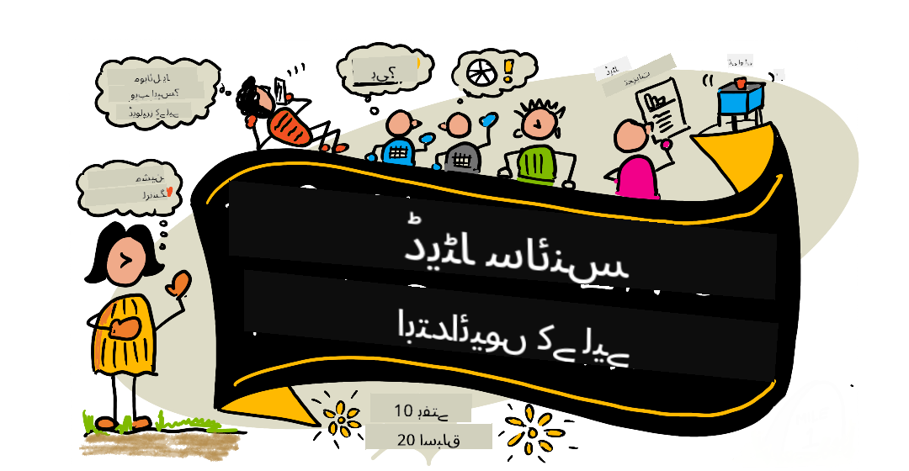

<!--
CO_OP_TRANSLATOR_METADATA:
{
  "original_hash": "dd9a1deb4da680b2cf11ba2e9f5a0a6e",
  "translation_date": "2025-09-29T21:32:23+00:00",
  "source_file": "README.md",
  "language_code": "ur"
}
-->
# ڈیٹا سائنس برائے ابتدائی - ایک نصاب

Azure Cloud Advocates نے Microsoft میں ایک 10 ہفتوں، 20 اسباق پر مشتمل نصاب پیش کیا ہے جو مکمل طور پر ڈیٹا سائنس کے بارے میں ہے۔ ہر سبق میں پری-سبق اور پوسٹ-سبق کوئز، سبق مکمل کرنے کے لیے تحریری ہدایات، ایک حل، اور ایک اسائنمنٹ شامل ہے۔ ہمارا پروجیکٹ پر مبنی طریقہ کار آپ کو سیکھنے کے دوران بنانے کی اجازت دیتا ہے، جو نئے ہنر کو یاد رکھنے کا ایک مؤثر طریقہ ہے۔

**ہمارے مصنفین کا دل سے شکریہ:** [جیسمن گریناوے](https://www.twitter.com/paladique)، [دیمتری سوشنیکوف](http://soshnikov.com)، [نیتیا نرسمہن](https://twitter.com/nitya)، [جیلن میکگی](https://twitter.com/JalenMcG)، [جین لوپر](https://twitter.com/jenlooper)، [ماود لیوی](https://twitter.com/maudstweets)، [ٹفنی سوٹیر](https://twitter.com/TiffanySouterre)، [کرسٹوفر ہیریسن](https://www.twitter.com/geektrainer)۔

**🙏 خصوصی شکریہ 🙏 ہمارے [Microsoft Student Ambassador](https://studentambassadors.microsoft.com/) مصنفین، جائزہ لینے والوں اور مواد کے تعاون کرنے والوں کا،** خاص طور پر آریان اروڑا، [ادیتیہ گرگ](https://github.com/AdityaGarg00)، [الوندرا سانچیز](https://www.linkedin.com/in/alondra-sanchez-molina/)، [انکیتا سنگھ](https://www.linkedin.com/in/ankitasingh007)، [انپم مشرا](https://www.linkedin.com/in/anupam--mishra/)، [ارپیتا داس](https://www.linkedin.com/in/arpitadas01/)، چھائل بہاری دوبے، [دیبری نسوفور](https://www.linkedin.com/in/dibrinsofor)، [دیشیتا بھاسین](https://www.linkedin.com/in/dishita-bhasin-7065281bb)، [مجید صافی](https://www.linkedin.com/in/majd-s/)، [میکس بلوم](https://www.linkedin.com/in/max-blum-6036a1186/)، [میگوئل کوریا](https://www.linkedin.com/in/miguelmque/)، [محمد افتخار (افتو) ابن جلال](https://twitter.com/iftu119)، [نورین تبسم](https://www.linkedin.com/in/nawrin-tabassum)، [ریمنڈ وانگسا پترا](https://www.linkedin.com/in/raymond-wp/)، [روہت یادو](https://www.linkedin.com/in/rty2423)، سمردھی شرما، [سانیا سنہا](https://www.linkedin.com/mwlite/in/sanya-sinha-13aab1200)، [شینا نرولا](https://www.linkedin.com/in/sheena-narua-n/)، [توقیر احمد](https://www.linkedin.com/in/tauqeerahmad5201/)، یوگندر سنگھ پاوار، [ودوشی گپتا](https://www.linkedin.com/in/vidushi-gupta07/)، [جسلین سوندھی](https://www.linkedin.com/in/jasleen-sondhi/)۔

||
|:---:|
| ڈیٹا سائنس برائے ابتدائی - _اسکیچ نوٹ از [@nitya](https://twitter.com/nitya)_ |

### 🌐 کثیر زبان کی حمایت

#### GitHub ایکشن کے ذریعے سپورٹ (خودکار اور ہمیشہ اپ ڈیٹ)

[فرانسیسی](../fr/README.md) | [ہسپانوی](../es/README.md) | [جرمن](../de/README.md) | [روسی](../ru/README.md) | [عربی](../ar/README.md) | [فارسی](../fa/README.md) | [اردو](./README.md) | [چینی (سادہ)](../zh/README.md) | [چینی (روایتی، مکاؤ)](../mo/README.md) | [چینی (روایتی، ہانگ کانگ)](../hk/README.md) | [چینی (روایتی، تائیوان)](../tw/README.md) | [جاپانی](../ja/README.md) | [کوریائی](../ko/README.md) | [ہندی](../hi/README.md) | [بنگالی](../bn/README.md) | [مراٹھی](../mr/README.md) | [نیپالی](../ne/README.md) | [پنجابی (گرمکھی)](../pa/README.md) | [پرتگالی (پرتگال)](../pt/README.md) | [پرتگالی (برازیل)](../br/README.md) | [اطالوی](../it/README.md) | [پولش](../pl/README.md) | [ترکی](../tr/README.md) | [یونانی](../el/README.md) | [تھائی](../th/README.md) | [سویڈش](../sv/README.md) | [ڈینش](../da/README.md) | [نارویجین](../no/README.md) | [فنش](../fi/README.md) | [ڈچ](../nl/README.md) | [عبرانی](../he/README.md) | [ویتنامی](../vi/README.md) | [انڈونیشیائی](../id/README.md) | [ملائی](../ms/README.md) | [ٹیگالوگ (فلپائنی)](../tl/README.md) | [سواحلی](../sw/README.md) | [ہنگری](../hu/README.md) | [چیک](../cs/README.md) | [سلوواک](../sk/README.md) | [رومانیائی](../ro/README.md) | [بلغاریائی](../bg/README.md) | [سربیائی (سیریلک)](../sr/README.md) | [کروشین](../hr/README.md) | [سلووینیائی](../sl/README.md) | [یوکرینیائی](../uk/README.md) | [برمی (میانمار)](../my/README.md)

**اگر آپ اضافی زبانوں میں ترجمہ چاہتے ہیں تو، [یہاں](https://github.com/Azure/co-op-translator/blob/main/getting_started/supported-languages.md) درج زبانیں دستیاب ہیں۔**

#### ہماری کمیونٹی میں شامل ہوں 

ہمارے پاس AI کے ساتھ سیکھنے کی ایک سیریز جاری ہے، مزید جاننے اور شامل ہونے کے لیے [Learn with AI Series](https://aka.ms/learnwithai/discord) پر جائیں، 18 - 30 ستمبر، 2025۔ آپ کو GitHub Copilot کو ڈیٹا سائنس کے لیے استعمال کرنے کے ٹپس اور ٹرکس ملیں گے۔

# کیا آپ طالب علم ہیں؟

مندرجہ ذیل وسائل کے ساتھ شروعات کریں:

- [طالب علم حب صفحہ](https://docs.microsoft.com/en-gb/learn/student-hub?WT.mc_id=academic-77958-bethanycheum) اس صفحے پر آپ کو ابتدائی وسائل، طالب علم پیک اور یہاں تک کہ مفت سرٹیفکیٹ واؤچر حاصل کرنے کے طریقے ملیں گے۔ یہ ایک صفحہ ہے جسے آپ بک مارک کرنا چاہیں گے اور وقتاً فوقتاً چیک کریں گے کیونکہ ہم کم از کم ماہانہ مواد تبدیل کرتے ہیں۔
- [Microsoft Learn Student Ambassadors](https://studentambassadors.microsoft.com?WT.mc_id=academic-77958-bethanycheum) ایک عالمی کمیونٹی میں شامل ہوں، یہ Microsoft میں آپ کے داخلے کا راستہ ہو سکتا ہے۔

# شروعات کیسے کریں

> **اساتذہ**: ہم نے [کچھ تجاویز شامل کی ہیں](for-teachers.md) کہ اس نصاب کو کیسے استعمال کیا جائے۔ ہمیں آپ کی رائے [ہمارے بحث فورم](https://github.com/microsoft/Data-Science-For-Beginners/discussions) میں پسند آئے گی!

> **[طلباء](https://aka.ms/student-page)**: اس نصاب کو خود استعمال کرنے کے لیے، پورے ریپو کو فورک کریں اور خود سے مشقیں مکمل کریں، پری-لیکچر کوئز سے شروع کریں۔ پھر لیکچر پڑھیں اور باقی سرگرمیاں مکمل کریں۔ کوشش کریں کہ اسباق کو سمجھ کر پروجیکٹس بنائیں بجائے اس کے کہ حل کوڈ کو کاپی کریں؛ تاہم، وہ کوڈ ہر پروجیکٹ پر مبنی سبق کے /solutions فولڈرز میں دستیاب ہے۔ ایک اور خیال یہ ہو سکتا ہے کہ دوستوں کے ساتھ ایک اسٹڈی گروپ بنائیں اور مواد کو ایک ساتھ دیکھیں۔ مزید مطالعہ کے لیے، ہم [Microsoft Learn](https://docs.microsoft.com/en-us/users/jenlooper-2911/collections/qprpajyoy3x0g7?WT.mc_id=academic-77958-bethanycheum) کی سفارش کرتے ہیں۔

## ٹیم سے ملاقات کریں

**Gif از** [محیط جیسل](https://www.linkedin.com/in/mohitjaisal)

> 🎥 اوپر دی گئی تصویر پر کلک کریں تاکہ پروجیکٹ اور اسے بنانے والے افراد کے بارے میں ویڈیو دیکھ سکیں!

## تدریسی طریقہ کار

ہم نے اس نصاب کو بناتے وقت دو تدریسی اصول اپنائے ہیں: یہ یقینی بنانا کہ یہ پروجیکٹ پر مبنی ہے اور اس میں بار بار کوئز شامل ہیں۔ اس سیریز کے اختتام تک، طلباء ڈیٹا سائنس کے بنیادی اصول سیکھ چکے ہوں گے، جن میں اخلاقی تصورات، ڈیٹا کی تیاری، ڈیٹا کے ساتھ کام کرنے کے مختلف طریقے، ڈیٹا کی بصری نمائندگی، ڈیٹا کا تجزیہ، ڈیٹا سائنس کے حقیقی دنیا کے استعمال کے کیسز، اور مزید شامل ہیں۔

اس کے علاوہ، کلاس سے پہلے ایک کم دباؤ والا کوئز طالب علم کو کسی موضوع کو سیکھنے کی طرف راغب کرتا ہے، جبکہ کلاس کے بعد دوسرا کوئز مزید یادداشت کو یقینی بناتا ہے۔ یہ نصاب لچکدار اور دلچسپ بنایا گیا ہے اور اسے مکمل یا جزوی طور پر لیا جا سکتا ہے۔ پروجیکٹس چھوٹے شروع ہوتے ہیں اور 10 ہفتوں کے سائیکل کے اختتام تک بتدریج پیچیدہ ہو جاتے ہیں۔

> ہمارا [Code of Conduct](CODE_OF_CONDUCT.md)، [Contributing](CONTRIBUTING.md)، [Translation](TRANSLATIONS.md) گائیڈ لائنز دیکھیں۔ ہم آپ کی تعمیری رائے کا خیر مقدم کرتے ہیں!

## ہر سبق میں شامل ہے:

- اختیاری اسکیچ نوٹ
- اختیاری اضافی ویڈیو
- پری-سبق وارم اپ کوئز
- تحریری سبق
- پروجیکٹ پر مبنی اسباق کے لیے، پروجیکٹ بنانے کے مرحلہ وار گائیڈز
- علم کی جانچ
- ایک چیلنج
- اضافی مطالعہ
- اسائنمنٹ
- [پوسٹ-سبق کوئز](https://ff-quizzes.netlify.app/en/)

> **کوئز کے بارے میں ایک نوٹ**: تمام کوئز Quiz-App فولڈر میں موجود ہیں، کل 40 کوئز، ہر ایک میں تین سوالات۔ یہ اسباق کے اندر سے لنک کیے گئے ہیں، لیکن کوئز ایپ کو مقامی طور پر چلایا جا سکتا ہے یا Azure پر تعینات کیا جا سکتا ہے؛ `quiz-app` فولڈر میں دی گئی ہدایات پر عمل کریں۔ یہ بتدریج مقامی زبانوں میں ترجمہ کیے جا رہے ہیں۔

## اسباق
||
|:---:|
| ڈیٹا سائنس کے ابتدائی افراد کے لیے: روڈ میپ - _اسکیچ نوٹ از [@nitya](https://twitter.com/nitya)_ |

| سبق نمبر | موضوع | سبق کی گروپ بندی | سیکھنے کے مقاصد | منسلک سبق | مصنف |
| :-----------: | :----------------------------------------: | :--------------------------------------------------: | :-----------------------------------------------------------------------------------------------------------------------------------------------------------------------: | :---------------------------------------------------------------------: | :----: |
| 01 | ڈیٹا سائنس کی تعریف | [تعارف](1-Introduction/README.md) | ڈیٹا سائنس کے بنیادی تصورات سیکھیں اور یہ مصنوعی ذہانت، مشین لرننگ، اور بڑے ڈیٹا سے کیسے متعلق ہے۔ | [سبق](1-Introduction/01-defining-data-science/README.md) [ویڈیو](https://youtu.be/beZ7Mb_oz9I) | [Dmitry](http://soshnikov.com) |
| 02 | ڈیٹا سائنس اخلاقیات | [تعارف](1-Introduction/README.md) | ڈیٹا اخلاقیات کے تصورات، چیلنجز اور فریم ورک۔ | [سبق](1-Introduction/02-ethics/README.md) | [Nitya](https://twitter.com/nitya) |
| 03 | ڈیٹا کی تعریف | [تعارف](1-Introduction/README.md) | ڈیٹا کو کیسے درجہ بندی کیا جاتا ہے اور اس کے عام ذرائع۔ | [سبق](1-Introduction/03-defining-data/README.md) | [Jasmine](https://www.twitter.com/paladique) |
| 04 | شماریات اور احتمال کا تعارف | [تعارف](1-Introduction/README.md) | ڈیٹا کو سمجھنے کے لیے احتمال اور شماریات کی ریاضیاتی تکنیکیں۔ | [سبق](1-Introduction/04-stats-and-probability/README.md) [ویڈیو](https://youtu.be/Z5Zy85g4Yjw) | [Dmitry](http://soshnikov.com) |
| 05 | تعلقاتی ڈیٹا کے ساتھ کام کرنا | [ڈیٹا کے ساتھ کام کرنا](2-Working-With-Data/README.md) | تعلقاتی ڈیٹا کا تعارف اور SQL (جسے "سی-کوئل" کہا جاتا ہے) کے ذریعے تعلقاتی ڈیٹا کو دریافت اور تجزیہ کرنے کی بنیادی باتیں۔ | [سبق](2-Working-With-Data/05-relational-databases/README.md) | [Christopher](https://www.twitter.com/geektrainer) | | |
| 06 | NoSQL ڈیٹا کے ساتھ کام کرنا | [ڈیٹا کے ساتھ کام کرنا](2-Working-With-Data/README.md) | غیر تعلقاتی ڈیٹا کا تعارف، اس کی مختلف اقسام اور دستاویز ڈیٹا بیس کو دریافت اور تجزیہ کرنے کی بنیادی باتیں۔ | [سبق](2-Working-With-Data/06-non-relational/README.md) | [Jasmine](https://twitter.com/paladique)|
| 07 | پائتھون کے ساتھ کام کرنا | [ڈیٹا کے ساتھ کام کرنا](2-Working-With-Data/README.md) | پائتھون کے ذریعے ڈیٹا کو دریافت کرنے کے لیے بنیادی باتیں، جیسے Pandas لائبریری۔ پائتھون پروگرامنگ کی بنیادی سمجھ ضروری ہے۔ | [سبق](2-Working-With-Data/07-python/README.md) [ویڈیو](https://youtu.be/dZjWOGbsN4Y) | [Dmitry](http://soshnikov.com) |
| 08 | ڈیٹا کی تیاری | [ڈیٹا کے ساتھ کام کرنا](2-Working-With-Data/README.md) | ڈیٹا کو صاف کرنے اور تبدیل کرنے کے لیے تکنیکیں، تاکہ گمشدہ، غلط یا نامکمل ڈیٹا کے چیلنجز سے نمٹا جا سکے۔ | [سبق](2-Working-With-Data/08-data-preparation/README.md) | [Jasmine](https://www.twitter.com/paladique) |
| 09 | مقداروں کی بصری نمائندگی | [ڈیٹا کی بصری نمائندگی](3-Data-Visualization/README.md) | سیکھیں کہ Matplotlib کا استعمال کرتے ہوئے پرندوں کے ڈیٹا کو کیسے بصری بنایا جائے 🦆 | [سبق](3-Data-Visualization/09-visualization-quantities/README.md) | [Jen](https://twitter.com/jenlooper) |
| 10 | ڈیٹا کی تقسیم کی بصری نمائندگی | [ڈیٹا کی بصری نمائندگی](3-Data-Visualization/README.md) | وقفے کے اندر مشاہدات اور رجحانات کی بصری نمائندگی۔ | [سبق](3-Data-Visualization/10-visualization-distributions/README.md) | [Jen](https://twitter.com/jenlooper) |
| 11 | تناسب کی بصری نمائندگی | [ڈیٹا کی بصری نمائندگی](3-Data-Visualization/README.md) | الگ اور گروپ شدہ فیصد کی بصری نمائندگی۔ | [سبق](3-Data-Visualization/11-visualization-proportions/README.md) | [Jen](https://twitter.com/jenlooper) |
| 12 | تعلقات کی بصری نمائندگی | [ڈیٹا کی بصری نمائندگی](3-Data-Visualization/README.md) | ڈیٹا کے سیٹ اور ان کے متغیرات کے درمیان تعلقات اور ارتباط کی بصری نمائندگی۔ | [سبق](3-Data-Visualization/12-visualization-relationships/README.md) | [Jen](https://twitter.com/jenlooper) |
| 13 | بامعنی بصری نمائندگی | [ڈیٹا کی بصری نمائندگی](3-Data-Visualization/README.md) | آپ کی بصری نمائندگی کو مؤثر مسئلہ حل کرنے اور بصیرت کے لیے قیمتی بنانے کے لیے تکنیکیں اور رہنمائی۔ | [سبق](3-Data-Visualization/13-meaningful-visualizations/README.md) | [Jen](https://twitter.com/jenlooper) |
| 14 | ڈیٹا سائنس کے لائف سائیکل کا تعارف | [لائف سائیکل](4-Data-Science-Lifecycle/README.md) | ڈیٹا سائنس کے لائف سائیکل کا تعارف اور ڈیٹا حاصل کرنے اور نکالنے کا پہلا مرحلہ۔ | [سبق](4-Data-Science-Lifecycle/14-Introduction/README.md) | [Jasmine](https://twitter.com/paladique) |
| 15 | تجزیہ کرنا | [لائف سائیکل](4-Data-Science-Lifecycle/README.md) | ڈیٹا سائنس کے لائف سائیکل کا یہ مرحلہ ڈیٹا کو تجزیہ کرنے کی تکنیکوں پر مرکوز ہے۔ | [سبق](4-Data-Science-Lifecycle/15-analyzing/README.md) | [Jasmine](https://twitter.com/paladique) | | |
| 16 | مواصلات | [لائف سائیکل](4-Data-Science-Lifecycle/README.md) | ڈیٹا سائنس کے لائف سائیکل کا یہ مرحلہ ڈیٹا سے حاصل کردہ بصیرت کو اس انداز میں پیش کرنے پر مرکوز ہے جو فیصلہ سازوں کے لیے سمجھنا آسان ہو۔ | [سبق](4-Data-Science-Lifecycle/16-communication/README.md) | [Jalen](https://twitter.com/JalenMcG) | | |
| 17 | کلاؤڈ میں ڈیٹا سائنس | [کلاؤڈ ڈیٹا](5-Data-Science-In-Cloud/README.md) | اس سبق کی سیریز کلاؤڈ میں ڈیٹا سائنس اور اس کے فوائد کا تعارف کراتی ہے۔ | [سبق](5-Data-Science-In-Cloud/17-Introduction/README.md) | [Tiffany](https://twitter.com/TiffanySouterre) اور [Maud](https://twitter.com/maudstweets) |
| 18 | کلاؤڈ میں ڈیٹا سائنس | [کلاؤڈ ڈیٹا](5-Data-Science-In-Cloud/README.md) | کم کوڈ ٹولز کا استعمال کرتے ہوئے ماڈلز کی تربیت۔ |[سبق](5-Data-Science-In-Cloud/18-Low-Code/README.md) | [Tiffany](https://twitter.com/TiffanySouterre) اور [Maud](https://twitter.com/maudstweets) |
| 19 | کلاؤڈ میں ڈیٹا سائنس | [کلاؤڈ ڈیٹا](5-Data-Science-In-Cloud/README.md) | Azure Machine Learning Studio کے ساتھ ماڈلز کو تعینات کرنا۔ | [سبق](5-Data-Science-In-Cloud/19-Azure/README.md)| [Tiffany](https://twitter.com/TiffanySouterre) اور [Maud](https://twitter.com/maudstweets) |
| 20 | جنگلی ماحول میں ڈیٹا سائنس | [جنگلی ماحول میں](6-Data-Science-In-Wild/README.md) | حقیقی دنیا میں ڈیٹا سائنس پر مبنی منصوبے۔ | [سبق](6-Data-Science-In-Wild/20-Real-World-Examples/README.md) | [Nitya](https://twitter.com/nitya) |

## GitHub Codespaces

اس نمونے کو Codespace میں کھولنے کے لیے درج ذیل مراحل پر عمل کریں:
1. Code ڈراپ ڈاؤن مینو پر کلک کریں اور Open with Codespaces آپشن منتخب کریں۔
2. پین کے نیچے + New codespace منتخب کریں۔
مزید معلومات کے لیے، [GitHub دستاویزات](https://docs.github.com/en/codespaces/developing-in-codespaces/creating-a-codespace-for-a-repository#creating-a-codespace) دیکھیں۔

## VSCode Remote - Containers
اپنے مقامی کمپیوٹر اور VSCode کا استعمال کرتے ہوئے اس ریپو کو کنٹینر میں کھولنے کے لیے درج ذیل مراحل پر عمل کریں، VS Code Remote - Containers ایکسٹینشن کا استعمال کرتے ہوئے:

1. اگر یہ آپ کا پہلی بار ڈیولپمنٹ کنٹینر استعمال کرنا ہے، تو براہ کرم یقینی بنائیں کہ آپ کا سسٹم پری ریکوائرمنٹس کو پورا کرتا ہے (یعنی Docker انسٹال ہو) [شروع کرنے کی دستاویزات](https://code.visualstudio.com/docs/devcontainers/containers#_getting-started) میں۔

اس ریپوزٹری کو استعمال کرنے کے لیے، آپ یا تو ریپوزٹری کو ایک الگ تھلگ Docker والیوم میں کھول سکتے ہیں:

**نوٹ**: اندرونی طور پر، یہ Remote-Containers: **Clone Repository in Container Volume...** کمانڈ استعمال کرے گا تاکہ سورس کوڈ کو مقامی فائل سسٹم کے بجائے Docker والیوم میں کلون کیا جا سکے۔ [Volumes](https://docs.docker.com/storage/volumes/) کنٹینر ڈیٹا کو برقرار رکھنے کے لیے ترجیحی طریقہ کار ہیں۔

یا مقامی طور پر کلون یا ڈاؤن لوڈ شدہ ریپوزٹری کا ورژن کھولیں:

- اس ریپوزٹری کو اپنے مقامی فائل سسٹم پر کلون کریں۔
- F1 دبائیں اور **Remote-Containers: Open Folder in Container...** کمانڈ منتخب کریں۔
- اس فولڈر کی کلون شدہ کاپی منتخب کریں، کنٹینر کے شروع ہونے کا انتظار کریں، اور چیزوں کو آزمانا شروع کریں۔

## آف لائن رسائی

آپ اس دستاویزات کو آف لائن Docsify کا استعمال کرتے ہوئے چلا سکتے ہیں۔ اس ریپو کو فورک کریں، [Docsify انسٹال کریں](https://docsify.js.org/#/quickstart) اپنے مقامی کمپیوٹر پر، پھر اس ریپو کے روٹ فولڈر میں `docsify serve` ٹائپ کریں۔ ویب سائٹ آپ کے لوکل ہوسٹ پر پورٹ 3000 پر پیش کی جائے گی: `localhost:3000`۔

> نوٹ کریں، نوٹ بکس Docsify کے ذریعے پیش نہیں کیے جائیں گے، لہذا جب آپ کو نوٹ بک چلانے کی ضرورت ہو، تو اسے الگ سے VS Code میں Python کرنل چلاتے ہوئے کریں۔

## دیگر نصاب

ہماری ٹیم دیگر نصاب بھی تیار کرتی ہے! دیکھیں:

- [Edge AI for Beginners](https://aka.ms/edgeai-for-beginners)
- [AI Agents for Beginners](https://aka.ms/ai-agents-beginners)
- [Generative AI for Beginners](https://aka.ms/genai-beginners)
- [Generative AI for Beginners .NET](https://github.com/microsoft/Generative-AI-for-beginners-dotnet)
- [Generative AI with JavaScript](https://github.com/microsoft/generative-ai-with-javascript)
- [Generative AI with Java](https://aka.ms/genaijava)
- [AI for Beginners](https://aka.ms/ai-beginners)
- [Data Science for Beginners](https://aka.ms/datascience-beginners)
- [Bash for Beginners](https://github.com/microsoft/bash-for-beginners)
- [ML for Beginners](https://aka.ms/ml-beginners)
- [Cybersecurity for Beginners](https://github.com/microsoft/Security-101) 
- [Web Dev for Beginners](https://aka.ms/webdev-beginners)
- [IoT for Beginners](https://aka.ms/iot-beginners)
- [Machine Learning for Beginners](https://aka.ms/ml-beginners)
- [XR Development for Beginners](https://aka.ms/xr-dev-for-beginners)
- [Mastering GitHub Copilot for AI Paired Programming](https://aka.ms/GitHubCopilotAI)
- [XR Development for Beginners](https://github.com/microsoft/xr-development-for-beginners)
- [Mastering GitHub Copilot for C#/.NET Developers](https://github.com/microsoft/mastering-github-copilot-for-dotnet-csharp-developers)
- [Choose Your Own Copilot Adventure](https://github.com/microsoft/CopilotAdventures)

---

**ڈسکلیمر**:  
یہ دستاویز AI ترجمہ سروس [Co-op Translator](https://github.com/Azure/co-op-translator) کا استعمال کرتے ہوئے ترجمہ کی گئی ہے۔ ہم درستگی کے لیے کوشش کرتے ہیں، لیکن براہ کرم آگاہ رہیں کہ خودکار ترجمے میں غلطیاں یا غیر درستیاں ہو سکتی ہیں۔ اصل دستاویز کو اس کی اصل زبان میں مستند ذریعہ سمجھا جانا چاہیے۔ اہم معلومات کے لیے، پیشہ ور انسانی ترجمہ کی سفارش کی جاتی ہے۔ ہم اس ترجمے کے استعمال سے پیدا ہونے والی کسی بھی غلط فہمی یا غلط تشریح کے ذمہ دار نہیں ہیں۔