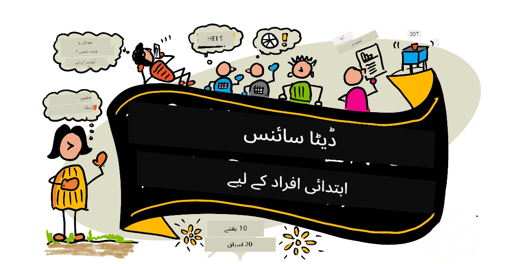
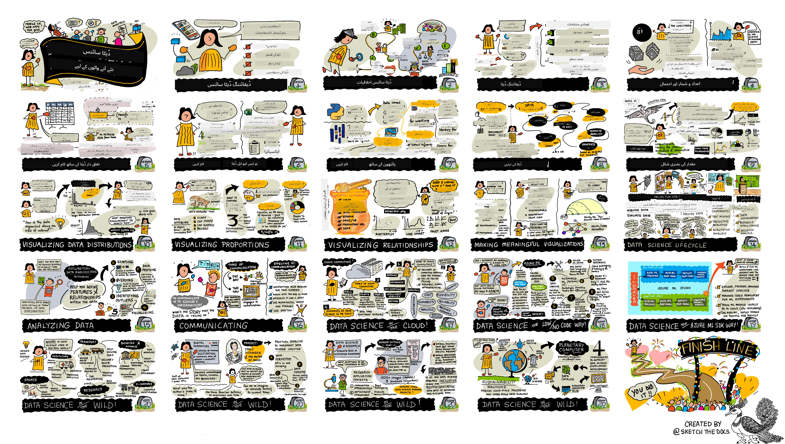

# ڈیٹا سائنس برائے ابتدائی افراد - ایک نصاب

[](https://github.com/codespaces/new?hide_repo_select=true&ref=main&repo=344191198)

[](https://github.com/microsoft/Data-Science-For-Beginners/blob/master/LICENSE)
[](https://GitHub.com/microsoft/Data-Science-For-Beginners/graphs/contributors/)
[](https://GitHub.com/microsoft/Data-Science-For-Beginners/issues/)
[](https://GitHub.com/microsoft/Data-Science-For-Beginners/pulls/)
[](http://makeapullrequest.com)

[](https://GitHub.com/microsoft/Data-Science-For-Beginners/watchers/)
[](https://GitHub.com/microsoft/Data-Science-For-Beginners/network/)
[](https://GitHub.com/microsoft/Data-Science-For-Beginners/stargazers/)


[](https://discord.gg/nTYy5BXMWG)

[](https://aka.ms/foundry/forum)

مائیکروسافٹ میں آزور کلاؤڈ وکلاء خوش ہیں کہ وہ آپ کو 10 ہفتوں اور 20 اسباق پر مشتمل ایک نصاب پیش کریں جو مکمل طور پر ڈیٹا سائنس کے بارے میں ہے۔ ہر سبق میں پیشگی اور بعد میں چھوٹے کوئز، سبق مکمل کرنے کی تحریری ہدایات، حل، اور ایک اسائنمنٹ شامل ہے۔ ہمارا پراجیکٹ پر مبنی تعلیمی انداز آپ کو سیکھنے کے دوران بنانے کا موقع دیتا ہے، جو نئی مہارتوں کو مستحکم کرنے کا ایک مؤثر طریقہ ہے۔

**ہمارے مصنفین کا تہہ دل سے شکریہ:** [جاسمین گرینوے](https://www.twitter.com/paladique), [ڈمیٹری سوشنیکو](http://soshnikov.com), [نیتیا نرسیمن](https://twitter.com/nitya), [جی لین مک گھی](https://twitter.com/JalenMcG), [جن لوپر](https://twitter.com/jenlooper), [موڈ لیوی](https://twitter.com/maudstweets), [ٹفنی سائوٹر](https://twitter.com/TiffanySouterre), [کرسٹوفر ہیریسن](https://www.twitter.com/geektrainer)۔

**🙏 خصوصی شکریہ 🙏 ہمارے [مائیکروسافٹ اسٹوڈنٹ ایمبیسڈر](https://studentambassadors.microsoft.com/) مصنفین، جائزہ لینے والوں اور مواد کے شراکت داروں کو،** خاص طور پر آریان اروڑا، [ادیتیہ گرگ](https://github.com/AdityaGarg00), [الونڈرہ سانچیز](https://www.linkedin.com/in/alondra-sanchez-molina/), [انکیتا سنگھ](https://www.linkedin.com/in/ankitasingh007), [انوپم مشرا](https://www.linkedin.com/in/anupam--mishra/), [اربیتا داس](https://www.linkedin.com/in/arpitadas01/), چھیل بہاری دوبے، [ڈبری نسوفور](https://www.linkedin.com/in/dibrinsofor), [دشیتا بھاسن](https://www.linkedin.com/in/dishita-bhasin-7065281bb), [مجد صفی](https://www.linkedin.com/in/majd-s/), [میکس بلم](https://www.linkedin.com/in/max-blum-6036a1186/), [میگوئل کوریا](https://www.linkedin.com/in/miguelmque/), [محمد افتخار (افتو) ابن جلال](https://twitter.com/iftu119), [نورین طبسم](https://www.linkedin.com/in/nawrin-tabassum), [رایمونڈ وانگسا پوترا](https://www.linkedin.com/in/raymond-wp/), [روہت یادو](https://www.linkedin.com/in/rty2423), سامردھی شرما، [سانیہ سنہا](https://www.linkedin.com/mwlite/in/sanya-sinha-13aab1200),
[شینا نارولا](https://www.linkedin.com/in/sheena-narua-n/), [توقیر احمد](https://www.linkedin.com/in/tauqeerahmad5201/), یوگندر سنگھ پووار، [ویدوشی گپتا](https://www.linkedin.com/in/vidushi-gupta07/), [جسلیں سندھی](https://www.linkedin.com/in/jasleen-sondhi/)

||
|:---:|
| ڈیٹا سائنس برائے ابتدائی افراد - _اسکیچ نوٹ بذریعہ [@nitya](https://twitter.com/nitya)_ |

### 🌐 کثیراللسانی حمایت

#### گیٹ ہب ایکشن کے ذریعے حمایت یافتہ (خودکار اور ہمیشہ تازہ ترین)

<!-- CO-OP TRANSLATOR LANGUAGES TABLE START -->
[عربی](../ar/README.md) | [بنگالی](../bn/README.md) | [بلغاریائی](../bg/README.md) | [برمی (میانمار)](../my/README.md) | [چینی (سادہ)](../zh-CN/README.md) | [چینی (روایتی، ہانگ کانگ)](../zh-HK/README.md) | [چینی (روایتی، میکاؤ)](../zh-MO/README.md) | [چینی (روایتی، تائیوان)](../zh-TW/README.md) | [کروشین](../hr/README.md) | [چیک](../cs/README.md) | [ڈینش](../da/README.md) | [ڈچ](../nl/README.md) | [ایسٹونین](../et/README.md) | [فنیش](../fi/README.md) | [فرانسیسی](../fr/README.md) | [جرمن](../de/README.md) | [یونانی](../el/README.md) | [عبرانی](../he/README.md) | [ہندی](../hi/README.md) | [ہنگرین](../hu/README.md) | [انڈونیشین](../id/README.md) | [اطالوی](../it/README.md) | [جاپانی](../ja/README.md) | [کنڑ](../kn/README.md) | [خمیر](../km/README.md) | [کوریائی](../ko/README.md) | [لتھوانیائی](../lt/README.md) | [مالے](../ms/README.md) | [مالایالم](../ml/README.md) | [مراٹھی](../mr/README.md) | [نیپالی](../ne/README.md) | [نائیجیرین پیجین](../pcm/README.md) | [ناروے](../no/README.md) | [فارسی](../fa/README.md) | [پولش](../pl/README.md) | [پرتگالی (برازیل)](../pt-BR/README.md) | [پرتگالی (پرتگال)](../pt-PT/README.md) | [پنجابی (گرمکھی)](../pa/README.md) | [رومانیائی](../ro/README.md) | [روسی](../ru/README.md) | [سربیائی (سریلیک)](../sr/README.md) | [سلوواک](../sk/README.md) | [سلووینیائی](../sl/README.md) | [ہسپانوی](../es/README.md) | [سواحلی](../sw/README.md) | [سویڈش](../sv/README.md) | [ٹاگالوگ (فلپائنی)](../tl/README.md) | [تمل](../ta/README.md) | [تیلوگو](../te/README.md) | [تھائی](../th/README.md) | [ترکی](../tr/README.md) | [یوکرینیئن](../uk/README.md) | [اردو](./README.md) | [ویتنامی](../vi/README.md)

> **کیا آپ مقامی طور پر کلون کرنا پسند کریں گے؟**
>
> اس مخزن میں 50+ زبانوں کے تراجم شامل ہیں جو ڈاؤن لوڈ کا حجم نمایاں طور پر بڑھاتے ہیں۔ بغیر تراجم کے کلون کرنے کے لیے، sparse checkout استعمال کریں:
>
> **باش / میک او ایس / لینکس:**
> ```bash
> git clone --filter=blob:none --sparse https://github.com/microsoft/Data-Science-For-Beginners.git
> cd Data-Science-For-Beginners
> git sparse-checkout set --no-cone '/*' '!translations' '!translated_images'
> ```
>
> **CMD (ونڈوز):**
> ```cmd
> git clone --filter=blob:none --sparse https://github.com/microsoft/Data-Science-For-Beginners.git
> cd Data-Science-For-Beginners
> git sparse-checkout set --no-cone "/*" "!translations" "!translated_images"
> ```
>
> اس سے آپ کو تیزی سے ڈاؤن لوڈ کے ساتھ کورس مکمل کرنے کے لیے تمام ضرورت کی چیزیں مل جائیں گی۔
<!-- CO-OP TRANSLATOR LANGUAGES TABLE END -->

**اگر آپ مزید زبانوں کی حمایت چاہتے ہیں تو وہ یہاں درج ہیں [یہاں](https://github.com/Azure/co-op-translator/blob/main/getting_started/supported-languages.md)**

#### ہماری کمیونٹی میں شامل ہوں 
[](https://discord.gg/nTYy5BXMWG)

ہمارا ڈسکارڈ پر "AI کے ساتھ سیکھیں" سیریز جاری ہے، مزید جاننے اور شامل ہونے کے لیے ہماری ویب سائٹ پر تشریف لائیں [AI کے ساتھ سیکھیں سیریز](https://aka.ms/learnwithai/discord) 18 - 30 ستمبر، 2025۔ آپ کو گیٹ ہب کوپائلٹ کے استعمال کے ٹپس اور ٹرکس ملیں گے جو ڈیٹا سائنس کے لیے ہیں۔


# کیا آپ طالب علم ہیں؟

مندرجہ ذیل وسائل کے ساتھ آغاز کریں:

- [طالب علم ہب صفحہ](https://docs.microsoft.com/en-gb/learn/student-hub?WT.mc_id=academic-77958-bethanycheum) اس صفحہ پر آپ کو ابتدائی وسائل، اسٹوڈنٹ پیکس اور مفت سرٹیفکیٹ واؤچر حاصل کرنے کے طریقے ملیں گے۔ یہ ایک ایسا صفحہ ہے جسے آپ کو بک مارک کرنا چاہیے اور وقتاً فوقتاً چیک کرنا چاہیے کیونکہ ہم کم از کم ماہانہ طور پر مواد کو تبدیل کرتے رہتے ہیں۔
- [مائیکروسافٹ لرن اسٹوڈنٹ ایمبیسیڈرز](https://studentambassadors.microsoft.com?WT.mc_id=academic-77958-bethanycheum) ایک عالمی طالب علم ایمبیسڈر کمیونٹی میں شامل ہوں، یہ آپ کا مائیکروسافٹ میں داخلے کا ذریعہ ہو سکتا ہے۔

# شروعات کیسے کریں

## 📚 دستاویزات

- **[انسٹالیشن گائیڈ](INSTALLATION.md)** - ابتدائی افراد کے لیے قدم بہ قدم سیٹ اپ ہدایات
- **[استعمال کی گائیڈ](USAGE.md)** - مثالیں اور عمومی ورک فلو
- **[مسائل کا حل](TROUBLESHOOTING.md)** - عام مسائل کے حل
- **[شراکت کی گائیڈ](CONTRIBUTING.md)** - اس پروجیکٹ میں شراکت کیسے کریں
- **[اساتذہ کے لیے](for-teachers.md)** - تدریس کی رہنمائی اور کلاس روم کے وسائل

## 👨‍🎓 طلباء کے لیے
> **مکمل نو آموز:** کیا آپ ڈیٹا سائنس میں نئے ہیں؟ ہمارے [آسان اور وضاحتی مثالوں](examples/README.md) سے شروع کریں! یہ سادہ اور عمدہ تبصروں والی مثالیں آپ کو بنیادی باتیں سمجھنے میں مدد دیں گی اس سے پہلے کہ آپ پورے نصاب میں جائیں۔
> **[طلباء](https://aka.ms/student-page)**: اس نصاب کو خود استعمال کرنے کے لیے، پورے ریپوزٹری کو فورک کریں اور خود مشقیں مکمل کریں، پہلے پری لیکچر کوئز سے شروع کریں۔ پھر لیکچر پڑھیں اور باقی سرگرمیاں مکمل کریں۔ کوشش کریں کہ اسباق کو سمجھ کر پروجیکٹس بنائیں نہ کہ حل کے کوڈ کو کاپی کریں؛ تاہم، حل کے کوڈ ہر پروجیکٹ پر مبنی سبق کے /solutions فولڈرز میں دستیاب ہیں۔ ایک اور خیال یہ بھی ہو سکتا ہے کہ دوستوں کے ساتھ ایک مطالعہ گروپ بنائیں اور ساتھ مل کر مواد کو دیکھیں۔ مزید مطالعہ کے لیے، ہم [مائیکروسافٹ لرن](https://docs.microsoft.com/en-us/users/jenlooper-2911/collections/qprpajyoy3x0g7?WT.mc_id=academic-77958-bethanycheum) کی سفارش کرتے ہیں۔

**فوری آغاز:**
1. اپنا ماحول ترتیب دینے کے لیے [انسٹالیشن گائیڈ](INSTALLATION.md) دیکھیں
2. نصاب کے ساتھ کام کرنے کے طریقہ کار سیکھنے کے لیے [استعمال کی گائیڈ](USAGE.md) کا جائزہ لیں
3. سبق 1 سے شروع کریں اور ترتیب وار کام کریں
4. مدد کے لیے ہماری [ڈسکارڈ کمیونٹی](https://aka.ms/ds4beginners/discord) میں شامل ہوں

## 👩‍🏫 اساتذہ کے لیے
> **اساتذہ**: ہم نے [اس نصاب کو استعمال کرنے کے بارے میں کچھ تجاویز شامل کی ہیں](for-teachers.md)۔ ہمیں آپ کی رائے [ہمارے مباحثہ فورم](https://github.com/microsoft/Data-Science-For-Beginners/discussions) میں پسند آئے گی!

## ٹیم سے ملاقات کریں

[](https://youtu.be/8mzavjQSMM4 "پرومو ویڈیو")

**گف** [موہت جیسل](https://www.linkedin.com/in/mohitjaisal) کی طرف سے

> 🎥 پروجیکٹ اور اس کے بنانے والے لوگوں کے بارے میں ویڈیو کے لیے اوپر دی گئی تصویر پر کلک کریں!

## تعلیم کا طریقہ

ہم نے اس نصاب کی تیاری کے دوران دو تعلیمی اصول منتخب کیے ہیں: یہ یقینی بنانا کہ یہ پروجیکٹ پر مبنی ہو اور اس میں بار بار کوئزز شامل ہوں۔ اس سلسلے کے اختتام تک، طلباء نے ڈیٹا سائنس کے بنیادی اصول سیکھ لیے ہوں گے، جن میں اخلاقی تصورات، ڈیٹا کی تیاری، ڈیٹا کے ساتھ کام کرنے کے مختلف طریقے، ڈیٹا کی بصری نمائندگی، ڈیٹا کا تجزیہ، ڈیٹا سائنس کے حقیقی دنیا میں استعمال کے کیسز، اور بہت کچھ شامل ہے۔

اس کے علاوہ، کلاس سے پہلے ایک کم دباؤ والا کوئز موضوع سیکھنے کے لیے طالب علم کی نیت قائم کرتا ہے، جبکہ کلاس کے بعد دوسرا کوئز مزید یادداشت کو یقینی بناتا ہے۔ یہ نصاب لچکدار اور مزے دار بنانے کے لیے ڈیزائن کیا گیا ہے اور اسے مکمل یا جزوی طور پر لیا جا سکتا ہے۔ پروجیکٹس چھوٹے شروع ہوتے ہیں اور 10 ہفتوں کے دورانیے کے اختتام تک بتدریج پیچیدہ ہوتے جاتے ہیں۔

> ہمارا [اطوار کا ضابطہ](CODE_OF_CONDUCT.md)، [حصہ لینے کے اصول](CONTRIBUTING.md)، [ترجمہ](TRANSLATIONS.md) کے رہنما اصول دیکھیں۔ ہم آپ کی تعمیری رائے کا خیرمقدم کرتے ہیں!

## ہر سبق میں شامل ہے:

- اختیاری خاکہ نوٹ  
- اختیاری اضافی ویڈیو  
- سبق سے پہلے گرمائش کوئز  
- تحریری سبق  
- پروجیکٹ پر مبنی اسباق کے لیے، قدم بہ قدم رہنمائی کہ پروجیکٹ کیسے بنایا جائے  
- علم کی جانچ  
- ایک چیلنج  
- اضافی مطالعہ  
- اسباق کے بعد کا کوئز [Post-lesson quiz](https://ff-quizzes.netlify.app/en/)

> **کوئزز کے بارے میں ایک نوٹ**: تمام کوئزز Quiz-App فولڈر میں موجود ہیں، کل 40 کوئزز جن میں ہر ایک میں تین سوالات ہوتے ہیں۔ یہ اسباق کے ذریعے مربوط کیے گئے ہیں، لیکن کوئز ایپ کو مقامی طور پر چلایا جا سکتا ہے یا Azure پر تعینات کیا جا سکتا ہے؛ `quiz-app` فولڈر میں ہدایات پر عمل کریں۔ انہیں تدریجی طور پر مقامی زبان میں تبدیل کیا جا رہا ہے۔

## 🎓 شروع کرنے والوں کے لیے دوستانہ مثالیں

**ڈیٹا سائنس میں نئے ہیں؟** ہم نے ایک خاص [مثالوں کا ڈائریکٹری](examples/README.md) بنایا ہے جس میں آسان، مفصل وضاحت شدہ کوڈ ہے تاکہ آپ کو شروع کرنے میں مدد ملے:

- 🌟 **ہیلو ورلڈ** - آپ کا پہلا ڈیٹا سائنس پروگرام  
- 📂 **ڈیٹا لوڈ کرنا** - datasets کو پڑھنا اور دریافت کرنا سیکھیں  
- 📊 **سادہ تجزیہ** - شماریات کا حساب لگائیں اور پیٹرنز دریافت کریں  
- 📈 **بنیادی بصری نمائندگی** - چارٹس اور گراف بنائیں  
- 🔬 **حقیقی دنیا کا پروجیکٹ** - ابتدا سے اختتام تک مکمل ورک فلو  

ہر مثال میں ہر قدم کی تفصیلی وضاحت شامل ہے، جو نوآموزوں کے لیے بہترین ہے!

👉 **[مثالوں سے شروع کریں](examples/README.md)** 👈

## اسباق


||
|:---:|
| ڈیٹا سائنس برائے نو آموز: روڈ میپ - _خاکہ نوٹ از [@nitya](https://twitter.com/nitya)_ |


| سبق نمبر | موضوع | سبق کا گروپنگ | سیکھنے کے مقاصد | مربوط سبق | مصنف |
| :-----------: | :----------------------------------------: | :--------------------------------------------------: | :-----------------------------------------------------------------------------------------------------------------------------------------------------------------------: | :---------------------------------------------------------------------: | :----: |
| 01 | ڈیٹا سائنس کی تعریف | [تعارف](1-Introduction/README.md) | ڈیٹا سائنس کے بنیادی تصورات سیکھیں اور یہ مصنوعی ذہانت، مشین لرننگ، اور بگ ڈیٹا سے کیسے متعلق ہے۔ | [سبق](1-Introduction/01-defining-data-science/README.md) [ویڈیو](https://youtu.be/beZ7Mb_oz9I) | [دمیتری](http://soshnikov.com) |
| 02 | ڈیٹا سائنس کی اخلاقیات | [تعارف](1-Introduction/README.md) | ڈیٹا کی اخلاقیات کے تصورات، چیلنجز اور فریم ورک۔ | [سبق](1-Introduction/02-ethics/README.md) | [نیتیا](https://twitter.com/nitya) |
| 03 | ڈیٹا کی تعریف | [تعارف](1-Introduction/README.md) | ڈیٹا کی درجہ بندی اور اس کے عام ذرائع۔ | [سبق](1-Introduction/03-defining-data/README.md) | [جیسمن](https://www.twitter.com/paladique) |
| 04 | شماریات اور احتمال کا تعارف | [تعارف](1-Introduction/README.md) | ڈیٹا کو سمجھنے کے لیے احتمال اور شماریات کی ریاضیاتی تکنیکیں۔ | [سبق](1-Introduction/04-stats-and-probability/README.md) [ویڈیو](https://youtu.be/Z5Zy85g4Yjw) | [دمیتری](http://soshnikov.com) |
| 05 | تعلقاتی ڈیٹا کے ساتھ کام کرنا | [ڈیٹا کے ساتھ کام](2-Working-With-Data/README.md) | تعلقاتی ڈیٹا کا تعارف اور Structured Query Language (SQL) کے ذریعے تعلقاتی ڈیٹا کو تلاش اور تجزیہ کرنے کی بنیادی باتیں۔ | [سبق](2-Working-With-Data/05-relational-databases/README.md) | [کرسٹوفر](https://www.twitter.com/geektrainer) | | |
| 06 | NoSQL ڈیٹا کے ساتھ کام کرنا | [ڈیٹا کے ساتھ کام](2-Working-With-Data/README.md) | غیر تعلقاتی ڈیٹا کا تعارف، اس کی اقسام، اور ڈاکیومنٹ ڈیٹا بیسز کی تلاش اور تجزیہ کی بنیادی باتیں۔ | [سبق](2-Working-With-Data/06-non-relational/README.md) | [جیسمن](https://twitter.com/paladique)|
| 07 | پائتھون کے ساتھ کام کرنا | [ڈیٹا کے ساتھ کام](2-Working-With-Data/README.md) | Pandas جیسی لائبریریز کے ساتھ ڈیٹا دریافت کرنے کے لیے Python کے بنیادی اصول۔ Python پروگرامنگ کی بنیادی سمجھداری کی سفارش کی جاتی ہے۔ | [سبق](2-Working-With-Data/07-python/README.md) [ویڈیو](https://youtu.be/dZjWOGbsN4Y) | [دمیتری](http://soshnikov.com) |
| 08 | ڈیٹا کی تیاری | [ڈیٹا کے ساتھ کام](2-Working-With-Data/README.md) | ڈیٹا صاف کرنے اور اس کی تبدیلی کے موضوعات تاکہ گمشدہ، غیر درست، یا نامکمل ڈیٹا کے چیلنجز سے نمٹا جا سکے۔ | [سبق](2-Working-With-Data/08-data-preparation/README.md) | [جیسمن](https://www.twitter.com/paladique) |
| 09 | مقدار کی بصری نمائندگی | [ڈیٹا کی بصری نمائندگی](3-Data-Visualization/README.md) | پرندوں کے ڈیٹا کی بصری نمائندگی کے لیے Matplotlib کا استعمال سیکھیں 🦆 | [سبق](3-Data-Visualization/09-visualization-quantities/README.md) | [جین](https://twitter.com/jenlooper) |
| 10 | ڈیٹا کی تقسیم کی بصری نمائندگی | [ڈیٹا کی بصری نمائندگی](3-Data-Visualization/README.md) | مشاہدات اور رجحانات کو ایک وقفہ کے اندر بصری طور پر دکھانا۔ | [سبق](3-Data-Visualization/10-visualization-distributions/README.md) | [جین](https://twitter.com/jenlooper) |
| 11 | تناسب کی بصری نمائندگی | [ڈیٹا کی بصری نمائندگی](3-Data-Visualization/README.md) | معین اور گروپ شدہ فیصد کی بصری نمائندگی۔ | [سبق](3-Data-Visualization/11-visualization-proportions/README.md) | [جین](https://twitter.com/jenlooper) |
| 12 | تعلقات کی بصری نمائندگی | [ڈیٹا کی بصری نمائندگی](3-Data-Visualization/README.md) | ڈیٹا سیٹس اور ان کے متغیرات کے درمیان روابط اور تعلقات کی بصری نمائندگی۔ | [سبق](3-Data-Visualization/12-visualization-relationships/README.md) | [جین](https://twitter.com/jenlooper) |
| 13 | بامعنی بصری نمائندگیاں | [ڈیٹا کی بصری نمائندگی](3-Data-Visualization/README.md) | آپ کی بصری نمائندگی کو مسئلہ حل کرنے اور بصیرت کے لیے قیمتی بنانے کے لیے تکنیکیں اور رہنمائی۔ | [سبق](3-Data-Visualization/13-meaningful-visualizations/README.md) | [جین](https://twitter.com/jenlooper) |
| 14 | ڈیٹا سائنس لائف سائیکل کا تعارف | [لائف سائیکل](4-Data-Science-Lifecycle/README.md) | ڈیٹا سائنس لائف سائیکل کا تعارف اور ڈیٹا اکٹھا کرنے اور نکالنے کا پہلا مرحلہ۔ | [سبق](4-Data-Science-Lifecycle/14-Introduction/README.md) | [جیسمن](https://twitter.com/paladique) |
| 15 | تجزیہ کرنا | [لائف سائیکل](4-Data-Science-Lifecycle/README.md) | یہ مرحلہ ڈیٹا سائنس لائف سائیکل کا تجزیہ کے طریقوں پر مرکوز ہے۔ | [سبق](4-Data-Science-Lifecycle/15-analyzing/README.md) | [جیسمن](https://twitter.com/paladique) | | |
| 16 | ابلاغ | [لائف سائیکل](4-Data-Science-Lifecycle/README.md) | یہ مرحلہ ڈیٹا سائنس لائف سائیکل کا ان بصیرتوں کے پیش کرنے پر مرکوز ہے جو فیصلہ سازوں کے لیے سمجھنا آسان بناتی ہیں۔ | [سبق](4-Data-Science-Lifecycle/16-communication/README.md) | [جیلن](https://twitter.com/JalenMcG) | | |
| 17 | کلاؤڈ میں ڈیٹا سائنس | [کلاؤڈ ڈیٹا](5-Data-Science-In-Cloud/README.md) | اس سلسلہ دروس میں کلاؤڈ میں ڈیٹا سائنس اور اس کے فوائد کا تعارف کرایا گیا ہے۔ | [سبق](5-Data-Science-In-Cloud/17-Introduction/README.md) | [ٹیفنی](https://twitter.com/TiffanySouterre) اور [ماڈ](https://twitter.com/maudstweets) |
| 18 | کلاؤڈ میں ڈیٹا سائنس | [کلاؤڈ ڈیٹا](5-Data-Science-In-Cloud/README.md) | Low Code ٹولز کے ذریعے ماڈل کی تربیت۔ | [سبق](5-Data-Science-In-Cloud/18-Low-Code/README.md) | [ٹیفنی](https://twitter.com/TiffanySouterre) اور [ماڈ](https://twitter.com/maudstweets) |
| 19 | کلاؤڈ میں ڈیٹا سائنس | [کلاؤڈ ڈیٹا](5-Data-Science-In-Cloud/README.md) | Azure Machine Learning Studio کے ساتھ ماڈل کی تعیناتی۔ | [سبق](5-Data-Science-In-Cloud/19-Azure/README.md) | [ٹیفنی](https://twitter.com/TiffanySouterre) اور [ماڈ](https://twitter.com/maudstweets) |
| 20 | جنگل میں ڈیٹا سائنس | [جنگل میں](6-Data-Science-In-Wild/README.md) | حقیقی دنیا میں ڈیٹا سائنس پر مبنی پروجیکٹس۔ | [سبق](6-Data-Science-In-Wild/20-Real-World-Examples/README.md) | [نیتیا](https://twitter.com/nitya) |

## GitHub Codespaces

اس نمونے کو Codespace میں کھولنے کے لیے یہ اقدامات کریں:
1. کوڈ ڈراپ ڈاؤن مینو پر کلک کریں اور Open with Codespaces کا انتخاب کریں۔
2. پین کے نیچے + New codespace کو منتخب کریں۔
مزید معلومات کے لیے، [GitHub دستاویزات](https://docs.github.com/en/codespaces/developing-in-codespaces/creating-a-codespace-for-a-repository#creating-a-codespace) دیکھیں۔

## VSCode Remote - Containers
اپنے مقامی کمپیوٹر اور VSCode کا استعمال کرتے ہوئے اس ریپو کو کنٹینر میں کھولنے کے لیے VS Code Remote - Containers ایکسٹینشن کے ذریعے یہ اقدامات کریں:

1. اگر آپ پہلی بار ڈیولپمنٹ کنٹینر استعمال کر رہے ہیں، تو براہ کرم یقینی بنائیں کہ آپ کا سسٹم پری ریکوائرمنٹس (مثلاً Docker انسٹال ہونا) [شروع کرنے کی دستاویزات](https://code.visualstudio.com/docs/devcontainers/containers#_getting-started) میں پورے کرتا ہے۔

اس ریپو کو استعمال کرنے کے لیے، آپ ریپو کو ایک علیحدہ Docker والیم میں کھول سکتے ہیں:

**نوٹ**: اندرونی عمل میں، یہ Remote-Containers: **Clone Repository in Container Volume...** کمانڈ استعمال کرے گا تاکہ سورس کوڈ کو مقامی فائل سسٹم کی بجائے Docker والیم میں کلون کرے۔ [والیمز](https://docs.docker.com/storage/volumes/) کنٹینر ڈیٹا کو برقرار رکھنے کا ترجیحی طریقہ ہیں۔

یا پھر ریپو کی لوکل کلون یا ڈاؤن لوڈ کی گئی کاپی کھولیں:

- اس ریپو کو اپنے مقامی فائل سسٹم پر کلون کریں۔  
- F1 دبائیں اور **Remote-Containers: Open Folder in Container...** کمانڈ منتخب کریں۔  
- اس فولڈر کی کلون کی گئی کاپی منتخب کریں، کنٹینر شروع ہونے کا انتظار کریں، اور تجربہ کریں۔

## آف لائن رسائی

آپ [Docsify](https://docsify.js.org/#/) استعمال کرکے یہ دستاویزات آف لائن چلا سکتے ہیں۔ اس ریپو کو فورک کریں، اپنے مقامی کمپیوٹر پر [Docsify انسٹال کریں](https://docsify.js.org/#/quickstart)، پھر اس ریپو کے روٹ فولڈر میں `docsify serve` ٹائپ کریں۔ ویب سائٹ آپ کے مقامی ہوسٹ پر پورٹ 3000 پر دستیاب ہوگی: `localhost:3000`۔

> نوٹ، نوٹ بکس Docsify کے ذریعے رینڈر نہیں ہوں گے، لہٰذا جب نوٹ بک چلانی ہو تو اسے VS Code میں Python کرنل چلاتے ہوئے الگ سے کریں۔

## دیگر نصاب

ہماری ٹیم دیگر نصاب بھی فراہم کرتی ہے! دیکھیں:

<!-- CO-OP TRANSLATOR OTHER COURSES START -->
### LangChain
[](https://aka.ms/langchain4j-for-beginners)
[](https://aka.ms/langchainjs-for-beginners?WT.mc_id=m365-94501-dwahlin)
[](https://github.com/microsoft/langchain-for-beginners?WT.mc_id=m365-94501-dwahlin)
---

### Azure / Edge / MCP / Agents
[](https://github.com/microsoft/AZD-for-beginners?WT.mc_id=academic-105485-koreyst)
[](https://github.com/microsoft/edgeai-for-beginners?WT.mc_id=academic-105485-koreyst)
[](https://github.com/microsoft/mcp-for-beginners?WT.mc_id=academic-105485-koreyst)
[](https://github.com/microsoft/ai-agents-for-beginners?WT.mc_id=academic-105485-koreyst)

---
 
### Generative AI Series
[](https://github.com/microsoft/generative-ai-for-beginners?WT.mc_id=academic-105485-koreyst)
[-9333EA?style=for-the-badge&labelColor=E5E7EB&color=9333EA)](https://github.com/microsoft/Generative-AI-for-beginners-dotnet?WT.mc_id=academic-105485-koreyst)
[-C084FC?style=for-the-badge&labelColor=E5E7EB&color=C084FC)](https://github.com/microsoft/generative-ai-for-beginners-java?WT.mc_id=academic-105485-koreyst)
[-E879F9?style=for-the-badge&labelColor=E5E7EB&color=E879F9)](https://github.com/microsoft/generative-ai-with-javascript?WT.mc_id=academic-105485-koreyst)

---
 
### Core Learning
[](https://aka.ms/ml-beginners?WT.mc_id=academic-105485-koreyst)
[](https://aka.ms/datascience-beginners?WT.mc_id=academic-105485-koreyst)
[](https://aka.ms/ai-beginners?WT.mc_id=academic-105485-koreyst)
[](https://github.com/microsoft/Security-101?WT.mc_id=academic-96948-sayoung)
[](https://aka.ms/webdev-beginners?WT.mc_id=academic-105485-koreyst)
[](https://aka.ms/iot-beginners?WT.mc_id=academic-105485-koreyst)
[](https://github.com/microsoft/xr-development-for-beginners?WT.mc_id=academic-105485-koreyst)

---
 
### Copilot Series
[](https://aka.ms/GitHubCopilotAI?WT.mc_id=academic-105485-koreyst)
[](https://github.com/microsoft/mastering-github-copilot-for-dotnet-csharp-developers?WT.mc_id=academic-105485-koreyst)
[](https://github.com/microsoft/CopilotAdventures?WT.mc_id=academic-105485-koreyst)
<!-- CO-OP TRANSLATOR OTHER COURSES END -->

## مدد حاصل کرنا

**مسائل کا سامنا ہے؟** عام مسائل کے حل کے لیے ہمارا [مسائل حل کرنے کی رہنمائی](TROUBLESHOOTING.md) دیکھیں۔

اگر آپ پھنس جاتے ہیں یا AI ایپلیکیشنز بنانے کے بارے میں کوئی سوال ہے، تو MCP کے بارے میں گفتگو میں شامل ہوں۔ یہ ایک تعاون پر مبنی کمیونٹی ہے جہاں سوالات کا خیرمقدم کیا جاتا ہے اور علم کھلے دل سے شیئر کیا جاتا ہے۔

[](https://discord.gg/nTYy5BXMWG)

اگر آپ کے پاس مصنوعات کے بارے میں رائے یا تعمیر کے دوران غلطیاں ہیں تو براہ کرم یہاں جائیں:

[](https://aka.ms/foundry/forum)

---

<!-- CO-OP TRANSLATOR DISCLAIMER START -->
**ڈس کلیمر**:  
اس دستاویز کا ترجمہ AI ترجمہ سروس [Co-op Translator](https://github.com/Azure/co-op-translator) کے ذریعہ کیا گیا ہے۔ اگرچہ ہم درستگی کے لیے کوشاں ہیں، براہ کرم اس بات سے آگاہ رہیں کہ خودکار تراجم میں غلطیاں یا نقائص ہو سکتے ہیں۔ اصل دستاویز اپنی مادری زبان میں مستند ذریعہ سمجھا جائے۔ اہم معلومات کے لیے پیشہ ورانہ انسانی ترجمہ تجویز کیا جاتا ہے۔ ہم اس ترجمہ کے استعمال سے پیدا ہونے والی کسی بھی غلط فہمی یا غلط تشریح کے ذمہ دار نہیں ہیں۔
<!-- CO-OP TRANSLATOR DISCLAIMER END -->