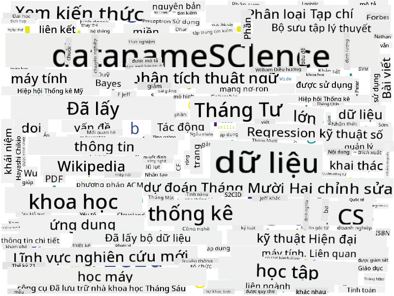

<!--
CO_OP_TRANSLATOR_METADATA:
{
  "original_hash": "2583a9894af7123b2fcae3376b14c035",
  "translation_date": "2025-08-28T18:54:58+00:00",
  "source_file": "1-Introduction/01-defining-data-science/README.md",
  "language_code": "vi"
}
-->
## Các Loại Dữ Liệu

Như đã đề cập, dữ liệu có mặt ở khắp mọi nơi. Chúng ta chỉ cần thu thập nó đúng cách! Việc phân biệt giữa dữ liệu **có cấu trúc** và **không có cấu trúc** là rất hữu ích. Dữ liệu có cấu trúc thường được biểu diễn dưới dạng có tổ chức, thường là một bảng hoặc nhiều bảng, trong khi dữ liệu không có cấu trúc chỉ là một tập hợp các tệp. Đôi khi, chúng ta cũng có thể nói về dữ liệu **bán cấu trúc**, có một số dạng cấu trúc nhưng có thể thay đổi rất nhiều.

| Có cấu trúc                                                                 | Bán cấu trúc                                                                                   | Không có cấu trúc                        |
| ---------------------------------------------------------------------------- | ---------------------------------------------------------------------------------------------- | --------------------------------------- |
| Danh sách người với số điện thoại của họ                                     | Các trang Wikipedia với các liên kết                                                           | Văn bản của Bách khoa toàn thư Britannica |
| Nhiệt độ trong tất cả các phòng của một tòa nhà mỗi phút trong 20 năm qua   | Bộ sưu tập các bài báo khoa học ở định dạng JSON với tác giả, ngày xuất bản và tóm tắt         | Chia sẻ tệp với các tài liệu công ty     |
| Dữ liệu về tuổi và giới tính của tất cả những người vào tòa nhà             | Các trang Internet                                                                              | Video thô từ camera giám sát             |

## Nguồn Dữ Liệu

Có rất nhiều nguồn dữ liệu khác nhau, và sẽ không thể liệt kê hết tất cả! Tuy nhiên, hãy đề cập đến một số nơi điển hình mà bạn có thể lấy dữ liệu:

* **Có cấu trúc**
  - **Internet of Things** (IoT), bao gồm dữ liệu từ các cảm biến khác nhau, như cảm biến nhiệt độ hoặc áp suất, cung cấp rất nhiều dữ liệu hữu ích. Ví dụ, nếu một tòa nhà văn phòng được trang bị cảm biến IoT, chúng ta có thể tự động điều chỉnh hệ thống sưởi và chiếu sáng để giảm thiểu chi phí.
  - **Khảo sát** mà chúng ta yêu cầu người dùng hoàn thành sau khi mua hàng hoặc sau khi truy cập một trang web.
  - **Phân tích hành vi** có thể giúp chúng ta hiểu người dùng đi sâu vào trang web đến mức nào và lý do phổ biến khiến họ rời khỏi trang.
* **Không có cấu trúc**
  - **Văn bản** có thể là một nguồn thông tin phong phú, chẳng hạn như điểm **cảm xúc tổng thể**, hoặc trích xuất từ khóa và ý nghĩa ngữ nghĩa.
  - **Hình ảnh** hoặc **Video**. Một video từ camera giám sát có thể được sử dụng để ước tính lưu lượng giao thông trên đường và thông báo cho mọi người về các điểm tắc nghẽn tiềm năng.
  - **Nhật ký máy chủ web** có thể được sử dụng để hiểu những trang nào trên trang web của chúng ta được truy cập nhiều nhất và trong bao lâu.
* **Bán cấu trúc**
  - **Đồ thị mạng xã hội** có thể là nguồn dữ liệu tuyệt vời về tính cách người dùng và hiệu quả tiềm năng trong việc lan truyền thông tin.
  - Khi chúng ta có một loạt ảnh từ một bữa tiệc, chúng ta có thể cố gắng trích xuất dữ liệu **Động lực nhóm** bằng cách xây dựng một đồ thị về những người chụp ảnh cùng nhau.

Bằng cách biết các nguồn dữ liệu khác nhau, bạn có thể nghĩ đến các kịch bản khác nhau mà các kỹ thuật khoa học dữ liệu có thể được áp dụng để hiểu rõ hơn tình hình và cải thiện quy trình kinh doanh.

## Bạn Có Thể Làm Gì Với Dữ Liệu

Trong Khoa học Dữ liệu, chúng ta tập trung vào các bước sau trong hành trình dữ liệu:

Tùy thuộc vào dữ liệu thực tế, một số bước có thể bị bỏ qua (ví dụ: khi chúng ta đã có dữ liệu trong cơ sở dữ liệu, hoặc khi không cần huấn luyện mô hình), hoặc một số bước có thể được lặp lại nhiều lần (chẳng hạn như xử lý dữ liệu).

## Số Hóa và Chuyển Đổi Số

Trong thập kỷ qua, nhiều doanh nghiệp đã bắt đầu hiểu tầm quan trọng của dữ liệu trong việc đưa ra quyết định kinh doanh. Để áp dụng các nguyên tắc khoa học dữ liệu vào việc điều hành doanh nghiệp, trước tiên cần thu thập một số dữ liệu, tức là chuyển đổi các quy trình kinh doanh sang dạng số hóa. Điều này được gọi là **số hóa**. Việc áp dụng các kỹ thuật khoa học dữ liệu vào dữ liệu này để hướng dẫn các quyết định có thể dẫn đến sự gia tăng đáng kể về năng suất (hoặc thậm chí thay đổi hướng kinh doanh), được gọi là **chuyển đổi số**.

Hãy xem xét một ví dụ. Giả sử chúng ta có một khóa học khoa học dữ liệu (như khóa học này) mà chúng ta cung cấp trực tuyến cho sinh viên, và chúng ta muốn sử dụng khoa học dữ liệu để cải thiện nó. Chúng ta có thể làm điều đó như thế nào?

Chúng ta có thể bắt đầu bằng cách hỏi "Cái gì có thể được số hóa?" Cách đơn giản nhất là đo thời gian mỗi sinh viên hoàn thành từng mô-đun, và đo lường kiến thức đạt được bằng cách đưa ra một bài kiểm tra trắc nghiệm ở cuối mỗi mô-đun. Bằng cách tính trung bình thời gian hoàn thành của tất cả sinh viên, chúng ta có thể tìm ra những mô-đun gây khó khăn nhất cho sinh viên và làm việc để đơn giản hóa chúng.
Bạn có thể tranh luận rằng cách tiếp cận này không lý tưởng, vì các module có thể có độ dài khác nhau. Có lẽ sẽ công bằng hơn nếu chia thời gian theo độ dài của module (tính bằng số ký tự) và so sánh các giá trị đó thay thế.
Khi chúng ta bắt đầu phân tích kết quả của các bài kiểm tra trắc nghiệm, chúng ta có thể cố gắng xác định những khái niệm mà học sinh gặp khó khăn trong việc hiểu, và sử dụng thông tin đó để cải thiện nội dung. Để làm được điều này, chúng ta cần thiết kế các bài kiểm tra sao cho mỗi câu hỏi liên kết với một khái niệm hoặc phần kiến thức cụ thể.

Nếu muốn phân tích phức tạp hơn, chúng ta có thể vẽ biểu đồ thời gian hoàn thành từng mô-đun so với nhóm tuổi của học sinh. Chúng ta có thể phát hiện rằng đối với một số nhóm tuổi, thời gian hoàn thành mô-đun quá dài hoặc học sinh bỏ dở trước khi hoàn thành. Điều này có thể giúp chúng ta đưa ra khuyến nghị về độ tuổi phù hợp cho mô-đun và giảm thiểu sự không hài lòng của mọi người do kỳ vọng sai lệch.

## 🚀 Thử thách

Trong thử thách này, chúng ta sẽ cố gắng tìm các khái niệm liên quan đến lĩnh vực Khoa học Dữ liệu bằng cách phân tích văn bản. Chúng ta sẽ lấy một bài viết trên Wikipedia về Khoa học Dữ liệu, tải xuống và xử lý văn bản, sau đó tạo một đám mây từ như hình dưới đây:

Truy cập [`notebook.ipynb`](../../../../../../../../../1-Introduction/01-defining-data-science/notebook.ipynb ':ignore') để đọc qua mã. Bạn cũng có thể chạy mã và xem cách nó thực hiện tất cả các chuyển đổi dữ liệu trong thời gian thực.

> Nếu bạn không biết cách chạy mã trong Jupyter Notebook, hãy xem [bài viết này](https://soshnikov.com/education/how-to-execute-notebooks-from-github/).

## [Câu hỏi sau bài giảng](https://purple-hill-04aebfb03.1.azurestaticapps.net/quiz/1)

## Bài tập

* **Nhiệm vụ 1**: Sửa đổi mã trên để tìm các khái niệm liên quan đến các lĩnh vực **Dữ liệu lớn** và **Học máy**
* **Nhiệm vụ 2**: [Suy nghĩ về các kịch bản Khoa học Dữ liệu](assignment.md)

## Tín dụng

Bài học này được viết với ♥️ bởi [Dmitry Soshnikov](http://soshnikov.com)

---

**Tuyên bố miễn trừ trách nhiệm**:  
Tài liệu này đã được dịch bằng dịch vụ dịch thuật AI [Co-op Translator](https://github.com/Azure/co-op-translator). Mặc dù chúng tôi cố gắng đảm bảo độ chính xác, xin lưu ý rằng các bản dịch tự động có thể chứa lỗi hoặc không chính xác. Tài liệu gốc bằng ngôn ngữ bản địa nên được coi là nguồn thông tin chính thức. Đối với các thông tin quan trọng, khuyến nghị sử dụng dịch vụ dịch thuật chuyên nghiệp bởi con người. Chúng tôi không chịu trách nhiệm cho bất kỳ sự hiểu lầm hoặc diễn giải sai nào phát sinh từ việc sử dụng bản dịch này.