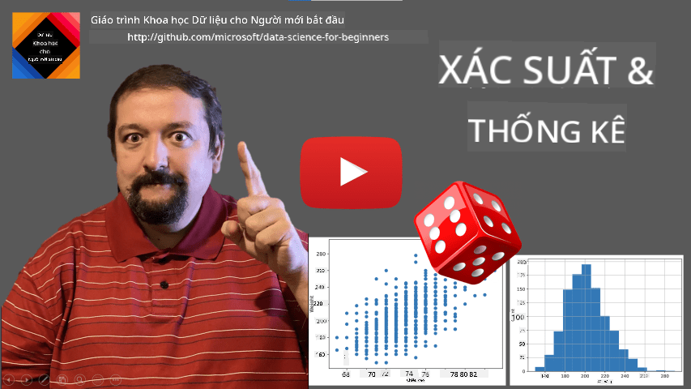
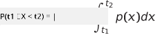
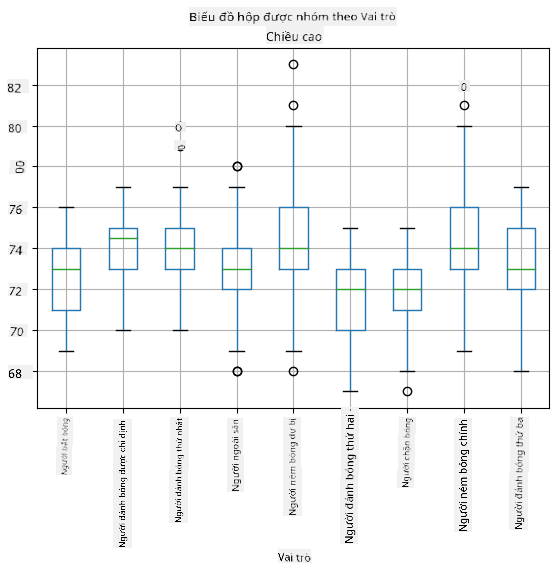
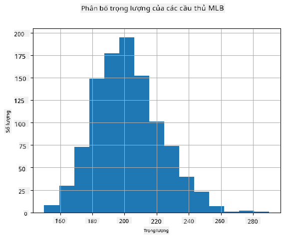
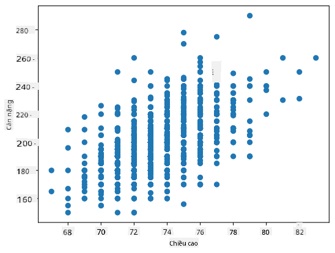

<!--
CO_OP_TRANSLATOR_METADATA:
{
  "original_hash": "ce95884566a74db72572cd51f0cb25ad",
  "translation_date": "2025-09-06T13:50:13+00:00",
  "source_file": "1-Introduction/04-stats-and-probability/README.md",
  "language_code": "vi"
}
-->
# Giới thiệu ngắn gọn về Thống kê và Xác suất

| ](../../sketchnotes/04-Statistics-Probability.png)|
|:---:|
| Thống kê và Xác suất - _Sketchnote của [@nitya](https://twitter.com/nitya)_ |

Lý thuyết Thống kê và Xác suất là hai lĩnh vực liên quan chặt chẽ trong Toán học và rất quan trọng đối với Khoa học Dữ liệu. Bạn có thể làm việc với dữ liệu mà không cần kiến thức sâu về toán học, nhưng vẫn tốt hơn nếu biết ít nhất một số khái niệm cơ bản. Dưới đây là phần giới thiệu ngắn gọn để giúp bạn bắt đầu.

[](https://youtu.be/Z5Zy85g4Yjw)

## [Câu hỏi trước bài giảng](https://ff-quizzes.netlify.app/en/ds/quiz/6)

## Xác suất và Biến ngẫu nhiên

**Xác suất** là một số nằm trong khoảng từ 0 đến 1, biểu thị mức độ khả năng xảy ra của một **sự kiện**. Nó được định nghĩa là số kết quả tích cực (dẫn đến sự kiện), chia cho tổng số kết quả, với điều kiện tất cả các kết quả đều có khả năng xảy ra như nhau. Ví dụ, khi chúng ta tung một con xúc xắc, xác suất để có được một số chẵn là 3/6 = 0.5.

Khi nói về các sự kiện, chúng ta sử dụng **biến ngẫu nhiên**. Ví dụ, biến ngẫu nhiên đại diện cho số nhận được khi tung xúc xắc sẽ có giá trị từ 1 đến 6. Tập hợp các số từ 1 đến 6 được gọi là **không gian mẫu**. Chúng ta có thể nói về xác suất của một biến ngẫu nhiên nhận một giá trị nhất định, ví dụ P(X=3)=1/6.

Biến ngẫu nhiên trong ví dụ trước được gọi là **rời rạc**, vì nó có không gian mẫu đếm được, tức là có các giá trị riêng biệt có thể liệt kê. Có những trường hợp không gian mẫu là một khoảng số thực, hoặc toàn bộ tập hợp số thực. Những biến như vậy được gọi là **liên tục**. Một ví dụ điển hình là thời gian xe buýt đến.

## Phân phối xác suất

Trong trường hợp biến ngẫu nhiên rời rạc, rất dễ mô tả xác suất của mỗi sự kiện bằng một hàm P(X). Đối với mỗi giá trị *s* từ không gian mẫu *S*, hàm sẽ trả về một số từ 0 đến 1, sao cho tổng tất cả các giá trị của P(X=s) cho tất cả các sự kiện bằng 1.

Phân phối rời rạc nổi tiếng nhất là **phân phối đều**, trong đó có một không gian mẫu gồm N phần tử, với xác suất bằng nhau là 1/N cho mỗi phần tử.

Mô tả phân phối xác suất của một biến liên tục khó hơn, với các giá trị được lấy từ một khoảng [a,b], hoặc toàn bộ tập hợp số thực ℝ. Hãy xem xét trường hợp thời gian xe buýt đến. Thực tế, đối với mỗi thời gian đến chính xác *t*, xác suất xe buýt đến đúng thời điểm đó là 0!

> Bây giờ bạn đã biết rằng các sự kiện có xác suất bằng 0 vẫn xảy ra, và rất thường xuyên! Ít nhất là mỗi lần xe buýt đến!

Chúng ta chỉ có thể nói về xác suất của một biến nằm trong một khoảng giá trị nhất định, ví dụ P(t<sub>1</sub>≤X<t<sub>2</sub>). Trong trường hợp này, phân phối xác suất được mô tả bằng **hàm mật độ xác suất** p(x), sao cho:



Một dạng liên tục của phân phối đều được gọi là **phân phối đều liên tục**, được định nghĩa trên một khoảng hữu hạn. Xác suất giá trị X nằm trong một khoảng có độ dài l tỷ lệ thuận với l, và tăng lên đến 1.

Một phân phối quan trọng khác là **phân phối chuẩn**, mà chúng ta sẽ nói chi tiết hơn bên dưới.

## Giá trị trung bình, Phương sai và Độ lệch chuẩn

Giả sử chúng ta lấy một dãy n mẫu của một biến ngẫu nhiên X: x<sub>1</sub>, x<sub>2</sub>, ..., x<sub>n</sub>. Chúng ta có thể định nghĩa **giá trị trung bình** (hoặc **trung bình cộng**) của dãy theo cách truyền thống là (x<sub>1</sub>+x<sub>2</sub>+x<sub>n</sub>)/n. Khi tăng kích thước mẫu (tức là lấy giới hạn với n→∞), chúng ta sẽ thu được giá trị trung bình (còn gọi là **kỳ vọng**) của phân phối. Chúng ta sẽ ký hiệu kỳ vọng là **E**(x).

> Có thể chứng minh rằng đối với bất kỳ phân phối rời rạc nào với các giá trị {x<sub>1</sub>, x<sub>2</sub>, ..., x<sub>N</sub>} và các xác suất tương ứng p<sub>1</sub>, p<sub>2</sub>, ..., p<sub>N</sub>, kỳ vọng sẽ bằng E(X)=x<sub>1</sub>p<sub>1</sub>+x<sub>2</sub>p<sub>2</sub>+...+x<sub>N</sub>p<sub>N</sub>.

Để xác định mức độ phân tán của các giá trị, chúng ta có thể tính phương sai σ<sup>2</sup> = ∑(x<sub>i</sub> - μ)<sup>2</sup>/n, trong đó μ là giá trị trung bình của dãy. Giá trị σ được gọi là **độ lệch chuẩn**, và σ<sup>2</sup> được gọi là **phương sai**.

## Giá trị mode, Median và Tứ phân vị

Đôi khi, giá trị trung bình không đại diện đầy đủ cho giá trị "điển hình" của dữ liệu. Ví dụ, khi có một vài giá trị cực đoan hoàn toàn nằm ngoài phạm vi, chúng có thể ảnh hưởng đến giá trị trung bình. Một chỉ số tốt khác là **median**, giá trị mà một nửa số điểm dữ liệu thấp hơn nó, và nửa còn lại cao hơn.

Để giúp chúng ta hiểu phân phối dữ liệu, rất hữu ích khi nói về **tứ phân vị**:

* Tứ phân vị thứ nhất, hoặc Q1, là giá trị mà 25% dữ liệu nằm dưới nó
* Tứ phân vị thứ ba, hoặc Q3, là giá trị mà 75% dữ liệu nằm dưới nó

Một cách trực quan, chúng ta có thể biểu diễn mối quan hệ giữa median và tứ phân vị trong một biểu đồ gọi là **box plot**:


Ở đây chúng ta cũng tính **khoảng tứ phân vị** IQR=Q3-Q1, và các giá trị **ngoại lệ** - những giá trị nằm ngoài các giới hạn [Q1-1.5*IQR,Q3+1.5*IQR].

Đối với phân phối hữu hạn chứa một số lượng nhỏ các giá trị có thể, một giá trị "điển hình" tốt là giá trị xuất hiện thường xuyên nhất, được gọi là **mode**. Nó thường được áp dụng cho dữ liệu phân loại, chẳng hạn như màu sắc. Hãy xem xét tình huống khi chúng ta có hai nhóm người - một số người rất thích màu đỏ, và những người khác thích màu xanh. Nếu chúng ta mã hóa màu sắc bằng các con số, giá trị trung bình cho màu yêu thích sẽ nằm đâu đó trong phổ màu cam-xanh lá, điều này không phản ánh sở thích thực tế của cả hai nhóm. Tuy nhiên, mode sẽ là một trong hai màu, hoặc cả hai màu, nếu số người chọn chúng bằng nhau (trong trường hợp này chúng ta gọi mẫu là **đa mode**).

## Dữ liệu thực tế

Khi chúng ta phân tích dữ liệu từ đời thực, chúng thường không phải là biến ngẫu nhiên theo nghĩa rằng chúng ta không thực hiện các thí nghiệm với kết quả chưa biết. Ví dụ, hãy xem xét một đội bóng chày và dữ liệu cơ thể của họ, chẳng hạn như chiều cao, cân nặng và tuổi. Những con số này không hoàn toàn ngẫu nhiên, nhưng chúng ta vẫn có thể áp dụng các khái niệm toán học tương tự. Ví dụ, một dãy cân nặng của mọi người có thể được coi là một dãy giá trị được lấy từ một biến ngẫu nhiên nào đó. Dưới đây là dãy cân nặng của các cầu thủ bóng chày thực tế từ [Major League Baseball](http://mlb.mlb.com/index.jsp), được lấy từ [bộ dữ liệu này](http://wiki.stat.ucla.edu/socr/index.php/SOCR_Data_MLB_HeightsWeights) (để thuận tiện, chỉ hiển thị 20 giá trị đầu tiên):

```
[180.0, 215.0, 210.0, 210.0, 188.0, 176.0, 209.0, 200.0, 231.0, 180.0, 188.0, 180.0, 185.0, 160.0, 180.0, 185.0, 197.0, 189.0, 185.0, 219.0]
```

> **Note**: Để xem ví dụ về cách làm việc với bộ dữ liệu này, hãy xem [notebook đi kèm](notebook.ipynb). Ngoài ra còn có một số thử thách trong suốt bài học này, và bạn có thể hoàn thành chúng bằng cách thêm một số mã vào notebook đó. Nếu bạn không chắc cách thao tác với dữ liệu, đừng lo lắng - chúng ta sẽ quay lại làm việc với dữ liệu bằng Python sau này. Nếu bạn không biết cách chạy mã trong Jupyter Notebook, hãy xem [bài viết này](https://soshnikov.com/education/how-to-execute-notebooks-from-github/).

Dưới đây là biểu đồ box plot hiển thị giá trị trung bình, median và tứ phân vị cho dữ liệu của chúng ta:


Vì dữ liệu của chúng ta chứa thông tin về các **vai trò** của cầu thủ, chúng ta cũng có thể tạo box plot theo vai trò - điều này sẽ cho phép chúng ta hiểu cách các giá trị tham số khác nhau giữa các vai trò. Lần này chúng ta sẽ xem xét chiều cao:



Biểu đồ này cho thấy rằng, trung bình, chiều cao của các cầu thủ ở vị trí đầu tiên cao hơn chiều cao của các cầu thủ ở vị trí thứ hai. Sau này trong bài học, chúng ta sẽ học cách kiểm tra giả thuyết này một cách chính thức hơn, và cách chứng minh rằng dữ liệu của chúng ta có ý nghĩa thống kê để thể hiện điều đó.

> Khi làm việc với dữ liệu thực tế, chúng ta giả định rằng tất cả các điểm dữ liệu là mẫu được lấy từ một phân phối xác suất nào đó. Giả định này cho phép chúng ta áp dụng các kỹ thuật học máy và xây dựng các mô hình dự đoán hoạt động.

Để xem phân phối của dữ liệu của chúng ta, chúng ta có thể vẽ một biểu đồ gọi là **histogram**. Trục X sẽ chứa một số khoảng cân nặng khác nhau (gọi là **bins**), và trục Y sẽ hiển thị số lần mẫu biến ngẫu nhiên nằm trong một khoảng nhất định.



Từ histogram này, bạn có thể thấy rằng tất cả các giá trị tập trung xung quanh một giá trị cân nặng trung bình nhất định, và càng xa giá trị đó - càng ít cân nặng có giá trị đó được gặp. Tức là, rất khó xảy ra rằng cân nặng của một cầu thủ bóng chày sẽ khác biệt nhiều so với cân nặng trung bình. Phương sai của cân nặng cho thấy mức độ mà cân nặng có khả năng khác biệt so với giá trị trung bình.

> Nếu chúng ta lấy cân nặng của những người khác, không phải từ giải bóng chày, phân phối có thể sẽ khác. Tuy nhiên, hình dạng của phân phối sẽ giống nhau, nhưng giá trị trung bình và phương sai sẽ thay đổi. Vì vậy, nếu chúng ta huấn luyện mô hình của mình trên các cầu thủ bóng chày, nó có thể đưa ra kết quả sai khi áp dụng cho sinh viên đại học, vì phân phối cơ bản là khác nhau.

## Phân phối chuẩn

Phân phối cân nặng mà chúng ta đã thấy ở trên rất điển hình, và nhiều phép đo từ đời thực tuân theo cùng một loại phân phối, nhưng với giá trị trung bình và phương sai khác nhau. Phân phối này được gọi là **phân phối chuẩn**, và nó đóng vai trò rất quan trọng trong thống kê.

Sử dụng phân phối chuẩn là cách đúng để tạo ra cân nặng ngẫu nhiên của các cầu thủ bóng chày tiềm năng. Một khi chúng ta biết cân nặng trung bình `mean` và độ lệch chuẩn `std`, chúng ta có thể tạo ra 1000 mẫu cân nặng theo cách sau:

```python
samples = np.random.normal(mean,std,1000)
```

Nếu chúng ta vẽ histogram của các mẫu được tạo ra, chúng ta sẽ thấy hình ảnh rất giống với hình ảnh được hiển thị ở trên. Và nếu chúng ta tăng số lượng mẫu và số lượng bins, chúng ta có thể tạo ra hình ảnh của phân phối chuẩn gần với lý tưởng hơn:


*Phân phối chuẩn với mean=0 và std.dev=1*

## Khoảng tin cậy

Khi chúng ta nói về cân nặng của các cầu thủ bóng chày, chúng ta giả định rằng có một **biến ngẫu nhiên W** tương ứng với phân phối xác suất lý tưởng của cân nặng của tất cả các cầu thủ bóng chày (gọi là **tổng thể**). Dãy cân nặng của chúng ta tương ứng với một tập hợp con của tất cả các cầu thủ bóng chày mà chúng ta gọi là **mẫu**. Một câu hỏi thú vị là, liệu chúng ta có thể biết các tham số của phân phối W, tức là giá trị trung bình và phương sai của tổng thể?

Câu trả lời dễ nhất là tính giá trị trung bình và phương sai của mẫu của chúng ta. Tuy nhiên, có thể xảy ra trường hợp mẫu ngẫu nhiên của chúng ta không đại diện chính xác cho toàn bộ tổng thể. Do đó, có ý nghĩa khi nói về **khoảng tin cậy**.

> **Khoảng tin cậy** là sự ước lượng giá trị trung bình thực của tổng thể dựa trên mẫu của chúng ta, với độ chính xác trong một xác suất nhất định (hoặc **mức độ tin cậy**).

Giả sử chúng ta có một mẫu X

1</sub>, ..., X<sub>n</sub> từ phân phối của chúng ta. Mỗi lần chúng ta lấy một mẫu từ phân phối, chúng ta sẽ có giá trị trung bình μ khác nhau. Vì vậy, μ có thể được coi là một biến ngẫu nhiên. Một **khoảng tin cậy** với độ tin cậy p là một cặp giá trị (L<sub>p</sub>,R<sub>p</sub>), sao cho **P**(L<sub>p</sub>≤μ≤R<sub>p</sub>) = p, tức là xác suất giá trị trung bình đo được nằm trong khoảng bằng p.

Việc thảo luận chi tiết cách tính các khoảng tin cậy vượt quá giới hạn của phần giới thiệu ngắn này. Một số chi tiết thêm có thể được tìm thấy [trên Wikipedia](https://en.wikipedia.org/wiki/Confidence_interval). Tóm lại, chúng ta định nghĩa phân phối của giá trị trung bình mẫu tính toán so với giá trị trung bình thực của quần thể, được gọi là **phân phối Student**.

> **Thông tin thú vị**: Phân phối Student được đặt tên theo nhà toán học William Sealy Gosset, người đã xuất bản bài báo của mình dưới bút danh "Student". Ông làm việc tại nhà máy bia Guinness, và theo một trong những phiên bản, chủ lao động của ông không muốn công chúng biết rằng họ đang sử dụng các kiểm tra thống kê để xác định chất lượng nguyên liệu thô.

Nếu chúng ta muốn ước tính giá trị trung bình μ của quần thể với độ tin cậy p, chúng ta cần lấy *(1-p)/2-th percentile* của phân phối Student A, có thể được lấy từ bảng hoặc tính bằng các hàm tích hợp của phần mềm thống kê (ví dụ: Python, R, v.v.). Sau đó, khoảng cho μ sẽ được cho bởi X±A*D/√n, trong đó X là giá trị trung bình mẫu thu được, D là độ lệch chuẩn.

> **Lưu ý**: Chúng ta cũng bỏ qua việc thảo luận về một khái niệm quan trọng là [bậc tự do](https://en.wikipedia.org/wiki/Degrees_of_freedom_(statistics)), điều này rất quan trọng liên quan đến phân phối Student. Bạn có thể tham khảo các sách thống kê đầy đủ hơn để hiểu sâu hơn về khái niệm này.

Một ví dụ về tính khoảng tin cậy cho cân nặng và chiều cao được đưa ra trong [notebook đi kèm](notebook.ipynb).

| p | Giá trị trung bình cân nặng |
|-----|---------------------------|
| 0.85 | 201.73±0.94 |
| 0.90 | 201.73±1.08 |
| 0.95 | 201.73±1.28 |

Lưu ý rằng độ tin cậy càng cao, khoảng tin cậy càng rộng.

## Kiểm định giả thuyết

Trong tập dữ liệu các cầu thủ bóng chày của chúng ta, có các vai trò khác nhau của cầu thủ, có thể được tóm tắt dưới đây (xem [notebook đi kèm](notebook.ipynb) để biết cách tính bảng này):

| Vai trò | Chiều cao | Cân nặng | Số lượng |
|---------|-----------|----------|----------|
| Catcher | 72.723684 | 204.328947 | 76 |
| Designated_Hitter | 74.222222 | 220.888889 | 18 |
| First_Baseman | 74.000000 | 213.109091 | 55 |
| Outfielder | 73.010309 | 199.113402 | 194 |
| Relief_Pitcher | 74.374603 | 203.517460 | 315 |
| Second_Baseman | 71.362069 | 184.344828 | 58 |
| Shortstop | 71.903846 | 182.923077 | 52 |
| Starting_Pitcher | 74.719457 | 205.163636 | 221 |
| Third_Baseman | 73.044444 | 200.955556 | 45 |

Chúng ta có thể nhận thấy rằng chiều cao trung bình của các cầu thủ First Basemen cao hơn so với Second Basemen. Vì vậy, chúng ta có thể bị cám dỗ để kết luận rằng **First Basemen cao hơn Second Basemen**.

> Tuyên bố này được gọi là **giả thuyết**, bởi vì chúng ta không biết liệu điều này thực sự đúng hay không.

Tuy nhiên, không phải lúc nào cũng rõ ràng liệu chúng ta có thể đưa ra kết luận này hay không. Từ thảo luận ở trên, chúng ta biết rằng mỗi giá trị trung bình có một khoảng tin cậy liên quan, và do đó sự khác biệt này có thể chỉ là một lỗi thống kê. Chúng ta cần một cách chính thức hơn để kiểm tra giả thuyết của mình.

Hãy tính khoảng tin cậy riêng biệt cho chiều cao của First Basemen và Second Basemen:

| Độ tin cậy | First Basemen | Second Basemen |
|------------|---------------|----------------|
| 0.85 | 73.62..74.38 | 71.04..71.69 |
| 0.90 | 73.56..74.44 | 70.99..71.73 |
| 0.95 | 73.47..74.53 | 70.92..71.81 |

Chúng ta có thể thấy rằng không có độ tin cậy nào mà các khoảng này chồng lấp. Điều này chứng minh giả thuyết của chúng ta rằng First Basemen cao hơn Second Basemen.

Một cách chính thức hơn, vấn đề chúng ta đang giải quyết là xem liệu **hai phân phối xác suất có giống nhau**, hoặc ít nhất có cùng tham số hay không. Tùy thuộc vào phân phối, chúng ta cần sử dụng các kiểm định khác nhau. Nếu chúng ta biết rằng các phân phối của mình là chuẩn, chúng ta có thể áp dụng **[Student t-test](https://en.wikipedia.org/wiki/Student%27s_t-test)**.

Trong Student t-test, chúng ta tính toán giá trị **t-value**, chỉ ra sự khác biệt giữa các giá trị trung bình, có tính đến phương sai. Người ta chứng minh rằng t-value tuân theo **phân phối Student**, điều này cho phép chúng ta lấy giá trị ngưỡng cho một mức độ tin cậy **p** (có thể được tính toán hoặc tra cứu trong các bảng số). Sau đó, chúng ta so sánh t-value với ngưỡng này để chấp nhận hoặc bác bỏ giả thuyết.

Trong Python, chúng ta có thể sử dụng gói **SciPy**, bao gồm hàm `ttest_ind` (ngoài nhiều hàm thống kê hữu ích khác!). Hàm này tính toán t-value cho chúng ta, và cũng thực hiện tra cứu ngược giá trị p của độ tin cậy, để chúng ta chỉ cần nhìn vào độ tin cậy để đưa ra kết luận.

Ví dụ, so sánh giữa chiều cao của First Basemen và Second Basemen cho chúng ta kết quả sau:
```python
from scipy.stats import ttest_ind

tval, pval = ttest_ind(df.loc[df['Role']=='First_Baseman',['Height']], df.loc[df['Role']=='Designated_Hitter',['Height']],equal_var=False)
print(f"T-value = {tval[0]:.2f}\nP-value: {pval[0]}")
```
```
T-value = 7.65
P-value: 9.137321189738925e-12
```
Trong trường hợp của chúng ta, giá trị p rất thấp, nghĩa là có bằng chứng mạnh mẽ hỗ trợ rằng First Basemen cao hơn.

Ngoài ra còn có các loại giả thuyết khác mà chúng ta có thể muốn kiểm tra, ví dụ:
* Chứng minh rằng một mẫu nhất định tuân theo một phân phối nào đó. Trong trường hợp của chúng ta, chúng ta đã giả định rằng chiều cao được phân phối chuẩn, nhưng điều đó cần được xác minh thống kê chính thức.
* Chứng minh rằng giá trị trung bình của một mẫu tương ứng với một giá trị được xác định trước.
* So sánh giá trị trung bình của một số mẫu (ví dụ: sự khác biệt về mức độ hạnh phúc giữa các nhóm tuổi khác nhau).

## Định luật số lớn và Định lý giới hạn trung tâm

Một trong những lý do tại sao phân phối chuẩn lại quan trọng là **định lý giới hạn trung tâm**. Giả sử chúng ta có một mẫu lớn gồm N giá trị X<sub>1</sub>, ..., X<sub>N</sub>, được lấy mẫu từ bất kỳ phân phối nào với giá trị trung bình μ và phương sai σ<sup>2</sup>. Sau đó, với N đủ lớn (nói cách khác, khi N→∞), giá trị trung bình Σ<sub>i</sub>X<sub>i</sub> sẽ được phân phối chuẩn, với giá trị trung bình μ và phương sai σ<sup>2</sup>/N.

> Một cách khác để diễn giải định lý giới hạn trung tâm là nói rằng bất kể phân phối nào, khi bạn tính giá trị trung bình của tổng các giá trị biến ngẫu nhiên, bạn sẽ có phân phối chuẩn.

Từ định lý giới hạn trung tâm cũng suy ra rằng, khi N→∞, xác suất giá trị trung bình mẫu bằng μ trở thành 1. Điều này được gọi là **định luật số lớn**.

## Hiệp phương sai và Tương quan

Một trong những điều mà Khoa học Dữ liệu làm là tìm mối quan hệ giữa dữ liệu. Chúng ta nói rằng hai chuỗi **tương quan** khi chúng thể hiện hành vi tương tự tại cùng một thời điểm, tức là chúng cùng tăng/giảm đồng thời, hoặc một chuỗi tăng khi chuỗi kia giảm và ngược lại. Nói cách khác, dường như có một mối quan hệ nào đó giữa hai chuỗi.

> Tương quan không nhất thiết chỉ ra mối quan hệ nhân quả giữa hai chuỗi; đôi khi cả hai biến có thể phụ thuộc vào một nguyên nhân bên ngoài, hoặc có thể chỉ là ngẫu nhiên mà hai chuỗi tương quan. Tuy nhiên, tương quan toán học mạnh là một dấu hiệu tốt cho thấy hai biến có liên quan đến nhau.

Về mặt toán học, khái niệm chính thể hiện mối quan hệ giữa hai biến ngẫu nhiên là **hiệp phương sai**, được tính như sau: Cov(X,Y) = **E**\[(X-**E**(X))(Y-**E**(Y))\]. Chúng ta tính độ lệch của cả hai biến so với giá trị trung bình của chúng, và sau đó nhân các độ lệch đó. Nếu cả hai biến lệch cùng nhau, tích sẽ luôn là giá trị dương, dẫn đến hiệp phương sai dương. Nếu cả hai biến lệch không đồng bộ (tức là một biến giảm dưới trung bình khi biến kia tăng trên trung bình), chúng ta sẽ luôn nhận được các số âm, dẫn đến hiệp phương sai âm. Nếu các độ lệch không phụ thuộc, chúng sẽ cộng lại gần bằng không.

Giá trị tuyệt đối của hiệp phương sai không cho chúng ta biết nhiều về mức độ tương quan lớn như thế nào, vì nó phụ thuộc vào độ lớn của các giá trị thực tế. Để chuẩn hóa nó, chúng ta có thể chia hiệp phương sai cho độ lệch chuẩn của cả hai biến, để có được **tương quan**. Điều tốt là tương quan luôn nằm trong khoảng [-1,1], trong đó 1 chỉ ra tương quan dương mạnh giữa các giá trị, -1 - tương quan âm mạnh, và 0 - không có tương quan (các biến độc lập).

**Ví dụ**: Chúng ta có thể tính toán tương quan giữa cân nặng và chiều cao của các cầu thủ bóng chày từ tập dữ liệu đã đề cập ở trên:
```python
print(np.corrcoef(weights,heights))
```
Kết quả, chúng ta nhận được **ma trận tương quan** như sau:
```
array([[1.        , 0.52959196],
       [0.52959196, 1.        ]])
```

> Ma trận tương quan C có thể được tính cho bất kỳ số lượng chuỗi đầu vào S<sub>1</sub>, ..., S<sub>n</sub>. Giá trị của C<sub>ij</sub> là tương quan giữa S<sub>i</sub> và S<sub>j</sub>, và các phần tử trên đường chéo luôn là 1 (đây cũng là tương quan tự thân của S<sub>i</sub>).

Trong trường hợp của chúng ta, giá trị 0.53 chỉ ra rằng có một số tương quan giữa cân nặng và chiều cao của một người. Chúng ta cũng có thể tạo biểu đồ phân tán của một giá trị so với giá trị kia để xem mối quan hệ một cách trực quan:



> Nhiều ví dụ hơn về tương quan và hiệp phương sai có thể được tìm thấy trong [notebook đi kèm](notebook.ipynb).

## Kết luận

Trong phần này, chúng ta đã học:

* các thuộc tính thống kê cơ bản của dữ liệu, như giá trị trung bình, phương sai, mode và quartiles
* các phân phối khác nhau của biến ngẫu nhiên, bao gồm phân phối chuẩn
* cách tìm tương quan giữa các thuộc tính khác nhau
* cách sử dụng công cụ toán học và thống kê để chứng minh một số giả thuyết
* cách tính khoảng tin cậy cho biến ngẫu nhiên dựa trên mẫu dữ liệu

Mặc dù đây chắc chắn không phải là danh sách đầy đủ các chủ đề trong xác suất và thống kê, nhưng nó đủ để cung cấp cho bạn một khởi đầu tốt trong khóa học này.

## 🚀 Thử thách

Sử dụng mã mẫu trong notebook để kiểm tra các giả thuyết khác rằng:
1. First Basemen lớn tuổi hơn Second Basemen
2. First Basemen cao hơn Third Basemen
3. Shortstops cao hơn Second Basemen

## [Câu hỏi sau bài giảng](https://ff-quizzes.netlify.app/en/ds/quiz/7)

## Ôn tập & Tự học

Xác suất và thống kê là một chủ đề rộng lớn đến mức nó xứng đáng có một khóa học riêng. Nếu bạn muốn đi sâu hơn vào lý thuyết, bạn có thể tiếp tục đọc một số sách sau:

1. [Carlos Fernandez-Granda](https://cims.nyu.edu/~cfgranda/) từ Đại học New York có các ghi chú bài giảng tuyệt vời [Probability and Statistics for Data Science](https://cims.nyu.edu/~cfgranda/pages/stuff/probability_stats_for_DS.pdf) (có sẵn trực tuyến)
1. [Peter và Andrew Bruce. Practical Statistics for Data Scientists.](https://www.oreilly.com/library/view/practical-statistics-for/9781491952955/) [[mã mẫu trong R](https://github.com/andrewgbruce/statistics-for-data-scientists)]. 
1. [James D. Miller. Statistics for Data Science](https://www.packtpub.com/product/statistics-for-data-science/9781788290678) [[mã mẫu trong R](https://github.com/PacktPublishing/Statistics-for-Data-Science)]

## Bài tập

[Small Diabetes Study](assignment.md)

## Tín dụng

Bài học này được viết với ♥️ bởi [Dmitry Soshnikov](http://soshnikov.com)

---

**Tuyên bố miễn trừ trách nhiệm**:  
Tài liệu này đã được dịch bằng dịch vụ dịch thuật AI [Co-op Translator](https://github.com/Azure/co-op-translator). Mặc dù chúng tôi cố gắng đảm bảo độ chính xác, xin lưu ý rằng các bản dịch tự động có thể chứa lỗi hoặc không chính xác. Tài liệu gốc bằng ngôn ngữ bản địa nên được coi là nguồn tham khảo chính thức. Đối với các thông tin quan trọng, nên sử dụng dịch vụ dịch thuật chuyên nghiệp từ con người. Chúng tôi không chịu trách nhiệm cho bất kỳ sự hiểu lầm hoặc diễn giải sai nào phát sinh từ việc sử dụng bản dịch này.