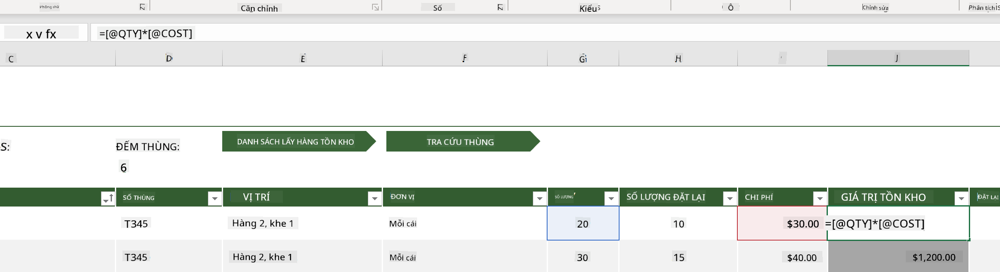
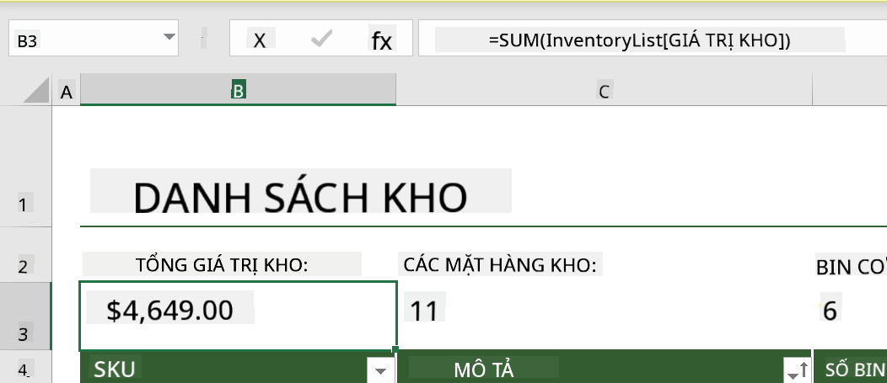
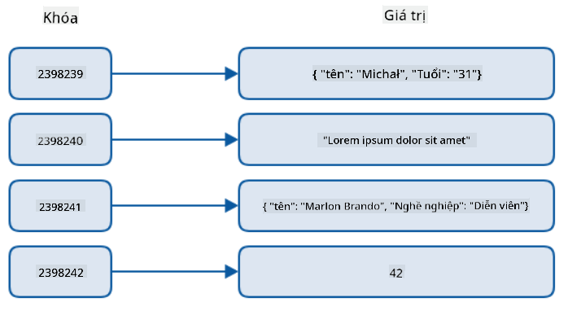
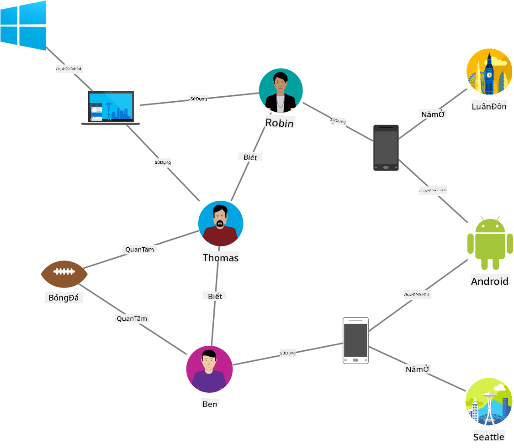
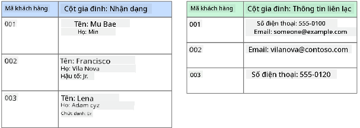
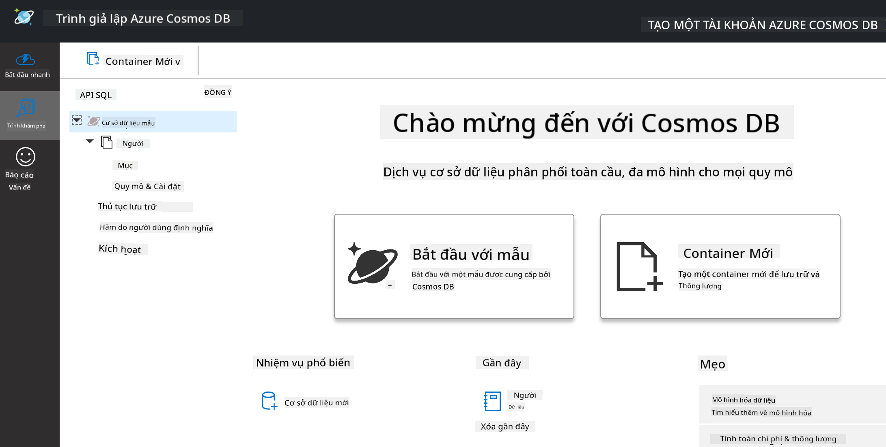
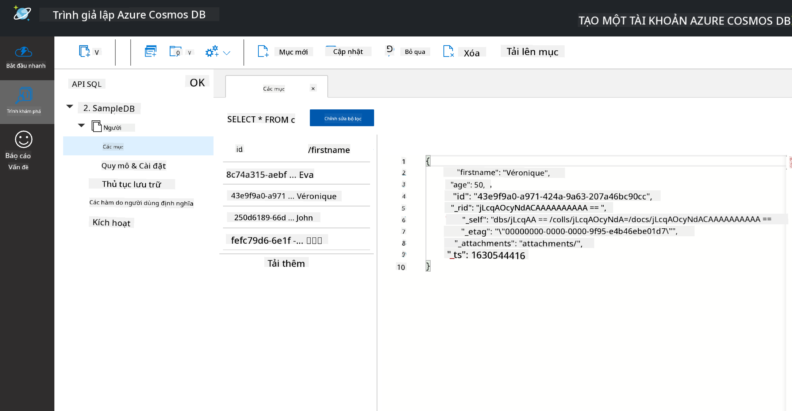
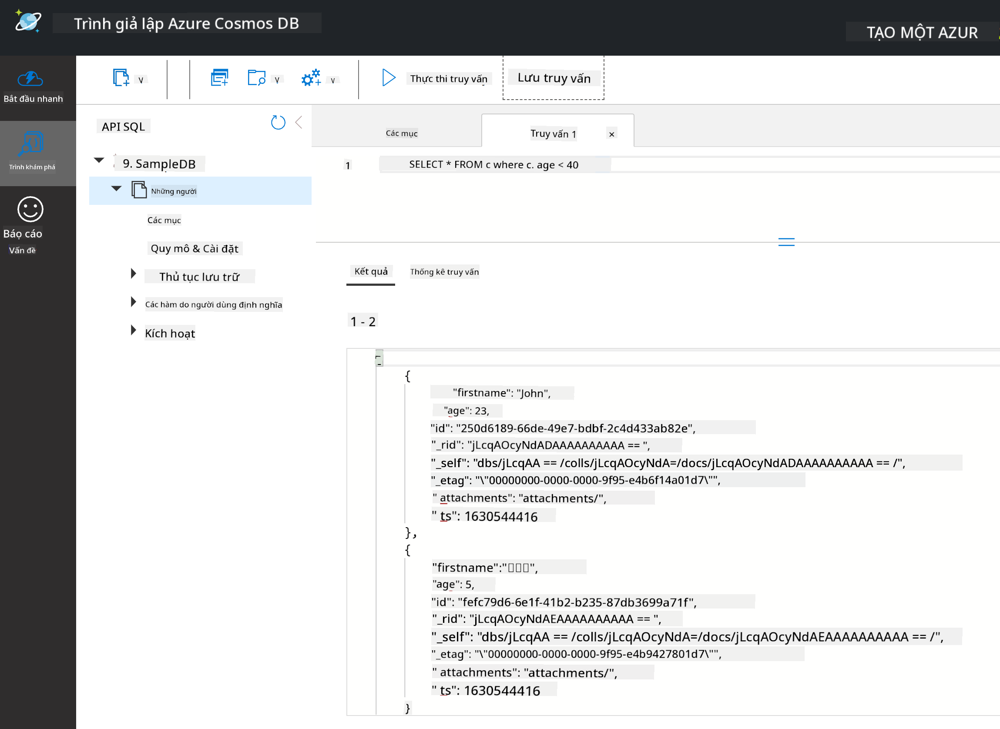

<!--
CO_OP_TRANSLATOR_METADATA:
{
  "original_hash": "54c5a1c74aecb69d2f9099300a4b7eea",
  "translation_date": "2025-09-04T20:20:17+00:00",
  "source_file": "2-Working-With-Data/06-non-relational/README.md",
  "language_code": "vi"
}
-->
# Làm việc với dữ liệu: Dữ liệu phi quan hệ

| ](../../sketchnotes/06-NoSQL.png)|
|:---:|
|Làm việc với dữ liệu NoSQL - _Sketchnote của [@nitya](https://twitter.com/nitya)_ |

## [Câu hỏi trước bài giảng](https://purple-hill-04aebfb03.1.azurestaticapps.net/quiz/10)

Dữ liệu không chỉ giới hạn trong cơ sở dữ liệu quan hệ. Bài học này tập trung vào dữ liệu phi quan hệ và sẽ giới thiệu các khái niệm cơ bản về bảng tính và NoSQL.

## Bảng tính

Bảng tính là một cách phổ biến để lưu trữ và khám phá dữ liệu vì nó yêu cầu ít công việc để thiết lập và bắt đầu. Trong bài học này, bạn sẽ học các thành phần cơ bản của một bảng tính, cũng như công thức và hàm. Các ví dụ sẽ được minh họa bằng Microsoft Excel, nhưng hầu hết các phần và chủ đề sẽ có tên và bước tương tự khi so sánh với các phần mềm bảng tính khác.


Một bảng tính là một tệp và sẽ được truy cập trong hệ thống tệp của máy tính, thiết bị hoặc hệ thống tệp dựa trên đám mây. Phần mềm có thể dựa trên trình duyệt hoặc là một ứng dụng phải được cài đặt trên máy tính hoặc tải xuống dưới dạng ứng dụng. Trong Excel, các tệp này cũng được định nghĩa là **workbook** và thuật ngữ này sẽ được sử dụng trong phần còn lại của bài học.

Một workbook chứa một hoặc nhiều **worksheet**, mỗi worksheet được gắn nhãn bằng các tab. Trong một worksheet có các hình chữ nhật gọi là **cell**, nơi chứa dữ liệu thực tế. Một cell là giao điểm của một hàng và một cột, trong đó các cột được gắn nhãn bằng các ký tự chữ cái và các hàng được gắn nhãn bằng số. Một số bảng tính sẽ chứa tiêu đề trong vài hàng đầu tiên để mô tả dữ liệu trong một cell.

Với các yếu tố cơ bản này của một workbook Excel, chúng ta sẽ sử dụng một ví dụ từ [Microsoft Templates](https://templates.office.com/) tập trung vào quản lý hàng tồn kho để đi qua một số phần bổ sung của bảng tính.

### Quản lý hàng tồn kho

Tệp bảng tính có tên "InventoryExample" là một bảng tính được định dạng về các mặt hàng trong kho, chứa ba worksheet, trong đó các tab được gắn nhãn "Inventory List", "Inventory Pick List" và "Bin Lookup". Hàng 4 của worksheet Inventory List là tiêu đề, mô tả giá trị của mỗi cell trong cột tiêu đề.



Có những trường hợp một cell phụ thuộc vào giá trị của các cell khác để tạo ra giá trị của nó. Bảng tính Inventory List theo dõi chi phí của mỗi mặt hàng trong kho, nhưng nếu chúng ta cần biết giá trị của toàn bộ kho thì sao? [**Công thức**](https://support.microsoft.com/en-us/office/overview-of-formulas-34519a4e-1e8d-4f4b-84d4-d642c4f63263) thực hiện các hành động trên dữ liệu cell và được sử dụng để tính toán chi phí của kho trong ví dụ này. Bảng tính này sử dụng một công thức trong cột Inventory Value để tính giá trị của mỗi mặt hàng bằng cách nhân số lượng dưới tiêu đề QTY và chi phí của nó dưới các cell tiêu đề COST. Nhấp đúp hoặc tô sáng một cell sẽ hiển thị công thức. Bạn sẽ nhận thấy rằng các công thức bắt đầu bằng dấu bằng, theo sau là phép tính hoặc thao tác.



Chúng ta có thể sử dụng một công thức khác để cộng tất cả các giá trị của Inventory Value lại với nhau để tính tổng giá trị. Điều này có thể được tính bằng cách cộng từng cell để tạo ra tổng, nhưng đó có thể là một nhiệm vụ tẻ nhạt. Excel có [**hàm**](https://support.microsoft.com/en-us/office/sum-function-043e1c7d-7726-4e80-8f32-07b23e057f89), hoặc các công thức được định nghĩa trước để thực hiện các phép tính trên giá trị cell. Hàm yêu cầu các tham số, là các giá trị cần thiết để thực hiện các phép tính này. Khi hàm yêu cầu nhiều hơn một tham số, chúng cần được liệt kê theo một thứ tự cụ thể hoặc hàm có thể không tính toán đúng giá trị. Ví dụ này sử dụng hàm SUM và sử dụng các giá trị của Inventory Value làm tham số để cộng và tạo ra tổng được liệt kê dưới hàng 3, cột B (còn được gọi là B3).

## NoSQL

NoSQL là một thuật ngữ bao quát cho các cách khác nhau để lưu trữ dữ liệu phi quan hệ và có thể được hiểu là "phi-SQL", "phi-quan hệ" hoặc "không chỉ SQL". Các hệ thống cơ sở dữ liệu loại này có thể được phân loại thành 4 loại.


> Nguồn từ [Blog của Michał Białecki](https://www.michalbialecki.com/2018/03/18/azure-cosmos-db-key-value-database-cloud/)

[Cơ sở dữ liệu key-value](https://docs.microsoft.com/en-us/azure/architecture/data-guide/big-data/non-relational-data#keyvalue-data-stores) ghép cặp các khóa duy nhất, là một định danh duy nhất được liên kết với một giá trị. Các cặp này được lưu trữ bằng [bảng băm](https://www.hackerearth.com/practice/data-structures/hash-tables/basics-of-hash-tables/tutorial/) với một hàm băm thích hợp.


> Nguồn từ [Microsoft](https://docs.microsoft.com/en-us/azure/cosmos-db/graph/graph-introduction#graph-database-by-example)

[Cơ sở dữ liệu đồ thị](https://docs.microsoft.com/en-us/azure/architecture/data-guide/big-data/non-relational-data#graph-data-stores) mô tả mối quan hệ trong dữ liệu và được biểu diễn dưới dạng một tập hợp các nút và cạnh. Một nút đại diện cho một thực thể, thứ tồn tại trong thế giới thực như một sinh viên hoặc bản sao kê ngân hàng. Các cạnh đại diện cho mối quan hệ giữa hai thực thể. Mỗi nút và cạnh có các thuộc tính cung cấp thông tin bổ sung về mỗi nút và cạnh.



[Cơ sở dữ liệu dạng cột](https://docs.microsoft.com/en-us/azure/architecture/data-guide/big-data/non-relational-data#columnar-data-stores) tổ chức dữ liệu thành các cột và hàng giống như cấu trúc dữ liệu quan hệ nhưng mỗi cột được chia thành các nhóm gọi là nhóm cột, nơi tất cả dữ liệu dưới một cột có liên quan và có thể được truy xuất và thay đổi trong một đơn vị.

### Cơ sở dữ liệu tài liệu với Azure Cosmos DB

[Cơ sở dữ liệu tài liệu](https://docs.microsoft.com/en-us/azure/architecture/data-guide/big-data/non-relational-data#document-data-stores) xây dựng trên khái niệm cơ sở dữ liệu key-value và được tạo thành từ một loạt các trường và đối tượng. Phần này sẽ khám phá cơ sở dữ liệu tài liệu với trình giả lập Cosmos DB.

Cơ sở dữ liệu Cosmos DB phù hợp với định nghĩa "Không chỉ SQL", nơi cơ sở dữ liệu tài liệu của Cosmos DB dựa vào SQL để truy vấn dữ liệu. [Bài học trước](../05-relational-databases/README.md) về SQL đã giới thiệu các khái niệm cơ bản của ngôn ngữ này, và chúng ta sẽ có thể áp dụng một số truy vấn tương tự vào cơ sở dữ liệu tài liệu ở đây. Chúng ta sẽ sử dụng trình giả lập Cosmos DB, cho phép tạo và khám phá cơ sở dữ liệu tài liệu cục bộ trên máy tính. Đọc thêm về trình giả lập [tại đây](https://docs.microsoft.com/en-us/azure/cosmos-db/local-emulator?tabs=ssl-netstd21).

Một tài liệu là một tập hợp các trường và giá trị đối tượng, trong đó các trường mô tả giá trị đối tượng đại diện cho điều gì. Dưới đây là một ví dụ về tài liệu.

```json
{
    "firstname": "Eva",
    "age": 44,
    "id": "8c74a315-aebf-4a16-bb38-2430a9896ce5",
    "_rid": "bHwDAPQz8s0BAAAAAAAAAA==",
    "_self": "dbs/bHwDAA==/colls/bHwDAPQz8s0=/docs/bHwDAPQz8s0BAAAAAAAAAA==/",
    "_etag": "\"00000000-0000-0000-9f95-010a691e01d7\"",
    "_attachments": "attachments/",
    "_ts": 1630544034
}
```

Các trường quan tâm trong tài liệu này là: `firstname`, `id`, và `age`. Các trường còn lại với dấu gạch dưới được tạo bởi Cosmos DB.

#### Khám phá dữ liệu với trình giả lập Cosmos DB

Bạn có thể tải xuống và cài đặt trình giả lập [cho Windows tại đây](https://aka.ms/cosmosdb-emulator). Tham khảo [tài liệu này](https://docs.microsoft.com/en-us/azure/cosmos-db/local-emulator?tabs=ssl-netstd21#run-on-linux-macos) để biết các tùy chọn về cách chạy trình giả lập trên macOS và Linux.

Trình giả lập mở một cửa sổ trình duyệt, nơi chế độ Explorer cho phép bạn khám phá các tài liệu.



Nếu bạn đang làm theo, hãy nhấp vào "Start with Sample" để tạo một cơ sở dữ liệu mẫu có tên SampleDB. Nếu bạn mở rộng SampleDB bằng cách nhấp vào mũi tên, bạn sẽ tìm thấy một container có tên `Persons`, container chứa một tập hợp các mục, là các tài liệu trong container. Bạn có thể khám phá bốn tài liệu riêng lẻ dưới `Items`.



#### Truy vấn dữ liệu tài liệu với trình giả lập Cosmos DB

Chúng ta cũng có thể truy vấn dữ liệu mẫu bằng cách nhấp vào nút New SQL Query (nút thứ hai từ bên trái).

`SELECT * FROM c` trả về tất cả các tài liệu trong container. Hãy thêm một mệnh đề where và tìm tất cả những người dưới 40 tuổi.

`SELECT * FROM c where c.age < 40`



Truy vấn trả về hai tài liệu, lưu ý giá trị age của mỗi tài liệu nhỏ hơn 40.

#### JSON và tài liệu

Nếu bạn quen thuộc với JavaScript Object Notation (JSON), bạn sẽ nhận thấy rằng các tài liệu trông giống JSON. Có một tệp `PersonsData.json` trong thư mục này với nhiều dữ liệu hơn mà bạn có thể tải lên container Persons trong trình giả lập thông qua nút `Upload Item`.

Trong hầu hết các trường hợp, các API trả về dữ liệu JSON có thể được chuyển trực tiếp và lưu trữ trong cơ sở dữ liệu tài liệu. Dưới đây là một tài liệu khác, nó đại diện cho các tweet từ tài khoản Twitter của Microsoft được truy xuất bằng API Twitter, sau đó được chèn vào Cosmos DB.

```json
{
    "created_at": "2021-08-31T19:03:01.000Z",
    "id": "1432780985872142341",
    "text": "Blank slate. Like this tweet if you’ve ever painted in Microsoft Paint before. https://t.co/cFeEs8eOPK",
    "_rid": "dhAmAIUsA4oHAAAAAAAAAA==",
    "_self": "dbs/dhAmAA==/colls/dhAmAIUsA4o=/docs/dhAmAIUsA4oHAAAAAAAAAA==/",
    "_etag": "\"00000000-0000-0000-9f84-a0958ad901d7\"",
    "_attachments": "attachments/",
    "_ts": 1630537000
```

Các trường quan tâm trong tài liệu này là: `created_at`, `id`, và `text`.

## 🚀 Thử thách

Có một tệp `TwitterData.json` mà bạn có thể tải lên cơ sở dữ liệu SampleDB. Khuyến nghị rằng bạn thêm nó vào một container riêng biệt. Điều này có thể được thực hiện bằng cách:

1. Nhấp vào nút New Container ở góc trên bên phải
1. Chọn cơ sở dữ liệu hiện có (SampleDB), tạo một container id cho container
1. Đặt khóa phân vùng thành `/id`
1. Nhấp OK (bạn có thể bỏ qua phần còn lại của thông tin trong chế độ này vì đây là một tập dữ liệu nhỏ chạy cục bộ trên máy của bạn)
1. Mở container mới của bạn và tải lên tệp Twitter Data bằng nút `Upload Item`

Hãy thử chạy một vài truy vấn SELECT để tìm các tài liệu có từ Microsoft trong trường text. Gợi ý: thử sử dụng [từ khóa LIKE](https://docs.microsoft.com/en-us/azure/cosmos-db/sql/sql-query-keywords#using-like-with-the--wildcard-character)

## [Câu hỏi sau bài giảng](https://ff-quizzes.netlify.app/en/ds/)

## Ôn tập & Tự học

- Có một số định dạng và tính năng bổ sung được thêm vào bảng tính này mà bài học này không đề cập. Microsoft có một [thư viện lớn về tài liệu và video](https://support.microsoft.com/excel) về Excel nếu bạn muốn tìm hiểu thêm.

- Tài liệu kiến trúc này chi tiết các đặc điểm trong các loại dữ liệu phi quan hệ khác nhau: [Dữ liệu phi quan hệ và NoSQL](https://docs.microsoft.com/en-us/azure/architecture/data-guide/big-data/non-relational-data)

- Cosmos DB là một cơ sở dữ liệu phi quan hệ dựa trên đám mây, cũng có thể lưu trữ các loại NoSQL khác nhau được đề cập trong bài học này. Tìm hiểu thêm về các loại này trong [Module học của Microsoft về Cosmos DB](https://docs.microsoft.com/en-us/learn/paths/work-with-nosql-data-in-azure-cosmos-db/)

## Bài tập

[Soda Profits](assignment.md)

---

**Tuyên bố miễn trừ trách nhiệm**:  
Tài liệu này đã được dịch bằng dịch vụ dịch thuật AI [Co-op Translator](https://github.com/Azure/co-op-translator). Mặc dù chúng tôi cố gắng đảm bảo độ chính xác, xin lưu ý rằng các bản dịch tự động có thể chứa lỗi hoặc không chính xác. Tài liệu gốc bằng ngôn ngữ bản địa nên được coi là nguồn tham khảo chính thức. Đối với các thông tin quan trọng, nên sử dụng dịch vụ dịch thuật chuyên nghiệp từ con người. Chúng tôi không chịu trách nhiệm cho bất kỳ sự hiểu lầm hoặc diễn giải sai nào phát sinh từ việc sử dụng bản dịch này.