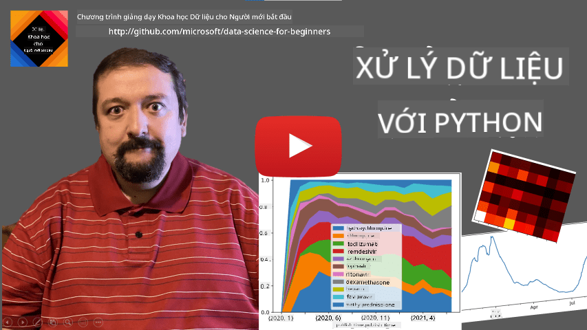
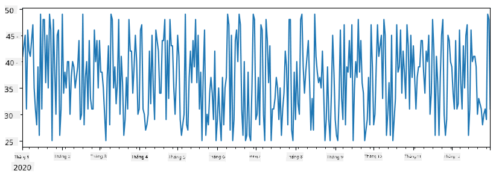
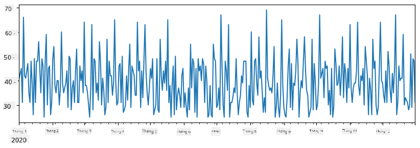
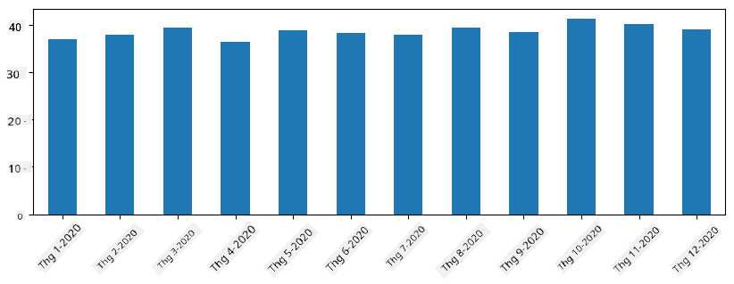
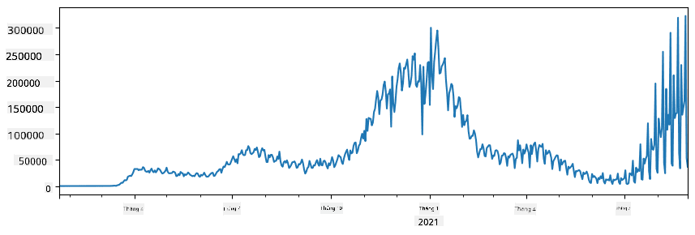
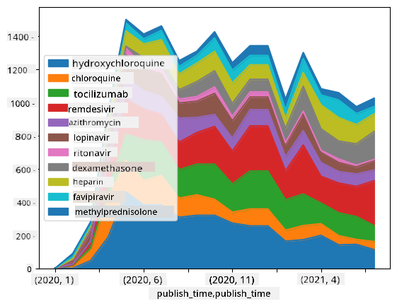

<!--
CO_OP_TRANSLATOR_METADATA:
{
  "original_hash": "7bfec050f4717dcc2dfd028aca9d21f3",
  "translation_date": "2025-09-06T15:51:08+00:00",
  "source_file": "2-Working-With-Data/07-python/README.md",
  "language_code": "vi"
}
-->
# Làm việc với Dữ liệu: Python và Thư viện Pandas

|  ](../../sketchnotes/07-WorkWithPython.png) |
| :-------------------------------------------------------------------------------------------------------: |
|                 Làm việc với Python - _Sketchnote của [@nitya](https://twitter.com/nitya)_                 |

[](https://youtu.be/dZjWOGbsN4Y)

Mặc dù cơ sở dữ liệu cung cấp cách lưu trữ dữ liệu và truy vấn chúng rất hiệu quả bằng ngôn ngữ truy vấn, cách linh hoạt nhất để xử lý dữ liệu là viết chương trình của riêng bạn để thao tác dữ liệu. Trong nhiều trường hợp, việc thực hiện truy vấn cơ sở dữ liệu sẽ hiệu quả hơn. Tuy nhiên, trong một số trường hợp khi cần xử lý dữ liệu phức tạp hơn, điều này không thể thực hiện dễ dàng bằng SQL. 
Xử lý dữ liệu có thể được lập trình bằng bất kỳ ngôn ngữ lập trình nào, nhưng có một số ngôn ngữ ở cấp độ cao hơn khi làm việc với dữ liệu. Các nhà khoa học dữ liệu thường ưu tiên một trong các ngôn ngữ sau:

* **[Python](https://www.python.org/)**, một ngôn ngữ lập trình đa mục đích, thường được coi là một trong những lựa chọn tốt nhất cho người mới bắt đầu nhờ sự đơn giản của nó. Python có rất nhiều thư viện bổ sung giúp bạn giải quyết nhiều vấn đề thực tế, chẳng hạn như trích xuất dữ liệu từ tệp ZIP hoặc chuyển đổi hình ảnh sang thang độ xám. Ngoài khoa học dữ liệu, Python cũng thường được sử dụng trong phát triển web. 
* **[R](https://www.r-project.org/)** là một công cụ truyền thống được phát triển với mục đích xử lý dữ liệu thống kê. Nó cũng chứa một kho thư viện lớn (CRAN), làm cho nó trở thành một lựa chọn tốt để xử lý dữ liệu. Tuy nhiên, R không phải là ngôn ngữ lập trình đa mục đích và hiếm khi được sử dụng ngoài lĩnh vực khoa học dữ liệu.
* **[Julia](https://julialang.org/)** là một ngôn ngữ khác được phát triển đặc biệt cho khoa học dữ liệu. Nó được thiết kế để cung cấp hiệu suất tốt hơn Python, làm cho nó trở thành một công cụ tuyệt vời cho các thí nghiệm khoa học.

Trong bài học này, chúng ta sẽ tập trung vào việc sử dụng Python để xử lý dữ liệu đơn giản. Chúng ta sẽ giả định rằng bạn đã quen thuộc cơ bản với ngôn ngữ này. Nếu bạn muốn tìm hiểu sâu hơn về Python, bạn có thể tham khảo một trong các tài nguyên sau:

* [Học Python một cách thú vị với Turtle Graphics và Fractals](https://github.com/shwars/pycourse) - Khóa học giới thiệu nhanh về lập trình Python trên GitHub
* [Bắt đầu với Python](https://docs.microsoft.com/en-us/learn/paths/python-first-steps/?WT.mc_id=academic-77958-bethanycheum) Lộ trình học trên [Microsoft Learn](http://learn.microsoft.com/?WT.mc_id=academic-77958-bethanycheum)

Dữ liệu có thể xuất hiện dưới nhiều dạng. Trong bài học này, chúng ta sẽ xem xét ba dạng dữ liệu - **dữ liệu dạng bảng**, **văn bản** và **hình ảnh**.

Chúng ta sẽ tập trung vào một vài ví dụ về xử lý dữ liệu, thay vì cung cấp cho bạn cái nhìn tổng quan đầy đủ về tất cả các thư viện liên quan. Điều này sẽ giúp bạn hiểu được những gì có thể làm được và để lại cho bạn sự hiểu biết về nơi tìm giải pháp cho các vấn đề của mình khi cần.

> **Lời khuyên hữu ích nhất**. Khi bạn cần thực hiện một thao tác nào đó trên dữ liệu mà bạn không biết cách làm, hãy thử tìm kiếm trên internet. [Stackoverflow](https://stackoverflow.com/) thường chứa rất nhiều mẫu mã hữu ích bằng Python cho nhiều tác vụ điển hình. 

## [Câu hỏi trước bài giảng](https://ff-quizzes.netlify.app/en/ds/quiz/12)

## Dữ liệu dạng bảng và Dataframes

Bạn đã gặp dữ liệu dạng bảng khi chúng ta nói về cơ sở dữ liệu quan hệ. Khi bạn có nhiều dữ liệu và nó được chứa trong nhiều bảng liên kết khác nhau, việc sử dụng SQL để làm việc với nó chắc chắn là hợp lý. Tuy nhiên, có nhiều trường hợp khi chúng ta có một bảng dữ liệu và cần tìm hiểu hoặc có cái nhìn sâu sắc về dữ liệu này, chẳng hạn như phân phối, mối tương quan giữa các giá trị, v.v. Trong khoa học dữ liệu, có rất nhiều trường hợp chúng ta cần thực hiện một số chuyển đổi dữ liệu ban đầu, sau đó là trực quan hóa. Cả hai bước này đều có thể dễ dàng thực hiện bằng Python.

Có hai thư viện hữu ích nhất trong Python giúp bạn xử lý dữ liệu dạng bảng:
* **[Pandas](https://pandas.pydata.org/)** cho phép bạn thao tác với **Dataframes**, tương tự như các bảng quan hệ. Bạn có thể có các cột được đặt tên và thực hiện các thao tác khác nhau trên hàng, cột và toàn bộ dataframe. 
* **[Numpy](https://numpy.org/)** là một thư viện để làm việc với **tensors**, tức là các **mảng** đa chiều. Mảng có các giá trị cùng loại cơ bản và đơn giản hơn dataframe, nhưng nó cung cấp nhiều phép toán toán học hơn và tạo ít chi phí hơn.

Ngoài ra còn có một vài thư viện khác mà bạn nên biết:
* **[Matplotlib](https://matplotlib.org/)** là một thư viện được sử dụng để trực quan hóa dữ liệu và vẽ đồ thị
* **[SciPy](https://www.scipy.org/)** là một thư viện với một số hàm khoa học bổ sung. Chúng ta đã gặp thư viện này khi nói về xác suất và thống kê

Dưới đây là một đoạn mã mà bạn thường sử dụng để nhập các thư viện này vào đầu chương trình Python của mình:
```python
import numpy as np
import pandas as pd
import matplotlib.pyplot as plt
from scipy import ... # you need to specify exact sub-packages that you need
``` 

Pandas tập trung vào một vài khái niệm cơ bản.

### Series 

**Series** là một chuỗi các giá trị, tương tự như danh sách hoặc mảng numpy. Điểm khác biệt chính là series cũng có một **index**, và khi chúng ta thao tác trên series (ví dụ: cộng chúng), index được tính đến. Index có thể đơn giản như số hàng nguyên (đây là index được sử dụng mặc định khi tạo series từ danh sách hoặc mảng), hoặc nó có thể có cấu trúc phức tạp, chẳng hạn như khoảng thời gian.

> **Lưu ý**: Có một số mã Pandas giới thiệu trong notebook đi kèm [`notebook.ipynb`](notebook.ipynb). Chúng tôi chỉ phác thảo một số ví dụ ở đây, và bạn chắc chắn được khuyến khích kiểm tra toàn bộ notebook.

Hãy xem xét một ví dụ: chúng ta muốn phân tích doanh số bán hàng của cửa hàng kem. Hãy tạo một series số lượng bán hàng (số lượng sản phẩm bán được mỗi ngày) trong một khoảng thời gian:

```python
start_date = "Jan 1, 2020"
end_date = "Mar 31, 2020"
idx = pd.date_range(start_date,end_date)
print(f"Length of index is {len(idx)}")
items_sold = pd.Series(np.random.randint(25,50,size=len(idx)),index=idx)
items_sold.plot()
```


Bây giờ giả sử rằng mỗi tuần chúng ta tổ chức một bữa tiệc cho bạn bè và lấy thêm 10 hộp kem cho bữa tiệc. Chúng ta có thể tạo một series khác, được index theo tuần, để minh họa điều đó:
```python
additional_items = pd.Series(10,index=pd.date_range(start_date,end_date,freq="W"))
```
Khi chúng ta cộng hai series lại với nhau, chúng ta sẽ có tổng số:
```python
total_items = items_sold.add(additional_items,fill_value=0)
total_items.plot()
```


> **Lưu ý** rằng chúng ta không sử dụng cú pháp đơn giản `total_items+additional_items`. Nếu làm vậy, chúng ta sẽ nhận được rất nhiều giá trị `NaN` (*Not a Number*) trong series kết quả. Điều này là do có các giá trị bị thiếu cho một số điểm index trong series `additional_items`, và việc cộng `NaN` với bất kỳ giá trị nào sẽ dẫn đến `NaN`. Do đó, chúng ta cần chỉ định tham số `fill_value` trong quá trình cộng.

Với chuỗi thời gian, chúng ta cũng có thể **resample** series với các khoảng thời gian khác nhau. Ví dụ, giả sử chúng ta muốn tính khối lượng bán hàng trung bình hàng tháng. Chúng ta có thể sử dụng đoạn mã sau:
```python
monthly = total_items.resample("1M").mean()
ax = monthly.plot(kind='bar')
```


### DataFrame

DataFrame về cơ bản là một tập hợp các series có cùng index. Chúng ta có thể kết hợp nhiều series lại với nhau thành một DataFrame:
```python
a = pd.Series(range(1,10))
b = pd.Series(["I","like","to","play","games","and","will","not","change"],index=range(0,9))
df = pd.DataFrame([a,b])
```
Điều này sẽ tạo ra một bảng ngang như sau:
|     | 0   | 1    | 2   | 3   | 4      | 5   | 6      | 7    | 8    |
| --- | --- | ---- | --- | --- | ------ | --- | ------ | ---- | ---- |
| 0   | 1   | 2    | 3   | 4   | 5      | 6   | 7      | 8    | 9    |
| 1   | I   | like | to  | use | Python | and | Pandas | very | much |

Chúng ta cũng có thể sử dụng Series làm cột và chỉ định tên cột bằng cách sử dụng dictionary:
```python
df = pd.DataFrame({ 'A' : a, 'B' : b })
```
Điều này sẽ tạo ra một bảng như sau:

|     | A   | B      |
| --- | --- | ------ |
| 0   | 1   | I      |
| 1   | 2   | like   |
| 2   | 3   | to     |
| 3   | 4   | use    |
| 4   | 5   | Python |
| 5   | 6   | and    |
| 6   | 7   | Pandas |
| 7   | 8   | very   |
| 8   | 9   | much   |

**Lưu ý** rằng chúng ta cũng có thể có bố cục bảng này bằng cách chuyển vị bảng trước đó, ví dụ bằng cách viết 
```python
df = pd.DataFrame([a,b]).T..rename(columns={ 0 : 'A', 1 : 'B' })
```
Ở đây `.T` có nghĩa là thao tác chuyển vị DataFrame, tức là thay đổi hàng và cột, và thao tác `rename` cho phép chúng ta đổi tên cột để khớp với ví dụ trước.

Dưới đây là một số thao tác quan trọng nhất mà chúng ta có thể thực hiện trên DataFrames:

**Chọn cột**. Chúng ta có thể chọn các cột riêng lẻ bằng cách viết `df['A']` - thao tác này trả về một Series. Chúng ta cũng có thể chọn một tập hợp con của các cột thành một DataFrame khác bằng cách viết `df[['B','A']]` - thao tác này trả về một DataFrame khác.

**Lọc** chỉ các hàng nhất định theo tiêu chí. Ví dụ, để chỉ giữ lại các hàng có cột `A` lớn hơn 5, chúng ta có thể viết `df[df['A']>5]`.

> **Lưu ý**: Cách hoạt động của lọc là như sau. Biểu thức `df['A']<5` trả về một series boolean, chỉ ra liệu biểu thức có `True` hay `False` cho từng phần tử của series gốc `df['A']`. Khi series boolean được sử dụng làm index, nó trả về tập hợp con của các hàng trong DataFrame. Do đó, không thể sử dụng biểu thức boolean Python tùy ý, ví dụ, viết `df[df['A']>5 and df['A']<7]` sẽ sai. Thay vào đó, bạn nên sử dụng thao tác đặc biệt `&` trên series boolean, viết `df[(df['A']>5) & (df['A']<7)]` (*dấu ngoặc rất quan trọng ở đây*).

**Tạo các cột tính toán mới**. Chúng ta có thể dễ dàng tạo các cột tính toán mới cho DataFrame của mình bằng cách sử dụng biểu thức trực quan như sau:
```python
df['DivA'] = df['A']-df['A'].mean() 
``` 
Ví dụ này tính độ lệch của A so với giá trị trung bình của nó. Điều thực sự xảy ra ở đây là chúng ta đang tính một series, sau đó gán series này cho vế trái, tạo một cột mới. Do đó, chúng ta không thể sử dụng bất kỳ thao tác nào không tương thích với series, ví dụ, đoạn mã dưới đây là sai:
```python
# Wrong code -> df['ADescr'] = "Low" if df['A'] < 5 else "Hi"
df['LenB'] = len(df['B']) # <- Wrong result
``` 
Ví dụ sau, mặc dù cú pháp đúng, nhưng cho kết quả sai, vì nó gán độ dài của series `B` cho tất cả các giá trị trong cột, chứ không phải độ dài của từng phần tử như chúng ta mong muốn.

Nếu chúng ta cần tính các biểu thức phức tạp như vậy, chúng ta có thể sử dụng hàm `apply`. Ví dụ cuối cùng có thể được viết như sau:
```python
df['LenB'] = df['B'].apply(lambda x : len(x))
# or 
df['LenB'] = df['B'].apply(len)
```

Sau các thao tác trên, chúng ta sẽ có DataFrame sau:

|     | A   | B      | DivA | LenB |
| --- | --- | ------ | ---- | ---- |
| 0   | 1   | I      | -4.0 | 1    |
| 1   | 2   | like   | -3.0 | 4    |
| 2   | 3   | to     | -2.0 | 2    |
| 3   | 4   | use    | -1.0 | 3    |
| 4   | 5   | Python | 0.0  | 6    |
| 5   | 6   | and    | 1.0  | 3    |
| 6   | 7   | Pandas | 2.0  | 6    |
| 7   | 8   | very   | 3.0  | 4    |
| 8   | 9   | much   | 4.0  | 4    |

**Chọn hàng dựa trên số** có thể được thực hiện bằng cách sử dụng cấu trúc `iloc`. Ví dụ, để chọn 5 hàng đầu tiên từ DataFrame:
```python
df.iloc[:5]
```

**Nhóm** thường được sử dụng để có kết quả tương tự như *bảng pivot* trong Excel. Giả sử chúng ta muốn tính giá trị trung bình của cột `A` cho mỗi số `LenB` nhất định. Sau đó, chúng ta có thể nhóm DataFrame của mình theo `LenB` và gọi `mean`:
```python
df.groupby(by='LenB')[['A','DivA']].mean()
```
Nếu chúng ta cần tính giá trị trung bình và số lượng phần tử trong nhóm, thì chúng ta có thể sử dụng hàm `aggregate` phức tạp hơn:
```python
df.groupby(by='LenB') \
 .aggregate({ 'DivA' : len, 'A' : lambda x: x.mean() }) \
 .rename(columns={ 'DivA' : 'Count', 'A' : 'Mean'})
```
Điều này cho chúng ta bảng sau:

| LenB | Count | Mean     |
| ---- | ----- | -------- |
| 1    | 1     | 1.000000 |
| 2    | 1     | 3.000000 |
| 3    | 2     | 5.000000 |
| 4    | 3     | 6.333333 |
| 6    | 2     | 6.000000 |

### Lấy Dữ Liệu
Chúng ta đã thấy việc tạo Series và DataFrames từ các đối tượng Python dễ dàng như thế nào. Tuy nhiên, dữ liệu thường xuất hiện dưới dạng tệp văn bản hoặc bảng Excel. May mắn thay, Pandas cung cấp cho chúng ta một cách đơn giản để tải dữ liệu từ ổ đĩa. Ví dụ, việc đọc tệp CSV đơn giản như sau:
```python
df = pd.read_csv('file.csv')
```
Chúng ta sẽ xem thêm các ví dụ về việc tải dữ liệu, bao gồm cả việc lấy dữ liệu từ các trang web bên ngoài, trong phần "Thử thách".

### In và Vẽ Biểu Đồ

Một nhà khoa học dữ liệu thường phải khám phá dữ liệu, vì vậy việc có thể trực quan hóa dữ liệu là rất quan trọng. Khi DataFrame lớn, nhiều lần chúng ta chỉ muốn đảm bảo rằng mọi thứ đang được thực hiện đúng bằng cách in ra vài dòng đầu tiên. Điều này có thể thực hiện bằng cách gọi `df.head()`. Nếu bạn chạy nó từ Jupyter Notebook, nó sẽ in DataFrame dưới dạng bảng đẹp mắt.

Chúng ta cũng đã thấy cách sử dụng hàm `plot` để trực quan hóa một số cột. Mặc dù `plot` rất hữu ích cho nhiều nhiệm vụ và hỗ trợ nhiều loại biểu đồ khác nhau thông qua tham số `kind=`, bạn luôn có thể sử dụng thư viện `matplotlib` để vẽ những biểu đồ phức tạp hơn. Chúng ta sẽ tìm hiểu chi tiết về trực quan hóa dữ liệu trong các bài học riêng của khóa học.

Tổng quan này bao gồm các khái niệm quan trọng nhất của Pandas, tuy nhiên, thư viện này rất phong phú và không có giới hạn nào cho những gì bạn có thể làm với nó! Bây giờ hãy áp dụng kiến thức này để giải quyết các vấn đề cụ thể.

## 🚀 Thử thách 1: Phân tích Sự Lây Lan của COVID

Vấn đề đầu tiên chúng ta sẽ tập trung là mô hình hóa sự lây lan của dịch COVID-19. Để làm điều đó, chúng ta sẽ sử dụng dữ liệu về số lượng người bị nhiễm ở các quốc gia khác nhau, được cung cấp bởi [Trung tâm Khoa học Hệ thống và Kỹ thuật](https://systems.jhu.edu/) (CSSE) tại [Đại học Johns Hopkins](https://jhu.edu/). Bộ dữ liệu có sẵn tại [Kho lưu trữ GitHub này](https://github.com/CSSEGISandData/COVID-19).

Vì chúng ta muốn minh họa cách xử lý dữ liệu, hãy mở [`notebook-covidspread.ipynb`](notebook-covidspread.ipynb) và đọc từ đầu đến cuối. Bạn cũng có thể thực thi các ô lệnh và thực hiện một số thử thách mà chúng tôi đã để lại cho bạn ở cuối.



> Nếu bạn không biết cách chạy mã trong Jupyter Notebook, hãy xem [bài viết này](https://soshnikov.com/education/how-to-execute-notebooks-from-github/).

## Làm Việc Với Dữ Liệu Không Có Cấu Trúc

Mặc dù dữ liệu thường xuất hiện dưới dạng bảng, trong một số trường hợp chúng ta cần xử lý dữ liệu ít có cấu trúc hơn, ví dụ như văn bản hoặc hình ảnh. Trong trường hợp này, để áp dụng các kỹ thuật xử lý dữ liệu mà chúng ta đã thấy ở trên, chúng ta cần **trích xuất** dữ liệu có cấu trúc. Dưới đây là một vài ví dụ:

* Trích xuất từ khóa từ văn bản và xem tần suất xuất hiện của các từ khóa đó
* Sử dụng mạng nơ-ron để trích xuất thông tin về các đối tượng trong hình ảnh
* Thu thập thông tin về cảm xúc của con người từ luồng video camera

## 🚀 Thử thách 2: Phân tích Các Bài Báo về COVID

Trong thử thách này, chúng ta sẽ tiếp tục với chủ đề đại dịch COVID và tập trung vào việc xử lý các bài báo khoa học về chủ đề này. Có [Bộ dữ liệu CORD-19](https://www.kaggle.com/allen-institute-for-ai/CORD-19-research-challenge) với hơn 7000 bài báo (tại thời điểm viết) về COVID, có sẵn với siêu dữ liệu và tóm tắt (và khoảng một nửa trong số đó cũng có toàn văn).

Một ví dụ đầy đủ về việc phân tích bộ dữ liệu này bằng cách sử dụng dịch vụ nhận thức [Text Analytics for Health](https://docs.microsoft.com/azure/cognitive-services/text-analytics/how-tos/text-analytics-for-health/?WT.mc_id=academic-77958-bethanycheum) được mô tả [trong bài viết blog này](https://soshnikov.com/science/analyzing-medical-papers-with-azure-and-text-analytics-for-health/). Chúng ta sẽ thảo luận phiên bản đơn giản hóa của phân tích này.

> **NOTE**: Chúng tôi không cung cấp bản sao của bộ dữ liệu như một phần của kho lưu trữ này. Bạn có thể cần tải xuống tệp [`metadata.csv`](https://www.kaggle.com/allen-institute-for-ai/CORD-19-research-challenge?select=metadata.csv) từ [bộ dữ liệu này trên Kaggle](https://www.kaggle.com/allen-institute-for-ai/CORD-19-research-challenge). Có thể cần đăng ký với Kaggle. Bạn cũng có thể tải xuống bộ dữ liệu mà không cần đăng ký [tại đây](https://ai2-semanticscholar-cord-19.s3-us-west-2.amazonaws.com/historical_releases.html), nhưng nó sẽ bao gồm tất cả các văn bản đầy đủ ngoài tệp siêu dữ liệu.

Hãy mở [`notebook-papers.ipynb`](notebook-papers.ipynb) và đọc từ đầu đến cuối. Bạn cũng có thể thực thi các ô lệnh và thực hiện một số thử thách mà chúng tôi đã để lại cho bạn ở cuối.



## Xử Lý Dữ Liệu Hình Ảnh

Gần đây, các mô hình AI rất mạnh mẽ đã được phát triển, cho phép chúng ta hiểu hình ảnh. Có nhiều nhiệm vụ có thể được giải quyết bằng cách sử dụng các mạng nơ-ron đã được huấn luyện trước hoặc các dịch vụ đám mây. Một số ví dụ bao gồm:

* **Phân loại hình ảnh**, giúp bạn phân loại hình ảnh vào một trong các lớp đã được định nghĩa trước. Bạn có thể dễ dàng huấn luyện bộ phân loại hình ảnh của riêng mình bằng các dịch vụ như [Custom Vision](https://azure.microsoft.com/services/cognitive-services/custom-vision-service/?WT.mc_id=academic-77958-bethanycheum)
* **Phát hiện đối tượng** để phát hiện các đối tượng khác nhau trong hình ảnh. Các dịch vụ như [computer vision](https://azure.microsoft.com/services/cognitive-services/computer-vision/?WT.mc_id=academic-77958-bethanycheum) có thể phát hiện một số đối tượng phổ biến, và bạn có thể huấn luyện mô hình [Custom Vision](https://azure.microsoft.com/services/cognitive-services/custom-vision-service/?WT.mc_id=academic-77958-bethanycheum) để phát hiện một số đối tượng cụ thể mà bạn quan tâm.
* **Phát hiện khuôn mặt**, bao gồm tuổi, giới tính và cảm xúc. Điều này có thể được thực hiện thông qua [Face API](https://azure.microsoft.com/services/cognitive-services/face/?WT.mc_id=academic-77958-bethanycheum).

Tất cả các dịch vụ đám mây này có thể được gọi bằng [Python SDKs](https://docs.microsoft.com/samples/azure-samples/cognitive-services-python-sdk-samples/cognitive-services-python-sdk-samples/?WT.mc_id=academic-77958-bethanycheum), và do đó có thể dễ dàng tích hợp vào quy trình khám phá dữ liệu của bạn.

Dưới đây là một số ví dụ về việc khám phá dữ liệu từ các nguồn dữ liệu hình ảnh:
* Trong bài viết blog [Học Khoa Học Dữ Liệu mà Không Cần Lập Trình](https://soshnikov.com/azure/how-to-learn-data-science-without-coding/), chúng ta khám phá các bức ảnh trên Instagram, cố gắng hiểu điều gì khiến mọi người thích một bức ảnh nhiều hơn. Chúng ta đầu tiên trích xuất càng nhiều thông tin từ hình ảnh càng tốt bằng cách sử dụng [computer vision](https://azure.microsoft.com/services/cognitive-services/computer-vision/?WT.mc_id=academic-77958-bethanycheum), và sau đó sử dụng [Azure Machine Learning AutoML](https://docs.microsoft.com/azure/machine-learning/concept-automated-ml/?WT.mc_id=academic-77958-bethanycheum) để xây dựng mô hình có thể giải thích được.
* Trong [Hội Thảo Nghiên Cứu Khuôn Mặt](https://github.com/CloudAdvocacy/FaceStudies), chúng ta sử dụng [Face API](https://azure.microsoft.com/services/cognitive-services/face/?WT.mc_id=academic-77958-bethanycheum) để trích xuất cảm xúc của mọi người trên các bức ảnh từ các sự kiện, nhằm cố gắng hiểu điều gì khiến mọi người hạnh phúc.

## Kết Luận

Dù bạn đã có dữ liệu có cấu trúc hay không có cấu trúc, sử dụng Python bạn có thể thực hiện tất cả các bước liên quan đến xử lý và hiểu dữ liệu. Đây có lẽ là cách linh hoạt nhất để xử lý dữ liệu, và đó là lý do phần lớn các nhà khoa học dữ liệu sử dụng Python như công cụ chính của họ. Học Python một cách sâu sắc có lẽ là một ý tưởng tốt nếu bạn nghiêm túc về hành trình khoa học dữ liệu của mình!

## [Câu hỏi sau bài giảng](https://ff-quizzes.netlify.app/en/ds/quiz/13)

## Ôn Tập & Tự Học

**Sách**
* [Wes McKinney. Python for Data Analysis: Data Wrangling with Pandas, NumPy, and IPython](https://www.amazon.com/gp/product/1491957662)

**Tài liệu trực tuyến**
* Hướng dẫn chính thức [10 phút với Pandas](https://pandas.pydata.org/pandas-docs/stable/user_guide/10min.html)
* [Tài liệu về Trực quan hóa Pandas](https://pandas.pydata.org/pandas-docs/stable/user_guide/visualization.html)

**Học Python**
* [Học Python một cách thú vị với Đồ họa Turtle và Fractals](https://github.com/shwars/pycourse)
* [Bắt đầu học Python](https://docs.microsoft.com/learn/paths/python-first-steps/?WT.mc_id=academic-77958-bethanycheum) trên [Microsoft Learn](http://learn.microsoft.com/?WT.mc_id=academic-77958-bethanycheum)

## Bài Tập

[Thực hiện nghiên cứu dữ liệu chi tiết hơn cho các thử thách trên](assignment.md)

## Tín Dụng

Bài học này được viết với ♥️ bởi [Dmitry Soshnikov](http://soshnikov.com)

---

**Tuyên bố miễn trừ trách nhiệm**:  
Tài liệu này đã được dịch bằng dịch vụ dịch thuật AI [Co-op Translator](https://github.com/Azure/co-op-translator). Mặc dù chúng tôi cố gắng đảm bảo độ chính xác, xin lưu ý rằng các bản dịch tự động có thể chứa lỗi hoặc sự không chính xác. Tài liệu gốc bằng ngôn ngữ bản địa nên được coi là nguồn tham khảo chính thức. Đối với các thông tin quan trọng, nên sử dụng dịch vụ dịch thuật chuyên nghiệp từ con người. Chúng tôi không chịu trách nhiệm cho bất kỳ sự hiểu lầm hoặc diễn giải sai nào phát sinh từ việc sử dụng bản dịch này.