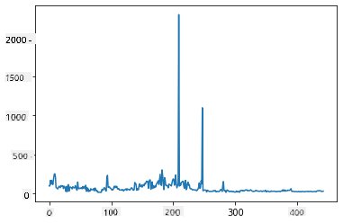
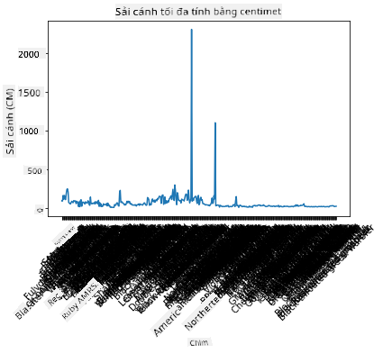
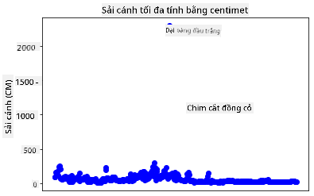
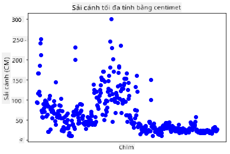
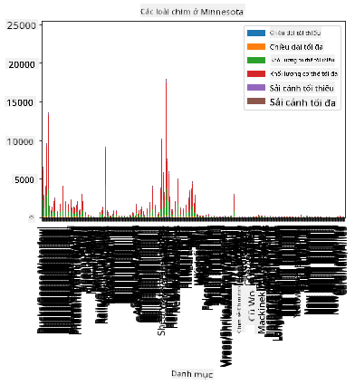
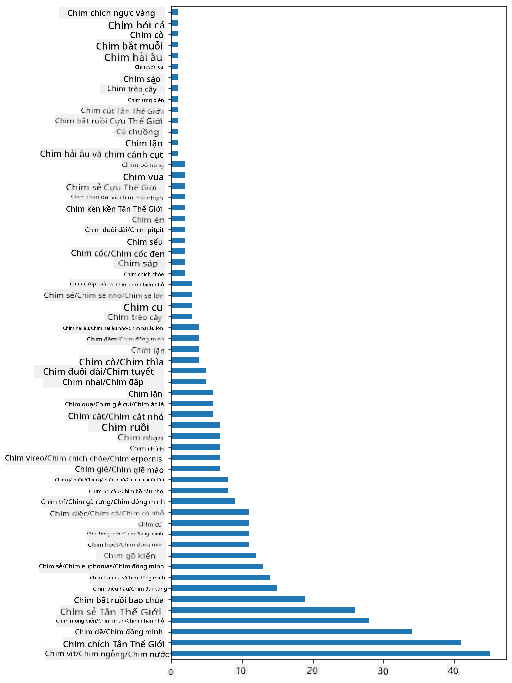
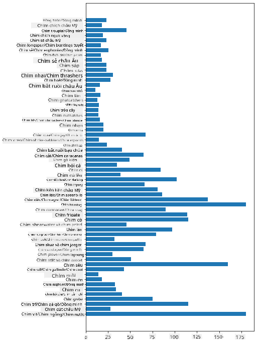
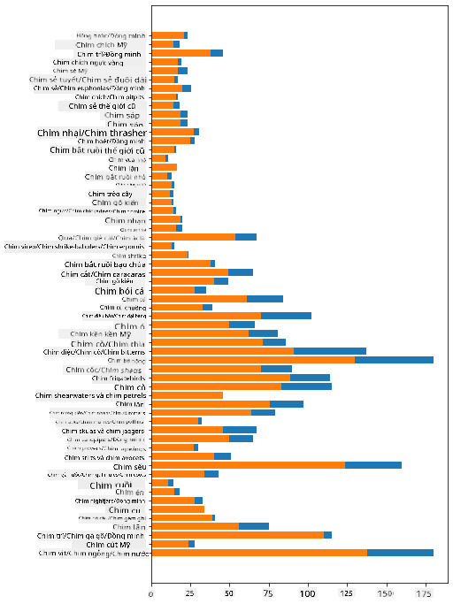

<!--
CO_OP_TRANSLATOR_METADATA:
{
  "original_hash": "43c402d9d90ae6da55d004519ada5033",
  "translation_date": "2025-08-28T18:41:03+00:00",
  "source_file": "3-Data-Visualization/09-visualization-quantities/README.md",
  "language_code": "vi"
}
-->
# Hình dung số lượng

| ](../../sketchnotes/09-Visualizing-Quantities.png)|
|:---:|
| Hình dung số lượng - _Sketchnote của [@nitya](https://twitter.com/nitya)_ |

Trong bài học này, bạn sẽ khám phá cách sử dụng một trong nhiều thư viện Python có sẵn để học cách tạo ra các hình ảnh trực quan thú vị xoay quanh khái niệm về số lượng. Sử dụng một tập dữ liệu đã được làm sạch về các loài chim ở Minnesota, bạn có thể tìm hiểu nhiều thông tin thú vị về động vật hoang dã địa phương.  
## [Câu hỏi trước bài giảng](https://purple-hill-04aebfb03.1.azurestaticapps.net/quiz/16)

## Quan sát sải cánh với Matplotlib

Một thư viện tuyệt vời để tạo cả biểu đồ đơn giản và phức tạp thuộc nhiều loại khác nhau là [Matplotlib](https://matplotlib.org/stable/index.html). Nói chung, quá trình vẽ dữ liệu bằng các thư viện này bao gồm việc xác định các phần của dataframe mà bạn muốn nhắm đến, thực hiện các chuyển đổi cần thiết trên dữ liệu đó, gán giá trị trục x và y, quyết định loại biểu đồ nào sẽ hiển thị, và sau đó hiển thị biểu đồ. Matplotlib cung cấp nhiều loại hình ảnh trực quan, nhưng trong bài học này, hãy tập trung vào những loại phù hợp nhất để hình dung số lượng: biểu đồ đường, biểu đồ phân tán, và biểu đồ cột.

> ✅ Sử dụng biểu đồ tốt nhất phù hợp với cấu trúc dữ liệu và câu chuyện bạn muốn kể.  
> - Để phân tích xu hướng theo thời gian: biểu đồ đường  
> - Để so sánh giá trị: biểu đồ cột, biểu đồ thanh, biểu đồ tròn, biểu đồ phân tán  
> - Để hiển thị mối quan hệ giữa các phần và tổng thể: biểu đồ tròn  
> - Để hiển thị phân phối dữ liệu: biểu đồ phân tán, biểu đồ thanh  
> - Để hiển thị xu hướng: biểu đồ đường, biểu đồ cột  
> - Để hiển thị mối quan hệ giữa các giá trị: biểu đồ đường, biểu đồ phân tán, biểu đồ bong bóng  

Nếu bạn có một tập dữ liệu và cần khám phá số lượng của một mục cụ thể, một trong những nhiệm vụ đầu tiên bạn cần làm là kiểm tra các giá trị của nó.  

✅ Có rất nhiều 'cheat sheets' hữu ích cho Matplotlib [ở đây](https://matplotlib.org/cheatsheets/cheatsheets.pdf).

## Tạo biểu đồ đường về giá trị sải cánh của chim

Mở tệp `notebook.ipynb` ở thư mục gốc của bài học này và thêm một ô.

> Lưu ý: dữ liệu được lưu trữ ở thư mục gốc của repo này trong thư mục `/data`.

```python
import pandas as pd
import matplotlib.pyplot as plt
birds = pd.read_csv('../../data/birds.csv')
birds.head()
```  
Dữ liệu này là sự kết hợp giữa văn bản và số:

|      | Tên                          | Tên khoa học           | Loại                  | Bộ          | Họ       | Chi         | Tình trạng bảo tồn | Chiều dài nhỏ nhất | Chiều dài lớn nhất | Khối lượng cơ thể nhỏ nhất | Khối lượng cơ thể lớn nhất | Sải cánh nhỏ nhất | Sải cánh lớn nhất |
| ---: | :--------------------------- | :--------------------- | :-------------------- | :----------- | :------- | :---------- | :----------------- | ------------------: | ------------------: | --------------------------: | --------------------------: | ----------------: | ----------------: |
|    0 | Vịt huýt sáo bụng đen        | Dendrocygna autumnalis | Vịt/Ngỗng/Chim nước   | Anseriformes | Anatidae | Dendrocygna | LC                 |                 47  |                 56  |                       652  |                      1020  |                76 |                94 |
|    1 | Vịt huýt sáo nâu             | Dendrocygna bicolor    | Vịt/Ngỗng/Chim nước   | Anseriformes | Anatidae | Dendrocygna | LC                 |                 45  |                 53  |                       712  |                      1050  |                85 |                93 |
|    2 | Ngỗng tuyết                  | Anser caerulescens     | Vịt/Ngỗng/Chim nước   | Anseriformes | Anatidae | Anser       | LC                 |                 64  |                 79  |                      2050  |                      4050  |               135 |               165 |
|    3 | Ngỗng Ross                   | Anser rossii           | Vịt/Ngỗng/Chim nước   | Anseriformes | Anatidae | Anser       | LC                 |               57.3  |                 64  |                      1066  |                      1567  |               113 |               116 |
|    4 | Ngỗng trắng lớn              | Anser albifrons        | Vịt/Ngỗng/Chim nước   | Anseriformes | Anatidae | Anser       | LC                 |                 64  |                 81  |                      1930  |                      3310  |               130 |               165 |

Hãy bắt đầu bằng cách vẽ một số dữ liệu số bằng biểu đồ đường cơ bản. Giả sử bạn muốn xem giá trị sải cánh lớn nhất của những loài chim thú vị này.

```python
wingspan = birds['MaxWingspan'] 
wingspan.plot()
```  


Bạn nhận thấy điều gì ngay lập tức? Có vẻ như có ít nhất một giá trị ngoại lệ - đó là một sải cánh khá lớn! Sải cánh 2300 cm tương đương 23 mét - có phải có Pterodactyls đang bay lượn ở Minnesota không? Hãy điều tra.

Mặc dù bạn có thể thực hiện một phép sắp xếp nhanh trong Excel để tìm các giá trị ngoại lệ, nhưng hãy tiếp tục quá trình hình dung bằng cách làm việc từ trong biểu đồ.

Thêm nhãn vào trục x để hiển thị loại chim nào đang được đề cập:

```
plt.title('Max Wingspan in Centimeters')
plt.ylabel('Wingspan (CM)')
plt.xlabel('Birds')
plt.xticks(rotation=45)
x = birds['Name'] 
y = birds['MaxWingspan']

plt.plot(x, y)

plt.show()
```  


Ngay cả khi xoay nhãn 45 độ, vẫn có quá nhiều để đọc. Hãy thử một chiến lược khác: chỉ gắn nhãn cho các giá trị ngoại lệ và đặt nhãn trong biểu đồ. Bạn có thể sử dụng biểu đồ phân tán để tạo thêm không gian cho việc gắn nhãn:

```python
plt.title('Max Wingspan in Centimeters')
plt.ylabel('Wingspan (CM)')
plt.tick_params(axis='both',which='both',labelbottom=False,bottom=False)

for i in range(len(birds)):
    x = birds['Name'][i]
    y = birds['MaxWingspan'][i]
    plt.plot(x, y, 'bo')
    if birds['MaxWingspan'][i] > 500:
        plt.text(x, y * (1 - 0.05), birds['Name'][i], fontsize=12)
    
plt.show()
```  
Chuyện gì đang xảy ra ở đây? Bạn đã sử dụng `tick_params` để ẩn các nhãn ở dưới cùng và sau đó tạo một vòng lặp qua tập dữ liệu chim của bạn. Vẽ biểu đồ với các chấm tròn nhỏ màu xanh bằng cách sử dụng `bo`, bạn kiểm tra bất kỳ loài chim nào có sải cánh lớn nhất trên 500 và hiển thị nhãn của chúng bên cạnh chấm nếu có. Bạn đã dịch nhãn một chút trên trục y (`y * (1 - 0.05)`) và sử dụng tên loài chim làm nhãn.

Bạn đã khám phá ra điều gì?

  
## Lọc dữ liệu của bạn

Cả Đại bàng đầu trắng và Chim cắt đồng cỏ, mặc dù có thể là những loài chim rất lớn, dường như bị gắn nhãn sai, với một số `0` thừa được thêm vào sải cánh lớn nhất của chúng. Không có khả năng bạn sẽ gặp một Đại bàng đầu trắng với sải cánh 25 mét, nhưng nếu có, hãy cho chúng tôi biết! Hãy tạo một dataframe mới mà không có hai giá trị ngoại lệ này:

```python
plt.title('Max Wingspan in Centimeters')
plt.ylabel('Wingspan (CM)')
plt.xlabel('Birds')
plt.tick_params(axis='both',which='both',labelbottom=False,bottom=False)
for i in range(len(birds)):
    x = birds['Name'][i]
    y = birds['MaxWingspan'][i]
    if birds['Name'][i] not in ['Bald eagle', 'Prairie falcon']:
        plt.plot(x, y, 'bo')
plt.show()
```  

Bằng cách lọc các giá trị ngoại lệ, dữ liệu của bạn giờ đây trở nên mạch lạc và dễ hiểu hơn.



Bây giờ chúng ta đã có một tập dữ liệu sạch hơn ít nhất là về mặt sải cánh, hãy khám phá thêm về những loài chim này.

Mặc dù biểu đồ đường và biểu đồ phân tán có thể hiển thị thông tin về giá trị dữ liệu và phân phối của chúng, chúng ta muốn suy nghĩ về các giá trị vốn có trong tập dữ liệu này. Bạn có thể tạo hình ảnh trực quan để trả lời các câu hỏi sau về số lượng:

> Có bao nhiêu loại chim, và số lượng của chúng là bao nhiêu?  
> Có bao nhiêu loài chim đã tuyệt chủng, đang nguy cấp, hiếm, hoặc phổ biến?  
> Có bao nhiêu loài thuộc các chi và bộ khác nhau theo thuật ngữ của Linnaeus?  
## Khám phá biểu đồ cột

Biểu đồ cột rất hữu ích khi bạn cần hiển thị các nhóm dữ liệu. Hãy khám phá các loại chim tồn tại trong tập dữ liệu này để xem loại nào phổ biến nhất theo số lượng.

Trong tệp notebook, tạo một biểu đồ cột cơ bản.

✅ Lưu ý, bạn có thể lọc hai loài chim ngoại lệ mà chúng ta đã xác định ở phần trước, chỉnh sửa lỗi trong sải cánh của chúng, hoặc giữ nguyên chúng cho các bài tập này không phụ thuộc vào giá trị sải cánh.

Nếu bạn muốn tạo một biểu đồ cột, bạn có thể chọn dữ liệu mà bạn muốn tập trung vào. Biểu đồ cột có thể được tạo từ dữ liệu thô:

```python
birds.plot(x='Category',
        kind='bar',
        stacked=True,
        title='Birds of Minnesota')

```  


Tuy nhiên, biểu đồ cột này không thể đọc được vì có quá nhiều dữ liệu không được nhóm lại. Bạn cần chọn chỉ dữ liệu mà bạn muốn vẽ, vì vậy hãy xem chiều dài của chim dựa trên loại của chúng.

Lọc dữ liệu của bạn để chỉ bao gồm loại chim.

✅ Lưu ý rằng bạn sử dụng Pandas để quản lý dữ liệu, sau đó để Matplotlib thực hiện việc vẽ biểu đồ.

Vì có nhiều loại, bạn có thể hiển thị biểu đồ này theo chiều dọc và điều chỉnh chiều cao của nó để phù hợp với tất cả dữ liệu:

```python
category_count = birds.value_counts(birds['Category'].values, sort=True)
plt.rcParams['figure.figsize'] = [6, 12]
category_count.plot.barh()
```  


Biểu đồ cột này cung cấp một cái nhìn tốt về số lượng chim trong mỗi loại. Trong nháy mắt, bạn thấy rằng số lượng chim lớn nhất trong khu vực này thuộc loại Vịt/Ngỗng/Chim nước. Minnesota là 'vùng đất của 10,000 hồ' nên điều này không có gì ngạc nhiên!

✅ Thử một số đếm khác trên tập dữ liệu này. Có điều gì làm bạn ngạc nhiên không?

## So sánh dữ liệu

Bạn có thể thử các so sánh khác nhau của dữ liệu được nhóm bằng cách tạo các trục mới. Thử so sánh chiều dài lớn nhất của một loài chim, dựa trên loại của nó:

```python
maxlength = birds['MaxLength']
plt.barh(y=birds['Category'], width=maxlength)
plt.rcParams['figure.figsize'] = [6, 12]
plt.show()
```  


Không có gì ngạc nhiên ở đây: chim ruồi có chiều dài lớn nhất ít nhất so với Bồ nông hoặc Ngỗng. Thật tốt khi dữ liệu có ý nghĩa logic!

Bạn có thể tạo hình ảnh trực quan thú vị hơn về biểu đồ cột bằng cách chồng dữ liệu lên nhau. Hãy chồng chiều dài nhỏ nhất và lớn nhất lên một loại chim cụ thể:

```python
minLength = birds['MinLength']
maxLength = birds['MaxLength']
category = birds['Category']

plt.barh(category, maxLength)
plt.barh(category, minLength)

plt.show()
```  
Trong biểu đồ này, bạn có thể thấy phạm vi chiều dài nhỏ nhất và lớn nhất theo loại chim. Bạn có thể tự tin nói rằng, dựa trên dữ liệu này, chim càng lớn thì phạm vi chiều dài của nó càng lớn. Thật thú vị!



## 🚀 Thử thách

Tập dữ liệu về chim này cung cấp một lượng thông tin phong phú về các loại chim khác nhau trong một hệ sinh thái cụ thể. Tìm kiếm trên internet và xem liệu bạn có thể tìm thấy các tập dữ liệu khác liên quan đến chim. Thực hành tạo biểu đồ và đồ thị về những loài chim này để khám phá những sự thật mà bạn chưa từng nhận ra.  
## [Câu hỏi sau bài giảng](https://purple-hill-04aebfb03.1.azurestaticapps.net/quiz/17)

## Ôn tập & Tự học

Bài học đầu tiên này đã cung cấp cho bạn một số thông tin về cách sử dụng Matplotlib để hình dung số lượng. Hãy nghiên cứu thêm về các cách khác để làm việc với tập dữ liệu để hình dung. [Plotly](https://github.com/plotly/plotly.py) là một công cụ mà chúng ta sẽ không đề cập trong các bài học này, vì vậy hãy xem nó có thể cung cấp những gì.  
## Bài tập

[Đường, Phân tán, và Cột](assignment.md)

---

**Tuyên bố miễn trừ trách nhiệm**:  
Tài liệu này đã được dịch bằng dịch vụ dịch thuật AI [Co-op Translator](https://github.com/Azure/co-op-translator). Mặc dù chúng tôi cố gắng đảm bảo độ chính xác, xin lưu ý rằng các bản dịch tự động có thể chứa lỗi hoặc không chính xác. Tài liệu gốc bằng ngôn ngữ bản địa nên được coi là nguồn thông tin chính thức. Đối với các thông tin quan trọng, khuyến nghị sử dụng dịch vụ dịch thuật chuyên nghiệp bởi con người. Chúng tôi không chịu trách nhiệm cho bất kỳ sự hiểu lầm hoặc diễn giải sai nào phát sinh từ việc sử dụng bản dịch này.