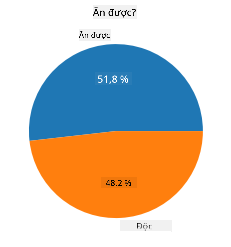
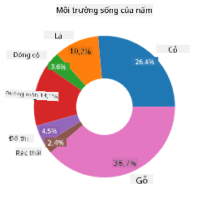
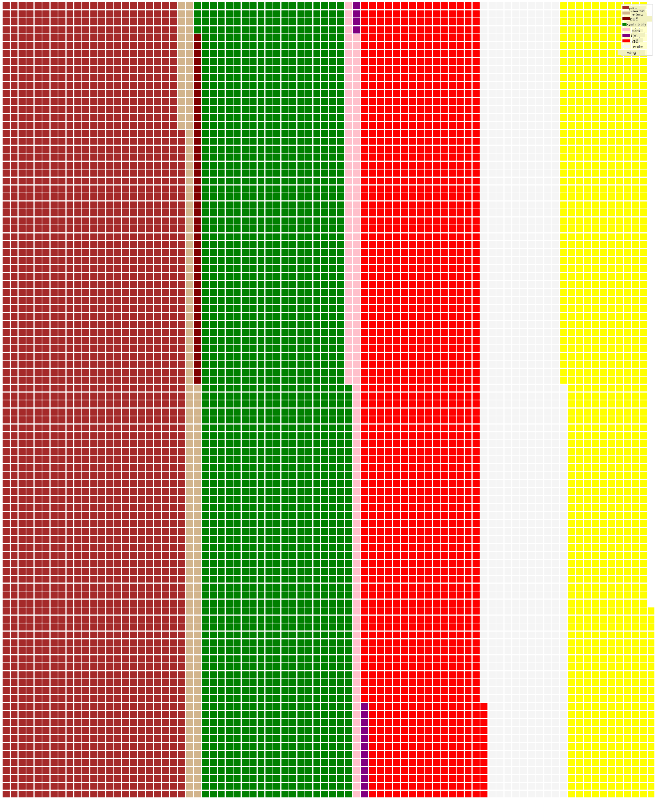

<!--
CO_OP_TRANSLATOR_METADATA:
{
  "original_hash": "cc490897ee2d276870472bcb31602d03",
  "translation_date": "2025-09-04T20:25:13+00:00",
  "source_file": "3-Data-Visualization/11-visualization-proportions/README.md",
  "language_code": "vi"
}
-->
# Hình dung Tỷ lệ

| ](../../sketchnotes/11-Visualizing-Proportions.png)|
|:---:|
|Hình dung Tỷ lệ - _Sketchnote bởi [@nitya](https://twitter.com/nitya)_ |

Trong bài học này, bạn sẽ sử dụng một bộ dữ liệu tập trung vào thiên nhiên để hình dung tỷ lệ, chẳng hạn như có bao nhiêu loại nấm khác nhau xuất hiện trong một bộ dữ liệu về nấm. Hãy cùng khám phá những loại nấm thú vị này bằng cách sử dụng một bộ dữ liệu từ Audubon, liệt kê chi tiết về 23 loài nấm có mang thuộc họ Agaricus và Lepiota. Bạn sẽ thử nghiệm với các biểu đồ hấp dẫn như:

- Biểu đồ tròn 🥧  
- Biểu đồ donut 🍩  
- Biểu đồ waffle 🧇  

> 💡 Một dự án rất thú vị có tên [Charticulator](https://charticulator.com) của Microsoft Research cung cấp giao diện kéo thả miễn phí để tạo hình ảnh dữ liệu. Trong một trong các hướng dẫn của họ, họ cũng sử dụng bộ dữ liệu về nấm này! Vì vậy, bạn có thể khám phá dữ liệu và học thư viện cùng lúc: [Hướng dẫn Charticulator](https://charticulator.com/tutorials/tutorial4.html).

## [Câu hỏi sau bài giảng](https://ff-quizzes.netlify.app/en/ds/)

## Tìm hiểu về nấm 🍄

Nấm rất thú vị. Hãy nhập một bộ dữ liệu để nghiên cứu chúng:

```python
import pandas as pd
import matplotlib.pyplot as plt
mushrooms = pd.read_csv('../../data/mushrooms.csv')
mushrooms.head()
```  
Một bảng được in ra với một số dữ liệu tuyệt vời để phân tích:

| class     | cap-shape | cap-surface | cap-color | bruises | odor    | gill-attachment | gill-spacing | gill-size | gill-color | stalk-shape | stalk-root | stalk-surface-above-ring | stalk-surface-below-ring | stalk-color-above-ring | stalk-color-below-ring | veil-type | veil-color | ring-number | ring-type | spore-print-color | population | habitat |
| --------- | --------- | ----------- | --------- | ------- | ------- | --------------- | ------------ | --------- | ---------- | ----------- | ---------- | ------------------------ | ------------------------ | ---------------------- | ---------------------- | --------- | ---------- | ----------- | --------- | ----------------- | ---------- | ------- |
| Độc       | Lồi       | Mịn         | Nâu       | Có vết  | Hăng     | Tự do           | Sát          | Hẹp       | Đen        | Phình to    | Bằng       | Mịn                     | Mịn                     | Trắng                  | Trắng                  | Một phần  | Trắng      | Một         | Treo      | Đen               | Rải rác    | Đô thị  |
| Ăn được   | Lồi       | Mịn         | Vàng      | Có vết  | Hạnh nhân| Tự do           | Sát          | Rộng      | Đen        | Phình to    | Chùy       | Mịn                     | Mịn                     | Trắng                  | Trắng                  | Một phần  | Trắng      | Một         | Treo      | Nâu               | Nhiều      | Cỏ      |
| Ăn được   | Chuông    | Mịn         | Trắng     | Có vết  | Hương hồi| Tự do           | Sát          | Rộng      | Nâu        | Phình to    | Chùy       | Mịn                     | Mịn                     | Trắng                  | Trắng                  | Một phần  | Trắng      | Một         | Treo      | Nâu               | Nhiều      | Đồng cỏ |
| Độc       | Lồi       | Có vảy      | Trắng     | Có vết  | Hăng     | Tự do           | Sát          | Hẹp       | Nâu        | Phình to    | Bằng       | Mịn                     | Mịn                     | Trắng                  | Trắng                  | Một phần  | Trắng      | Một         | Treo      | Đen               | Rải rác    | Đô thị  |

Ngay lập tức, bạn nhận thấy rằng tất cả dữ liệu đều là dạng văn bản. Bạn sẽ phải chuyển đổi dữ liệu này để có thể sử dụng nó trong biểu đồ. Thực tế, hầu hết dữ liệu được biểu diễn dưới dạng đối tượng:

```python
print(mushrooms.select_dtypes(["object"]).columns)
```  

Kết quả là:

```output
Index(['class', 'cap-shape', 'cap-surface', 'cap-color', 'bruises', 'odor',
       'gill-attachment', 'gill-spacing', 'gill-size', 'gill-color',
       'stalk-shape', 'stalk-root', 'stalk-surface-above-ring',
       'stalk-surface-below-ring', 'stalk-color-above-ring',
       'stalk-color-below-ring', 'veil-type', 'veil-color', 'ring-number',
       'ring-type', 'spore-print-color', 'population', 'habitat'],
      dtype='object')
```  
Hãy lấy dữ liệu này và chuyển đổi cột 'class' thành một danh mục:

```python
cols = mushrooms.select_dtypes(["object"]).columns
mushrooms[cols] = mushrooms[cols].astype('category')
```  

```python
edibleclass=mushrooms.groupby(['class']).count()
edibleclass
```  

Bây giờ, nếu bạn in dữ liệu về nấm, bạn có thể thấy rằng nó đã được nhóm thành các danh mục theo lớp độc/ăn được:

|           | cap-shape | cap-surface | cap-color | bruises | odor | gill-attachment | gill-spacing | gill-size | gill-color | stalk-shape | ... | stalk-surface-below-ring | stalk-color-above-ring | stalk-color-below-ring | veil-type | veil-color | ring-number | ring-type | spore-print-color | population | habitat |
| --------- | --------- | ----------- | --------- | ------- | ---- | --------------- | ------------ | --------- | ---------- | ----------- | --- | ------------------------ | ---------------------- | ---------------------- | --------- | ---------- | ----------- | --------- | ----------------- | ---------- | ------- |
| class     |           |             |           |         |      |                 |              |           |            |             |     |                          |                        |                        |           |            |             |           |                   |            |         |
| Ăn được   | 4208      | 4208        | 4208      | 4208    | 4208 | 4208            | 4208         | 4208      | 4208       | 4208        | ... | 4208                     | 4208                   | 4208                   | 4208      | 4208       | 4208        | 4208      | 4208              | 4208       | 4208    |
| Độc       | 3916      | 3916        | 3916      | 3916    | 3916 | 3916            | 3916         | 3916      | 3916       | 3916        | ... | 3916                     | 3916                   | 3916                   | 3916      | 3916       | 3916        | 3916      | 3916              | 3916       | 3916    |

Nếu bạn theo thứ tự được trình bày trong bảng này để tạo nhãn danh mục lớp, bạn có thể tạo biểu đồ tròn:

## Biểu đồ tròn!

```python
labels=['Edible','Poisonous']
plt.pie(edibleclass['population'],labels=labels,autopct='%.1f %%')
plt.title('Edible?')
plt.show()
```  
Voila, một biểu đồ tròn hiển thị tỷ lệ của dữ liệu này theo hai lớp nấm. Điều rất quan trọng là phải sắp xếp đúng thứ tự của các nhãn, đặc biệt ở đây, vì vậy hãy chắc chắn kiểm tra thứ tự mà mảng nhãn được xây dựng!



## Biểu đồ donut!

Một biểu đồ tròn thú vị hơn về mặt hình ảnh là biểu đồ donut, tức là biểu đồ tròn có một lỗ ở giữa. Hãy xem dữ liệu của chúng ta bằng phương pháp này.

Hãy xem các môi trường sống khác nhau nơi nấm phát triển:

```python
habitat=mushrooms.groupby(['habitat']).count()
habitat
```  
Ở đây, bạn đang nhóm dữ liệu theo môi trường sống. Có 7 môi trường được liệt kê, vì vậy hãy sử dụng chúng làm nhãn cho biểu đồ donut của bạn:

```python
labels=['Grasses','Leaves','Meadows','Paths','Urban','Waste','Wood']

plt.pie(habitat['class'], labels=labels,
        autopct='%1.1f%%', pctdistance=0.85)
  
center_circle = plt.Circle((0, 0), 0.40, fc='white')
fig = plt.gcf()

fig.gca().add_artist(center_circle)
  
plt.title('Mushroom Habitats')
  
plt.show()
```  



Đoạn mã này vẽ một biểu đồ và một vòng tròn trung tâm, sau đó thêm vòng tròn trung tâm vào biểu đồ. Chỉnh sửa độ rộng của vòng tròn trung tâm bằng cách thay đổi `0.40` thành giá trị khác.

Biểu đồ donut có thể được tùy chỉnh theo nhiều cách để thay đổi nhãn. Đặc biệt, các nhãn có thể được làm nổi bật để dễ đọc hơn. Tìm hiểu thêm trong [tài liệu](https://matplotlib.org/stable/gallery/pie_and_polar_charts/pie_and_donut_labels.html?highlight=donut).

Bây giờ bạn đã biết cách nhóm dữ liệu và hiển thị nó dưới dạng biểu đồ tròn hoặc donut, bạn có thể khám phá các loại biểu đồ khác. Hãy thử biểu đồ waffle, một cách khác để khám phá số lượng.

## Biểu đồ waffle!

Biểu đồ kiểu 'waffle' là một cách khác để hình dung số lượng dưới dạng mảng 2D các ô vuông. Hãy thử hình dung các số lượng màu sắc của mũ nấm trong bộ dữ liệu này. Để làm điều này, bạn cần cài đặt một thư viện hỗ trợ có tên [PyWaffle](https://pypi.org/project/pywaffle/) và sử dụng Matplotlib:

```python
pip install pywaffle
```  

Chọn một phần dữ liệu để nhóm:

```python
capcolor=mushrooms.groupby(['cap-color']).count()
capcolor
```  

Tạo biểu đồ waffle bằng cách tạo nhãn và sau đó nhóm dữ liệu của bạn:

```python
import pandas as pd
import matplotlib.pyplot as plt
from pywaffle import Waffle
  
data ={'color': ['brown', 'buff', 'cinnamon', 'green', 'pink', 'purple', 'red', 'white', 'yellow'],
    'amount': capcolor['class']
     }
  
df = pd.DataFrame(data)
  
fig = plt.figure(
    FigureClass = Waffle,
    rows = 100,
    values = df.amount,
    labels = list(df.color),
    figsize = (30,30),
    colors=["brown", "tan", "maroon", "green", "pink", "purple", "red", "whitesmoke", "yellow"],
)
```  

Sử dụng biểu đồ waffle, bạn có thể dễ dàng thấy tỷ lệ màu sắc của mũ nấm trong bộ dữ liệu này. Thật thú vị, có rất nhiều nấm có mũ màu xanh lá cây!



✅ PyWaffle hỗ trợ các biểu tượng trong biểu đồ sử dụng bất kỳ biểu tượng nào có sẵn trong [Font Awesome](https://fontawesome.com/). Hãy thử nghiệm để tạo biểu đồ waffle thú vị hơn bằng cách sử dụng biểu tượng thay vì ô vuông.

Trong bài học này, bạn đã học ba cách để hình dung tỷ lệ. Đầu tiên, bạn cần nhóm dữ liệu thành các danh mục và sau đó quyết định cách tốt nhất để hiển thị dữ liệu - biểu đồ tròn, donut, hoặc waffle. Tất cả đều hấp dẫn và mang lại cho người dùng một cái nhìn nhanh về bộ dữ liệu.

## 🚀 Thử thách

Hãy thử tái tạo các biểu đồ hấp dẫn này trong [Charticulator](https://charticulator.com).  
## [Câu hỏi sau bài giảng](https://purple-hill-04aebfb03.1.azurestaticapps.net/quiz/21)

## Ôn tập & Tự học

Đôi khi không rõ ràng khi nào nên sử dụng biểu đồ tròn, donut, hoặc waffle. Dưới đây là một số bài viết để đọc về chủ đề này:

https://www.beautiful.ai/blog/battle-of-the-charts-pie-chart-vs-donut-chart  

https://medium.com/@hypsypops/pie-chart-vs-donut-chart-showdown-in-the-ring-5d24fd86a9ce  

https://www.mit.edu/~mbarker/formula1/f1help/11-ch-c6.htm  

https://medium.datadriveninvestor.com/data-visualization-done-the-right-way-with-tableau-waffle-chart-fdf2a19be402  

Hãy nghiên cứu để tìm thêm thông tin về quyết định khó khăn này.

## Bài tập

[Thử nghiệm trong Excel](assignment.md)  

---

**Tuyên bố miễn trừ trách nhiệm**:  
Tài liệu này đã được dịch bằng dịch vụ dịch thuật AI [Co-op Translator](https://github.com/Azure/co-op-translator). Mặc dù chúng tôi cố gắng đảm bảo độ chính xác, xin lưu ý rằng các bản dịch tự động có thể chứa lỗi hoặc sự không chính xác. Tài liệu gốc bằng ngôn ngữ bản địa nên được coi là nguồn tham khảo chính thức. Đối với các thông tin quan trọng, nên sử dụng dịch vụ dịch thuật chuyên nghiệp từ con người. Chúng tôi không chịu trách nhiệm cho bất kỳ sự hiểu lầm hoặc diễn giải sai nào phát sinh từ việc sử dụng bản dịch này.