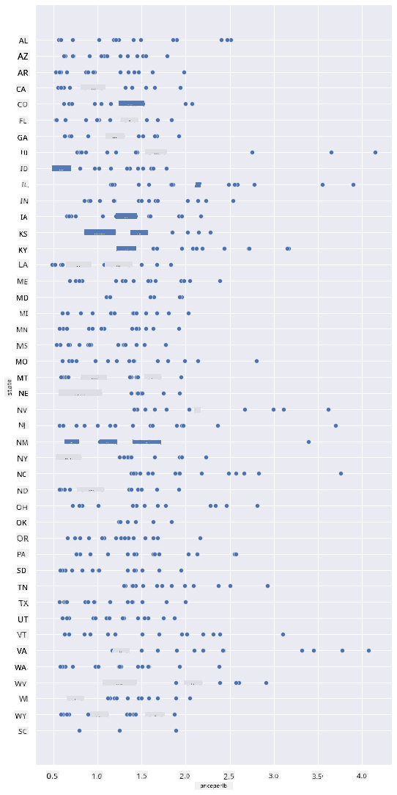
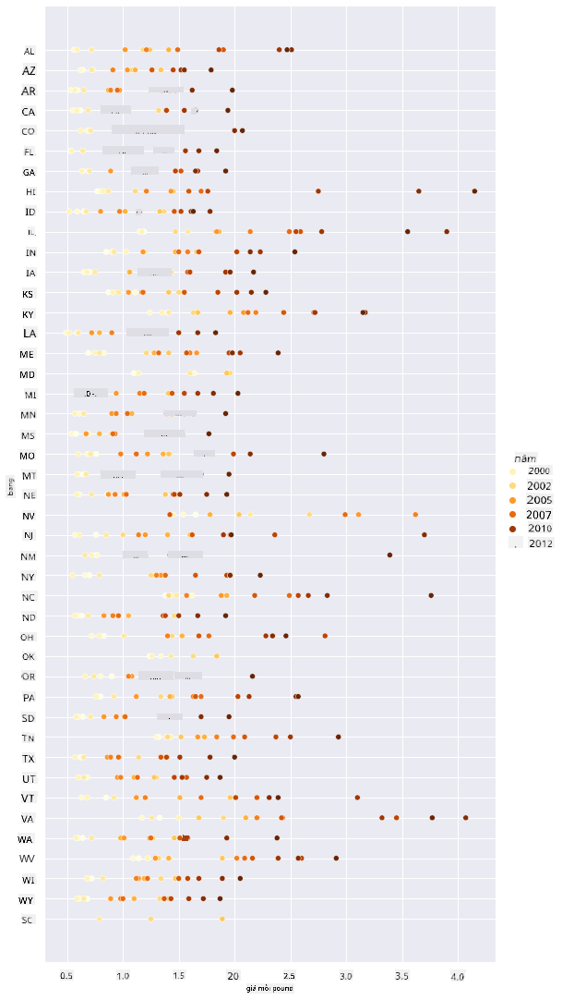
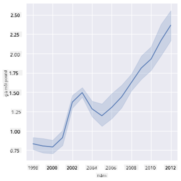
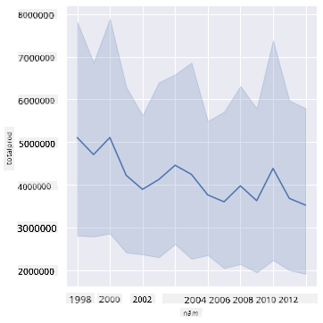
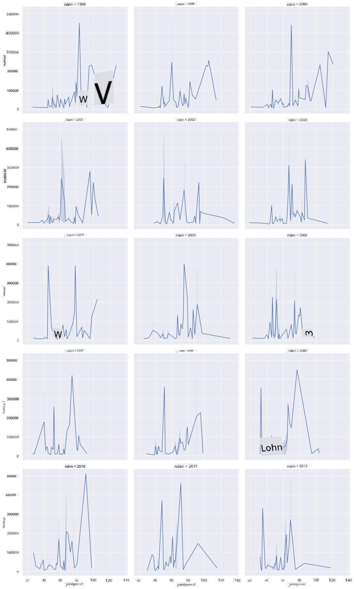
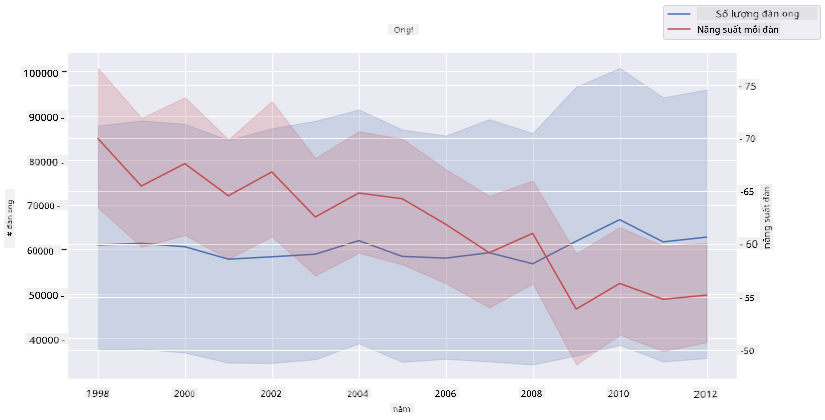

<!--
CO_OP_TRANSLATOR_METADATA:
{
  "original_hash": "b29e427401499e81f4af55a8c4afea76",
  "translation_date": "2025-09-04T20:26:49+00:00",
  "source_file": "3-Data-Visualization/12-visualization-relationships/README.md",
  "language_code": "vi"
}
-->
# Hình dung Mối quan hệ: Tất cả về Mật ong 🍯

| ](../../sketchnotes/12-Visualizing-Relationships.png)|
|:---:|
|Hình dung Mối quan hệ - _Sketchnote của [@nitya](https://twitter.com/nitya)_ |

Tiếp tục với chủ đề thiên nhiên trong nghiên cứu của chúng ta, hãy khám phá các cách hình dung thú vị để thể hiện mối quan hệ giữa các loại mật ong khác nhau, dựa trên một tập dữ liệu từ [Bộ Nông nghiệp Hoa Kỳ](https://www.nass.usda.gov/About_NASS/index.php).

Tập dữ liệu này gồm khoảng 600 mục, hiển thị sản lượng mật ong ở nhiều bang của Hoa Kỳ. Ví dụ, bạn có thể xem số lượng đàn ong, sản lượng mỗi đàn, tổng sản lượng, tồn kho, giá mỗi pound và giá trị của mật ong được sản xuất tại một bang từ năm 1998-2012, với mỗi hàng tương ứng với một năm cho từng bang.

Sẽ rất thú vị khi hình dung mối quan hệ giữa sản lượng hàng năm của một bang và, chẳng hạn, giá mật ong tại bang đó. Hoặc, bạn có thể hình dung mối quan hệ giữa sản lượng mật ong mỗi đàn của các bang. Khoảng thời gian này bao gồm sự kiện 'CCD' hay 'Hội chứng Sụp đổ Đàn ong' lần đầu tiên được ghi nhận vào năm 2006 (http://npic.orst.edu/envir/ccd.html), vì vậy đây là một tập dữ liệu đáng để nghiên cứu. 🐝

## [Câu hỏi trước bài giảng](https://purple-hill-04aebfb03.1.azurestaticapps.net/quiz/22)

Trong bài học này, bạn có thể sử dụng thư viện Seaborn, mà bạn đã sử dụng trước đó, như một công cụ tốt để hình dung mối quan hệ giữa các biến. Đặc biệt thú vị là việc sử dụng hàm `relplot` của Seaborn, cho phép tạo biểu đồ phân tán và biểu đồ đường để nhanh chóng hình dung '[mối quan hệ thống kê](https://seaborn.pydata.org/tutorial/relational.html?highlight=relationships)', giúp nhà khoa học dữ liệu hiểu rõ hơn cách các biến liên quan đến nhau.

## Biểu đồ phân tán

Sử dụng biểu đồ phân tán để hiển thị cách giá mật ong thay đổi theo từng năm, từng bang. Seaborn, với `relplot`, thuận tiện nhóm dữ liệu theo bang và hiển thị các điểm dữ liệu cho cả dữ liệu phân loại và số.

Hãy bắt đầu bằng cách nhập dữ liệu và thư viện Seaborn:

```python
import pandas as pd
import matplotlib.pyplot as plt
import seaborn as sns
honey = pd.read_csv('../../data/honey.csv')
honey.head()
```
Bạn sẽ nhận thấy rằng dữ liệu mật ong có một số cột thú vị, bao gồm năm và giá mỗi pound. Hãy khám phá dữ liệu này, được nhóm theo các bang của Hoa Kỳ:

| state | numcol | yieldpercol | totalprod | stocks   | priceperlb | prodvalue | year |
| ----- | ------ | ----------- | --------- | -------- | ---------- | --------- | ---- |
| AL    | 16000  | 71          | 1136000   | 159000   | 0.72       | 818000    | 1998 |
| AZ    | 55000  | 60          | 3300000   | 1485000  | 0.64       | 2112000   | 1998 |
| AR    | 53000  | 65          | 3445000   | 1688000  | 0.59       | 2033000   | 1998 |
| CA    | 450000 | 83          | 37350000  | 12326000 | 0.62       | 23157000  | 1998 |
| CO    | 27000  | 72          | 1944000   | 1594000  | 0.7        | 1361000   | 1998 |

Tạo một biểu đồ phân tán cơ bản để hiển thị mối quan hệ giữa giá mỗi pound mật ong và bang xuất xứ của nó. Làm cho trục `y` đủ cao để hiển thị tất cả các bang:

```python
sns.relplot(x="priceperlb", y="state", data=honey, height=15, aspect=.5);
```


Bây giờ, hiển thị cùng dữ liệu với bảng màu mật ong để thể hiện cách giá thay đổi qua các năm. Bạn có thể làm điều này bằng cách thêm tham số 'hue' để hiển thị sự thay đổi theo từng năm:

> ✅ Tìm hiểu thêm về [bảng màu bạn có thể sử dụng trong Seaborn](https://seaborn.pydata.org/tutorial/color_palettes.html) - thử một bảng màu cầu vồng đẹp mắt!

```python
sns.relplot(x="priceperlb", y="state", hue="year", palette="YlOrBr", data=honey, height=15, aspect=.5);
```


Với sự thay đổi bảng màu này, bạn có thể thấy rõ ràng rằng có một sự tăng trưởng mạnh mẽ qua các năm về giá mật ong mỗi pound. Thực tế, nếu bạn xem xét một tập dữ liệu mẫu để kiểm chứng (chọn một bang cụ thể, chẳng hạn Arizona), bạn có thể thấy một xu hướng tăng giá qua từng năm, với một vài ngoại lệ:

| state | numcol | yieldpercol | totalprod | stocks  | priceperlb | prodvalue | year |
| ----- | ------ | ----------- | --------- | ------- | ---------- | --------- | ---- |
| AZ    | 55000  | 60          | 3300000   | 1485000 | 0.64       | 2112000   | 1998 |
| AZ    | 52000  | 62          | 3224000   | 1548000 | 0.62       | 1999000   | 1999 |
| AZ    | 40000  | 59          | 2360000   | 1322000 | 0.73       | 1723000   | 2000 |
| AZ    | 43000  | 59          | 2537000   | 1142000 | 0.72       | 1827000   | 2001 |
| AZ    | 38000  | 63          | 2394000   | 1197000 | 1.08       | 2586000   | 2002 |
| AZ    | 35000  | 72          | 2520000   | 983000  | 1.34       | 3377000   | 2003 |
| AZ    | 32000  | 55          | 1760000   | 774000  | 1.11       | 1954000   | 2004 |
| AZ    | 36000  | 50          | 1800000   | 720000  | 1.04       | 1872000   | 2005 |
| AZ    | 30000  | 65          | 1950000   | 839000  | 0.91       | 1775000   | 2006 |
| AZ    | 30000  | 64          | 1920000   | 902000  | 1.26       | 2419000   | 2007 |
| AZ    | 25000  | 64          | 1600000   | 336000  | 1.26       | 2016000   | 2008 |
| AZ    | 20000  | 52          | 1040000   | 562000  | 1.45       | 1508000   | 2009 |
| AZ    | 24000  | 77          | 1848000   | 665000  | 1.52       | 2809000   | 2010 |
| AZ    | 23000  | 53          | 1219000   | 427000  | 1.55       | 1889000   | 2011 |
| AZ    | 22000  | 46          | 1012000   | 253000  | 1.79       | 1811000   | 2012 |

Một cách khác để hình dung sự tiến triển này là sử dụng kích thước thay vì màu sắc. Đối với người dùng bị mù màu, đây có thể là một lựa chọn tốt hơn. Chỉnh sửa hình dung của bạn để hiển thị sự tăng giá bằng cách tăng chu vi của các điểm:

```python
sns.relplot(x="priceperlb", y="state", size="year", data=honey, height=15, aspect=.5);
```
Bạn có thể thấy kích thước của các điểm tăng dần.


Liệu đây có phải là một trường hợp đơn giản của cung và cầu? Do các yếu tố như biến đổi khí hậu và sự sụp đổ của đàn ong, liệu có ít mật ong hơn để mua qua từng năm, và do đó giá tăng lên?

Để khám phá mối tương quan giữa một số biến trong tập dữ liệu này, hãy cùng tìm hiểu một số biểu đồ đường.

## Biểu đồ đường

Câu hỏi: Liệu có sự tăng giá rõ ràng của mật ong mỗi pound qua từng năm không? Bạn có thể dễ dàng khám phá điều này bằng cách tạo một biểu đồ đường đơn:

```python
sns.relplot(x="year", y="priceperlb", kind="line", data=honey);
```
Trả lời: Có, với một số ngoại lệ vào khoảng năm 2003:



✅ Vì Seaborn đang tổng hợp dữ liệu xung quanh một đường, nó hiển thị "các phép đo lặp lại tại mỗi giá trị x bằng cách vẽ trung bình và khoảng tin cậy 95% xung quanh trung bình". [Nguồn](https://seaborn.pydata.org/tutorial/relational.html). Hành vi tốn thời gian này có thể bị vô hiệu hóa bằng cách thêm `ci=None`.

Câu hỏi: Vậy, vào năm 2003, liệu chúng ta có thể thấy sự tăng đột biến trong nguồn cung mật ong không? Điều gì sẽ xảy ra nếu bạn xem xét tổng sản lượng qua từng năm?

```python
sns.relplot(x="year", y="totalprod", kind="line", data=honey);
```



Trả lời: Không hẳn. Nếu bạn nhìn vào tổng sản lượng, thực tế nó dường như đã tăng lên trong năm đó, mặc dù nhìn chung lượng mật ong được sản xuất đang giảm trong những năm này.

Câu hỏi: Trong trường hợp đó, điều gì có thể đã gây ra sự tăng giá mật ong vào khoảng năm 2003?

Để khám phá điều này, bạn có thể sử dụng một lưới phân mảnh.

## Lưới phân mảnh

Lưới phân mảnh lấy một khía cạnh của tập dữ liệu của bạn (trong trường hợp này, bạn có thể chọn 'năm' để tránh tạo ra quá nhiều phân mảnh). Seaborn sau đó có thể tạo một biểu đồ cho mỗi phân mảnh của các tọa độ x và y bạn chọn để so sánh dễ dàng hơn. Liệu năm 2003 có nổi bật trong loại so sánh này?

Tạo một lưới phân mảnh bằng cách tiếp tục sử dụng `relplot` như được khuyến nghị bởi [tài liệu của Seaborn](https://seaborn.pydata.org/generated/seaborn.FacetGrid.html?highlight=facetgrid#seaborn.FacetGrid).

```python
sns.relplot(
    data=honey, 
    x="yieldpercol", y="numcol",
    col="year", 
    col_wrap=3,
    kind="line"
```
Trong hình dung này, bạn có thể so sánh sản lượng mỗi đàn và số lượng đàn ong qua từng năm, cạnh nhau với số cột được đặt là 3:



Đối với tập dữ liệu này, không có điều gì đặc biệt nổi bật liên quan đến số lượng đàn ong và sản lượng của chúng, qua từng năm và từng bang. Liệu có cách nào khác để tìm mối tương quan giữa hai biến này?

## Biểu đồ đường kép

Thử một biểu đồ đa đường bằng cách chồng hai biểu đồ đường lên nhau, sử dụng `despine` của Seaborn để loại bỏ các cạnh trên và phải, và sử dụng `ax.twinx` [dựa trên Matplotlib](https://matplotlib.org/stable/api/_as_gen/matplotlib.axes.Axes.twinx.html). Twinx cho phép một biểu đồ chia sẻ trục x và hiển thị hai trục y. Vì vậy, hiển thị sản lượng mỗi đàn và số lượng đàn ong, chồng lên nhau:

```python
fig, ax = plt.subplots(figsize=(12,6))
lineplot = sns.lineplot(x=honey['year'], y=honey['numcol'], data=honey, 
                        label = 'Number of bee colonies', legend=False)
sns.despine()
plt.ylabel('# colonies')
plt.title('Honey Production Year over Year');

ax2 = ax.twinx()
lineplot2 = sns.lineplot(x=honey['year'], y=honey['yieldpercol'], ax=ax2, color="r", 
                         label ='Yield per colony', legend=False) 
sns.despine(right=False)
plt.ylabel('colony yield')
ax.figure.legend();
```


Mặc dù không có điều gì nổi bật vào khoảng năm 2003, nhưng điều này cho phép chúng ta kết thúc bài học với một ghi chú tích cực hơn: mặc dù số lượng đàn ong đang giảm dần, nhưng số lượng đàn ong đang ổn định ngay cả khi sản lượng mỗi đàn đang giảm.

Cố lên, ong ơi! 🐝❤️

## 🚀 Thử thách

Trong bài học này, bạn đã học thêm về các cách sử dụng khác của biểu đồ phân tán và lưới phân mảnh, bao gồm cả lưới phân mảnh. Thử thách bản thân bằng cách tạo một lưới phân mảnh sử dụng một tập dữ liệu khác, có thể là một tập dữ liệu bạn đã sử dụng trước đó trong các bài học này. Lưu ý thời gian tạo và cần cẩn thận như thế nào về số lượng lưới bạn cần vẽ bằng các kỹ thuật này.

## [Câu hỏi sau bài giảng](https://ff-quizzes.netlify.app/en/ds/)

## Ôn tập & Tự học

Biểu đồ đường có thể đơn giản hoặc khá phức tạp. Hãy đọc thêm trong [tài liệu của Seaborn](https://seaborn.pydata.org/generated/seaborn.lineplot.html) về các cách khác nhau bạn có thể xây dựng chúng. Thử cải thiện các biểu đồ đường bạn đã tạo trong bài học này bằng các phương pháp khác được liệt kê trong tài liệu.

## Bài tập

[Khám phá tổ ong](assignment.md)

---

**Tuyên bố miễn trừ trách nhiệm**:  
Tài liệu này đã được dịch bằng dịch vụ dịch thuật AI [Co-op Translator](https://github.com/Azure/co-op-translator). Mặc dù chúng tôi cố gắng đảm bảo độ chính xác, xin lưu ý rằng các bản dịch tự động có thể chứa lỗi hoặc không chính xác. Tài liệu gốc bằng ngôn ngữ bản địa nên được coi là nguồn thông tin chính thức. Đối với các thông tin quan trọng, khuyến nghị sử dụng dịch vụ dịch thuật chuyên nghiệp bởi con người. Chúng tôi không chịu trách nhiệm cho bất kỳ sự hiểu lầm hoặc diễn giải sai nào phát sinh từ việc sử dụng bản dịch này.