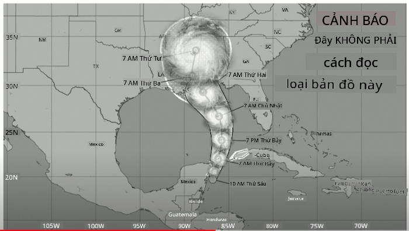
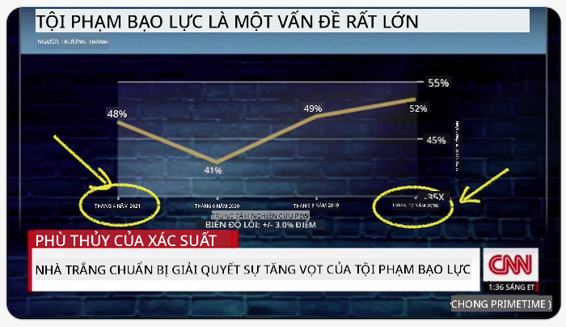
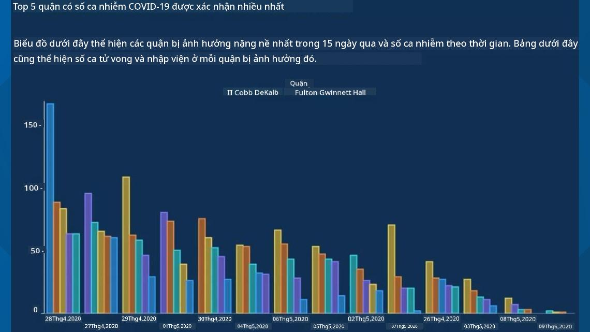
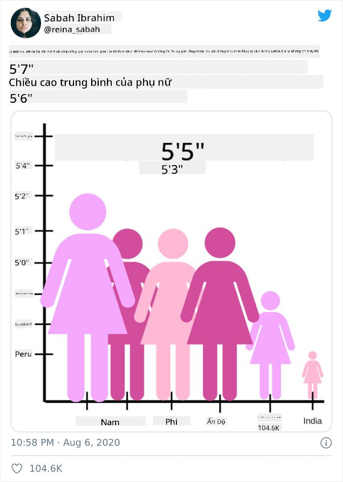
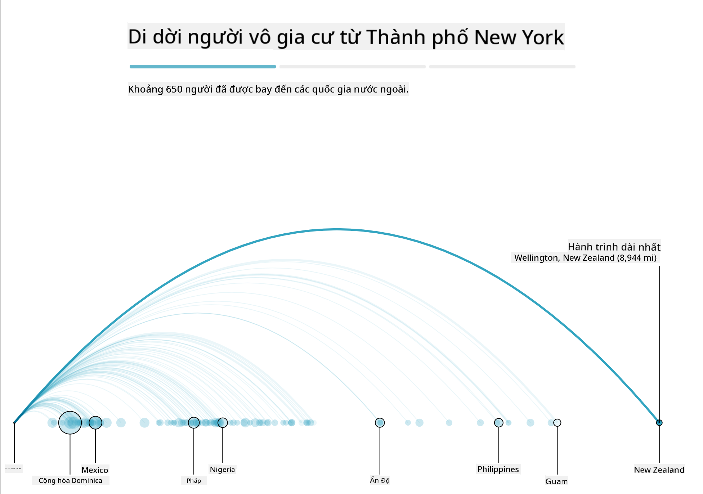
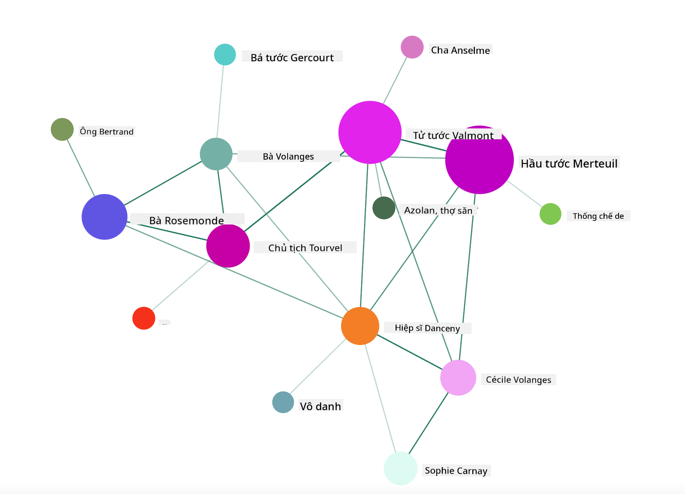

<!--
CO_OP_TRANSLATOR_METADATA:
{
  "original_hash": "0b380bb6d34102bb061eb41de23d9834",
  "translation_date": "2025-09-04T20:26:17+00:00",
  "source_file": "3-Data-Visualization/13-meaningful-visualizations/README.md",
  "language_code": "vi"
}
-->
# Tạo các hình ảnh trực quan có ý nghĩa

| ](../../sketchnotes/13-MeaningfulViz.png)|
|:---:|
| Hình ảnh trực quan có ý nghĩa - _Sketchnote bởi [@nitya](https://twitter.com/nitya)_ |

> "Nếu bạn tra tấn dữ liệu đủ lâu, nó sẽ thú nhận bất cứ điều gì" -- [Ronald Coase](https://en.wikiquote.org/wiki/Ronald_Coase)

Một trong những kỹ năng cơ bản của nhà khoa học dữ liệu là khả năng tạo ra hình ảnh trực quan có ý nghĩa, giúp trả lời các câu hỏi mà bạn có thể có. Trước khi trực quan hóa dữ liệu, bạn cần đảm bảo rằng dữ liệu đã được làm sạch và chuẩn bị, như bạn đã làm trong các bài học trước. Sau đó, bạn có thể bắt đầu quyết định cách tốt nhất để trình bày dữ liệu.

Trong bài học này, bạn sẽ xem xét:

1. Cách chọn loại biểu đồ phù hợp
2. Cách tránh biểu đồ gây hiểu lầm
3. Cách làm việc với màu sắc
4. Cách định dạng biểu đồ để dễ đọc
5. Cách tạo giải pháp biểu đồ động hoặc 3D
6. Cách tạo hình ảnh trực quan sáng tạo

## [Quiz trước bài học](https://purple-hill-04aebfb03.1.azurestaticapps.net/quiz/24)

## Chọn loại biểu đồ phù hợp

Trong các bài học trước, bạn đã thử nghiệm tạo nhiều hình ảnh trực quan thú vị bằng cách sử dụng Matplotlib và Seaborn để vẽ biểu đồ. Nhìn chung, bạn có thể chọn [loại biểu đồ phù hợp](https://chartio.com/learn/charts/how-to-select-a-data-vizualization/) cho câu hỏi bạn đang đặt ra bằng cách sử dụng bảng sau:

| Bạn cần:                   | Bạn nên sử dụng:                |
| -------------------------- | ------------------------------- |
| Hiển thị xu hướng dữ liệu theo thời gian | Đường kẻ                        |
| So sánh các danh mục       | Cột, Tròn                       |
| So sánh tổng số            | Tròn, Cột xếp chồng             |
| Hiển thị mối quan hệ       | Tán xạ, Đường kẻ, Facet, Đường kép |
| Hiển thị phân phối         | Tán xạ, Biểu đồ tần suất, Hộp   |
| Hiển thị tỷ lệ             | Tròn, Donut, Waffle             |

> ✅ Tùy thuộc vào cấu trúc dữ liệu của bạn, bạn có thể cần chuyển đổi dữ liệu từ dạng văn bản sang dạng số để biểu đồ hỗ trợ.

## Tránh gây hiểu lầm

Ngay cả khi nhà khoa học dữ liệu cẩn thận chọn biểu đồ phù hợp với dữ liệu, vẫn có nhiều cách để dữ liệu được hiển thị nhằm chứng minh một quan điểm, thường làm mất đi tính chính xác của dữ liệu. Có rất nhiều ví dụ về biểu đồ và đồ họa thông tin gây hiểu lầm!

[](https://www.youtube.com/watch?v=oX74Nge8Wkw "How charts lie")

> 🎥 Nhấp vào hình ảnh trên để xem một bài nói chuyện hội nghị về biểu đồ gây hiểu lầm

Biểu đồ này đảo ngược trục X để hiển thị điều ngược lại với sự thật, dựa trên ngày tháng:



[Biểu đồ này](https://media.firstcoastnews.com/assets/WTLV/images/170ae16f-4643-438f-b689-50d66ca6a8d8/170ae16f-4643-438f-b689-50d66ca6a8d8_1140x641.jpg) thậm chí còn gây hiểu lầm hơn, vì mắt bị thu hút về phía bên phải để kết luận rằng, theo thời gian, số ca COVID đã giảm ở các quận. Thực tế, nếu bạn nhìn kỹ vào ngày tháng, bạn sẽ thấy chúng đã được sắp xếp lại để tạo ra xu hướng giảm giả.



Ví dụ nổi tiếng này sử dụng màu sắc VÀ trục Y bị đảo ngược để gây hiểu lầm: thay vì kết luận rằng số ca tử vong do súng tăng vọt sau khi thông qua luật thân thiện với súng, thực tế mắt bị đánh lừa để nghĩ rằng điều ngược lại là đúng:


Biểu đồ kỳ lạ này cho thấy cách tỷ lệ có thể bị thao túng, tạo hiệu ứng hài hước:



So sánh những thứ không thể so sánh là một thủ thuật mờ ám khác. Có một [trang web tuyệt vời](https://tylervigen.com/spurious-correlations) về 'mối tương quan giả' hiển thị 'sự thật' liên quan đến những thứ như tỷ lệ ly hôn ở Maine và mức tiêu thụ bơ thực vật. Một nhóm Reddit cũng thu thập [các cách sử dụng xấu xí](https://www.reddit.com/r/dataisugly/top/?t=all) của dữ liệu.

Điều quan trọng là phải hiểu cách mắt dễ bị đánh lừa bởi các biểu đồ gây hiểu lầm. Ngay cả khi ý định của nhà khoa học dữ liệu là tốt, việc chọn loại biểu đồ không phù hợp, chẳng hạn như biểu đồ tròn hiển thị quá nhiều danh mục, cũng có thể gây hiểu lầm.

## Màu sắc

Bạn đã thấy trong biểu đồ 'bạo lực súng ở Florida' ở trên cách màu sắc có thể cung cấp một lớp ý nghĩa bổ sung cho biểu đồ, đặc biệt là những biểu đồ không được thiết kế bằng các thư viện như Matplotlib và Seaborn, vốn đi kèm với các thư viện màu sắc và bảng màu đã được kiểm chứng. Nếu bạn đang tạo biểu đồ bằng tay, hãy nghiên cứu một chút về [lý thuyết màu sắc](https://colormatters.com/color-and-design/basic-color-theory)

> ✅ Hãy lưu ý, khi thiết kế biểu đồ, rằng khả năng tiếp cận là một khía cạnh quan trọng của hình ảnh trực quan. Một số người dùng của bạn có thể bị mù màu - liệu biểu đồ của bạn có hiển thị tốt cho người dùng bị khiếm thị không?

Hãy cẩn thận khi chọn màu sắc cho biểu đồ của bạn, vì màu sắc có thể truyền tải ý nghĩa mà bạn không mong muốn. 'Các quý cô màu hồng' trong biểu đồ 'chiều cao' ở trên truyền tải một ý nghĩa 'nữ tính' rõ ràng, làm tăng thêm sự kỳ lạ của chính biểu đồ.

Mặc dù [ý nghĩa màu sắc](https://colormatters.com/color-symbolism/the-meanings-of-colors) có thể khác nhau ở các vùng khác nhau trên thế giới và có xu hướng thay đổi ý nghĩa theo sắc thái của chúng. Nói chung, ý nghĩa màu sắc bao gồm:

| Màu sắc | Ý nghĩa             |
| ------- | ------------------- |
| đỏ      | quyền lực           |
| xanh    | tin tưởng, trung thành |
| vàng    | hạnh phúc, cảnh báo |
| xanh lá | sinh thái, may mắn, ghen tị |
| tím     | hạnh phúc           |
| cam     | sống động           |

Nếu bạn được giao nhiệm vụ tạo biểu đồ với màu sắc tùy chỉnh, hãy đảm bảo rằng biểu đồ của bạn vừa dễ tiếp cận vừa phù hợp với ý nghĩa mà bạn đang cố gắng truyền tải.

## Định dạng biểu đồ để dễ đọc

Biểu đồ không có ý nghĩa nếu chúng không dễ đọc! Hãy dành một chút thời gian để xem xét việc định dạng chiều rộng và chiều cao của biểu đồ để phù hợp với dữ liệu của bạn. Nếu một biến (chẳng hạn như tất cả 50 tiểu bang) cần được hiển thị, hãy hiển thị chúng theo chiều dọc trên trục Y nếu có thể để tránh biểu đồ cuộn ngang.

Gắn nhãn các trục của bạn, cung cấp chú giải nếu cần thiết và cung cấp các chú giải công cụ để hiểu dữ liệu tốt hơn.

Nếu dữ liệu của bạn là văn bản và dài dòng trên trục X, bạn có thể xoay góc văn bản để dễ đọc hơn. [Matplotlib](https://matplotlib.org/stable/tutorials/toolkits/mplot3d.html) cung cấp khả năng vẽ 3D, nếu dữ liệu của bạn hỗ trợ. Các hình ảnh trực quan phức tạp có thể được tạo bằng `mpl_toolkits.mplot3d`.


## Hiển thị biểu đồ động và 3D

Một số hình ảnh trực quan dữ liệu tốt nhất hiện nay là động. Shirley Wu có những hình ảnh tuyệt vời được thực hiện với D3, chẳng hạn như '[film flowers](http://bl.ocks.org/sxywu/raw/d612c6c653fb8b4d7ff3d422be164a5d/)', nơi mỗi bông hoa là một hình ảnh trực quan của một bộ phim. Một ví dụ khác cho Guardian là 'bussed out', một trải nghiệm tương tác kết hợp hình ảnh trực quan với Greensock và D3 cùng với định dạng bài viết cuộn để hiển thị cách NYC xử lý vấn đề người vô gia cư bằng cách đưa họ ra khỏi thành phố.



> "Bussed Out: How America Moves its Homeless" từ [the Guardian](https://www.theguardian.com/us-news/ng-interactive/2017/dec/20/bussed-out-america-moves-homeless-people-country-study). Hình ảnh trực quan bởi Nadieh Bremer & Shirley Wu

Mặc dù bài học này không đủ để đi sâu vào việc dạy các thư viện hình ảnh trực quan mạnh mẽ này, hãy thử sử dụng D3 trong một ứng dụng Vue.js bằng cách sử dụng một thư viện để hiển thị hình ảnh trực quan của cuốn sách "Dangerous Liaisons" dưới dạng mạng xã hội động.

> "Les Liaisons Dangereuses" là một tiểu thuyết viết dưới dạng thư từ, hoặc một tiểu thuyết được trình bày dưới dạng một loạt các lá thư. Được viết vào năm 1782 bởi Choderlos de Laclos, nó kể câu chuyện về những mưu đồ xã hội độc ác và vô đạo đức của hai nhân vật chính đối đầu nhau thuộc tầng lớp quý tộc Pháp cuối thế kỷ 18, Vicomte de Valmont và Marquise de Merteuil. Cả hai đều gặp kết cục bi thảm nhưng không phải trước khi gây ra rất nhiều tổn thất xã hội. Tiểu thuyết diễn ra dưới dạng một loạt các lá thư được viết cho nhiều người trong vòng tròn của họ, lên kế hoạch trả thù hoặc đơn giản là gây rắc rối. Tạo một hình ảnh trực quan về những lá thư này để khám phá các nhân vật chính của câu chuyện, một cách trực quan.

Bạn sẽ hoàn thành một ứng dụng web hiển thị một cái nhìn động về mạng xã hội này. Nó sử dụng một thư viện được xây dựng để tạo [hình ảnh trực quan của một mạng](https://github.com/emiliorizzo/vue-d3-network) bằng Vue.js và D3. Khi ứng dụng đang chạy, bạn có thể kéo các nút xung quanh màn hình để xáo trộn dữ liệu.



## Dự án: Tạo biểu đồ hiển thị mạng bằng D3.js

> Thư mục bài học này bao gồm một thư mục `solution` nơi bạn có thể tìm thấy dự án hoàn chỉnh để tham khảo.

1. Làm theo hướng dẫn trong tệp README.md ở thư mục gốc của thư mục starter. Đảm bảo rằng bạn đã cài đặt NPM và Node.js trên máy của mình trước khi cài đặt các phụ thuộc của dự án.

2. Mở thư mục `starter/src`. Bạn sẽ thấy một thư mục `assets` nơi bạn có thể tìm thấy tệp .json chứa tất cả các lá thư từ tiểu thuyết, được đánh số, với chú thích 'to' và 'from'.

3. Hoàn thành mã trong `components/Nodes.vue` để kích hoạt hình ảnh trực quan. Tìm phương thức có tên `createLinks()` và thêm vòng lặp lồng nhau sau.

Duyệt qua đối tượng .json để lấy dữ liệu 'to' và 'from' cho các lá thư và xây dựng đối tượng `links` để thư viện hình ảnh trực quan có thể sử dụng:

```javascript
//loop through letters
      let f = 0;
      let t = 0;
      for (var i = 0; i < letters.length; i++) {
          for (var j = 0; j < characters.length; j++) {
              
            if (characters[j] == letters[i].from) {
              f = j;
            }
            if (characters[j] == letters[i].to) {
              t = j;
            }
        }
        this.links.push({ sid: f, tid: t });
      }
  ```

Chạy ứng dụng của bạn từ terminal (npm run serve) và tận hưởng hình ảnh trực quan!

## 🚀 Thử thách

Khám phá internet để tìm các hình ảnh trực quan gây hiểu lầm. Tác giả đã đánh lừa người dùng như thế nào, và điều đó có phải là cố ý không? Hãy thử chỉnh sửa các hình ảnh trực quan để hiển thị cách chúng nên trông như thế nào.

## [Quiz sau bài học](https://ff-quizzes.netlify.app/en/ds/)

## Ôn tập & Tự học

Dưới đây là một số bài viết để đọc về hình ảnh trực quan dữ liệu gây hiểu lầm:

https://gizmodo.com/how-to-lie-with-data-visualization-1563576606

http://ixd.prattsi.org/2017/12/visual-lies-usability-in-deceptive-data-visualizations/

Xem các hình ảnh trực quan thú vị về tài sản và hiện vật lịch sử:

https://handbook.pubpub.org/

Xem qua bài viết này về cách hoạt hình có thể nâng cao hình ảnh trực quan của bạn:

https://medium.com/@EvanSinar/use-animation-to-supercharge-data-visualization-cd905a882ad4

## Bài tập

[Tự tạo hình ảnh trực quan tùy chỉnh](assignment.md)

---

**Tuyên bố miễn trừ trách nhiệm**:  
Tài liệu này đã được dịch bằng dịch vụ dịch thuật AI [Co-op Translator](https://github.com/Azure/co-op-translator). Mặc dù chúng tôi cố gắng đảm bảo độ chính xác, xin lưu ý rằng các bản dịch tự động có thể chứa lỗi hoặc sự không chính xác. Tài liệu gốc bằng ngôn ngữ bản địa nên được coi là nguồn tham khảo chính thức. Đối với các thông tin quan trọng, nên sử dụng dịch vụ dịch thuật chuyên nghiệp từ con người. Chúng tôi không chịu trách nhiệm cho bất kỳ sự hiểu lầm hoặc diễn giải sai nào phát sinh từ việc sử dụng bản dịch này.