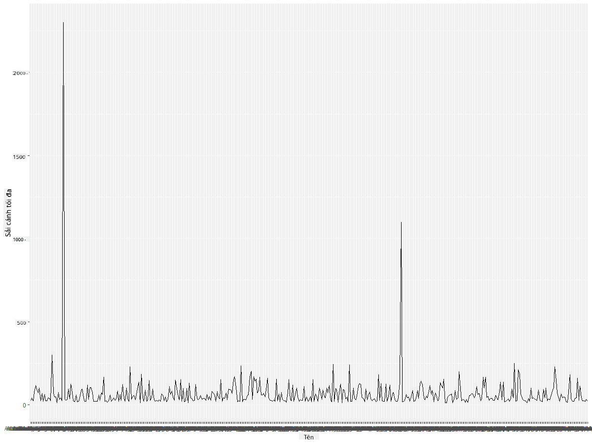
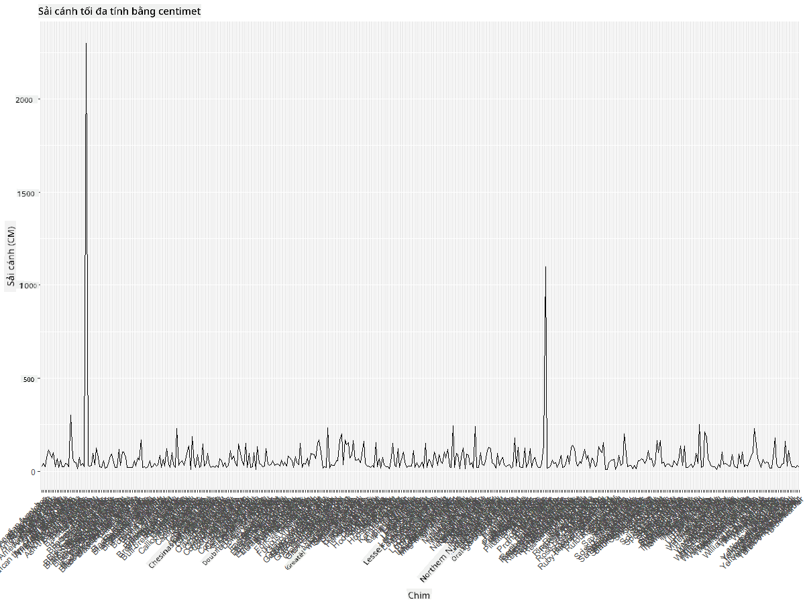
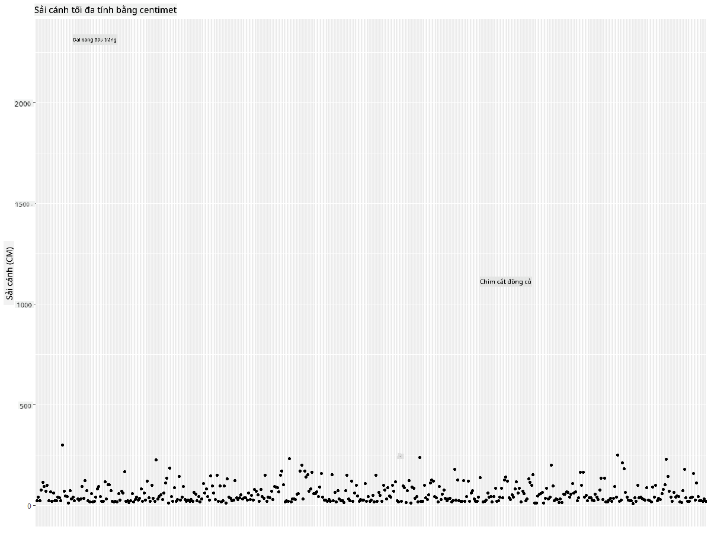
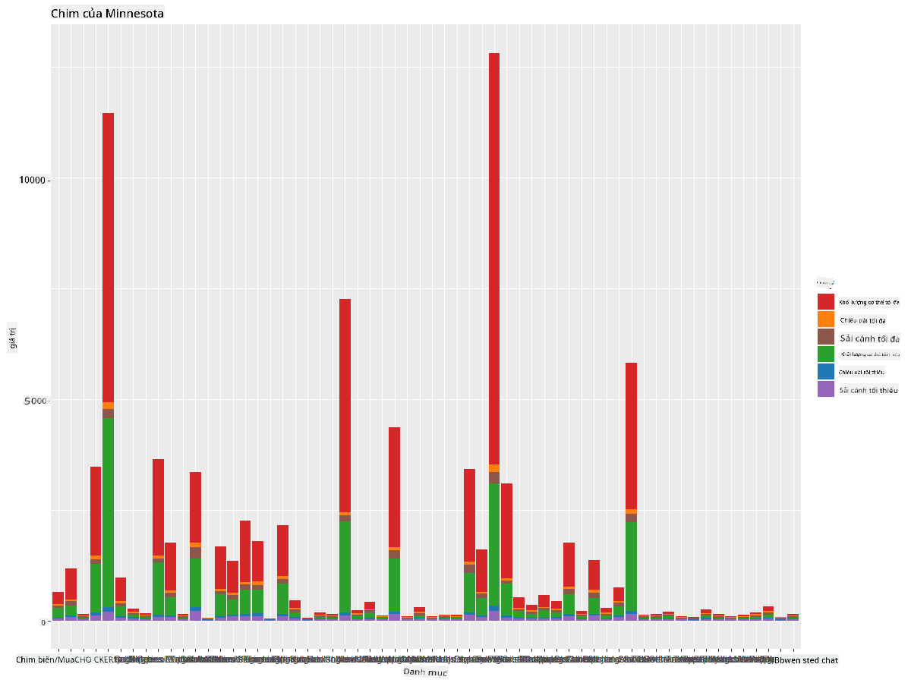
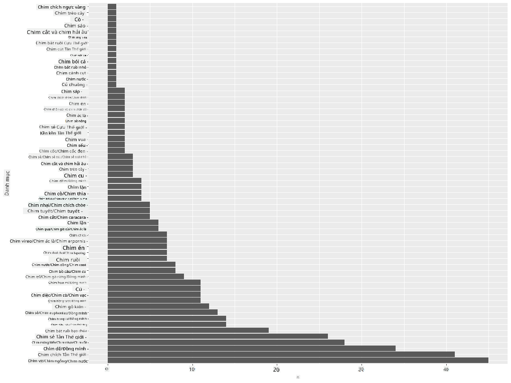
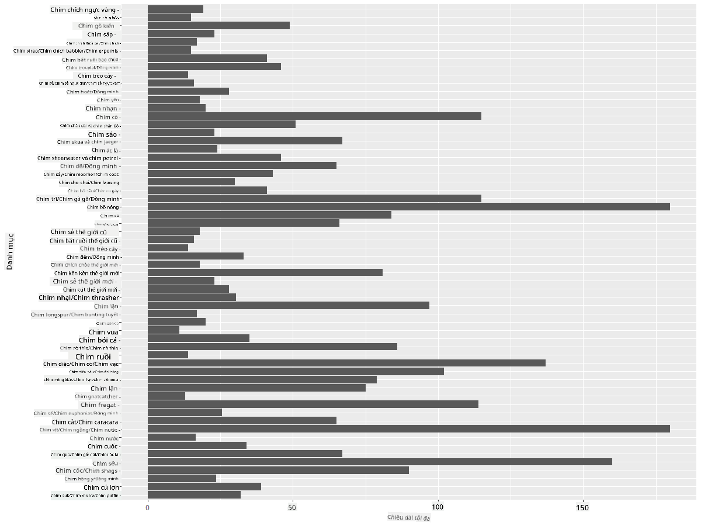
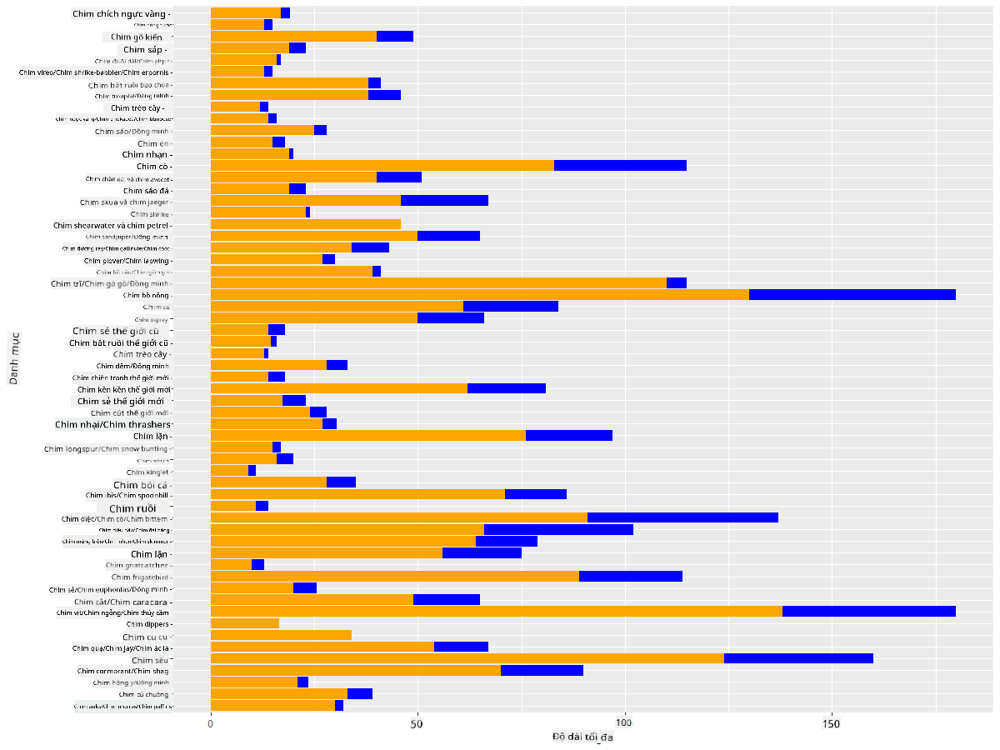

<!--
CO_OP_TRANSLATOR_METADATA:
{
  "original_hash": "22acf28f518a4769ea14fa42f4734b9f",
  "translation_date": "2025-08-28T18:30:36+00:00",
  "source_file": "3-Data-Visualization/R/09-visualization-quantities/README.md",
  "language_code": "vi"
}
-->
# Trực quan hóa số lượng
| ](https://github.com/microsoft/Data-Science-For-Beginners/blob/main/sketchnotes/09-Visualizing-Quantities.png)|
|:---:|
| Trực quan hóa số lượng - _Sketchnote của [@nitya](https://twitter.com/nitya)_ |

Trong bài học này, bạn sẽ khám phá cách sử dụng một số thư viện R có sẵn để học cách tạo ra các biểu đồ thú vị xoay quanh khái niệm về số lượng. Sử dụng một tập dữ liệu đã được làm sạch về các loài chim ở Minnesota, bạn có thể tìm hiểu nhiều thông tin thú vị về động vật hoang dã địa phương.  
## [Câu hỏi trước bài học](https://purple-hill-04aebfb03.1.azurestaticapps.net/quiz/16)

## Quan sát sải cánh với ggplot2
Một thư viện tuyệt vời để tạo cả biểu đồ đơn giản và phức tạp thuộc nhiều loại khác nhau là [ggplot2](https://cran.r-project.org/web/packages/ggplot2/index.html). Nói chung, quá trình vẽ biểu đồ bằng các thư viện này bao gồm việc xác định các phần của dataframe mà bạn muốn nhắm đến, thực hiện các phép biến đổi cần thiết trên dữ liệu, gán giá trị cho trục x và y, quyết định loại biểu đồ cần hiển thị, và sau đó hiển thị biểu đồ.

`ggplot2` là một hệ thống tạo đồ họa theo cách khai báo, dựa trên The Grammar of Graphics. [Grammar of Graphics](https://en.wikipedia.org/wiki/Ggplot2) là một sơ đồ tổng quát cho việc trực quan hóa dữ liệu, chia nhỏ biểu đồ thành các thành phần ngữ nghĩa như thang đo và lớp. Nói cách khác, sự dễ dàng trong việc tạo biểu đồ cho dữ liệu đơn biến hoặc đa biến với ít mã lệnh khiến `ggplot2` trở thành gói phổ biến nhất được sử dụng để trực quan hóa trong R. Người dùng chỉ cần nói cho `ggplot2` biết cách ánh xạ các biến vào các yếu tố thẩm mỹ, các hình dạng đồ họa cần sử dụng, và `ggplot2` sẽ lo phần còn lại.

> ✅ Biểu đồ = Dữ liệu + Thẩm mỹ + Hình học  
> - Dữ liệu: tập dữ liệu  
> - Thẩm mỹ: các biến cần nghiên cứu (biến x và y)  
> - Hình học: loại biểu đồ (biểu đồ đường, biểu đồ cột, v.v.)

Hãy chọn hình học (loại biểu đồ) phù hợp nhất với dữ liệu của bạn và câu chuyện bạn muốn kể qua biểu đồ.

> - Để phân tích xu hướng: đường, cột  
> - Để so sánh giá trị: cột, thanh, tròn, scatterplot  
> - Để thể hiện mối quan hệ giữa các phần và tổng thể: tròn  
> - Để thể hiện phân phối dữ liệu: scatterplot, cột  
> - Để thể hiện mối quan hệ giữa các giá trị: đường, scatterplot, bong bóng  

✅ Bạn cũng có thể tham khảo [cheatsheet](https://nyu-cdsc.github.io/learningr/assets/data-visualization-2.1.pdf) mô tả chi tiết này cho ggplot2.

## Tạo biểu đồ đường về giá trị sải cánh của chim

Mở R console và nhập tập dữ liệu.  
> Lưu ý: Tập dữ liệu được lưu trong thư mục gốc của repo này tại thư mục `/data`.

Hãy nhập tập dữ liệu và quan sát phần đầu (5 hàng đầu tiên) của dữ liệu.

```r
birds <- read.csv("../../data/birds.csv",fileEncoding="UTF-8-BOM")
head(birds)
```
Phần đầu của dữ liệu bao gồm cả văn bản và số:

|      | Tên                          | Tên khoa học           | Loại                  | Bộ           | Họ       | Chi         | Tình trạng bảo tồn | Chiều dài nhỏ nhất | Chiều dài lớn nhất | Khối lượng nhỏ nhất | Khối lượng lớn nhất | Sải cánh nhỏ nhất | Sải cánh lớn nhất |
| ---: | :--------------------------- | :--------------------- | :-------------------- | :----------- | :------- | :---------- | :----------------- | -----------------: | -----------------: | ------------------: | ------------------: | ----------------: | ----------------: |
|    0 | Vịt huýt sáo bụng đen        | Dendrocygna autumnalis | Vịt/ngỗng/chim nước   | Anseriformes | Anatidae | Dendrocygna | LC                 |                47  |                56  |                 652 |                1020 |               76  |               94  |
|    1 | Vịt huýt sáo hung            | Dendrocygna bicolor    | Vịt/ngỗng/chim nước   | Anseriformes | Anatidae | Dendrocygna | LC                 |                45  |                53  |                 712 |                1050 |               85  |               93  |
|    2 | Ngỗng tuyết                  | Anser caerulescens     | Vịt/ngỗng/chim nước   | Anseriformes | Anatidae | Anser       | LC                 |                64  |                79  |                2050 |                4050 |              135  |              165  |
|    3 | Ngỗng Ross                   | Anser rossii           | Vịt/ngỗng/chim nước   | Anseriformes | Anatidae | Anser       | LC                 |              57.3  |                64  |                1066 |                1567 |              113  |              116  |
|    4 | Ngỗng trán trắng lớn         | Anser albifrons        | Vịt/ngỗng/chim nước   | Anseriformes | Anatidae | Anser       | LC                 |                64  |                81  |                1930 |                3310 |              130  |              165  |

Hãy bắt đầu bằng cách vẽ một số dữ liệu số bằng biểu đồ đường cơ bản. Giả sử bạn muốn xem giá trị sải cánh lớn nhất của những loài chim thú vị này.

```r
install.packages("ggplot2")
library("ggplot2")
ggplot(data=birds, aes(x=Name, y=MaxWingspan,group=1)) +
  geom_line() 
```
Ở đây, bạn cài đặt gói `ggplot2` và sau đó nhập nó vào workspace bằng lệnh `library("ggplot2")`. Để vẽ bất kỳ biểu đồ nào trong ggplot, hàm `ggplot()` được sử dụng và bạn chỉ định tập dữ liệu, các biến x và y làm thuộc tính. Trong trường hợp này, chúng ta sử dụng hàm `geom_line()` vì mục tiêu là vẽ biểu đồ đường.



Bạn nhận thấy điều gì ngay lập tức? Có vẻ như có ít nhất một giá trị ngoại lai - đó là một sải cánh khá lớn! Một sải cánh hơn 2000 cm tương đương hơn 20 mét - liệu có phải khủng long bay đang lang thang ở Minnesota? Hãy điều tra.

Mặc dù bạn có thể thực hiện sắp xếp nhanh trong Excel để tìm các giá trị ngoại lai, có thể là lỗi đánh máy, hãy tiếp tục quá trình trực quan hóa bằng cách làm việc từ trong biểu đồ.

Thêm nhãn vào trục x để hiển thị loại chim nào đang được đề cập:

```r
ggplot(data=birds, aes(x=Name, y=MaxWingspan,group=1)) +
  geom_line() +
  theme(axis.text.x = element_text(angle = 45, hjust=1))+
  xlab("Birds") +
  ylab("Wingspan (CM)") +
  ggtitle("Max Wingspan in Centimeters")
```
Chúng ta chỉ định góc trong `theme` và chỉ định nhãn cho trục x và y trong `xlab()` và `ylab()` tương ứng. Hàm `ggtitle()` đặt tên cho biểu đồ.



Ngay cả khi xoay nhãn ở góc 45 độ, vẫn có quá nhiều nhãn để đọc. Hãy thử một chiến lược khác: chỉ gắn nhãn cho các giá trị ngoại lai và đặt nhãn trong biểu đồ. Bạn có thể sử dụng biểu đồ scatter để có thêm không gian cho việc gắn nhãn:

```r
ggplot(data=birds, aes(x=Name, y=MaxWingspan,group=1)) +
  geom_point() +
  geom_text(aes(label=ifelse(MaxWingspan>500,as.character(Name),'')),hjust=0,vjust=0) + 
  theme(axis.title.x=element_blank(), axis.text.x=element_blank(), axis.ticks.x=element_blank())
  ylab("Wingspan (CM)") +
  ggtitle("Max Wingspan in Centimeters") + 
```
Điều gì đang xảy ra ở đây? Bạn đã sử dụng hàm `geom_point()` để vẽ các điểm scatter. Với điều này, bạn đã thêm nhãn cho các loài chim có `MaxWingspan > 500` và cũng ẩn các nhãn trên trục x để giảm sự lộn xộn của biểu đồ.

Bạn phát hiện ra điều gì?



## Lọc dữ liệu của bạn

Cả Đại bàng Đầu trắng và Chim cắt Prairie, mặc dù có thể là những loài chim rất lớn, dường như đã bị gắn nhãn sai, với một số 0 thừa được thêm vào sải cánh tối đa của chúng. Khó có khả năng bạn sẽ gặp một con Đại bàng Đầu trắng với sải cánh 25 mét, nhưng nếu có, hãy cho chúng tôi biết! Hãy tạo một dataframe mới không bao gồm hai giá trị ngoại lai đó:

```r
birds_filtered <- subset(birds, MaxWingspan < 500)

ggplot(data=birds_filtered, aes(x=Name, y=MaxWingspan,group=1)) +
  geom_point() +
  ylab("Wingspan (CM)") +
  xlab("Birds") +
  ggtitle("Max Wingspan in Centimeters") + 
  geom_text(aes(label=ifelse(MaxWingspan>500,as.character(Name),'')),hjust=0,vjust=0) +
  theme(axis.text.x=element_blank(), axis.ticks.x=element_blank())
```
Chúng ta đã tạo một dataframe mới `birds_filtered` và sau đó vẽ một biểu đồ scatter. Bằng cách lọc các giá trị ngoại lai, dữ liệu của bạn giờ đây trở nên gắn kết và dễ hiểu hơn.


Bây giờ chúng ta đã có một tập dữ liệu sạch hơn ít nhất là về sải cánh, hãy khám phá thêm về những loài chim này.

Mặc dù biểu đồ đường và scatter có thể hiển thị thông tin về giá trị dữ liệu và phân phối của chúng, chúng ta muốn suy nghĩ về các giá trị vốn có trong tập dữ liệu này. Bạn có thể tạo các biểu đồ để trả lời các câu hỏi sau về số lượng:

> Có bao nhiêu loại chim, và số lượng của chúng là bao nhiêu?  
> Có bao nhiêu loài chim đã tuyệt chủng, đang nguy cấp, hiếm, hoặc phổ biến?  
> Có bao nhiêu loài thuộc các chi và bộ khác nhau theo thuật ngữ của Linnaeus?  

## Khám phá biểu đồ cột

Biểu đồ cột rất hữu ích khi bạn cần hiển thị các nhóm dữ liệu. Hãy khám phá các loại chim tồn tại trong tập dữ liệu này để xem loại nào phổ biến nhất theo số lượng.  
Hãy tạo một biểu đồ cột trên dữ liệu đã lọc.

```r
install.packages("dplyr")
install.packages("tidyverse")

library(lubridate)
library(scales)
library(dplyr)
library(ggplot2)
library(tidyverse)

birds_filtered %>% group_by(Category) %>%
  summarise(n=n(),
  MinLength = mean(MinLength),
  MaxLength = mean(MaxLength),
  MinBodyMass = mean(MinBodyMass),
  MaxBodyMass = mean(MaxBodyMass),
  MinWingspan=mean(MinWingspan),
  MaxWingspan=mean(MaxWingspan)) %>% 
  gather("key", "value", - c(Category, n)) %>%
  ggplot(aes(x = Category, y = value, group = key, fill = key)) +
  geom_bar(stat = "identity") +
  scale_fill_manual(values = c("#D62728", "#FF7F0E", "#8C564B","#2CA02C", "#1F77B4", "#9467BD")) +                   
  xlab("Category")+ggtitle("Birds of Minnesota")

```
Trong đoạn mã sau, chúng ta cài đặt các gói [dplyr](https://www.rdocumentation.org/packages/dplyr/versions/0.7.8) và [lubridate](https://www.rdocumentation.org/packages/lubridate/versions/1.8.0) để hỗ trợ thao tác và nhóm dữ liệu nhằm vẽ biểu đồ cột xếp chồng. Đầu tiên, bạn nhóm dữ liệu theo `Category` của chim và sau đó tóm tắt các cột `MinLength`, `MaxLength`, `MinBodyMass`, `MaxBodyMass`, `MinWingspan`, `MaxWingspan`. Sau đó, vẽ biểu đồ cột bằng gói `ggplot2` và chỉ định màu sắc cho các loại khác nhau và nhãn.



Tuy nhiên, biểu đồ cột này khó đọc vì có quá nhiều dữ liệu không được nhóm. Bạn cần chọn chỉ dữ liệu mà bạn muốn vẽ, vì vậy hãy xem xét chiều dài của chim dựa trên loại của chúng.

Lọc dữ liệu của bạn để chỉ bao gồm loại chim.

Vì có nhiều loại, bạn có thể hiển thị biểu đồ này theo chiều dọc và điều chỉnh chiều cao của nó để phù hợp với tất cả dữ liệu:

```r
birds_count<-dplyr::count(birds_filtered, Category, sort = TRUE)
birds_count$Category <- factor(birds_count$Category, levels = birds_count$Category)
ggplot(birds_count,aes(Category,n))+geom_bar(stat="identity")+coord_flip()
```
Bạn đầu tiên đếm các giá trị duy nhất trong cột `Category` và sau đó sắp xếp chúng vào một dataframe mới `birds_count`. Dữ liệu đã sắp xếp này sau đó được đưa vào cùng cấp để nó được vẽ theo cách đã sắp xếp. Sử dụng `ggplot2`, bạn sau đó vẽ dữ liệu trong một biểu đồ cột. Hàm `coord_flip()` vẽ các cột theo chiều ngang.



Biểu đồ cột này cho thấy một cái nhìn tốt về số lượng chim trong mỗi loại. Trong nháy mắt, bạn thấy rằng số lượng chim lớn nhất trong khu vực này thuộc loại Vịt/ngỗng/chim nước. Minnesota là "vùng đất của 10.000 hồ" nên điều này không có gì ngạc nhiên!

✅ Hãy thử một số đếm khác trên tập dữ liệu này. Có điều gì làm bạn ngạc nhiên không?

## So sánh dữ liệu

Bạn có thể thử các so sánh khác nhau của dữ liệu được nhóm bằng cách tạo các trục mới. Hãy thử so sánh chiều dài tối đa của chim, dựa trên loại của chúng:

```r
birds_grouped <- birds_filtered %>%
  group_by(Category) %>%
  summarise(
  MaxLength = max(MaxLength, na.rm = T),
  MinLength = max(MinLength, na.rm = T)
           ) %>%
  arrange(Category)
  
ggplot(birds_grouped,aes(Category,MaxLength))+geom_bar(stat="identity")+coord_flip()
```
Chúng ta nhóm dữ liệu `birds_filtered` theo `Category` và sau đó vẽ một biểu đồ cột.



Không có gì ngạc nhiên ở đây: chim ruồi có chiều dài tối đa nhỏ nhất so với bồ nông hoặc ngỗng. Thật tốt khi dữ liệu có ý nghĩa logic!

Bạn có thể tạo các biểu đồ cột thú vị hơn bằng cách chồng dữ liệu. Hãy chồng chiều dài tối thiểu và tối đa lên một loại chim cụ thể:

```r
ggplot(data=birds_grouped, aes(x=Category)) +
  geom_bar(aes(y=MaxLength), stat="identity", position ="identity",  fill='blue') +
  geom_bar(aes(y=MinLength), stat="identity", position="identity", fill='orange')+
  coord_flip()
```


## 🚀 Thử thách

Tập dữ liệu về chim này cung cấp rất nhiều thông tin về các loại chim khác nhau trong một hệ sinh thái cụ thể. Hãy tìm kiếm trên internet và xem liệu bạn có thể tìm thấy các tập dữ liệu khác liên quan đến chim không. Thực hành xây dựng các biểu đồ và đồ thị xung quanh các loài chim này để khám phá những điều bạn chưa từng nhận ra.  
## [Câu hỏi sau bài học](https://purple-hill-04aebfb03.1.azurestaticapps.net/quiz/17)

## Ôn tập & Tự học

Bài học đầu tiên này đã cung cấp cho bạn một số thông tin về cách sử dụng `ggplot2` để trực quan hóa số lượng. Hãy nghiên cứu thêm về các cách khác để làm việc với tập dữ liệu cho việc trực quan hóa. Tìm hiểu và tìm kiếm các tập dữ liệu mà bạn có thể trực quan hóa bằng các gói khác như [Lattice](https://stat.ethz.ch/R-manual/R-devel/library/lattice/html/Lattice.html) và [Plotly](https://github.com/plotly/plotly.R#readme).

## Bài tập
[Đường, Scatter, và Cột](assignment.md)

---

**Tuyên bố miễn trừ trách nhiệm**:  
Tài liệu này đã được dịch bằng dịch vụ dịch thuật AI [Co-op Translator](https://github.com/Azure/co-op-translator). Mặc dù chúng tôi cố gắng đảm bảo độ chính xác, xin lưu ý rằng các bản dịch tự động có thể chứa lỗi hoặc không chính xác. Tài liệu gốc bằng ngôn ngữ bản địa nên được coi là nguồn thông tin chính thức. Đối với các thông tin quan trọng, khuyến nghị sử dụng dịch vụ dịch thuật chuyên nghiệp bởi con người. Chúng tôi không chịu trách nhiệm cho bất kỳ sự hiểu lầm hoặc diễn giải sai nào phát sinh từ việc sử dụng bản dịch này.