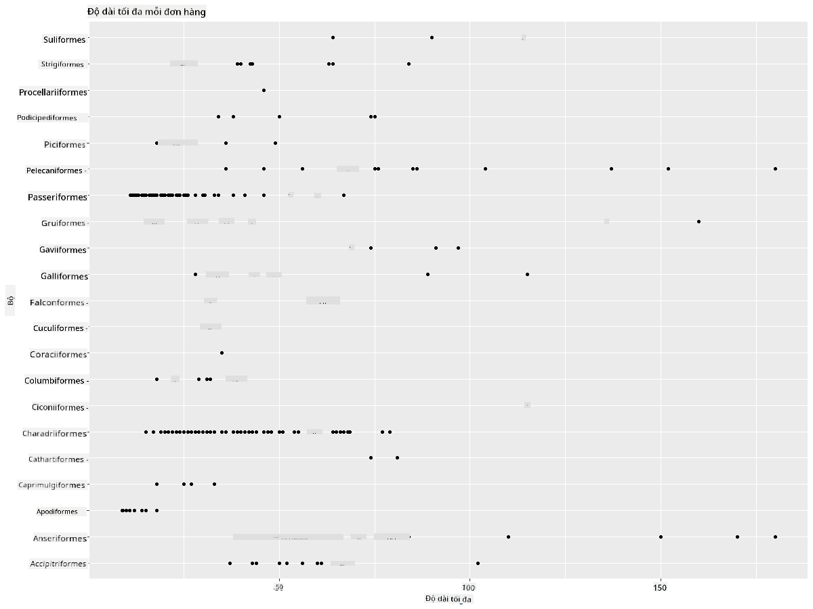
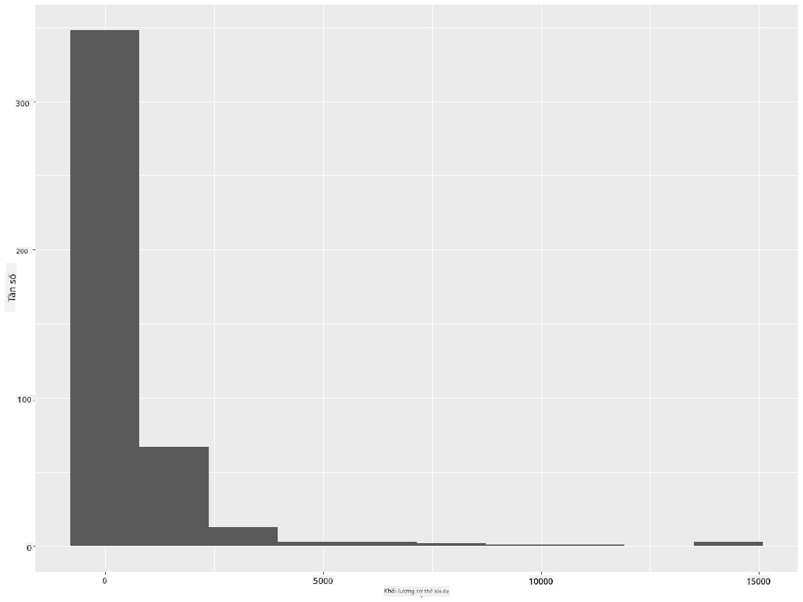
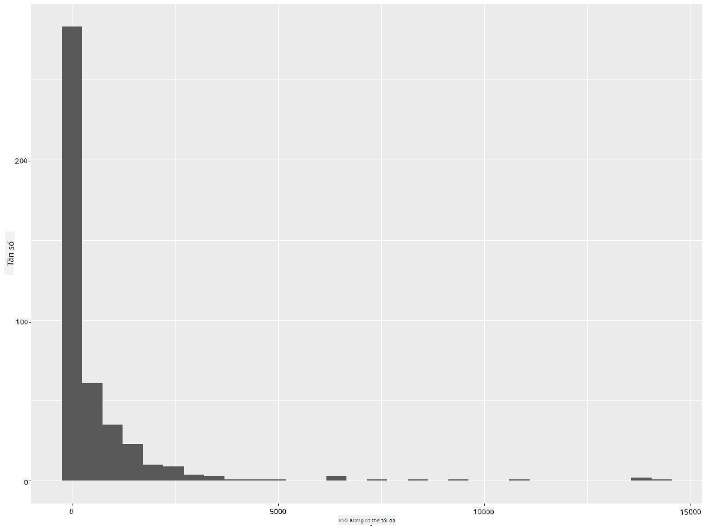
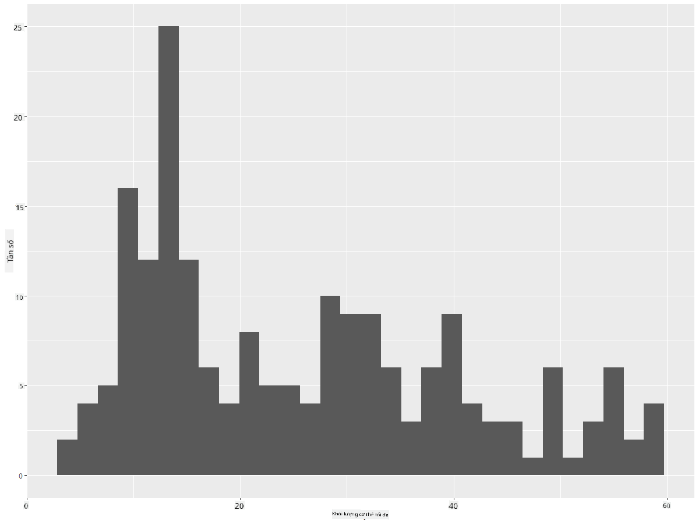
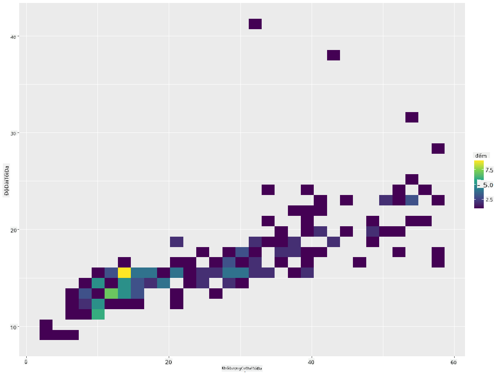
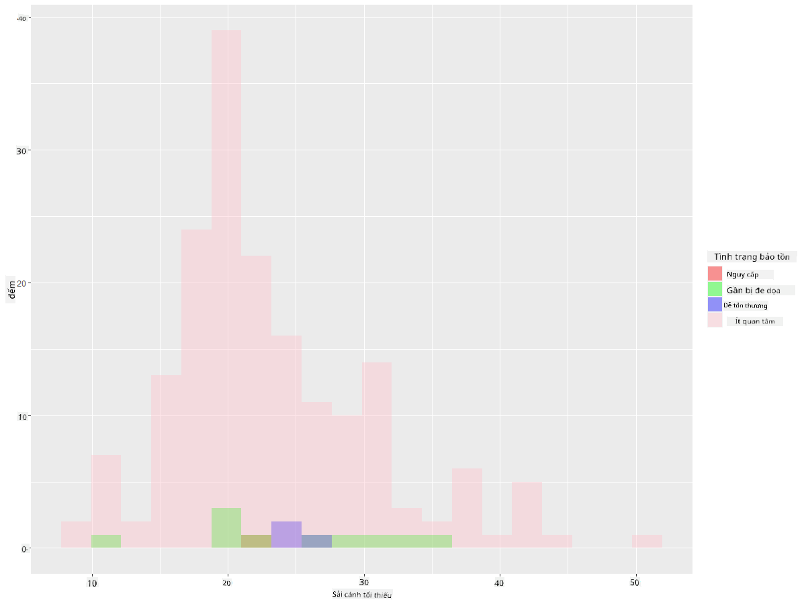
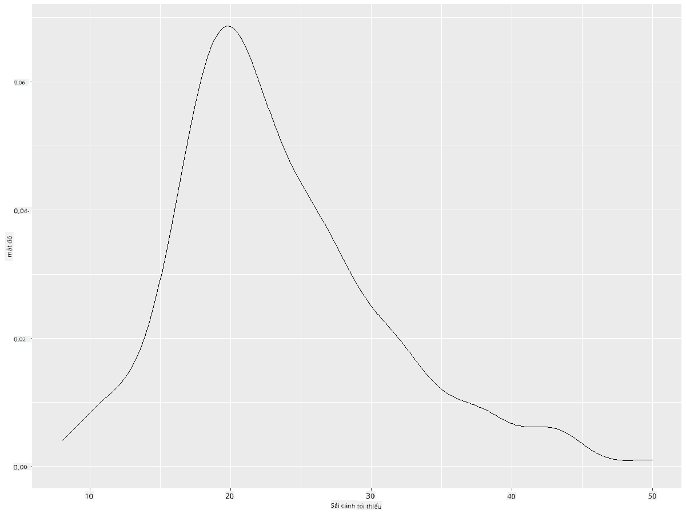
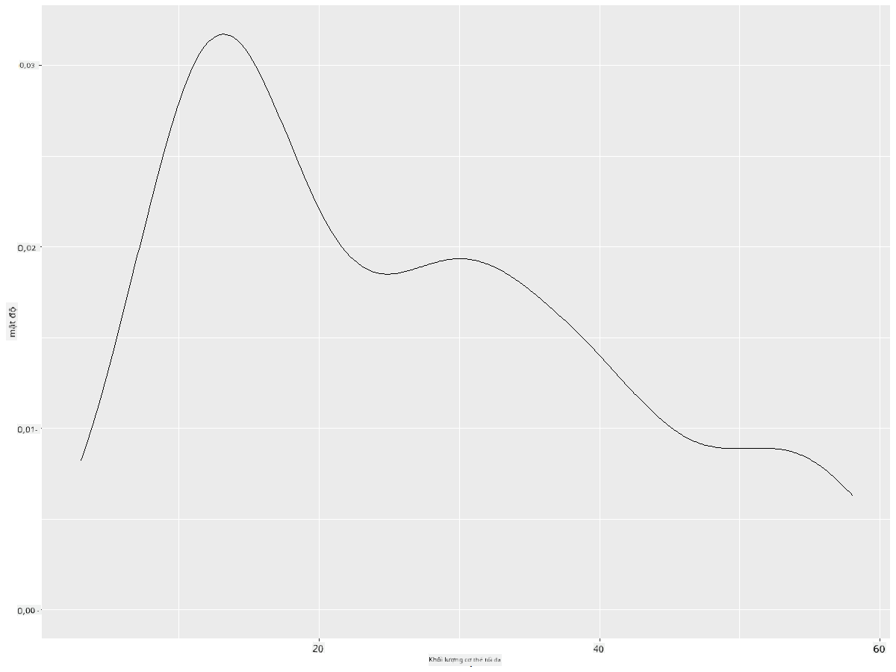
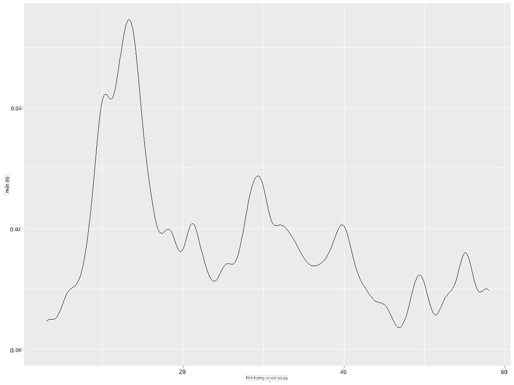
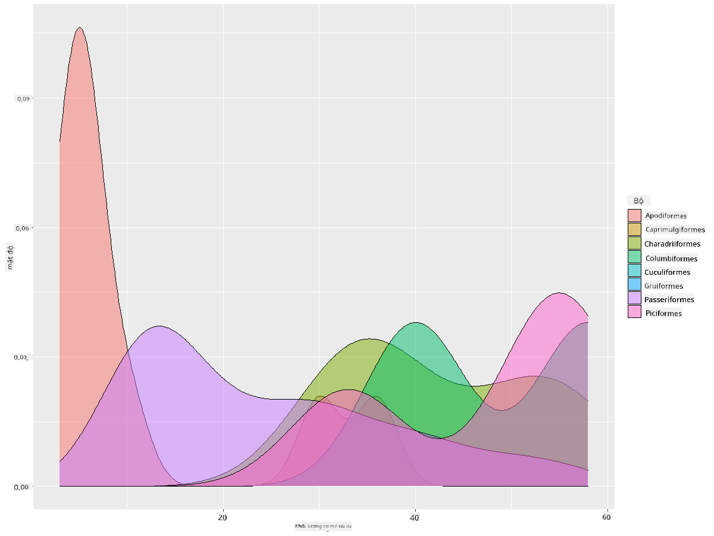

<!--
CO_OP_TRANSLATOR_METADATA:
{
  "original_hash": "ea67c0c40808fd723594de6896c37ccf",
  "translation_date": "2025-08-28T18:35:17+00:00",
  "source_file": "3-Data-Visualization/R/10-visualization-distributions/README.md",
  "language_code": "vi"
}
-->
# Trực quan hóa phân bố

| ](https://github.com/microsoft/Data-Science-For-Beginners/blob/main/sketchnotes/10-Visualizing-Distributions.png)|
|:---:|
| Trực quan hóa phân bố - _Sketchnote của [@nitya](https://twitter.com/nitya)_ |

Trong bài học trước, bạn đã tìm hiểu một số thông tin thú vị về bộ dữ liệu về các loài chim ở Minnesota. Bạn đã phát hiện một số dữ liệu sai lệch bằng cách trực quan hóa các giá trị ngoại lai và xem xét sự khác biệt giữa các loại chim dựa trên chiều dài tối đa của chúng.

## [Câu hỏi trước bài giảng](https://purple-hill-04aebfb03.1.azurestaticapps.net/quiz/18)
## Khám phá bộ dữ liệu về các loài chim

Một cách khác để tìm hiểu dữ liệu là xem xét phân bố của nó, hoặc cách dữ liệu được tổ chức dọc theo một trục. Ví dụ, có thể bạn muốn tìm hiểu về phân bố chung, đối với bộ dữ liệu này, của sải cánh tối đa hoặc khối lượng cơ thể tối đa của các loài chim ở Minnesota.

Hãy khám phá một số thông tin về phân bố dữ liệu trong bộ dữ liệu này. Trong giao diện R của bạn, nhập `ggplot2` và cơ sở dữ liệu. Loại bỏ các giá trị ngoại lai khỏi cơ sở dữ liệu giống như trong chủ đề trước.

```r
library(ggplot2)

birds <- read.csv("../../data/birds.csv",fileEncoding="UTF-8-BOM")

birds_filtered <- subset(birds, MaxWingspan < 500)
head(birds_filtered)
```
|      | Tên                          | Tên khoa học           | Loại                  | Bộ           | Họ       | Chi         | Tình trạng bảo tồn | Chiều dài tối thiểu | Chiều dài tối đa | Khối lượng cơ thể tối thiểu | Khối lượng cơ thể tối đa | Sải cánh tối thiểu | Sải cánh tối đa |
| ---: | :--------------------------- | :--------------------- | :-------------------- | :----------- | :------- | :---------- | :----------------- | ------------------: | ----------------: | --------------------------: | --------------------------: | ------------------: | ------------------: |
|    0 | Vịt huýt sáo bụng đen        | Dendrocygna autumnalis | Vịt/ngỗng/Chim nước   | Anseriformes | Anatidae | Dendrocygna | LC                 |                  47 |                  56 |                       652 |                       1020 |                  76 |                  94 |
|    1 | Vịt huýt sáo nâu             | Dendrocygna bicolor    | Vịt/ngỗng/Chim nước   | Anseriformes | Anatidae | Dendrocygna | LC                 |                  45 |                  53 |                       712 |                       1050 |                  85 |                  93 |
|    2 | Ngỗng tuyết                  | Anser caerulescens     | Vịt/ngỗng/Chim nước   | Anseriformes | Anatidae | Anser       | LC                 |                  64 |                  79 |                      2050 |                      4050 |                 135 |                 165 |
|    3 | Ngỗng Ross                   | Anser rossii           | Vịt/ngỗng/Chim nước   | Anseriformes | Anatidae | Anser       | LC                 |                57.3 |                  64 |                      1066 |                      1567 |                 113 |                 116 |
|    4 | Ngỗng trắng lớn              | Anser albifrons        | Vịt/ngỗng/Chim nước   | Anseriformes | Anatidae | Anser       | LC                 |                  64 |                  81 |                      1930 |                      3310 |                 130 |                 165 |

Nhìn chung, bạn có thể nhanh chóng xem cách dữ liệu được phân bố bằng cách sử dụng biểu đồ phân tán như chúng ta đã làm trong bài học trước:

```r
ggplot(data=birds_filtered, aes(x=Order, y=MaxLength,group=1)) +
  geom_point() +
  ggtitle("Max Length per order") + coord_flip()
```


Điều này cung cấp một cái nhìn tổng quan về phân bố chung của chiều dài cơ thể theo từng bộ chim, nhưng đây không phải là cách tối ưu để hiển thị phân bố thực sự. Nhiệm vụ này thường được thực hiện bằng cách tạo biểu đồ Histogram.

## Làm việc với biểu đồ Histogram

`ggplot2` cung cấp các cách rất tốt để trực quan hóa phân bố dữ liệu bằng biểu đồ Histogram. Loại biểu đồ này giống như biểu đồ cột, nơi phân bố có thể được nhìn thấy qua sự tăng giảm của các cột. Để tạo một biểu đồ Histogram, bạn cần dữ liệu dạng số. Để tạo biểu đồ Histogram, bạn có thể vẽ biểu đồ bằng cách định nghĩa loại là 'hist' cho Histogram. Biểu đồ này hiển thị phân bố của MaxBodyMass cho toàn bộ phạm vi dữ liệu số của bộ dữ liệu. Bằng cách chia mảng dữ liệu thành các nhóm nhỏ hơn, nó có thể hiển thị phân bố của các giá trị dữ liệu:

```r
ggplot(data = birds_filtered, aes(x = MaxBodyMass)) + 
  geom_histogram(bins=10)+ylab('Frequency')
```


Như bạn có thể thấy, hầu hết hơn 400 loài chim trong bộ dữ liệu này nằm trong phạm vi dưới 2000 cho khối lượng cơ thể tối đa của chúng. Tìm hiểu thêm về dữ liệu bằng cách thay đổi tham số `bins` thành một số lớn hơn, chẳng hạn như 30:

```r
ggplot(data = birds_filtered, aes(x = MaxBodyMass)) + geom_histogram(bins=30)+ylab('Frequency')
```



Biểu đồ này hiển thị phân bố một cách chi tiết hơn. Một biểu đồ ít lệch về bên trái hơn có thể được tạo bằng cách đảm bảo rằng bạn chỉ chọn dữ liệu trong một phạm vi nhất định:

Lọc dữ liệu của bạn để chỉ lấy những loài chim có khối lượng cơ thể dưới 60 và hiển thị 30 `bins`:

```r
birds_filtered_1 <- subset(birds_filtered, MaxBodyMass > 1 & MaxBodyMass < 60)
ggplot(data = birds_filtered_1, aes(x = MaxBodyMass)) + 
  geom_histogram(bins=30)+ylab('Frequency')
```



✅ Thử một số bộ lọc và điểm dữ liệu khác. Để xem toàn bộ phân bố của dữ liệu, loại bỏ bộ lọc `['MaxBodyMass']` để hiển thị các phân bố có nhãn.

Biểu đồ Histogram cung cấp một số cải tiến về màu sắc và nhãn mà bạn có thể thử:

Tạo biểu đồ Histogram 2D để so sánh mối quan hệ giữa hai phân bố. Hãy so sánh `MaxBodyMass` với `MaxLength`. `ggplot2` cung cấp một cách tích hợp để hiển thị sự hội tụ bằng cách sử dụng màu sắc sáng hơn:

```r
ggplot(data=birds_filtered_1, aes(x=MaxBodyMass, y=MaxLength) ) +
  geom_bin2d() +scale_fill_continuous(type = "viridis")
```
Có vẻ như có một mối tương quan dự kiến giữa hai yếu tố này dọc theo một trục dự kiến, với một điểm hội tụ đặc biệt mạnh:



Biểu đồ Histogram hoạt động tốt theo mặc định cho dữ liệu dạng số. Vậy nếu bạn cần xem phân bố theo dữ liệu dạng văn bản thì sao?

## Khám phá bộ dữ liệu để tìm phân bố theo dữ liệu dạng văn bản

Bộ dữ liệu này cũng bao gồm thông tin tốt về loại chim và chi, loài, họ của chúng cũng như tình trạng bảo tồn. Hãy tìm hiểu thông tin bảo tồn này. Phân bố của các loài chim theo tình trạng bảo tồn của chúng là gì?

> ✅ Trong bộ dữ liệu, một số từ viết tắt được sử dụng để mô tả tình trạng bảo tồn. Những từ viết tắt này đến từ [Danh mục Đỏ của IUCN](https://www.iucnredlist.org/), một tổ chức chuyên phân loại tình trạng của các loài.
> 
> - CR: Cực kỳ nguy cấp
> - EN: Nguy cấp
> - EX: Tuyệt chủng
> - LC: Ít quan tâm
> - NT: Gần bị đe dọa
> - VU: Dễ bị tổn thương

Đây là các giá trị dạng văn bản, vì vậy bạn sẽ cần thực hiện một chuyển đổi để tạo biểu đồ Histogram. Sử dụng dataframe filteredBirds, hiển thị tình trạng bảo tồn của nó cùng với sải cánh tối thiểu. Bạn thấy gì?

```r
birds_filtered_1$ConservationStatus[birds_filtered_1$ConservationStatus == 'EX'] <- 'x1' 
birds_filtered_1$ConservationStatus[birds_filtered_1$ConservationStatus == 'CR'] <- 'x2'
birds_filtered_1$ConservationStatus[birds_filtered_1$ConservationStatus == 'EN'] <- 'x3'
birds_filtered_1$ConservationStatus[birds_filtered_1$ConservationStatus == 'NT'] <- 'x4'
birds_filtered_1$ConservationStatus[birds_filtered_1$ConservationStatus == 'VU'] <- 'x5'
birds_filtered_1$ConservationStatus[birds_filtered_1$ConservationStatus == 'LC'] <- 'x6'

ggplot(data=birds_filtered_1, aes(x = MinWingspan, fill = ConservationStatus)) +
  geom_histogram(position = "identity", alpha = 0.4, bins = 20) +
  scale_fill_manual(name="Conservation Status",values=c("red","green","blue","pink"),labels=c("Endangered","Near Threathened","Vulnerable","Least Concern"))
```



Dường như không có mối tương quan tốt giữa sải cánh tối thiểu và tình trạng bảo tồn. Thử nghiệm các yếu tố khác của bộ dữ liệu bằng phương pháp này. Bạn có thể thử các bộ lọc khác nhau. Bạn có tìm thấy mối tương quan nào không?

## Biểu đồ mật độ

Bạn có thể đã nhận thấy rằng các biểu đồ Histogram mà chúng ta đã xem xét cho đến nay có dạng 'bậc thang' và không trôi chảy mượt mà theo một vòng cung. Để hiển thị biểu đồ mật độ mượt mà hơn, bạn có thể thử biểu đồ mật độ.

Hãy làm việc với biểu đồ mật độ ngay bây giờ!

```r
ggplot(data = birds_filtered_1, aes(x = MinWingspan)) + 
  geom_density()
```


Bạn có thể thấy cách biểu đồ phản ánh biểu đồ trước đó về dữ liệu sải cánh tối thiểu; nó chỉ mượt mà hơn một chút. Nếu bạn muốn xem lại đường gấp khúc của MaxBodyMass trong biểu đồ thứ hai mà bạn đã tạo, bạn có thể làm mượt nó rất tốt bằng cách tạo lại nó bằng phương pháp này:

```r
ggplot(data = birds_filtered_1, aes(x = MaxBodyMass)) + 
  geom_density()
```


Nếu bạn muốn một đường mượt mà nhưng không quá mượt, hãy chỉnh sửa tham số `adjust`:

```r
ggplot(data = birds_filtered_1, aes(x = MaxBodyMass)) + 
  geom_density(adjust = 1/5)
```


✅ Đọc về các tham số có sẵn cho loại biểu đồ này và thử nghiệm!

Loại biểu đồ này cung cấp các hình ảnh trực quan giải thích rất đẹp. Với một vài dòng mã, ví dụ, bạn có thể hiển thị mật độ khối lượng cơ thể tối đa theo từng bộ chim:

```r
ggplot(data=birds_filtered_1,aes(x = MaxBodyMass, fill = Order)) +
  geom_density(alpha=0.5)
```


## 🚀 Thử thách

Biểu đồ Histogram là một loại biểu đồ tinh vi hơn so với biểu đồ phân tán, biểu đồ cột, hoặc biểu đồ đường cơ bản. Hãy tìm kiếm trên internet để tìm các ví dụ tốt về việc sử dụng biểu đồ Histogram. Chúng được sử dụng như thế nào, chúng thể hiện điều gì, và trong các lĩnh vực hoặc lĩnh vực nghiên cứu nào chúng thường được sử dụng?

## [Câu hỏi sau bài giảng](https://purple-hill-04aebfb03.1.azurestaticapps.net/quiz/19)

## Ôn tập & Tự học

Trong bài học này, bạn đã sử dụng `ggplot2` và bắt đầu làm việc để hiển thị các biểu đồ tinh vi hơn. Hãy nghiên cứu về `geom_density_2d()` một "đường cong mật độ xác suất liên tục trong một hoặc nhiều chiều". Đọc qua [tài liệu](https://ggplot2.tidyverse.org/reference/geom_density_2d.html) để hiểu cách nó hoạt động.

## Bài tập

[Áp dụng kỹ năng của bạn](assignment.md)

---

**Tuyên bố miễn trừ trách nhiệm**:  
Tài liệu này đã được dịch bằng dịch vụ dịch thuật AI [Co-op Translator](https://github.com/Azure/co-op-translator). Mặc dù chúng tôi cố gắng đảm bảo độ chính xác, xin lưu ý rằng các bản dịch tự động có thể chứa lỗi hoặc không chính xác. Tài liệu gốc bằng ngôn ngữ bản địa nên được coi là nguồn tham khảo chính thức. Đối với các thông tin quan trọng, chúng tôi khuyến nghị sử dụng dịch vụ dịch thuật chuyên nghiệp từ con người. Chúng tôi không chịu trách nhiệm cho bất kỳ sự hiểu lầm hoặc diễn giải sai nào phát sinh từ việc sử dụng bản dịch này.