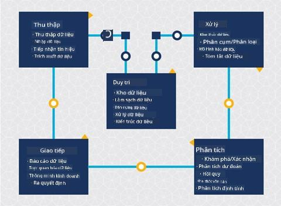
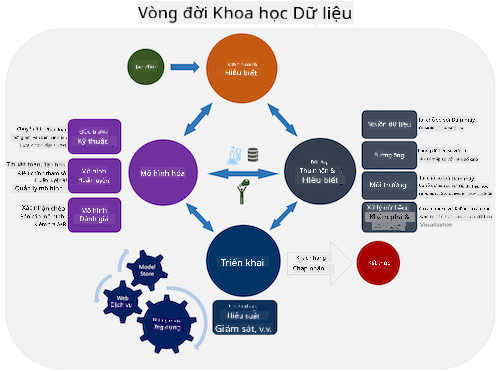
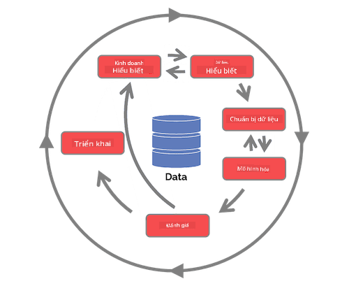

<!--
CO_OP_TRANSLATOR_METADATA:
{
  "original_hash": "c368f8f2506fe56bca0f7be05c4eb71d",
  "translation_date": "2025-08-28T18:21:36+00:00",
  "source_file": "4-Data-Science-Lifecycle/14-Introduction/README.md",
  "language_code": "vi"
}
-->
# Giới thiệu về Vòng đời Khoa học Dữ liệu

| ](../../sketchnotes/14-DataScience-Lifecycle.png)|
|:---:|
| Giới thiệu về Vòng đời Khoa học Dữ liệu - _Sketchnote bởi [@nitya](https://twitter.com/nitya)_ |

## [Câu hỏi trước bài giảng](https://red-water-0103e7a0f.azurestaticapps.net/quiz/26)

Đến thời điểm này, bạn có lẽ đã nhận ra rằng khoa học dữ liệu là một quy trình. Quy trình này có thể được chia thành 5 giai đoạn:

- Thu thập
- Xử lý
- Phân tích
- Truyền đạt
- Bảo trì

Bài học này tập trung vào 3 phần của vòng đời: thu thập, xử lý và bảo trì.

  
> Ảnh bởi [Berkeley School of Information](https://ischoolonline.berkeley.edu/data-science/what-is-data-science/)

## Thu thập

Giai đoạn đầu tiên của vòng đời rất quan trọng vì các giai đoạn tiếp theo phụ thuộc vào nó. Thực tế, đây là hai giai đoạn kết hợp thành một: thu thập dữ liệu và xác định mục đích cũng như các vấn đề cần giải quyết.  
Việc xác định mục tiêu của dự án sẽ yêu cầu hiểu sâu hơn về vấn đề hoặc câu hỏi. Đầu tiên, chúng ta cần xác định và thu thập những người cần giải quyết vấn đề của họ. Đây có thể là các bên liên quan trong doanh nghiệp hoặc nhà tài trợ của dự án, những người có thể giúp xác định ai hoặc điều gì sẽ hưởng lợi từ dự án này cũng như họ cần gì và tại sao. Một mục tiêu được xác định rõ ràng nên có thể đo lường và định lượng để xác định kết quả chấp nhận được.

Các câu hỏi mà một nhà khoa học dữ liệu có thể đặt ra:
- Vấn đề này đã từng được giải quyết trước đây chưa? Điều gì đã được khám phá?
- Mục đích và mục tiêu có được tất cả các bên liên quan hiểu rõ không?
- Có sự mơ hồ nào không và làm thế nào để giảm bớt nó?
- Những ràng buộc là gì?
- Kết quả cuối cùng có thể trông như thế nào?
- Có bao nhiêu tài nguyên (thời gian, nhân lực, tính toán) sẵn có?

Tiếp theo là xác định, thu thập, và cuối cùng là khám phá dữ liệu cần thiết để đạt được các mục tiêu đã xác định. Ở bước thu thập này, các nhà khoa học dữ liệu cũng phải đánh giá số lượng và chất lượng của dữ liệu. Điều này yêu cầu một số khám phá dữ liệu để xác nhận rằng những gì đã thu thập sẽ hỗ trợ đạt được kết quả mong muốn.

Các câu hỏi mà một nhà khoa học dữ liệu có thể đặt ra về dữ liệu:
- Dữ liệu nào đã có sẵn cho tôi?
- Ai sở hữu dữ liệu này?
- Những lo ngại về quyền riêng tư là gì?
- Tôi có đủ dữ liệu để giải quyết vấn đề này không?
- Dữ liệu có chất lượng chấp nhận được cho vấn đề này không?
- Nếu tôi phát hiện thêm thông tin thông qua dữ liệu này, chúng ta có nên cân nhắc thay đổi hoặc xác định lại mục tiêu không?

## Xử lý

Giai đoạn xử lý của vòng đời tập trung vào việc khám phá các mẫu trong dữ liệu cũng như xây dựng mô hình. Một số kỹ thuật được sử dụng trong giai đoạn xử lý yêu cầu các phương pháp thống kê để tìm ra các mẫu. Thông thường, đây sẽ là một nhiệm vụ tẻ nhạt đối với con người khi làm việc với một tập dữ liệu lớn và sẽ dựa vào máy tính để thực hiện công việc nặng nhọc nhằm tăng tốc quá trình. Giai đoạn này cũng là nơi khoa học dữ liệu và học máy giao thoa. Như bạn đã học trong bài đầu tiên, học máy là quá trình xây dựng các mô hình để hiểu dữ liệu. Mô hình là sự biểu diễn mối quan hệ giữa các biến trong dữ liệu giúp dự đoán kết quả.

Các kỹ thuật phổ biến được sử dụng trong giai đoạn này được đề cập trong chương trình học ML for Beginners. Theo các liên kết để tìm hiểu thêm về chúng:

- [Phân loại](https://github.com/microsoft/ML-For-Beginners/tree/main/4-Classification): Sắp xếp dữ liệu vào các danh mục để sử dụng hiệu quả hơn.
- [Phân cụm](https://github.com/microsoft/ML-For-Beginners/tree/main/5-Clustering): Nhóm dữ liệu thành các nhóm tương tự.
- [Hồi quy](https://github.com/microsoft/ML-For-Beginners/tree/main/2-Regression): Xác định mối quan hệ giữa các biến để dự đoán hoặc dự báo giá trị.

## Bảo trì

Trong sơ đồ vòng đời, bạn có thể nhận thấy rằng bảo trì nằm giữa thu thập và xử lý. Bảo trì là một quá trình liên tục để quản lý, lưu trữ và bảo mật dữ liệu trong suốt quá trình của một dự án và nên được xem xét trong toàn bộ dự án.

### Lưu trữ dữ liệu

Việc cân nhắc cách và nơi lưu trữ dữ liệu có thể ảnh hưởng đến chi phí lưu trữ cũng như hiệu suất của việc truy cập dữ liệu nhanh như thế nào. Những quyết định như vậy không có khả năng được thực hiện bởi một nhà khoa học dữ liệu đơn lẻ, nhưng họ có thể phải đưa ra lựa chọn về cách làm việc với dữ liệu dựa trên cách nó được lưu trữ.

Dưới đây là một số khía cạnh của hệ thống lưu trữ dữ liệu hiện đại có thể ảnh hưởng đến những lựa chọn này:

**Tại chỗ so với ngoài chỗ so với đám mây công cộng hoặc riêng tư**

Tại chỗ đề cập đến việc lưu trữ và quản lý dữ liệu trên thiết bị của riêng bạn, như sở hữu một máy chủ với ổ cứng lưu trữ dữ liệu, trong khi ngoài chỗ dựa vào thiết bị mà bạn không sở hữu, chẳng hạn như trung tâm dữ liệu. Đám mây công cộng là một lựa chọn phổ biến để lưu trữ dữ liệu mà không yêu cầu kiến thức về cách hoặc nơi dữ liệu được lưu trữ chính xác, nơi công cộng đề cập đến cơ sở hạ tầng cơ bản thống nhất được chia sẻ bởi tất cả những người sử dụng đám mây. Một số tổ chức có chính sách bảo mật nghiêm ngặt yêu cầu họ phải có quyền truy cập hoàn toàn vào thiết bị nơi dữ liệu được lưu trữ và sẽ dựa vào đám mây riêng cung cấp các dịch vụ đám mây riêng của mình. Bạn sẽ tìm hiểu thêm về dữ liệu trong đám mây trong [các bài học sau](https://github.com/microsoft/Data-Science-For-Beginners/tree/main/5-Data-Science-In-Cloud).

**Dữ liệu lạnh so với dữ liệu nóng**

Khi huấn luyện mô hình của bạn, bạn có thể cần thêm dữ liệu huấn luyện. Nếu bạn hài lòng với mô hình của mình, nhiều dữ liệu hơn sẽ đến để mô hình phục vụ mục đích của nó. Trong bất kỳ trường hợp nào, chi phí lưu trữ và truy cập dữ liệu sẽ tăng lên khi bạn tích lũy thêm dữ liệu. Việc tách dữ liệu ít được sử dụng, được gọi là dữ liệu lạnh, khỏi dữ liệu thường xuyên được truy cập, dữ liệu nóng, có thể là một lựa chọn lưu trữ dữ liệu rẻ hơn thông qua phần cứng hoặc dịch vụ phần mềm. Nếu dữ liệu lạnh cần được truy cập, có thể mất một chút thời gian để truy xuất so với dữ liệu nóng.

### Quản lý dữ liệu

Khi làm việc với dữ liệu, bạn có thể phát hiện rằng một số dữ liệu cần được làm sạch bằng một số kỹ thuật được đề cập trong bài học tập trung vào [chuẩn bị dữ liệu](https://github.com/microsoft/Data-Science-For-Beginners/tree/main/2-Working-With-Data/08-data-preparation) để xây dựng các mô hình chính xác. Khi dữ liệu mới đến, nó sẽ cần một số ứng dụng tương tự để duy trì tính nhất quán về chất lượng. Một số dự án sẽ liên quan đến việc sử dụng công cụ tự động để làm sạch, tổng hợp và nén trước khi dữ liệu được chuyển đến vị trí cuối cùng. Azure Data Factory là một ví dụ về một trong những công cụ này.

### Bảo mật dữ liệu

Một trong những mục tiêu chính của việc bảo mật dữ liệu là đảm bảo rằng những người làm việc với dữ liệu kiểm soát được những gì được thu thập và trong ngữ cảnh nào nó được sử dụng. Việc giữ dữ liệu an toàn liên quan đến việc giới hạn quyền truy cập chỉ cho những người cần nó, tuân thủ luật pháp và quy định địa phương, cũng như duy trì các tiêu chuẩn đạo đức, như đã đề cập trong [bài học về đạo đức](https://github.com/microsoft/Data-Science-For-Beginners/tree/main/1-Introduction/02-ethics).

Dưới đây là một số điều mà nhóm có thể làm với mục tiêu bảo mật:
- Xác nhận rằng tất cả dữ liệu đều được mã hóa
- Cung cấp cho khách hàng thông tin về cách dữ liệu của họ được sử dụng
- Loại bỏ quyền truy cập dữ liệu từ những người đã rời khỏi dự án
- Chỉ cho phép một số thành viên dự án nhất định thay đổi dữ liệu

## 🚀 Thử thách

Có nhiều phiên bản của Vòng đời Khoa học Dữ liệu, trong đó mỗi bước có thể có tên gọi và số lượng giai đoạn khác nhau nhưng sẽ chứa các quy trình giống như đã đề cập trong bài học này.

Khám phá [Vòng đời Quy trình Khoa học Dữ liệu của Nhóm](https://docs.microsoft.com/en-us/azure/architecture/data-science-process/lifecycle) và [Quy trình tiêu chuẩn liên ngành cho khai thác dữ liệu](https://www.datascience-pm.com/crisp-dm-2/). Nêu 3 điểm tương đồng và khác biệt giữa hai quy trình này.

|Quy trình Khoa học Dữ liệu của Nhóm (TDSP)|Quy trình tiêu chuẩn liên ngành cho khai thác dữ liệu (CRISP-DM)|
|--|--|
| |  |
| Hình ảnh bởi [Microsoft](https://docs.microsoft.comazure/architecture/data-science-process/lifecycle) | Hình ảnh bởi [Data Science Process Alliance](https://www.datascience-pm.com/crisp-dm-2/) |

## [Câu hỏi sau bài giảng](https://red-water-0103e7a0f.azurestaticapps.net/quiz/27)

## Ôn tập & Tự học

Việc áp dụng Vòng đời Khoa học Dữ liệu liên quan đến nhiều vai trò và nhiệm vụ, trong đó một số có thể tập trung vào các phần cụ thể của mỗi giai đoạn. Quy trình Khoa học Dữ liệu của Nhóm cung cấp một số tài nguyên giải thích các loại vai trò và nhiệm vụ mà ai đó có thể có trong một dự án.

* [Vai trò và nhiệm vụ trong Quy trình Khoa học Dữ liệu của Nhóm](https://docs.microsoft.com/en-us/azure/architecture/data-science-process/roles-tasks)  
* [Thực hiện các nhiệm vụ khoa học dữ liệu: khám phá, mô hình hóa và triển khai](https://docs.microsoft.com/en-us/azure/architecture/data-science-process/execute-data-science-tasks)

## Bài tập

[Đánh giá một tập dữ liệu](assignment.md)

---

**Tuyên bố miễn trừ trách nhiệm**:  
Tài liệu này đã được dịch bằng dịch vụ dịch thuật AI [Co-op Translator](https://github.com/Azure/co-op-translator). Mặc dù chúng tôi cố gắng đảm bảo độ chính xác, xin lưu ý rằng các bản dịch tự động có thể chứa lỗi hoặc không chính xác. Tài liệu gốc bằng ngôn ngữ bản địa nên được coi là nguồn tham khảo chính thức. Đối với các thông tin quan trọng, nên sử dụng dịch vụ dịch thuật chuyên nghiệp từ con người. Chúng tôi không chịu trách nhiệm cho bất kỳ sự hiểu lầm hoặc diễn giải sai nào phát sinh từ việc sử dụng bản dịch này.