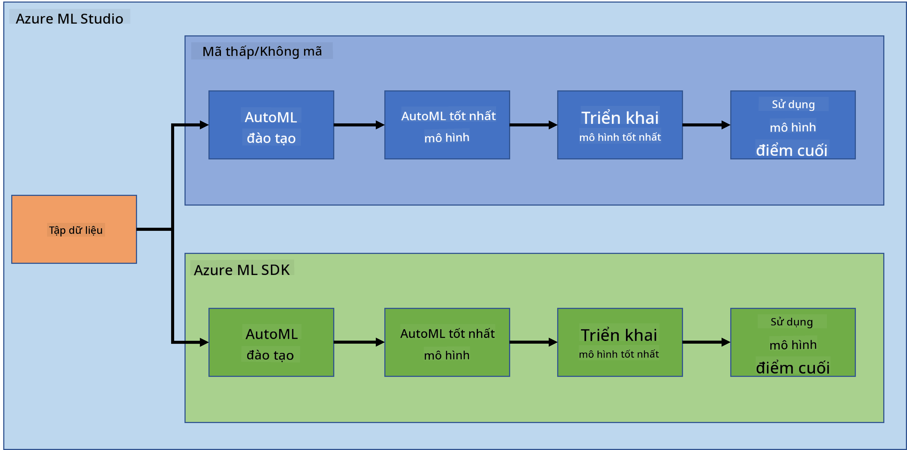
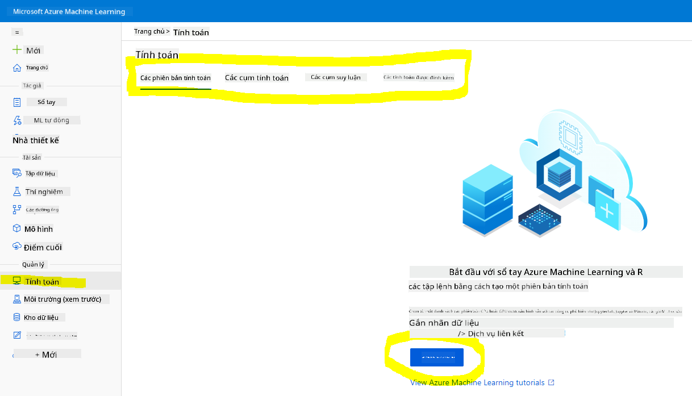
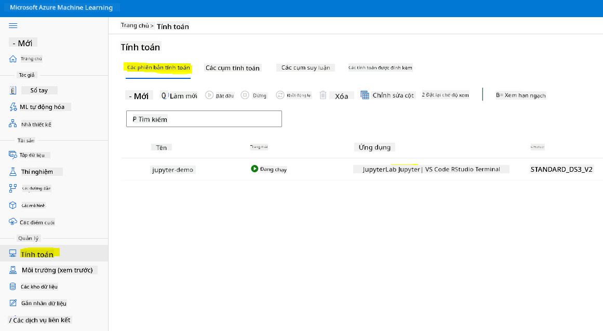
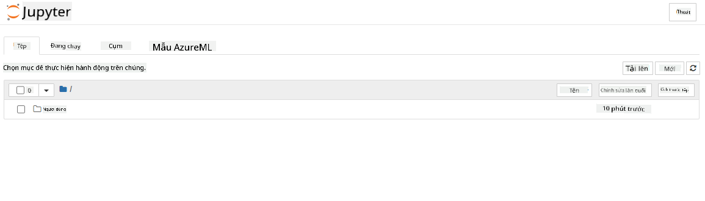

<!--
CO_OP_TRANSLATOR_METADATA:
{
  "original_hash": "5da2d6b3736f6d668b89de9bf3bdd31b",
  "translation_date": "2025-09-04T20:19:34+00:00",
  "source_file": "5-Data-Science-In-Cloud/19-Azure/README.md",
  "language_code": "vi"
}
-->
# Khoa học Dữ liệu trên Đám mây: Cách sử dụng "Azure ML SDK"

| ](../../sketchnotes/19-DataScience-Cloud.png)|
|:---:|
| Khoa học Dữ liệu trên Đám mây: Azure ML SDK - _Sketchnote của [@nitya](https://twitter.com/nitya)_ |

Mục lục:

- [Khoa học Dữ liệu trên Đám mây: Cách sử dụng "Azure ML SDK"](../../../../5-Data-Science-In-Cloud/19-Azure)
  - [Câu hỏi trước bài giảng](../../../../5-Data-Science-In-Cloud/19-Azure)
  - [1. Giới thiệu](../../../../5-Data-Science-In-Cloud/19-Azure)
    - [1.1 Azure ML SDK là gì?](../../../../5-Data-Science-In-Cloud/19-Azure)
    - [1.2 Dự án dự đoán suy tim và giới thiệu bộ dữ liệu](../../../../5-Data-Science-In-Cloud/19-Azure)
  - [2. Huấn luyện mô hình với Azure ML SDK](../../../../5-Data-Science-In-Cloud/19-Azure)
    - [2.1 Tạo một không gian làm việc Azure ML](../../../../5-Data-Science-In-Cloud/19-Azure)
    - [2.2 Tạo một phiên bản tính toán](../../../../5-Data-Science-In-Cloud/19-Azure)
    - [2.3 Tải bộ dữ liệu](../../../../5-Data-Science-In-Cloud/19-Azure)
    - [2.4 Tạo Notebooks](../../../../5-Data-Science-In-Cloud/19-Azure)
    - [2.5 Huấn luyện mô hình](../../../../5-Data-Science-In-Cloud/19-Azure)
      - [2.5.1 Thiết lập không gian làm việc, thí nghiệm, cụm tính toán và bộ dữ liệu](../../../../5-Data-Science-In-Cloud/19-Azure)
      - [2.5.2 Cấu hình AutoML và huấn luyện](../../../../5-Data-Science-In-Cloud/19-Azure)
  - [3. Triển khai mô hình và sử dụng endpoint với Azure ML SDK](../../../../5-Data-Science-In-Cloud/19-Azure)
    - [3.1 Lưu mô hình tốt nhất](../../../../5-Data-Science-In-Cloud/19-Azure)
    - [3.2 Triển khai mô hình](../../../../5-Data-Science-In-Cloud/19-Azure)
    - [3.3 Sử dụng endpoint](../../../../5-Data-Science-In-Cloud/19-Azure)
  - [🚀 Thử thách](../../../../5-Data-Science-In-Cloud/19-Azure)
  - [Câu hỏi sau bài giảng](../../../../5-Data-Science-In-Cloud/19-Azure)
  - [Ôn tập & Tự học](../../../../5-Data-Science-In-Cloud/19-Azure)
  - [Bài tập](../../../../5-Data-Science-In-Cloud/19-Azure)

## [Câu hỏi trước bài giảng](https://purple-hill-04aebfb03.1.azurestaticapps.net/quiz/36)

## 1. Giới thiệu

### 1.1 Azure ML SDK là gì?

Các nhà khoa học dữ liệu và nhà phát triển AI sử dụng Azure Machine Learning SDK để xây dựng và chạy các quy trình làm việc học máy với dịch vụ Azure Machine Learning. Bạn có thể tương tác với dịch vụ này trong bất kỳ môi trường Python nào, bao gồm Jupyter Notebooks, Visual Studio Code hoặc IDE Python yêu thích của bạn.

Các lĩnh vực chính của SDK bao gồm:

- Khám phá, chuẩn bị và quản lý vòng đời của các bộ dữ liệu được sử dụng trong các thí nghiệm học máy.
- Quản lý tài nguyên đám mây để giám sát, ghi nhật ký và tổ chức các thí nghiệm học máy.
- Huấn luyện mô hình tại chỗ hoặc sử dụng tài nguyên đám mây, bao gồm huấn luyện mô hình tăng tốc GPU.
- Sử dụng học máy tự động, chấp nhận các tham số cấu hình và dữ liệu huấn luyện. Nó tự động lặp qua các thuật toán và cài đặt siêu tham số để tìm mô hình tốt nhất cho việc dự đoán.
- Triển khai dịch vụ web để chuyển đổi các mô hình đã huấn luyện thành các dịch vụ RESTful có thể được sử dụng trong bất kỳ ứng dụng nào.

[Đọc thêm về Azure Machine Learning SDK](https://docs.microsoft.com/python/api/overview/azure/ml?WT.mc_id=academic-77958-bethanycheum&ocid=AID3041109)

Trong [bài học trước](../18-Low-Code/README.md), chúng ta đã thấy cách huấn luyện, triển khai và sử dụng một mô hình theo cách Low code/No code. Chúng ta đã sử dụng bộ dữ liệu Suy tim để tạo ra mô hình dự đoán suy tim. Trong bài học này, chúng ta sẽ làm chính xác điều đó nhưng sử dụng Azure Machine Learning SDK.



### 1.2 Dự án dự đoán suy tim và giới thiệu bộ dữ liệu

Xem [tại đây](../18-Low-Code/README.md) để biết giới thiệu về dự án dự đoán suy tim và bộ dữ liệu.

## 2. Huấn luyện mô hình với Azure ML SDK
### 2.1 Tạo một không gian làm việc Azure ML

Để đơn giản, chúng ta sẽ làm việc trên một jupyter notebook. Điều này có nghĩa là bạn đã có một Không gian làm việc và một phiên bản tính toán. Nếu bạn đã có một Không gian làm việc, bạn có thể trực tiếp chuyển đến phần 2.3 Tạo Notebook.

Nếu chưa, vui lòng làm theo hướng dẫn trong phần **2.1 Tạo một không gian làm việc Azure ML** trong [bài học trước](../18-Low-Code/README.md) để tạo một không gian làm việc.

### 2.2 Tạo một phiên bản tính toán

Trong [Không gian làm việc Azure ML](https://ml.azure.com/) mà chúng ta đã tạo trước đó, đi đến menu tính toán và bạn sẽ thấy các tài nguyên tính toán khác nhau có sẵn.



Hãy tạo một phiên bản tính toán để cung cấp một jupyter notebook. 
1. Nhấn vào nút + New. 
2. Đặt tên cho phiên bản tính toán của bạn.
3. Chọn các tùy chọn: CPU hoặc GPU, kích thước VM và số lõi.
4. Nhấn vào nút Create.

Chúc mừng, bạn vừa tạo một phiên bản tính toán! Chúng ta sẽ sử dụng phiên bản tính toán này để tạo một Notebook trong phần [Tạo Notebooks](../../../../5-Data-Science-In-Cloud/19-Azure).

### 2.3 Tải bộ dữ liệu
Tham khảo [bài học trước](../18-Low-Code/README.md) trong phần **2.3 Tải bộ dữ liệu** nếu bạn chưa tải lên bộ dữ liệu.

### 2.4 Tạo Notebooks

> **_LƯU Ý:_** Đối với bước tiếp theo, bạn có thể tạo một notebook mới từ đầu, hoặc bạn có thể tải lên [notebook chúng ta đã tạo](notebook.ipynb) trong Azure ML Studio của bạn. Để tải lên, chỉ cần nhấn vào menu "Notebook" và tải lên notebook.

Notebook là một phần rất quan trọng trong quy trình khoa học dữ liệu. Chúng có thể được sử dụng để thực hiện Phân tích Dữ liệu Khám phá (EDA), gọi đến một cụm tính toán để huấn luyện mô hình, gọi đến một cụm suy luận để triển khai endpoint.

Để tạo một Notebook, chúng ta cần một nút tính toán đang phục vụ phiên bản jupyter notebook. Quay lại [Không gian làm việc Azure ML](https://ml.azure.com/) và nhấn vào Phiên bản tính toán. Trong danh sách các phiên bản tính toán, bạn sẽ thấy [phiên bản tính toán chúng ta đã tạo trước đó](../../../../5-Data-Science-In-Cloud/19-Azure). 

1. Trong phần Ứng dụng, nhấn vào tùy chọn Jupyter. 
2. Tích vào ô "Yes, I understand" và nhấn vào nút Continue.

3. Điều này sẽ mở một tab trình duyệt mới với phiên bản jupyter notebook của bạn như sau. Nhấn vào nút "New" để tạo một notebook.



Bây giờ chúng ta đã có một Notebook, chúng ta có thể bắt đầu huấn luyện mô hình với Azure ML SDK.

### 2.5 Huấn luyện mô hình

Trước tiên, nếu bạn có bất kỳ thắc mắc nào, hãy tham khảo [tài liệu Azure ML SDK](https://docs.microsoft.com/python/api/overview/azure/ml?WT.mc_id=academic-77958-bethanycheum&ocid=AID3041109). Tài liệu này chứa tất cả thông tin cần thiết để hiểu các module chúng ta sẽ xem trong bài học này.

#### 2.5.1 Thiết lập không gian làm việc, thí nghiệm, cụm tính toán và bộ dữ liệu

Bạn cần tải `workspace` từ tệp cấu hình bằng cách sử dụng đoạn mã sau:

```python
from azureml.core import Workspace
ws = Workspace.from_config()
```

Điều này trả về một đối tượng loại `Workspace` đại diện cho không gian làm việc. Sau đó, bạn cần tạo một `experiment` bằng đoạn mã sau:

```python
from azureml.core import Experiment
experiment_name = 'aml-experiment'
experiment = Experiment(ws, experiment_name)
```
Để lấy hoặc tạo một thí nghiệm từ không gian làm việc, bạn yêu cầu thí nghiệm bằng tên thí nghiệm. Tên thí nghiệm phải dài từ 3-36 ký tự, bắt đầu bằng chữ cái hoặc số, và chỉ chứa chữ cái, số, dấu gạch dưới và dấu gạch ngang. Nếu thí nghiệm không được tìm thấy trong không gian làm việc, một thí nghiệm mới sẽ được tạo.

Bây giờ bạn cần tạo một cụm tính toán cho việc huấn luyện bằng đoạn mã sau. Lưu ý rằng bước này có thể mất vài phút. 

```python
from azureml.core.compute import AmlCompute

aml_name = "heart-f-cluster"
try:
    aml_compute = AmlCompute(ws, aml_name)
    print('Found existing AML compute context.')
except:
    print('Creating new AML compute context.')
    aml_config = AmlCompute.provisioning_configuration(vm_size = "Standard_D2_v2", min_nodes=1, max_nodes=3)
    aml_compute = AmlCompute.create(ws, name = aml_name, provisioning_configuration = aml_config)
    aml_compute.wait_for_completion(show_output = True)

cts = ws.compute_targets
compute_target = cts[aml_name]
```

Bạn có thể lấy bộ dữ liệu từ không gian làm việc bằng cách sử dụng tên bộ dữ liệu theo cách sau:

```python
dataset = ws.datasets['heart-failure-records']
df = dataset.to_pandas_dataframe()
df.describe()
```
#### 2.5.2 Cấu hình AutoML và huấn luyện

Để thiết lập cấu hình AutoML, sử dụng [lớp AutoMLConfig](https://docs.microsoft.com/python/api/azureml-train-automl-client/azureml.train.automl.automlconfig(class)?WT.mc_id=academic-77958-bethanycheum&ocid=AID3041109).

Như được mô tả trong tài liệu, có rất nhiều tham số mà bạn có thể tùy chỉnh. Đối với dự án này, chúng ta sẽ sử dụng các tham số sau:

- `experiment_timeout_minutes`: Thời gian tối đa (tính bằng phút) mà thí nghiệm được phép chạy trước khi nó tự động dừng và kết quả được tự động cung cấp.
- `max_concurrent_iterations`: Số lần lặp huấn luyện đồng thời tối đa được phép cho thí nghiệm.
- `primary_metric`: Chỉ số chính được sử dụng để xác định trạng thái của thí nghiệm.
- `compute_target`: Mục tiêu tính toán Azure Machine Learning để chạy thí nghiệm Học máy Tự động.
- `task`: Loại nhiệm vụ cần chạy. Giá trị có thể là 'classification', 'regression', hoặc 'forecasting' tùy thuộc vào loại vấn đề học máy tự động cần giải quyết.
- `training_data`: Dữ liệu huấn luyện được sử dụng trong thí nghiệm. Nó nên chứa cả các đặc trưng huấn luyện và một cột nhãn (tùy chọn cột trọng số mẫu).
- `label_column_name`: Tên của cột nhãn.
- `path`: Đường dẫn đầy đủ đến thư mục dự án Azure Machine Learning.
- `enable_early_stopping`: Có bật dừng sớm nếu điểm số không cải thiện trong ngắn hạn hay không.
- `featurization`: Chỉ báo cho việc bước tạo đặc trưng có được thực hiện tự động hay không, hoặc có sử dụng tạo đặc trưng tùy chỉnh hay không.
- `debug_log`: Tệp nhật ký để ghi thông tin gỡ lỗi.

```python
from azureml.train.automl import AutoMLConfig

project_folder = './aml-project'

automl_settings = {
    "experiment_timeout_minutes": 20,
    "max_concurrent_iterations": 3,
    "primary_metric" : 'AUC_weighted'
}

automl_config = AutoMLConfig(compute_target=compute_target,
                             task = "classification",
                             training_data=dataset,
                             label_column_name="DEATH_EVENT",
                             path = project_folder,  
                             enable_early_stopping= True,
                             featurization= 'auto',
                             debug_log = "automl_errors.log",
                             **automl_settings
                            )
```
Bây giờ bạn đã thiết lập cấu hình, bạn có thể huấn luyện mô hình bằng đoạn mã sau. Bước này có thể mất đến một giờ tùy thuộc vào kích thước cụm của bạn.

```python
remote_run = experiment.submit(automl_config)
```
Bạn có thể chạy widget RunDetails để hiển thị các thí nghiệm khác nhau.
```python
from azureml.widgets import RunDetails
RunDetails(remote_run).show()
```
## 3. Triển khai mô hình và sử dụng endpoint với Azure ML SDK

### 3.1 Lưu mô hình tốt nhất

`remote_run` là một đối tượng loại [AutoMLRun](https://docs.microsoft.com/python/api/azureml-train-automl-client/azureml.train.automl.run.automlrun?WT.mc_id=academic-77958-bethanycheum&ocid=AID3041109). Đối tượng này chứa phương thức `get_output()` trả về lần chạy tốt nhất và mô hình đã được huấn luyện tương ứng.

```python
best_run, fitted_model = remote_run.get_output()
```
Bạn có thể xem các tham số được sử dụng cho mô hình tốt nhất bằng cách chỉ cần in fitted_model và xem các thuộc tính của mô hình tốt nhất bằng cách sử dụng phương thức [get_properties()](https://docs.microsoft.com/python/api/azureml-core/azureml.core.run(class)?view=azure-ml-py#azureml_core_Run_get_properties?WT.mc_id=academic-77958-bethanycheum&ocid=AID3041109).

```python
best_run.get_properties()
```

Bây giờ hãy đăng ký mô hình với phương thức [register_model](https://docs.microsoft.com/python/api/azureml-train-automl-client/azureml.train.automl.run.automlrun?view=azure-ml-py#register-model-model-name-none--description-none--tags-none--iteration-none--metric-none-?WT.mc_id=academic-77958-bethanycheum&ocid=AID3041109).
```python
model_name = best_run.properties['model_name']
script_file_name = 'inference/score.py'
best_run.download_file('outputs/scoring_file_v_1_0_0.py', 'inference/score.py')
description = "aml heart failure project sdk"
model = best_run.register_model(model_name = model_name,
                                model_path = './outputs/',
                                description = description,
                                tags = None)
```
### 3.2 Triển khai mô hình

Khi mô hình tốt nhất đã được lưu, chúng ta có thể triển khai nó với lớp [InferenceConfig](https://docs.microsoft.com/python/api/azureml-core/azureml.core.model.inferenceconfig?view=azure-ml-py?ocid=AID3041109). InferenceConfig đại diện cho các cài đặt cấu hình cho môi trường tùy chỉnh được sử dụng để triển khai. Lớp [AciWebservice](https://docs.microsoft.com/python/api/azureml-core/azureml.core.webservice.aciwebservice?view=azure-ml-py) đại diện cho một mô hình học máy được triển khai dưới dạng endpoint dịch vụ web trên Azure Container Instances. Một dịch vụ được triển khai được tạo từ một mô hình, tập lệnh và các tệp liên quan. Dịch vụ web kết quả là một endpoint HTTP cân bằng tải với API REST. Bạn có thể gửi dữ liệu đến API này và nhận dự đoán trả về bởi mô hình.

Mô hình được triển khai bằng phương thức [deploy](https://docs.microsoft.com/python/api/azureml-core/azureml.core.model(class)?view=azure-ml-py#deploy-workspace--name--models--inference-config-none--deployment-config-none--deployment-target-none--overwrite-false--show-output-false-?WT.mc_id=academic-77958-bethanycheum&ocid=AID3041109).

```python
from azureml.core.model import InferenceConfig, Model
from azureml.core.webservice import AciWebservice

inference_config = InferenceConfig(entry_script=script_file_name, environment=best_run.get_environment())

aciconfig = AciWebservice.deploy_configuration(cpu_cores = 1,
                                               memory_gb = 1,
                                               tags = {'type': "automl-heart-failure-prediction"},
                                               description = 'Sample service for AutoML Heart Failure Prediction')

aci_service_name = 'automl-hf-sdk'
aci_service = Model.deploy(ws, aci_service_name, [model], inference_config, aciconfig)
aci_service.wait_for_deployment(True)
print(aci_service.state)
```
Bước này sẽ mất vài phút.

### 3.3 Sử dụng endpoint

Bạn sử dụng endpoint của mình bằng cách tạo một đầu vào mẫu:

```python
data = {
    "data":
    [
        {
            'age': "60",
            'anaemia': "false",
            'creatinine_phosphokinase': "500",
            'diabetes': "false",
            'ejection_fraction': "38",
            'high_blood_pressure': "false",
            'platelets': "260000",
            'serum_creatinine': "1.40",
            'serum_sodium': "137",
            'sex': "false",
            'smoking': "false",
            'time': "130",
        },
    ],
}

test_sample = str.encode(json.dumps(data))
```
Sau đó, bạn có thể gửi đầu vào này đến mô hình của mình để dự đoán:
```python
response = aci_service.run(input_data=test_sample)
response
```
Đoạn mã này sẽ xuất `'{"result": [false]}'`. Điều này có nghĩa là dữ liệu bệnh nhân mà chúng ta gửi đến endpoint đã tạo ra dự đoán `false`, tức là người này không có khả năng cao bị đau tim.

Chúc mừng bạn! Bạn vừa sử dụng mô hình đã được triển khai và huấn luyện trên Azure ML bằng Azure ML SDK!

> **_NOTE:_** Sau khi hoàn thành dự án, đừng quên xóa tất cả các tài nguyên.

## 🚀 Thử thách

Có rất nhiều điều khác bạn có thể làm thông qua SDK, tuy nhiên, chúng ta không thể xem hết tất cả trong bài học này. Nhưng tin tốt là việc học cách tìm kiếm nhanh trong tài liệu SDK có thể giúp bạn tiến xa hơn rất nhiều. Hãy xem tài liệu Azure ML SDK và tìm lớp `Pipeline`, lớp này cho phép bạn tạo các pipeline. Pipeline là một tập hợp các bước có thể được thực thi như một quy trình làm việc.

**GỢI Ý:** Truy cập [tài liệu SDK](https://docs.microsoft.com/python/api/overview/azure/ml/?view=azure-ml-py?WT.mc_id=academic-77958-bethanycheum&ocid=AID3041109) và nhập các từ khóa như "Pipeline" vào thanh tìm kiếm. Bạn sẽ thấy lớp `azureml.pipeline.core.Pipeline` trong kết quả tìm kiếm.

## [Câu hỏi sau bài giảng](https://ff-quizzes.netlify.app/en/ds/)

## Ôn tập & Tự học

Trong bài học này, bạn đã học cách huấn luyện, triển khai và sử dụng một mô hình để dự đoán nguy cơ suy tim với Azure ML SDK trên đám mây. Hãy xem [tài liệu này](https://docs.microsoft.com/python/api/overview/azure/ml/?view=azure-ml-py?WT.mc_id=academic-77958-bethanycheum&ocid=AID3041109) để biết thêm thông tin về Azure ML SDK. Thử tạo mô hình của riêng bạn với Azure ML SDK.

## Bài tập

[Project Khoa học Dữ liệu sử dụng Azure ML SDK](assignment.md)

---

**Tuyên bố miễn trừ trách nhiệm**:  
Tài liệu này đã được dịch bằng dịch vụ dịch thuật AI [Co-op Translator](https://github.com/Azure/co-op-translator). Mặc dù chúng tôi cố gắng đảm bảo độ chính xác, xin lưu ý rằng các bản dịch tự động có thể chứa lỗi hoặc không chính xác. Tài liệu gốc bằng ngôn ngữ bản địa nên được coi là nguồn tham khảo chính thức. Đối với các thông tin quan trọng, chúng tôi khuyến nghị sử dụng dịch vụ dịch thuật chuyên nghiệp từ con người. Chúng tôi không chịu trách nhiệm cho bất kỳ sự hiểu lầm hoặc diễn giải sai nào phát sinh từ việc sử dụng bản dịch này.