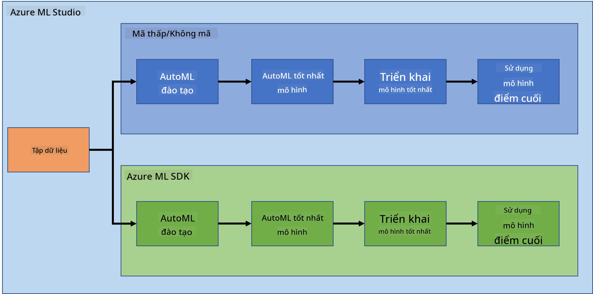

<!--
CO_OP_TRANSLATOR_METADATA:
{
  "original_hash": "8dfe141a0f46f7d253e07f74913c7f44",
  "translation_date": "2025-08-28T17:53:51+00:00",
  "source_file": "5-Data-Science-In-Cloud/README.md",
  "language_code": "vi"
}
-->
# Khoa học dữ liệu trên đám mây

> Ảnh của [Jelleke Vanooteghem](https://unsplash.com/@ilumire) từ [Unsplash](https://unsplash.com/s/photos/cloud?orientation=landscape)

Khi thực hiện khoa học dữ liệu với dữ liệu lớn, đám mây có thể là một yếu tố thay đổi cuộc chơi. Trong ba bài học tiếp theo, chúng ta sẽ tìm hiểu đám mây là gì và tại sao nó có thể rất hữu ích. Chúng ta cũng sẽ khám phá một tập dữ liệu về suy tim và xây dựng một mô hình để giúp đánh giá khả năng một người bị suy tim. Chúng ta sẽ sử dụng sức mạnh của đám mây để huấn luyện, triển khai và sử dụng mô hình theo hai cách khác nhau. Một cách sử dụng giao diện người dùng theo phong cách "Ít mã/Không mã", cách còn lại sử dụng Bộ công cụ phát triển phần mềm Azure Machine Learning (Azure ML SDK).

### Các chủ đề

1. [Tại sao sử dụng đám mây cho khoa học dữ liệu?](17-Introduction/README.md)
2. [Khoa học dữ liệu trên đám mây: Cách "Ít mã/Không mã"](18-Low-Code/README.md)
3. [Khoa học dữ liệu trên đám mây: Cách "Azure ML SDK"](19-Azure/README.md)

### Tín dụng
Những bài học này được viết với ☁️ và 💕 bởi [Maud Levy](https://twitter.com/maudstweets) và [Tiffany Souterre](https://twitter.com/TiffanySouterre)

Dữ liệu cho dự án Dự đoán Suy tim được lấy từ [
Larxel](https://www.kaggle.com/andrewmvd) trên [Kaggle](https://www.kaggle.com/andrewmvd/heart-failure-clinical-data). Nó được cấp phép theo [Attribution 4.0 International (CC BY 4.0)](https://creativecommons.org/licenses/by/4.0/)

---

**Tuyên bố miễn trừ trách nhiệm**:  
Tài liệu này đã được dịch bằng dịch vụ dịch thuật AI [Co-op Translator](https://github.com/Azure/co-op-translator). Mặc dù chúng tôi cố gắng đảm bảo độ chính xác, xin lưu ý rằng các bản dịch tự động có thể chứa lỗi hoặc không chính xác. Tài liệu gốc bằng ngôn ngữ bản địa nên được coi là nguồn thông tin chính thức. Đối với các thông tin quan trọng, khuyến nghị sử dụng dịch vụ dịch thuật chuyên nghiệp bởi con người. Chúng tôi không chịu trách nhiệm cho bất kỳ sự hiểu lầm hoặc diễn giải sai nào phát sinh từ việc sử dụng bản dịch này.