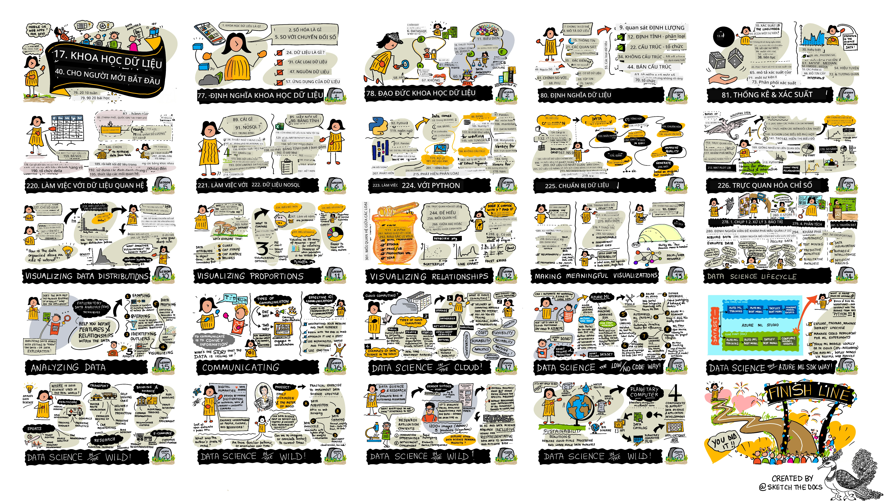

# Khoa học dữ liệu cho người mới bắt đầu - Chương trình học

[](https://github.com/codespaces/new?hide_repo_select=true&ref=main&repo=344191198)

[](https://github.com/microsoft/Data-Science-For-Beginners/blob/master/LICENSE)
[](https://GitHub.com/microsoft/Data-Science-For-Beginners/graphs/contributors/)
[](https://GitHub.com/microsoft/Data-Science-For-Beginners/issues/)
[](https://GitHub.com/microsoft/Data-Science-For-Beginners/pulls/)
[](http://makeapullrequest.com)

[](https://GitHub.com/microsoft/Data-Science-For-Beginners/watchers/)
[](https://GitHub.com/microsoft/Data-Science-For-Beginners/network/)
[](https://GitHub.com/microsoft/Data-Science-For-Beginners/stargazers/)


[](https://discord.gg/nTYy5BXMWG)

[](https://aka.ms/foundry/forum)

Các Nhà vận động Điện toán Đám mây Azure tại Microsoft vui mừng giới thiệu một chương trình học 10 tuần, 20 bài học hoàn toàn về Khoa học Dữ liệu. Mỗi bài học bao gồm các bài kiểm tra trước và sau bài học, hướng dẫn bằng văn bản để hoàn thành bài học, một giải pháp và một bài tập. Phương pháp giảng dạy dựa trên dự án cho phép bạn học đồng thời với việc xây dựng, một cách đã được chứng minh để các kỹ năng mới được "giữ lại".

**Chân thành cảm ơn các tác giả của chúng tôi:** [Jasmine Greenaway](https://www.twitter.com/paladique), [Dmitry Soshnikov](http://soshnikov.com), [Nitya Narasimhan](https://twitter.com/nitya), [Jalen McGee](https://twitter.com/JalenMcG), [Jen Looper](https://twitter.com/jenlooper), [Maud Levy](https://twitter.com/maudstweets), [Tiffany Souterre](https://twitter.com/TiffanySouterre), [Christopher Harrison](https://www.twitter.com/geektrainer).

**🙏 Đặc biệt cảm ơn 🙏 các tác giả, người đánh giá và đóng góp nội dung [Microsoft Student Ambassador](https://studentambassadors.microsoft.com/),** nổi bật là Aaryan Arora, [Aditya Garg](https://github.com/AdityaGarg00), [Alondra Sanchez](https://www.linkedin.com/in/alondra-sanchez-molina/), [Ankita Singh](https://www.linkedin.com/in/ankitasingh007), [Anupam Mishra](https://www.linkedin.com/in/anupam--mishra/), [Arpita Das](https://www.linkedin.com/in/arpitadas01/), ChhailBihari Dubey, [Dibri Nsofor](https://www.linkedin.com/in/dibrinsofor), [Dishita Bhasin](https://www.linkedin.com/in/dishita-bhasin-7065281bb), [Majd Safi](https://www.linkedin.com/in/majd-s/), [Max Blum](https://www.linkedin.com/in/max-blum-6036a1186/), [Miguel Correa](https://www.linkedin.com/in/miguelmque/), [Mohamma Iftekher (Iftu) Ebne Jalal](https://twitter.com/iftu119), [Nawrin Tabassum](https://www.linkedin.com/in/nawrin-tabassum), [Raymond Wangsa Putra](https://www.linkedin.com/in/raymond-wp/), [Rohit Yadav](https://www.linkedin.com/in/rty2423), Samridhi Sharma, [Sanya Sinha](https://www.linkedin.com/mwlite/in/sanya-sinha-13aab1200),
[Sheena Narula](https://www.linkedin.com/in/sheena-narua-n/), [Tauqeer Ahmad](https://www.linkedin.com/in/tauqeerahmad5201/), Yogendrasingh Pawar , [Vidushi Gupta](https://www.linkedin.com/in/vidushi-gupta07/), [Jasleen Sondhi](https://www.linkedin.com/in/jasleen-sondhi/)

||
|:---:|
| Khoa học dữ liệu cho người mới bắt đầu - _Sketchnote bởi [@nitya](https://twitter.com/nitya)_ |

### 🌐 Hỗ trợ đa ngôn ngữ

#### Hỗ trợ qua GitHub Action (Tự động & Luôn cập nhật)

<!-- CO-OP TRANSLATOR LANGUAGES TABLE START -->
[Arabic](../ar/README.md) | [Bengali](../bn/README.md) | [Bulgarian](../bg/README.md) | [Burmese (Myanmar)](../my/README.md) | [Chinese (Simplified)](../zh-CN/README.md) | [Chinese (Traditional, Hong Kong)](../zh-HK/README.md) | [Chinese (Traditional, Macau)](../zh-MO/README.md) | [Chinese (Traditional, Taiwan)](../zh-TW/README.md) | [Croatian](../hr/README.md) | [Czech](../cs/README.md) | [Danish](../da/README.md) | [Dutch](../nl/README.md) | [Estonian](../et/README.md) | [Finnish](../fi/README.md) | [French](../fr/README.md) | [German](../de/README.md) | [Greek](../el/README.md) | [Hebrew](../he/README.md) | [Hindi](../hi/README.md) | [Hungarian](../hu/README.md) | [Indonesian](../id/README.md) | [Italian](../it/README.md) | [Japanese](../ja/README.md) | [Kannada](../kn/README.md) | [Khmer](../km/README.md) | [Korean](../ko/README.md) | [Lithuanian](../lt/README.md) | [Malay](../ms/README.md) | [Malayalam](../ml/README.md) | [Marathi](../mr/README.md) | [Nepali](../ne/README.md) | [Nigerian Pidgin](../pcm/README.md) | [Norwegian](../no/README.md) | [Persian (Farsi)](../fa/README.md) | [Polish](../pl/README.md) | [Portuguese (Brazil)](../pt-BR/README.md) | [Portuguese (Portugal)](../pt-PT/README.md) | [Punjabi (Gurmukhi)](../pa/README.md) | [Romanian](../ro/README.md) | [Russian](../ru/README.md) | [Serbian (Cyrillic)](../sr/README.md) | [Slovak](../sk/README.md) | [Slovenian](../sl/README.md) | [Spanish](../es/README.md) | [Swahili](../sw/README.md) | [Swedish](../sv/README.md) | [Tagalog (Filipino)](../tl/README.md) | [Tamil](../ta/README.md) | [Telugu](../te/README.md) | [Thai](../th/README.md) | [Turkish](../tr/README.md) | [Ukrainian](../uk/README.md) | [Urdu](../ur/README.md) | [Vietnamese](./README.md)

> **Ưu tiên sao chép về máy?**
>
> Kho lưu trữ này bao gồm hơn 50 bản dịch ngôn ngữ làm tăng kích thước tải xuống đáng kể. Để sao chép mà không có bản dịch, hãy sử dụng sparse checkout:
>
> **Bash / macOS / Linux:**
> ```bash
> git clone --filter=blob:none --sparse https://github.com/microsoft/Data-Science-For-Beginners.git
> cd Data-Science-For-Beginners
> git sparse-checkout set --no-cone '/*' '!translations' '!translated_images'
> ```
>
> **CMD (Windows):**
> ```cmd
> git clone --filter=blob:none --sparse https://github.com/microsoft/Data-Science-For-Beginners.git
> cd Data-Science-For-Beginners
> git sparse-checkout set --no-cone "/*" "!translations" "!translated_images"
> ```
>
> Điều này cung cấp cho bạn tất cả những gì bạn cần để hoàn thành khóa học với tốc độ tải xuống nhanh hơn nhiều.
<!-- CO-OP TRANSLATOR LANGUAGES TABLE END -->

**Nếu bạn muốn có thêm các ngôn ngữ bản dịch, các ngôn ngữ được hỗ trợ được liệt kê [tại đây](https://github.com/Azure/co-op-translator/blob/main/getting_started/supported-languages.md)**

#### Tham gia Cộng đồng của chúng tôi 
[](https://discord.gg/nTYy5BXMWG)

Chúng tôi đang có một loạt chương trình học trên Discord với chủ đề học cùng AI, tìm hiểu thêm và tham gia cùng chúng tôi tại [Learn with AI Series](https://aka.ms/learnwithai/discord) từ ngày 18 - 30 tháng 9 năm 2025. Bạn sẽ nhận được các mẹo và thủ thuật sử dụng GitHub Copilot cho Khoa học Dữ liệu.


# Bạn là sinh viên?

Bắt đầu với các tài nguyên sau:

- [Trang Trung tâm Sinh viên](https://docs.microsoft.com/en-gb/learn/student-hub?WT.mc_id=academic-77958-bethanycheum) Trong trang này, bạn sẽ tìm thấy các tài nguyên cho người mới bắt đầu, các bộ tài liệu dành cho sinh viên và thậm chí các cách để lấy voucher chứng nhận miễn phí. Đây là một trang bạn nên đánh dấu trang và kiểm tra định kỳ vì chúng tôi thay đổi nội dung ít nhất mỗi tháng.
- [Microsoft Learn Student Ambassadors](https://studentambassadors.microsoft.com?WT.mc_id=academic-77958-bethanycheum) Tham gia cộng đồng đại sứ sinh viên toàn cầu, đây có thể là con đường dẫn bạn đến Microsoft.

# Bắt đầu

## 📚 Tài liệu

- **[Hướng dẫn cài đặt](INSTALLATION.md)** - Hướng dẫn cài đặt từng bước cho người mới
- **[Hướng dẫn sử dụng](USAGE.md)** - Ví dụ và các quy trình làm việc phổ biến
- **[Khắc phục sự cố](TROUBLESHOOTING.md)** - Giải pháp cho các sự cố thường gặp
- **[Hướng dẫn đóng góp](CONTRIBUTING.md)** - Cách đóng góp cho dự án này
- **[Dành cho Giáo viên](for-teachers.md)** - Hướng dẫn giảng dạy và tài nguyên lớp học

## 👨‍🎓 Dành cho Sinh viên
> **Hoàn toàn mới**: Mới với khoa học dữ liệu? Bắt đầu với các [ví dụ thân thiện với người mới bắt đầu](examples/README.md)! Những ví dụ đơn giản, có chú thích đầy đủ này sẽ giúp bạn hiểu được cơ bản trước khi bước vào toàn bộ chương trình học.
> **[Sinh viên](https://aka.ms/student-page)**: để sử dụng chương trình học này một mình, hãy fork toàn bộ repo và hoàn thành các bài tập một mình, bắt đầu bằng bài kiểm tra trước bài giảng. Sau đó đọc bài giảng và hoàn thành các hoạt động còn lại. Cố gắng tạo ra các dự án bằng cách hiểu bài học hơn là sao chép mã giải pháp; tuy nhiên, mã đó có sẵn trong các thư mục /solutions trong mỗi bài học theo dự án. Một ý tưởng khác là thành lập nhóm học cùng bạn bè và cùng nhau học nội dung. Để học sâu hơn, chúng tôi khuyên bạn nên dùng [Microsoft Learn](https://docs.microsoft.com/en-us/users/jenlooper-2911/collections/qprpajyoy3x0g7?WT.mc_id=academic-77958-bethanycheum).

**Bắt đầu nhanh:**
1. Xem [Hướng dẫn cài đặt](INSTALLATION.md) để thiết lập môi trường của bạn
2. Xem qua [Hướng dẫn sử dụng](USAGE.md) để học cách làm việc với chương trình học
3. Bắt đầu với Bài học 1 và làm tuần tự
4. Tham gia [cộng đồng Discord](https://aka.ms/ds4beginners/discord) để được hỗ trợ

## 👩‍🏫 Dành cho Giáo viên
> **Giáo viên**: chúng tôi đã [bao gồm một số gợi ý](for-teachers.md) về cách sử dụng chương trình giảng dạy này. Chúng tôi rất mong nhận được phản hồi của bạn [trong diễn đàn thảo luận của chúng tôi](https://github.com/microsoft/Data-Science-For-Beginners/discussions)!

## Gặp gỡ Đội ngũ

[](https://youtu.be/8mzavjQSMM4 "Video giới thiệu")

**Gif bởi** [Mohit Jaisal](https://www.linkedin.com/in/mohitjaisal)

> 🎥 Nhấp vào hình ảnh phía trên để xem video về dự án và những người đã tạo ra nó!

## Phương pháp giảng dạy

Chúng tôi đã chọn hai nguyên tắc giảng dạy khi xây dựng chương trình này: đảm bảo rằng nó dựa trên dự án và bao gồm các bài kiểm tra thường xuyên. Đến cuối loạt bài này, học sinh sẽ học được các nguyên tắc cơ bản của khoa học dữ liệu, bao gồm các khái niệm đạo đức, chuẩn bị dữ liệu, các cách khác nhau để làm việc với dữ liệu, trực quan hóa dữ liệu, phân tích dữ liệu, các trường hợp sử dụng thực tế của khoa học dữ liệu và nhiều hơn nữa.

Ngoài ra, một bài kiểm tra nhẹ nhàng trước khi lên lớp sẽ thiết lập mục đích học tập của học viên về một chủ đề, trong khi bài kiểm tra thứ hai sau lớp đảm bảo việc ghi nhớ lâu hơn. Chương trình này được thiết kế linh hoạt và vui nhộn và có thể được học toàn bộ hoặc từng phần. Các dự án bắt đầu nhỏ và trở nên phức tạp hơn theo chu kỳ 10 tuần.

> Tìm [Bộ quy tắc ứng xử](CODE_OF_CONDUCT.md), [Hướng dẫn đóng góp](CONTRIBUTING.md), [Dịch thuật](TRANSLATIONS.md) của chúng tôi. Chúng tôi rất hoan nghênh phản hồi xây dựng của bạn!

## Mỗi bài học bao gồm:

- Ghi chú tóm tắt tùy chọn
- Video bổ sung tùy chọn
- Bài kiểm tra khởi động trước bài học
- Bài học bằng văn bản
- Đối với các bài học dựa trên dự án, hướng dẫn từng bước để xây dựng dự án
- Kiểm tra kiến thức
- Một thử thách
- Bài đọc bổ sung
- Bài kiểm tra [sau bài học](https://ff-quizzes.netlify.app/en/)

> **Lưu ý về bài kiểm tra**: Tất cả các bài kiểm tra được chứa trong thư mục Quiz-App, tổng cộng 40 bài kiểm tra với mỗi bài 3 câu hỏi. Chúng được liên kết trong các bài học, nhưng ứng dụng kiểm tra có thể chạy cục bộ hoặc triển khai trên Azure; làm theo hướng dẫn trong thư mục `quiz-app`. Chúng đang dần được địa phương hóa.

## 🎓 Ví dụ thân thiện với người mới bắt đầu

**Mới với Khoa học Dữ liệu?** Chúng tôi đã tạo một thư mục [ví dụ đặc biệt](examples/README.md) với mã đơn giản, có chú thích rõ ràng để giúp bạn bắt đầu:

- 🌟 **Hello World** - Chương trình khoa học dữ liệu đầu tiên của bạn
- 📂 **Tải dữ liệu** - Học cách đọc và khám phá các bộ dữ liệu
- 📊 **Phân tích đơn giản** - Tính toán thống kê và tìm các mẫu
- 📈 **Trực quan hóa cơ bản** - Tạo biểu đồ và đồ thị
- 🔬 **Dự án thực tế** - Quy trình hoàn chỉnh từ đầu đến cuối

Mỗi ví dụ đều có chú thích chi tiết giải thích từng bước, phù hợp hoàn hảo cho người mới bắt đầu hoàn toàn!

👉 **[Bắt đầu với các ví dụ](examples/README.md)** 👈

## Các bài học


||
|:---:|
| Khoa học Dữ liệu cho Người mới bắt đầu: Lộ trình - _Ghi chú tóm tắt bởi [@nitya](https://twitter.com/nitya)_ |


| Số bài học | Chủ đề | Nhóm bài học | Mục tiêu học tập | Liên kết bài học | Tác giả |
| :---------: | :---------------------------------------: | :---------------------------------------------: | :------------------------------------------------------------------------------------------------------------------------------------------------------------------: | :--------------------------------------------------: | :----: |
| 01 | Định nghĩa Khoa học Dữ liệu | [Giới thiệu](1-Introduction/README.md) | Học các khái niệm cơ bản về khoa học dữ liệu và cách nó liên quan đến trí tuệ nhân tạo, học máy, và dữ liệu lớn. | [bài học](1-Introduction/01-defining-data-science/README.md) [video](https://youtu.be/beZ7Mb_oz9I) | [Dmitry](http://soshnikov.com) |
| 02 | Đạo đức trong Khoa học Dữ liệu | [Giới thiệu](1-Introduction/README.md) | Các khái niệm, thách thức và khung đạo đức dữ liệu. | [bài học](1-Introduction/02-ethics/README.md) | [Nitya](https://twitter.com/nitya) |
| 03 | Định nghĩa Dữ liệu | [Giới thiệu](1-Introduction/README.md) | Cách dữ liệu được phân loại và các nguồn phổ biến. | [bài học](1-Introduction/03-defining-data/README.md) | [Jasmine](https://www.twitter.com/paladique) |
| 04 | Giới thiệu thống kê & xác suất | [Giới thiệu](1-Introduction/README.md) | Các kỹ thuật toán học về xác suất và thống kê để hiểu dữ liệu. | [bài học](1-Introduction/04-stats-and-probability/README.md) [video](https://youtu.be/Z5Zy85g4Yjw) | [Dmitry](http://soshnikov.com) |
| 05 | Làm việc với Dữ liệu Quan hệ | [Làm việc với Dữ liệu](2-Working-With-Data/README.md) | Giới thiệu dữ liệu quan hệ và các kiến thức cơ bản về khám phá và phân tích dữ liệu quan hệ với Ngôn ngữ Truy vấn Cấu trúc, hay gọi là SQL (đọc là "see-quell"). | [bài học](2-Working-With-Data/05-relational-databases/README.md) | [Christopher](https://www.twitter.com/geektrainer) | | |
| 06 | Làm việc với Dữ liệu NoSQL | [Làm việc với Dữ liệu](2-Working-With-Data/README.md) | Giới thiệu dữ liệu phi quan hệ, các loại khác nhau và kiến thức cơ bản về khám phá và phân tích cơ sở dữ liệu tài liệu. | [bài học](2-Working-With-Data/06-non-relational/README.md) | [Jasmine](https://twitter.com/paladique) |
| 07 | Làm việc với Python | [Làm việc với Dữ liệu](2-Working-With-Data/README.md) | Cơ bản sử dụng Python cho khám phá dữ liệu với các thư viện như Pandas. Khuyến nghị có hiểu biết nền tảng lập trình Python. | [bài học](2-Working-With-Data/07-python/README.md) [video](https://youtu.be/dZjWOGbsN4Y) | [Dmitry](http://soshnikov.com) |
| 08 | Chuẩn bị Dữ liệu | [Làm việc với Dữ liệu](2-Working-With-Data/README.md) | Các chủ đề về kỹ thuật dữ liệu để làm sạch và biến đổi dữ liệu nhằm xử lý các thách thức về dữ liệu thiếu, không chính xác, hoặc không đầy đủ. | [bài học](2-Working-With-Data/08-data-preparation/README.md) | [Jasmine](https://www.twitter.com/paladique) |
| 09 | Trực quan hóa Số lượng | [Trực quan hóa Dữ liệu](3-Data-Visualization/README.md) | Học cách sử dụng Matplotlib để trực quan hóa dữ liệu về chim 🦆 | [bài học](3-Data-Visualization/09-visualization-quantities/README.md) | [Jen](https://twitter.com/jenlooper) |
| 10 | Trực quan hóa Phân bố Dữ liệu | [Trực quan hóa Dữ liệu](3-Data-Visualization/README.md) | Trực quan hóa các quan sát và xu hướng trong một khoảng thời gian. | [bài học](3-Data-Visualization/10-visualization-distributions/README.md) | [Jen](https://twitter.com/jenlooper) |
| 11 | Trực quan hóa Tỷ lệ | [Trực quan hóa Dữ liệu](3-Data-Visualization/README.md) | Trực quan hóa tỷ lệ phần trăm rời rạc và nhóm. | [bài học](3-Data-Visualization/11-visualization-proportions/README.md) | [Jen](https://twitter.com/jenlooper) |
| 12 | Trực quan hóa Mối quan hệ | [Trực quan hóa Dữ liệu](3-Data-Visualization/README.md) | Trực quan hóa các kết nối và tương quan giữa các tập dữ liệu và các biến của chúng. | [bài học](3-Data-Visualization/12-visualization-relationships/README.md) | [Jen](https://twitter.com/jenlooper) |
| 13 | Trực quan hóa Có ý nghĩa | [Trực quan hóa Dữ liệu](3-Data-Visualization/README.md) | Kỹ thuật và hướng dẫn để làm trực quan hóa của bạn có giá trị cho việc giải quyết vấn đề hiệu quả và đưa ra những hiểu biết. | [bài học](3-Data-Visualization/13-meaningful-visualizations/README.md) | [Jen](https://twitter.com/jenlooper) |
| 14 | Giới thiệu vòng đời Khoa học Dữ liệu | [Vòng đời](4-Data-Science-Lifecycle/README.md) | Giới thiệu về vòng đời khoa học dữ liệu và bước đầu tiên là thu thập và trích xuất dữ liệu. | [bài học](4-Data-Science-Lifecycle/14-Introduction/README.md) | [Jasmine](https://twitter.com/paladique) |
| 15 | Phân tích | [Vòng đời](4-Data-Science-Lifecycle/README.md) | Giai đoạn trong vòng đời khoa học dữ liệu tập trung vào các kỹ thuật phân tích dữ liệu. | [bài học](4-Data-Science-Lifecycle/15-analyzing/README.md) | [Jasmine](https://twitter.com/paladique) | | |
| 16 | Truyền đạt | [Vòng đời](4-Data-Science-Lifecycle/README.md) | Giai đoạn trong vòng đời khoa học dữ liệu tập trung vào trình bày những hiểu biết từ dữ liệu theo cách giúp người ra quyết định dễ hiểu hơn. | [bài học](4-Data-Science-Lifecycle/16-communication/README.md) | [Jalen](https://twitter.com/JalenMcG) | | |
| 17 | Khoa học Dữ liệu trên mây | [Dữ liệu trên mây](5-Data-Science-In-Cloud/README.md) | Loạt bài giới thiệu khoa học dữ liệu trên đám mây và các lợi ích của nó. | [bài học](5-Data-Science-In-Cloud/17-Introduction/README.md) | [Tiffany](https://twitter.com/TiffanySouterre) và [Maud](https://twitter.com/maudstweets) |
| 18 | Khoa học Dữ liệu trên mây | [Dữ liệu trên mây](5-Data-Science-In-Cloud/README.md) | Huấn luyện mô hình bằng công cụ Low Code. |[bài học](5-Data-Science-In-Cloud/18-Low-Code/README.md) | [Tiffany](https://twitter.com/TiffanySouterre) và [Maud](https://twitter.com/maudstweets) |
| 19 | Khoa học Dữ liệu trên mây | [Dữ liệu trên mây](5-Data-Science-In-Cloud/README.md) | Triển khai mô hình với Azure Machine Learning Studio. | [bài học](5-Data-Science-In-Cloud/19-Azure/README.md)| [Tiffany](https://twitter.com/TiffanySouterre) và [Maud](https://twitter.com/maudstweets) |
| 20 | Khoa học Dữ liệu trong thực tế | [Trong thực tế](6-Data-Science-In-Wild/README.md) | Các dự án khoa học dữ liệu ứng dụng trong thế giới thực. | [bài học](6-Data-Science-In-Wild/20-Real-World-Examples/README.md) | [Nitya](https://twitter.com/nitya) |

## GitHub Codespaces

Thực hiện các bước sau để mở mẫu này trong một Codespace:
1. Nhấp vào menu thả xuống Code và chọn tùy chọn Open with Codespaces.
2. Chọn + New codespace ở dưới cùng của bảng.
Để biết thêm thông tin, xem [tài liệu GitHub](https://docs.github.com/en/codespaces/developing-in-codespaces/creating-a-codespace-for-a-repository#creating-a-codespace).

## VSCode Remote - Containers
Thực hiện các bước sau để mở repo này trong container bằng máy cục bộ và VSCode sử dụng extension VS Code Remote - Containers:

1. Nếu đây là lần đầu tiên bạn sử dụng container phát triển, vui lòng đảm bảo hệ thống của bạn đáp ứng các yêu cầu trước (ví dụ đã cài Docker) trong [tài liệu hướng dẫn bắt đầu](https://code.visualstudio.com/docs/devcontainers/containers#_getting-started).

Để sử dụng repo này, bạn có thể mở repo trong một Docker volume cô lập:

**Lưu ý**: Về cơ bản, điều này sẽ sử dụng lệnh Remote-Containers: **Clone Repository in Container Volume...** để sao chép mã nguồn vào Docker volume thay vì hệ thống tập tin cục bộ. [Volumes](https://docs.docker.com/storage/volumes/) là cơ chế được khuyến nghị để lưu trữ dữ liệu container.

Hoặc mở bản sao repo đã clone hoặc tải về trên máy cục bộ:

- Sao chép repo này vào hệ thống tập tin local của bạn.
- Nhấn F1 và chọn lệnh **Remote-Containers: Open Folder in Container...**.
- Chọn thư mục đã sao chép, chờ container khởi động và thử nghiệm.

## Truy cập Offline

Bạn có thể chạy tài liệu này offline bằng cách sử dụng [Docsify](https://docsify.js.org/#/). Fork repo này, [cài đặt Docsify](https://docsify.js.org/#/quickstart) trên máy local của bạn, rồi trong thư mục gốc của repo, nhập `docsify serve`. Website sẽ chạy trên cổng 3000 ở localhost: `localhost:3000`.

> Lưu ý, các notebook sẽ không được hiển thị qua Docsify, vì vậy khi bạn cần chạy notebook, hãy làm điều đó riêng trong VS Code với kernel Python.

## Các chương trình giảng dạy khác

Đội ngũ của chúng tôi còn sản xuất nhiều chương trình giảng dạy khác! Hãy xem:

<!-- CO-OP TRANSLATOR OTHER COURSES START -->
### LangChain
[](https://aka.ms/langchain4j-for-beginners)
[](https://aka.ms/langchainjs-for-beginners?WT.mc_id=m365-94501-dwahlin)
[](https://github.com/microsoft/langchain-for-beginners?WT.mc_id=m365-94501-dwahlin)
---

### Azure / Edge / MCP / Agents
[](https://github.com/microsoft/AZD-for-beginners?WT.mc_id=academic-105485-koreyst)
[](https://github.com/microsoft/edgeai-for-beginners?WT.mc_id=academic-105485-koreyst)
[](https://github.com/microsoft/mcp-for-beginners?WT.mc_id=academic-105485-koreyst)
[](https://github.com/microsoft/ai-agents-for-beginners?WT.mc_id=academic-105485-koreyst)

---
 
### Chuỗi AI Sinh tạo
[](https://github.com/microsoft/generative-ai-for-beginners?WT.mc_id=academic-105485-koreyst)
[-9333EA?style=for-the-badge&labelColor=E5E7EB&color=9333EA)](https://github.com/microsoft/Generative-AI-for-beginners-dotnet?WT.mc_id=academic-105485-koreyst)
[-C084FC?style=for-the-badge&labelColor=E5E7EB&color=C084FC)](https://github.com/microsoft/generative-ai-for-beginners-java?WT.mc_id=academic-105485-koreyst)
[-E879F9?style=for-the-badge&labelColor=E5E7EB&color=E879F9)](https://github.com/microsoft/generative-ai-with-javascript?WT.mc_id=academic-105485-koreyst)

---
 
### Học tập Cốt lõi
[](https://aka.ms/ml-beginners?WT.mc_id=academic-105485-koreyst)
[](https://aka.ms/datascience-beginners?WT.mc_id=academic-105485-koreyst)
[](https://aka.ms/ai-beginners?WT.mc_id=academic-105485-koreyst)
[](https://github.com/microsoft/Security-101?WT.mc_id=academic-96948-sayoung)
[](https://aka.ms/webdev-beginners?WT.mc_id=academic-105485-koreyst)
[](https://aka.ms/iot-beginners?WT.mc_id=academic-105485-koreyst)
[](https://github.com/microsoft/xr-development-for-beginners?WT.mc_id=academic-105485-koreyst)

---
 
### Chuỗi Copilot
[](https://aka.ms/GitHubCopilotAI?WT.mc_id=academic-105485-koreyst)
[](https://github.com/microsoft/mastering-github-copilot-for-dotnet-csharp-developers?WT.mc_id=academic-105485-koreyst)
[](https://github.com/microsoft/CopilotAdventures?WT.mc_id=academic-105485-koreyst)
<!-- CO-OP TRANSLATOR OTHER COURSES END -->

## Nhận Hỗ Trợ

**Gặp sự cố?** Hãy xem [Hướng dẫn Khắc phục sự cố](TROUBLESHOOTING.md) để tìm giải pháp cho các vấn đề phổ biến.

Nếu bạn bị mắc kẹt hoặc có bất kỳ câu hỏi nào về việc xây dựng ứng dụng AI. Hãy tham gia cùng các học viên và nhà phát triển có kinh nghiệm trong các cuộc thảo luận về MCP. Đây là cộng đồng hỗ trợ, nơi các câu hỏi được chào đón và kiến thức được chia sẻ tự do.

[](https://discord.gg/nTYy5BXMWG)

Nếu bạn có phản hồi về sản phẩm hoặc gặp lỗi trong quá trình xây dựng, hãy truy cập:

[](https://aka.ms/foundry/forum)

---

<!-- CO-OP TRANSLATOR DISCLAIMER START -->
**Tuyên bố từ chối trách nhiệm**:  
Tài liệu này đã được dịch bằng dịch vụ dịch thuật AI [Co-op Translator](https://github.com/Azure/co-op-translator). Mặc dù chúng tôi cố gắng đảm bảo độ chính xác, xin lưu ý rằng các bản dịch tự động có thể chứa lỗi hoặc sự không chính xác. Tài liệu gốc bằng ngôn ngữ bản địa nên được xem là nguồn chính xác và đáng tin cậy. Đối với các thông tin quan trọng, nên sử dụng dịch vụ dịch thuật chuyên nghiệp bởi con người. Chúng tôi không chịu trách nhiệm về bất kỳ sự hiểu lầm hoặc diễn giải sai nào phát sinh từ việc sử dụng bản dịch này.
<!-- CO-OP TRANSLATOR DISCLAIMER END -->