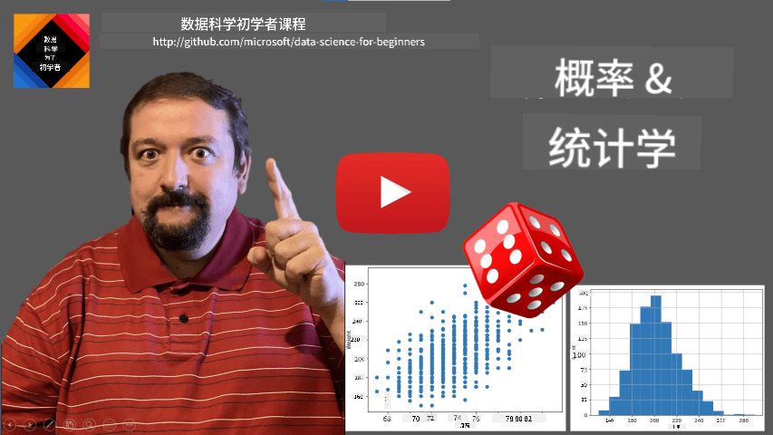
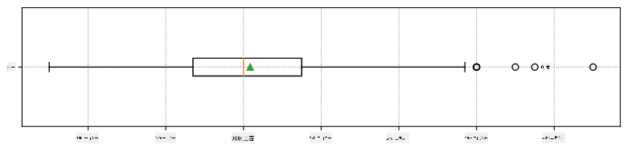
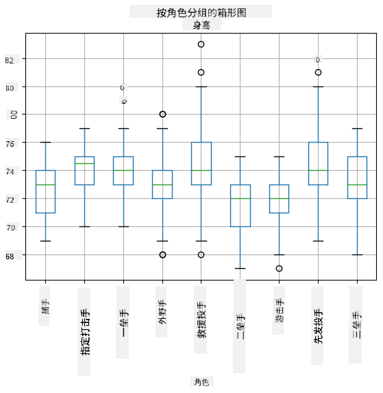
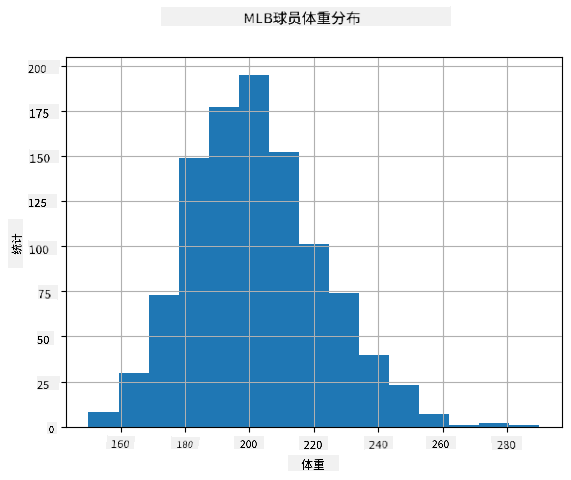
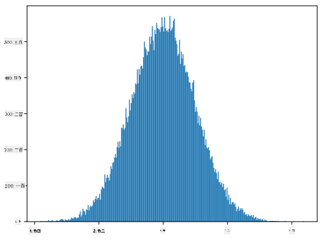
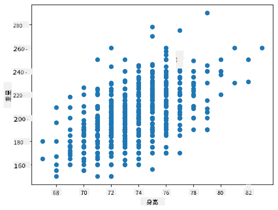

<!--
CO_OP_TRANSLATOR_METADATA:
{
  "original_hash": "ce95884566a74db72572cd51f0cb25ad",
  "translation_date": "2025-09-06T13:01:37+00:00",
  "source_file": "1-Introduction/04-stats-and-probability/README.md",
  "language_code": "zh"
}
-->
# 统计与概率简要介绍

| ](../../sketchnotes/04-Statistics-Probability.png)|
|:---:|
| 统计与概率 - _由 [@nitya](https://twitter.com/nitya) 绘制的速记图_ |

统计学和概率论是数学中两个密切相关的领域，与数据科学高度相关。虽然在没有深厚数学知识的情况下也可以处理数据，但了解一些基本概念仍然是有益的。在这里，我们将提供一个简短的介绍，帮助您入门。

[](https://youtu.be/Z5Zy85g4Yjw)

## [课前测验](https://ff-quizzes.netlify.app/en/ds/quiz/6)

## 概率与随机变量

**概率** 是一个介于 0 和 1 之间的数字，用来表示某个 **事件** 的可能性。它定义为正结果（导致事件发生的结果）的数量除以总结果数量，前提是所有结果的可能性相等。例如，当我们掷骰子时，得到偶数的概率是 3/6 = 0.5。

谈到事件时，我们使用 **随机变量**。例如，表示掷骰子时得到的数字的随机变量可以取值 1 到 6。1 到 6 的数字集合称为 **样本空间**。我们可以讨论随机变量取某个值的概率，例如 P(X=3)=1/6。

上述例子中的随机变量称为 **离散型**，因为它有一个可计数的样本空间，即可以枚举的单独值。有些情况下，样本空间是实数范围或整个实数集。这类变量称为 **连续型**。一个很好的例子是公交车到达的时间。

## 概率分布

对于离散随机变量，可以通过函数 P(X) 简单地描述每个事件的概率。对于样本空间 *S* 中的每个值 *s*，它会给出一个介于 0 和 1 之间的数字，并且所有事件的 P(X=s) 值的总和为 1。

最著名的离散分布是 **均匀分布**，其中样本空间有 N 个元素，每个元素的概率相等，为 1/N。

描述连续变量的概率分布更为复杂，这些变量的值来自某个区间 [a,b] 或整个实数集 ℝ。考虑公交车到达时间的情况。实际上，对于每个确切的到达时间 *t*，公交车恰好在该时间到达的概率是 0！

> 现在您知道了概率为 0 的事件是会发生的，而且非常频繁！至少每次公交车到达时都是如此！

我们只能讨论变量落入某个值区间的概率，例如 P(t<sub>1</sub>≤X<t<sub>2</sub>)。在这种情况下，概率分布由 **概率密度函数** p(x) 描述，其满足：


连续型均匀分布是均匀分布的连续版本，定义在有限区间内。值 X 落入长度为 l 的区间的概率与 l 成正比，最大为 1。

另一个重要的分布是 **正态分布**，我们将在下面详细讨论。

## 均值、方差与标准差

假设我们从随机变量 X 中抽取了 n 个样本：x<sub>1</sub>, x<sub>2</sub>, ..., x<sub>n</sub>。我们可以用传统方式定义序列的 **均值**（或 **算术平均值**）为 (x<sub>1</sub>+x<sub>2</sub>+...+x<sub>n</sub>)/n。当样本量增加（即 n→∞），我们将得到分布的均值（也称为 **期望值**）。我们用 **E**(x) 表示期望值。

> 可以证明，对于任何离散分布，其值为 {x<sub>1</sub>, x<sub>2</sub>, ..., x<sub>N</sub>}，对应的概率为 p<sub>1</sub>, p<sub>2</sub>, ..., p<sub>N</sub>，期望值为 E(X)=x<sub>1</sub>p<sub>1</sub>+x<sub>2</sub>p<sub>2</sub>+...+x<sub>N</sub>p<sub>N</sub>。

为了确定值的分布范围，我们可以计算方差 σ<sup>2</sup> = ∑(x<sub>i</sub> - μ)<sup>2</sup>/n，其中 μ 是序列的均值。值 σ 称为 **标准差**，而 σ<sup>2</sup> 称为 **方差**。

## 众数、中位数与四分位数

有时，均值并不能充分代表数据的“典型”值。例如，当存在一些极端值完全超出范围时，它们可能会影响均值。另一个很好的指标是 **中位数**，即一半数据点低于该值，另一半高于该值。

为了帮助我们理解数据分布，可以讨论 **四分位数**：

* 第一四分位数（Q1）：25% 的数据低于该值
* 第三四分位数（Q3）：75% 的数据低于该值

我们可以用一个称为 **箱形图** 的图表来直观表示中位数和四分位数之间的关系：


在这里，我们还计算了 **四分位距** IQR=Q3-Q1，以及所谓的 **异常值**——位于区间 [Q1-1.5*IQR,Q3+1.5*IQR] 之外的值。

对于包含少量可能值的有限分布，一个好的“典型”值是出现频率最高的值，称为 **众数**。它通常应用于分类数据，例如颜色。考虑一种情况，我们有两组人——一组强烈偏爱红色，另一组偏爱蓝色。如果我们用数字编码颜色，最喜欢的颜色的均值可能会落在橙色-绿色光谱之间，这并不能反映任何一组的实际偏好。然而，众数可能是其中一种颜色，或者两种颜色（如果投票人数相等，在这种情况下我们称样本为 **多众型**）。

## 真实世界数据

当我们分析真实世界的数据时，它们通常不是严格意义上的随机变量，因为我们并未进行未知结果的实验。例如，考虑一组棒球运动员及其身体数据，如身高、体重和年龄。这些数字并不完全随机，但我们仍然可以应用相同的数学概念。例如，一组人的体重可以被视为从某个随机变量中抽取的一组值。以下是来自 [美国职业棒球大联盟](http://mlb.mlb.com/index.jsp) 的实际棒球运动员体重序列，数据来源于 [此数据集](http://wiki.stat.ucla.edu/socr/index.php/SOCR_Data_MLB_HeightsWeights)（为方便起见，仅显示前 20 个值）：

```
[180.0, 215.0, 210.0, 210.0, 188.0, 176.0, 209.0, 200.0, 231.0, 180.0, 188.0, 180.0, 185.0, 160.0, 180.0, 185.0, 197.0, 189.0, 185.0, 219.0]
```

> **注意**：要查看使用此数据集的示例，请查看 [配套笔记本](notebook.ipynb)。本课程中还有许多挑战，您可以通过向该笔记本添加代码来完成它们。如果您不确定如何操作数据，请不要担心——我们稍后会回到使用 Python 处理数据的部分。如果您不知道如何在 Jupyter Notebook 中运行代码，请查看 [这篇文章](https://soshnikov.com/education/how-to-execute-notebooks-from-github/)。

以下是显示我们数据的均值、中位数和四分位数的箱形图：



由于我们的数据包含关于不同球员 **角色** 的信息，我们还可以按角色绘制箱形图——这将帮助我们了解参数值在不同角色之间的差异。这次我们考虑身高：



此图表表明，平均而言，一垒手的身高高于二垒手的身高。在本课程后面，我们将学习如何更正式地验证这一假设，以及如何证明我们的数据在统计上显著。

> 在处理真实世界数据时，我们假设所有数据点是从某个概率分布中抽取的样本。这个假设使我们能够应用机器学习技术并构建有效的预测模型。

为了查看我们数据的分布，我们可以绘制一个称为 **直方图** 的图表。X 轴包含多个不同的体重区间（即 **箱**），而 Y 轴显示我们的随机变量样本落入某个区间的次数。



从这个直方图可以看出，所有值都集中在某个平均体重附近，离平均体重越远，出现该体重值的次数越少。也就是说，棒球运动员的体重与平均体重差异很大的可能性非常小。体重的方差显示了体重与平均体重可能的差异程度。

> 如果我们取其他人（非棒球联盟成员）的体重，分布可能会有所不同。然而，分布的形状会保持一致，但均值和方差会发生变化。因此，如果我们在棒球运动员上训练模型，当应用于大学学生时可能会产生错误结果，因为底层分布不同。

## 正态分布

我们上面看到的体重分布非常典型，许多真实世界的测量值遵循相同类型的分布，但均值和方差不同。这种分布称为 **正态分布**，在统计学中具有非常重要的作用。

使用正态分布是生成潜在棒球运动员随机体重的正确方法。一旦我们知道均值 `mean` 和标准差 `std`，我们可以通过以下方式生成 1000 个体重样本：

```python
samples = np.random.normal(mean,std,1000)
```

如果我们绘制生成样本的直方图，我们会看到与上图非常相似的图像。如果我们增加样本数量和箱数量，我们可以生成更接近理想的正态分布图像：



*均值=0，标准差=1 的正态分布*

## 置信区间

当我们谈论棒球运动员的体重时，我们假设存在某个 **随机变量 W**，它对应于所有棒球运动员体重的理想概率分布（即 **总体**）。我们的体重序列对应于所有棒球运动员的一个子集，我们称之为 **样本**。一个有趣的问题是，我们能否知道 W 的分布参数，即总体的均值和方差？

最简单的答案是计算样本的均值和方差。然而，可能发生的情况是我们的随机样本不能准确代表完整总体。因此，谈论 **置信区间** 是有意义的。

> **置信区间** 是根据我们的样本估计总体真实均值的范围，其准确性具有一定的概率（或 **置信水平**）。

假设我们有一个样本 X

1</sub>, ..., X<sub>n</sub> 来自我们的分布。每次从分布中抽取样本时，我们都会得到不同的均值 μ。因此，μ 可以被视为一个随机变量。一个置信度为 p 的 **置信区间** 是一对值 (L<sub>p</sub>, R<sub>p</sub>)，使得 **P**(L<sub>p</sub>≤μ≤R<sub>p</sub>) = p，即测得的均值落在该区间内的概率等于 p。

详细讨论如何计算这些置信区间超出了我们的简短介绍范围。更多细节可以参考 [维基百科](https://en.wikipedia.org/wiki/Confidence_interval)。简而言之，我们定义了计算样本均值相对于总体真实均值的分布，这被称为 **学生分布**。

> **有趣的事实**：学生分布以数学家 William Sealy Gosset 的笔名 "Student" 命名。他在 Guinness 啤酒厂工作，根据一种说法，他的雇主不希望公众知道他们使用统计测试来确定原材料的质量。

如果我们想以置信度 p 估计总体均值 μ，我们需要取学生分布 A 的 *(1-p)/2 分位数*，这可以从表中查得，或者通过统计软件（如 Python、R 等）的内置函数计算。然后 μ 的区间为 X±A*D/√n，其中 X 是样本的均值，D 是标准差。

> **注意**：我们还省略了一个重要概念 [自由度](https://en.wikipedia.org/wiki/Degrees_of_freedom_(statistics)) 的讨论，这在学生分布中非常重要。您可以参考更完整的统计学书籍以更深入地理解这一概念。

关于体重和身高的置信区间计算示例可以在 [配套笔记本](notebook.ipynb) 中找到。

| p   | 体重均值       |
|-----|---------------|
| 0.85 | 201.73±0.94  |
| 0.90 | 201.73±1.08  |
| 0.95 | 201.73±1.28  |

请注意，置信概率越高，置信区间越宽。

## 假设检验

在我们的棒球运动员数据集中，有不同的球员角色，可以总结如下（查看 [配套笔记本](notebook.ipynb) 以了解如何计算此表）：

| 角色              | 身高       | 体重       | 数量 |
|-------------------|------------|------------|------|
| 捕手              | 72.723684  | 204.328947 | 76   |
| 指定击球手        | 74.222222  | 220.888889 | 18   |
| 一垒手            | 74.000000  | 213.109091 | 55   |
| 外野手            | 73.010309  | 199.113402 | 194  |
| 救援投手          | 74.374603  | 203.517460 | 315  |
| 二垒手            | 71.362069  | 184.344828 | 58   |
| 游击手            | 71.903846  | 182.923077 | 52   |
| 先发投手          | 74.719457  | 205.163636 | 221  |
| 三垒手            | 73.044444  | 200.955556 | 45   |

我们可以注意到，一垒手的平均身高高于二垒手。因此，我们可能会得出结论：**一垒手比二垒手高**。

> 这个陈述被称为 **假设**，因为我们并不知道这一事实是否确实为真。

然而，我们并不总是能轻易得出这个结论。从上面的讨论中我们知道，每个均值都有一个相关的置信区间，因此这种差异可能只是统计误差。我们需要更正式的方法来检验我们的假设。

让我们分别计算一垒手和二垒手身高的置信区间：

| 置信度 | 一垒手         | 二垒手         |
|--------|---------------|---------------|
| 0.85   | 73.62..74.38  | 71.04..71.69  |
| 0.90   | 73.56..74.44  | 70.99..71.73  |
| 0.95   | 73.47..74.53  | 70.92..71.81  |

我们可以看到，在任何置信度下，这些区间都没有重叠。这证明了一垒手比二垒手高的假设。

更正式地说，我们要解决的问题是确定 **两个概率分布是否相同**，或者至少它们的参数是否相同。根据分布的不同，我们需要使用不同的检验方法。如果我们知道分布是正态分布，我们可以应用 **[学生 t 检验](https://en.wikipedia.org/wiki/Student%27s_t-test)**。

在学生 t 检验中，我们计算所谓的 **t 值**，它表示均值之间的差异，同时考虑方差。研究表明，t 值服从 **学生分布**，这使我们能够为给定的置信水平 **p** 找到阈值（可以通过计算或查阅数值表获得）。然后我们将 t 值与该阈值进行比较，以接受或拒绝假设。

在 Python 中，我们可以使用 **SciPy** 包，其中包括 `ttest_ind` 函数（以及许多其他有用的统计函数！）。它为我们计算 t 值，并反向查找置信 p 值，这样我们只需查看置信度即可得出结论。

例如，我们比较一垒手和二垒手身高的结果如下：
```python
from scipy.stats import ttest_ind

tval, pval = ttest_ind(df.loc[df['Role']=='First_Baseman',['Height']], df.loc[df['Role']=='Designated_Hitter',['Height']],equal_var=False)
print(f"T-value = {tval[0]:.2f}\nP-value: {pval[0]}")
```
```
T-value = 7.65
P-value: 9.137321189738925e-12
```
在我们的例子中，p 值非常低，这意味着有强有力的证据支持一垒手更高。

此外，还有其他类型的假设我们可能想要检验，例如：
* 验证某个样本是否服从某种分布。在我们的例子中，我们假设身高服从正态分布，但这需要正式的统计验证。
* 验证样本的均值是否与某个预定义值相符。
* 比较多个样本的均值（例如，不同年龄组的幸福感水平差异）。

## 大数法则和中心极限定理

正态分布如此重要的原因之一是 **中心极限定理**。假设我们有一个独立的 N 个值 X<sub>1</sub>, ..., X<sub>N</sub> 的大样本，这些值来自任何分布，均值为 μ，方差为 σ<sup>2</sup>。那么，当 N 足够大时（换句话说，当 N→∞），均值 Σ<sub>i</sub>X<sub>i</sub> 将服从正态分布，均值为 μ，方差为 σ<sup>2</sup>/N。

> 另一种解释中心极限定理的方法是，无论分布如何，当你计算任意随机变量值之和的均值时，最终都会得到正态分布。

从中心极限定理还可以得出，当 N→∞ 时，样本均值等于 μ 的概率趋于 1。这被称为 **大数法则**。

## 协方差与相关性

数据科学的任务之一是发现数据之间的关系。当两个序列在同一时间表现出相似的行为时，我们称它们 **相关**，即它们要么同时上升/下降，要么一个序列上升时另一个下降，反之亦然。换句话说，这两个序列之间似乎存在某种关系。

> 相关性并不一定表示两个序列之间存在因果关系；有时两个变量可能依赖于某个外部原因，或者它们的相关性纯属偶然。然而，强烈的数学相关性是两个变量某种程度上相关的良好指示。

从数学上讲，显示两个随机变量之间关系的主要概念是 **协方差**，其计算公式为：Cov(X,Y) = **E**\[(X-**E**(X))(Y-**E**(Y))\]。我们计算两个变量偏离其均值的偏差，然后将这些偏差相乘。如果两个变量一起偏离，乘积将始终为正值，最终得到正协方差。如果两个变量不同步偏离（即一个低于平均值时另一个高于平均值），我们将始终得到负值，最终得到负协方差。如果偏差无关，它们将大致相加为零。

协方差的绝对值并不能告诉我们相关性的强弱，因为它取决于实际值的大小。为了归一化，我们可以将协方差除以两个变量的标准差，得到 **相关性**。相关性的好处是它始终在 [-1,1] 范围内，其中 1 表示强正相关，-1 表示强负相关，0 表示完全无相关（变量独立）。

**示例**：我们可以计算棒球运动员数据集中体重和身高之间的相关性：
```python
print(np.corrcoef(weights,heights))
```
结果，我们得到如下 **相关性矩阵**：
```
array([[1.        , 0.52959196],
       [0.52959196, 1.        ]])
```

> 相关性矩阵 C 可以为任意数量的输入序列 S<sub>1</sub>, ..., S<sub>n</sub> 计算。C<sub>ij</sub> 的值是 S<sub>i</sub> 和 S<sub>j</sub> 之间的相关性，对角线元素始终为 1（即 S<sub>i</sub> 的自相关性）。

在我们的例子中，值 0.53 表明一个人的体重和身高之间存在一定的相关性。我们还可以绘制一个散点图，将一个值与另一个值进行比较，以直观地观察关系：



> 更多关于相关性和协方差的示例可以在 [配套笔记本](notebook.ipynb) 中找到。

## 总结

在本节中，我们学习了：

* 数据的基本统计属性，例如均值、方差、众数和四分位数
* 随机变量的不同分布，包括正态分布
* 如何找到不同属性之间的相关性
* 如何使用数学和统计学的严谨工具来验证一些假设
* 如何根据数据样本计算随机变量的置信区间

虽然这绝不是概率和统计学中所有主题的详尽列表，但它应该足以为您进入本课程打下良好的基础。

## 🚀 挑战

使用笔记本中的示例代码测试以下假设：
1. 一垒手比二垒手年龄更大
2. 一垒手比三垒手更高
3. 游击手比二垒手更高

## [课后测验](https://ff-quizzes.netlify.app/en/ds/quiz/7)

## 复习与自学

概率和统计学是一个非常广泛的主题，它值得开设一门独立的课程。如果您有兴趣深入学习理论，可以继续阅读以下书籍：

1. [纽约大学 Carlos Fernandez-Granda](https://cims.nyu.edu/~cfgranda/) 的优秀讲义 [数据科学的概率与统计](https://cims.nyu.edu/~cfgranda/pages/stuff/probability_stats_for_DS.pdf)（在线可用）
2. [Peter 和 Andrew Bruce. 数据科学实用统计](https://www.oreilly.com/library/view/practical-statistics-for/9781491952955/) [[R 示例代码](https://github.com/andrewgbruce/statistics-for-data-scientists)]。
3. [James D. Miller. 数据科学统计学](https://www.packtpub.com/product/statistics-for-data-science/9781788290678) [[R 示例代码](https://github.com/PacktPublishing/Statistics-for-Data-Science)]

## 作业

[小型糖尿病研究](assignment.md)

## 致谢

本课程由 [Dmitry Soshnikov](http://soshnikov.com) 倾情创作。

---

**免责声明**：  
本文档使用AI翻译服务[Co-op Translator](https://github.com/Azure/co-op-translator)进行翻译。尽管我们努力确保准确性，但请注意，自动翻译可能包含错误或不准确之处。应以原始语言的文档作为权威来源。对于关键信息，建议使用专业人工翻译。对于因使用本翻译而引起的任何误解或误读，我们概不负责。