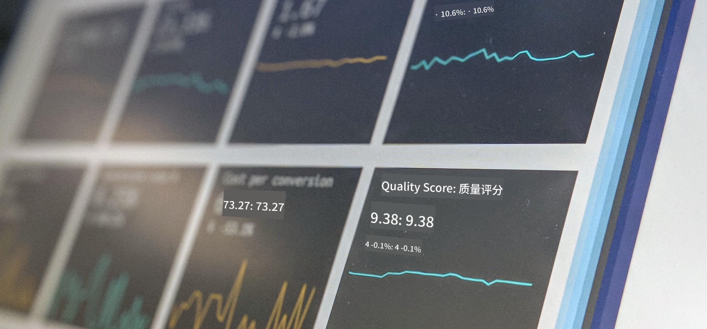

<!--
CO_OP_TRANSLATOR_METADATA:
{
  "original_hash": "696a8474a01054281704cbfb09148949",
  "translation_date": "2025-08-25T16:37:59+00:00",
  "source_file": "1-Introduction/README.md",
  "language_code": "zh"
}
-->
# 数据科学简介

  
> 图片由 <a href="https://unsplash.com/@dawson2406?utm_source=unsplash&utm_medium=referral&utm_content=creditCopyText">Stephen Dawson</a> 提供，来自 <a href="https://unsplash.com/s/photos/data?utm_source=unsplash&utm_medium=referral&utm_content=creditCopyText">Unsplash</a>  

在这些课程中，您将了解数据科学的定义，并学习数据科学家必须考虑的伦理问题。您还将学习数据的定义，并对统计学和概率论有一些初步了解，这些是数据科学的核心学术领域。

### 主题

1. [定义数据科学](01-defining-data-science/README.md)  
2. [数据科学伦理](02-ethics/README.md)  
3. [定义数据](03-defining-data/README.md)  
4. [统计与概率简介](04-stats-and-probability/README.md)  

### 致谢

这些课程由 [Nitya Narasimhan](https://twitter.com/nitya) 和 [Dmitry Soshnikov](https://twitter.com/shwars) 倾注 ❤️ 编写完成。

**免责声明**：  
本文档使用AI翻译服务[Co-op Translator](https://github.com/Azure/co-op-translator)进行翻译。尽管我们努力确保翻译的准确性，但请注意，自动翻译可能包含错误或不准确之处。原始语言的文档应被视为权威来源。对于重要信息，建议使用专业人工翻译。我们不对因使用此翻译而产生的任何误解或误读承担责任。