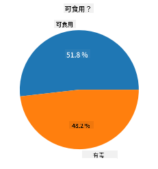
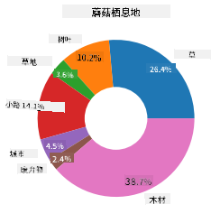
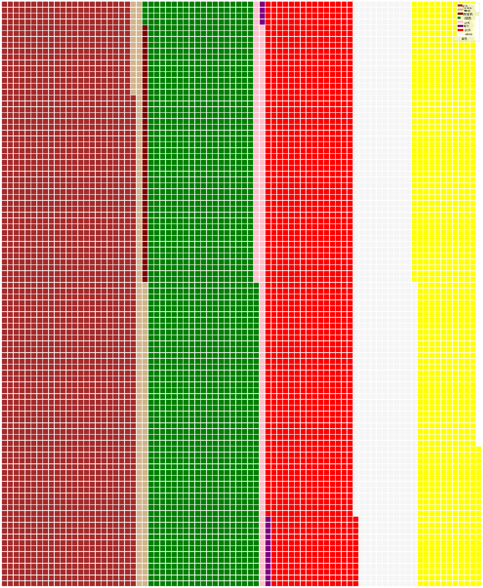

<!--
CO_OP_TRANSLATOR_METADATA:
{
  "original_hash": "cc490897ee2d276870472bcb31602d03",
  "translation_date": "2025-09-04T12:21:35+00:00",
  "source_file": "3-Data-Visualization/11-visualization-proportions/README.md",
  "language_code": "zh"
}
-->
# 可视化比例

| 绘制的草图笔记](../../sketchnotes/11-Visualizing-Proportions.png)|
|:---:|
|可视化比例 - _草图笔记由 [@nitya](https://twitter.com/nitya) 绘制_ |

在本课中，你将使用一个以自然为主题的数据集来可视化比例，例如在一个关于蘑菇的数据集中，不同类型的真菌数量占比。让我们通过一个来自 Audubon 的数据集来探索这些迷人的真菌，该数据集列出了 Agaricus 和 Lepiota 家族中 23 种有鳃蘑菇的详细信息。你将尝试一些有趣的可视化方法，例如：

- 饼图 🥧
- 环形图 🍩
- 华夫图 🧇

> 💡 一个非常有趣的项目 [Charticulator](https://charticulator.com) 由微软研究院开发，提供了一个免费的拖放式数据可视化界面。在他们的一个教程中也使用了这个蘑菇数据集！因此，你可以一边探索数据一边学习这个库：[Charticulator 教程](https://charticulator.com/tutorials/tutorial4.html)。

## [课后测验](https://ff-quizzes.netlify.app/en/ds/)

## 了解你的蘑菇 🍄

蘑菇非常有趣。让我们导入一个数据集来研究它们：

```python
import pandas as pd
import matplotlib.pyplot as plt
mushrooms = pd.read_csv('../../data/mushrooms.csv')
mushrooms.head()
```
一个包含丰富分析数据的表格被打印出来：


| 类别       | 菌盖形状 | 菌盖表面 | 菌盖颜色 | 是否有瘀伤 | 气味    | 鳃附着方式   | 鳃间距     | 鳃大小   | 鳃颜色   | 茎形状     | 茎根部     | 茎环上表面             | 茎环下表面             | 茎环上颜色             | 茎环下颜色             | 幔类型     | 幔颜色     | 环数量     | 环类型     | 孢子印颜色         | 种群       | 栖息地     |
| --------- | --------- | --------- | --------- | --------- | ------- | ----------- | ----------- | --------- | --------- | --------- | --------- | -------------------- | -------------------- | -------------------- | -------------------- | --------- | --------- | --------- | --------- | --------------- | --------- | --------- |
| 有毒      | 凸形      | 光滑      | 棕色      | 有瘀伤    | 刺鼻    | 游离         | 紧密         | 狭窄      | 黑色      | 膨大       | 等粗       | 光滑                 | 光滑                 | 白色                 | 白色                 | 部分       | 白色       | 一个       | 下垂       | 黑色             | 分散       | 城市       |
| 可食用    | 凸形      | 光滑      | 黄色      | 有瘀伤    | 杏仁味  | 游离         | 紧密         | 宽大      | 黑色      | 膨大       | 棍状       | 光滑                 | 光滑                 | 白色                 | 白色                 | 部分       | 白色       | 一个       | 下垂       | 棕色             | 众多       | 草地       |
| 可食用    | 钟形      | 光滑      | 白色      | 有瘀伤    | 茴香味  | 游离         | 紧密         | 宽大      | 棕色      | 膨大       | 棍状       | 光滑                 | 光滑                 | 白色                 | 白色                 | 部分       | 白色       | 一个       | 下垂       | 棕色             | 众多       | 草原       |
| 有毒      | 凸形      | 鳞片状    | 白色      | 有瘀伤    | 刺鼻    | 游离         | 紧密         | 狭窄      | 棕色      | 膨大       | 等粗       | 光滑                 | 光滑                 | 白色                 | 白色                 | 部分       | 白色       | 一个       | 下垂       | 黑色             | 分散       | 城市       |

你会立刻注意到，所有数据都是文本格式。为了在图表中使用这些数据，你需要将其转换。事实上，大部分数据是以对象形式表示的：

```python
print(mushrooms.select_dtypes(["object"]).columns)
```

输出为：

```output
Index(['class', 'cap-shape', 'cap-surface', 'cap-color', 'bruises', 'odor',
       'gill-attachment', 'gill-spacing', 'gill-size', 'gill-color',
       'stalk-shape', 'stalk-root', 'stalk-surface-above-ring',
       'stalk-surface-below-ring', 'stalk-color-above-ring',
       'stalk-color-below-ring', 'veil-type', 'veil-color', 'ring-number',
       'ring-type', 'spore-print-color', 'population', 'habitat'],
      dtype='object')
```
将这些数据转换，将 '类别' 列转换为分类数据：

```python
cols = mushrooms.select_dtypes(["object"]).columns
mushrooms[cols] = mushrooms[cols].astype('category')
```

```python
edibleclass=mushrooms.groupby(['class']).count()
edibleclass
```

现在，如果打印出蘑菇数据，你会看到它已经根据有毒/可食用类别分组：

|           | 菌盖形状 | 菌盖表面 | 菌盖颜色 | 是否有瘀伤 | 气味 | 鳃附着方式   | 鳃间距     | 鳃大小   | 鳃颜色   | 茎形状     | ... | 茎环下表面             | 茎环上颜色             | 茎环下颜色             | 幔类型     | 幔颜色     | 环数量     | 环类型     | 孢子印颜色         | 种群       | 栖息地     |
| --------- | --------- | --------- | --------- | --------- | ---- | ----------- | ----------- | --------- | --------- | --------- | --- | -------------------- | -------------------- | -------------------- | --------- | --------- | --------- | --------- | --------------- | --------- | --------- |
| 类别       |           |           |           |           |      |             |             |           |           |           |     |                      |                      |                      |           |           |           |           |                 |           |           |
| 可食用    | 4208      | 4208      | 4208      | 4208      | 4208 | 4208        | 4208        | 4208      | 4208      | 4208      | ... | 4208                 | 4208                 | 4208                 | 4208      | 4208      | 4208      | 4208      | 4208            | 4208      | 4208      |
| 有毒      | 3916      | 3916      | 3916      | 3916      | 3916 | 3916        | 3916        | 3916      | 3916      | 3916      | ... | 3916                 | 3916                 | 3916                 | 3916      | 3916      | 3916      | 3916      | 3916            | 3916      | 3916      |

如果按照此表中的顺序创建类别标签，你可以绘制一个饼图：

## 饼图！

```python
labels=['Edible','Poisonous']
plt.pie(edibleclass['population'],labels=labels,autopct='%.1f %%')
plt.title('Edible?')
plt.show()
```
瞧，一个展示蘑菇数据中两类比例的饼图。这里确保标签数组的顺序正确非常重要，因此一定要验证标签的顺序！



## 环形图！

环形图是饼图的一种变体，中间有一个空洞。让我们用这种方法查看数据。

看看蘑菇生长的各种栖息地：

```python
habitat=mushrooms.groupby(['habitat']).count()
habitat
```
这里，你将数据按栖息地分组。共有 7 种栖息地，因此将它们用作环形图的标签：

```python
labels=['Grasses','Leaves','Meadows','Paths','Urban','Waste','Wood']

plt.pie(habitat['class'], labels=labels,
        autopct='%1.1f%%', pctdistance=0.85)
  
center_circle = plt.Circle((0, 0), 0.40, fc='white')
fig = plt.gcf()

fig.gca().add_artist(center_circle)
  
plt.title('Mushroom Habitats')
  
plt.show()
```



这段代码绘制了一个图表和一个中心圆，然后将中心圆添加到图表中。通过更改 `0.40` 的值可以调整中心圆的宽度。

环形图可以通过多种方式调整标签以提高可读性。更多信息请参考[文档](https://matplotlib.org/stable/gallery/pie_and_polar_charts/pie_and_donut_labels.html?highlight=donut)。

现在你已经知道如何分组数据并以饼图或环形图显示，可以尝试其他类型的图表。试试华夫图，这是一种不同的数量可视化方式。

## 华夫图！

华夫图是一种以二维方块阵列形式展示数量的图表。试着用这个数据集可视化蘑菇菌盖颜色的不同数量。为此，你需要安装一个名为 [PyWaffle](https://pypi.org/project/pywaffle/) 的辅助库并使用 Matplotlib：

```python
pip install pywaffle
```

选择一部分数据进行分组：

```python
capcolor=mushrooms.groupby(['cap-color']).count()
capcolor
```

通过创建标签并分组数据来绘制华夫图：

```python
import pandas as pd
import matplotlib.pyplot as plt
from pywaffle import Waffle
  
data ={'color': ['brown', 'buff', 'cinnamon', 'green', 'pink', 'purple', 'red', 'white', 'yellow'],
    'amount': capcolor['class']
     }
  
df = pd.DataFrame(data)
  
fig = plt.figure(
    FigureClass = Waffle,
    rows = 100,
    values = df.amount,
    labels = list(df.color),
    figsize = (30,30),
    colors=["brown", "tan", "maroon", "green", "pink", "purple", "red", "whitesmoke", "yellow"],
)
```

使用华夫图，你可以清楚地看到这个蘑菇数据集中菌盖颜色的比例。有趣的是，有许多绿色菌盖的蘑菇！



✅ PyWaffle 支持在图表中使用任何 [Font Awesome](https://fontawesome.com/) 提供的图标。尝试用图标代替方块，创建更有趣的华夫图。

在本课中，你学习了三种可视化比例的方法。首先，你需要将数据分组为类别，然后决定哪种方式最适合展示数据——饼图、环形图或华夫图。所有这些方法都能快速为用户提供数据集的快照。

## 🚀 挑战

尝试在 [Charticulator](https://charticulator.com) 中重新创建这些有趣的图表。
## [课后测验](https://purple-hill-04aebfb03.1.azurestaticapps.net/quiz/21)

## 复习与自学

有时很难决定何时使用饼图、环形图或华夫图。以下是一些相关文章：

https://www.beautiful.ai/blog/battle-of-the-charts-pie-chart-vs-donut-chart

https://medium.com/@hypsypops/pie-chart-vs-donut-chart-showdown-in-the-ring-5d24fd86a9ce

https://www.mit.edu/~mbarker/formula1/f1help/11-ch-c6.htm

https://medium.datadriveninvestor.com/data-visualization-done-the-right-way-with-tableau-waffle-chart-fdf2a19be402

通过研究，找到更多关于这个选择的相关信息。

## 作业

[在 Excel 中尝试](assignment.md)

---

**免责声明**：  
本文档使用AI翻译服务[Co-op Translator](https://github.com/Azure/co-op-translator)进行翻译。尽管我们努力确保准确性，但请注意，自动翻译可能包含错误或不准确之处。应以原始语言的文档作为权威来源。对于关键信息，建议使用专业人工翻译。对于因使用本翻译而引起的任何误解或误读，我们概不负责。