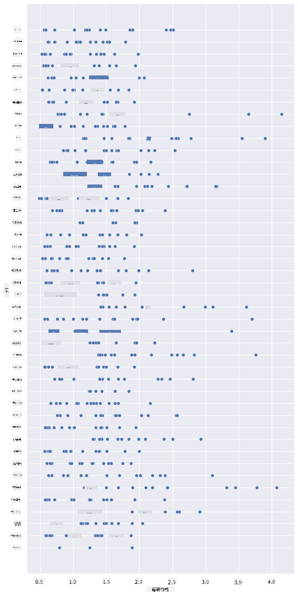
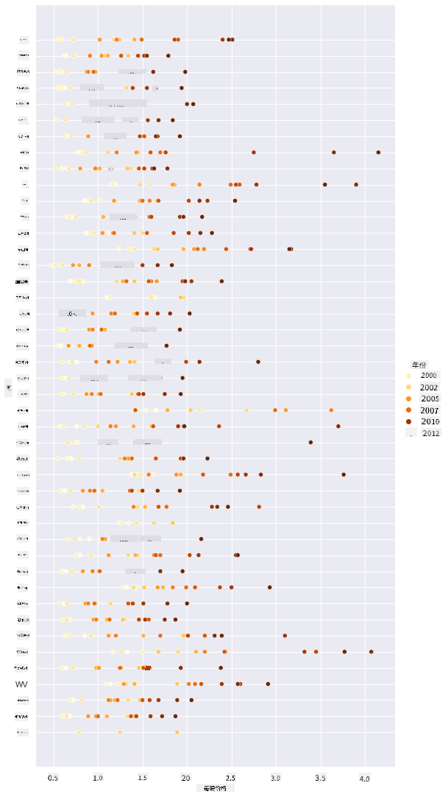
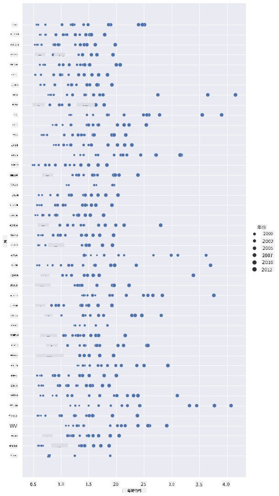
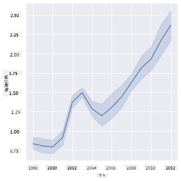
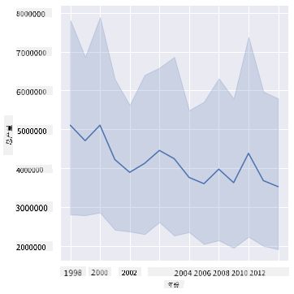
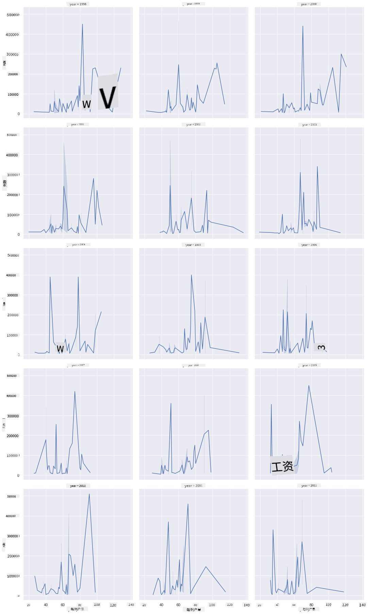
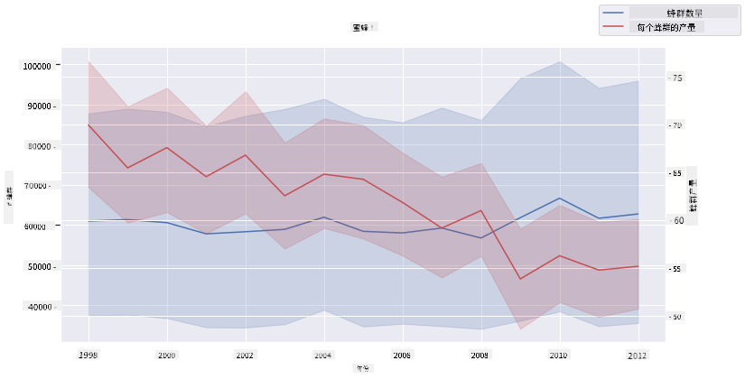

<!--
CO_OP_TRANSLATOR_METADATA:
{
  "original_hash": "b29e427401499e81f4af55a8c4afea76",
  "translation_date": "2025-09-04T12:23:45+00:00",
  "source_file": "3-Data-Visualization/12-visualization-relationships/README.md",
  "language_code": "zh"
}
-->
# 可视化关系：关于蜂蜜的一切 🍯

| ](../../sketchnotes/12-Visualizing-Relationships.png)|
|:---:|
|可视化关系 - _Sketchnote by [@nitya](https://twitter.com/nitya)_ |

延续我们研究的自然主题，让我们探索一些有趣的可视化方法，展示不同类型蜂蜜之间的关系。这些数据集来源于[美国农业部](https://www.nass.usda.gov/About_NASS/index.php)。

这个包含约600项的数据集展示了美国多个州的蜂蜜生产情况。例如，你可以查看每个州从1998到2012年的蜂群数量、每群产量、总产量、库存、每磅价格以及蜂蜜生产的价值，每年每州一行数据。

我们可以通过可视化来展示某个州每年的生产情况与该州蜂蜜价格之间的关系。或者，你也可以可视化各州每群蜂蜜产量之间的关系。这段时间涵盖了2006年首次出现的毁灭性“蜂群崩溃综合症（CCD）”（http://npic.orst.edu/envir/ccd.html），因此这是一个值得研究的数据集。🐝

## [课前测验](https://purple-hill-04aebfb03.1.azurestaticapps.net/quiz/22)

在本课中，你可以使用之前用过的Seaborn库，这是一个很好的工具，用于可视化变量之间的关系。特别有趣的是使用Seaborn的`relplot`函数，它可以快速生成散点图和折线图，用于可视化“[统计关系](https://seaborn.pydata.org/tutorial/relational.html?highlight=relationships)”，帮助数据科学家更好地理解变量之间的关系。

## 散点图

使用散点图展示蜂蜜价格如何逐年在各州演变。Seaborn的`relplot`函数可以方便地对州数据进行分组，并显示分类数据和数值数据的点。

首先导入数据和Seaborn：

```python
import pandas as pd
import matplotlib.pyplot as plt
import seaborn as sns
honey = pd.read_csv('../../data/honey.csv')
honey.head()
```
你会注意到蜂蜜数据中有几个有趣的列，包括年份和每磅价格。让我们按美国州分组来探索这些数据：

| 州   | 蜂群数 | 每群产量 | 总产量   | 库存     | 每磅价格 | 生产价值 | 年份 |
| ----- | ------ | ----------- | --------- | -------- | ---------- | --------- | ---- |
| AL    | 16000  | 71          | 1136000   | 159000   | 0.72       | 818000    | 1998 |
| AZ    | 55000  | 60          | 3300000   | 1485000  | 0.64       | 2112000   | 1998 |
| AR    | 53000  | 65          | 3445000   | 1688000  | 0.59       | 2033000   | 1998 |
| CA    | 450000 | 83          | 37350000  | 12326000 | 0.62       | 23157000  | 1998 |
| CO    | 27000  | 72          | 1944000   | 1594000  | 0.7        | 1361000   | 1998 |

创建一个基础散点图，展示蜂蜜每磅价格与其来源州之间的关系。让`y`轴足够高以显示所有州：

```python
sns.relplot(x="priceperlb", y="state", data=honey, height=15, aspect=.5);
```


现在，用蜂蜜色调展示同样的数据，显示价格如何随着年份变化。你可以通过添加一个“hue”参数来展示逐年变化：

> ✅ 了解更多关于[Seaborn中可用的颜色调色板](https://seaborn.pydata.org/tutorial/color_palettes.html) - 尝试一个美丽的彩虹色调！

```python
sns.relplot(x="priceperlb", y="state", hue="year", palette="YlOrBr", data=honey, height=15, aspect=.5);
```


通过这个颜色方案的变化，你可以明显看到蜂蜜每磅价格随着年份的变化有显著的增长趋势。事实上，如果你查看数据中的一个样本集（例如选择亚利桑那州），你会发现价格逐年增长的模式，虽然有少数例外：

| 州   | 蜂群数 | 每群产量 | 总产量   | 库存     | 每磅价格 | 生产价值 | 年份 |
| ----- | ------ | ----------- | --------- | ------- | ---------- | --------- | ---- |
| AZ    | 55000  | 60          | 3300000   | 1485000 | 0.64       | 2112000   | 1998 |
| AZ    | 52000  | 62          | 3224000   | 1548000 | 0.62       | 1999000   | 1999 |
| AZ    | 40000  | 59          | 2360000   | 1322000 | 0.73       | 1723000   | 2000 |
| AZ    | 43000  | 59          | 2537000   | 1142000 | 0.72       | 1827000   | 2001 |
| AZ    | 38000  | 63          | 2394000   | 1197000 | 1.08       | 2586000   | 2002 |
| AZ    | 35000  | 72          | 2520000   | 983000  | 1.34       | 3377000   | 2003 |
| AZ    | 32000  | 55          | 1760000   | 774000  | 1.11       | 1954000   | 2004 |
| AZ    | 36000  | 50          | 1800000   | 720000  | 1.04       | 1872000   | 2005 |
| AZ    | 30000  | 65          | 1950000   | 839000  | 0.91       | 1775000   | 2006 |
| AZ    | 30000  | 64          | 1920000   | 902000  | 1.26       | 2419000   | 2007 |
| AZ    | 25000  | 64          | 1600000   | 336000  | 1.26       | 2016000   | 2008 |
| AZ    | 20000  | 52          | 1040000   | 562000  | 1.45       | 1508000   | 2009 |
| AZ    | 24000  | 77          | 1848000   | 665000  | 1.52       | 2809000   | 2010 |
| AZ    | 23000  | 53          | 1219000   | 427000  | 1.55       | 1889000   | 2011 |
| AZ    | 22000  | 46          | 1012000   | 253000  | 1.79       | 1811000   | 2012 |

另一种可视化这种变化的方法是使用大小而不是颜色。对于色盲用户，这可能是一个更好的选择。编辑你的可视化，显示价格的增长通过点的直径增加来体现：

```python
sns.relplot(x="priceperlb", y="state", size="year", data=honey, height=15, aspect=.5);
```
你可以看到点的大小逐渐增加。



这是否是一个简单的供需关系？由于气候变化和蜂群崩溃等因素，是否每年可购买的蜂蜜减少，从而导致价格上涨？

为了发现数据集中某些变量之间的相关性，让我们探索一些折线图。

## 折线图

问题：蜂蜜每磅价格是否逐年显著上涨？你可以通过创建一个单一折线图来最容易地发现这一点：

```python
sns.relplot(x="year", y="priceperlb", kind="line", data=honey);
```
答案：是的，除了2003年左右有一些例外：



✅ 因为Seaborn在一个折线图中聚合数据，它通过绘制均值和均值周围95%的置信区间来显示“每个x值的多个测量值”。[来源](https://seaborn.pydata.org/tutorial/relational.html)。这种耗时的行为可以通过添加`ci=None`来禁用。

问题：那么，在2003年我们是否也能看到蜂蜜供应的激增？如果你查看逐年的总产量呢？

```python
sns.relplot(x="year", y="totalprod", kind="line", data=honey);
```



答案：并不明显。如果你查看总产量，实际上在那一年似乎有所增加，尽管总体而言蜂蜜的生产量在这些年间是下降的。

问题：在这种情况下，是什么可能导致了2003年蜂蜜价格的激增？

为了发现这一点，你可以探索一个分面网格。

## 分面网格

分面网格可以选择数据集的一个方面（在我们的例子中，你可以选择“年份”，以避免生成过多的分面）。然后Seaborn可以为你选择的x和y坐标生成每个分面的图表，以便更容易进行视觉比较。2003年在这种比较中是否显得特别突出？

通过继续使用`relplot`创建分面网格，正如[Seaborn文档](https://seaborn.pydata.org/generated/seaborn.FacetGrid.html?highlight=facetgrid#seaborn.FacetGrid)推荐的那样。

```python
sns.relplot(
    data=honey, 
    x="yieldpercol", y="numcol",
    col="year", 
    col_wrap=3,
    kind="line"
```
在这个可视化中，你可以比较逐年蜂群产量和蜂群数量，并将列的换行设置为3：



对于这个数据集，逐年和各州之间蜂群数量和产量没有特别显著的变化。是否有其他方法可以找到这两个变量之间的相关性？

## 双折线图

尝试通过将两个折线图叠加在一起来创建多线图，使用Seaborn的'despine'移除顶部和右侧的边框，并使用`ax.twinx` [源自Matplotlib](https://matplotlib.org/stable/api/_as_gen/matplotlib.axes.Axes.twinx.html)。Twins允许图表共享x轴并显示两个y轴。因此，叠加显示每群产量和蜂群数量：

```python
fig, ax = plt.subplots(figsize=(12,6))
lineplot = sns.lineplot(x=honey['year'], y=honey['numcol'], data=honey, 
                        label = 'Number of bee colonies', legend=False)
sns.despine()
plt.ylabel('# colonies')
plt.title('Honey Production Year over Year');

ax2 = ax.twinx()
lineplot2 = sns.lineplot(x=honey['year'], y=honey['yieldpercol'], ax=ax2, color="r", 
                         label ='Yield per colony', legend=False) 
sns.despine(right=False)
plt.ylabel('colony yield')
ax.figure.legend();
```


虽然在2003年没有明显的变化，但这确实让我们以一个稍微乐观的结论结束这节课：尽管蜂群数量总体上在下降，但蜂群数量正在稳定，即使每群产量在减少。

加油，蜜蜂们，加油！

🐝❤️
## 🚀 挑战

在本课中，你学习了更多关于散点图和线网格的其他用途，包括分面网格。挑战自己使用不同的数据集创建一个分面网格，也许是你在之前课程中使用过的数据集。注意创建这些网格需要多长时间，以及你需要如何小心选择要绘制的网格数量。

## [课后测验](https://ff-quizzes.netlify.app/en/ds/)

## 复习与自学

折线图可以很简单也可以很复杂。阅读[Seaborn文档](https://seaborn.pydata.org/generated/seaborn.lineplot.html)，了解构建折线图的各种方法。尝试使用文档中列出的其他方法来增强你在本课中构建的折线图。
## 作业

[深入蜂巢](assignment.md)

---

**免责声明**：  
本文档使用AI翻译服务[Co-op Translator](https://github.com/Azure/co-op-translator)进行翻译。尽管我们努力确保准确性，但请注意，自动翻译可能包含错误或不准确之处。应以原始语言的文档作为权威来源。对于关键信息，建议使用专业人工翻译。对于因使用本翻译而引起的任何误解或误读，我们概不负责。